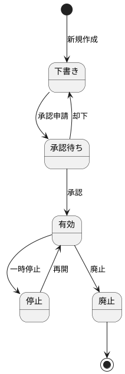
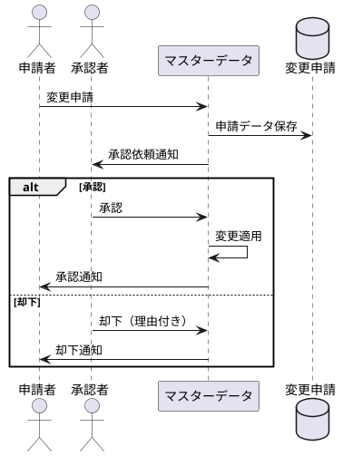

# Apache Pekkoを使用したCQRS/EventSourcingサービス開発

## 記事アウトライン

---

## 【第1部】環境構築編

### 1. イントロダクション
- **目的と対象読者**
  - CQRS/Event Sourcingを実践的に学びたいScala開発者
  - Apache Pekko（旧Akka）への移行を検討している開発者
- **この記事で学べること**
  - Apache Pekkoによるイベントソーシング実装
  - CQRS（コマンドクエリ責任分離）の実践的なアーキテクチャ
  - LocalStackを使用したローカル開発環境構築
- **全体の構成**
  - 第1部：環境構築編（本記事）
  - 第2部：サービス構築編

### 2. アーキテクチャ概要
- **CQRS/Event Sourcingとは**
  - CQRS（コマンドクエリ責任分離）の基本概念
  - Event Sourcingパターンの利点と課題
  - なぜPekkoを選択したか（Akkaからの移行背景）
- **システム構成図**
  - コマンド側：Pekko Actors + DynamoDB
  - クエリ側：PostgreSQL + Slick
  - イベント処理：Lambda + DynamoDB Streams
- **データフローの理解**
  - Mutation → Event生成 → 永続化 → Stream → Lambda → Read Model更新 → Query

### 3. 技術スタックの選定
- **コア技術**
  - Scala 3.6.2の採用理由（型安全性、関数型プログラミング）
  - Apache Pekko 1.1.2（型付きアクター、永続化、クラスター）
- **データストア**
  - DynamoDB：イベントストアとしての利点（スケーラビリティ、可用性）
  - PostgreSQL：Read Modelとしての最適化
- **開発環境**
  - LocalStack：AWS サービスのローカルエミュレーション
  - Docker Compose：インフラストラクチャの一元管理
- **API & シリアライゼーション**
  - GraphQL (Sangria)：型安全なAPI設計
  - Protocol Buffers：効率的なイベントシリアライゼーション

### 4. 開発環境のセットアップ
#### 4.1 前提条件の確認
- Java（OpenJDK 17以降）のインストール
- SBT（1.8以降）のセットアップ
- Docker & Docker Composeのインストール
- awslocal CLIのセットアップ（オプション）

#### 4.2 プロジェクトのクローンとビルド
- リポジトリのクローン
- SBTビルドの実行
- Dockerイメージのビルド（`sbt dockerBuildAll`）

#### 4.3 LocalStackの理解とセットアップ
- LocalStackとは何か
- 設定ファイルの解説（docker-compose-common.yml）
- DynamoDBテーブルの作成（tools/dynamodb-setup/）
- DynamoDB Streamsの設定

#### 4.4 PostgreSQLのセットアップ
- Flywayによるマイグレーション戦略
- スキーマ設計（user_accountsテーブル）
- Slick DAOの自動生成

#### 4.5 Lambda関数のデプロイ
- Read Model Updaterの役割
- LocalStackへのデプロイ手順
- イベントソースマッピングの設定

### 5. 設定管理の体系化
#### 5.1 設定ファイルの階層化
- application.conf（エントリーポイント）
- pcqrses.conf（アプリケーション固有設定）
- pekko.conf（Pekkoフレームワーク設定）
- j5ik2o.conf（DynamoDB永続化プラグイン設定）

#### 5.2 環境変数による設定の上書き
- ローカル開発環境
- テスト環境
- 本番環境への対応

#### 5.3 シリアライゼーション設定
- Protocol Buffersの設定
- カスタムシリアライザの登録
- CBORシリアライゼーション

### 6. 初回起動とヘルスチェック
#### 6.1 シングルノードモードでの起動
- `./scripts/run-single.sh up` の実行
- 起動プロセスの確認
- ログの確認方法

#### 6.2 各サービスの動作確認
- Command API：http://localhost:50501/api/graphql
- Query API：http://localhost:50502/api/graphql
- LocalStack：http://localhost:4566
- PostgreSQL：localhost:5432

#### 6.3 GraphQL Playgroundの使い方
- Playgroundへのアクセス
- スキーマの確認
- 基本的なクエリの実行

### 7. E2Eテストによる動作確認
- E2Eテストスクリプトの実行（`./scripts/test-e2e.sh`）
- テストフローの理解
  1. ヘルスチェック
  2. ユーザー作成（Mutation）
  3. イベント処理待機
  4. データ取得（Query）
  5. 整合性検証
- テストのカスタマイズ（環境変数）

### 8. トラブルシューティング
#### 8.1 よくある問題と解決方法
- LocalStackが起動しない
- Lambda関数がイベントを処理しない
- PostgreSQLに接続できない
- DynamoDBにデータが保存されない
- ポートが既に使用されている

#### 8.2 デバッグ手法
- ログの確認方法
- DynamoDBの内容確認（`awslocal dynamodb scan`）
- PostgreSQLの直接クエリ
- Lambda関数のCloudWatch Logs確認

### 9. 開発ワークフローの確立
- コードフォーマット（`sbt fmt`）
- リントチェック（`sbt lint`）
- テスト実行（`sbt test`）
- カバレッジレポート（`sbt testCoverage`）
- 環境の停止とクリーンアップ

### 10. まとめと次のステップ
- 環境構築で学んだこと
- 第2部（サービス構築編）への導入
  - ドメインモデルの設計
  - イベントソーシングの実装
  - GraphQL APIの構築
  - Read Modelの更新

---

## 【第2部】サービス構築編

### 1. ドメイン駆動設計の基礎
#### 1.1 プロジェクト構造の理解
- モジュール構成の説明
- レイヤードアーキテクチャ
  - Domain層（ドメインロジック）
  - Use Case層（アプリケーションサービス）
  - Interface Adapter層（技術的詳細）

#### 1.2 UserAccountドメインモデルの設計
- 集約ルート（UserAccount）
- 値オブジェクト（UserAccountId、UserAccountName、EmailAddress）
- ドメインイベント（UserAccountEvent）
- ビジネスルールの実装

### 2. イベントソーシングの実装
#### 2.1 ドメインイベントの設計
- イベント定義（Created_V1、Renamed_V1、Deleted_V1）
- イベントバージョニング戦略
- Envelopeパターンの採用理由

#### 2.2 Protocol Buffersによるシリアライゼーション
- .protoファイルの定義
- ScalaPBによるコード生成
- シリアライザの実装（UserAccountEventSerializer）
- スナップショットのシリアライゼーション

#### 2.3 Pekko Persistenceの活用
- EventSourcedBehaviorの実装
- PersistenceIdの設計
- イベントハンドラーの実装
- スナップショット戦略

### 3. コマンド側の実装（書き込みモデル）
#### 3.1 UserAccountAggregateの実装
- 型付きアクターの基礎
- コマンドハンドラー（Create、Rename、Delete）
- イベントハンドラー
- 状態管理（UserAccountAggregateState）

#### 3.2 レジストリパターンの実装
- GenericAggregateRegistryの設計
- ローカルモード vs クラスターモード
- Cluster Shardingの設定
- パッシベーション戦略

#### 3.3 Command API（GraphQL）の実装
- スキーマ定義（TypeDefinitions）
- Mutationリゾルバーの実装
- バリデーション戦略
- エラーハンドリング

### 4. クエリ側の実装（読み取りモデル）
#### 4.1 Read Modelの設計
- PostgreSQLスキーマ設計
- 非正規化の戦略
- Flywayによるマイグレーション管理

#### 4.2 Slick DAOの自動生成
- sbt-dao-generatorの活用
- DAOの生成プロセス
- カスタマイズポイント

#### 4.3 Query API（GraphQL）の実装
- スキーマ定義
- Queryリゾルバーの実装
- 検索機能の実装
- ページネーション

### 5. イベント処理の実装
#### 5.1 Read Model Updater（Lambda）の実装
- Lambda Handlerの構造
- イベントのデシリアライゼーション
- PersistentReprの処理
- PostgreSQLへの更新処理

#### 5.2 DynamoDB Streamsの統合
- Streamsの設定
- イベントソースマッピング
- リトライ戦略
- エラーハンドリング

#### 5.3 結果整合性の管理
- 非同期処理の課題
- イベント順序の保証
- 冪等性の実装
- トランザクション境界

### 6. 設定管理とデプロイ
#### 6.1 CommandApiConfigの階層化
- 設定の体系化（actor-timeout、server、load-balancer）
- Typesafe Configの活用
- 環境別設定の管理

#### 6.2 シリアライゼーション戦略
- CborSerializableマーカートレイト
- Protocol Buffers vs CBOR
- シリアライザの登録と設定

#### 6.3 Main.scalaの実装
- アプリケーションのエントリーポイント
- ActorSystemの起動
- グレースフルシャットダウン

### 7. テスト戦略
#### 7.1 ドメインモデルのテスト
- 単体テストの実装
- ビジネスルールの検証
- イミュータビリティのテスト

#### 7.2 アグリゲートのテスト
- ActorTestKitの活用
- UserAccountTestHelperの設計
- テストパターンの再利用
- ローカルモード vs クラスターモードのテスト

#### 7.3 GraphQL APIのテスト
- GraphQLServiceSpecの実装
- バリデーションのテスト
- エラーケースのテスト

#### 7.4 E2Eテストの実装
- テストスクリプトの詳細解説
- リトライ戦略
- 環境変数によるカスタマイズ

### 8. パフォーマンスとスケーラビリティ
#### 8.1 Cluster Shardingによる水平スケーリング
- クラスターモードの起動
- エンティティの分散
- ノードの追加・削除

#### 8.2 最適化ポイント
- イベントスナップショット
- 接続プール（HikariCP）
- Read Modelのインデックス設計
- キャッシング戦略

#### 8.3 モニタリングとロギング
- Logbackの設定
- メトリクスの収集
- トレーシング

### 9. 実践的なトピック
#### 9.1 イベントスキーマの進化
- バージョニング戦略の詳細
- イベントアップキャスト
- 複数バージョンのサポート
- 段階的な移行

#### 9.2 GraphQL APIの改善
- firstName/lastNameへのフィールド分割
- Validation型の活用
- ドメインモデルとの整合性
- APIのユーザビリティ向上

#### 9.3 エラーハンドリングとレジリエンス
- アクターの監督戦略
- リトライと Circuit Breaker
- デッドレター処理
- エラーログの管理

### 10. 本番環境への準備
#### 10.1 セキュリティ考慮事項
- 認証・認可の実装
- APIレート制限
- 入力バリデーション
- 暗号化（転送時・保管時）

#### 10.2 運用上の考慮事項
- デプロイ戦略
- バックアップとリストア
- ディザスタリカバリ
- スケーリング計画

#### 10.3 AWSへのデプロイ
- LocalStackから実際のAWSサービスへの移行
- DynamoDB、Lambda、PostgreSQL (RDS)の設定
- インフラストラクチャのコード化（Terraform）

### 11. まとめと発展的なトピック
- この記事で学んだこと
- CQRS/Event Sourcingのベストプラクティス
- さらなる学習リソース
- コミュニティとサポート

---

## 【第3部】在庫管理サービスのケーススタディ

第3部では、第1部・第2部で学んだ知識を活用し、実践的なビジネスユースケースとして在庫管理サービスを構築します。複数の集約、Sagaパターン、複雑なドメインロジックを含む本格的なシステムを通じて、CQRS/イベントソーシングの実践力を身につけます。

### 1. イントロダクション：在庫管理サービスの要件定義
#### 1.1 ビジネス要件
- 在庫管理の基本機能（商品登録、入庫、出庫、在庫照会）
- 複数倉庫間の在庫移動
- 在庫引当と予約管理
- 自動補充アラート
- 在庫履歴の完全な監査ログ

#### 1.2 システム要件
- 高い整合性要件（在庫のマイナス禁止）
- リアルタイム在庫照会
- ピーク時の高スループット対応
- 複数の販売チャネルからの同時アクセス

#### 1.3 技術的課題
- 在庫引当の競合制御
- 分散トランザクション（注文処理）
- イベントの順序保証
- 結果整合性とビジネス整合性のバランス

### 2. データモデルの設計
#### 2.1 Read Model（PostgreSQL）のスキーマ設計
- 企業テーブル（companies）（新規）
  - 企業ID、企業名、企業種別
  - 企業種別（自社、取引先企業）
  - 住所、連絡先、代表者名
  - 設立年月日、資本金、従業員数
  - 日本語カラム名での定義
  - 自社（D社）および取引先企業の情報
- 商品テーブル（products）
  - 商品ID、商品名、SKU
  - カテゴリ（食品類、日用品）、説明
  - 保管条件（常温、冷蔵、冷凍）
  - 日本語カラム名での定義
  - 約8,000件のデータ
  - ※価格情報は参考情報として保持（今回のスコープでは使用しない）
- 取引先テーブル（customers）
  - 取引先ID、企業ID、取引先名、取引先タイプ
  - 取引先タイプ（スーパー、コンビニ、飲食店、小売店）
  - 住所、連絡先
  - 取引開始日、取引ステータス
  - 日本語カラム名での定義
  - 約430件のデータ
  - ※与信限度額、支払条件などの金額情報は参考情報として保持（今回のスコープでは使用しない）
- 倉庫テーブル（warehouses）
  - 倉庫ID、倉庫名、所在地
  - 延べ床面積、容量
  - 有効フラグ
  - 日本語カラム名での定義
  - 3件のデータ（東京、大阪、福岡）
- 倉庫別区画テーブル（warehouse_zones）
  - 区画ID、倉庫ID、区画名
  - 区画タイプ（常温、冷蔵、冷凍）
  - 区画容量
  - 日本語カラム名での定義
  - 9件のデータ（各倉庫3区画）
- 在庫テーブル（inventories）
  - 在庫ID、商品ID、倉庫ID、区画ID
  - 現在庫数、引当済数、有効在庫数
  - 日本語カラム名での定義
- 受払履歴テーブル（inventory_transactions）
  - 受払ID、商品ID、倉庫ID、区画ID
  - 受払区分（入庫、出庫、移動、調整）
  - 受払数量、受払日時
  - 日本語カラム名での定義
  - 1日約2,000件のデータ

**※参考：注文関連テーブル（今回のスコープ外）**
- 注文テーブル（orders）
  - 注文ID、取引先ID、注文日、配送予定日
  - ステータス（作成済、引当済、確定済、出荷済、キャンセル）
  - ※金額情報は今回のスコープ外
- 注文明細テーブル（order_items）
  - 注文明細ID、注文ID、商品ID
  - 数量
  - ※単価などの金額情報は今回のスコープ外

#### 2.2 DynamoDBのテーブル設計
- イベントストアのテーブル設計
- パーティションキーとソートキーの選択
- グローバルセカンダリインデックス（GSI）の設計
- DynamoDB Streamsの設定

#### 2.3 インデックス戦略
- 検索パフォーマンスの最適化
- 複合インデックスの設計
- カバリングインデックス
- インデックスのメンテナンス

### 3. ドメインに適したデータの作成
#### 3.1 事業概要：卸売事業者D社
- **事業者プロフィール**
  - 社名：株式会社D商事（仮称）
  - 事業形態：食品・日用品の卸売事業
  - 創業：1985年、従業員数：約250名
- **事業規模**
  - 年商：約150億円（※参考情報）
  - 取り扱いSKU数：約8,000品目
  - 1日あたりの平均在庫受払件数：約2,000件
  - ※月間取引量（受注件数）は今回のスコープ外
- **取り扱い商品**
  - 食品類（常温保存：60%、要冷蔵：30%、要冷凍：10%）
    - 加工食品、飲料、調味料、菓子類
    - 生鮮食品（野菜、果物、鮮魚、精肉）
  - 日用品（常温保存：100%）
    - 洗剤、トイレタリー、雑貨
- **主な取引先**
  - スーパーマーケットチェーン：約50社
  - コンビニエンスストア：約30社
  - 飲食店・レストラン：約200店舗
  - その他小売店：約150店舗
- **物流拠点**
  - 東京倉庫（主力拠点）：延べ床面積5,000㎡
  - 大阪倉庫（西日本拠点）：延べ床面積3,500㎡
  - 福岡倉庫（九州拠点）：延べ床面積2,000㎡
  - 各倉庫に常温・冷蔵・冷凍の3区画を保有
- **データ生成の根拠**
  - 上記事業規模に基づくマスタデータ件数の設定
  - 商品構成比率に応じた区画別在庫配分
  - 実業務に即した受払トランザクションデータ生成
  - 1日約2,000件の在庫受払パターン設計
  - ※注文パターンは今回のスコープ外（参考情報として保持）

#### 3.2 マスタデータの準備
- 企業マスタデータ（新規）
  - 自社情報（株式会社D商事）
    - 企業種別：自社
    - 設立年月日：1985年、従業員数：約250名
    - 資本金、代表者名、本社所在地
  - 取引先企業情報
    - 企業種別：取引先企業
    - 主要取引先企業の基本情報
- 商品マスタデータ
  - 商品カテゴリ（食品類、日用品）
  - 商品情報（SKU、価格、説明）
  - 保管条件（常温、冷蔵、冷凍）
  - 約8,000品目のマスタデータ
- 倉庫マスタデータ
  - 倉庫の登録（東京倉庫、大阪倉庫、福岡倉庫）
  - ロケーション情報
  - 倉庫の延べ床面積・容量情報
- 倉庫別区画マスタデータ
  - 区画の登録（常温区画、冷蔵区画、冷凍区画）
  - 区画タイプと倉庫の関連付け
  - 区画ごとの保管条件と容量
  - 各倉庫に3区画（常温・冷蔵・冷凍）
- 取引先マスタデータ
  - 取引先の登録（スーパー、コンビニ、飲食店、小売店）
  - 企業との関連付け
  - 取引先タイプ別の約430社

#### 3.3 テストデータの設計
- 在庫データの作成
  - 初期在庫の設定（約8,000品目）
  - 倉庫・区画ごとの在庫配分
    - 常温保存商品：60%（常温区画）
    - 要冷蔵商品：30%（冷蔵区画）
    - 要冷凍商品：10%（冷凍区画）
  - 区画タイプに応じた商品配置
  - 各倉庫の在庫配分比率（東京：50%、大阪：30%、福岡：20%）
- 受払データのシナリオ
  - 正常系のテストケース
    - 1日2,000件の受払パターン（入庫、出庫、移動、調整）
    - 区画別の受払傾向
  - 異常系のテストケース（在庫不足、在庫引当競合、保管条件違反）
  - ピーク時の負荷テストデータ

**※参考：注文データのシナリオ（今回のスコープ外）**
- 取引先タイプ別の注文パターン
- 月間約50,000件の注文データ

#### 3.4 データ投入スクリプト
- Flywayによるマスタデータ投入
  - 企業マスタ（自社1件 + 取引先企業）
  - 商品マスタ（8,000件）
  - 倉庫マスタ（3件）
  - 倉庫別区画マスタ（9件：各倉庫3区画）
  - 取引先マスタ（430件）
- シードデータのSQL
  - 事業規模に基づくデータ件数
  - 保管条件別の商品分類
  - 企業と取引先の関連データ
  - 初期在庫データ
- テストデータ生成ツール
  - 実業務に即した受払トランザクションデータ生成
  - 受払パターンのシミュレーション（入庫、出庫、移動、調整）
  - ※注文パターンのシミュレーションは今回のスコープ外
- データのクリーンアップ手順

### 4. ドメインモデルの設計
#### 4.1 Bounded Contextの識別
- **企業管理コンテキスト**（Company Management）（新規）
  - 企業情報の管理（自社、取引先企業）
  - 企業基本情報（設立年月日、資本金、従業員数）
  - ※企業マスタは比較的静的なデータのため、CRUD管理とする
  - イベントソーシングの対象外とし、Read Model（PostgreSQL）で直接管理
- **商品カタログコンテキスト**（Product Catalog）
  - 商品情報の管理
  - SKU、カテゴリ（食品類、日用品）、価格
  - 保管条件（常温、冷蔵、冷凍）
- **取引先管理コンテキスト**（Customer Management）
  - 取引先情報の管理
  - 取引先タイプ（スーパー、コンビニ、飲食店、小売店）
  - 取引条件、与信管理
  - 企業との関連管理
- **在庫管理コンテキスト**（Inventory Management）
  - 在庫数量の管理
  - 倉庫間移動
  - 在庫引当
  - 区画別の在庫管理

**※参考：注文管理コンテキスト（今回のスコープ外）**
- **注文管理コンテキスト**（Order Management）
  - 注文の作成と処理（取引先からの受注）
  - 在庫引当との連携
  - 出荷指示
  - ※今回は在庫管理に焦点を当て、注文管理は参考として扱う

#### 4.2 集約の設計
- **Product集約**
  - ProductId、Name、SKU
  - Category（食品類、日用品）、Description
  - StorageCondition（常温、冷蔵、冷凍）
  - 商品の作成、更新、廃止
  - ※Price（価格）は参考情報として保持（今回のスコープでは使用しない）
- **Customer集約**
  - CustomerId、CompanyId、CustomerName、CustomerType
  - CustomerType（スーパー、コンビニ、飲食店、小売店）
  - Address、ContactInfo
  - 取引先の登録、更新、無効化
  - ※CompanyIdで企業テーブルと関連（企業情報はCRUD管理）
  - ※CreditLimit（与信限度額）、PaymentTerms（支払条件）は参考情報として保持（今回のスコープでは使用しない）
- **Warehouse集約**
  - WarehouseId、Name、Location
  - FloorArea（延べ床面積）、Capacity（容量）
  - 倉庫の登録、有効化、無効化
- **WarehouseZone集約**
  - ZoneId、WarehouseId、ZoneName、ZoneType
  - 区画の作成、更新、無効化
  - 区画タイプ（常温、冷蔵、冷凍）
  - ZoneCapacity（区画容量）
- **Inventory集約**
  - InventoryId、ProductId、WarehouseId、ZoneId
  - QuantityOnHand（現在庫）、QuantityReserved（引当済）、QuantityAvailable（有効在庫）
  - 在庫の入庫、出庫、移動、引当、引当解除
  - 区画間の在庫移動
  - 保管条件の整合性チェック

**※参考：Order集約（今回のスコープ外）**
- **Order集約**
  - OrderId、CustomerId、OrderItems
  - Status（Created、Reserved、Confirmed、Shipped、Cancelled）
  - OrderDate（注文日）、DeliveryDate（配送予定日）
  - 注文の作成、確認、キャンセル
  - 取引先タイプに応じた処理
  - ※今回は在庫管理に焦点を当て、注文管理は参考として扱う

#### 4.3 ドメインイベントの設計
- **Product Events**
  - ProductCreated_V1、ProductUpdated_V1、ProductDiscontinued_V1
  - StorageConditionChanged_V1（保管条件変更）
  - ※PriceChanged_V1（価格変更）は参考情報として定義（今回のスコープでは使用しない）
- **Customer Events**
  - CustomerCreated_V1、CustomerUpdated_V1、CustomerDeactivated_V1
  - CustomerTypeChanged_V1（取引先タイプ変更）
  - ※CreditLimitChanged_V1（与信限度額変更）は参考情報として定義（今回のスコープでは使用しない）
- **Warehouse Events**
  - WarehouseCreated_V1、WarehouseUpdated_V1、WarehouseDeactivated_V1
  - CapacityChanged_V1（容量変更）
- **WarehouseZone Events**
  - ZoneCreated_V1、ZoneUpdated_V1、ZoneDeactivated_V1
  - ZoneCapacityChanged_V1（区画容量変更）
- **Inventory Events**
  - InventoryCreated_V1、StockReceived_V1、StockReserved_V1
  - StockReleased_V1、StockTransferred_V1、StockAdjusted_V1
  - ZoneTransferred_V1（区画間移動）
  - StorageConditionViolated_V1（保管条件違反検出）

**※参考：Order Events（今回のスコープ外）**
- **Order Events**
  - OrderCreated_V1、OrderReserved_V1、OrderConfirmed_V1
  - OrderShipped_V1、OrderCancelled_V1
  - DeliveryDateChanged_V1（配送予定日変更）
  - ※今回は在庫管理に焦点を当て、注文イベントは参考として扱う

### 5. 複数集約の実装
#### 5.1 企業マスタのCRUD管理（新規）
- 企業情報の直接管理
  - PostgreSQLへの直接CRUD操作
  - イベントソーシングを使用しない理由
    - 企業情報は比較的静的なデータ
    - 変更頻度が低く、履歴管理の必要性が低い
    - シンプルなCRUD管理で十分
- 企業管理のGraphQL API
  - 企業情報の照会
  - 企業と取引先の関連照会
- 企業マスタのRead Model（自社 + 取引先企業）

#### 5.2 Product集約の実装
- Productドメインモデル
  - Category（食品類、日用品）
  - StorageCondition（常温、冷蔵、冷凍）
  - ※Price（価格）は参考情報として保持
- ProductAggregateアクター
  - 保管条件の管理
- 商品カタログのGraphQL API
- 商品マスタのRead Model（約8,000品目）

#### 5.3 Customer集約の実装
- Customerドメインモデル
  - CompanyIdで企業テーブルと関連
  - CustomerType（スーパー、コンビニ、飲食店、小売店）
  - ※CreditLimit（与信限度額）、PaymentTerms（支払条件）は参考情報として保持
- CustomerAggregateアクター
  - 取引先の登録と管理
  - 企業情報の参照（Read Modelから取得）
  - ※与信チェックは今回のスコープ外
- 取引先管理のGraphQL API
  - 企業情報を含む取引先照会
- 取引先マスタのRead Model（約430社）

#### 5.4 Warehouse集約の実装
- Warehouseドメインモデル
  - FloorArea（延べ床面積）、Capacity（容量）
- WarehouseAggregateアクター
  - 倉庫の容量管理
- 倉庫管理のGraphQL API
- 倉庫マスタのRead Model（3拠点）

#### 5.5 WarehouseZone集約の実装
- WarehouseZoneドメインモデル
  - 区画タイプの管理（常温、冷蔵、冷凍）
  - ZoneCapacity（区画容量）
  - 保管条件の検証
- WarehouseZoneAggregateアクター
  - 区画の作成と管理
  - 容量チェック
- 倉庫別区画のGraphQL API
- 区画マスタのRead Model（9区画）

#### 5.6 Inventory集約の実装
- Inventoryドメインモデル
  - ZoneIdの追加
  - QuantityOnHand、QuantityReserved、QuantityAvailableの計算ロジック
  - 在庫引当の競合制御（楽観的ロック）
  - 区画間移動のロジック
  - 保管条件の整合性チェック（商品の保管条件と区画タイプの一致）
- InventoryAggregateアクター
  - 在庫数量の検証ロジック
  - 在庫引当のビジネスルール
  - 区画ごとの在庫管理
  - 保管条件違反の検出
- 在庫管理のGraphQL API
- 受払履歴のRead Model

**※参考：5.7 Order集約の実装（今回のスコープ外）**
- Orderドメインモデル
  - 注文状態マシン
  - OrderItemsの集計
  - CustomerIdとの関連
  - OrderDate、DeliveryDate
- OrderAggregateアクター
  - 注文作成時のバリデーション
  - 取引先タイプに応じた処理
  - 企業情報の参照（Read Modelから取得）
  - ※与信チェックは金額情報を扱うため今回のスコープ外
- 注文管理のGraphQL API
  - 取引先・企業情報を含む注文照会
- 注文のRead Model
- ※今回は在庫管理に焦点を当て、注文管理の実装は参考として扱う

**※参考：6. Sagaパターンによる注文プロセスの実装（今回のスコープ外）**
#### 6.1 Sagaパターンの基礎
- Long Running Transactionの課題
- Choreography vs Orchestration
- 補償トランザクション（Compensating Transaction）

#### 6.2 OrderSagaの設計
- Sagaの状態遷移
  1. OrderCreated → 在庫引当要求（保管条件を考慮した区画選択）
  2. StockReserved → 注文確認
  3. OrderConfirmed → 出荷指示
  4. （失敗時）StockReservationFailed → 注文キャンセル
  - ※与信チェック（CreditChecked）は金額情報を扱うため今回のスコープ外
- タイムアウト処理
- 補償処理の実装
  - 在庫引当の解除
  - 取引先への通知

#### 6.3 OrderSagaActorの実装
- Pekko Persistenceを使用したSaga状態管理
- イベント駆動によるSagaステップの実行
- エラーハンドリングとリトライ戦略

#### 6.4 Sagaのテスト
- 正常系のテスト
- 異常系のテスト（在庫不足、タイムアウト）
- 補償トランザクションのテスト

**※今回は在庫管理に焦点を当て、Sagaパターンの詳細実装は参考として扱う**
**※実装は簡略化し、在庫引当の競合制御に重点を置く**

### 7. 在庫引当の競合制御
#### 7.1 楽観的ロックの実装
- バージョン番号によるConflict検出
- CASオペレーション（Compare-And-Swap）
- リトライ戦略

#### 7.2 在庫引当アルゴリズム
- FIFO（First In First Out）
- 複数倉庫・区画からの引当戦略
  - 区画タイプを考慮した引当優先順位
  - 商品特性に応じた区画選択
- 在庫の予約と確定
- 区画間での在庫調整

#### 7.3 デッドロック回避
- アクター間の依存関係の最小化
- タイムアウト設定
- 一貫性のあるロック順序

### 8. 複雑なクエリの実装
#### 8.1 在庫照会のRead Model設計
- 商品別在庫サマリー
  - カテゴリ別集計（食品類、日用品）
  - 保管条件別集計（常温、冷蔵、冷凍）
- 倉庫別在庫一覧
  - 3拠点（東京、大阪、福岡）の在庫状況
- 区画別在庫一覧
  - 区画タイプ別集計（9区画）
  - 区画容量と使用率の表示
  - 区画ごとの保管条件表示
- 受払履歴（inventory_transactions）
  - 入庫、出庫、移動、調整の記録
  - 区画情報を含む履歴追跡
  - 1日約2,000件の受払記録
- 低在庫アラート
  - 区画ごとの閾値設定
  - 商品別・倉庫別・区画別のアラート

**※参考：取引先別注文状況（今回のスコープ外）**
- 取引先タイプ別の注文集計
- 月間約50,000件の注文データ
- ※注文データは今回のスコープ外のため、参考として扱う

#### 8.2 マテリアライズドビューの活用
- 集計テーブルの設計
  - 倉庫・区画別集計ビュー
  - 商品・区画別在庫サマリー
  - カテゴリ別・保管条件別在庫集計ビュー
  - ※取引先タイプ別注文集計ビューは今回のスコープ外
- リアルタイム更新 vs バッチ更新
  - 高頻度データ（1日2,000件の受払）の更新戦略
- インデックス戦略
  - 区画IDを含む複合インデックス
  - 保管条件を含むインデックス
  - ※取引先タイプを含むインデックスは参考情報

#### 8.3 複雑なGraphQLクエリ
- ネストされたリレーション
  - Product → Inventory → WarehouseZone → Warehouse
  - Customer → Company（企業情報の取得）
  - ※Order関連のリレーションは今回のスコープ外
- フィルタリング
  - 区画タイプによるフィルタリング
  - 商品カテゴリによるフィルタリング
  - 保管条件によるフィルタリング
  - 取引先タイプによるフィルタリング
  - 企業種別によるフィルタリング（自社、取引先企業）
- ソート、ページネーション
  - 大量データ（約8,000品目、約430社）の効率的な取得
- DataLoaderによるN+1問題の解決
  - 企業情報の効率的な取得

### 9. イベントの順序保証
#### 9.1 順序保証が必要な理由
- 在庫数量の計算
- 状態遷移の整合性
- 監査ログの正確性

#### 9.2 DynamoDB Streamsの順序保証
- シャードキーによるパーティショニング
- 同一集約IDでの順序保証
- 異なる集約間の順序

#### 9.3 Read Model更新の順序制御
- Sequence Numberによる制御
- 重複イベントの検出
- 欠落イベントの検知と対処

### 10. パフォーマンス最適化
#### 10.1 在庫照会のキャッシング
- Redisを使用したキャッシュ層
  - 約8,000品目の商品マスタキャッシュ
  - 3拠点の倉庫・区画情報キャッシュ
  - 頻繁にアクセスされる在庫情報のキャッシュ
- キャッシュの無効化戦略
  - イベント駆動によるキャッシュ更新
- Cache-Aside vs Write-Through

#### 10.2 バッチ処理の最適化
- 在庫集計のバッチ実行
  - 区画別・カテゴリ別集計（1日2,000件の受払）
- 低在庫アラートの定期チェック
  - 区画ごとの閾値監視
- Pekko Streamsによるストリーム処理
  - 大量データの効率的な処理
- ※取引先タイプ別の注文集計は今回のスコープ外

#### 10.3 スケーラビリティの検証
- 負荷テスト（Gatling）
  - ピーク時の在庫受払処理（1日2,000件）
  - 同時アクセス数の想定（430社の取引先）
  - 在庫引当の競合シナリオ
- ボトルネックの特定
- スケーリング戦略の調整
  - 3拠点への負荷分散
- ※注文処理の負荷テストは今回のスコープ外

### 11. 運用とモニタリング
#### 11.1 ビジネスメトリクス
- 在庫受払処理レート
  - 1日約2,000件の受払処理状況
- 在庫引当成功率/失敗率
  - 区画別・保管条件別の成功率
- 平均処理時間
  - 在庫操作（入庫、出庫、移動、調整）別の処理時間
- 区画ごとの稼働率
  - 9区画の使用率と容量監視
- 商品カテゴリ別の受払状況
  - 食品類、日用品の受払比率
- ※注文処理レート、Saga完了率、取引先タイプ別の注文動向は今回のスコープ外

#### 11.2 在庫監査ログ
- 受払履歴による全在庫変動の記録
  - 入庫、出庫、移動、調整の追跡（1日約2,000件）
  - 区画情報を含む詳細履歴
  - 保管条件の整合性記録
- 監査レポートの生成
  - 区画別受払集計レポート（9区画）
  - 在庫差異レポート
  - カテゴリ別・保管条件別集計
  - ※取引先タイプ別出荷レポートは今回のスコープ外
- 不整合の検出と修正
  - 区画ごとの在庫整合性チェック
  - 保管条件違反の検出

#### 11.3 アラートと通知
- 低在庫アラート
  - 区画ごとの閾値監視（9区画）
  - 商品カテゴリ別アラート
- 在庫引当失敗の通知
  - 保管条件不一致の通知
  - 在庫不足の通知
- システム異常の検知
  - 区画別の異常検知
  - 3拠点の死活監視
  - 受払処理の遅延検知
- ※Saga失敗の通知、与信チェック失敗の通知、取引先与信超過アラートは今回のスコープ外

### 12. 高度なトピック
#### 12.1 在庫予測
- 過去の販売データ分析
- 機械学習による需要予測
- 自動発注の実装

#### 12.2 マルチテナント対応
- テナント分離戦略
- データの分離とセキュリティ
- テナントごとのカスタマイズ

#### 12.3 グローバル展開
- マルチリージョンデプロイ
- 地理的分散
- レイテンシの最適化

### 13. まとめと実践演習
#### 13.1 学んだこと
- 複数集約の設計と実装（Product、Customer、Warehouse、WarehouseZone、Inventory）
  - 5つの集約による在庫管理ドメインモデル
  - 企業管理を含むビジネスプロセス
  - 静的マスタ（企業）と動的データ（取引先、在庫）の使い分け
- イベントソーシングとCRUD管理のハイブリッドアーキテクチャ
  - 変更頻度が高いデータ（在庫、取引先）はイベントソーシング
  - 静的なマスタデータ（企業）はCRUD管理
  - 両者を組み合わせた効率的なシステム設計
- 在庫管理特有の課題と解決策
  - 区画管理を含む在庫制御（常温・冷蔵・冷凍）
  - 保管条件の整合性管理
  - 受払履歴による完全な監査ログ
  - 在庫引当の競合制御
  - 企業情報と取引先情報の関連管理
- 本格的なCQRS/イベントソーシングシステムの構築
  - 実業務規模のデータ量（企業、商品8,000、取引先430社、1日2,000件の受払処理）
  - 3拠点・9区画の分散環境
- ※注文管理とSagaパターンは参考として学習（今回の実装スコープ外）

#### 13.2 実践演習
- 在庫棚卸機能の追加
  - 区画ごとの実地棚卸（9区画）
  - 差異調整の実装
  - 棚卸レポートの生成
- 区画間自動移動機能
  - 温度管理が必要な商品の自動振り分け
  - 在庫バランス調整
- 在庫分析機能
  - 商品カテゴリ別の受払分析
  - 保管条件別の回転率分析
  - 区画別の稼働率分析
- 在庫予測機能
  - 過去の受払データに基づく在庫予測
  - 自動発注アラート

**※参考：発展的な演習（今回のスコープ外）**
- 返品処理の実装
  - 区画への戻し入れロジック
  - 保管条件の再検証
- 取引先与信管理の強化
  - 動的な与信限度額調整
  - 取引実績に基づく与信評価
- バッチ注文処理の実装
  - 大口注文の一括処理
  - 複数区画からの引当最適化

#### 13.3 次のステップ
- より複雑なビジネスルールの追加
  - 区画容量管理の自動化
  - 温度監視アラートの実装
  - 季節変動を考慮した在庫最適化
  - 商品のロット管理・賞味期限管理
- 他のBounded Contextとの統合
  - 配送管理コンテキスト
  - 仕入管理コンテキスト
  - ※注文管理コンテキスト（金額情報を含む）
  - ※請求管理コンテキスト（金額情報を含む）
- プロダクション環境への展開
  - 3拠点への分散デプロイ
  - 実業務規模でのスケーリング検証

---

## 【第4部】受注管理サービスのケーススタディ

第4部では、第3部で構築した在庫管理システムに受注管理機能を追加し、受注管理システムとして完成させます。

### ビジネス要件
- **注文処理**: 月間約50,000件の受注（430社の取引先から）
- **金額管理**: 商品単価、数量ベースの金額計算、税金、割引
- **与信管理**: 取引先ごとの与信限度額チェック
- **Sagaパターン**: 注文作成 → 在庫引当 → 与信チェック → 注文確定 → 出荷指示の調整
- **請求管理**: 請求書発行、入金管理
- **返品処理**: 返品受付、在庫への戻し入れ

### 1. イントロダクション：受注管理サービスの要件定義
#### 1.1 第3部の振り返り
- 在庫管理システムで実装した内容
  - 5つの集約（Product、Warehouse、WarehouseZone、Inventory、Customer）
  - 在庫受払処理（1日2,000件）
  - 競合制御、イベント順序保証
- 今回追加する機能
  - 受注管理（Quotation、Order集約）
  - 金額情報の管理（Price、Amount、Tax）
  - 与信管理（CreditLimit）
  - Sagaパターンによる分散トランザクション

#### 1.2 卸売事業者D社の受注業務
- **事業規模**
  - 年商150億円
  - 取引先430社（大口30社、中口150社、小口250社）
  - 月間受注件数：約50,000件
  - 1件あたり平均金額：300,000円
- **受注フロー**
  1. 見積もり作成（商品、数量、単価、納期、有効期限）
  2. 見積もり承認（取引先による承認）
  3. 注文受付（見積もりからの注文変換、または直接注文）
  4. 与信チェック（与信限度額確認）
  5. 在庫引当（複数倉庫から最適な引当）
  6. 注文確定
  7. 出荷指示
  8. 請求書発行（月末締め）
  9. 入金確認
- **取引先タイプ**
  - 大口取引先（30社）: 月間取引額1,000万円以上、与信限度額3,000万円
  - 中口取引先（150社）: 月間取引額100万円〜1,000万円、与信限度額500万円
  - 小口取引先（250社）: 月間取引額100万円未満、与信限度額100万円

#### 1.3 技術的課題
- **分散トランザクション**
  - 注文、在庫、与信、配送の一貫性保証
  - Sagaパターンによる補償処理
- **金額計算の整合性**
  - 浮動小数点演算の回避
  - 税金計算の正確性
  - 割引適用ルール
- **パフォーマンス要件**
  - 月間50,000件の注文処理（1日平均1,667件、ピーク時5,000件）
  - 与信チェックの高速化（100ms以内）
  - 注文照会の高速化（リアルタイム性）

### 2. データモデルの設計
#### 2.1 Read Model（PostgreSQL）のスキーマ設計
- **見積もりテーブル（quotations）**
  - 見積もりID、取引先ID、企業ID
  - 見積もり番号、見積もり日
  - 有効期限
  - ステータス（作成済、承認済、失効、注文済）
  - 合計金額、税込金額
  - 作成日時、更新日時

- **見積もり明細テーブル（quotation_items）**
  - 見積もり明細ID、見積もりID、商品ID
  - 数量、単価、小計
  - 割引率、割引額
  - 税区分、税率、税額

- **注文テーブル（orders）**
  - 注文ID、取引先ID、企業ID
  - 見積もりID（見積もりからの注文の場合）
  - 注文日、配送予定日、配送完了日
  - ステータス（作成済、引当済、与信承認済、確定済、出荷済、配送完了、キャンセル）
  - 合計金額、税込金額
  - 作成日時、更新日時

- **注文明細テーブル（order_items）**
  - 注文明細ID、注文ID、商品ID
  - 数量、単価、小計
  - 割引率、割引額
  - 税区分、税率、税額

- **与信テーブル（credit_limits）**
  - 取引先ID、与信限度額
  - 現在使用額、利用可能額
  - 最終更新日時

- **請求テーブル（invoices）**
  - 請求書ID、取引先ID
  - 請求年月、締日
  - 請求金額、税込金額
  - 入金状況（未入金、一部入金、全額入金）
  - 請求書発行日、入金期限

- **入金テーブル（payments）**
  - 入金ID、請求書ID
  - 入金日、入金額
  - 入金方法（振込、手形、現金）

#### 2.2 DynamoDBのテーブル設計
- **Quotation Events**
  - QuotationCreated_V1
  - QuotationApproved_V1（取引先による承認）
  - QuotationExpired_V1（有効期限切れ）
  - QuotationConvertedToOrder_V1（注文への変換）
  - QuotationCancelled_V1

- **Order Events**
  - OrderCreated_V1
  - OrderCreatedFromQuotation_V1（見積もりからの注文作成）
  - StockReserved_V1（在庫引当成功）
  - StockReservationFailed_V1（在庫引当失敗）
  - CreditChecked_V1（与信チェック成功）
  - CreditCheckFailed_V1（与信チェック失敗）
  - OrderConfirmed_V1
  - OrderShipped_V1
  - OrderDelivered_V1
  - OrderCancelled_V1
  - OrderReturned_V1（返品）

### 3. ドメインに適したデータの作成
#### 3.1 マスタデータ
- **商品マスタ**（第3部からの継続）
  - 商品単価の追加（税抜価格、税込価格）
  - 税区分（標準税率10%、軽減税率8%）

- **取引先マスタ**（第3部からの継続）
  - 与信限度額の追加
  - 支払条件（月末締め翌月末払い、など）
  - 取引開始日

#### 3.2 トランザクションデータ
- **注文データのシナリオ**
  - 月間50,000件の注文パターン
  - 取引先タイプ別の注文傾向
    - 大口: 大量注文（平均50品目、500万円/件）
    - 中口: 中量注文（平均20品目、50万円/件）
    - 小口: 少量注文（平均5品目、5万円/件）
  - 季節変動（年末繁忙期、夏季閑散期）

### 4. ドメインモデルの設計
#### 4.1 Order集約
- **Order エンティティ**
  ```scala
  final case class Order(
    id: OrderId,
    customerId: CustomerId,
    orderDate: LocalDate,
    orderItems: List[OrderItem],
    totalAmount: Money,
    status: OrderStatus,
    version: Version
  )
  ```

- **OrderItem 値オブジェクト**
  ```scala
  final case class OrderItem(
    productId: ProductId,
    quantity: Quantity,
    unitPrice: Money,
    subtotal: Money,
    discountRate: Option[DiscountRate],
    taxRate: TaxRate
  )
  ```

- **Money 値オブジェクト**
  ```scala
  final case class Money(amount: BigDecimal, currency: Currency) {
    def +(other: Money): Money
    def -(other: Money): Money
    def *(multiplier: BigDecimal): Money
  }
  ```

- **OrderStatus**
  - Created（作成済）
  - StockReserved（在庫引当済）
  - CreditApproved（与信承認済）
  - Confirmed（確定済）
  - Shipped（出荷済）
  - Delivered（配送完了）
  - Cancelled（キャンセル）

#### 4.2 CreditLimit集約
- **CreditLimit エンティティ**
  ```scala
  final case class CreditLimit(
    customerId: CustomerId,
    limitAmount: Money,
    usedAmount: Money,
    availableAmount: Money,
    version: Version
  ) {
    def reserve(amount: Money): Either[CreditError, CreditLimit]
    def release(amount: Money): CreditLimit
  }
  ```

#### 4.3 Invoice集約
- **Invoice エンティティ**
  ```scala
  final case class Invoice(
    id: InvoiceId,
    customerId: CustomerId,
    billingMonth: YearMonth,
    orders: List[OrderId],
    totalAmount: Money,
    taxAmount: Money,
    status: InvoiceStatus
  )
  ```

### 5. 複数集約の実装
#### 5.1 Order集約の実装
- **コマンド**
  - CreateOrder（注文作成）
  - ConfirmOrder（注文確定）
  - CancelOrder（注文キャンセル）
  - ShipOrder（出荷）
  - CompleteDelivery（配送完了）
  - ReturnOrder（返品）

- **イベント**
  - OrderCreated、OrderConfirmed、OrderCancelled
  - OrderShipped、OrderDelivered、OrderReturned

- **ビジネスルール**
  - 注文金額の計算（数量 × 単価 - 割引 + 税金）
  - 注文明細の検証（商品存在確認、数量チェック）
  - ステータス遷移制御

#### 5.2 CreditLimit集約の実装
- **コマンド**
  - SetCreditLimit（与信限度額設定）
  - ReserveCredit（与信枠の引当）
  - ReleaseCredit（与信枠の解放）
  - AdjustCreditLimit（与信限度額調整）

- **イベント**
  - CreditLimitSet、CreditReserved、CreditReleased
  - CreditLimitAdjusted

- **ビジネスルール**
  - 利用可能額 = 与信限度額 - 使用額
  - 与信超過チェック
  - 取引実績に基づく与信限度額の自動調整

#### 5.3 Invoice集約の実装
- **コマンド**
  - GenerateInvoice（請求書発行）
  - RecordPayment（入金記録）
  - RemindPayment（入金催促）

- **イベント**
  - InvoiceGenerated、PaymentRecorded
  - PaymentReminded

- **ビジネスルール**
  - 月次締め処理
  - 入金照合
  - 未入金アラート

### 6. Sagaパターンによる注文プロセスの実装
#### 6.1 Sagaパターンの基礎
- **Long Running Transactionの課題**
  - 複数の集約にまたがる処理
  - 分散トランザクションの一貫性保証
  - 部分的な失敗への対応

- **Sagaの設計原則**
  - Choreography vs Orchestration
  - 補償トランザクション（Compensating Transaction）
  - べき等性の保証

#### 6.2 注文Sagaの実装
```scala
object OrderSaga {
  sealed trait SagaCommand
  case class StartOrderSaga(orderId: OrderId) extends SagaCommand

  sealed trait SagaEvent
  case class SagaStarted(orderId: OrderId, sagaId: SagaId) extends SagaEvent
  case class SagaCompleted(sagaId: SagaId) extends SagaEvent
  case class SagaFailed(sagaId: SagaId, reason: String) extends SagaEvent

  // Sagaステップ
  // 1. 注文作成（Order）
  // 2. 在庫引当（Inventory）
  // 3. 与信チェック（CreditLimit）
  // 4. 注文確定（Order）
  // 5. 出荷指示（Shipping）
}
```

- **正常フロー**
  1. OrderCreated → ReserveStock
  2. StockReserved → CheckCredit
  3. CreditApproved → ConfirmOrder
  4. OrderConfirmed → IssueShippingInstruction
  5. ShippingInstructionIssued → SagaCompleted

- **失敗時の補償フロー**
  - StockReservationFailed → CancelOrder
  - CreditCheckFailed → ReleaseStock → CancelOrder
  - ShippingFailed → ReleaseCredit → ReleaseStock → CancelOrder

#### 6.3 Saga Orchestratorの実装
```scala
class OrderSagaOrchestrator(
  orderActor: ActorRef[OrderCommand],
  inventoryActor: ActorRef[InventoryCommand],
  creditActor: ActorRef[CreditCommand],
  shippingActor: ActorRef[ShippingCommand]
) extends EventSourcedBehavior[SagaCommand, SagaEvent, SagaState] {

  override def commandHandler: CommandHandler = {
    case (InProgress(step), cmd) =>
      step match {
        case OrderCreated =>
          // 在庫引当を開始
          Effect.persist(StockReservationRequested(...))

        case StockReserved =>
          // 与信チェックを開始
          Effect.persist(CreditCheckRequested(...))

        case CreditApproved =>
          // 注文確定
          Effect.persist(OrderConfirmationRequested(...))

        case OrderConfirmed =>
          // 出荷指示
          Effect.persist(ShippingInstructionRequested(...))

        case Failed(reason) =>
          // 補償処理を開始
          Effect.persist(CompensationStarted(...))
      }
  }
}
```

#### 6.4 タイムアウト処理
- **各ステップのタイムアウト設定**
  - 在庫引当: 30秒
  - 与信チェック: 10秒
  - 注文確定: 10秒
  - 出荷指示: 60秒

- **タイムアウト時の処理**
  - タイムアウトイベントの発行
  - 補償処理の開始
  - リトライ戦略（指数バックオフ）

### 7. 金額計算と税金処理
#### 7.1 BigDecimalによる正確な金額計算
- **浮動小数点の問題**
  - 0.1 + 0.2 != 0.3 の問題
  - BigDecimalによる正確な10進数演算

- **Money値オブジェクトの実装**
  ```scala
  final case class Money(
    amount: BigDecimal,
    currency: Currency = Currency.JPY
  ) {
    def +(other: Money): Money = {
      require(currency == other.currency, "通貨が一致しません")
      Money(amount + other.amount, currency)
    }

    def *(multiplier: BigDecimal): Money = {
      Money(amount * multiplier, currency)
    }

    def round(scale: Int = 0): Money = {
      Money(amount.setScale(scale, BigDecimal.RoundingMode.HALF_UP), currency)
    }
  }
  ```

#### 7.2 税金計算
- **税率の管理**
  ```scala
  sealed trait TaxRate {
    def rate: BigDecimal
  }
  object TaxRate {
    case object Standard extends TaxRate { val rate = BigDecimal("0.10") }  // 10%
    case object Reduced extends TaxRate { val rate = BigDecimal("0.08") }   // 8%
    case object TaxFree extends TaxRate { val rate = BigDecimal("0.00") }   // 0%
  }
  ```

- **税込金額の計算**
  ```scala
  def calculateTaxIncludedAmount(
    baseAmount: Money,
    taxRate: TaxRate
  ): Money = {
    val taxAmount = (baseAmount * taxRate.rate).round(0)
    baseAmount + taxAmount
  }
  ```

- **内税・外税の処理**
  - 外税: 税込金額 = 本体価格 + (本体価格 × 税率)
  - 内税: 本体価格 = 税込金額 / (1 + 税率)

#### 7.3 割引計算
- **割引タイプ**
  - 率引き（10%OFF、など）
  - 額引き（1,000円引き、など）
  - クーポン（特定金額の割引）

- **割引の適用順序**
  1. 商品単価 × 数量 = 小計
  2. 小計 - 割引額 = 割引後金額
  3. 割引後金額 × 税率 = 税額
  4. 割引後金額 + 税額 = 合計金額

### 8. 与信管理の実装
#### 8.1 与信限度額の設定
- **取引先タイプ別の与信限度額**
  - 大口: 3,000万円
  - 中口: 500万円
  - 小口: 100万円

- **与信限度額の動的調整**
  - 取引実績に基づく自動増額
  - 延滞発生時の自動減額
  - 手動調整

#### 8.2 与信チェックプロセス
```scala
class CreditCheckService(
  creditLimitRepository: CreditLimitRepository,
  orderRepository: OrderRepository
) {

  def checkCredit(
    customerId: CustomerId,
    orderAmount: Money
  ): Future[Either[CreditError, CreditApproval]] = {
    for {
      creditLimit <- creditLimitRepository.findByCustomer(customerId)
      currentUsage <- calculateCurrentUsage(customerId)
    } yield {
      val availableAmount = creditLimit.limitAmount - currentUsage

      if (availableAmount >= orderAmount) {
        Right(CreditApproval(customerId, orderAmount))
      } else {
        Left(CreditError.InsufficientCredit(
          available = availableAmount,
          required = orderAmount
        ))
      }
    }
  }

  private def calculateCurrentUsage(
    customerId: CustomerId
  ): Future[Money] = {
    // 確定済み・出荷済みの注文金額の合計
    orderRepository.findUnpaidOrders(customerId).map { orders =>
      orders.map(_.totalAmount).foldLeft(Money.zero)(_ + _)
    }
  }
}
```

#### 8.3 与信枠の引当と解放
- **与信枠の引当**
  - 注文確定時に与信枠を引き当て
  - 使用額を更新

- **与信枠の解放**
  - 入金確認時に与信枠を解放
  - キャンセル時に与信枠を解放

### 9. 請求管理の実装
#### 9.1 月次締め処理
- **請求書の自動生成**
  ```scala
  class InvoiceGenerationService(
    orderRepository: OrderRepository,
    invoiceRepository: InvoiceRepository
  ) {

    def generateMonthlyInvoice(
      customerId: CustomerId,
      billingMonth: YearMonth
    ): Future[Invoice] = {
      for {
        // 対象月の確定済み注文を取得
        orders <- orderRepository.findByMonthAndCustomer(
          customerId,
          billingMonth
        )

        // 請求金額を計算
        totalAmount = orders.map(_.totalAmount).sum
        taxAmount = orders.map(_.taxAmount).sum

        // 請求書を生成
        invoice = Invoice(
          id = InvoiceId.generate(),
          customerId = customerId,
          billingMonth = billingMonth,
          orders = orders.map(_.id),
          totalAmount = totalAmount,
          taxAmount = taxAmount,
          status = InvoiceStatus.Issued
        )

        // 保存
        _ <- invoiceRepository.save(invoice)
      } yield invoice
    }
  }
  ```

#### 9.2 入金処理
- **入金記録**
  - 入金日、入金額、入金方法
  - 請求書との照合
  - 与信枠の解放

- **入金不足・過入金の処理**
  - 一部入金: 残額を繰り越し
  - 過入金: 次月に振替

#### 9.3 入金催促
- **未入金アラート**
  - 支払期限の3日前にリマインダー
  - 支払期限当日にアラート
  - 支払期限後に督促

### 10. 返品処理の実装
#### 10.1 返品受付
- **返品コマンド**
  ```scala
  case class ReturnOrder(
    orderId: OrderId,
    returnItems: List[ReturnItem],
    returnReason: ReturnReason,
    replyTo: ActorRef[ReturnOrderResult]
  ) extends OrderCommand

  final case class ReturnItem(
    productId: ProductId,
    quantity: Quantity,
    returnReason: String
  )

  sealed trait ReturnReason
  object ReturnReason {
    case object Defective extends ReturnReason      // 不良品
    case object WrongItem extends ReturnReason      // 誤配送
    case object CustomerRequest extends ReturnReason // 顧客都合
  }
  ```

#### 10.2 在庫への戻し入れ
- **返品在庫の検証**
  - 保管条件の再確認
  - 品質チェック
  - ロット番号の確認

- **在庫への反映**
  - 正常品: 通常在庫に戻す
  - 不良品: 不良品在庫として管理
  - 区画への配置（保管条件に基づく）

#### 10.3 返品金額の処理
- **返品金額の計算**
  - 返品数量 × 単価
  - 税金の返金

- **与信枠の調整**
  - 返品確定時に与信枠を解放
  - 請求金額からの控除

### 11. パフォーマンス最適化
#### 11.1 注文照会のキャッシング
- **注文ステータスのキャッシュ**
  - Redis によるステータスキャッシュ
  - TTL: 60秒（ステータス変更頻度に応じて調整）

- **注文明細のキャッシュ**
  - 確定後の注文明細は変更されないためキャッシュ可能
  - TTL: 永続的（イベント駆動で無効化）

#### 11.2 与信チェックの高速化
- **与信情報のキャッシュ**
  - 与信限度額と使用額をキャッシュ
  - Write-Through パターン（更新時に同期）

- **並列与信チェック**
  - 複数注文の同時チェック
  - バッチ処理による効率化

#### 11.3 Sagaの最適化
- **ステップの並列化**
  - 独立したステップは並列実行
  - 在庫引当と与信チェックの並列化

- **イベント駆動の最適化**
  - イベントのバッチ処理
  - 非同期処理によるレスポンス改善

### 12. 運用とモニタリング
#### 12.1 ビジネスメトリクス
- **注文処理レート**
  - 月間50,000件の処理状況
  - ピーク時の処理能力

- **Saga完了率**
  - 正常完了率（目標: 95%以上）
  - 失敗率とその理由
  - 平均完了時間

- **与信チェック**
  - 承認率
  - 拒否率
  - 平均処理時間（目標: 100ms以内）

- **請求・入金状況**
  - 請求金額（月次）
  - 入金率
  - 未入金金額

#### 12.2 Sagaの監視
- **Sagaステータスダッシュボード**
  - 進行中のSaga一覧
  - 失敗したSaga一覧
  - 補償処理中のSaga一覧

- **Saga失敗アラート**
  - 失敗率が閾値を超えた場合
  - タイムアウトが頻発する場合
  - 補償処理の失敗

#### 12.3 与信管理の監視
- **与信使用率**
  - 取引先ごとの与信使用率
  - 与信超過リスクの検知

- **与信超過アラート**
  - 使用率90%超でワーニング
  - 使用率95%超でクリティカル

### 13. 高度なトピック
#### 13.1 イベント駆動による他システム連携
- **配送管理システムとの連携**
  - OrderShipped イベントを配送管理へ通知
  - 配送状況の更新

- **会計システムとの連携**
  - InvoiceGenerated イベントを会計システムへ通知
  - 売上計上

#### 13.2 CQRS/Event Sourcingの高度なパターン
- **Event-Carried State Transfer**
  - イベントに十分な情報を含める
  - 他のコンテキストでの状態再構築

- **Snapshot最適化**
  - Order集約のスナップショット戦略
  - イベント数が多い集約の最適化

#### 13.3 分散トレーシング
- **Sagaのトレーシング**
  - OpenTelemetryによる分散トレース
  - Sagaステップごとのレイテンシ可視化

### 13. まとめと実践演習
#### 13.1 学んだこと
- **Sagaパターンの実装**
  - OrchestrationによるSaga実装
  - 補償トランザクション
  - タイムアウト処理

- **金額情報の管理**
  - BigDecimalによる正確な計算
  - 税金計算
  - 割引処理

- **与信管理**
  - 与信限度額チェック
  - 与信枠の引当と解放
  - 動的な与信調整

- **請求管理**
  - 月次締め処理
  - 入金処理
  - 入金催促

#### 14.2 実践演習
- **演習1: 割引クーポン機能の追加**
  - クーポン集約の実装
  - 割引ルールの適用
  - 使用履歴の管理

- **演習2: 配送管理との統合**
  - 配送指示の自動化
  - 配送状況の追跡
  - 配送完了の通知

- **演習3: 売上分析機能**
  - 取引先別売上集計
  - 商品別売上分析
  - 時系列売上トレンド

- **演習4: 与信自動調整機能**
  - 取引実績に基づく与信評価
  - 自動増額・減額ロジック
  - 与信変更の通知

#### 14.3 次のステップ
- **より複雑なビジネスルールの追加**
  - 階層割引（数量割引、金額割引）
  - ロイヤリティプログラム
  - 季節限定キャンペーン

- **他のBounded Contextとの統合**
  - 会計管理コンテキスト
  - 配送管理コンテキスト
  - マーケティングコンテキスト

- **グローバル展開**
  - 複数通貨対応
  - 国際税務対応
  - 多言語対応

---

## 【第5部】発注管理サービスのケーススタディ

第5部では、第3部で構築した在庫管理システム、第4部で追加した受注管理システムに、発注管理機能を追加し、調達から販売までの一連のサプライチェーンを完成させます。

### ビジネス要件
- **発注処理**: 月間約3,000件の発注（約200社の仕入先へ）
- **入荷管理**: 発注から入荷までのリードタイム管理
- **検収処理**: 3-way matching（発注・入荷・請求の突合）
- **支払管理**: 仕入先への支払処理
- **在庫連携**: 入荷による在庫増加の自動化
- **Sagaパターン**: 発注承認 → 発注確定 → 入荷検収 → 在庫計上 → 支払処理の調整

### 1. イントロダクション：発注管理サービスの要件定義
#### 1.1 第3部・第4部の振り返り
- **在庫管理システム**（第3部）
  - 5つの集約（Product、Warehouse、WarehouseZone、Inventory、Customer）
  - 在庫受払処理（1日2,000件）
  - 在庫引当機能

- **受注管理システム**（第4部）
  - 4つの集約（Quotation、Order、CreditLimit、Invoice）
  - 受注フロー（見積もり → 注文 → 与信 → 在庫引当 → 出荷 → 請求 → 入金）
  - Sagaパターンによる分散トランザクション

- **今回追加する機能**
  - 発注管理（Supplier、PurchaseOrder集約）
  - 入荷管理（Receiving集約）
  - 支払管理（SupplierPayment集約）
  - 在庫との連携（入荷 → 在庫増加）
  - 自動発注機能（発注点管理）

#### 1.2 卸売事業者D社の発注業務
- **事業規模**
  - 仕入先数: 約200社
  - 月間発注件数: 約3,000件
  - 月間仕入金額: 約10億円（年間120億円）
  - 1件あたり平均発注金額: 333,000円

- **発注フロー**
  1. 発注計画（在庫レベル、需要予測、リードタイム）
  2. 発注承認（金額に応じた承認ワークフロー）
  3. 発注書発行（仕入先への送付）
  4. 入荷予定管理（入荷日の管理）
  5. 入荷検収（数量・品質チェック）
  6. 在庫計上（検収完了後に在庫へ反映）
  7. 請求書受領（仕入先からの請求書）
  8. 3-way matching（発注・入荷・請求の突合）
  9. 支払処理（月末締め翌月末払い）

- **仕入先タイプ**
  - 大手メーカー（30社）: 月間取引額5,000万円以上、支払条件60日、品質安定
  - 中堅メーカー（100社）: 月間取引額500万円〜5,000万円、支払条件45日
  - 小規模事業者（70社）: 月間取引額500万円未満、支払条件30日

#### 1.3 技術的課題
- **分散トランザクション（発注Saga）**
  - 発注承認 → 発注確定 → 入荷検収 → 在庫計上 → 支払処理
  - 補償処理（発注キャンセル、入荷差異対応）

- **在庫管理との連携**
  - 入荷イベント → 在庫増加イベント
  - 発注残の管理
  - 在庫レベルによる自動発注

- **3-way matching**
  - 発注情報、入荷情報、請求書情報の突合
  - 差異の検出とアラート
  - 承認フロー

- **パフォーマンス要件**
  - 発注承認: 300ms以内
  - 入荷検収: 500ms以内
  - 3-way matching: 200ms以内
  - 自動発注判定: 1,000ms以内（バッチ処理）

### 2. データモデルの設計
#### 2.1 Read Model（PostgreSQL）のスキーマ設計
- **仕入先テーブル（suppliers）**
  - 仕入先ID、仕入先名、企業ID
  - 仕入先コード、タイプ（大手/中堅/小規模）
  - 支払条件（締日、支払日、支払サイト）
  - リードタイム（標準日数）
  - 評価（品質、納期遵守率）
  - 作成日時、更新日時

- **発注テーブル（purchase_orders）**
  - 発注ID、仕入先ID、企業ID
  - 発注番号、発注日、納期
  - ステータス（作成済、承認待ち、承認済、発注済、一部入荷、完了、キャンセル）
  - 合計金額、税込金額
  - 承認者、承認日時
  - 作成日時、更新日時

- **発注明細テーブル（purchase_order_items）**
  - 発注明細ID、発注ID、商品ID
  - 数量、単価、小計
  - 税区分、税率、税額
  - 入荷予定日

- **入荷テーブル（receivings）**
  - 入荷ID、発注ID、倉庫ID
  - 入荷日、検収日
  - ステータス（入荷済、検収中、検収完了、差異あり）
  - 検収担当者
  - 作成日時、更新日時

- **入荷明細テーブル（receiving_items）**
  - 入荷明細ID、入荷ID、発注明細ID、商品ID
  - 発注数量、入荷数量、検収数量
  - 差異数量、差異理由
  - 検収結果（合格、不合格、一部合格）

- **仕入先請求テーブル（supplier_invoices）**
  - 請求書ID、仕入先ID、発注ID
  - 請求番号、請求日
  - 請求金額、税込金額
  - ステータス（受領済、照合中、承認済、支払済）
  - 支払予定日
  - 作成日時、更新日時

- **支払テーブル（supplier_payments）**
  - 支払ID、仕入先ID、請求書ID
  - 支払日、支払金額
  - 支払方法（振込、手形、現金）
  - 作成日時、更新日時

#### 2.2 DynamoDBのテーブル設計
- **Supplier Events**
  - SupplierRegistered_V1
  - SupplierUpdated_V1
  - SupplierEvaluated_V1（評価更新）

- **PurchaseOrder Events**
  - PurchaseOrderCreated_V1
  - PurchaseOrderApprovalRequested_V1（承認申請）
  - PurchaseOrderApproved_V1（承認完了）
  - PurchaseOrderRejected_V1（承認却下）
  - PurchaseOrderIssued_V1（発注書発行）
  - PurchaseOrderCancelled_V1

- **Receiving Events**
  - ReceivingCreated_V1（入荷記録作成）
  - GoodsReceived_V1（入荷完了）
  - InspectionStarted_V1（検収開始）
  - InspectionCompleted_V1（検収完了）
  - DiscrepancyDetected_V1（差異検出）

- **SupplierPayment Events**
  - InvoiceReceived_V1（請求書受領）
  - ThreeWayMatchingCompleted_V1（3-way matching完了）
  - ThreeWayMatchingFailed_V1（3-way matching失敗）
  - PaymentScheduled_V1（支払予定）
  - PaymentCompleted_V1（支払完了）

### 3. ドメインに適したデータの作成
#### 3.1 マスタデータ
- **仕入先マスタ**
  - 200社の仕入先データ
  - タイプ別の分類（大手30、中堅100、小規模70）
  - 支払条件の設定
  - リードタイムの設定

- **商品マスタ**（第3部からの継続）
  - 発注単位の追加
  - 仕入先と商品の紐付け
  - 標準仕入単価

#### 3.2 トランザクションデータ
- **発注データのシナリオ**
  - 月間3,000件の発注パターン
  - 仕入先タイプ別の発注傾向
    - 大手: 大量発注（平均100品目、1,000万円/件）、週次発注
    - 中堅: 中量発注（平均30品目、100万円/件）、週次〜隔週発注
    - 小規模: 少量発注（平均10品目、10万円/件）、不定期発注
  - 季節変動（年末繁忙期前の在庫積み増し）

### 4. ドメインモデルの設計
#### 4.1 Supplier集約
- **Supplier エンティティ**
  ```scala
  final case class Supplier(
    id: SupplierId,
    name: SupplierName,
    code: SupplierCode,
    supplierType: SupplierType,
    paymentTerms: PaymentTerms,
    leadTime: LeadTime,
    evaluation: SupplierEvaluation,
    version: Version
  )
  ```

- **SupplierType**
  - Major（大手メーカー）
  - Medium（中堅メーカー）
  - Small（小規模事業者）

- **PaymentTerms 値オブジェクト**
  ```scala
  final case class PaymentTerms(
    closingDay: Int,        // 締日（例: 月末=31）
    paymentDay: Int,        // 支払日（例: 翌月末=31）
    paymentCycle: Int       // 支払サイト（日数）
  )
  ```

#### 4.2 PurchaseOrder集約
- **PurchaseOrder エンティティ**
  ```scala
  final case class PurchaseOrder(
    id: PurchaseOrderId,
    supplierId: SupplierId,
    orderDate: LocalDate,
    deliveryDate: LocalDate,
    items: List[PurchaseOrderItem],
    totalAmount: Money,
    status: PurchaseOrderStatus,
    approver: Option[UserId],
    version: Version
  )
  ```

- **PurchaseOrderItem 値オブジェクト**
  ```scala
  final case class PurchaseOrderItem(
    productId: ProductId,
    quantity: Quantity,
    unitPrice: Money,
    subtotal: Money,
    taxRate: TaxRate,
    expectedDeliveryDate: LocalDate
  )
  ```

- **PurchaseOrderStatus**
  - Draft（下書き）
  - PendingApproval（承認待ち）
  - Approved（承認済）
  - Issued（発注済）
  - PartiallyReceived（一部入荷）
  - Completed（完了）
  - Cancelled（キャンセル）

#### 4.3 Receiving集約
- **Receiving エンティティ**
  ```scala
  final case class Receiving(
    id: ReceivingId,
    purchaseOrderId: PurchaseOrderId,
    warehouseId: WarehouseId,
    receivingDate: LocalDate,
    inspectionDate: Option[LocalDate],
    items: List[ReceivingItem],
    status: ReceivingStatus,
    inspector: Option[UserId],
    version: Version
  )
  ```

- **ReceivingItem 値オブジェクト**
  ```scala
  final case class ReceivingItem(
    purchaseOrderItemId: PurchaseOrderItemId,
    productId: ProductId,
    orderedQuantity: Quantity,
    receivedQuantity: Quantity,
    inspectedQuantity: Quantity,
    discrepancyQuantity: Quantity,
    discrepancyReason: Option[String],
    inspectionResult: InspectionResult
  )
  ```

- **InspectionResult**
  - Passed（合格）
  - Failed（不合格）
  - PartiallyPassed（一部合格）

#### 4.4 SupplierPayment集約
- **SupplierPayment エンティティ**
  ```scala
  final case class SupplierPayment(
    id: SupplierPaymentId,
    supplierId: SupplierId,
    invoiceId: SupplierInvoiceId,
    purchaseOrderId: PurchaseOrderId,
    invoiceAmount: Money,
    paymentAmount: Money,
    scheduledPaymentDate: LocalDate,
    actualPaymentDate: Option[LocalDate],
    status: PaymentStatus,
    matchingResult: Option[ThreeWayMatchingResult],
    version: Version
  )
  ```

- **ThreeWayMatchingResult 値オブジェクト**
  ```scala
  final case class ThreeWayMatchingResult(
    purchaseOrderAmount: Money,
    receivingAmount: Money,
    invoiceAmount: Money,
    matched: Boolean,
    discrepancies: List[Discrepancy]
  )
  ```

### 5. 複数集約の実装
#### 5.1 PurchaseOrder集約の実装
- **コマンド**
  - CreatePurchaseOrder（発注作成）
  - RequestApproval（承認申請）
  - ApprovePurchaseOrder（承認）
  - RejectPurchaseOrder（却下）
  - IssuePurchaseOrder（発注書発行）
  - CancelPurchaseOrder（発注キャンセル）

- **イベント**
  - PurchaseOrderCreated、ApprovalRequested
  - PurchaseOrderApproved、PurchaseOrderRejected
  - PurchaseOrderIssued、PurchaseOrderCancelled

- **ビジネスルール**
  - 発注金額の計算（数量 × 単価 + 税金）
  - 承認ワークフロー（金額に応じた承認者）
    - 100万円未満: 課長承認
    - 100万円〜1,000万円: 部長承認
    - 1,000万円以上: 役員承認
  - 発注明細の検証（商品存在確認、数量チェック）

#### 5.2 Receiving集約の実装
- **コマンド**
  - CreateReceiving（入荷記録作成）
  - RecordGoodsReceipt（入荷記録）
  - StartInspection（検収開始）
  - CompleteInspection（検収完了）
  - RecordDiscrepancy（差異記録）

- **イベント**
  - ReceivingCreated、GoodsReceived
  - InspectionStarted、InspectionCompleted
  - DiscrepancyDetected

- **ビジネスルール**
  - 発注との整合性チェック（発注明細との照合）
  - 差異の判定（許容範囲: ±2%）
  - 検収結果の判定
  - 在庫への反映（検収完了後）

#### 5.3 SupplierPayment集約の実装
- **コマンド**
  - ReceiveInvoice（請求書受領）
  - PerformThreeWayMatching（3-way matching実行）
  - SchedulePayment（支払予定設定）
  - CompletePayment（支払完了）

- **イベント**
  - InvoiceReceived、ThreeWayMatchingCompleted、ThreeWayMatchingFailed
  - PaymentScheduled、PaymentCompleted

- **ビジネスルール**
  - 3-way matchingロジック
    - 発注金額 = 入荷金額 = 請求金額
    - 差異がある場合はアラート
  - 支払予定日の計算（支払条件に基づく）
  - 支払承認フロー

### 6. Sagaパターンによる発注プロセスの実装
#### 6.1 発注承認Saga
- **正常フロー**
  1. PurchaseOrderCreated → RequestApproval
  2. ApprovalGranted → IssuePurchaseOrder
  3. PurchaseOrderIssued → NotifySupplier
  4. SupplierNotified → SagaCompleted

- **失敗時の補償フロー**
  - ApprovalRejected → CancelPurchaseOrder
  - IssuingFailed → CancelApproval → CancelPurchaseOrder

#### 6.2 入荷検収Saga
- **正常フロー**
  1. GoodsReceived → StartInspection
  2. InspectionCompleted → UpdateInventory（在庫増加）
  3. InventoryUpdated → UpdatePurchaseOrderStatus
  4. PurchaseOrderUpdated → SagaCompleted

- **失敗時の補償フロー**
  - InspectionFailed → RecordDiscrepancy → NotifySupplier
  - InventoryUpdateFailed → RollbackInspection

#### 6.3 支払Saga
- **正常フロー**
  1. InvoiceReceived → PerformThreeWayMatching
  2. MatchingSucceeded → SchedulePayment
  3. PaymentDateReached → ExecutePayment
  4. PaymentCompleted → UpdateSupplierAccount
  5. AccountUpdated → SagaCompleted

- **失敗時の補償フロー**
  - MatchingFailed → NotifyAccountingTeam → ManualReview
  - PaymentFailed → RetryPayment（3回まで）→ EscalateToManager

### 7. 在庫管理との連携
#### 7.1 入荷による在庫増加
- **イベント駆動連携**
  ```scala
  // Receiving集約からのイベント
  InspectionCompleted(
    receivingId: ReceivingId,
    items: List[InspectedItem]
  )

  // Inventory集約へのコマンド発行
  IncreaseInventory(
    warehouseId: WarehouseId,
    productId: ProductId,
    quantity: Quantity,
    reason: "入荷検収完了",
    reference: receivingId
  )
  ```

#### 7.2 発注残の管理
- **発注残の計算**
  - 発注残 = 発注数量 - 入荷数量
  - 全て入荷完了したら発注ステータスをCompletedに更新

#### 7.3 自動発注機能
- **発注点管理**
  ```scala
  final case class ReorderPoint(
    productId: ProductId,
    warehouseId: WarehouseId,
    minimumLevel: Quantity,      // 最小在庫レベル
    reorderQuantity: Quantity,   // 発注数量
    supplierId: SupplierId,      // 優先仕入先
    leadTime: Int                // リードタイム（日数）
  )
  ```

- **自動発注判定ロジック**
  - 在庫レベルが発注点を下回った場合に自動発注
  - 需要予測に基づく発注量の調整
  - リードタイムを考慮した発注タイミング

### 8. パフォーマンス最適化
#### 8.1 発注承認の高速化
- **承認ルールのキャッシング**
  - Redisに承認ルールをキャッシュ
  - 組織構造の変更時にキャッシュを更新

#### 8.2 3-way matchingの最適化
- **バッチ処理**
  - 月末に大量の請求書を一括処理
  - Pekko Streamsによるストリーム処理

#### 8.3 在庫レベル監視の最適化
- **イベント駆動の在庫レベル更新**
  - 在庫変動イベントをリアルタイムで処理
  - 発注点判定を非同期バッチで実行

### 9. 運用とモニタリング
#### 9.1 ビジネスメトリクス
- **発注処理レート**
  - 月間3,000件の処理状況
  - ピーク時の処理能力

- **承認処理時間**
  - 平均承認時間
  - 承認待ち件数

- **入荷検収状況**
  - 検収完了率
  - 差異発生率
  - 差異金額

- **支払状況**
  - 支払予定金額（月次）
  - 支払遅延件数
  - 3-way matching成功率（目標: 98%以上）

#### 9.2 Sagaの監視
- **発注Saga**
  - 進行中のSaga一覧
  - 失敗したSaga一覧
  - 平均完了時間

- **入荷検収Saga**
  - 検収待ち件数
  - 検収遅延アラート

- **支払Saga**
  - 支払予定一覧
  - 支払遅延アラート

#### 9.3 仕入先評価
- **納期遵守率**
  - 仕入先ごとの納期遵守率
  - 遅延の傾向分析

- **品質評価**
  - 検収合格率
  - 不良品率

### 10. 高度なトピック
#### 10.1 需要予測に基づく自動発注
- **時系列分析**
  - 過去の受注データから需要を予測
  - 季節変動を考慮した発注量の最適化

- **機械学習モデル**
  - 線形回帰による需要予測
  - 移動平均による短期予測

#### 10.2 複数仕入先の最適化
- **仕入先選定ロジック**
  - 価格、品質、納期を総合評価
  - 分散発注によるリスク低減

#### 10.3 グローバル調達
- **複数通貨対応**
  - 為替レートの管理
  - 外貨建て発注の処理

- **国際税務**
  - 関税の計算
  - 輸入消費税の処理

### 11. まとめと実践演習
#### 11.1 学んだこと
- **発注管理の実装**
  - 承認ワークフロー
  - 発注書発行
  - 入荷検収処理

- **在庫との連携**
  - イベント駆動の在庫更新
  - 発注点管理
  - 自動発注

- **3-way matching**
  - 発注・入荷・請求の突合
  - 差異検出とアラート

- **Sagaパターン**
  - 発注承認Saga
  - 入荷検収Saga
  - 支払Saga

#### 11.2 実践演習
- **演習1: 発注承認ワークフローの拡張**
  - 複数承認者による承認
  - 承認ルートの動的変更
  - 承認履歴の管理

- **演習2: 在庫最適化機能**
  - 発注点の自動調整
  - 安全在庫の計算
  - ABC分析に基づく発注戦略

- **演習3: 仕入先評価システム**
  - 納期遵守率の計算
  - 品質スコアの算出
  - 総合評価ダッシュボード

- **演習4: グローバル調達機能**
  - 複数通貨での発注
  - 為替ヘッジの実装
  - 国際輸送のトラッキング

#### 11.3 次のステップ
- **より複雑なビジネスルールの追加**
  - ロット管理
  - 有効期限管理
  - 返品・返金処理

- **他のBounded Contextとの統合**
  - 生産計画コンテキスト
  - 品質管理コンテキスト
  - 会計管理コンテキスト

- **サプライチェーン全体の最適化**
  - エンドツーエンドの可視化
  - ボトルネックの特定
  - リードタイムの短縮

---

## 【第6部】会計サービスのケーススタディ

第6部では、第3部（在庫管理）、第4部（受注管理）、第5部（発注管理）で発生した全てのビジネストランザクションを会計仕訳に変換し、財務諸表を作成する会計システムを構築します。

### ビジネス要件
- **自動仕訳**: 受注・発注・入金・支払から会計仕訳を自動生成
- **総勘定元帳**: 全ての仕訳を勘定科目別に管理
- **財務諸表**: 損益計算書、貸借対照表、キャッシュフロー計算書の作成
- **月次決算**: 毎月の決算処理（月次締め、試算表作成）
- **年次決算**: 年度末の決算処理（減価償却、棚卸資産計上、税金計算）
- **債権債務管理**: 売掛金・買掛金の残高管理、エージング分析
- **税務申告**: 消費税申告、法人税申告のためのデータ作成

### 1. イントロダクション：会計サービスの要件定義
#### 1.1 第3部〜第5部の振り返り
- **在庫管理システム**（第3部）
  - 在庫受払処理（1日2,000件）
  - 会計への影響: 商品仕入、売上原価

- **受注管理システム**（第4部）
  - 受注処理（月間50,000件）
  - 会計への影響: 売上計上、売掛金計上、入金処理

- **発注管理システム**（第5部）
  - 発注処理（月間3,000件）
  - 会計への影響: 仕入計上、買掛金計上、支払処理

- **今回追加する機能**
  - 仕訳生成（Journal Entry集約）
  - 総勘定元帳（GeneralLedger集約）
  - 財務諸表（FinancialStatement集約）
  - 決算処理（Closing集約）
  - 債権債務管理（AccountsReceivable、AccountsPayable集約）

#### 1.2 卸売事業者D社の会計業務
- **事業規模**
  - 年商: 150億円
  - 年間仕入: 120億円
  - 粗利: 30億円（粗利率20%）
  - 営業利益: 6億円（営業利益率4%）

- **会計処理フロー**
  1. 日次仕訳生成（受注、発注、入金、支払から自動生成）
  2. 仕訳承認（経理部門による確認）
  3. 総勘定元帳への転記
  4. 試算表作成（月次）
  5. 月次決算（月末締め処理）
  6. 財務諸表作成（損益計算書、貸借対照表）
  7. 年次決算（減価償却、棚卸、税金計算）
  8. 税務申告（消費税、法人税）

- **会計期間**
  - 会計年度: 4月1日〜3月31日
  - 月次締め: 毎月末日
  - 四半期決算: 6月末、9月末、12月末、3月末

#### 1.3 技術的課題
- **イベント駆動会計**
  - ビジネスイベント → 会計仕訳への変換
  - イベントソーシングによる監査証跡
  - 複式簿記の整合性保証（借方 = 貸方）

- **期末決算処理**
  - 減価償却計算
  - 棚卸資産の評価
  - 繰延税金資産・負債の計算
  - 決算整理仕訳

- **財務諸表の作成**
  - リアルタイム損益計算
  - 貸借対照表の整合性
  - キャッシュフロー計算書の間接法

- **パフォーマンス要件**
  - 仕訳生成: 100ms以内
  - 試算表作成: 5秒以内
  - 財務諸表作成: 10秒以内
  - 月次決算処理: 30分以内

### 2. データモデルの設計
#### 2.1 Read Model（PostgreSQL）のスキーマ設計
- **勘定科目マスタ（chart_of_accounts）**
  - 勘定科目コード、勘定科目名
  - 勘定区分、貸借区分、科目レベル
  - 上位科目コード、出力順序

- **仕訳見出しテーブル（journal_entries）**
  - 仕訳No、取引日、仕訳日、仕分け合計額

- **仕訳明細テーブル（journal_entry_lines）**
  - 仕分No、行番
  - 貸借区分、科目コード、仕訳額

- **勘定科目別年次サマリテーブル（yearly_summary_by_account）**
  - 科目コード、年度
  - 期首残高
  - 借方仕訳合計、貸方仕分合計、現残高

#### 2.2 DynamoDBのテーブル設計
- **JournalEntry Events**
  - JournalEntryCreated_V1
  - JournalEntryApprovalRequested_V1
  - JournalEntryApproved_V1
  - JournalEntryRejected_V1
  - JournalEntryPosted_V1（総勘定元帳へ転記）
  - JournalEntryCancelled_V1

- **GeneralLedger Events**
  - LedgerEntryPosted_V1
  - LedgerBalanceUpdated_V1

- **FinancialStatement Events**
  - TrialBalanceGenerated_V1
  - IncomeStatementGenerated_V1
  - BalanceSheetGenerated_V1
  - CashFlowStatementGenerated_V1

- **Closing Events**
  - MonthlyClosingStarted_V1
  - MonthlyClosingCompleted_V1
  - AnnualClosingStarted_V1
  - DepreciationCalculated_V1
  - InventoryValuationCompleted_V1
  - AnnualClosingCompleted_V1

### 3. ドメインに適したデータの作成
#### 3.1 マスタデータ
- **勘定科目マスタ**
  - 資産科目: 現金、普通預金、売掛金、商品、建物、備品、etc.
  - 負債科目: 買掛金、未払金、借入金、etc.
  - 純資産科目: 資本金、利益剰余金、etc.
  - 収益科目: 売上高、受取利息、etc.
  - 費用科目: 売上原価、給料手当、地代家賃、減価償却費、etc.

#### 3.2 トランザクションデータ
- **仕訳データのシナリオ**
  - 売上仕訳: 月間50,000件（第4部の受注から生成）
  - 仕入仕訳: 月間3,000件（第5部の発注から生成）
  - 入金仕訳: 月間10,000件（第4部の入金から生成）
  - 支払仕訳: 月間3,000件（第5部の支払から生成）
  - その他仕訳: 給料、家賃、減価償却、etc.

### 4. ドメインモデルの設計
#### 4.1 JournalEntry集約
- **JournalEntry エンティティ**
  ```scala
  final case class JournalEntry(
    id: JournalEntryId,
    entryDate: LocalDate,
    fiscalPeriod: FiscalPeriod,
    voucherNumber: VoucherNumber,
    voucherType: VoucherType,
    lines: List[JournalEntryLine],
    description: String,
    referenceId: Option[String],      // OrderId, PurchaseOrderId, etc.
    status: JournalEntryStatus,
    version: Version
  ) {
    // 借方合計 = 貸方合計のチェック
    def isBalanced: Boolean = {
      val debitTotal = lines.filter(_.debitCredit == DebitCredit.Debit).map(_.amount.amount).sum
      val creditTotal = lines.filter(_.debitCredit == DebitCredit.Credit).map(_.amount.amount).sum
      debitTotal == creditTotal
    }
  }
  ```

- **JournalEntryLine 値オブジェクト**
  ```scala
  final case class JournalEntryLine(
    lineNumber: Int,
    accountSubjectId: AccountSubjectId,
    debitCredit: DebitCredit,
    amount: Money,
    taxCategory: TaxCategory,
    taxRate: Option[TaxRate],
    taxAmount: Option[Money],
    auxiliaryAccount: Option[AuxiliaryAccount],  // 取引先、部門、プロジェクト
    description: Option[String]
  )
  ```

- **JournalEntryStatus**
  - Draft（下書き）
  - PendingApproval（承認待ち）
  - Approved（承認済）
  - Posted（転記済）
  - Cancelled（取消）

#### 4.2 GeneralLedger集約
- **GeneralLedger エンティティ**
  ```scala
  final case class GeneralLedger(
    id: GeneralLedgerId,
    accountSubjectId: AccountSubjectId,
    fiscalPeriod: FiscalPeriod,
    entries: List[LedgerEntry],
    balance: Money,
    version: Version
  )
  ```

- **LedgerEntry 値オブジェクト**
  ```scala
  final case class LedgerEntry(
    entryDate: LocalDate,
    journalEntryId: JournalEntryId,
    debitCredit: DebitCredit,
    amount: Money,
    balance: Money,                   // 累計残高
    description: String
  )
  ```

#### 4.3 FinancialStatement集約
- **IncomeStatement エンティティ（損益計算書）**
  ```scala
  final case class IncomeStatement(
    id: IncomeStatementId,
    fiscalPeriod: FiscalPeriod,
    revenue: Money,                   // 売上高
    costOfGoodsSold: Money,          // 売上原価
    grossProfit: Money,               // 売上総利益
    operatingExpenses: Money,         // 販管費
    operatingIncome: Money,           // 営業利益
    nonOperatingIncome: Money,        // 営業外収益
    nonOperatingExpenses: Money,      // 営業外費用
    ordinaryIncome: Money,            // 経常利益
    extraordinaryIncome: Money,       // 特別利益
    extraordinaryLoss: Money,         // 特別損失
    incomeBeforeTax: Money,          // 税引前当期純利益
    incomeTax: Money,                // 法人税等
    netIncome: Money,                // 当期純利益
    version: Version
  )
  ```

- **BalanceSheet エンティティ（貸借対照表）**
  ```scala
  final case class BalanceSheet(
    id: BalanceSheetId,
    fiscalPeriod: FiscalPeriod,
    // 資産の部
    currentAssets: Money,             // 流動資産
    fixedAssets: Money,              // 固定資産
    totalAssets: Money,              // 資産合計
    // 負債の部
    currentLiabilities: Money,        // 流動負債
    fixedLiabilities: Money,         // 固定負債
    totalLiabilities: Money,         // 負債合計
    // 純資産の部
    capital: Money,                   // 資本金
    retainedEarnings: Money,         // 利益剰余金
    totalEquity: Money,              // 純資産合計
    totalLiabilitiesAndEquity: Money, // 負債純資産合計
    version: Version
  ) {
    // 貸借対照表の整合性チェック
    def isBalanced: Boolean = totalAssets == totalLiabilitiesAndEquity
  }
  ```

#### 4.4 AccountsReceivable集約
- **AccountsReceivable エンティティ**
  ```scala
  final case class AccountsReceivable(
    id: AccountsReceivableId,
    customerId: CustomerId,
    invoiceId: InvoiceId,
    orderId: OrderId,
    invoiceDate: LocalDate,
    dueDate: LocalDate,
    invoiceAmount: Money,
    paidAmount: Money,
    balance: Money,
    status: ReceivableStatus,
    aging: AgingCategory,
    version: Version
  )
  ```

- **AgingCategory**
  - Current（30日以内）
  - Days30To60（31〜60日）
  - Days61To90（61〜90日）
  - Over90Days（90日超）

### 5. 複数集約の実装
#### 5.1 JournalEntry集約の実装
- **コマンド**
  - CreateJournalEntry（仕訳作成）
  - RequestApproval（承認申請）
  - ApproveJournalEntry（承認）
  - RejectJournalEntry（却下）
  - PostJournalEntry（転記）
  - CancelJournalEntry（取消）

- **イベント**
  - JournalEntryCreated、ApprovalRequested
  - JournalEntryApproved、JournalEntryRejected
  - JournalEntryPosted、JournalEntryCancelled

- **ビジネスルール**
  - 借方合計 = 貸方合計の検証
  - 勘定科目の存在確認
  - 会計期間の検証（締め後は登録不可）
  - 承認ワークフロー

#### 5.2 GeneralLedger集約の実装
- **コマンド**
  - PostLedgerEntry（元帳転記）
  - UpdateBalance（残高更新）

- **イベント**
  - LedgerEntryPosted
  - LedgerBalanceUpdated

- **ビジネスルール**
  - 転記済み仕訳のみ受け付け
  - 残高計算（前残高 + 当期増減）
  - 転記順序の保証（日付順）

#### 5.3 FinancialStatement集約の実装
- **コマンド**
  - GenerateTrialBalance（試算表作成）
  - GenerateIncomeStatement（損益計算書作成）
  - GenerateBalanceSheet（貸借対照表作成）
  - GenerateCashFlowStatement（キャッシュフロー計算書作成）

- **イベント**
  - TrialBalanceGenerated
  - IncomeStatementGenerated
  - BalanceSheetGenerated
  - CashFlowStatementGenerated

- **ビジネスルール**
  - 試算表の貸借一致確認
  - 損益計算書の各段階利益計算
  - 貸借対照表の貸借平均確認
  - キャッシュフロー計算書の整合性確認

### 6. イベント駆動会計の実装
#### 6.1 ビジネスイベントから仕訳への変換
- **売上仕訳の生成**
  ```scala
  // OrderConfirmed イベント → 売上仕訳
  def createSalesJournalEntry(event: OrderConfirmed): JournalEntry = {
    JournalEntry(
      entryDate = event.confirmedDate,
      voucherType = VoucherType.Sales,
      lines = List(
        // 借方: 売掛金
        JournalEntryLine(
          accountSubjectId = AccountsReceivable,
          debitCredit = DebitCredit.Debit,
          amount = event.totalAmount,
          auxiliaryAccount = Some(event.customerId)
        ),
        // 貸方: 売上高
        JournalEntryLine(
          accountSubjectId = SalesRevenue,
          debitCredit = DebitCredit.Credit,
          amount = event.totalAmountExcludingTax
        ),
        // 貸方: 仮受消費税
        JournalEntryLine(
          accountSubjectId = ConsumptionTaxPayable,
          debitCredit = DebitCredit.Credit,
          amount = event.taxAmount
        )
      )
    )
  }
  ```

- **仕入仕訳の生成**
  ```scala
  // InspectionCompleted イベント → 仕入仕訳
  def createPurchaseJournalEntry(event: InspectionCompleted): JournalEntry = {
    JournalEntry(
      entryDate = event.inspectionDate,
      voucherType = VoucherType.Purchase,
      lines = List(
        // 借方: 仕入高
        JournalEntryLine(
          accountSubjectId = PurchaseCost,
          debitCredit = DebitCredit.Debit,
          amount = event.totalAmountExcludingTax
        ),
        // 借方: 仮払消費税
        JournalEntryLine(
          accountSubjectId = ConsumptionTaxReceivable,
          debitCredit = DebitCredit.Debit,
          amount = event.taxAmount
        ),
        // 貸方: 買掛金
        JournalEntryLine(
          accountSubjectId = AccountsPayable,
          debitCredit = DebitCredit.Credit,
          amount = event.totalAmount,
          auxiliaryAccount = Some(event.supplierId)
        )
      )
    )
  }
  ```

- **入金仕訳の生成**
  ```scala
  // PaymentReceived イベント → 入金仕訳
  def createPaymentReceivedJournalEntry(event: PaymentReceived): JournalEntry = {
    JournalEntry(
      entryDate = event.paymentDate,
      voucherType = VoucherType.Receipt,
      lines = List(
        // 借方: 普通預金
        JournalEntryLine(
          accountSubjectId = BankAccount,
          debitCredit = DebitCredit.Debit,
          amount = event.amount
        ),
        // 貸方: 売掛金
        JournalEntryLine(
          accountSubjectId = AccountsReceivable,
          debitCredit = DebitCredit.Credit,
          amount = event.amount,
          auxiliaryAccount = Some(event.customerId)
        )
      )
    )
  }
  ```

#### 6.2 イベントソーシング会計監査証跡
- **監査証跡の活用**
  - 全ての仕訳生成イベントを保存
  - 元トランザクション（受注、発注）との紐付け
  - 仕訳の変更履歴の追跡
  - 監査要求時の証拠提示

### 7. 決算処理の実装
#### 7.1 月次決算処理
- **月次決算フロー**
  1. 売掛金・買掛金の残高確認
  2. 試算表の作成
  3. 損益計算書の作成
  4. 貸借対照表の作成
  5. 月次決算承認

- **Sagaパターン**
  ```scala
  // 月次決算Saga
  MonthlyClosingSaga:
    1. VerifyAllEntriesPosted（全仕訳転記確認）
    2. GenerateTrialBalance（試算表作成）
    3. VerifyTrialBalance（試算表検証）
    4. GenerateIncomeStatement（損益計算書作成）
    5. GenerateBalanceSheet（貸借対照表作成）
    6. LockPeriod（会計期間ロック）
  ```

#### 7.2 年次決算処理
- **年次決算フロー**
  1. 減価償却費の計算
  2. 棚卸資産の評価
  3. 繰延税金資産・負債の計算
  4. 決算整理仕訳の計上
  5. 確定損益計算書・貸借対照表の作成
  6. 剰余金の配当
  7. 次年度への繰越

- **減価償却計算**
  ```scala
  final case class DepreciableAsset(
    assetId: AssetId,
    acquisitionCost: Money,
    residualValue: Money,
    usefulLife: Int,              // 耐用年数
    depreciationMethod: DepreciationMethod,
    accumulatedDepreciation: Money
  )

  def calculateDepreciation(asset: DepreciableAsset): Money = {
    asset.depreciationMethod match {
      case StraightLine =>
        (asset.acquisitionCost - asset.residualValue) / asset.usefulLife
      case DecliningBalance(rate) =>
        (asset.acquisitionCost - asset.accumulatedDepreciation) * rate
    }
  }
  ```

### 8. 財務分析機能
#### 8.1 経営指標の算出
- **収益性指標**
  - 売上高総利益率（粗利率）
  - 売上高営業利益率
  - 売上高経常利益率
  - ROA（総資産利益率）
  - ROE（自己資本利益率）

- **安全性指標**
  - 流動比率
  - 当座比率
  - 自己資本比率
  - 固定比率

- **効率性指標**
  - 総資産回転率
  - 売上債権回転率
  - 棚卸資産回転率
  - 買入債務回転率

#### 8.2 予実管理
- **予算vs実績**
  - 月次予算の登録
  - 実績との差異分析
  - 予算達成率
  - 着地予想

### 9. パフォーマンス最適化
#### 9.1 仕訳生成の高速化
- **イベント駆動バッチ処理**
  - ビジネスイベントをキューに蓄積
  - バッチで仕訳を一括生成
  - Pekko Streamsによるストリーム処理

#### 9.2 財務諸表作成の最適化
- **Materialized View**
  - 勘定科目別残高のMaterialized View
  - 試算表のキャッシング
  - 財務諸表の事前計算

#### 9.3 総勘定元帳の最適化
- **パーティショニング**
  - 会計年度別のテーブルパーティション
  - 勘定科目別のインデックス

### 10. 運用とモニタリング
#### 10.1 ビジネスメトリクス
- **仕訳処理レート**
  - 月間仕訳件数（約66,000件）
  - 仕訳承認率
  - 仕訳エラー率

- **決算処理時間**
  - 月次決算処理時間（目標: 30分以内）
  - 試算表作成時間（目標: 5秒以内）
  - 財務諸表作成時間（目標: 10秒以内）

- **債権債務状況**
  - 売掛金残高（エージング別）
  - 買掛金残高
  - 延滞債権額

#### 10.2 会計監査対応
- **監査証跡**
  - 全イベント履歴の保存
  - 仕訳と元トランザクションの紐付け
  - 変更履歴の追跡

- **内部統制**
  - 職務分掌（仕訳入力者と承認者の分離）
  - アクセス制御
  - 決算後の仕訳修正制限

### 11. 高度なトピック
#### 11.1 複数通貨会計
- **外貨建取引**
  - 取引発生時の換算（TTM）
  - 期末時の評価替え（TTS/TTB）
  - 為替差損益の計上

#### 11.2 連結会計
- **連結財務諸表**
  - 子会社の財務諸表の合算
  - 内部取引の相殺消去
  - 非支配株主持分の計算

#### 11.3 管理会計
- **部門別損益**
  - 部門別の収益・費用の集計
  - 部門別損益計算書
  - 部門間配賦

- **プロジェクト別損益**
  - プロジェクトコード管理
  - プロジェクト別損益計算

### 12. まとめと実践演習
#### 12.1 学んだこと
- **イベント駆動会計**
  - ビジネスイベントから仕訳への自動生成
  - イベントソーシングによる監査証跡

- **財務諸表作成**
  - 損益計算書、貸借対照表の自動作成
  - キャッシュフロー計算書

- **決算処理**
  - 月次決算、年次決算の自動化
  - 減価償却、棚卸資産評価

- **債権債務管理**
  - 売掛金・買掛金のエージング分析
  - 延滞管理

#### 12.2 実践演習
- **演習1: 消費税申告データの作成**
  - 課税売上の集計
  - 課税仕入の集計
  - 仮受消費税・仮払消費税の計算
  - 納付税額の算出

- **演習2: キャッシュフロー計算書の作成**
  - 営業活動によるキャッシュフロー（間接法）
  - 投資活動によるキャッシュフロー
  - 財務活動によるキャッシュフロー

- **演習3: 経営ダッシュボードの実装**
  - リアルタイム経営指標の表示
  - 売上推移グラフ
  - 債権債務残高の可視化

- **演習4: 予実管理機能**
  - 予算登録
  - 予算vs実績の差異分析
  - 着地予想の算出

#### 12.3 次のステップ
- **より高度な会計処理**
  - リース会計
  - 税効果会計
  - 退職給付会計

- **他のBounded Contextとの統合**
  - 人事給与システム（給料仕訳）
  - 固定資産管理システム（減価償却）
  - 予算管理システム（予実管理）

- **BI・データ分析**
  - 多次元分析（OLAP）
  - 経営ダッシュボード
  - 予測分析

---

## 【第7部】共用データ管理サービスのケーススタディ

第7部では、複数のBounded Contextで共有されるマスターデータ（商品、顧客、仕入先、勘定科目など）を一元管理する**共用データ管理サービス（Shared Data Management Service）**をイベントソーシングとCQRSパターンで実装します。

D社では、5,000種類の商品、430社の顧客、200社の仕入先を管理しており、これらのマスターデータは在庫管理（Part 3）、受注管理（Part 4）、発注管理（Part 5）、会計サービス（Part 6）の各Bounded Contextから参照されます。マスターデータの変更を各コンテキストに適切に伝播させるため、イベント駆動アーキテクチャを採用します。

### ビジネス規模
- **商品数**: 5,000種類（SKU）
- **顧客数**: 430社（月間50,000件の受注）
- **仕入先数**: 200社（月間3,000件の発注）
- **倉庫数**: 5拠点
- **従業員数**: 1,000名
- **勘定科目数**: 500科目
- **月間マスター変更**: 約1,500件（商品情報、価格改定、取引先情報など）
- **年間売上**: 150億円

### 主な機能
1. **商品マスター管理**: 商品情報、価格、仕入先情報の管理
2. **顧客マスター管理**: 顧客情報、与信限度額、支払条件の管理
3. **仕入先マスター管理**: 仕入先情報、支払条件、評価の管理
4. **倉庫マスター管理**: 倉庫情報、ロケーション、保管条件の管理
5. **勘定科目マスター管理**: 勘定科目体系、補助科目の管理
6. **組織・従業員マスター管理**: 組織構造、従業員情報、権限の管理
7. **コードマスター管理**: 税率、支払条件、配送方法などの共通コードの管理
8. **マスターデータ変更履歴**: イベントソーシングによる完全な変更履歴の保持
9. **マスターデータ同期**: イベント駆動による各Bounded Contextへの変更伝播
10. **データ品質管理**: バリデーション、重複チェック、データクレンジング

### 技術的な焦点
- **マスターデータのイベントソーシング**: 全変更履歴の追跡と監査証跡
- **マスターデータ同期パターン**: イベント駆動による非同期同期
- **参照データの最適化**: Materialized ViewとCQRSによる高速な参照
- **データバージョニング**: マスターデータの有効期間管理
- **データガバナンス**: アクセス制御、承認ワークフロー、データ品質管理

### 新しいAggregate
1. **Product（商品）**: 商品情報、価格、仕入先情報
2. **AccountSubject（勘定科目）**: 勘定科目体系
3. **CodeMaster（コードマスター）**: 共通コードと値

**注記**: 顧客（Customer）はPart 4で、仕入先（Supplier）はPart 5で管理されます。

### 1. 共用データ管理サービスの概要
#### 1.1 マスターデータ管理の課題
- **データの分散**: 複数のシステム間でマスターデータが重複
- **整合性の欠如**: 同じデータの異なるバージョンが存在
- **変更の伝播**: マスター変更が全システムに反映されない
- **監査証跡の不足**: データ変更履歴の追跡が困難

#### 1.2 イベントソーシングによるマスターデータ管理
- **Single Source of Truth**: マスターデータの単一管理
- **イベント駆動同期**: マスター変更イベントの発行と購読
- **完全な変更履歴**: イベントソーシングによる監査証跡
- **時点復元**: 過去の任意の時点のマスターデータを復元可能

#### 1.3 Bounded Context間の連携
```plantuml
@startuml
package "共用データ管理サービス (Part 7)" {
  [商品マスター]
  [勘定科目マスター]
}

package "在庫管理サービス (Part 3)" {
  [在庫管理] --> [商品マスター] : 商品情報参照
}

package "受注管理サービス (Part 4)" {
  [受注管理] --> [商品マスター] : 商品・価格参照
  [顧客マスター] : 顧客管理
}

package "発注管理サービス (Part 5)" {
  [発注管理] --> [商品マスター] : 商品参照
  [仕入先マスター] : 仕入先管理
}

package "会計サービス (Part 6)" {
  [会計処理] --> [勘定科目マスター] : 勘定科目体系参照
}
@enduml
```

**注記**: 顧客マスターはPart 4（受注管理）で、仕入先マスターはPart 5（発注管理）で管理されます。共用データ管理サービスでは商品マスターと勘定科目マスターのみを管理します。

#### 1.4 D社のマスターデータ管理要件
- **商品マスター**: 5,000種類のSKU、価格改定、仕入先情報
- **勘定科目マスター**: 150科目の勘定科目体系
- **コードマスター**: 各種共通コード（税率、支払条件、配送方法など）
- **変更承認**: 重要なマスター変更には承認ワークフロー
- **データ品質**: 重複チェック、必須項目検証

**注記**: 顧客マスター（430社）はPart 4で、仕入先マスター（200社）はPart 5で管理されます。

---

### 2. ドメインモデルの設計
#### 2.1 マスターデータのライフサイクル


#### 2.2 マスターデータのバージョニング
- **有効期間**: validFrom / validTo による時限管理
- **バージョン番号**: 変更履歴のバージョン管理
- **時点参照**: 過去の任意時点のマスターデータを参照可能

#### 2.3 マスターデータの承認ワークフロー
- **一般変更**: 即座に反映（商品説明の修正など）
- **重要変更**: 承認が必要（価格変更、与信限度額変更など）
- **承認フロー**: 申請 → 上長承認 → 反映
- **却下時**: 変更は反映されず、申請は却下状態に

---

### 3. データモデルの設計

#### 3.1 Read Model（PostgreSQL）のスキーマ設計
- 企業マスタ（companies）（新規）
    - 企業ID、企業名、企業種別
    - 企業種別（自社、取引先企業）
    - 住所、連絡先、代表者名
    - 設立年月日、資本金、従業員数
    - 日本語カラム名での定義
    - 自社（D社）および取引先企業の情報

- **商品マスタ（products）**
    - 商品コード、商品名
    - カテゴリコード、単位（個、kg、L など）
    - 標準原価、定価
    - 主要仕入先ID
    - リードタイム（日数）、最小発注数量
    - ステータス（有効、停止、廃止）
    - 有効期間（有効開始日、有効終了日）
    - バージョン、作成日時、更新日時

- **商品価格履歴テーブル（product_prices）**
    - 価格ID、商品コード
    - 価格タイプ（標準、特別、割引）
    - 顧客ID（特別価格の場合）
    - 単価
    - 有効期間（有効開始日、有効終了日）

- **勘定科目マスタ（account_subjects）**
    - 勘定科目コード、勘定科目名
    - 科目区分（資産、負債、純資産、収益、費用）
    - サブ区分（流動/固定、営業/営業外）
    - 親勘定科目ID（階層構造）
    - 階層レベル
    - 補助科目必須フラグ
    - ステータス（有効、廃止）
    - 有効期間（有効開始日、有効終了日）
    - バージョン

- **部門マスタ（department）**
    - 部門コード、部門名
    - 開始年月、最終年月

- **社員マスタ（employees）**
    - 社員コード、氏名
    - 入社日
    - 退社日
    - 所属部門コード
    - 役職区分

- **コードマスタ（code_masters）**
    - コードマスターID
    - コード種別（税率、支払条件、配送方法など）
    - コード値、表示名
    - 説明、表示順序
    - 追加データ（JSON形式）
    - ステータス（有効、無効）
    - 有効期間（有効開始日、有効終了日）
    - バージョン

#### 3.2 DynamoDBのテーブル設計
- **Product Events**
  - ProductCreated_V1
  - ProductInfoUpdated_V1
  - ProductPriceChanged_V1
  - SpecialPriceAdded_V1
  - PrimarySupplierChanged_V1
  - ProductSuspended_V1
  - ProductReactivated_V1
  - ProductObsoleted_V1

- **AccountSubject Events**
  - AccountSubjectCreated_V1
  - AccountSubjectNameUpdated_V1
  - ParentAccountChanged_V1
  - AccountSubjectObsoleted_V1

### 4. ドメインモデルの設計
#### 4.1 Product集約
- **Product エンティティ**
  ```scala
  final case class Product(
    id: ProductId,
    productCode: ProductCode,
    productName: ProductName,
    categoryCode: CategoryCode,
    unitOfMeasure: UnitOfMeasure,
    standardCost: Money,
    listPrice: Money,
    primarySupplierId: Option[SupplierId],
    leadTimeDays: Int,
    minimumOrderQuantity: Quantity,
    status: ProductStatus,
    validPeriod: ValidPeriod,
    version: Version
  )
  ```

- **ProductPrice 値オブジェクト**
  ```scala
  final case class ProductPrice(
    priceType: PriceType,
    customerId: Option[CustomerId],
    unitPrice: Money,
    validPeriod: ValidPeriod
  )

  sealed trait PriceType
  object PriceType {
    case object Standard extends PriceType    // 標準価格
    case object Special extends PriceType     // 特別価格
    case object Discount extends PriceType    // 割引価格
  }
  ```

- **ValidPeriod 値オブジェクト**
  ```scala
  final case class ValidPeriod(
    validFrom: LocalDate,
    validTo: Option[LocalDate]
  ) {
    def isValidAt(date: LocalDate): Boolean = {
      date.compareTo(validFrom) >= 0 &&
      validTo.forall(to => date.compareTo(to) <= 0)
    }

    def overlaps(other: ValidPeriod): Boolean = {
      // 有効期間が重複するかチェック
      !isBefore(other) && !isAfter(other)
    }

    private def isBefore(other: ValidPeriod): Boolean = {
      validTo.exists(to => to.isBefore(other.validFrom))
    }

    private def isAfter(other: ValidPeriod): Boolean = {
      other.validTo.exists(to => validFrom.isAfter(to))
    }
  }
  ```

#### 4.2 AccountSubject集約
- **AccountSubject エンティティ**
  ```scala
  final case class AccountSubject(
    id: AccountSubjectId,
    accountCode: AccountCode,
    accountName: AccountName,
    accountType: AccountType,
    subType: AccountSubType,
    parentAccountId: Option[AccountSubjectId],
    level: Int,
    requiresAuxiliary: Boolean,
    status: AccountSubjectStatus,
    validPeriod: ValidPeriod,
    version: Version
  )
  ```

- **AccountType**
  ```scala
  sealed trait AccountType
  object AccountType {
    case object Asset extends AccountType       // 資産
    case object Liability extends AccountType   // 負債
    case object Equity extends AccountType      // 純資産
    case object Revenue extends AccountType     // 収益
    case object Expense extends AccountType     // 費用
  }

  sealed trait AccountSubType
  object AccountSubType {
    // 資産
    case object CurrentAsset extends AccountSubType    // 流動資産
    case object FixedAsset extends AccountSubType      // 固定資産
    // 負債
    case object CurrentLiability extends AccountSubType // 流動負債
    case object FixedLiability extends AccountSubType   // 固定負債
    // 収益・費用
    case object OperatingRevenue extends AccountSubType     // 営業収益
    case object NonOperatingRevenue extends AccountSubType  // 営業外収益
    case object OperatingExpense extends AccountSubType     // 営業費用
    case object NonOperatingExpense extends AccountSubType  // 営業外費用
  }
  ```

---

### 5. 複数集約の実装
#### 5.1 Product集約の実装
- **コマンド**
  - CreateProduct（商品作成）
  - UpdateProductInfo（商品情報更新）
  - ChangeProductPrice（価格変更）
  - AddSpecialPrice（特別価格追加）
  - ChangePrimarySupplier（主要仕入先変更）
  - SuspendProduct（商品停止）
  - ReactivateProduct（商品再開）
  - ObsoleteProduct（商品廃止）

- **イベント**
  - ProductCreated、ProductInfoUpdated
  - ProductPriceChanged、SpecialPriceAdded
  - PrimarySupplierChanged
  - ProductSuspended、ProductReactivated、ProductObsoleted

- **ビジネスルール**
  - 商品コードは一意
  - 価格は0以上
  - 有効期間の重複チェック（同一顧客・価格タイプの特別価格）
  - 廃止された商品は再開不可

#### 5.2 AccountSubject集約の実装
- **コマンド**
  - CreateAccountSubject（勘定科目作成）
  - UpdateAccountSubjectName（勘定科目名変更）
  - ChangeParentAccount（親勘定科目変更）
  - ObsoleteAccountSubject（勘定科目廃止）

- **イベント**
  - AccountSubjectCreated、AccountSubjectNameUpdated
  - ParentAccountChanged、AccountSubjectObsoleted

- **ビジネスルール**
  - 勘定科目コードは一意
  - 階層構造の整合性（親勘定科目は同一種別）
  - 使用中の勘定科目は廃止不可（仕訳が存在する場合）

---

### 6. イベント駆動マスターデータ同期
#### 6.1 マスターデータ変更イベントの発行
- **ドメインイベントの設計**
  ```scala
  sealed trait MasterDataEvent extends DomainEvent

  // 商品マスターイベント
  final case class ProductCreated(
    productId: ProductId,
    productCode: ProductCode,
    productName: ProductName,
    listPrice: Money,
    occurredAt: Instant
  ) extends MasterDataEvent

  final case class ProductPriceChanged(
    productId: ProductId,
    productCode: ProductCode,
    oldPrice: Money,
    newPrice: Money,
    validFrom: LocalDate,
    occurredAt: Instant
  ) extends MasterDataEvent
  ```

#### 6.2 他のBounded Contextでのイベント購読
- **在庫管理での購読**
  ```scala
  // 商品情報変更イベントを受信して、在庫管理側の商品参照データを更新
  class ProductReadModelUpdater extends EventHandler {
    def handle(event: ProductInfoUpdated): Future[Unit] = {
      // 在庫管理の商品参照テーブルを更新
      productRepository.updateProductInfo(
        event.productId,
        event.productName,
        event.categoryCode
      )
    }
  }
  ```

- **会計サービスでの購読**
  ```scala
  // 勘定科目変更イベントを受信
  class AccountSubjectReadModelUpdater extends EventHandler {
    def handle(event: AccountSubjectNameUpdated): Future[Unit] = {
      // 会計サービスの勘定科目参照テーブルを更新
      accountSubjectRepository.updateAccountSubjectName(
        event.accountSubjectId,
        event.accountName
      )
    }
  }
  ```

#### 6.3 参照データの最適化（CQRS）
- **Materialized View**
  - 各Bounded Contextが必要な参照データのみを保持
  - 非正規化された読み取り最適化テーブル
  - イベントで非同期に更新

- **例: 受注管理の商品参照テーブル**
  ```sql
  CREATE TABLE order_management.product_reference (
    product_id UUID PRIMARY KEY,
    product_code VARCHAR(50) NOT NULL,
    product_name VARCHAR(200) NOT NULL,
    current_price DECIMAL(15,2) NOT NULL,
    is_active BOOLEAN NOT NULL,
    last_updated_at TIMESTAMP NOT NULL
  );

  CREATE INDEX idx_product_reference_code ON order_management.product_reference(product_code);
  CREATE INDEX idx_product_reference_active ON order_management.product_reference(is_active);
  ```

#### 6.4 マスターデータ同期の整合性
- **結果整合性（Eventual Consistency）**
  - マスター変更は即座に全システムに反映されない
  - イベント処理により数秒〜数分で反映
  - ビジネス的に許容可能な遅延

- **整合性保証の仕組み**
  - イベントの順序保証（Kafka パーティションキー）
  - 冪等性（同じイベントを複数回処理しても結果が同じ）
  - リトライ機構（イベント処理失敗時の再実行）

---

### 7. マスターデータの変更承認ワークフロー
#### 7.1 承認が必要な変更
- **重要変更の定義**
  - 商品価格の変更（一定金額以上）
  - 勘定科目の追加・変更

#### 7.2 承認フロー


#### 7.3 承認Saga
```scala
// 価格変更承認Saga
PriceChangeApprovalSaga:
  1. RequestPriceChange（価格変更申請）
  2. NotifyApprover（承認者に通知）
  3. WaitForApproval（承認待ち）
  4a. ApproveAndApplyChange（承認して変更適用）
  4b. RejectChange（却下）
```

---

### 8. データ品質管理
#### 8.1 バリデーション
- **必須項目チェック**
  - 商品コード、商品名、価格などの必須項目
  - エラーメッセージの明確化

- **形式チェック**
  - メールアドレス、電話番号の形式検証
  - 金額の範囲チェック（0以上など）
  - 日付の妥当性チェック

- **ビジネスルールチェック**
  - 有効期間の重複チェック
  - 勘定科目階層の整合性
  - 停止中エンティティへの参照禁止

#### 8.2 重複チェック
- **ユニークキー制約**
  - 商品コード、顧客コード、勘定科目コードなど
  - データベースレベルでのユニーク制約

- **類似データ検出**
  - 商品名の類似性チェック（レーベンシュタイン距離）
  - 顧客名の表記ゆれ検出
  - マージ候補の提案

#### 8.3 データクレンジング
- **住所の正規化**
  - 郵便番号からの住所補完
  - 都道府県名の統一

- **名称の正規化**
  - 全角・半角の統一
  - カタカナ表記の統一

---

### 9. GraphQL APIの実装
#### 9.1 商品マスターAPI
```graphql
type Product {
  id: ID!
  productCode: String!
  productName: String!
  categoryCode: String!
  unitOfMeasure: String!
  standardCost: Decimal!
  listPrice: Decimal!
  primarySupplierId: ID
  leadTimeDays: Int!
  minimumOrderQuantity: Decimal!
  status: ProductStatus!
  validFrom: Date!
  validTo: Date
  prices: [ProductPrice!]!
}

type ProductPrice {
  priceType: PriceType!
  unitPrice: Decimal!
  validFrom: Date!
  validTo: Date
}

enum ProductStatus {
  ACTIVE
  SUSPENDED
  OBSOLETE
}

enum PriceType {
  STANDARD
  SPECIAL
  DISCOUNT
}

type Query {
  # 商品検索
  products(
    filter: ProductFilter
    page: Int = 1
    pageSize: Int = 20
  ): ProductConnection!

  # 商品詳細取得
  product(id: ID!): Product
  productByCode(productCode: String!): Product

  # 指定日時点での有効な商品一覧
  activeProductsAt(date: Date!): [Product!]!

  # 価格照会（指定日時点での価格）
  productPrice(
    productId: ID!
    date: Date!
  ): ProductPrice
}

input ProductFilter {
  productCode: String
  productName: String
  categoryCode: String
  status: ProductStatus
  validAt: Date
}

type ProductConnection {
  edges: [ProductEdge!]!
  pageInfo: PageInfo!
  totalCount: Int!
}

type ProductEdge {
  node: Product!
  cursor: String!
}

type Mutation {
  # 商品作成
  createProduct(input: CreateProductInput!): CreateProductPayload!

  # 商品情報更新
  updateProductInfo(input: UpdateProductInfoInput!): UpdateProductInfoPayload!

  # 価格変更（承認が必要な場合は申請として登録）
  changeProductPrice(input: ChangeProductPriceInput!): ChangeProductPricePayload!

  # 商品停止
  suspendProduct(productId: ID!): SuspendProductPayload!
}

input CreateProductInput {
  productCode: String!
  productName: String!
  categoryCode: String!
  unitOfMeasure: String!
  standardCost: Decimal!
  listPrice: Decimal!
  primarySupplierId: ID
  leadTimeDays: Int!
  minimumOrderQuantity: Decimal!
}

type CreateProductPayload {
  product: Product!
}
```

#### 9.2 クエリ最適化
- **DataLoader パターン**
  - N+1 クエリ問題の解決
  - バッチ処理によるデータベースアクセスの効率化

- **ページング**
  - Relay Cursor Connections 仕様に準拠
  - 効率的な大量データの取得

---

### 10. パフォーマンス最適化
#### 10.1 キャッシング戦略
- **マスターデータのキャッシュ**
  - 頻繁に参照されるマスターデータをRedisにキャッシュ
  - TTL設定（例: 商品マスター 1時間）
  - イベント受信時にキャッシュ無効化

- **キャッシュ階層**
  ```
  アプリケーション
    ↓
  1. インメモリキャッシュ（Caffeine）
    ↓
  2. 分散キャッシュ（Redis）
    ↓
  3. データベース（PostgreSQL）
  ```

#### 10.2 インデックス最適化
- **検索用インデックス**
  ```sql
  -- 商品コード検索用
  CREATE UNIQUE INDEX idx_products_code ON products(product_code);

  -- 商品名検索用（部分一致）
  CREATE INDEX idx_products_name ON products(product_name);

  -- 有効な商品の検索用
  CREATE INDEX idx_products_valid
    ON products(valid_from, valid_to)
    WHERE status = 'Active';

  -- 勘定科目コード検索用
  CREATE UNIQUE INDEX idx_account_subjects_code
    ON account_subjects(account_subject_code);

  -- 階層構造検索用
  CREATE INDEX idx_account_subjects_parent
    ON account_subjects(parent_account_subject_id)
    WHERE status = 'Active';
  ```

#### 10.3 クエリ最適化
- **Materialized View の活用**
  ```sql
  -- 有効な商品と価格のMaterialized View
  CREATE MATERIALIZED VIEW mv_active_products_with_prices AS
  SELECT
    p.product_id,
    p.product_code,
    p.product_name,
    p.list_price,
    p.category_code,
    p.standard_cost,
    pp.price_type,
    pp.unit_price as special_price,
    pp.valid_from as price_valid_from,
    pp.valid_to as price_valid_to
  FROM products p
  LEFT JOIN product_prices pp ON p.product_id = pp.product_id
  WHERE p.status = 'Active'
    AND CURRENT_DATE >= p.valid_from
    AND (p.valid_to IS NULL OR CURRENT_DATE <= p.valid_to);

  -- インデックス作成
  CREATE INDEX idx_mv_products_code
    ON mv_active_products_with_prices(product_code);
  CREATE INDEX idx_mv_products_category
    ON mv_active_products_with_prices(category_code);

  -- 定期的にリフレッシュ（イベント受信時、または定期バッチ）
  REFRESH MATERIALIZED VIEW CONCURRENTLY mv_active_products_with_prices;
  ```

---

### 11. 運用とモニタリング
#### 11.1 ビジネスメトリクス
- **マスターデータ統計**
  - 商品マスター総数: 5,000 SKU
  - 勘定科目マスター総数: 150科目
  - 月間マスター変更件数: 約800件

- **変更頻度**
  - 商品情報変更: 月間500件
  - 価格変更: 月間300件
  - 勘定科目情報変更: 月間50件

- **承認状況**
  - 承認待ち件数
  - 承認率（承認/（承認+却下））
  - 平均承認時間

#### 11.2 データ品質メトリクス
- **データ完全性**
  - 必須項目の充足率
  - 有効期間の妥当性
  - 参照整合性エラー件数

- **重複データ**
  - 重複候補の検出件数
  - マージ実施件数

#### 11.3 同期状況モニタリング
- **イベント処理状況**
  - イベント処理遅延時間
  - 未処理イベント件数
  - エラー率

- **参照データの同期状態**
  - 各Bounded Contextの最終更新時刻
  - 同期遅延時間（マスター変更から参照データ反映まで）

---

### 12. まとめと実践演習
#### 12.1 学んだこと
- **マスターデータのイベントソーシング**
  - 全変更履歴の追跡
  - 時点復元機能
  - 監査証跡の確保

- **イベント駆動マスターデータ同期**
  - Single Source of Truth
  - 結果整合性による疎結合
  - Materialized View による参照最適化

- **データガバナンス**
  - 変更承認ワークフロー
  - データ品質管理
  - アクセス制御

- **GraphQL API**
  - 柔軟なクエリ
  - DataLoader によるN+1問題解決
  - ページングとフィルタリング

#### 12.2 実践演習
- **演習1: 商品価格変更ワークフロー**
  - 価格変更申請の作成
  - 承認者による承認/却下
  - 承認後の価格反映と他サービスへの伝播
  - 在庫管理での新価格の適用確認

- **演習2: 勘定科目の階層構造管理**
  - 親勘定科目の変更
  - 階層構造の整合性検証
  - 会計サービスでの勘定科目階層の参照

- **演習3: マスターデータ同期の監視**
  - マスター変更イベントの発行
  - 各Bounded Contextでのイベント受信確認
  - 同期遅延のモニタリングダッシュボード作成

- **演習4: 過去時点のマスターデータ復元**
  - 指定日時のイベントリプレイ
  - 過去の商品価格の復元
  - 過去の勘定科目構造の復元
  - 会計監査でのデータ提示

#### 12.3 次のステップ
- **より高度なマスターデータ管理**
  - マスターデータのバージョン分岐（What-if分析）
  - グローバルマスター（多言語、多通貨）
  - データリネージ（データ系譜の追跡）

- **他システムとの統合**
  - 外部システムからのマスターデータインポート
  - マスターデータのエクスポート（EDI連携）
  - API Gateway によるアクセス制御

- **AI/ML による高度化**
  - 重複データの自動検出・マージ
  - データ品質スコアリング
  - 異常値検出
  - マスター変更の予測と提案
---

## 補足資料

### A. 用語集
- CQRS、Event Sourcing、Aggregate、Domain Event、Read Model、Event Store 等

### B. 参考資料
- Apache Pekko公式ドキュメント
- CQRS Journey（Microsoft）
- Event Sourcing（Martin Fowler）
- DDD（Domain-Driven Design）

### C. トラブルシューティングFAQ
- よくある質問と回答

---

## 執筆方針

### 各トピックの構成
1. **概要**：そのトピックが何で、なぜ重要か
2. **技術的背景**：設計判断の理由、代替案との比較
3. **実装の詳細**：具体的なコード例と解説
4. **ベストプラクティス**：推奨される使い方、避けるべきパターン
5. **演習/実践**：読者が試せる具体的なステップ

### コードサンプル
- 実際のリポジトリのコードを引用
- ファイルパスと行番号を明記（例：`UserAccount.scala:25-35`）
- 重要な部分をハイライト
- コメントで説明を補足

### 図表
- Plantuml記法でアーキテクチャ図を作成
- データフロー図
- シーケンス図
- 設定ファイルの構造図
