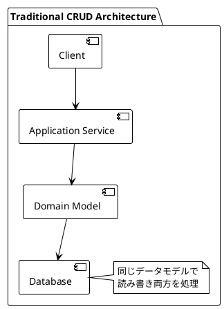
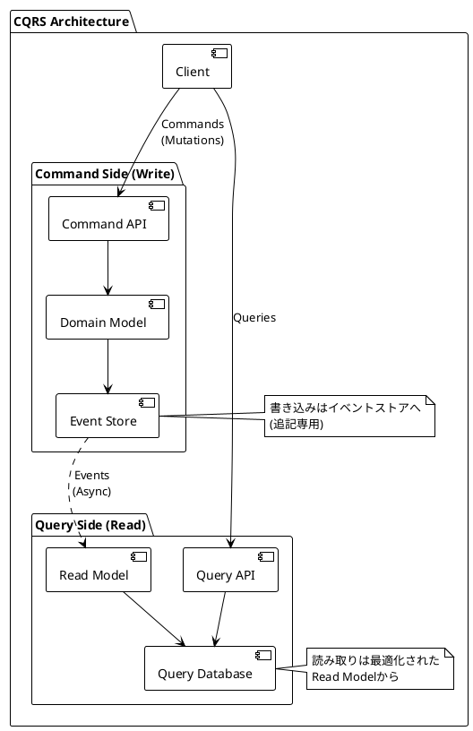
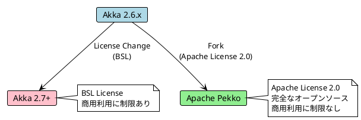
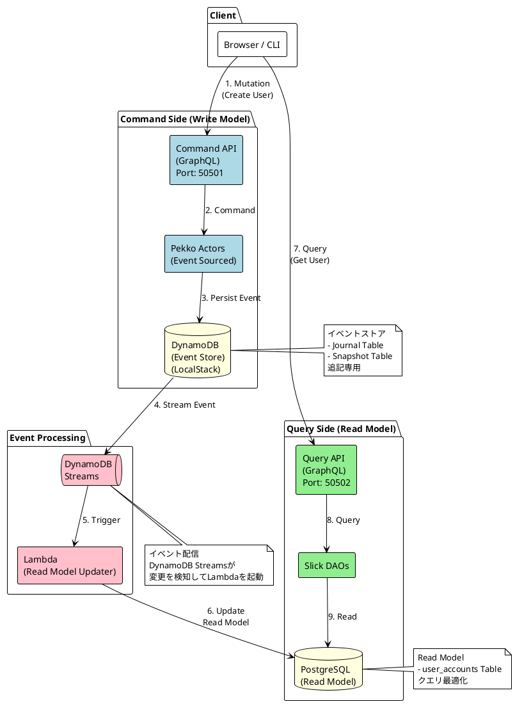
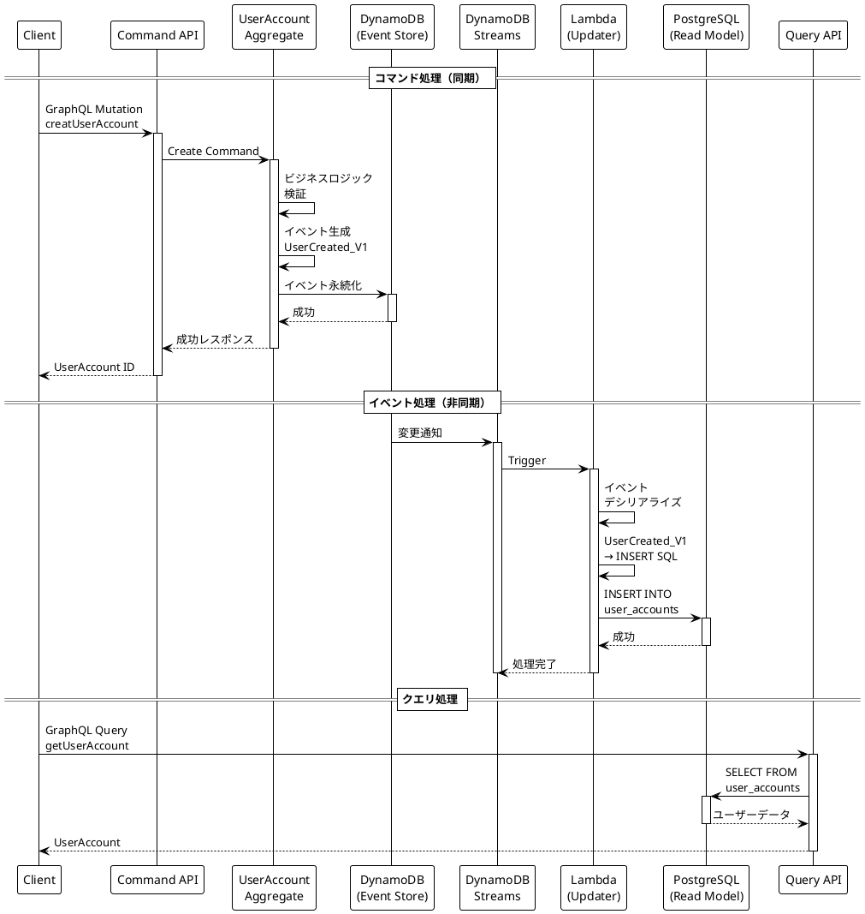
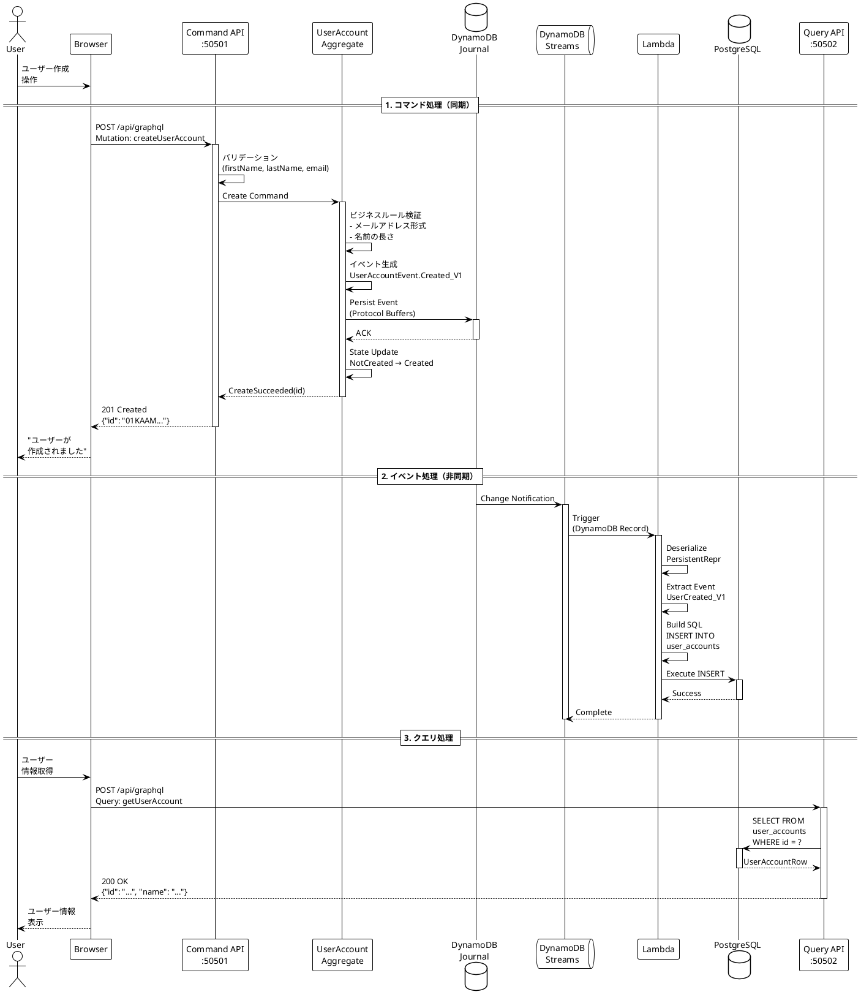

# 第1部 環境構築編 - 第2章：アーキテクチャ概要

## システム全体像の理解

本章では、これから構築するCQRS/Event Sourcingシステムの全体像を理解します。各コンポーネントの役割、データの流れ、そしてなぜこのアーキテクチャを採用するのかを学びます。

### 目次

1. CQRS/Event Sourcingとは
2. システム構成図
3. コンポーネントの役割
4. データフローの詳細
5. なぜこのアーキテクチャなのか

---

## 1. CQRS/Event Sourcingとは

### 1.1 CQRS（コマンドクエリ責任分離）の基本概念

**CQRS（Command Query Responsibility Segregation）**は、システムを「書き込み」と「読み取り」で明確に分離するアーキテクチャパターンです。

#### 従来のアーキテクチャ（CRUD）



**問題点**:
- 読み取りと書き込みで同じデータモデルを使用
- 複雑なクエリがパフォーマンスに影響
- スケーリングが困難（読み取りと書き込みを独立してスケールできない）

#### CQRSアーキテクチャ



**メリット**:
- ✅ **パフォーマンス最適化**: 読み取り・書き込みを独立して最適化
- ✅ **スケーラビリティ**: 負荷に応じて個別にスケール
- ✅ **柔軟性**: 用途に応じた複数のRead Modelを作成可能
- ✅ **保守性**: 関心の分離により、変更の影響範囲が明確

### 1.2 Event Sourcingパターンの利点と課題

**Event Sourcing**は、アプリケーションの状態を「現在の値」ではなく、「状態を変更したイベントの履歴」として保存するパターンです。

#### 従来の状態管理

```
ユーザーアカウントテーブル
+---------+----------+---------+----------+
| id      | name     | email   | updated  |
+---------+----------+---------+----------+
| user-1  | 山田太郎  | taro@..| 2025-... |
+---------+----------+---------+----------+

→ 最新の状態のみが保存される
→ 過去の履歴は失われる
```

#### Event Sourcingによる状態管理

```
イベントストア
+---------+------------------+----------+----------+
| id      | event_type       | data     | timestamp|
+---------+------------------+----------+----------+
| user-1  | UserCreated      | {...}    | 10:00:00 |
| user-1  | NameChanged      | {...}    | 11:00:00 |
| user-1  | EmailUpdated     | {...}    | 12:00:00 |
+---------+------------------+----------+----------+

→ 全ての変更履歴がイベントとして保存される
→ イベントを再生することで任意の時点の状態を復元可能
```

#### Event Sourcingの利点

1. **完全な監査証跡**
   - 「誰が」「いつ」「何を」変更したか完全に記録
   - コンプライアンス要件への対応
   - デバッグとトラブルシューティングが容易

2. **時間の遡行**
   - 過去の任意の時点の状態を復元可能
   - "2週間前のユーザー情報はどうだったか" といった質問に回答できる
   - イベントのリプレイによる新しいRead Modelの構築

3. **イベント駆動アーキテクチャとの親和性**
   - イベントを他のサービスに配信可能
   - マイクロサービス間の疎結合な連携
   - ビジネスイベントがそのままシステムイベントに

4. **ドメインモデルの表現力**
   - ビジネスの重要なイベントをコードで表現
   - ドメインエキスパートとの共通言語（ユビキタス言語）

#### Event Sourcingの課題

1. **学習曲線**
   - 従来のCRUDとは異なる考え方が必要
   - イベントの設計スキルが求められる

2. **結果整合性**
   - Read Modelの更新は非同期（Eventual Consistency）
   - クライアントが結果整合性を理解する必要がある

3. **イベントスキーマの進化**
   - 一度保存したイベントは変更できない
   - バージョニング戦略が必要

4. **クエリの複雑性**
   - イベントストアから直接クエリは困難
   - Read Modelの設計と管理が必要

### 1.3 なぜPekkoを選択したか（Akkaからの移行背景）

#### Akkaのライセンス変更

2022年9月、Lightbend社は以下の決定を発表しました：

- **Akka 2.7以降**: BSL（Business Source License）に変更
- **商用利用**: 年間売上$25M以上の企業は有償ライセンスが必要
- **既存バージョン**: Akka 2.6.xはApache License 2.0のまま

この変更により、多くの企業がオープンソース代替を必要としました。

#### Apache Pekkoの誕生



#### Pekkoを選択する理由

1. **完全なオープンソース**
   - Apache License 2.0
   - 商用利用に制限なし
   - コミュニティ主導の開発

2. **Akkaとの高い互換性**
   - Akka 2.6.xベース
   - 既存のAkkaアプリケーションからの移行が容易
   - APIの大部分が互換

3. **Apache Software Foundationの信頼性**
   - 長期的なサポート
   - 透明性のあるガバナンス
   - 活発な開発コミュニティ

4. **Event Sourcingに最適な機能**
   - Pekko Persistence（イベントストア抽象化）
   - Cluster Sharding（水平スケーリング）
   - 型付きアクター（型安全性）

---

## 2. システム構成図

本システムの全体構成を示します。



### データフロー（詳細）



---

## 3. コンポーネントの役割

### 3.1 Command Side（書き込みモデル）

#### Command API（GraphQL）

**役割**: クライアントからのコマンド（Mutation）を受け付ける

**技術スタック**:
- Pekko HTTP（HTTPサーバー）
- Sangria（GraphQL実装）
- Port: 50501

**主なエンドポイント**:
```graphql
mutation {
  createUserAccount(input: {...})
  renameUserAccount(input: {...})
  deleteUserAccount(input: {...})
}
```

**責務**:
- GraphQL Mutationの受付
- 入力バリデーション
- Pekkoアクターへのコマンド送信
- レスポンスの返却

#### Pekko Actors（Event Sourced）

**役割**: ビジネスロジックの実行とイベント生成

**技術スタック**:
- Pekko Typed Actors（型付きアクター）
- EventSourcedBehavior（イベントソーシング）
- Cluster Sharding（分散処理）

**主な処理**:
1. コマンドの受信
2. ビジネスルールの検証
3. ドメインイベントの生成
4. イベントの永続化
5. 状態の更新

**コード例** (modules/command/interface-adapter/src/main/scala/aggregate/users/UserAccountAggregate.scala):
```scala
def commandHandler(state: State): CommandHandler = {
  case (NotCreated(id), Create(_, name, email, replyTo)) =>
    // ドメインロジックの実行
    val (_, event) = UserAccount(id, name, email)

    // イベントの永続化
    Effect
      .persist(event)
      .thenReply(replyTo)(_ => CreateSucceeded(id))
}
```

#### DynamoDB（Event Store）

**役割**: イベントの永続化

**テーブル構成**:
- **Journal Table**: イベントの保存（追記専用）
- **Snapshot Table**: スナップショットの保存（パフォーマンス最適化）

**特徴**:
- 追記専用（Append-Only）
- イベントの削除・変更は原則行わない
- DynamoDB Streamsによる変更通知

**データ構造**:
```json
{
  "persistence_id": "UserAccount-01KAAM3Q5P...",
  "sequence_nr": 1,
  "event": {
    "event_type": "UserAccountEvent.Created",
    "event_version": "V1",
    "payload": "..."  // Protocol Buffersでシリアライズ
  },
  "timestamp": "2025-11-27T10:00:00Z"
}
```

### 3.2 Query Side（読み取りモデル）

#### Query API（GraphQL）

**役割**: クライアントからのクエリ（Query）を受け付ける

**技術スタック**:
- Pekko HTTP
- Sangria
- Port: 50502

**主なエンドポイント**:
```graphql
query {
  getUserAccount(id: "...")
  getUserAccounts
  searchUserAccounts(searchTerm: "...")
}
```

**責務**:
- GraphQL Queryの受付
- Slick DAOを通じたデータ取得
- レスポンスの整形

#### Slick DAOs

**役割**: PostgreSQLへのクエリ実行

**技術スタック**:
- Slick 3.5.2（データベースアクセス）
- HikariCP（コネクションプール）

**特徴**:
- 型安全なクエリ
- sbt-dao-generatorによる自動生成
- 非同期処理（Future）

**自動生成されたDAO例** (modules/query/interface-adapter/src/main/scala/dao/):
```scala
class UserAccountDao(profile: JdbcProfile)(implicit ec: ExecutionContext) {
  import profile.api._

  def findById(id: String): Future[Option[UserAccountRow]] = {
    db.run(userAccounts.filter(_.id === id).result.headOption)
  }

  def findAll: Future[Seq[UserAccountRow]] = {
    db.run(userAccounts.result)
  }
}
```

#### PostgreSQL（Read Model）

**役割**: クエリ用に最適化されたデータの保存

**スキーマ**:
```sql
CREATE TABLE user_accounts (
  id VARCHAR(26) PRIMARY KEY,
  first_name VARCHAR(255) NOT NULL,
  last_name VARCHAR(255) NOT NULL,
  email_address VARCHAR(255) NOT NULL,
  created_at TIMESTAMP NOT NULL,
  updated_at TIMESTAMP NOT NULL,
  is_deleted BOOLEAN DEFAULT FALSE
);

CREATE INDEX idx_user_accounts_email ON user_accounts(email_address);
CREATE INDEX idx_user_accounts_name ON user_accounts(first_name, last_name);
```

**特徴**:
- 非正規化されたスキーマ（クエリ最適化）
- インデックスによる高速検索
- 複数のRead Modelを作成可能（用途に応じて）

### 3.3 Event Processing（イベント処理）

#### DynamoDB Streams

**役割**: DynamoDBの変更を検知してイベント配信

**仕組み**:
1. DynamoDB Journalテーブルへの書き込みを検知
2. 変更内容（イベント）をストリームに配信
3. Lambdaのイベントソースマッピングがトリガー

**ストリーム設定**:
```typescript
// tools/dynamodb-setup/tables.tf
resource "aws_dynamodb_table" "journal" {
  stream_enabled   = true
  stream_view_type = "NEW_IMAGE"  // 新しいイメージのみ
}
```

#### Lambda（Read Model Updater）

**役割**: イベントからRead Modelを更新

**処理フロー**:
```scala
// apps/read-model-updater/src/main/scala/LambdaHandler.scala
def handleEvent(record: DynamoDBStreamRecord): Unit = {
  // 1. DynamoDBレコードからイベントを抽出
  val persistentRepr = deserializePersistentRepr(record)

  // 2. ペイロードからドメインイベントをデシリアライズ
  val event = deserializeEvent(persistentRepr.payload)

  // 3. イベントに応じてRead Modelを更新
  event match {
    case UserAccountEvent.Created_V1(id, name, email, _) =>
      // INSERT INTO user_accounts
      insertUserAccount(id, name, email)

    case UserAccountEvent.Renamed_V1(id, _, newName, _) =>
      // UPDATE user_accounts SET name = ...
      updateUserName(id, newName)

    case UserAccountEvent.Deleted_V1(id, _) =>
      // UPDATE user_accounts SET is_deleted = true
      markAsDeleted(id)
  }
}
```

**エラーハンドリング**:
- リトライ戦略（最大3回）
- デッドレターキューへの移動
- CloudWatch Logsへのエラーログ出力

---

## 4. データフローの詳細

### 4.1 ユーザー作成フロー（E2E）



### 4.2 結果整合性の理解

**重要**: Command APIがレスポンスを返した直後は、Query APIではまだデータが見えない可能性があります。

```
時刻T0: ユーザー作成Mutationが成功（Command API）
       ↓
時刻T0+50ms: DynamoDB Streamsが変更を検知
       ↓
時刻T0+100ms: Lambda関数が起動
       ↓
時刻T0+150ms: PostgreSQLにINSERT完了
       ↓
時刻T0+200ms: Query APIでデータが見える
```

**対処方法**:
1. **クライアント側でリトライ**（E2Eテストスクリプトの例）
2. **楽観的UI更新**（Mutationの成功をUIに即座に反映）
3. **WebSocketによる通知**（Read Model更新完了を通知）

### 4.3 イベントの永続化とデシリアライゼーション

#### イベントのシリアライゼーション（Command Side）

```scala
// UserAccountEventSerializer.scala
override def toBinary(event: UserAccountEvent): Array[Byte] = {
  val envelope = event match {
    case UserAccountEvent.Created_V1(id, entityId, name, email, occurredAt) =>
      val payload = UserAccountEvent_Created_V1(
        eventId = id.asString,
        userAccountId = entityId.asString,
        userName = Some(ProtoUserAccountName(
          name.firstName.asString,
          name.lastName.asString
        )),
        emailAddress = email.asString,
        occurredAt = toProtoTimestamp(occurredAt)
      )

      UserAccountEvent_Envelope(
        userAccountId = entityId.asString,
        eventTypeName = "UserAccountEvent.Created",
        eventTypeVersion = "V1",
        payload = payload.toByteArray,
        occurredAt = toProtoTimestamp(occurredAt)
      )
  }

  envelope.toByteArray
}
```

#### イベントのデシリアライゼーション（Lambda）

```scala
// LambdaHandler.scala
def processEvent(record: DynamoDBStreamRecord): Unit = {
  // 1. PersistentReprをデシリアライズ
  val persistentRepr = PersistentRepr.parseFrom(
    record.dynamodb.newImage.get("event").b
  )

  // 2. Envelopeを取得
  val envelope = UserAccountEvent_Envelope.parseFrom(
    persistentRepr.payload.toByteArray
  )

  // 3. イベントタイプとバージョンで分岐
  (envelope.eventTypeName, envelope.eventTypeVersion) match {
    case ("UserAccountEvent.Created", "V1") =>
      val payload = UserAccountEvent_Created_V1.parseFrom(
        envelope.payload.toByteArray
      )
      handleCreated(payload)

    case ("UserAccountEvent.Renamed", "V1") =>
      // ...
  }
}
```

---

## 5. なぜこのアーキテクチャなのか

### 5.1 設計上の意思決定

#### DynamoDBをイベントストアに選択した理由

**利点**:
- ✅ **スケーラビリティ**: 自動的な水平スケーリング
- ✅ **可用性**: 99.99%のSLA、マルチAZ自動レプリケーション
- ✅ **パフォーマンス**: 一桁ミリ秒のレスポンス
- ✅ **運用負荷**: マネージドサービス、バックアップ自動化
- ✅ **Pekko Persistence対応**: j5ik2o/pekko-persistence-dynamodbプラグイン

**代替案との比較**:
- **PostgreSQL**（EventStoreDB等）: 高機能だが運用負荷が高い
- **Cassandra**: スケーラブルだが運用が複雑
- **Kafka**: ストリーミングには最適だが、イベントストアとしてはオーバースペック

#### PostgreSQLをRead Modelに選択した理由

**利点**:
- ✅ **成熟した技術**: 豊富なエコシステム
- ✅ **強力なクエリ機能**: 複雑な検索・集計が可能
- ✅ **インデックス**: 柔軟なインデックス設計
- ✅ **トランザクション**: ACID特性

#### GraphQLを採用した理由

**利点**:
- ✅ **型安全**: スキーマファーストの設計
- ✅ **柔軟性**: クライアントが必要なフィールドのみ取得
- ✅ **開発体験**: Playgroundによる対話的な開発
- ✅ **ドキュメント**: 自己文書化されたAPI

### 5.2 トレードオフの理解

#### メリット

1. **高いスケーラビリティ**
   - コマンド側とクエリ側を独立してスケール
   - DynamoDBとPekko Clusterによる水平スケーリング

2. **パフォーマンス最適化**
   - Read Modelはクエリ用に最適化
   - イベント処理は非同期で実行

3. **完全な監査証跡**
   - 全ての変更がイベントとして記録
   - 過去の状態を再現可能

4. **柔軟性**
   - 新しいRead Modelを後から追加可能
   - ビジネス要件の変更に対応しやすい

#### デメリットと対策

1. **複雑性の増加**
   - 👉 **対策**: 段階的な導入、チーム教育、ドキュメント整備

2. **結果整合性**
   - 👉 **対策**: クライアント側でのリトライ、楽観的UI更新

3. **運用コストの増加**
   - 👉 **対策**: LocalStackによるローカル開発環境、IaC（Infrastructure as Code）

4. **学習曲線**
   - 👉 **対策**: 本記事のようなチュートリアル、サンプルコード

---

## まとめ

本章では、CQRS/Event Sourcingアーキテクチャの全体像を学びました。

### 学んだこと

- ✅ CQRSとEvent Sourcingの基本概念
- ✅ システム全体の構成とデータフロー
- ✅ 各コンポーネントの役割と責務
- ✅ なぜこのアーキテクチャを採用するのか

### 次のステップ

次章では、技術スタックの詳細な選定理由を学びます。Scala 3、Pekko、DynamoDB、PostgreSQLなど、各技術の選択背景を理解します。

👉 [第3章：技術スタックの選定](part1-03-tech-stack.md)

---

## 参考資料

- [CQRS - Martin Fowler](https://martinfowler.com/bliki/CQRS.html)
- [Event Sourcing - Martin Fowler](https://martinfowler.com/eaaDev/EventSourcing.html)
- [Pekko Persistence](https://pekko.apache.org/docs/pekko/current/typed/persistence.html)
- [AWS DynamoDB Streams](https://docs.aws.amazon.com/amazondynamodb/latest/developerguide/Streams.html)
