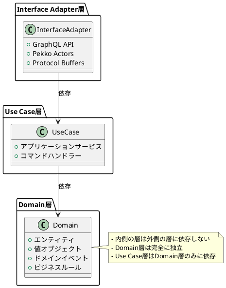
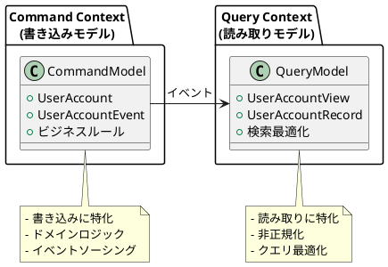
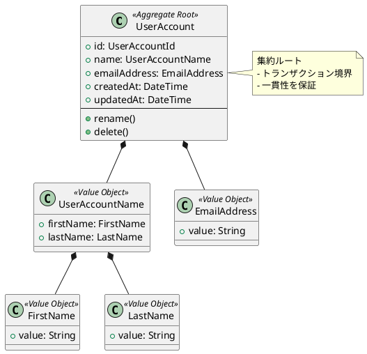

# 第2部 サービス構築編 - 第1章：ドメイン駆動設計の基礎

## はじめに

第2部では、CQRS/Event Sourcingシステムの実装を詳しく学びます。本章では、**ドメイン駆動設計（DDD）**の基礎概念を理解し、プロジェクトのモジュール構造と、UserAccountドメインモデルの設計を学びます。

### 本章で学ぶこと

1. **プロジェクト構造の理解**: モジュール構成とレイヤードアーキテクチャ
2. **エンティティと集約**: UserAccountの設計
3. **値オブジェクト**: UserAccountId、FirstName、EmailAddress等
4. **ドメインイベント**: UserAccountEvent の設計
5. **ビジネスルールの実装**: ドメインロジックの配置

---

## 1.1 プロジェクト構造の理解

### 1.1.1 モジュール構成

本プロジェクトは、**関心の分離**に基づいてモジュールを分割しています。

#### 全体構造

```
modules/
├── infrastructure/              # 共有インフラコード
├── command/                     # コマンド側（書き込みモデル）
│   ├── domain/                  # ドメイン層
│   ├── use-case/                # ユースケース層
│   ├── interface-adapter/       # インターフェースアダプター層
│   ├── interface-adapter-contract/      # Protocol Buffers定義
│   └── interface-adapter-event-serializer/  # イベントシリアライザ
└── query/                       # クエリ側（読み取りモデル）
    ├── interface-adapter/       # GraphQL API、Slick DAO
    └── flyway-migration/        # データベースマイグレーション

apps/
├── command-api/                 # Command側HTTPサーバー
├── query-api/                   # Query側GraphQLサーバー
└── read-model-updater/          # Lambda関数（イベント処理）
```

---

### 1.1.2 レイヤードアーキテクチャ

コマンド側は、**レイヤードアーキテクチャ**（クリーンアーキテクチャの変形）を採用しています。

#### レイヤー構造



**依存関係のルール**:
- 内側の層は外側の層に依存しない
- Domain層は完全に独立（ライブラリ依存なし）
- Use Case層はDomain層のみに依存
- Interface Adapter層はUse Case層とDomain層に依存

---

### 1.1.3 ドメイン層のディレクトリ構造

```
modules/command/domain/src/main/scala/
└── io/github/j5ik2o/pcqrses/command/domain/
    ├── support/                   # ドメイン共通基盤
    │   ├── Entity.scala           # エンティティの基底トレイト
    │   ├── EntityId.scala         # エンティティIDの基底トレイト
    │   ├── DomainEvent.scala      # ドメインイベントの基底トレイト
    │   ├── DomainEventId.scala    # イベントIDの実装
    │   └── DomainError.scala      # ドメインエラーの基底トレイト
    ├── basic/                     # 基本的な値オブジェクト
    │   ├── DateTime.scala         # 日時を表す値オブジェクト
    │   └── DateTimeError.scala
    └── users/                     # UserAccountドメイン
        ├── UserAccount.scala      # 集約ルート
        ├── UserAccountId.scala    # エンティティID
        ├── UserAccountName.scala  # ユーザー名（値オブジェクト）
        ├── FirstName.scala        # 名（値オブジェクト）
        ├── LastName.scala         # 姓（値オブジェクト）
        ├── EmailAddress.scala     # メールアドレス（値オブジェクト）
        ├── UserAccountEvent.scala # ドメインイベント
        ├── RenameError.scala      # リネームエラー
        └── DeleteError.scala      # 削除エラー
```

---

## 1.2 UserAccountドメインモデルの設計

### 1.2.1 集約ルート（Aggregate Root）

**集約（Aggregate）**は、一貫性境界を持つドメインオブジェクトの集まりです。`UserAccount`は集約ルートです。

#### UserAccount.scalaの実装

`modules/command/domain/src/main/scala/io/github/j5ik2o/pcqrses/command/domain/users/UserAccount.scala`:

```scala
package io.github.j5ik2o.pcqrses.command.domain.users

import io.github.j5ik2o.pcqrses.command.domain.basic.DateTime
import io.github.j5ik2o.pcqrses.command.domain.support.{DomainEventId, Entity}

trait UserAccount extends Entity {
  override type IdType = UserAccountId
  def id: UserAccountId
  def name: UserAccountName
  def emailAddress: EmailAddress
  def createdAt: DateTime
  def updatedAt: DateTime

  def rename(newName: UserAccountName): Either[RenameError, (UserAccount, UserAccountEvent)]
  def delete: Either[DeleteError, (UserAccount, UserAccountEvent)]
}
```

**設計のポイント**:

1. **トレイトによるインターフェース定義**: 集約の振る舞いを定義
2. **Entityトレイトの継承**: 全てのエンティティに共通する特性を持つ
3. **Eitherによるエラーハンドリング**: 失敗する可能性がある操作を型安全に表現
4. **イベントの返却**: 操作結果として状態とイベントのペアを返す

---

#### ファクトリメソッド（ユーザー作成）

```scala
object UserAccount {
  def apply(
    id: UserAccountId,
    name: UserAccountName,
    emailAddress: EmailAddress,
    createdAt: DateTime = DateTime.now(),
    updatedAt: DateTime = DateTime.now()
  ): (UserAccount, UserAccountEvent) =
    (
      UserAccountImpl(id, false, name, emailAddress, createdAt, updatedAt),
      UserAccountEvent.Created_V1(
        id = DomainEventId.generate(),
        entityId = id,
        name = name,
        emailAddress = emailAddress,
        occurredAt = DateTime.now()
      ))
}
```

**設計のポイント**:

1. **イベントとともに生成**: エンティティとイベントをペアで返す
2. **デフォルト引数**: `createdAt`と`updatedAt`は省略可能
3. **イミュータブル**: 生成後は変更不可

---

#### ビジネスロジック（リネーム）

```scala
private final case class UserAccountImpl(...) extends UserAccount {
  override def rename(
    newName: UserAccountName): Either[RenameError, (UserAccount, UserAccountEvent)] =
    if (name == newName) {
      Left(RenameError.FamilyNameSame)  // 同じ名前の場合はエラー
    } else {
      val updated = this.copy(name = newName, updatedAt = DateTime.now())
      val event = UserAccountEvent.Renamed_V1(
        id = DomainEventId.generate(),
        entityId = id,
        oldName = name,
        newName = newName,
        occurredAt = DateTime.now()
      )
      Right((updated, event))
    }
}
```

**設計のポイント**:

1. **ビジネスルールの実装**: 「同じ名前への変更は不可」というルール
2. **イミュータブルな更新**: `copy`で新しいインスタンスを生成
3. **イベントの生成**: 変更内容をイベントとして記録

---

### 1.2.2 エンティティID（Entity ID）

#### UserAccountId.scalaの実装

`modules/command/domain/src/main/scala/io/github/j5ik2o/pcqrses/command/domain/users/UserAccountId.scala`:

```scala
package io.github.j5ik2o.pcqrses.command.domain.users

import io.github.j5ik2o.pcqrses.command.domain.support.EntityId
import wvlet.airframe.ulid.{CrockfordBase32, ULID}

trait UserAccountId extends EntityId {
  def entityTypeName: String
  def asString: String
}

object UserAccountId {
  final val EntityTypeName: String = "UserAccount"

  def generate(): UserAccountId = UserAccountIdImpl(ULID.newULID)

  def from(value: String): UserAccountId = parseFromString(value) match {
    case Right(v) => v
    case Left(e) => throw new IllegalArgumentException(e.message)
  }

  def parseFromString(value: String): Either[UserAccountIdError, UserAccountId] =
    if (value.isEmpty) {
      Left(UserAccountIdError.Empty)
    } else if (value.length != 26) {
      Left(UserAccountIdError.InvalidLength)
    } else if (!CrockfordBase32.isValidBase32(value)) {
      Left(UserAccountIdError.InvalidFormat)
    } else {
      Right(apply(ULID.fromString(value)))
    }

  private case class UserAccountIdImpl(ulid: ULID) extends UserAccountId {
    override def entityTypeName: String = EntityTypeName
    override def asString: String = ulid.toString
  }
}
```

**設計のポイント**:

1. **ULID（Universally Unique Lexicographically Sortable Identifier）の採用**:
   - タイムスタンプ順にソート可能
   - UUIDv4よりも人間が読みやすい（26文字）
   - 例: `01KAAM3Q5PVKKWW1ZSEH6A68FT`

2. **バリデーション**:
   - 長さチェック（26文字）
   - Crockford Base32形式の検証

3. **型安全性**:
   - プリミティブな文字列をラップ
   - コンパイル時に型エラーを検出

---

### 1.2.3 値オブジェクト（Value Objects）

値オブジェクトは、ドメインの概念を表す不変のオブジェクトです。

#### FirstName（名）

`modules/command/domain/src/main/scala/io/github/j5ik2o/pcqrses/command/domain/users/FirstName.scala`:

```scala
package io.github.j5ik2o.pcqrses.command.domain.users

trait FirstName {
  def asString: String
}

object FirstName {
  def apply(value: String): FirstName = parseFromString(value) match {
    case Right(v) => v
    case Left(e) => throw new IllegalArgumentException(e.message)
  }

  def parseFromString(value: String): Either[FirstNameError, FirstName] =
    if (value.length > 256) Left(FirstNameError.TooLong)
    else Right(FirstNameImpl(value))

  private final case class FirstNameImpl(value: String) extends FirstName {
    override def asString: String = value
  }
}
```

**設計のポイント**:

1. **バリデーション**: 最大256文字の制限
2. **イミュータブル**: 生成後は変更不可
3. **プリミティブ型のラップ**: 文字列を型安全にラップ

---

#### EmailAddress（メールアドレス）

`modules/command/domain/src/main/scala/io/github/j5ik2o/pcqrses/command/domain/users/EmailAddress.scala`:

```scala
package io.github.j5ik2o.pcqrses.command.domain.users

trait EmailAddress {
  def asString: String
}

object EmailAddress {
  private[users] final val MaxLength = 100

  private final val EmailRegex = "^[a-zA-Z0-9._%+-]+@[a-zA-Z0-9.-]+\\.[a-zA-Z]{2,}$".r

  def parseFromString(value: String): Either[EmailAddressError, EmailAddress] =
    if (value.isEmpty) {
      Left(EmailAddressError.Empty)
    } else if (value.length > MaxLength) {
      Left(EmailAddressError.TooLong(value.length))
    } else if (!EmailRegex.matches(value)) {
      Left(EmailAddressError.InvalidFormat)
    } else {
      Right(EmailAddressImpl(value))
    }

  private final case class EmailAddressImpl(private val value: String) extends EmailAddress {
    override def asString: String = value
  }
}
```

**設計のポイント**:

1. **複雑なバリデーション**:
   - 空チェック
   - 長さチェック（最大100文字）
   - 正規表現による形式チェック

2. **ドメインルールの集約**: メールアドレスに関するルールを一箇所に集約

---

### 1.2.4 ドメインイベント（Domain Events）

#### UserAccountEvent.scalaの実装

`modules/command/domain/src/main/scala/io/github/j5ik2o/pcqrses/command/domain/users/UserAccountEvent.scala`:

```scala
package io.github.j5ik2o.pcqrses.command.domain.users

import io.github.j5ik2o.pcqrses.command.domain.basic.DateTime
import io.github.j5ik2o.pcqrses.command.domain.support.{DomainEvent, DomainEventId}

enum UserAccountEvent extends DomainEvent {
  override type EntityIdType = UserAccountId

  case Created_V1(
    id: DomainEventId,
    entityId: UserAccountId,
    name: UserAccountName,
    emailAddress: EmailAddress,
    occurredAt: DateTime
  )

  case Renamed_V1(
    id: DomainEventId,
    entityId: UserAccountId,
    oldName: UserAccountName,
    newName: UserAccountName,
    occurredAt: DateTime
  )

  case Deleted_V1(
    id: DomainEventId,
    entityId: UserAccountId,
    occurredAt: DateTime
  )
}
```

**設計のポイント**:

1. **Scala 3のenum**:
   - イベントの種類を型安全に表現
   - パターンマッチングが完全

2. **バージョニング（_V1サフィックス）**:
   - スキーマ進化に対応
   - 将来の拡張性を確保

3. **過去形の命名**:
   - `Created`（作成された）
   - `Renamed`（リネームされた）
   - `Deleted`（削除された）

4. **不変性**:
   - 全てのフィールドが`val`
   - イベントは歴史的事実なので変更不可

---

## 1.3 ドメイン駆動設計の重要概念

### 1.3.1 ユビキタス言語（Ubiquitous Language）

**ユビキタス言語**は、開発者とドメインエキスパートが共有する言葉です。

#### 本プロジェクトのユビキタス言語

| 用語 | 意味 |
|------|------|
| **UserAccount** | ユーザーアカウント（集約ルート） |
| **UserAccountId** | ユーザーアカウントの一意識別子 |
| **FirstName** | 名 |
| **LastName** | 姓 |
| **EmailAddress** | メールアドレス |
| **Created** | ユーザーアカウントが作成された |
| **Renamed** | ユーザー名が変更された |
| **Deleted** | ユーザーアカウントが削除された |

**重要性**:
- コードがドメインの言葉で書かれている
- ドメインエキスパートがコードを読める
- コミュニケーションのギャップを減らす

---

### 1.3.2 境界づけられたコンテキスト（Bounded Context）

本プロジェクトでは、以下の境界づけられたコンテキストがあります：



**分離の利点**:
- 各コンテキストで最適なモデルを設計
- 変更の影響範囲を限定
- チームの独立性を確保

---

### 1.3.3 集約（Aggregate）とトランザクション境界

#### 集約の定義

**集約**は、一つのトランザクション境界を持つドメインオブジェクトの集まりです。



**トランザクション境界**:
- 一つの`UserAccount`集約は一つのトランザクションで更新
- 複数の集約をまたぐ更新は、イベント駆動で実現

---

#### 集約の不変条件（Invariants）

集約ルートは、常に一貫した状態を保証します：

```scala
// 不変条件の例
private final case class UserAccountImpl(...) extends UserAccount {
  // 不変条件: 削除済みユーザーは変更できない
  override def rename(newName: UserAccountName): Either[RenameError, (UserAccount, UserAccountEvent)] =
    if (deleted) {
      Left(RenameError.AlreadyDeleted)  // 削除済みの場合はエラー
    } else if (name == newName) {
      Left(RenameError.FamilyNameSame)
    } else {
      // 不変条件を満たす場合のみ変更を許可
      val updated = this.copy(name = newName, updatedAt = DateTime.now())
      val event = UserAccountEvent.Renamed_V1(...)
      Right((updated, event))
    }
}
```

---

## 1.4 ビジネスルールの実装

### 1.4.1 ドメイン層でのビジネスルール

ビジネスルールは、**ドメイン層**に配置します。

#### 例1: 同じ名前への変更は不可

```scala
override def rename(newName: UserAccountName): Either[RenameError, (UserAccount, UserAccountEvent)] =
  if (name == newName) {
    Left(RenameError.FamilyNameSame)  // ビジネスルール
  } else {
    // 変更を許可
  }
```

---

#### 例2: 削除済みユーザーは削除できない

```scala
override def delete: Either[DeleteError, (UserAccount, UserAccountEvent)] =
  if (deleted) {
    Left(DeleteError.AlreadyDeleted)  // ビジネスルール
  } else {
    val updated = copy(deleted = true, updatedAt = DateTime.now())
    val event = UserAccountEvent.Deleted_V1(...)
    Right((updated, event))
  }
```

---

#### 例3: メールアドレスの形式検証

```scala
// EmailAddress値オブジェクト内
private final val EmailRegex = "^[a-zA-Z0-9._%+-]+@[a-zA-Z0-9.-]+\\.[a-zA-Z]{2,}$".r

def parseFromString(value: String): Either[EmailAddressError, EmailAddress] =
  if (!EmailRegex.matches(value)) {
    Left(EmailAddressError.InvalidFormat)  // ビジネスルール
  } else {
    Right(EmailAddressImpl(value))
  }
```

---

### 1.4.2 Eitherによる型安全なエラーハンドリング

#### Eitherの利点

```scala
// 失敗する可能性がある操作をEitherで表現
def rename(newName: UserAccountName): Either[RenameError, (UserAccount, UserAccountEvent)]

// 呼び出し側でパターンマッチング
userAccount.rename(newName) match {
  case Right((updated, event)) =>
    // 成功時の処理
  case Left(RenameError.FamilyNameSame) =>
    // エラー処理: 同じ名前
  case Left(RenameError.AlreadyDeleted) =>
    // エラー処理: 既に削除済み
}
```

**型安全性**:
- 例外を投げずにエラーを表現
- コンパイラがエラーケースの処理を強制
- 全てのエラーケースが型で表現される

---

## まとめ

本章では、ドメイン駆動設計の基礎を学びました。

### 達成したこと

1. ✅ **プロジェクト構造の理解**: レイヤードアーキテクチャと関心の分離
2. ✅ **集約ルートの設計**: UserAccountの実装
3. ✅ **値オブジェクトの設計**: FirstName、EmailAddress等
4. ✅ **ドメインイベントの設計**: UserAccountEvent
5. ✅ **ビジネスルールの実装**: 型安全なエラーハンドリング

### 重要なポイント

- **ドメイン層は独立**: ライブラリやフレームワークに依存しない純粋なScalaコード
- **イミュータブル**: 全てのドメインオブジェクトは不変
- **型安全性**: Eitherやenumで型安全なエラーハンドリング
- **ユビキタス言語**: コードがドメインの言葉で書かれている

---

## 次の章へ

ドメインモデルの設計を学びました。次章では、これらのドメインオブジェクトを**Event Sourcing**で永続化する方法を学びます。

👉 [第2章：イベントソーシングの実装](part2-02-event-sourcing.md)

---

## 参考資料

- [Domain-Driven Design - Eric Evans](https://www.domainlanguage.com/ddd/)
- [Implementing Domain-Driven Design - Vaughn Vernon](https://vaughnvernon.com/)
- [DDD Reference - Eric Evans](https://www.domainlanguage.com/ddd/reference/)
- [Scala 3 Enums](https://docs.scala-lang.org/scala3/book/types-adts-gadts.html)
