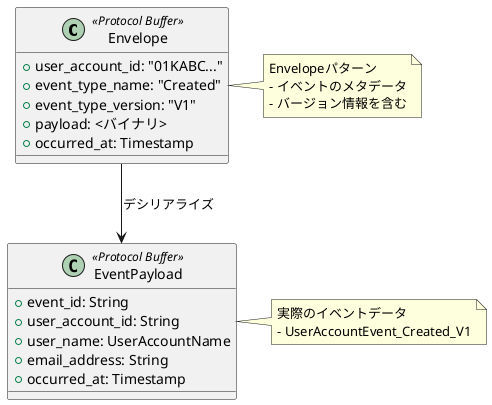
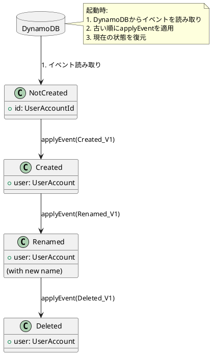

# 第2部 サービス構築編 - 第2章：イベントソーシングの実装

## はじめに

前章でドメインモデルの設計を学びました。本章では、これらのドメインオブジェクトを**Event Sourcing**で永続化する方法を学びます。Protocol Buffersによるシリアライゼーション、Pekko Persistenceの活用、スナップショット戦略について詳しく解説します。

### 本章で学ぶこと

1. **Protocol Buffersによるシリアライゼーション**: イベントの効率的な永続化
2. **Envelopeパターン**: イベントバージョニング戦略
3. **PersistenceEffectorの実装**: Pekko Persistenceによるイベントソーシング
4. **イベントハンドラー**: 状態の復元方法
5. **スナップショット戦略**: パフォーマンス最適化

---

## 2.1 Protocol Buffersによるシリアライゼーション

### 2.1.1 なぜProtocol Buffersなのか

イベントソーシングでは、全てのイベントを永続化します。Protocol Buffers（protobuf）は、以下の理由から最適な選択です：

#### メリット

1. **効率的なバイナリフォーマット**:
   - JSONと比較して50-70%のサイズ削減
   - シリアライゼーション/デシリアライゼーションが高速

2. **スキーマの進化に対応**:
   - フィールドの追加・削除が容易
   - 後方互換性/前方互換性をサポート

3. **言語中立**:
   - 複数の言語でイベントを処理可能
   - Lambda（Scala）とRead Model Updater（Scala）で共通のフォーマット

4. **型安全性**:
   - ScalaPBでScalaコードを自動生成
   - コンパイル時に型チェック

---

### 2.1.2 イベントのProtocol Buffers定義

#### event.protoファイル

`modules/command/interface-adapter-event-serializer/src/main/protobuf/users/event.proto`:

```protobuf
syntax = "proto3";

package io.github.j5ik2o.pcqrses.command.interfaceAdapter.persistence.users;

import "google/protobuf/timestamp.proto";
import "basic/basic.proto";

// Envelopeパターン: イベントのメタデータを含むラッパー
message UserAccountEvent_Envelope {
  string user_account_id = 1;
  string event_type_name = 3;      // ex "UserAccountEvent.Created"
  string event_type_version = 4;   // ex "V1"
  bytes payload = 5;               // 実際のイベントデータ
  google.protobuf.Timestamp occurred_at = 99;
}

// ユーザー作成イベント（バージョン1）
message UserAccountEvent_Created_V1 {
  string event_id = 1;
  string user_account_id = 2;
  basic.UserAccountName user_name = 3;
  string email_address = 4;
  google.protobuf.Timestamp occurred_at = 5;
}

// ユーザーリネームイベント（バージョン1）
message UserAccountEvent_Renamed_V1 {
  string event_id = 1;
  string user_account_id = 2;
  basic.UserAccountName old_name = 3;
  basic.UserAccountName new_name = 4;
  google.protobuf.Timestamp occurred_at = 5;
}

// ユーザー削除イベント（バージョン1）
message UserAccountEvent_Deleted_V1 {
  string event_id = 1;
  string user_account_id = 2;
  google.protobuf.Timestamp occurred_at = 3;
}
```

---

#### 重要なポイント

**1. Envelopeパターン**:
```protobuf
message UserAccountEvent_Envelope {
  string user_account_id = 1;
  string event_type_name = 3;      // イベントの種類を識別
  string event_type_version = 4;   // バージョンを識別
  bytes payload = 5;               // 実際のイベント（シリアライズ済み）
  google.protobuf.Timestamp occurred_at = 99;
}
```

**利点**:
- イベントの種類とバージョンをEnvelopeで管理
- ペイロードはバージョンごとに異なる型を使用可能
- デシリアライゼーション時に適切な型を選択

**2. バージョニング（_V1サフィックス）**:
```protobuf
message UserAccountEvent_Created_V1 { ... }
message UserAccountEvent_Renamed_V1 { ... }
message UserAccountEvent_Deleted_V1 { ... }
```

**利点**:
- 将来的にV2, V3を追加可能
- 既存のイベントを変更せずに新機能を追加
- 古いイベントも永続的に読み取り可能

**3. タイムスタンプの使用**:
```protobuf
import "google/protobuf/timestamp.proto";

message UserAccountEvent_Created_V1 {
  google.protobuf.Timestamp occurred_at = 5;
}
```

**利点**:
- タイムゾーンに依存しない時刻表現
- ナノ秒精度
- 標準的なProtobuf型

---

### 2.1.3 ScalaPBによるコード生成

#### SBT設定

`build.sbt`で自動生成を設定：

```scala
// ScalaPBの有効化
Compile / PB.targets := Seq(
  scalapb.gen() -> (Compile / sourceManaged).value / "scalapb"
)

// Protocol Buffersファイルのディレクトリ
Compile / PB.protoSources := Seq(
  baseDirectory.value / "src" / "main" / "protobuf"
)
```

#### 生成されるScalaコード

`sbt compile`を実行すると、以下のようなScalaコードが自動生成されます：

```scala
// 生成されたコード（target/scala-3.6.2/pekko-grpc/main/）
package io.github.j5ik2o.pcqrses.command.interfaceAdapter.persistence.users

final case class UserAccountEvent_Envelope(
  userAccountId: String,
  eventTypeName: String,
  eventTypeVersion: String,
  payload: com.google.protobuf.ByteString,
  occurredAt: Option[com.google.protobuf.timestamp.Timestamp]
) extends scalapb.GeneratedMessage {
  // ScalaPBが提供するメソッド
  def toByteArray: Array[Byte] = ...
  def writeTo(output: java.io.OutputStream): Unit = ...
}

object UserAccountEvent_Envelope extends scalapb.GeneratedMessageCompanion[UserAccountEvent_Envelope] {
  def parseFrom(input: Array[Byte]): UserAccountEvent_Envelope = ...
}
```

**型安全性**:
- 全てのフィールドが型付けされている
- コンパイル時にエラーを検出
- IDEでコード補完が効く

---

## 2.2 Envelopeパターンによるバージョニング

### 2.2.1 Envelopeパターンの設計思想

**Envelope（封筒）パターン**は、イベントのメタデータと実際のペイロードを分離する設計です。

#### 構造



---

### 2.2.2 バージョン管理の戦略

#### V1からV2への移行例

**V1（現在）**:
```protobuf
message UserAccountEvent_Created_V1 {
  string event_id = 1;
  string user_account_id = 2;
  basic.UserAccountName user_name = 3;   // first_nameとlast_nameを含む
  string email_address = 4;
  google.protobuf.Timestamp occurred_at = 5;
}
```

**V2（将来の拡張）**:
```protobuf
message UserAccountEvent_Created_V2 {
  string event_id = 1;
  string user_account_id = 2;
  string first_name = 3;          // フィールド分割
  string last_name = 4;           // フィールド分割
  string email_address = 5;
  string phone_number = 6;        // 新規フィールド
  google.protobuf.Timestamp occurred_at = 7;
}
```

#### デシリアライゼーション時の処理

```scala
def deserialize(envelope: UserAccountEvent_Envelope): UserAccountEvent = {
  (envelope.eventTypeName, envelope.eventTypeVersion) match {
    case ("Created", "V1") =>
      val v1 = UserAccountEvent_Created_V1.parseFrom(envelope.payload.toByteArray)
      // V1をドメインイベントに変換
      UserAccountEvent.Created_V1(...)

    case ("Created", "V2") =>
      val v2 = UserAccountEvent_Created_V2.parseFrom(envelope.payload.toByteArray)
      // V2をドメインイベントに変換
      UserAccountEvent.Created_V2(...)

    case _ =>
      throw new IllegalArgumentException(
        s"Unknown event type: ${envelope.eventTypeName} version ${envelope.eventTypeVersion}"
      )
  }
}
```

---

### 2.2.3 イベントアップキャスト

古いバージョンのイベントを新しいバージョンに変換する手法です。

```scala
// V1からV2へのアップキャスト
def upcastToV2(v1: UserAccountEvent_Created_V1): UserAccountEvent_Created_V2 = {
  UserAccountEvent_Created_V2(
    eventId = v1.eventId,
    userAccountId = v1.userAccountId,
    firstName = v1.userName.firstName,   // V1のフィールドから抽出
    lastName = v1.userName.lastName,     // V1のフィールドから抽出
    emailAddress = v1.emailAddress,
    phoneNumber = "",                    // デフォルト値
    occurredAt = v1.occurredAt
  )
}
```

---

## 2.3 Pekko Persistenceの活用

### 2.3.1 PersistenceEffectorによるイベントソーシング

本プロジェクトでは、**PersistenceEffector**を使用してイベントソーシングを実装しています。

#### UserAccountAggregate.scalaの実装

`modules/command/interface-adapter/src/main/scala/io/github/j5ik2o/pcqrses/command/interfaceAdapter/aggregate/users/UserAccountAggregate.scala`:

```scala
package io.github.j5ik2o.pcqrses.command.interfaceAdapter.aggregate.users

import com.github.j5ik2o.pekko.persistence.effector.scaladsl.{
  PersistenceEffector,
  PersistenceEffectorConfig,
  PersistenceMode,
  RetentionCriteria,
  SnapshotCriteria
}
import io.github.j5ik2o.pcqrses.command.domain.users.{UserAccount, UserAccountEvent, UserAccountId}

object UserAccountAggregate {
  def apply(id: UserAccountId): Behavior[Command] = {
    val config = PersistenceEffectorConfig
      .create[UserAccountAggregateState, UserAccountEvent, Command](
        persistenceId = s"${id.entityTypeName}-${id.asString}",
        initialState = UserAccountAggregateState.NotCreated(id),
        applyEvent = (state, event) => state.applyEvent(event)
      )
      .withPersistenceMode(PersistenceMode.Persisted)
      .withSnapshotCriteria(SnapshotCriteria.every(1000))
      .withRetentionCriteria(RetentionCriteria.snapshotEvery(2))

    Behaviors.setup[Command] { implicit ctx =>
      Behaviors.supervise(
        PersistenceEffector.fromConfig[UserAccountAggregateState, UserAccountEvent, Command](config) {
          case (initialState: UserAccountAggregateState.NotCreated, effector) =>
            handleNotCreated(initialState, effector)
          case (initialState: UserAccountAggregateState.Created, effector) =>
            handleCreated(initialState, effector)
          case (initialState: UserAccountAggregateState.Deleted, effector) =>
            handleDeleted(initialState, effector)
        }
      ).onFailure[IllegalArgumentException](SupervisorStrategy.restart)
    }
  }
}
```

---

#### 重要な設定項目

**1. PersistenceID**:
```scala
persistenceId = s"${id.entityTypeName}-${id.asString}"
// 例: "UserAccount-01KAAM3Q5PVKKWW1ZSEH6A68FT"
```

**命名規則**:
- `{EntityTypeName}-{ULID}`の形式
- 一意性を保証
- クエリ時にエンティティタイプで検索可能

**2. 初期状態**:
```scala
initialState = UserAccountAggregateState.NotCreated(id)
```

**3. イベントハンドラー**:
```scala
applyEvent = (state, event) => state.applyEvent(event)
```

---

### 2.3.2 コマンドハンドラーの実装

#### ユーザー作成（Create）

```scala
private def handleNotCreated(
  state: UserAccountAggregateState.NotCreated,
  effector: PersistenceEffector[UserAccountAggregateState, UserAccountEvent, Command]
): Behavior[Command] = Behaviors.receiveMessagePartial {
  case Create(id, name, emailAddress, replyTo) if state.id == id =>
    val (newState, event) = UserAccount(id, name, emailAddress)
    effector.persistEvent(event) { _ =>
      replyTo ! CreateSucceeded(id)
      handleCreated(UserAccountAggregateState.Created(newState), effector)
    }
}
```

**処理フロー**:
1. `UserAccount.apply()`でドメインオブジェクトとイベントを生成
2. `effector.persistEvent()`でイベントを永続化
3. 永続化成功後、成功レスポンスを返す
4. 状態を`Created`に遷移

---

#### ユーザーリネーム（Rename）

```scala
private def handleCreated(
  state: UserAccountAggregateState.Created,
  effector: PersistenceEffector[UserAccountAggregateState, UserAccountEvent, Command]
): Behavior[Command] = Behaviors.receiveMessagePartial {
  case Rename(id, newName, replyTo) if state.user.id == id =>
    state.user.rename(newName) match {
      case Left(reason) =>
        replyTo ! RenameFailed(id, reason)
        Behaviors.same
      case Right((newUser, event)) =>
        effector.persistEvent(event) { _ =>
          replyTo ! RenameSucceeded(id)
          handleCreated(state.copy(user = newUser), effector)
        }
    }
}
```

**処理フロー**:
1. `state.user.rename()`でドメインロジックを実行
2. `Left`の場合、エラーレスポンスを返して状態は変更しない
3. `Right`の場合、イベントを永続化して状態を更新

---

### 2.3.3 イベントハンドラー（状態の復元）

#### UserAccountAggregateState.scalaの実装

`modules/command/interface-adapter/src/main/scala/io/github/j5ik2o/pcqrses/command/interfaceAdapter/aggregate/users/UserAccountAggregateState.scala`:

```scala
package io.github.j5ik2o.pcqrses.command.interfaceAdapter.aggregate.users

import io.github.j5ik2o.pcqrses.command.domain.users.{UserAccount, UserAccountEvent, UserAccountId}

enum UserAccountAggregateState {
  case NotCreated(id: UserAccountId)
  case Created(user: UserAccount)
  case Deleted(user: UserAccount)

  def applyEvent(event: UserAccountEvent): UserAccountAggregateState = (this, event) match {
    case (NotCreated(id), UserAccountEvent.Created_V1(_, entityId, name, emailAddress, _))
        if id == entityId =>
      Created(UserAccount(entityId, name, emailAddress)._1)

    case (Created(user), UserAccountEvent.Renamed_V1(_, entityId, _, newName, _))
        if user.id == entityId =>
      Created(user.rename(newName) match {
        case Right((u, _)) => u
        case Left(error) =>
          throw new IllegalStateException(s"Failed to rename user: $error")
      })

    case (Created(user), UserAccountEvent.Deleted_V1(_, entityId, _))
        if user.id == entityId =>
      Deleted(user.delete match {
        case Right((deletedUser, _)) => deletedUser
        case Left(error) =>
          throw new IllegalStateException(s"Failed to delete user: $error")
      })

    case _ =>
      throw new IllegalStateException(s"Cannot apply event $event to state $this")
  }
}
```

---

#### イベントリプレイによる状態復元



**重要なポイント**:
- イベントハンドラーは**純粋関数**
- 副作用を持たない
- 同じイベント列からは常に同じ状態を生成

---

## 2.4 スナップショット戦略

### 2.4.1 なぜスナップショットが必要か

イベント数が増えると、リプレイに時間がかかります：

```
Events: [e1, e2, e3, ..., e1000]
復元時間: O(n)  # nはイベント数
```

**スナップショット**により、特定時点の状態を保存し、リプレイを高速化できます：

```plantuml
@startuml
!define RECTANGLE class

database "Event Store" {
  collections Events {
    [e1]
    [e2]
    [...]
    [e900]
    [e901]
    [...]
    [e1000]
  }

  collections Snapshots {
    [Snapshot@e900]
  }
}

RECTANGLE "Aggregate Recovery" {
}

Snapshots --> "Aggregate Recovery" : 1. スナップショット読み込み
[e901] --> "Aggregate Recovery" : 2. 差分イベント適用
[...] --> "Aggregate Recovery"
[e1000] --> "Aggregate Recovery"

note right of "Aggregate Recovery"
  復元時間: O(スナップショット以降のイベント数)

  通常のリプレイ: O(1000)
  スナップショット使用: O(100)
end note

@enduml
```

---

### 2.4.2 スナップショット設定

#### UserAccountAggregate.scalaでの設定

```scala
val config = PersistenceEffectorConfig
  .create[UserAccountAggregateState, UserAccountEvent, Command](...)
  .withSnapshotCriteria(SnapshotCriteria.every(1000))       // 1000イベントごとにスナップショット
  .withRetentionCriteria(RetentionCriteria.snapshotEvery(2)) // 直近2つのスナップショットを保持
```

**設定の意味**:
- `SnapshotCriteria.every(1000)`: 1000イベントごとにスナップショットを作成
- `RetentionCriteria.snapshotEvery(2)`: 最新2つのスナップショットと、それ以降のイベントを保持

---

### 2.4.3 スナップショットのProtocol Buffers定義

#### snapshot.protoファイル

`modules/command/interface-adapter/src/main/protobuf/users/snapshot.proto`:

```protobuf
syntax = "proto3";

package io.github.j5ik2o.pcqrses.command.interfaceAdapter.persistence.users;

import "google/protobuf/timestamp.proto";
import "basic/basic.proto";

message NotCreatedSnapshot {
  string user_account_id = 1;
}

message CreatedSnapshot {
  string user_account_id = 1;
  basic.UserAccountName user_name = 2;
  string email_address = 3;
  google.protobuf.Timestamp created_at = 4;
  google.protobuf.Timestamp updated_at = 5;
}

message DeletedSnapshot {
  string user_account_id = 1;
  basic.UserAccountName user_name = 2;
  string email_address = 3;
  google.protobuf.Timestamp created_at = 4;
  google.protobuf.Timestamp updated_at = 5;
}

message UserAccountSnapshot {
  oneof state {
    NotCreatedSnapshot not_created = 1;
    Created Snapshot created = 2;
    DeletedSnapshot deleted = 3;
  }
}
```

**設計のポイント**:
- `oneof`で状態ごとに異なる構造を表現
- 各状態で必要な情報のみを保持
- Protocol Buffersの型安全性を活用

---

### 2.4.4 スナップショットの利点とトレードオフ

#### 利点

1. **高速な状態復元**:
   - イベントリプレイの回数を削減
   - アクター起動時間の短縮

2. **メモリ効率**:
   - 全イベントを保持する必要がない
   - 古いイベントを削除可能

#### トレードオフ

1. **ストレージコスト**:
   - スナップショットもストレージを消費
   - 頻繁なスナップショットはコスト増

2. **スナップショット作成のオーバーヘッド**:
   - シリアライゼーションと書き込みにコストがかかる

**推奨設定**:
- イベント数が1000を超えるエンティティでスナップショットを有効化
- 頻繁に読み取られるエンティティではより頻繁にスナップショット

---

## まとめ

本章では、イベントソーシングの実装を学びました。

### 達成したこと

1. ✅ **Protocol Buffersによるシリアライゼーション**: 効率的なイベント永続化
2. ✅ **Envelopeパターン**: バージョニング戦略の実装
3. ✅ **PersistenceEffectorの実装**: イベントソーシングの基盤
4. ✅ **イベントハンドラー**: 純粋関数による状態復元
5. ✅ **スナップショット戦略**: パフォーマンス最適化

### 重要なポイント

- **イベントは不変**: 一度永続化したイベントは変更しない
- **バージョニング**: Envelopeパターンでスキーマ進化に対応
- **純粋なイベントハンドラー**: 副作用を持たない状態復元
- **スナップショット**: 大量のイベントでもパフォーマンスを維持

---

## 次の章へ

イベントソーシングの実装を学びました。次章では、これらを組み合わせた**コマンド側の完全な実装**を学びます。

👉 [第3章：コマンド側の実装（書き込みモデル）](part2-03-command-side.md)

---

## 参考資料

- [Pekko Persistence Documentation](https://pekko.apache.org/docs/pekko-persistence/current/)
- [Protocol Buffers Language Guide](https://protobuf.dev/programming-guides/proto3/)
- [ScalaPB Documentation](https://scalapb.github.io/)
- [Event Sourcing Pattern](https://martinfowler.com/eaaDev/EventSourcing.html)
- [Versioning in an Event Sourced System](https://leanpub.com/esversioning)
