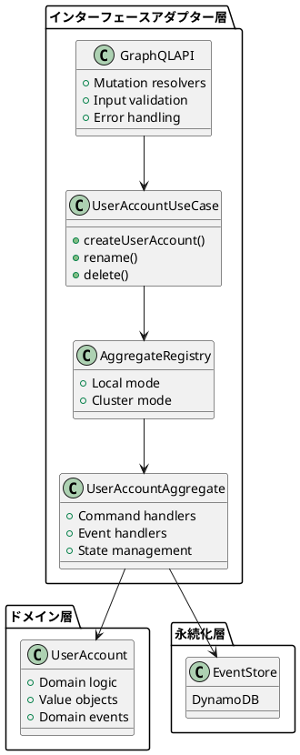
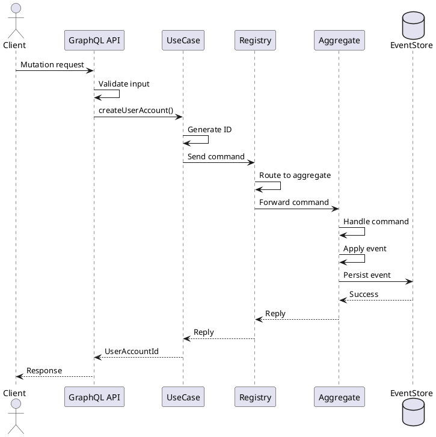

# 第3章：コマンド側の実装（書き込みモデル）

## 概要

本章では、CQRS アーキテクチャにおける**コマンド側（書き込みモデル）**の具体的な実装について解説します。コマンド側は、システムへの状態変更要求を処理し、イベントとして永続化する責務を持ちます。

以下の3つのレイヤーを順に説明します：

1. **ドメイン層とユースケース層**：ビジネスロジックとアプリケーションロジック
2. **インターフェースアダプター層（アクター）**：Apache Pekko による集約アクターの実装
3. **インターフェースアダプター層（API）**：GraphQL による外部 API の提供

## 技術的背景

### コマンド側アーキテクチャ



### 処理フロー



## 実装の詳細

### 3.1 コマンド定義（Protocol）

コマンドは Sealed trait として定義され、集約への操作を表現します。

**modules/command/interface-adapter-contract/src/main/scala/io/github/j5ik2o/pcqrses/command/interfaceAdapter/contract/users/UserAccountProtocol.scala**:

```scala
object UserAccountProtocol {

  // コマンドの基底型
  sealed trait Command {
    def id: UserAccountId
    def replyTo: ActorRef[Reply]
  }

  // 作成コマンド
  final case class Create(
    id: UserAccountId,
    name: UserAccountName,
    emailAddress: EmailAddress,
    replyTo: ActorRef[CreateReply]
  ) extends Command

  // 名前変更コマンド
  final case class Rename(
    id: UserAccountId,
    name: UserAccountName,
    replyTo: ActorRef[RenameReply]
  ) extends Command

  // 削除コマンド
  final case class Delete(
    id: UserAccountId,
    replyTo: ActorRef[DeleteReply]
  ) extends Command

  // 応答の基底型
  sealed trait Reply
  sealed trait CreateReply extends Reply
  sealed trait RenameReply extends Reply
  sealed trait DeleteReply extends Reply

  // 成功応答
  final case class CreateSucceeded(id: UserAccountId) extends CreateReply
  final case class RenameSucceeded(id: UserAccountId) extends RenameReply
  final case class DeleteSucceeded(id: UserAccountId) extends DeleteReply

  // 失敗応答
  final case class CreateFailed(id: UserAccountId, error: CreateError) extends CreateReply
  final case class RenameFailed(id: UserAccountId, error: RenameError) extends RenameReply
  final case class DeleteFailed(id: UserAccountId, error: DeleteError) extends DeleteReply
}
```

**ポイント**：

- **型安全性**：各コマンドは専用の Reply 型を持ち、コンパイル時に型チェックされます
- **アクターパターン**：`replyTo: ActorRef[Reply]` により、非同期応答を実現
- **ドメインエラー**：失敗応答にドメインエラー型を含めることで、エラーハンドリングを明示化

### 3.2 ユースケース層の実装

ユースケース層は、アプリケーションロジックを定義し、アクターへのアクセスを抽象化します。

**modules/command/use-case/src/main/scala/io/github/j5ik2o/pcqrses/command/useCase/users/UserAccountUseCase.scala**:

```scala
/**
 * UserAccountユースケースのインターフェース
 */
trait UserAccountUseCase {
  def createUserAccount(
    userAccountName: UserAccountName,
    emailAddress: EmailAddress
  ): IO[UserAccountUseCaseError, UserAccountId]
}
```

**modules/command/use-case/src/main/scala/io/github/j5ik2o/pcqrses/command/useCase/users/UserAccountUseCaseImpl.scala**:

```scala
private[users] final class UserAccountUseCaseImpl(
  userAccountAggregateRef: ActorRef[UserAccountProtocol.Command]
)(implicit
  timeout: Timeout,
  scheduler: Scheduler,
  ec: ExecutionContext
) extends UserAccountUseCase {

  private val logger = LoggerFactory.getLogger(this.getClass)

  override def createUserAccount(
    userAccountName: UserAccountName,
    emailAddress: EmailAddress
  ): IO[UserAccountUseCaseError, UserAccountId] =
    for {
      _ <- ZIO.succeed(
        logger.info(s"Creating UserAccount with userAccountName: ${userAccountName.asString}")
      )
      // 1. 新しいIDを生成
      userAccountId <- ZIO.succeed(UserAccountId.generate())

      // 2. アクターにコマンドを送信（Ask Pattern）
      reply <- askActor[UserAccountProtocol.CreateReply] { replyTo =>
        UserAccountProtocol.Create(
          id = userAccountId,
          name = userAccountName,
          emailAddress = emailAddress,
          replyTo = replyTo
        )
      }.mapError(e =>
        UserAccountUseCaseError.UnexpectedError(
          s"Failed to communicate with actor: ${e.getMessage}",
          Some(e)
        ))

      // 3. 応答を処理
      result <- reply match {
        case UserAccountProtocol.CreateSucceeded(id) =>
          ZIO.succeed(logger.info(s"UserAccount creation succeeded for ID: ${id.asString}")) *>
            ZIO.succeed(id)
      }
    } yield result

  private def askActor[R](
    createMessage: ActorRef[R] => UserAccountProtocol.Command
  ): Task[R] =
    PekkoInterop.fromFuture {
      userAccountAggregateRef.ask(createMessage)
    }
}
```

**ポイント**：

- **ZIO による合成**：`for` 式で処理を順次実行し、エラーハンドリングを統一
- **Ask Pattern**：`ask` を使用してアクターからの応答を `Future` として取得
- **PekkoInterop**：Pekko の `Future` を ZIO の `Task` に変換するユーティリティ
- **ID 生成**：ULID ベースの ID をユースケース層で生成（べき等性を保証）

### 3.3 集約アクター（Aggregate Actor）の実装

集約アクターは、コマンドを受け取り、ドメインロジックを実行し、イベントを永続化します。

**modules/command/interface-adapter/src/main/scala/io/github/j5ik2o/pcqrses/command/interfaceAdapter/aggregate/users/UserAccountAggregate.scala** (抜粋):

```scala
object UserAccountAggregate {

  def apply(id: UserAccountId): Behavior[UserAccountProtocol.Command] =
    Behaviors.setup { context =>
      context.log.info(s"Starting UserAccountAggregate: ${id.asString}")

      // PersistenceEffector の設定
      val config = PersistenceEffectorConfig
        .create[UserAccountAggregateState, UserAccountEvent, UserAccountProtocol.Command](
          persistenceId = s"${id.entityTypeName}-${id.asString}",
          initialState = UserAccountAggregateState.NotCreated(id),
          applyEvent = (state, event) => state.applyEvent(event)
        )
        .withSnapshotCriteria(SnapshotCriteria.every(1000))
        .withRetentionCriteria(RetentionCriteria.snapshotEvery(2))

      // コマンドハンドラーの定義
      PersistenceEffector.of[
        UserAccountAggregateState,
        UserAccountEvent,
        UserAccountProtocol.Command
      ](
        config = config,
        commandHandler = (state, cmd) =>
          (state, cmd) match {
            case (UserAccountAggregateState.NotCreated(id), cmd: UserAccountProtocol.Create) =>
              handleCreate(id, cmd)
            case (state: UserAccountAggregateState.Created, cmd: UserAccountProtocol.Rename) =>
              handleRename(state, cmd)
            case (state: UserAccountAggregateState.Created, cmd: UserAccountProtocol.Delete) =>
              handleDelete(state, cmd)
            case (_, cmd) =>
              Effect.reply(cmd.replyTo)(
                UserAccountProtocol.CreateFailed(
                  cmd.id,
                  CreateError.InvalidState("Invalid command for current state")
                )
              )
          }
      )
    }

  // Create コマンドのハンドラー
  private def handleCreate(
    id: UserAccountId,
    cmd: UserAccountProtocol.Create
  ): Effect[UserAccountEvent, UserAccountProtocol.CreateReply] = {
    UserAccount
      .create(
        id = id,
        name = cmd.name,
        emailAddress = cmd.emailAddress
      )
      .fold(
        error => Effect.reply(cmd.replyTo)(UserAccountProtocol.CreateFailed(id, error)),
        userAccount => {
          val event = UserAccountEvent.Created_V1(
            userAccountId = id,
            name = cmd.name,
            emailAddress = cmd.emailAddress
          )
          Effect
            .persist(event)
            .thenReply(cmd.replyTo)(_ => UserAccountProtocol.CreateSucceeded(id))
        }
      )
  }
}
```

**ポイント**：

- **PersistenceEffector**：Pekko Persistence のラッパーで、イベントソーシングを簡潔に記述
- **状態ベースのハンドリング**：パターンマッチで現在の状態に応じたコマンド処理を実装
- **ドメインロジック呼び出し**：`UserAccount.create()` でドメインロジックを実行
- **Effect API**：`Effect.persist()` でイベントを永続化、`thenReply()` で応答を返す

### 3.4 レジストリパターンの実装

レジストリは、集約アクターへのルーティングを行い、ローカルモードとクラスターモードを透過的に切り替えます。

#### 3.4.1 ファサード（GenericAggregateRegistry）

**modules/command/interface-adapter/src/main/scala/io/github/j5ik2o/pcqrses/command/interfaceAdapter/registry/GenericAggregateRegistry.scala**:

```scala
object GenericAggregateRegistry {

  enum Mode {
    case LocalMode
    case ClusterMode
  }

  def create[ID <: EntityId, CMD <: { def id: ID } : ClassTag](
    aggregateName: String,
    mode: Mode = Mode.LocalMode,
    idleTimeout: Option[FiniteDuration] = None,
    enablePassivation: Boolean = true
  )(
    nameF: ID => String,
    aggregateBehavior: ID => Behavior[CMD],
    extractId: String => Try[ID],
    createIdleMessage: ID => CMD,
    stopMessageId: Option[ID] = None
  )(implicit system: ActorSystem[?]): Behavior[CMD] =
    mode match {
      case Mode.LocalMode =>
        // ローカルモード：GenericLocalRegistryを使用
        GenericLocalAggregateRegistry.create[ID, CMD](s"$aggregateName-registry")(nameF)(
          aggregateBehavior)

      case Mode.ClusterMode =>
        // クラスターモード：GenericClusterRegistryを使用
        GenericClusterAggregateRegistry.create[ID, CMD](aggregateName)(
          extractId = extractId,
          createIdleMessage = createIdleMessage,
          stopMessageId = stopMessageId,
          idleTimeout = idleTimeout,
          enablePassivation = enablePassivation
        )(aggregateBehavior)
    }

  def modeFromConfig(system: ActorSystem[?]): Mode = {
    val config = system.settings.config
    if (config.hasPath("pekko.cluster.enabled") &&
      config.getBoolean("pekko.cluster.enabled")) {
      Mode.ClusterMode
    } else {
      Mode.LocalMode
    }
  }
}
```

**ポイント**：

- **ストラテジーパターン**：`Mode` enum で動作モードを切り替え
- **設定駆動**：`modeFromConfig()` で設定ファイルから動作モードを自動判別
- **インターフェース統一**：ローカル/クラスターで同じインターフェースを提供

#### 3.4.2 ローカルモード（GenericLocalAggregateRegistry）

**modules/command/interface-adapter/src/main/scala/io/github/j5ik2o/pcqrses/command/interfaceAdapter/registry/GenericLocalAggregateRegistry.scala**:

```scala
object GenericLocalAggregateRegistry {

  def create[ID <: EntityId, CMD <: { def id: ID }](
    name: String
  )(
    nameF: ID => String
  )(
    childBehavior: ID => Behavior[CMD]
  ): Behavior[CMD] =
    Behaviors.setup { context =>
      context.log.info(s"Starting local registry: $name")

      def getOrCreateRef(aggregateId: ID): ActorRef[CMD] = {
        val actorName = nameF(aggregateId)
        context.child(actorName) match {
          case Some(ref) =>
            context.log.debug(s"Found existing actor: $actorName")
            ref.unsafeUpcast[CMD]
          case None =>
            context.log.info(
              s"Creating new actor: $actorName for aggregate: ${aggregateId.asString}")
            context.spawn(childBehavior(aggregateId), actorName)
        }
      }

      Behaviors.receiveMessage { msg =>
        val aggregateId = msg.id.asInstanceOf[ID]
        val actorRef = getOrCreateRef(aggregateId)
        context.log.debug(s"Routing message to aggregate: ${aggregateId.asString}")
        actorRef ! msg
        Behaviors.same
      }
    }
}
```

**ポイント**：

- **遅延生成**：集約アクターは初回アクセス時に生成される
- **子アクター管理**：`context.child()` で既存アクターを検索し、なければ `spawn()`
- **メッセージルーティング**：コマンドの `id` フィールドから宛先を判別

#### 3.4.3 クラスターモード（GenericClusterAggregateRegistry）

**modules/command/interface-adapter/src/main/scala/io/github/j5ik2o/pcqrses/command/interfaceAdapter/registry/GenericClusterAggregateRegistry.scala** (抜粋):

```scala
object GenericClusterAggregateRegistry {

  final val DefaultIdleTimeout: FiniteDuration = 120.seconds
  final val DefaultNumberOfShards: Int = 100

  def create[ID <: EntityId, CMD <: { def id: ID } : ClassTag](
    aggregateName: String
  )(
    extractId: String => Try[ID],
    createIdleMessage: ID => CMD,
    stopMessageId: Option[ID] = None,
    numberOfShards: Int = DefaultNumberOfShards,
    idleTimeout: Option[FiniteDuration] = None,
    enablePassivation: Boolean = true
  )(
    aggregateBehavior: ID => Behavior[CMD]
  )(implicit system: ActorSystem[?]): Behavior[CMD] = {
    val clusterSharding = ClusterSharding(system)

    // クラスターシャーディングの初期化
    init(
      aggregateName = aggregateName,
      clusterSharding = clusterSharding,
      aggregateBehavior = aggregateBehavior,
      extractId = extractId,
      createIdleMessage = createIdleMessage,
      stopMessageId = stopMessageId,
      numberOfShards = numberOfShards,
      idleTimeout = idleTimeout.getOrElse(DefaultIdleTimeout),
      enablePassivation = enablePassivation
    )

    // プロキシBehaviorを返す
    ofProxy(aggregateName, clusterSharding)
  }

  private def init[ID <: EntityId, CMD <: { def id: ID } : ClassTag](
    aggregateName: String,
    clusterSharding: ClusterSharding,
    aggregateBehavior: ID => Behavior[CMD],
    extractId: String => Try[ID],
    createIdleMessage: ID => CMD,
    stopMessageId: Option[ID] = None,
    numberOfShards: Int = DefaultNumberOfShards,
    idleTimeout: FiniteDuration = DefaultIdleTimeout,
    enablePassivation: Boolean = true
  )(implicit system: ActorSystem[?]): ActorRef[ShardingEnvelope[CMD]] = {

    val typeKey = EntityTypeKey[CMD](aggregateName)

    def aggregateWrapper(entityContext: EntityContext[CMD]): Behavior[CMD] =
      Behaviors.setup { context =>
        context.log.info(s"Starting $aggregateName aggregate: ${entityContext.entityId}")

        // 集約IDをパース
        val aggregateId = extractId(entityContext.entityId) match {
          case Success(id) => id
          case Failure(exception) =>
            throw new IllegalArgumentException(
              s"Invalid aggregate ID: ${entityContext.entityId}",
              exception
            )
        }

        // 集約アクターを子アクターとして生成
        val childRef = context.spawn(
          aggregateBehavior(aggregateId),
          s"$aggregateName-${entityContext.entityId}"
        )

        // アイドルタイムアウトとパッシベーションの設定
        if (idleTimeout > Duration.Zero && enablePassivation) {
          val timeoutMessage = createIdleMessage(aggregateId)
          context.setReceiveTimeout(idleTimeout, timeoutMessage)

          Behaviors.receiveMessage[CMD] { msg =>
            if (msg == timeoutMessage) {
              // タイムアウト時はパッシベーションを開始
              context.log.debug(s"Aggregate ${entityContext.entityId} is idle, passivating...")
              entityContext.shard ! ClusterSharding.Passivate(context.self)
              Behaviors.same
            } else {
              childRef ! msg
              Behaviors.same
            }
          }
        } else {
          Behaviors.receiveMessage[CMD] { msg =>
            childRef ! msg
            Behaviors.same
          }
        }
      }

    val entity = Entity(typeKey)(aggregateWrapper)
      .withMessageExtractor(
        new GenericShardingMessageExtractor[ID, CMD](numberOfShards)
      )
      .withStopMessage(
        createIdleMessage(
          stopMessageId.getOrElse(
            extractId("00000000000000000000000000").getOrElse(
              throw new IllegalArgumentException("Failed to create stop message ID")
            )
          )
        )
      )

    clusterSharding.init(entity)
  }

  private def ofProxy[ID <: EntityId, CMD <: { def id: ID } : ClassTag](
    aggregateName: String,
    clusterSharding: ClusterSharding
  ): Behavior[CMD] =
    Behaviors.setup { context =>
      context.log.info(s"Starting $aggregateName sharding proxy")

      val typeKey = EntityTypeKey[CMD](aggregateName)

      Behaviors.receiveMessage { msg =>
        val entityRef = clusterSharding.entityRefFor(typeKey, msg.id.asString)
        entityRef ! msg
        Behaviors.same
      }
    }
}
```

**ポイント**：

- **Cluster Sharding**：集約アクターをクラスター内の複数ノードに分散配置
- **パッシベーション**：アイドル状態の集約をメモリから削除し、リソースを節約
- **EntityTypeKey**：集約の種類ごとにシャーディングキーを定義
- **MessageExtractor**：メッセージから Shard ID とEntity ID を抽出してルーティング
- **Wrapper Actor**：集約アクターをラップし、タイムアウトやパッシベーションを管理

**クラスターモードの利点**：

- **スケーラビリティ**：ノードを追加するだけで処理能力を拡張
- **高可用性**：ノード障害時に別ノードで集約を再生成
- **メモリ効率**：非アクティブな集約を自動的にアンロード

### 3.5 GraphQL API の実装

GraphQL API は、外部からのコマンド要求を受け付け、ユースケース層に委譲します。

#### 3.5.1 型定義（TypeDefinitions）

**modules/command/interface-adapter/src/main/scala/io/github/j5ik2o/pcqrses/command/interfaceAdapter/graphql/schema/TypeDefinitions.scala**:

```scala
trait TypeDefinitions extends ScalarTypes {

  // 結果型の定義
  val CreateUserAccountResultType: ObjectType[ResolverContext, CreateUserAccountResult] =
    ObjectType(
      "CreateUserAccountResult",
      "Result of creating a user account",
      fields[ResolverContext, CreateUserAccountResult](
        Field("id", StringType, resolve = _.value.id)
      )
    )

  // 入力引数の定義
  val CreateUserAccountInputArg: Argument[CreateUserAccountInput] = {
    import sangria.marshalling.circe.*
    import io.circe.generic.semiauto.*

    implicit val createUserAccountInputDecoder: io.circe.Decoder[CreateUserAccountInput] =
      deriveDecoder[CreateUserAccountInput]
    implicit val createUserAccountInputEncoder: io.circe.Encoder[CreateUserAccountInput] =
      deriveEncoder[CreateUserAccountInput]
    implicit val createUserAccountInputFromInput
      : sangria.marshalling.FromInput[CreateUserAccountInput] =
      circeDecoderFromInput[CreateUserAccountInput]

    Argument(
      "input",
      InputObjectType[CreateUserAccountInput](
        "CreateUserAccountInput",
        "Input for creating a user account",
        List(
          InputField("firstName", StringType),
          InputField("lastName", StringType),
          InputField("emailAddress", StringType)
        )
      )
    )
  }
}

case class CreateUserAccountResult(id: String)
case class CreateUserAccountInput(
  firstName: String,
  lastName: String,
  emailAddress: String
)
```

**ポイント**：

- **Sangria DSL**：GraphQL スキーマを Scala のコードで定義
- **Circe 統合**：JSON シリアライゼーション/デシリアライゼーションを自動生成
- **型安全性**：コンパイル時に型チェックが行われる

#### 3.5.2 Mutation リゾルバー（MutationResolver）

**modules/command/interface-adapter/src/main/scala/io/github/j5ik2o/pcqrses/command/interfaceAdapter/graphql/resolvers/MutationResolver.scala**:

```scala
trait MutationResolver extends TypeDefinitions {

  val MutationType: ObjectType[ResolverContext, Unit] = ObjectType(
    "Mutation",
    "Root mutation type",
    fields[ResolverContext, Unit](
      Field(
        "createUserAccount",
        CreateUserAccountResultType,
        description = Some("Create a new user account"),
        arguments = CreateUserAccountInputArg :: Nil,
        resolve = ctx => {
          val input = ctx.arg(CreateUserAccountInputArg)

          // 1. バリデーション
          CreateUserAccountInputValidator.validate(input).toEither match {
            case Left(errors) =>
              // ValidationErrorを使用してバリデーションエラーを返す
              scala.concurrent.Future.failed(ValidationError(errors.toList))
            case Right((userAccountName, emailAddress)) =>
              // 2. ユースケース実行
              ctx.ctx.runZioTask(
                ctx.ctx.userAccountUseCase
                  .createUserAccount(userAccountName, emailAddress)
                  .mapBoth(
                    // CommandErrorを使用してコマンド実行エラーを返す
                    error =>
                      CommandError(
                        s"Failed to create user account: ${error.toString}",
                        Some("CREATE_USER_FAILED")),
                    userAccountId => CreateUserAccountResult(id = userAccountId.asString)
                  )
              )
          }
        }
      )
    )
  )
}
```

**ポイント**：

- **resolve 関数**：GraphQL フィールドの値を解決するロジック
- **ctx.arg()**：引数を取得し、バリデーションに渡す
- **ctx.ctx**：ResolverContext を通じてユースケースにアクセス
- **runZioTask()**：ZIO の Task を Future に変換して実行

#### 3.5.3 バリデーション（CreateUserAccountInputValidator）

**modules/command/interface-adapter/src/main/scala/io/github/j5ik2o/pcqrses/command/interfaceAdapter/graphql/validators/CreateUserAccountInputValidator.scala**:

```scala
object CreateUserAccountInputValidator {
  type ErrorInfo = String

  def validate(
    input: CreateUserAccountInput): Validation[ErrorInfo, (UserAccountName, EmailAddress)] =
    Validation.validateWith(
      Validation.fromEither(
        FirstName
          .parseFromString(input.firstName)
          .left
          .map(e => s"Invalid first name: ${e.message}")
      ),
      Validation.fromEither(
        LastName
          .parseFromString(input.lastName)
          .left
          .map(e => s"Invalid last name: ${e.message}")
      ),
      Validation.fromEither(
        EmailAddress
          .parseFromString(input.emailAddress)
          .left
          .map(e => s"Invalid email: ${e.message}")
      )
    )((firstName, lastName, emailAddress) => (UserAccountName(firstName, lastName), emailAddress))
}
```

**ポイント**：

- **ZIO Prelude Validation**：複数のバリデーションを合成し、すべてのエラーを収集
- **Applicative Functor**：`validateWith()` で並行にバリデーションを実行
- **ドメインオブジェクト生成**：検証成功時に Value Object を生成

#### 3.5.4 GraphQL スキーマの統合

**modules/command/interface-adapter/src/main/scala/io/github/j5ik2o/pcqrses/command/interfaceAdapter/graphql/schema/GraphQLSchema.scala**:

```scala
class GraphQLSchema extends TypeDefinitions with QueryResolver with MutationResolver {

  def schema: Schema[ResolverContext, Unit] = Schema(
    query = QueryType,
    mutation = Some(MutationType),
    subscription = None // 将来的にSubscriptionResolverを追加
  )
}

object GraphQLSchema {
  def apply(): GraphQLSchema = new GraphQLSchema()
}
```

**ポイント**：

- **Trait 合成**：複数の Trait をミックスインしてスキーマを構成
- **Schema オブジェクト**：Sangria の `Schema` クラスで Query と Mutation を統合

## ベストプラクティス

### 1. コマンドとイベントの命名

**コマンド**：命令形（Create, Rename, Delete）
**イベント**：過去形（Created, Renamed, Deleted）

```scala
// コマンド
case class Create(...)

// イベント
case class Created_V1(...)
```

この命名規則により、意図と結果を明確に区別できます。

### 2. バリデーションの段階的実装

バリデーションは3つのレイヤーで実施します：

1. **GraphQL 層**：入力値の構文チェック（型、必須項目）
2. **ドメイン層**：ビジネスルールの検証（Value Object のコンストラクタ）
3. **集約層**：状態依存の検証（例: すでに削除されたアカウントの変更不可）

```scala
// GraphQL層
CreateUserAccountInputValidator.validate(input)

// ドメイン層
FirstName.parseFromString(input.firstName) // 長さや形式のチェック

// 集約層
case (UserAccountAggregateState.Deleted(_), _) =>
  Effect.reply(cmd.replyTo)(
    UserAccountProtocol.RenameFailed(cmd.id, RenameError.AlreadyDeleted)
  )
```

### 3. エラーハンドリングの一貫性

エラーは以下の3種類に分類します：

1. **ValidationError**：入力値の検証エラー（400 Bad Request）
2. **CommandError**：コマンド実行エラー（409 Conflict）
3. **UnexpectedError**：予期しないエラー（500 Internal Server Error）

```scala
// GraphQL エラーハンドリング
ctx.ctx.userAccountUseCase
  .createUserAccount(userAccountName, emailAddress)
  .mapBoth(
    error => CommandError(s"Failed: ${error.toString}", Some("CREATE_USER_FAILED")),
    userAccountId => CreateUserAccountResult(id = userAccountId.asString)
  )
```

### 4. レジストリモードの選択基準

| 基準 | ローカルモード | クラスターモード |
|------|----------------|------------------|
| **開発環境** | ✅ 推奨 | - |
| **単一ノード本番** | ✅ 可能 | - |
| **複数ノード本番** | - | ✅ 必須 |
| **高可用性要件** | - | ✅ 推奨 |
| **メモリ制約** | - | ✅ 推奨（パッシベーション） |

**設定例**：

```hocon
# ローカルモード
pekko.cluster.enabled = false

# クラスターモード
pekko.cluster.enabled = true
```

### 5. パッシベーションの設定

クラスターモードでは、アイドルタイムアウトを適切に設定します：

```scala
GenericAggregateRegistry.create[UserAccountId, UserAccountProtocol.Command](
  aggregateName = "UserAccountAggregate",
  mode = GenericAggregateRegistry.Mode.ClusterMode,
  idleTimeout = Some(120.seconds),  // 2分間アイドルでパッシベーション
  enablePassivation = true
)(...)
```

**推奨値**：

- **高頻度アクセス集約**：300秒（5分）
- **中頻度アクセス集約**：120秒（2分）
- **低頻度アクセス集約**：60秒（1分）

### 6. スナップショット戦略

イベント数が多い集約では、スナップショットでリカバリ時間を短縮します：

```scala
.withSnapshotCriteria(SnapshotCriteria.every(1000))  // 1000イベントごとにスナップショット
.withRetentionCriteria(RetentionCriteria.snapshotEvery(2))  // 最新2つのスナップショットを保持
```

**推奨値**：

- **イベント頻度が高い集約**：500〜1000 イベントごと
- **イベント頻度が低い集約**：スナップショット不要

## まとめ

本章では、コマンド側の実装を以下の順で解説しました：

1. **コマンド定義**：Sealed trait でコマンドと応答を型安全に定義
2. **ユースケース層**：アプリケーションロジックとアクターアクセスの抽象化
3. **集約アクター**：PersistenceEffector によるイベントソーシングの実装
4. **レジストリパターン**：ローカル/クラスターモードの透過的な切り替え
5. **GraphQL API**：Sangria による型安全な API 実装

これらの実装により、以下が実現されます：

- **拡張性**：クラスターモードで水平スケーリング
- **保守性**：レイヤー分離と型安全性によるコード品質向上
- **テスタビリティ**：インターフェース分離によるモック化の容易さ

次章では、**クエリ側の実装（読み取りモデル）**を解説します。

---

👉 [第4章：クエリ側の実装（読み取りモデル）](part2-04-query-side.md)
