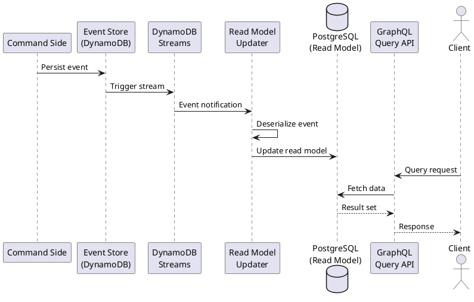

# 第4章：クエリ側の実装（読み取りモデル）

## 概要

本章では、CQRS アーキテクチャにおける**クエリ側（読み取りモデル）**の実装を解説します。クエリ側は、システムからのデータ取得要求に応答し、最適化されたビューを提供する責務を持ちます。

以下の4つのコンポーネントを順に説明します：

1. **データベーススキーマ**：PostgreSQL による読み取りモデルの設計
2. **Slick DAO**：型安全なデータベースアクセス
3. **GraphQL API**：柔軟なクエリインターフェース
4. **Read Model Updater**：イベントストリームからの非同期更新

## 技術的背景

### クエリ側アーキテクチャ

```plantuml
@startuml
!define RECTANGLE class

package "クエリ側（Query Side）" {
  RECTANGLE GraphQLAPI {
    + Query resolvers
    + Type definitions
    + Validation
  }

  RECTANGLE ResolverContext {
    + runDbAction()
    + ExecutionContext
  }

  RECTANGLE SlickDAO {
    + findById()
    + findAll()
    + Custom queries
  }

  database PostgreSQL {
    user_accounts
  }
}

package "イベント処理" {
  RECTANGLE ReadModelUpdater {
    + DynamoDB Streams
    + Event deserialization
    + Database updates
  }
}

package "イベントストア" {
  database DynamoDB {
    Journal
  }
}

actor Client

Client --> GraphQLAPI: Query request
GraphQLAPI --> ResolverContext
ResolverContext --> SlickDAO
SlickDAO --> PostgreSQL

DynamoDB --> ReadModelUpdater: Stream events
ReadModelUpdater --> PostgreSQL: Update read model

@enduml
```

### データフロー



**重要な特徴**：

- **結果整合性（Eventual Consistency）**：コマンド実行後、クエリ側への反映には遅延が発生
- **非同期処理**：イベントストリームを介した非同期更新
- **最適化されたスキーマ**：読み取り専用に特化したテーブル設計

## 実装の詳細

### 4.1 データベーススキーマ（Flyway Migration）

読み取りモデルのスキーマは、Flyway でバージョン管理されます。

**modules/query/flyway-migration/src/main/resources/db/migration/V1__create_tables.sql**:

```sql
create table "user_accounts"
(
    "id"            char(26)                  not null primary key,
    "first_name"    varchar                   not null,
    "last_name"     varchar                   not null,
    "created_at"    timestamp with time zone  not null default current_timestamp,
    "updated_at"    timestamp with time zone  not null default current_timestamp
);
```

**設計のポイント**：

- **非正規化**：`first_name` と `last_name` を個別カラムとして保存（検索の最適化）
- **タイムスタンプ**：`created_at` と `updated_at` でデータの鮮度を管理
- **ULID**：`id` は26文字の ULID（タイムスタンプソート可能）
- **インデックス**：主キーインデックスのみ（必要に応じて追加可能）

### 4.2 Slick DAO の実装

#### 4.2.1 DAO サポート基盤（SlickDaoSupport）

**modules/query/interface-adapter/src/main/scala/io/github/j5ik2o/pcqrses/query/interfaceAdapter/dao/SlickDaoSupport.scala**:

```scala
trait SlickDaoSupport {
  val profile: JdbcProfile
  import profile.api.*

  trait Record

  trait SoftDeletableRecord extends Record {
    val status: String
  }

  abstract class TableBase[T](
    _tableTag: profile.api.Tag,
    _tableName: String,
    _schemaName: Option[String] = None)
    extends profile.api.Table[T](_tableTag, _schemaName, _tableName)

  trait SoftDeletableTableSupport[T] {
    this: TableBase[T] =>
    def status: profile.api.Rep[String]
  }
}
```

**ポイント**：

- **プロファイル抽象化**：`JdbcProfile` により DB の種類を抽象化
- **Record トレイト**：全レコード型の基底
- **SoftDeletableRecord**：論理削除をサポート（将来の拡張用）
- **TableBase**：Slick の `Table` クラスの共通基底

#### 4.2.2 自動生成 DAO（UserAccounts）

**modules/query/interface-adapter/src/main/scala/io/github/j5ik2o/pcqrses/query/interfaceAdapter/dao/UserAccounts.scala**:

```scala
trait UserAccountsComponent extends SlickDaoSupport with UserAccountsExtensions {
  import profile.api._

  // レコード型の定義
  final case class UserAccountsRecord(
    id: String,
    firstName: String,
    lastName: String,
    createdAt: java.sql.Timestamp,
    updatedAt: java.sql.Timestamp
  ) extends Record

  // Slick テーブル定義
  final case class UserAccounts(tag: Tag)
    extends TableBase[UserAccountsRecord](tag, "user_accounts") {
    def id: Rep[String] = column[String]("id")
    def firstName: Rep[String] = column[String]("first_name")
    def lastName: Rep[String] = column[String]("last_name")
    def createdAt: Rep[java.sql.Timestamp] = column[java.sql.Timestamp]("created_at")
    def updatedAt: Rep[java.sql.Timestamp] = column[java.sql.Timestamp]("updated_at")

    def pk: PrimaryKey = primaryKey("pk", id)

    override def * : ProvenShape[UserAccountsRecord] =
      (id, firstName, lastName, createdAt, updatedAt) <> (
        UserAccountsRecord.apply,
        UserAccountsRecord.unapply)
  }

  // DAO オブジェクト
  object UserAccountsDao extends TableQuery(UserAccounts.apply) with UserAccountsDaoExtensions
}
```

**ポイント**：

- **自動生成**：このファイルは `sbt-dao-generator` で自動生成される
- **型安全性**：Slick の `Rep[T]` により型チェックが効く
- **ProvenShape**：`<>` 演算子でレコード型とテーブルカラムをマッピング
- **TableQuery**：クエリビルダーとして機能

#### 4.2.3 DAO 拡張（UserAccountsExtensions）

**modules/query/interface-adapter/src/main/scala/io/github/j5ik2o/pcqrses/query/interfaceAdapter/dao/UserAccountsExtensions.scala**:

```scala
trait UserAccountsExtensions {
  this: UserAccountsComponent =>
  trait UserAccountsDaoExtensions { dao: UserAccountsDao.type =>
    import profile.api._

    def findAll(): DBIO[Seq[UserAccountsRecord]] =
      dao.result

    def findByIds(ids: Seq[String]): DBIO[Seq[UserAccountsRecord]] =
      dao.filter(_.id inSet ids).result

    def findById(id: String): DBIO[Option[UserAccountsRecord]] =
      dao.filter(_.id === id).result.headOption
  }
}
```

**ポイント**：

- **カスタムクエリ**：自動生成されない独自クエリを追加
- **DBIO アクション**：Slick の `DBIO` モナドで遅延評価
- **フィルタリング**：`filter()` で WHERE 句を構築
- **inSet**：IN 句による複数 ID 検索

**自動生成の運用**：

```bash
# スキーマからDAOを再生成
sbt "queryInterfaceAdapter/generateAllWithDb"
```

### 4.3 GraphQL API の実装

#### 4.3.1 ResolverContext（データアクセス抽象化）

**modules/query/interface-adapter/src/main/scala/io/github/j5ik2o/pcqrses/query/interfaceAdapter/graphql/ResolverContext.scala**:

```scala
final case class ResolverContext(
  private val dbRunner: DBIO[?] => Future[?],
  private val executionContext: ExecutionContext
) {
  implicit val ec: ExecutionContext = executionContext

  def runDbAction[T](action: DBIO[T]): Future[T] =
    dbRunner(action).asInstanceOf[Future[T]]

  def runDbActionTransactionally[T](action: DBIO[T])(implicit profile: JdbcProfile): Future[T] = {
    import profile.api._
    runDbAction(action.transactionally)
  }
}

object ResolverContext {
  def fromSlickDatabase(db: JdbcProfile#Backend#Database)(implicit
    ec: ExecutionContext): ResolverContext =
    ResolverContext(
      dbRunner = action => db.run(action.asInstanceOf[DBIO[Any]]),
      executionContext = ec
    )

  def forTesting(mockRunner: DBIO[?] => Future[?])(implicit ec: ExecutionContext): ResolverContext =
    ResolverContext(mockRunner, ec)
}
```

**ポイント**：

- **DB アクセス抽象化**：`dbRunner` により DB 接続を隠蔽
- **トランザクション対応**：`runDbActionTransactionally()` で ACID 保証
- **テスタビリティ**：`forTesting()` でモック化が容易

#### 4.3.2 型定義（TypeDefinitions）

**modules/query/interface-adapter/src/main/scala/io/github/j5ik2o/pcqrses/query/interfaceAdapter/graphql/schema/TypeDefinitions.scala**:

```scala
trait TypeDefinitions {
  this: UserAccountsComponent =>

  val UserAccountIdArg: Argument[String] =
    Argument("userAccountId", StringType, description = "Id of UserAccount")

  val UserAccountIdsArg: Argument[Seq[String & Tagged[CoercedScalaResult] | Null]] =
    Argument("userAccountIds", ListInputType(StringType), description = "List of UserAccount IDs")

  val UserAccountType: ObjectType[ResolverContext, UserAccountsRecord] = ObjectType(
    "UserAccount",
    "User account information",
    fields[ResolverContext, UserAccountsRecord](
      Field("id", StringType, description = Some("Unique identifier"), resolve = _.value.id),
      Field(
        "firstName",
        StringType,
        description = Some("User's first name"),
        resolve = _.value.firstName),
      Field(
        "lastName",
        StringType,
        description = Some("User's last name"),
        resolve = _.value.lastName),
      Field(
        "fullName",
        StringType,
        description = Some("User's full name"),
        resolve = ctx => s"${ctx.value.firstName} ${ctx.value.lastName}"),
      Field(
        "createdAt",
        OffsetDateTimeType,
        description = Some("Account creation timestamp"),
        resolve =
          t => OffsetDateTime.ofInstant(t.value.createdAt.toInstant, java.time.ZoneOffset.UTC)
      ),
      Field(
        "updatedAt",
        OffsetDateTimeType,
        description = Some("Last update timestamp"),
        resolve =
          t => OffsetDateTime.ofInstant(t.value.updatedAt.toInstant, java.time.ZoneOffset.UTC)
      )
    )
  )
}
```

**ポイント**：

- **計算フィールド**：`fullName` はデータベースに存在せず、リゾルバーで動的に生成
- **型変換**：`Timestamp` を `OffsetDateTime` に変換して ISO8601 形式で返す
- **Self-type**：`this: UserAccountsComponent =>` で DAO への依存を宣言

#### 4.3.3 Query リゾルバー（QueryResolver）

**modules/query/interface-adapter/src/main/scala/io/github/j5ik2o/pcqrses/query/interfaceAdapter/graphql/resolvers/QueryResolver.scala** (抜粋):

```scala
trait QueryResolver extends TypeDefinitions {
  this: UserAccountsComponent =>

  val QueryType: ObjectType[ResolverContext, Unit] = ObjectType(
    "Query",
    "Root query type",
    fields[ResolverContext, Unit](
      // 単一アカウント取得
      Field(
        "getUserAccount",
        OptionType(UserAccountType),
        description = Some("Get a single user account by ID"),
        arguments = UserAccountIdArg :: Nil,
        resolve = ctx => {
          val id = ctx.arg(UserAccountIdArg)
          QueryInputValidator.validateUserAccountId(id).toEither match {
            case Left(errors) =>
              scala.concurrent.Future.failed(ValidationError(errors.toList))
            case Right(validId) =>
              ctx.ctx
                .runDbAction(UserAccountsDao.findById(validId))
                .recover { case ex: Exception =>
                  throw QueryError(
                    s"Failed to fetch user account: ${ex.getMessage}",
                    Some("FETCH_USER_FAILED"))
                }(ctx.ctx.ec)
          }
        }
      ),

      // 全アカウント取得
      Field(
        "getUserAccounts",
        ListType(UserAccountType),
        description = Some("Get all user accounts"),
        resolve = ctx => ctx.ctx.runDbAction(UserAccountsDao.findAll())
      ),

      // 複数ID検索
      Field(
        "getUserAccountsByIds",
        ListType(UserAccountType),
        description = Some("Get multiple user accounts by IDs"),
        arguments = UserAccountIdsArg :: Nil,
        resolve = ctx => {
          val ids = ctx.arg(UserAccountIdsArg).asInstanceOf[Seq[String]]
          QueryInputValidator.validateUserAccountIds(ids).toEither match {
            case Left(errors) =>
              scala.concurrent.Future.failed(ValidationError(errors.toList))
            case Right(validIds) =>
              ctx.ctx
                .runDbAction(UserAccountsDao.findByIds(validIds))
                .recover { case ex: Exception =>
                  throw QueryError(
                    s"Failed to fetch user accounts: ${ex.getMessage}",
                    Some("FETCH_USERS_FAILED"))
                }(ctx.ctx.ec)
          }
        }
      ),

      // 名前検索
      Field(
        "searchUserAccounts",
        ListType(UserAccountType),
        description = Some("Search user accounts by name"),
        arguments = Argument("searchTerm", StringType, description = "Search term for name") :: Nil,
        resolve = ctx => {
          val searchTerm = ctx.arg[String]("searchTerm")
          QueryInputValidator.validateSearchTerm(searchTerm).toEither match {
            case Left(errors) =>
              scala.concurrent.Future.failed(ValidationError(errors.toList))
            case Right(validSearchTerm) =>
              ctx.ctx
                .runDbAction {
                  import profile.api._
                  UserAccountsDao
                    .filter(u =>
                      u.firstName.toLowerCase.like(s"%${validSearchTerm.toLowerCase}%") ||
                        u.lastName.toLowerCase.like(s"%${validSearchTerm.toLowerCase}%"))
                    .result
                }
                .recover { case ex: Exception =>
                  throw QueryError(
                    s"Failed to search user accounts: ${ex.getMessage}",
                    Some("SEARCH_USERS_FAILED"))
                }(ctx.ctx.ec)
          }
        }
      )
    )
  )
}
```

**ポイント**：

- **バリデーション**：`QueryInputValidator` で入力値を検証
- **エラーハンドリング**：`recover()` で例外を `QueryError` に変換
- **動的クエリ**：`searchUserAccounts` では `filter()` と `like()` で部分一致検索
- **OptionType vs ListType**：単一結果は `Option`、複数結果は `List`

#### 4.3.4 GraphQL サービス（GraphQLService）

**modules/query/interface-adapter/src/main/scala/io/github/j5ik2o/pcqrses/query/interfaceAdapter/graphql/GraphQLService.scala** (抜粋):

```scala
class GraphQLService(
  profile: JdbcProfile,
  db: JdbcProfile#Backend#Database
)(implicit ec: ExecutionContext) {

  private val graphQLSchema = GraphQLSchema(profile)
  private val schema = graphQLSchema.schema

  def executeQuery(
    query: String,
    operationName: Option[String] = None,
    variables: Option[Json] = None,
    isIntrospection: Boolean = false
  ): Future[Json] =
    QueryParser.parse(query) match {
      case Success(queryAst) =>
        val context = ResolverContext.fromSlickDatabase(db)
        val vars = variables.getOrElse(Json.obj())

        // introspectionクエリの場合は深さ制限を緩和
        val maxDepth = if (isIntrospection) 30 else 10

        Executor
          .execute(
            schema = schema,
            queryAst = queryAst,
            userContext = context,
            variables = vars,
            operationName = operationName,
            queryReducers = List(
              QueryReducer.rejectMaxDepth(maxDepth),
              QueryReducer.rejectComplexQueries(
                1000.0,
                (complexity: Double, _: Any) => new Exception(s"Query too complex: $complexity"))
            ),
            exceptionHandler = GraphQLErrorHandler.exceptionHandler
          )
          .recover { case error: ErrorWithResolver =>
            Json.obj("errors" -> Json.arr(Json.obj("message" -> Json.fromString(error.getMessage))))
          }

      case Failure(error: SyntaxError) =>
        Future.successful(
          Json.obj(
            "errors" -> Json.arr(
              Json.obj(
                "message" -> Json.fromString(s"Syntax error: ${error.getMessage}"),
                "locations" -> Json.arr(
                  Json.obj(
                    "line" -> Json.fromInt(error.originalError.position.line),
                    "column" -> Json.fromInt(error.originalError.position.column)
                  )
                )
              )
            )
          )
        )

      case Failure(error) =>
        Future.successful(
          Json.obj("errors" -> Json.arr(Json.obj("message" -> Json.fromString(error.getMessage))))
        )
    }
}
```

**ポイント**：

- **クエリパース**：`QueryParser.parse()` で GraphQL クエリを AST に変換
- **Query Reducers**：
  - **maxDepth**：ネストの深さを制限（DoS 攻撃対策）
  - **complexity**：クエリの複雑さを制限（コスト管理）
- **Introspection**：スキーマ探索クエリには深さ制限を緩和
- **エラーハンドリング**：構文エラーには行/列番号を含めて返す

### 4.4 Read Model Updater の実装

Read Model Updater は、DynamoDB Streams からイベントを受け取り、PostgreSQL の読み取りモデルを更新します。

**apps/read-model-updater/src/main/scala/io/github/j5ik2o/pcqrses/readModelUpdater/LambdaHandler.scala** (抜粋):

```scala
class LambdaHandler extends RequestHandler[DynamodbEvent, LambdaResponse] {

  private val logger = LoggerFactory.getLogger(getClass)
  private val objectMapper = new ObjectMapper()
  objectMapper.registerModule(DefaultScalaModule)

  private val config = ConfigFactory.load()
  private lazy val system = ActorSystem("read-model-updater", config)
  private lazy val serialization = SerializationExtension(system)

  private val databaseConfig: DatabaseConfig[JdbcProfile] =
    DatabaseConfig.forConfig[JdbcProfile]("read-model-updater.slick", config)

  private val UserAccountEntityTypePrefix = "UserAccount-"

  override def handleRequest(input: DynamodbEvent, context: Context): LambdaResponse = {
    try {
      logger.info(s"Received DynamoDB event with ${input.getRecords.size} records")

      val results = input.getRecords.asScala.map(processRecord).toList

      val failures = results.collect { case Left(error) => error }
      val successes = results.collect { case Right(_) => () }

      if (failures.nonEmpty) {
        logger.error(s"Failed to process ${failures.size} out of ${results.size} records")
        failures.foreach { error =>
          logger.error(s"Processing error: ${error.message}", error.exception.orNull)
        }
        LambdaResponse(
          statusCode = 207, // Multi-Status
          body = objectMapper.writeValueAsString(
            ResponseBody(
              message = s"Processed ${successes.size} records successfully, ${failures.size} failed",
              error = Some(failures.map(_.message).mkString("; "))
            )
          )
        )
      } else {
        logger.info(s"Successfully processed ${successes.size} records")
        LambdaResponse(
          statusCode = 200,
          body = objectMapper.writeValueAsString(
            ResponseBody(message = s"Successfully processed ${successes.size} records")
          )
        )
      }
    } catch {
      case ex: Exception =>
        logger.error("Unexpected error processing DynamoDB event", ex)
        LambdaResponse(
          statusCode = 500,
          body = objectMapper.writeValueAsString(
            ResponseBody(message = "Internal server error", error = Some(ex.getMessage))
          )
        )
    }
  }

  private def processRecord(record: DynamodbStreamRecord): Either[ProcessingError, Unit] = {
    try {
      val tableName = record.getEventSourceARN.split("/")(1)
      // Journal テーブルのみ処理
      if (tableName != "Journal") {
        logger.debug(s"Skipping record from table: $tableName")
        return Right(())
      }

      val newImage = Option(record.getDynamodb.getNewImage)
      if (newImage.isEmpty) {
        logger.debug("Skipping record without NewImage (likely DELETE event)")
        return Right(())
      }

      val attributes = newImage.get.asScala

      // persistence-id で UserAccount イベントかチェック
      val persistenceIdOpt = Option(attributes.get("persistence-id"))
        .flatMap(attrOpt => Option(attrOpt.map(_.getS).orNull))

      if (persistenceIdOpt.isEmpty || !persistenceIdOpt.get.startsWith(UserAccountEntityTypePrefix)) {
        logger.debug(s"Skipping record with persistence-id: ${persistenceIdOpt.getOrElse("null")}")
        return Right(())
      }

      val messageAttrOpt = attributes.get("message")
      if (messageAttrOpt.isEmpty) {
        logger.warn("Record missing message attribute")
        return Left(ProcessingError("Missing message attribute", None))
      }
      val messageAttr = messageAttrOpt.get

      val messageBytes = Option(messageAttr.getB) match {
        case Some(binaryData) =>
          convertToBytes(binaryData)
        case None =>
          throw new IllegalArgumentException("Message attribute B (binary) is required")
      }

      // PersistentRepr からイベントを取り出して処理
      deserializePersistentReprAndProcess(messageBytes)
    } catch {
      case ex: Exception =>
        logger.error("Error processing record", ex)
        Left(ProcessingError(s"Error processing record: ${ex.getMessage}", Some(ex)))
    }
  }

  private def deserializePersistentReprAndProcess(bytes: Array[Byte]): Either[ProcessingError, Unit] = {
    try {
      // PersistentRepr をデシリアライズ
      deserializePersistentRepr(bytes) match {
        case scala.util.Success(persistentRepr) =>
          logger.debug(s"Successfully deserialized PersistentRepr:")
          logger.debug(s"  Persistence ID: ${persistentRepr.persistenceId}")
          logger.debug(s"  Sequence Nr: ${persistentRepr.sequenceNr}")

          // ペイロード（実際のイベント）を取り出す
          persistentRepr.payload match {
            case event: UserAccountEvent =>
              logger.info(s"Processing UserAccountEvent: ${event.getClass.getSimpleName} for entity: ${event.entityId.asString}")
              processUserAccountEvent(event)
            case other =>
              logger.warn(s"Unknown event type: ${other.getClass.getName}")
              Right(())
          }

        case scala.util.Failure(ex) =>
          logger.error(s"Failed to deserialize PersistentRepr: ${ex.getMessage}", ex)
          Left(ProcessingError(s"Error deserializing PersistentRepr: ${ex.getMessage}", Some(ex)))
      }
    } catch {
      case ex: Exception =>
        logger.error("Error processing PersistentRepr", ex)
        Left(ProcessingError(s"Error processing PersistentRepr: ${ex.getMessage}", Some(ex)))
    }
  }

  private def processUserAccountEvent(event: UserAccountEvent): Either[ProcessingError, Unit] = {
    try {
      val db = databaseConfig.db
      val component = new UserAccountsComponent {
        override val profile: JdbcProfile = databaseConfig.profile
      }
      import databaseConfig.profile.api.*

      // イベント種別に応じたDBアクションを生成
      val action = event match {
        case UserAccountEvent.Created_V1(_, entityId, name, _, occurredAt) =>
          val record = component.UserAccountsRecord(
            id = entityId.asString,
            firstName = name.breachEncapsulationOfFirstName.asString,
            lastName = name.breachEncapsulationOfLastName.asString,
            createdAt = Timestamp.from(occurredAt.asInstant()),
            updatedAt = Timestamp.from(occurredAt.asInstant())
          )
          component.UserAccountsDao.insertOrUpdate(record)

        case UserAccountEvent.Renamed_V1(_, entityId, _, newName, occurredAt) =>
          component.UserAccountsDao
            .filter(_.id === entityId.asString)
            .map(r => (r.firstName, r.lastName, r.updatedAt))
            .update(
              (newName.breachEncapsulationOfFirstName.asString,
                newName.breachEncapsulationOfLastName.asString,
                Timestamp.from(occurredAt.asInstant()))
            )

        case UserAccountEvent.Deleted_V1(_, entityId, _) =>
          component.UserAccountsDao.filter(_.id === entityId.asString).delete
      }

      val result = Await.result(db.run(action), databaseOperationTimeout)
      logger.debug(s"Successfully processed event: ${event.getClass.getSimpleName} for entity: ${event.entityId.asString}")
      Right(())
    } catch {
      case ex: Exception =>
        logger.error(s"Error processing UserAccountEvent: ${event.getClass.getSimpleName}", ex)
        Left(ProcessingError(s"Error processing event: ${ex.getMessage}", Some(ex)))
    }
  }
}
```

**ポイント**：

- **DynamoDB Streams**：イベントストアの変更を検知してトリガー
- **フィルタリング**：Journal テーブルかつ UserAccount イベントのみ処理
- **デシリアライゼーション**：Pekko Serialization で PersistentRepr をデコード
- **イベントハンドリング**：
  - **Created**: INSERT or UPDATE（べき等性）
  - **Renamed**: UPDATE（特定フィールドのみ）
  - **Deleted**: DELETE（物理削除）
- **エラー処理**：部分的な失敗でも他のレコードは継続処理（207 Multi-Status）

**Lambda 関数のデプロイ**：

```bash
# Dockerイメージをビルド
sbt dockerBuildAll

# LocalStack にデプロイ（開発環境）
# docker-compose.yml で自動デプロイ設定
```

## ベストプラクティス

### 1. 非正規化によるクエリ最適化

読み取りモデルでは、正規化よりもクエリ性能を優先します。

**良い例**：

```sql
-- 非正規化：fullNameを事前計算して保存（検索性能向上）
create table "user_accounts_denormalized" (
    "id"         char(26) not null primary key,
    "full_name"  varchar  not null,  -- first_name + last_name
    "email"      varchar  not null,
    "created_at" timestamp with time zone not null
);

create index "idx_user_accounts_full_name" on "user_accounts_denormalized"("full_name");
```

**トレードオフ**：

- **利点**：クエリが高速化、インデックスが効率的
- **欠点**：ストレージ容量増加、更新処理の複雑化

### 2. インデックス戦略

頻繁に検索されるフィールドにはインデックスを追加します。

```sql
-- 検索パターンに応じたインデックス
create index "idx_user_accounts_last_name" on "user_accounts"("last_name");
create index "idx_user_accounts_created_at" on "user_accounts"("created_at" desc);

-- 複合インデックス（姓名の両方で検索する場合）
create index "idx_user_accounts_name" on "user_accounts"("last_name", "first_name");
```

**注意点**：

- インデックスは書き込み性能を低下させる
- 読み取り専用モデルでは、書き込み頻度が低いため影響は小さい

### 3. GraphQL の N+1 問題対策

Sangria の DataLoader パターンで N+1 クエリを回避します。

```scala
// 悪い例：N+1クエリが発生
Field(
  "accounts",
  ListType(UserAccountType),
  resolve = ctx => {
    // 各アカウントに対して個別にクエリが実行される
    ctx.ctx.runDbAction(UserAccountsDao.findAll())
  }
)

// 良い例：バッチ処理で1回のクエリに集約
Field(
  "accountsWithOrders",
  ListType(UserAccountType),
  resolve = ctx => {
    for {
      accounts <- ctx.ctx.runDbAction(UserAccountsDao.findAll())
      accountIds = accounts.map(_.id)
      orders <- ctx.ctx.runDbAction(OrdersDao.findByUserAccountIds(accountIds))
    } yield {
      // アカウントと注文を結合
      accounts.map { account =>
        (account, orders.filter(_.userAccountId == account.id))
      }
    }
  }
)
```

### 4. べき等性の保証

Read Model Updater は、同じイベントを複数回受け取る可能性があるため、べき等性を保証します。

```scala
// べき等な処理：insertOrUpdate を使用
case UserAccountEvent.Created_V1(_, entityId, name, _, occurredAt) =>
  val record = component.UserAccountsRecord(...)
  component.UserAccountsDao.insertOrUpdate(record)  // ← すでに存在する場合は更新
```

**代替案**：

```scala
// イベントシーケンス番号でチェック
create table "event_processed_log" (
    "persistence_id" varchar not null,
    "sequence_nr"    bigint not null,
    primary key ("persistence_id", "sequence_nr")
);

// 処理前にチェック
if (alreadyProcessed(persistenceId, sequenceNr)) {
  logger.info("Event already processed, skipping")
  return Right(())
}
```

### 5. エラーハンドリングとリトライ

Lambda 関数では、一時的なエラーに対してリトライ戦略を設定します。

**application.conf**:

```hocon
read-model-updater {
  timeouts {
    database-operation = 10s
  }

  slick {
    profile = "slick.jdbc.PostgresProfile$"
    db {
      connectionPool = "HikariCP"
      maxConnections = 10
      minConnections = 5
      connectionTimeout = 30000
      # リトライ設定
      numThreads = 10
    }
  }
}
```

**Lambda 設定**（LocalStack 例）:

```bash
aws lambda update-function-configuration \
  --function-name read-model-updater \
  --timeout 60 \
  --reserved-concurrent-executions 5 \
  --retry-config MaximumRetryAttempts=2
```

### 6. クエリの複雑さ制限

GraphQL では、悪意あるクエリによる DoS 攻撃を防ぐため、複雑さを制限します。

```scala
queryReducers = List(
  QueryReducer.rejectMaxDepth(10),           // ネストの深さ制限
  QueryReducer.rejectComplexQueries(1000.0,  // 複雑さスコア制限
    (complexity: Double, _: Any) =>
      new Exception(s"Query too complex: $complexity")
  )
)
```

**複雑さスコアの計算**：

- 各フィールド: 1ポイント
- リスト内のフィールド: フィールド数 × リスト長の推定値

### 7. モニタリングとロギング

Read Model Updater では、処理状況を詳細にログ出力します。

```scala
logger.info(s"Processing UserAccountEvent: ${event.getClass.getSimpleName} for entity: ${event.entityId.asString}")
logger.debug(s"Successfully processed event in ${duration}ms")
```

**メトリクス例**：

- イベント処理レイテンシー
- データベース更新成功率
- エラー率（イベント種別ごと）

## まとめ

本章では、クエリ側の実装を以下の順で解説しました：

1. **データベーススキーマ**：Flyway による読み取り専用テーブル設計
2. **Slick DAO**：自動生成 + 拡張による型安全なデータアクセス
3. **GraphQL API**：Sangria による柔軟なクエリインターフェース
4. **Read Model Updater**：DynamoDB Streams からの非同期更新

これらの実装により、以下が実現されます：

- **高速な読み取り**：非正規化とインデックスによる最適化
- **柔軟なクエリ**：GraphQL による動的なデータ取得
- **結果整合性**：イベント駆動による非同期更新
- **スケーラビリティ**：読み取りモデルの独立したスケーリング

次章では、**イベント処理の実装**をさらに詳しく解説します。

---

👉 [第5章：イベント処理の実装](part2-05-event-processing.md)
