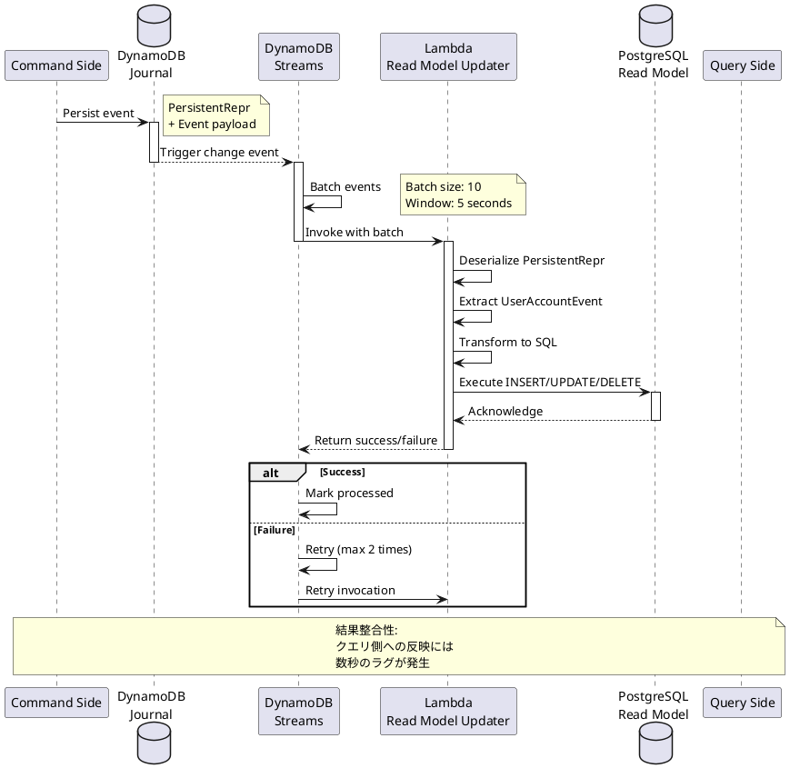
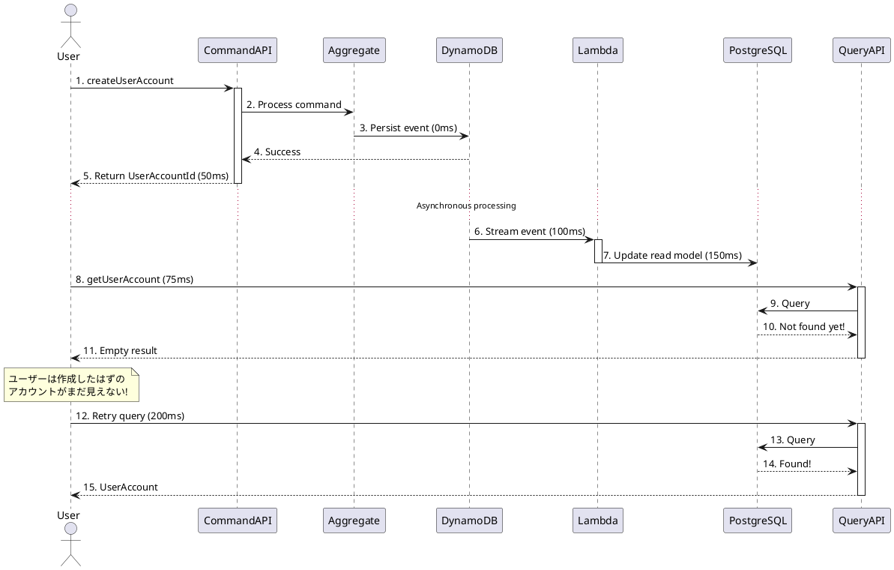

# 第5章：イベント処理の実装

## 概要

本章では、CQRS アーキテクチャの中核をなす**イベント処理**の実装を解説します。コマンド側で生成されたイベントを非同期に処理し、クエリ側の読み取りモデルを更新する仕組みを詳しく学びます。

以下の3つのトピックを順に説明します：

1. **DynamoDB Streamsの統合**：イベントストアの変更検知とトリガー
2. **Read Model Updaterの詳細**：イベントのデシリアライゼーションとデータベース更新
3. **結果整合性の管理**：非同期処理における一貫性保証

## 技術的背景

### イベント処理アーキテクチャ

```plantuml
@startuml
!define RECTANGLE class

actor User

package "Command Side" {
  RECTANGLE CommandAPI {
    + Mutation API
  }

  RECTANGLE Aggregate {
    + Event sourcing
  }
}

database "Event Store\n(DynamoDB)" as DDB {
  collections Journal {
    [Event 1]
    [Event 2]
    [Event 3]
  }
}

package "DynamoDB Streams" {
  RECTANGLE StreamsProcessor {
    + Change detection
    + Event batching
  }
}

package "Lambda Processing" {
  RECTANGLE ReadModelUpdater {
    + Event deserialization
    + Business logic
    + Database update
  }
}

database "Read Model\n(PostgreSQL)" as PG {
  collections UserAccounts {
    [Record 1]
    [Record 2]
    [Record 3]
  }
}

package "Query Side" {
  RECTANGLE QueryAPI {
    + GraphQL API
  }
}

User --> CommandAPI : 1. Command
CommandAPI --> Aggregate : 2. Process
Aggregate --> DDB : 3. Persist event
DDB --> StreamsProcessor : 4. Trigger stream
StreamsProcessor --> ReadModelUpdater : 5. Batch events
ReadModelUpdater --> PG : 6. Update read model
User --> QueryAPI : 7. Query
QueryAPI --> PG : 8. Fetch data

note right of StreamsProcessor
  非同期処理
  - 結果整合性
  - イベントバッチング
  - リトライ戦略
end note

@enduml
```

### 処理フローの詳細



## 実装の詳細

### 5.1 DynamoDB Streamsの設定

#### 5.1.1 Streamsの有効化

DynamoDB テーブルにStreamsを有効化することで、テーブルへの変更をリアルタイムで検知できます。

**tools/dynamodb-setup/dynamodb-setup.sh** (抜粋):

```bash
# DynamoDBテーブルを作成（ストリーム有効化）
aws dynamodb create-table \
  --endpoint-url $DYNAMODB_ENDPOINT \
  --table-name Journal \
  --attribute-definitions \
    AttributeName=persistence-id,AttributeType=S \
    AttributeName=sequence-nr,AttributeType=N \
  --key-schema \
    AttributeName=persistence-id,KeyType=HASH \
    AttributeName=sequence-nr,KeyType=RANGE \
  --billing-mode PAY_PER_REQUEST \
  --stream-specification \
    StreamEnabled=true \
    StreamViewType=NEW_IMAGE
```

**StreamViewType の種類**：

| オプション | 説明 |
|-----------|------|
| **KEYS_ONLY** | 変更されたキーのみ含まれる |
| **NEW_IMAGE** | 変更後の新しいアイテム全体（推奨） |
| **OLD_IMAGE** | 変更前の古いアイテム全体 |
| **NEW_AND_OLD_IMAGES** | 変更前後の両方のアイテム |

本プロジェクトでは **NEW_IMAGE** を使用し、新しく追加されたイベントのみを取得します。

---

#### 5.1.2 Event Source Mapping の作成

Lambda関数をDynamoDB Streamsに接続するため、**Event Source Mapping**を作成します。

**scripts/deploy-lambda-localstack.sh** (抜粋):

```bash
# DynamoDB ストリーム ARN を取得
STREAM_ARN=$(aws dynamodb describe-table \
    --endpoint-url $ENDPOINT_URL \
    --table-name $TABLE_NAME \
    --query 'Table.LatestStreamArn' \
    --output text)

# イベントソースマッピングを作成
aws lambda create-event-source-mapping \
    --endpoint-url $ENDPOINT_URL \
    --function-name $FUNCTION_NAME \
    --event-source-arn $STREAM_ARN \
    --starting-position LATEST \
    --batch-size 10 \
    --maximum-batching-window-in-seconds 5
```

**パラメータの説明**：

- **event-source-arn**: DynamoDB StreamsのARN
- **starting-position**:
  - `LATEST`: 最新のレコードから処理開始（推奨）
  - `TRIM_HORIZON`: ストリームの先頭から全レコードを処理
- **batch-size**: 一度に処理するレコード数（1〜10000）
- **maximum-batching-window-in-seconds**: バッチング待機時間（0〜300秒）

**バッチングの仕組み**：

```
イベント発生:
e1 (0秒) → e2 (1秒) → e3 (2秒) → e4 (3秒) → e5 (4秒)

バッチング結果（batch-size=10, window=5秒の場合）:
Batch 1: [e1, e2, e3, e4, e5] (5秒経過またはサイズ上限でトリガー)

効率化:
- Lambda起動回数を削減
- スループット向上
- コスト削減
```

---

### 5.2 Read Model Updater の詳細実装

#### 5.2.1 Lambda Handler の構造

第4章で基本的な実装を解説しましたが、ここではエラーハンドリングとリトライ戦略に焦点を当てます。

**apps/read-model-updater/src/main/scala/io/github/j5ik2o/pcqrses/readModelUpdater/LambdaHandler.scala** (詳細版):

```scala
class LambdaHandler extends RequestHandler[DynamodbEvent, LambdaResponse] {

  private val logger = LoggerFactory.getLogger(getClass)

  override def handleRequest(input: DynamodbEvent, context: Context): LambdaResponse = {
    try {
      logger.info(s"Received DynamoDB event with ${input.getRecords.size} records")

      // 並行処理でパフォーマンス向上
      val results = input.getRecords.asScala.toList.par.map(processRecord).toList

      val failures = results.collect { case Left(error) => error }
      val successes = results.collect { case Right(_) => () }

      // 部分的な失敗でも継続（207 Multi-Status）
      if (failures.nonEmpty) {
        logger.error(s"Failed to process ${failures.size} out of ${results.size} records")
        failures.foreach { error =>
          logger.error(s"Processing error: ${error.message}", error.exception.orNull)
        }
        LambdaResponse(
          statusCode = 207, // Multi-Status
          body = objectMapper.writeValueAsString(
            ResponseBody(
              message = s"Processed ${successes.size} records successfully, ${failures.size} failed",
              error = Some(failures.map(_.message).mkString("; "))
            )
          )
        )
      } else {
        logger.info(s"Successfully processed ${successes.size} records")
        LambdaResponse(
          statusCode = 200,
          body = objectMapper.writeValueAsString(
            ResponseBody(message = s"Successfully processed ${successes.size} records")
          )
        )
      }
    } catch {
      case ex: Exception =>
        logger.error("Unexpected error processing DynamoDB event", ex)
        LambdaResponse(
          statusCode = 500,
          body = objectMapper.writeValueAsString(
            ResponseBody(message = "Internal server error", error = Some(ex.getMessage))
          )
        )
    }
  }
}
```

**並行処理による最適化**：

- **`.par.map()`**: Scala のParallel Collectionsで並行処理
- **メリット**: 複数イベントを同時処理してスループット向上
- **注意点**: データベース接続プールのサイズを適切に設定

---

#### 5.2.2 イベントフィルタリング

すべてのDynamoDBレコードを処理するのではなく、特定のテーブルとエンティティのみを処理します。

```scala
private def processRecord(record: DynamodbStreamRecord): Either[ProcessingError, Unit] = {
  try {
    // 1. テーブル名でフィルタリング
    val tableName = record.getEventSourceARN.split("/")(1)
    if (tableName != "Journal") {
      logger.debug(s"Skipping record from table: $tableName")
      return Right(())
    }

    // 2. NewImageの存在チェック（DELETE イベントはスキップ）
    val newImage = Option(record.getDynamodb.getNewImage)
    if (newImage.isEmpty) {
      logger.debug("Skipping record without NewImage (likely DELETE event)")
      return Right(())
    }

    val attributes = newImage.get.asScala

    // 3. persistence-id でエンティティタイプをフィルタリング
    val persistenceIdOpt = Option(attributes.get("persistence-id"))
      .flatMap(attrOpt => Option(attrOpt.map(_.getS).orNull))

    if (persistenceIdOpt.isEmpty || !persistenceIdOpt.get.startsWith(UserAccountEntityTypePrefix)) {
      logger.debug(s"Skipping record with persistence-id: ${persistenceIdOpt.getOrElse("null")}")
      return Right(())
    }

    // 4. イベント処理へ進む
    val messageBytes = extractMessageBytes(attributes)
    deserializePersistentReprAndProcess(messageBytes)

  } catch {
    case ex: Exception =>
      logger.error("Error processing record", ex)
      Left(ProcessingError(s"Error processing record: ${ex.getMessage}", Some(ex)))
  }
}
```

**フィルタリングの利点**：

- **パフォーマンス向上**: 不要なレコードを早期にスキップ
- **コスト削減**: Lambda実行時間を短縮
- **明確な責務**: 特定のエンティティのみ処理

---

#### 5.2.3 べき等性の実装

同じイベントが複数回配信される可能性があるため、べき等性を保証します。

**戦略1: insertOrUpdate を使用**

```scala
case UserAccountEvent.Created_V1(_, entityId, name, _, occurredAt) =>
  val record = component.UserAccountsRecord(
    id = entityId.asString,
    firstName = name.breachEncapsulationOfFirstName.asString,
    lastName = name.breachEncapsulationOfLastName.asString,
    createdAt = Timestamp.from(occurredAt.asInstant()),
    updatedAt = Timestamp.from(occurredAt.asInstant())
  )
  // insertOrUpdate により、すでに存在する場合は更新
  component.UserAccountsDao.insertOrUpdate(record)
```

**戦略2: イベント処理ログテーブル**

```sql
-- イベント処理履歴テーブル
CREATE TABLE event_processed_log (
    persistence_id VARCHAR NOT NULL,
    sequence_nr BIGINT NOT NULL,
    processed_at TIMESTAMP WITH TIME ZONE NOT NULL DEFAULT CURRENT_TIMESTAMP,
    PRIMARY KEY (persistence_id, sequence_nr)
);

CREATE INDEX idx_event_processed_log_processed_at ON event_processed_log(processed_at);
```

```scala
private def processEventIdempotently(
  persistenceId: String,
  sequenceNr: Long,
  event: UserAccountEvent
): Either[ProcessingError, Unit] = {
  import databaseConfig.profile.api.*

  // トランザクション内で実行
  val action = for {
    // 1. すでに処理済みかチェック
    alreadyProcessed <- sql"""
      SELECT COUNT(*) FROM event_processed_log
      WHERE persistence_id = $persistenceId AND sequence_nr = $sequenceNr
    """.as[Int].map(_.head > 0)

    _ <- if (alreadyProcessed) {
      logger.info(s"Event already processed: $persistenceId/$sequenceNr")
      DBIO.successful(())
    } else {
      for {
        // 2. イベントを処理
        _ <- processUserAccountEventAction(event)

        // 3. 処理ログに記録
        _ <- sqlu"""
          INSERT INTO event_processed_log (persistence_id, sequence_nr)
          VALUES ($persistenceId, $sequenceNr)
        """
      } yield ()
    }
  } yield ()

  try {
    Await.result(db.run(action.transactionally), databaseOperationTimeout)
    Right(())
  } catch {
    case ex: Exception =>
      Left(ProcessingError(s"Error processing event: ${ex.getMessage}", Some(ex)))
  }
}
```

**メリット**：

- **完全なべき等性**: 同じイベントを複数回受け取っても安全
- **監査証跡**: どのイベントがいつ処理されたかを記録
- **デバッグ支援**: 処理済みイベントの履歴を確認可能

---

### 5.3 結果整合性の管理

#### 5.3.1 非同期処理の課題

CQRS では、コマンド実行とクエリ側への反映の間にタイムラグが発生します。



---

#### 5.3.2 結果整合性への対応策

**戦略1: クライアント側リトライ**

```typescript
// フロントエンドでのリトライロジック（TypeScript例）
async function createUserAccountWithRetry(input: CreateUserAccountInput): Promise<UserAccount> {
  // 1. コマンド実行
  const result = await graphqlClient.mutate({
    mutation: CREATE_USER_ACCOUNT,
    variables: { input }
  });

  const userAccountId = result.data.createUserAccount.id;

  // 2. クエリ側への反映を待つ（Exponential Backoff）
  let retries = 0;
  const maxRetries = 5;
  const baseDelay = 100; // ms

  while (retries < maxRetries) {
    try {
      const account = await graphqlClient.query({
        query: GET_USER_ACCOUNT,
        variables: { userAccountId },
        fetchPolicy: 'network-only' // キャッシュを無視
      });

      if (account.data.getUserAccount) {
        return account.data.getUserAccount;
      }
    } catch (error) {
      // Not found - リトライ
    }

    // Exponential backoff: 100ms, 200ms, 400ms, 800ms, 1600ms
    const delay = baseDelay * Math.pow(2, retries);
    await new Promise(resolve => setTimeout(resolve, delay));
    retries++;
  }

  throw new Error('User account creation succeeded, but read model update timed out');
}
```

**戦略2: UI での楽観的更新**

```typescript
// 楽観的更新: UIに即座に反映
const optimisticResponse = {
  createUserAccount: {
    __typename: 'CreateUserAccountResult',
    id: temporaryId, // 仮のID
  }
};

await graphqlClient.mutate({
  mutation: CREATE_USER_ACCOUNT,
  variables: { input },
  optimisticResponse, // UIに即座に反映
  update: (cache, { data }) => {
    // キャッシュを更新
    cache.writeQuery({
      query: GET_USER_ACCOUNTS,
      data: {
        getUserAccounts: [...existingAccounts, data.createUserAccount]
      }
    });
  }
});
```

**戦略3: イベント駆動UI（WebSocket/SSE）**

```scala
// WebSocketでクエリ側の更新を通知
case class ReadModelUpdatedEvent(
  entityType: String,
  entityId: String,
  operation: String // "created", "updated", "deleted"
)

// Lambda から Pub/Sub にイベントを発行
private def notifyReadModelUpdate(event: UserAccountEvent): Unit = {
  val notification = ReadModelUpdatedEvent(
    entityType = "UserAccount",
    entityId = event.entityId.asString,
    operation = event match {
      case _: UserAccountEvent.Created_V1 => "created"
      case _: UserAccountEvent.Renamed_V1 => "updated"
      case _: UserAccountEvent.Deleted_V1 => "deleted"
    }
  )

  // Pub/Sub (例: Redis Pub/Sub, AWS SNS, etc.)
  pubSubClient.publish("read-model-updates", notification)
}

// フロントエンドでWebSocket接続
const ws = new WebSocket('ws://query-api/updates');
ws.onmessage = (event) => {
  const update = JSON.parse(event.data);
  if (update.entityType === 'UserAccount' && update.operation === 'created') {
    // UIを更新
    refetchUserAccounts();
  }
};
```

---

#### 5.3.3 イベント順序の保証

DynamoDB Streams は、**パーティションキー単位**でイベントの順序を保証します。

```
persistence-id: "UserAccount-01KABC..."
  → Event 1 (sequence-nr: 1)
  → Event 2 (sequence-nr: 2)  // Event 1 の後に必ず処理される
  → Event 3 (sequence-nr: 3)  // Event 2 の後に必ず処理される
```

**順序保証の仕組み**：

1. DynamoDB Streams はシャード（パーティション）単位でイベントを配信
2. 同じpersistence-idのイベントは同じシャードに配置
3. Lambda は各シャードを順次処理

**順序違反の検出**：

```scala
private def validateEventOrder(
  persistenceId: String,
  sequenceNr: Long
): Either[ProcessingError, Unit] = {
  import databaseConfig.profile.api.*

  // 最後に処理したシーケンス番号を取得
  val lastProcessedSeqNr = Await.result(
    db.run(sql"""
      SELECT MAX(sequence_nr) FROM event_processed_log
      WHERE persistence_id = $persistenceId
    """.as[Option[Long]].map(_.flatten.getOrElse(0L))),
    Duration.Inf
  )

  if (sequenceNr != lastProcessedSeqNr + 1) {
    // 順序違反を検出
    Left(ProcessingError(
      s"Event order violation: expected seq ${lastProcessedSeqNr + 1}, got $sequenceNr",
      None
    ))
  } else {
    Right(())
  }
}
```

---

#### 5.3.4 トランザクション境界の設計

Read Model Updater では、イベント処理とログ記録を1つのトランザクションにまとめます。

```scala
private def processUserAccountEventTransactionally(
  persistenceId: String,
  sequenceNr: Long,
  event: UserAccountEvent
): Either[ProcessingError, Unit] = {
  import databaseConfig.profile.api.*

  val transaction = for {
    // 1. イベント処理（INSERT/UPDATE/DELETE）
    _ <- processUserAccountEventAction(event)

    // 2. 処理ログ記録
    _ <- sqlu"""
      INSERT INTO event_processed_log (persistence_id, sequence_nr)
      VALUES ($persistenceId, $sequenceNr)
    """
  } yield ()

  try {
    // トランザクション実行
    Await.result(
      db.run(transaction.transactionally),
      databaseOperationTimeout
    )
    Right(())
  } catch {
    case ex: PSQLException if ex.getSQLState == "23505" =>
      // Unique constraint violation - すでに処理済み
      logger.info(s"Event already processed (duplicate): $persistenceId/$sequenceNr")
      Right(())
    case ex: Exception =>
      // その他のエラー - リトライ対象
      logger.error(s"Transaction failed: ${ex.getMessage}", ex)
      Left(ProcessingError(s"Transaction error: ${ex.getMessage}", Some(ex)))
  }
}
```

**ACID 特性の活用**：

- **Atomicity**: イベント処理とログ記録が両方成功するか両方失敗
- **Consistency**: データベース制約により一貫性を保証
- **Isolation**: 並行実行しても競合しない
- **Durability**: コミット後は永続化を保証

---

### 5.4 エラーハンドリングとリトライ

#### 5.4.1 リトライ戦略

Lambda のEvent Source Mapping は、自動的にリトライを実行します。

**設定例**：

```bash
aws lambda create-event-source-mapping \
    --function-name read-model-updater \
    --event-source-arn $STREAM_ARN \
    --starting-position LATEST \
    --maximum-retry-attempts 2 \
    --maximum-record-age-in-seconds 3600 \
    --on-failure-destination-config "OnFailure={Destination=arn:aws:sqs:...}"
```

**パラメータの説明**：

- **maximum-retry-attempts**: 最大リトライ回数（デフォルト: 2）
- **maximum-record-age-in-seconds**: レコードの最大保持時間（1時間）
- **on-failure-destination-config**: 失敗時の送信先（SQS、SNS）

**リトライの仕組み**：

```
Attempt 1: Lambda実行 → 失敗
  ↓ (Exponential backoff: 1秒)
Attempt 2: Lambda実行 → 失敗
  ↓ (Exponential backoff: 2秒)
Attempt 3: Lambda実行 → 失敗
  ↓
DLQ (Dead Letter Queue) に送信
```

---

#### 5.4.2 エラー分類とハンドリング

エラーを**一時的エラー**と**永続的エラー**に分類します。

```scala
sealed trait ProcessingErrorType
object ProcessingErrorType {
  case object Transient extends ProcessingErrorType  // リトライ可能
  case object Permanent extends ProcessingErrorType  // リトライ不可
}

case class ProcessingError(
  message: String,
  exception: Option[Throwable],
  errorType: ProcessingErrorType = ProcessingErrorType.Transient
)

private def classifyError(ex: Throwable): ProcessingErrorType = ex match {
  // 一時的エラー（リトライ可能）
  case _: SQLException if ex.getMessage.contains("connection") =>
    ProcessingErrorType.Transient
  case _: java.net.SocketTimeoutException =>
    ProcessingErrorType.Transient
  case _: org.postgresql.util.PSQLException if ex.getMessage.contains("deadlock") =>
    ProcessingErrorType.Transient

  // 永続的エラー（リトライ不可）
  case _: IllegalArgumentException =>
    ProcessingErrorType.Permanent
  case _: com.google.protobuf.InvalidProtocolBufferException =>
    ProcessingErrorType.Permanent
  case _: org.postgresql.util.PSQLException if ex.getMessage.contains("constraint") =>
    ProcessingErrorType.Permanent

  // デフォルト: 一時的エラーとして扱う
  case _ =>
    ProcessingErrorType.Transient
}
```

---

#### 5.4.3 Dead Letter Queue (DLQ) の活用

リトライに失敗したイベントをDLQに送信し、後で調査できるようにします。

```bash
# DLQ用のSQSキューを作成
aws sqs create-queue \
  --queue-name read-model-updater-dlq \
  --endpoint-url http://localstack:4566

# Event Source Mapping にDLQを設定
aws lambda create-event-source-mapping \
  --function-name read-model-updater \
  --event-source-arn $STREAM_ARN \
  --on-failure-destination-config "OnFailure={Destination=arn:aws:sqs:ap-northeast-1:000000000000:read-model-updater-dlq}"
```

**DLQ メッセージの処理**：

```scala
// DLQから失敗イベントを取得して再処理するバッチジョブ
object DLQProcessor {
  def processFailedEvents(): Unit = {
    val sqsClient = AmazonSQSClientBuilder.defaultClient()
    val queueUrl = "https://sqs.ap-northeast-1.amazonaws.com/.../read-model-updater-dlq"

    while (true) {
      val messages = sqsClient.receiveMessage(queueUrl).getMessages.asScala

      messages.foreach { message =>
        try {
          // イベントを再処理
          val dynamodbEvent = parseMessage(message.getBody)
          val handler = new LambdaHandler()
          handler.handleRequest(dynamodbEvent, null)

          // 成功したらDLQから削除
          sqsClient.deleteMessage(queueUrl, message.getReceiptHandle)
        } catch {
          case ex: Exception =>
            // 再処理も失敗 - アラートを送信
            logger.error(s"Failed to reprocess DLQ message: ${ex.getMessage}", ex)
        }
      }

      Thread.sleep(60000) // 1分ごとにポーリング
    }
  }
}
```

---

## ベストプラクティス

### 1. バッチサイズとウィンドウの最適化

**推奨設定**：

- **低レイテンシー重視**: batch-size=1, window=0秒
- **スループット重視**: batch-size=10, window=5秒
- **コスト重視**: batch-size=100, window=10秒

```bash
# 環境に応じて調整
aws lambda update-event-source-mapping \
  --uuid $MAPPING_UUID \
  --batch-size 10 \
  --maximum-batching-window-in-seconds 5
```

---

### 2. Lambda のタイムアウト設定

```bash
aws lambda update-function-configuration \
  --function-name read-model-updater \
  --timeout 300 \  # 5分（デフォルト: 3秒）
  --memory-size 512  # メモリを増やすとCPUも増える
```

**タイムアウトの目安**：

- batch-size=1: 30秒
- batch-size=10: 60秒
- batch-size=100: 300秒

---

### 3. データベース接続プールの設定

```hocon
read-model-updater.slick.db {
  connectionPool = "HikariCP"
  maxConnections = 10      # Lambda同時実行数に応じて調整
  minConnections = 5
  connectionTimeout = 30000
  idleTimeout = 600000     # 10分
  maxLifetime = 1800000    # 30分
}
```

**並行実行時の注意**：

- Lambda の同時実行数 × maxConnections ≤ PostgreSQL の max_connections
- 例: Lambda 10並行 × 10接続 = 100接続

---

### 4. モニタリングとアラート

**重要なメトリクス**：

1. **Lambda Duration**: 実行時間の監視
2. **Lambda Errors**: エラー率の監視
3. **Lambda Throttles**: スロットリングの検出
4. **DynamoDB Streams Iterator Age**: 処理遅延の監視
5. **DLQ Message Count**: 失敗イベント数の監視

**CloudWatch Logs Insights クエリ例**：

```sql
-- エラーログの集計
fields @timestamp, @message
| filter @message like /ERROR/
| stats count() by bin(5m)

-- 処理時間の分析
fields @timestamp, @duration
| stats avg(@duration), max(@duration), p99(@duration) by bin(5m)
```

---

### 5. ローカル開発環境でのテスト

```bash
# LocalStack環境でのテスト
./scripts/deploy-lambda-localstack.sh

# DynamoDBにイベントを挿入してLambdaをトリガー
aws dynamodb put-item \
  --endpoint-url http://localhost:50503 \
  --table-name Journal \
  --item '{"persistence-id":{"S":"UserAccount-test"},"sequence-nr":{"N":"1"},"message":{"B":"..."}}'

# Lambda実行ログを確認
docker logs -f $(docker ps -q -f name=localstack)
```

---

## まとめ

本章では、イベント処理の実装を以下の順で解説しました：

1. **DynamoDB Streamsの統合**: Event Source Mappingによる自動トリガー
2. **Read Model Updaterの詳細**: べき等性、フィルタリング、トランザクション
3. **結果整合性の管理**: 非同期処理の課題と対応策
4. **エラーハンドリング**: リトライ戦略とDLQ

これらの実装により、以下が実現されます：

- **スケーラビリティ**: DynamoDB StreamsとLambdaによる自動スケーリング
- **信頼性**: リトライとDLQによる失敗イベントの管理
- **一貫性**: トランザクションとべき等性による結果整合性の保証
- **監視性**: CloudWatch Logsによる詳細なログ記録

次章では、**設定管理とデプロイ**を解説します。

---

👉 [第6章：設定管理とデプロイ](part2-06-configuration.md)
