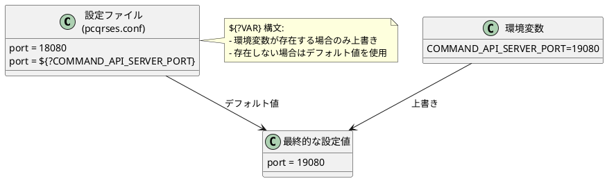

# 第6章：設定管理とデプロイ

## 概要

本章では、CQRS/Event Sourcing システムの**設定管理**と**デプロイ戦略**を解説します。Typesafe Config による階層的な設定管理、環境別の設定切り替え、シリアライゼーション戦略について詳しく学びます。

以下の3つのトピックを順に説明します：

1. **設定ファイルの階層化**：application.conf を中心とした設定の体系化
2. **シリアライゼーション戦略**：Protocol Buffers によるイベント/スナップショットのシリアライゼーション
3. **デプロイ戦略**：Docker Compose によるローカル環境とクラスター環境

## 技術的背景

### 設定ファイルの階層構造

```plantuml
@startuml
!define FILE class

FILE "application.conf\n(エントリーポイント)" as APP {
  include "pcqrses.conf"
  include "pekko.conf"
  include "j5ik2o.conf"
}

FILE "pcqrses.conf\n(アプリケーション設定)" as PCQRSES {
  command-api {
    actor-timeout
    server {...}
    load-balancer {...}
  }
}

FILE "pekko.conf\n(Pekkoフレームワーク設定)" as PEKKO {
  actor {
    provider
    serializers
    serialization-bindings
  }
  persistence {...}
}

FILE "j5ik2o.conf\n(DynamoDB設定)" as J5IK2O {
  dynamo-db-journal {...}
  dynamo-db-snapshot {...}
  dynamo-db-state {...}
}

APP ..> PCQRSES : include
APP ..> PEKKO : include
APP ..> J5IK2O : include

note right of APP
  設定の読み込み順序:
  1. application.conf
  2. pcqrses.conf
  3. pekko.conf
  4. j5ik2o.conf

  後から読み込まれた設定が
  既存の設定を上書き
end note

@enduml
```

### 環境変数による設定のオーバーライド



## 実装の詳細

### 6.1 設定ファイルの階層化

#### 6.1.1 エントリーポイント（application.conf）

**apps/command-api/src/main/resources/application.conf**:

```hocon
include "pcqrses.conf"
include "pekko.conf"
include "j5ik2o.conf"
```

**設計のポイント**：

- **シンプルなエントリーポイント**: 設定ファイルの include のみを記述
- **関心の分離**: アプリケーション設定、フレームワーク設定、インフラ設定を分離
- **読み込み順序**: 上から順に読み込まれ、後の設定が前の設定を上書き

---

#### 6.1.2 アプリケーション設定（pcqrses.conf）

**apps/command-api/src/main/resources/pcqrses.conf**:

```hocon
pcqrses {
  command-api {
    # アクター間通信のタイムアウト設定
    actor-timeout = 5s
    actor-timeout = ${?COMMAND_API_ACTOR_TIMEOUT}

    # HTTPサーバーの設定
    server {
      host = "127.0.0.1"
      host = ${?COMMAND_API_SERVER_HOST}
      port = 18080
      port = ${?COMMAND_API_SERVER_PORT}

      # シャットダウン時のタイムアウト
      shutdown-timeout = 10s
      shutdown-timeout = ${?COMMAND_API_SHUTDOWN_TIMEOUT}
    }

    # LoadBalancer環境での設定
    load-balancer {
      # デタッチ待機時間（開発環境: 短時間、本番環境: 30秒程度）
      detach-wait-duration = 3s
      detach-wait-duration = ${?COMMAND_API_LOADBALANCER_DETACH_WAIT_DURATION}

      # ヘルスチェックの猶予期間
      health-check-grace-period = 5s
      health-check-grace-period = ${?COMMAND_API_LOADBALANCER_HEALTH_GRACE_PERIOD}
    }
  }
}
```

**設計のポイント**：

- **名前空間**: `pcqrses.command-api` で階層化
- **環境変数オーバーライド**: `${?VAR}` 構文でオプショナルな環境変数
- **デフォルト値**: 開発環境で動作する妥当なデフォルト値を設定

**環境変数の命名規則**：

```
{APP_NAME}_{SERVICE}_{SECTION}_{KEY}

例:
COMMAND_API_SERVER_PORT
COMMAND_API_LOADBALANCER_DETACH_WAIT_DURATION
```

---

#### 6.1.3 設定クラスへのマッピング

**apps/command-api/src/main/scala/io/github/j5ik2o/pcqrses/commandApi/config/CommandApiConfig.scala**:

```scala
import scala.jdk.DurationConverters.*

final case class CommandApiConfig(
  actorTimeout: scala.concurrent.duration.FiniteDuration,
  server: ServerConfig,
  loadBalancerConfig: LoadBalancerConfig
)

object CommandApiConfig {
  def from(config: com.typesafe.config.Config): CommandApiConfig =
    CommandApiConfig(
      actorTimeout = config.getDuration("actor-timeout").toScala,
      server = ServerConfig.from(config.getConfig("server")),
      loadBalancerConfig = LoadBalancerConfig.from(config.getConfig("load-balancer"))
    )
}
```

**ServerConfig.scala**:

```scala
final case class ServerConfig(
  host: String,
  port: Int,
  shutdownTimeout: scala.concurrent.duration.FiniteDuration
)

object ServerConfig {
  def from(config: com.typesafe.config.Config): ServerConfig =
    ServerConfig(
      host = config.getString("host"),
      port = config.getInt("port"),
      shutdownTimeout = config.getDuration("shutdown-timeout").toScala
    )
}
```

**LoadBalancerConfig.scala**:

```scala
final case class LoadBalancerConfig(
  detachWaitDuration: scala.concurrent.duration.FiniteDuration,
  healthCheckGracePeriod: scala.concurrent.duration.FiniteDuration
)

object LoadBalancerConfig {
  def from(config: com.typesafe.config.Config): LoadBalancerConfig =
    LoadBalancerConfig(
      detachWaitDuration = config.getDuration("detach-wait-duration").toScala,
      healthCheckGracePeriod = config.getDuration("health-check-grace-period").toScala
    )
}
```

**設計のポイント**：

- **型安全性**: 設定値を Scala の型にマッピング
- **Duration 変換**: Java の Duration を Scala の FiniteDuration に変換
- **階層構造の保持**: 設定の階層構造をケースクラスで表現

**使用例**：

```scala
object CommandApiMain extends App {
  val config = ConfigFactory.load()
  val commandApiConfig = CommandApiConfig.from(config.getConfig("pcqrses.command-api"))

  println(s"Server will start on ${commandApiConfig.server.host}:${commandApiConfig.server.port}")
  println(s"Actor timeout: ${commandApiConfig.actorTimeout}")
}
```

---

#### 6.1.4 Pekko フレームワーク設定（pekko.conf）

**apps/command-api/src/main/resources/pekko.conf**:

```hocon
pekko {
  http {
    server {
      preview {
        enable-http2 = on
      }
      http2 {
        enabled = on
      }
    }
  }

  actor {
    provider = local
    provider = ${?PEKKO_ACTOR_PROVIDER}

    cluster {
      enabled = false
      enabled = ${?PEKKO_CLUSTER_ENABLED}
    }

    warn-about-java-serializer-usage = on
    allow-java-serialization = off
  }

  test {
    single-expect-default = 5s
    filter-leeway = 5s
    timefactor = 1.0
  }

  coordinated-shutdown.run-by-actor-system-terminate = off
}

# Persistence プラグインの指定
pekko.persistence.journal.plugin = "j5ik2o.dynamo-db-journal"
pekko.persistence.snapshot-store.plugin = "j5ik2o.dynamo-db-snapshot"
pekko.persistence.state.plugin = "j5ik2o.dynamo-db-state"
```

**設計のポイント**：

- **HTTP/2 サポート**: gRPC のために HTTP/2 を有効化
- **Actor Provider**: `local` または `cluster` を選択可能
- **Java シリアライゼーション禁止**: セキュリティとパフォーマンスのため無効化
- **Persistence プラグイン**: DynamoDB プラグインを指定

**クラスターモードへの切り替え**：

```bash
# ローカルモード（デフォルト）
docker-compose up

# クラスターモード
PEKKO_CLUSTER_ENABLED=true docker-compose up
```

---

#### 6.1.5 DynamoDB 設定（j5ik2o.conf）

**apps/command-api/src/main/resources/j5ik2o.conf**:

```hocon
j5ik2o.dynamo-db-journal {
  class = "com.github.j5ik2o.pekko.persistence.dynamodb.journal.DynamoDBJournal"
  table-name = "Journal"
  table-name = ${?J5IK2O_DYNAMO_DB_JOURNAL_TABLE_NAME}
  get-journal-rows-index-name = "GetJournalRowsIndex"
  get-journal-rows-index-name = ${?J5IK2O_DYNAMO_DB_JOURNAL_GET_JOURNAL_ROWS_INDEX_NAME}

  dynamo-db-client {
    access-key-id = "x"
    access-key-id = ${?J5IK2O_DYNAMO_DB_JOURNAL_DYNAMO_DB_CLIENT_ACCESS_KEY_ID}
    secret-access-key = "x"
    secret-access-key = ${?J5IK2O_DYNAMO_DB_JOURNAL_DYNAMO_DB_CLIENT_SECRET_ACCESS_KEY}
    endpoint = "http://localhost:8000/"
    endpoint = ${?J5IK2O_DYNAMO_DB_JOURNAL_DYNAMO_DB_CLIENT_ENDPOINT}
  }
}

j5ik2o.dynamo-db-snapshot {
  class = "com.github.j5ik2o.pekko.persistence.dynamodb.snapshot.DynamoDBSnapshotStore"
  table-name = "Snapshot"
  table-name = ${?J5IK2O_DYNAMO_DB_SNAPSHOT_TABLE_NAME}

  dynamo-db-client {
    access-key-id = "DUMMY"
    access-key-id = ${?J5IK2O_DYNAMO_DB_SNAPSHOT_DYNAMO_DB_CLIENT_ACCESS_KEY_ID}
    secret-access-key = "DUMMY"
    secret-access-key = ${?J5IK2O_DYNAMO_DB_SNAPSHOT_DYNAMO_DB_CLIENT_SECRET_ACCESS_KEY}
    endpoint = "http://localhost:8000/"
    endpoint = ${?J5IK2O_DYNAMO_DB_SNAPSHOT_DYNAMO_DB_CLIENT_ENDPOINT}
  }
}

j5ik2o.dynamo-db-state {
  class = "com.github.j5ik2o.pekko.persistence.dynamodb.state.DynamoDBDurableStateStoreProvider"
  table-name = "State"
  table-name = ${?J5IK2O_DYNAMO_DB_STATE_TABLE_NAME}

  dynamo-db-client {
    access-key-id = "x"
    access-key-id = ${?J5IK2O_DYNAMO_DB_STATE_DYNAMO_DB_CLIENT_ACCESS_KEY_ID}
    secret-access-key = "x"
    secret-access-key = ${?J5IK2O_DYNAMO_DB_STATE_DYNAMO_DB_CLIENT_SECRET_ACCESS_KEY}
    endpoint = "http://localhost:8000/"
    endpoint = ${?J5IK2O_DYNAMO_DB_STATE_DYNAMO_DB_CLIENT_ENDPOINT}
  }
}
```

**設計のポイント**：

- **プラグインクラス指定**: pekko-persistence-dynamodb プラグインのクラスを指定
- **テーブル名**: Journal、Snapshot、State の各テーブル名を設定
- **エンドポイント**: LocalStack（開発）と AWS（本番）を切り替え可能

---

### 6.2 シリアライゼーション戦略

#### 6.2.1 シリアライザの登録

**modules/command/interface-adapter/src/main/resources/reference.conf**:

```hocon
pekko {
  actor {
    serialize-messages = off

    serializers {
      user-account-snapshot = "io.github.j5ik2o.pcqrses.command.interfaceAdapter.aggregate.users.UserAccountSnapshotSerializer"
    }

    serialization-bindings {
      "io.github.j5ik2o.pcqrses.command.interfaceAdapter.aggregate.users.UserAccountAggregateState" = user-account-snapshot
    }

    serialization-identifiers {
      "io.github.j5ik2o.pcqrses.command.interfaceAdapter.aggregate.users.UserAccountSnapshotSerializer" = 10002
    }
  }
}
```

**設計のポイント**：

- **serializers**: シリアライザの名前とクラスを登録
- **serialization-bindings**: どの型にどのシリアライザを使用するかを指定
- **serialization-identifiers**: シリアライザに一意のIDを割り当て（後方互換性のため）

**イベントシリアライザの登録**：

```hocon
pekko.actor.serializers {
  user-account-event = "io.github.j5ik2o.pcqrses.command.interfaceAdapter.aggregate.users.UserAccountEventSerializer"
}

pekko.actor.serialization-bindings {
  "io.github.j5ik2o.pcqrses.command.domain.users.UserAccountEvent" = user-account-event
}

pekko.actor.serialization-identifiers {
  "io.github.j5ik2o.pcqrses.command.interfaceAdapter.aggregate.users.UserAccountEventSerializer" = 20002
}
```

---

#### 6.2.2 イベントシリアライザの実装

**modules/command/interface-adapter-event-serializer/src/main/scala/.../UserAccountEventSerializer.scala** (抜粋):

```scala
class UserAccountEventSerializer extends SerializerWithStringManifest {

  override def identifier: Int = 20002

  // マニフェストはEnvelope内のtype/versionと重複するため固定文字列に統一
  override def manifest(o: AnyRef): String = "Envelope"

  override def toBinary(o: AnyRef): Array[Byte] = {
    val envelope: UserAccountEvent_Envelope = o match {
      case DomainUserAccountEvent.Created_V1(id, entityId, name, emailAddress, occurredAt) =>
        val payload = UserAccountEvent_Created_V1(
          eventId = id.asString,
          userAccountId = entityId.asString,
          userName = Some(ProtoUserAccountName(
            name.breachEncapsulationOfFirstName.asString,
            name.breachEncapsulationOfLastName.asString
          )),
          emailAddress = emailAddress.asString,
          occurredAt = {
            val sn = occurredAt.toSecondsAndNanos
            Some(com.google.protobuf.timestamp.Timestamp(sn._1, sn._2))
          }
        )
        UserAccountEvent_Envelope(
          userAccountId = entityId.asString,
          eventTypeName = "UserAccountEvent.Created",
          eventTypeVersion = "V1",
          payload = com.google.protobuf.ByteString.copyFrom(payload.toByteArray),
          occurredAt = {
            val sn = occurredAt.toSecondsAndNanos
            Some(com.google.protobuf.timestamp.Timestamp(sn._1, sn._2))
          }
        )

      // Renamed_V1, Deleted_V1 も同様...
    }
    envelope.toByteArray
  }

  override def fromBinary(bytes: Array[Byte], manifest: String): AnyRef = {
    val envelope = UserAccountEvent_Envelope.parseFrom(bytes)
    (envelope.eventTypeName, envelope.eventTypeVersion) match {
      case ("UserAccountEvent.Created", "V1") =>
        val value = UserAccountEvent_Created_V1.parseFrom(envelope.payload.toByteArray)
        DomainUserAccountEvent.Created_V1(
          id = DomainEventId.from(value.eventId),
          entityId = DomainUserAccountId.from(value.userAccountId),
          name = DomainUserAccountName(
            FirstName(value.userName.get.firstName),
            LastName(value.userName.get.lastName)
          ),
          emailAddress = DomainEmailAddress(value.emailAddress),
          occurredAt = DateTime.fromSecondsAndNanos(value.occurredAt.get.seconds, value.occurredAt.get.nanos)
        )

      // 他のバージョンとイベントタイプ...

      case (name, ver) =>
        throw new IllegalArgumentException(s"Unexpected event type: name=$name, version=$ver")
    }
  }
}
```

**設計のポイント**：

- **SerializerWithStringManifest**: Pekko の標準シリアライザインターフェース
- **identifier**: シリアライザの一意ID（設定ファイルと一致）
- **Envelope パターン**: イベントタイプとバージョンを Envelope で管理
- **Protocol Buffers**: 効率的なバイナリシリアライゼーション

---

#### 6.2.3 スナップショットシリアライザの実装

**modules/command/interface-adapter/src/main/scala/.../UserAccountSnapshotSerializer.scala** (抜粋):

```scala
class UserAccountSnapshotSerializer extends SerializerWithStringManifest {

  override def identifier: Int = 20001

  override def manifest(o: AnyRef): String =
    o match {
      case _: NotCreated => "NotCreated"
      case _: Created => "Created"
      case _: Deleted => "Deleted"
    }

  override def toBinary(o: AnyRef): Array[Byte] = {
    val snapshot = o match {
      case NotCreated(id) =>
        UserAccountSnapshot(
          UserAccountSnapshot.State.NotCreated(
            NotCreatedSnapshot(
              userAccountId = id.asString
            )
          )
        )

      case Created(userAccount) =>
        UserAccountSnapshot(
          UserAccountSnapshot.State.Created(
            CreatedSnapshot(
              userAccountId = userAccount.id.asString,
              userName = Some(
                ProtoUserAccountName(
                  userAccount.name.breachEncapsulationOfFirstName.asString,
                  userAccount.name.breachEncapsulationOfLastName.asString
                )
              ),
              emailAddress = userAccount.emailAddress.asString,
              createdAt = {
                val sn = userAccount.createdAt.toSecondsAndNanos
                Some(com.google.protobuf.timestamp.Timestamp(sn._1, sn._2))
              },
              updatedAt = {
                val sn = userAccount.updatedAt.toSecondsAndNanos
                Some(com.google.protobuf.timestamp.Timestamp(sn._1, sn._2))
              }
            )
          )
        )

      // Deleted も同様...
    }
    snapshot.toByteArray
  }

  override def fromBinary(bytes: Array[Byte], manifest: String): AnyRef = {
    val snapshot = UserAccountSnapshot.parseFrom(bytes)
    snapshot.state match {
      case UserAccountSnapshot.State.NotCreated(notCreated) =>
        NotCreated(DomainUserAccountId.from(notCreated.userAccountId))

      case UserAccountSnapshot.State.Created(created) =>
        val (userAccount, _) = DomainUserAccount(
          id = DomainUserAccountId.from(created.userAccountId),
          name = DomainUserAccountName(
            FirstName(created.userName.get.firstName),
            LastName(created.userName.get.lastName)
          ),
          emailAddress = DomainEmailAddress(created.emailAddress),
          createdAt = DateTime.fromSecondsAndNanos(
            created.createdAt.get.seconds,
            created.createdAt.get.nanos),
          updatedAt =
            DateTime.fromSecondsAndNanos(created.updatedAt.get.seconds, created.updatedAt.get.nanos)
        )
        Created(userAccount)

      // Deleted も同様...

      case UserAccountSnapshot.State.Empty =>
        throw new IllegalArgumentException("Unexpected empty state in UserAccountSnapshot")
    }
  }
}
```

**設計のポイント**：

- **状態別マニフェスト**: 各状態（NotCreated、Created、Deleted）に異なるマニフェストを割り当て
- **oneof**: Protocol Buffers の oneof で状態を表現
- **完全なスナップショット**: 集約の全状態をシリアライズ

---

### 6.3 デプロイ戦略

#### 6.3.1 Docker Compose による環境構築

**docker-compose-common.yml** (抜粋):

```yaml
services:
  # LocalStack (DynamoDB, Lambda等のAWSサービスのエミュレータ)
  localstack:
    image: localstack/localstack:4.7
    hostname: localstack
    privileged: true
    ports:
      - "${DOCKER_LOCALSTACK_PORT:-50503}:4566"
    environment:
      - SERVICES=lambda,dynamodb
      - DEBUG=1
      - LAMBDA_EXECUTOR=docker
      - DOCKER_HOST=unix:///var/run/docker.sock
      - AWS_DEFAULT_REGION=ap-northeast-1
      - AWS_ACCESS_KEY_ID=dummy
      - AWS_SECRET_ACCESS_KEY=dummy
    volumes:
      - "/var/run/docker.sock:/var/run/docker.sock"
    networks:
      - p-cqrs-es-network
    restart: unless-stopped

  # PostgreSQL (Read側データベース)
  postgres:
    image: postgres:16.4
    environment:
      POSTGRES_USER: postgres
      POSTGRES_PASSWORD: postgres
      POSTGRES_DB: p-cqrs-es_development
      POSTGRES_HOST_AUTH_METHOD: trust
    ports:
      - "${DOCKER_POSTGRES_PORT:-50504}:5432"
    restart: unless-stopped
    networks:
      - p-cqrs-es-network
```

**設計のポイント**：

- **LocalStack**: AWS サービスのローカルエミュレーション
- **PostgreSQL**: クエリ側データベース
- **ネットワーク**: すべてのサービスを同一ネットワークに配置
- **ポート**: 環境変数で上書き可能

---

#### 6.3.2 環境別の起動スクリプト

**scripts/run-single.sh** (ローカル環境):

```bash
#!/bin/bash

# 単一ノード構成（開発環境）
docker-compose \
  -f docker-compose-common.yml \
  -f docker-compose-local.yml \
  up -d
```

**scripts/run-cluster.sh** (クラスター環境):

```bash
#!/bin/bash

# クラスター環境（3ノード）
export PEKKO_CLUSTER_ENABLED=true

docker-compose \
  -f docker-compose-common.yml \
  -f docker-compose-cluster.yml \
  up -d
```

**設計のポイント**：

- **構成ファイルの合成**: `-f` オプションで複数の設定を合成
- **環境変数**: クラスターモードを環境変数で制御
- **スクリプト化**: 複雑な起動コマンドをスクリプトにカプセル化

---

## ベストプラクティス

### 1. 設定の階層化原則

**設定ファイルの責務分離**：

| ファイル | 責務 | 変更頻度 |
|---------|------|----------|
| **application.conf** | エントリーポイント | 低 |
| **pcqrses.conf** | アプリケーション固有の設定 | 中 |
| **pekko.conf** | フレームワーク設定 | 低 |
| **j5ik2o.conf** | インフラ（DynamoDB）設定 | 中 |

**推奨事項**：

- 頻繁に変更する設定は `pcqrses.conf` に配置
- フレームワーク設定は変更しない限り `pekko.conf` に固定
- 環境依存の設定は環境変数でオーバーライド

---

### 2. 環境変数の命名規則

**命名規則**：

```
{SERVICE}_{SECTION}_{SUBSECTION}_{KEY}

良い例:
COMMAND_API_SERVER_PORT
COMMAND_API_LOADBALANCER_DETACH_WAIT_DURATION
J5IK2O_DYNAMO_DB_JOURNAL_TABLE_NAME

悪い例:
PORT                    # 曖昧
API_PORT                # サービス名がない
COMMAND_API_PORT        # セクション名がない
```

---

### 3. シリアライザの identifier 管理

**identifier の割り当て戦略**：

| 範囲 | 用途 |
|------|------|
| **10000-19999** | スナップショットシリアライザ |
| **20000-29999** | イベントシリアライザ |
| **30000-39999** | 将来の拡張用 |

**推奨事項**：

- identifier は一度割り当てたら変更しない
- 新しいシリアライザには新しい identifier を割り当てる
- ドキュメントに割り当て表を記録

---

### 4. 環境別の設定ファイル管理

**開発環境**：

```bash
# application.conf に全て含める
docker-compose up
```

**ステージング環境**：

```bash
# 環境変数で設定を上書き
export COMMAND_API_SERVER_HOST=0.0.0.0
export COMMAND_API_SERVER_PORT=8080
export J5IK2O_DYNAMO_DB_JOURNAL_DYNAMO_DB_CLIENT_ENDPOINT=https://dynamodb.ap-northeast-1.amazonaws.com

docker-compose up
```

**本番環境**：

```bash
# 環境変数ファイルを使用
docker-compose --env-file .env.production up
```

**.env.production**:

```properties
COMMAND_API_SERVER_HOST=0.0.0.0
COMMAND_API_SERVER_PORT=8080
COMMAND_API_ACTOR_TIMEOUT=10s
COMMAND_API_LOADBALANCER_DETACH_WAIT_DURATION=30s
COMMAND_API_LOADBALANCER_HEALTH_GRACE_PERIOD=10s

J5IK2O_DYNAMO_DB_JOURNAL_DYNAMO_DB_CLIENT_ENDPOINT=https://dynamodb.ap-northeast-1.amazonaws.com
J5IK2O_DYNAMO_DB_JOURNAL_DYNAMO_DB_CLIENT_ACCESS_KEY_ID=${AWS_ACCESS_KEY_ID}
J5IK2O_DYNAMO_DB_JOURNAL_DYNAMO_DB_CLIENT_SECRET_ACCESS_KEY=${AWS_SECRET_ACCESS_KEY}
```

---

### 5. 設定値の検証

**アプリケーション起動時に設定を検証**：

```scala
object ConfigValidator {
  def validate(config: CommandApiConfig): Either[List[String], Unit] = {
    val errors = scala.collection.mutable.ListBuffer.empty[String]

    // ポート番号の範囲チェック
    if (config.server.port < 1024 || config.server.port > 65535) {
      errors += s"Invalid port: ${config.server.port} (must be 1024-65535)"
    }

    // タイムアウトの妥当性チェック
    if (config.actorTimeout < 1.second) {
      errors += s"Actor timeout too short: ${config.actorTimeout} (minimum 1s)"
    }

    // LoadBalancer設定の整合性チェック
    if (config.loadBalancerConfig.detachWaitDuration > config.server.shutdownTimeout) {
      errors += "Detach wait duration must be less than shutdown timeout"
    }

    if (errors.isEmpty) Right(())
    else Left(errors.toList)
  }
}

// 使用例
val config = CommandApiConfig.from(ConfigFactory.load().getConfig("pcqrses.command-api"))
ConfigValidator.validate(config) match {
  case Left(errors) =>
    errors.foreach(err => logger.error(s"Configuration error: $err"))
    System.exit(1)
  case Right(_) =>
    logger.info("Configuration validated successfully")
}
```

---

### 6. シークレット管理

**開発環境**：

```hocon
dynamo-db-client {
  access-key-id = "dummy"      # ハードコード可
  secret-access-key = "dummy"
}
```

**本番環境**：

```hocon
dynamo-db-client {
  access-key-id = ${?AWS_ACCESS_KEY_ID}       # 環境変数から取得
  secret-access-key = ${?AWS_SECRET_ACCESS_KEY}
}
```

**推奨事項**：

- 開発環境では LocalStack のダミー認証情報を使用
- 本番環境では IAM ロールまたは環境変数を使用
- シークレットを設定ファイルにハードコードしない

---

## まとめ

本章では、設定管理とデプロイ戦略を以下の順で解説しました：

1. **設定ファイルの階層化**: application.conf を中心とした4層構造
2. **環境変数オーバーライド**: `${?VAR}` 構文による柔軟な設定切り替え
3. **設定クラスへのマッピング**: Typesafe Config から型安全な Scala クラスへの変換
4. **シリアライゼーション戦略**: Protocol Buffers によるイベント/スナップショットのシリアライゼーション
5. **デプロイ戦略**: Docker Compose による環境別デプロイ

これらの実装により、以下が実現されます：

- **保守性**: 階層化された設定による関心の分離
- **柔軟性**: 環境変数による設定のオーバーライド
- **型安全性**: 設定値の Scala クラスへのマッピング
- **効率性**: Protocol Buffers による高速なシリアライゼーション
- **再現性**: Docker Compose による環境の一貫性

次章では、**テスト戦略**を解説します。

---

👉 [第7章：テスト戦略](part2-07-testing.md)
