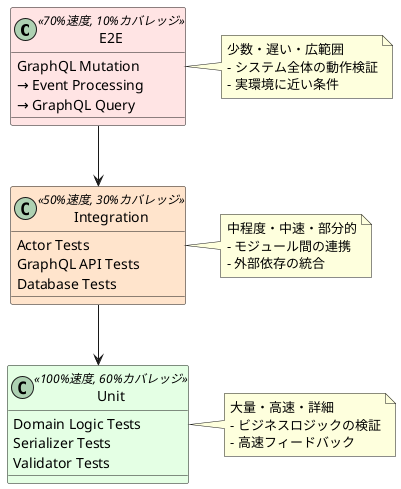
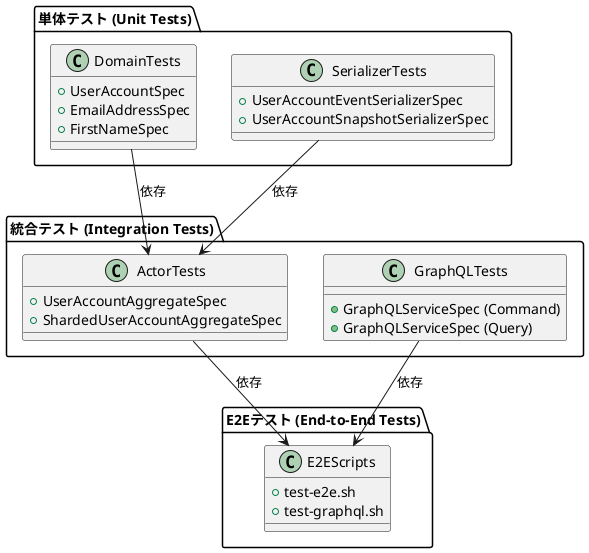

# 第7章：テスト戦略

## 概要

本章では、CQRS/Event Sourcing システムの**テスト戦略**を解説します。テストピラミッドに基づいた効率的なテストアプローチ、ScalaTest によるドメイン層のテスト、Pekko TestKit によるアクターテスト、E2E テストまで詳しく学びます。

以下の4つのトピックを順に説明します：

1. **テストピラミッド**：効率的なテスト戦略の全体像
2. **単体テスト**：ドメインロジックとシリアライザのテスト
3. **統合テスト**：アクター・GraphQL APIのテスト
4. **E2Eテスト**：システム全体の動作検証

## 技術的背景

### テストピラミッド



### テストスイートの構成



## 実装の詳細

### 7.1 単体テスト（Unit Tests）

#### 7.1.1 ドメインロジックのテスト

ドメイン層は純粋な Scala コードであり、外部依存がないため高速にテストできます。

**テスト例：EmailAddress のバリデーション**:

```scala
package io.github.j5ik2o.pcqrses.command.domain.users

import org.scalatest.funsuite.AnyFunSuiteLike
import org.scalatest.matchers.should.Matchers

class EmailAddressSpec extends AnyFunSuiteLike with Matchers {

  test("有効なメールアドレスをパースできる") {
    val validEmails = Seq(
      "user@example.com",
      "user.name@example.co.jp",
      "user+tag@example.com",
      "user_123@sub.example.com"
    )

    validEmails.foreach { email =>
      val result = EmailAddress.parseFromString(email)
      result should be a 'Right
      result.toOption.get.asString shouldBe email
    }
  }

  test("無効なメールアドレスはエラーを返す") {
    val invalidEmails = Seq(
      "",                     // 空文字
      "invalid",              // @がない
      "@example.com",         // ローカルパートがない
      "user@",                // ドメインがない
      "user@@example.com",    // @が複数
      "user@.com",            // ドメイン形式が不正
      "a" * 100 + "@example.com"  // 100文字超過
    )

    invalidEmails.foreach { email =>
      val result = EmailAddress.parseFromString(email)
      result should be a 'Left

      result match {
        case Left(EmailAddressError.Empty) if email.isEmpty =>
          // OK
        case Left(EmailAddressError.TooLong(_)) if email.length > 100 =>
          // OK
        case Left(EmailAddressError.InvalidFormat) =>
          // OK
        case other =>
          fail(s"Unexpected result for '$email': $other")
      }
    }
  }

  test("境界値のテスト") {
    // 最大長（100文字）
    val maxLengthEmail = "a" * 88 + "@example.com" // 88 + 12 = 100
    EmailAddress.parseFromString(maxLengthEmail) should be a 'Right

    // 最大長+1（101文字）
    val tooLongEmail = "a" * 89 + "@example.com" // 89 + 12 = 101
    EmailAddress.parseFromString(tooLongEmail) should matchPattern {
      case Left(EmailAddressError.TooLong(101)) =>
    }
  }
}
```

**テストのポイント**：

- **境界値テスト**: 最小値・最大値・境界値をテスト
- **等価クラス分割**: 有効な入力と無効な入力を分類
- **エラーケースの網羅**: すべてのエラーパターンを検証

---

#### 7.1.2 シリアライザのテスト

**modules/command/interface-adapter-event-serializer/src/test/scala/.../UserAccountEventSerializerSpec.scala**:

```scala
class UserAccountEventSerializerSpec extends AnyFunSuiteLike with Matchers {

  private val serializer = new UserAccountEventSerializer

  test("identifier should be constant") {
    serializer.identifier shouldBe 20002
  }

  test("manifest should return expected strings") {
    val id = DomainEventId.generate()
    val entityId = UserAccountId.generate()
    val name = UserAccountName(FirstName("Taro"), LastName("Yamada"))
    val email = EmailAddress("taro.yamada@example.com")
    val occurredAt = DateTime.fromSecondsAndNanos(1710000000L, 123456789)

    serializer.manifest(UserAccountEvent.Created_V1(id, entityId, name, email, occurredAt)) shouldBe "Envelope"
    serializer.manifest(UserAccountEvent.Renamed_V1(id, entityId, name, name, occurredAt)) shouldBe "Envelope"
    serializer.manifest(UserAccountEvent.Deleted_V1(id, entityId, occurredAt)) shouldBe "Envelope"
  }

  test("toBinary should encode Created correctly") {
    val id = DomainEventId.generate()
    val entityId = UserAccountId.generate()
    val name = UserAccountName(FirstName("Hanako"), LastName("Suzuki"))
    val email = EmailAddress("hanako.suzuki@example.com")
    val occurredAt = DateTime.fromSecondsAndNanos(1720000000L, 111222333)

    val ev = UserAccountEvent.Created_V1(id, entityId, name, email, occurredAt)
    val bytes = serializer.toBinary(ev)
    val env = UserAccountEvent_Envelope.parseFrom(bytes)

    // Envelope の検証
    env.userAccountId shouldBe entityId.asString
    env.eventTypeName shouldBe "UserAccountEvent.Created"
    env.eventTypeVersion shouldBe "V1"
    (env.occurredAt.get.seconds, env.occurredAt.get.nanos) shouldBe occurredAt.toSecondsAndNanos

    // Payload の検証
    val c = UserAccountEvent_Created_V1.parseFrom(env.payload.toByteArray)
    c.eventId shouldBe id.asString
    c.userAccountId shouldBe entityId.asString
    c.userName.get.firstName shouldBe name.breachEncapsulationOfFirstName.asString
    c.userName.get.lastName shouldBe name.breachEncapsulationOfLastName.asString
    c.emailAddress shouldBe email.asString
    (c.occurredAt.get.seconds, c.occurredAt.get.nanos) shouldBe occurredAt.toSecondsAndNanos
  }

  test("round-trip serialization should preserve data") {
    val id = DomainEventId.generate()
    val entityId = UserAccountId.generate()
    val name = UserAccountName(FirstName("Alice"), LastName("Smith"))
    val email = EmailAddress("alice.smith@example.com")
    val occurredAt = DateTime.fromSecondsAndNanos(1750000000L, 987654321)

    val original = UserAccountEvent.Created_V1(id, entityId, name, email, occurredAt)

    // シリアライズ
    val bytes = serializer.toBinary(original)

    // デシリアライズ
    val deserialized = serializer.fromBinary(bytes, "Envelope")

    // 検証
    deserialized shouldBe original
  }

  test("fromBinary should fail on Empty event") {
    val empty = UserAccountEvent_Envelope().toByteArray
    val ex = intercept[IllegalArgumentException] {
      serializer.fromBinary(empty, "")
    }
    ex.getMessage should include("Unexpected event type")
  }

  test("fromBinary should fail on unknown event type") {
    val unknownEnvelope = UserAccountEvent_Envelope(
      userAccountId = "test-id",
      eventTypeName = "UnknownEvent",
      eventTypeVersion = "V99",
      payload = com.google.protobuf.ByteString.EMPTY,
      occurredAt = Some(com.google.protobuf.timestamp.Timestamp(0, 0))
    )

    val ex = intercept[IllegalArgumentException] {
      serializer.fromBinary(unknownEnvelope.toByteArray, "Envelope")
    }
    ex.getMessage should include("Unexpected event type")
  }
}
```

**テストのポイント**：

- **identifier の一貫性**: シリアライザIDが変更されないことを確認
- **エンコード検証**: ドメインイベントが正しく Protocol Buffers にエンコードされる
- **Round-trip テスト**: シリアライズ→デシリアライズで元のデータが復元される
- **エラーケース**: 不正なデータに対してエラーが発生する

---

### 7.2 統合テスト（Integration Tests）

#### 7.2.1 アクターテストの基盤

**modules/command/interface-adapter/src/test/scala/.../ActorSpec.scala**:

```scala
package io.github.j5ik2o.pcqrses.command.interfaceAdapter.test

import com.typesafe.config.Config
import org.apache.pekko.actor.testkit.typed.scaladsl.{ActorTestKit, ScalaTestWithActorTestKit}
import org.scalatest.freespec.AnyFreeSpecLike

abstract class ActorSpec(config: Config)
  extends ScalaTestWithActorTestKit(config)
  with AnyFreeSpecLike
```

**設計のポイント**：

- **ScalaTestWithActorTestKit**: Pekko Typed のテストキット
- **設定のオーバーライド**: InMemory Journal/Snapshot Store を使用

---

#### 7.2.2 集約アクターのテスト

**modules/command/interface-adapter/src/test/scala/.../UserAccountAggregateSpec.scala** (抜粋):

```scala
object UserAccountAggregateSpec {
  val id: String = UUID.randomUUID().toString

  val config: Config = ConfigFactory
    .parseString(
      s"""
       |pekko {
       |  persistence {
       |    journal {
       |      plugin = "pekko.persistence.journal.inmem"
       |      inmem {
       |        class = "org.apache.pekko.persistence.journal.inmem.InmemJournal"
       |        plugin-dispatcher = "pekko.actor.default-dispatcher"
       |      }
       |    }
       |    snapshot-store {
       |      plugin = "pekko.persistence.snapshot-store.local"
       |      local {
       |        dir = "target/snapshot/$id"
       |      }
       |    }
       |  }
       |  test {
       |    single-expect-default = 5s
       |  }
       |}
       |""".stripMargin
    )
    .withFallback(ConfigFactory.load())
}

class UserAccountAggregateSpec
  extends ActorSpec(UserAccountAggregateSpec.config)
  with UserAccountTestHelper
  with Matchers
  with Eventually
  with BeforeAndAfterAll {

  override def afterAll(): Unit = {
    super.afterAll()
    // スナップショットディレクトリをクリーンアップ
    val snapshotDir = new java.io.File(s"target/snapshot/${UserAccountAggregateSpec.id}")
    if (snapshotDir.exists()) {
      Files
        .walk(snapshotDir.toPath)
        .sorted(Comparator.reverseOrder())
        .forEach(Files.delete(_))
    }
  }

  override def sendCommand[Reply](
    userAccountId: UserAccountId,
    createCommand: UserAccountId => Command,
    probe: TestProbe[Reply]
  ): Unit = {
    val aggregate = spawn(UserAccountAggregate(userAccountId))
    aggregate ! createCommand(userAccountId)
  }

  "UserAccountAggregate" - {
    "ユーザアカウントが未作成の状態" - {
      "Createコマンドを受信したとき" - {
        "新しいユーザアカウントを作成できる" in
          testCreateUserAccountOnNotCreated()
      }

      "Getコマンドを受信したとき" - {
        "NotFoundを返す" in
          testGetUserAccountOnNotCreated()
      }
    }

    "ユーザアカウントが作成済みの状態" - {
      "Getコマンドを受信したとき" - {
        "ユーザアカウント情報を返す" in
          testGetUserAccountOnCreated()
      }

      "Renameコマンドを受信したとき" - {
        "ユーザアカウントの名前を変更できる" in
          testRenameUserAccountOnCreated()
      }

      "Deleteコマンドを受信したとき" - {
        "ユーザアカウントを削除できる" in
          testDeleteUserAccountOnCreated()
      }
    }

    "ユーザアカウントが削除済みの状態" - {
      "Getコマンドを受信したとき" - {
        "NotFoundを返す" in
          testGetUserAccountOnDeleted()
      }
    }
  }
}
```

**テストヘルパー trait**:

```scala
trait UserAccountTestHelper {
  this: ActorSpec =>

  def sendCommand[Reply](
    userAccountId: UserAccountId,
    createCommand: UserAccountId => Command,
    probe: TestProbe[Reply]
  ): Unit

  def testCreateUserAccountOnNotCreated(): Unit = {
    val userAccountId = UserAccountId.generate()
    val name = UserAccountName(FirstName("Taro"), LastName("Yamada"))
    val email = EmailAddress("taro.yamada@example.com")
    val probe = TestProbe[UserAccountProtocol.CreateReply]()

    sendCommand(
      userAccountId,
      id => UserAccountProtocol.Create(id, name, email, probe.ref),
      probe
    )

    probe.expectMessageType[UserAccountProtocol.CreateSucceeded] match {
      case UserAccountProtocol.CreateSucceeded(id) =>
        id shouldBe userAccountId
    }
  }

  def testRenameUserAccountOnCreated(): Unit = {
    val userAccountId = UserAccountId.generate()
    val name = UserAccountName(FirstName("Hanako"), LastName("Suzuki"))
    val email = EmailAddress("hanako.suzuki@example.com")
    val createProbe = TestProbe[UserAccountProtocol.CreateReply]()

    // 1. Create
    sendCommand(
      userAccountId,
      id => UserAccountProtocol.Create(id, name, email, createProbe.ref),
      createProbe
    )
    createProbe.expectMessageType[UserAccountProtocol.CreateSucceeded]

    // 2. Rename
    val newName = UserAccountName(FirstName("Hanako"), LastName("Tanaka"))
    val renameProbe = TestProbe[UserAccountProtocol.RenameReply]()

    sendCommand(
      userAccountId,
      id => UserAccountProtocol.Rename(id, newName, renameProbe.ref),
      renameProbe
    )

    renameProbe.expectMessageType[UserAccountProtocol.RenameSucceeded] match {
      case UserAccountProtocol.RenameSucceeded(id) =>
        id shouldBe userAccountId
    }
  }

  // 他のテストケースも同様...
}
```

**テストのポイント**：

- **TestProbe**: アクターからの応答を検証
- **InMemory Persistence**: 高速なテスト実行
- **状態遷移のテスト**: NotCreated → Created → Deleted
- **クリーンアップ**: `afterAll()` でテストデータを削除

---

#### 7.2.3 GraphQL API のテスト

**modules/command/interface-adapter/src/test/scala/.../GraphQLServiceSpec.scala** (概要):

```scala
class GraphQLServiceSpec extends AnyFreeSpec with Matchers with Eventually {

  "GraphQL Service" - {
    "Mutation" - {
      "createUserAccount should create a new user" in {
        val mutation = """
          mutation CreateUserAccount($input: CreateUserAccountInput!) {
            createUserAccount(input: $input) {
              id
            }
          }
        """

        val variables = Json.obj(
          "input" -> Json.obj(
            "firstName" -> Json.fromString("Test"),
            "lastName" -> Json.fromString("User"),
            "emailAddress" -> Json.fromString("test@example.com")
          )
        )

        val result = executeQuery(mutation, variables)

        result.hcursor.downField("data")
          .downField("createUserAccount")
          .downField("id")
          .as[String] shouldBe a [Right[_, _]]
      }

      "createUserAccount should fail with invalid email" in {
        val mutation = """
          mutation CreateUserAccount($input: CreateUserAccountInput!) {
            createUserAccount(input: $input) {
              id
            }
          }
        """

        val variables = Json.obj(
          "input" -> Json.obj(
            "firstName" -> Json.fromString("Test"),
            "lastName" -> Json.fromString("User"),
            "emailAddress" -> Json.fromString("invalid-email")
          )
        )

        val result = executeQuery(mutation, variables)

        result.hcursor.downField("errors").as[List[Json]] shouldBe a [Right[_, _]]
      }
    }
  }
}
```

---

### 7.3 E2E テスト（End-to-End Tests）

#### 7.3.1 E2E テストスクリプトの構造

**scripts/test-e2e.sh** の構成:

```plantuml
@startuml
!define PHASE rectangle

PHASE "Phase 1:\nHealth Check" as P1 {
  - Command API の接続確認
  - Query API の接続確認
}

PHASE "Phase 2:\nGraphQL Mutation" as P2 {
  - createUserAccount 実行
  - UserAccountId を取得
}

PHASE "Phase 3:\nWait for Consistency" as P3 {
  - 8秒間待機
  - Lambda によるイベント処理
}

PHASE "Phase 4:\nGraphQL Query" as P4 {
  - getUserAccounts 実行
  - 作成したユーザーを検索
  - リトライロジック (最大10回)
}

PHASE "Phase 5:\nVerification" as P5 {
  - データの整合性確認
  - ID による個別取得確認
}

P1 --> P2
P2 --> P3
P3 --> P4
P4 --> P5

note right of P3
  結果整合性:
  コマンド実行後、クエリ側への
  反映には数秒のラグが発生
end note

note right of P4
  リトライ戦略:
  結果整合性を考慮して
  最大10回まで再試行
end note

@enduml
```

---

#### 7.3.2 E2E テストスクリプトの実装

**scripts/test-e2e.sh** (重要部分の抜粋):

```bash
#!/bin/bash

# 設定
E2E_MAX_RETRIES="${E2E_MAX_RETRIES:-10}"
E2E_RETRY_DELAY="${E2E_RETRY_DELAY:-3}"
E2E_WAIT_AFTER_CREATE="${E2E_WAIT_AFTER_CREATE:-8}"

COMMAND_API_ENDPOINT="http://localhost:50501/api/graphql"
QUERY_API_ENDPOINT="http://localhost:50502/api/graphql"

# GraphQL クエリを実行する関数
execute_graphql() {
    local endpoint="$1"
    local query="$2"
    local variables="${3:-{}}"

    local payload
    if [ -z "$variables" ] || [ "$variables" = "{}" ]; then
        payload=$(jq -n --arg q "$query" '{query: $q}')
    else
        payload=$(echo "$variables" | jq --arg q "$query" '{query: $q, variables: .}')
    fi

    curl -s -X POST \
        -H "Content-Type: application/json" \
        -d "$payload" \
        "$endpoint"
}

# Step 1: Create UserAccount via GraphQL Mutation
create_user_account_via_graphql() {
    print_header "Step 1: Create UserAccount via GraphQL Mutation"

    local mutation='mutation CreateUserAccount($input: CreateUserAccountInput!) {
        createUserAccount(input: $input) {
            id
        }
    }'

    local variables="{
        \"input\": {
            \"firstName\": \"$TEST_FIRST_NAME\",
            \"lastName\": \"$TEST_LAST_NAME\",
            \"emailAddress\": \"$TEST_EMAIL\"
        }
    }"

    RESPONSE=$(execute_graphql "$COMMAND_API_ENDPOINT" "$mutation" "$variables")

    if echo "$RESPONSE" | jq -e '.data.createUserAccount.id' > /dev/null 2>&1; then
        CREATED_USER_ID=$(echo "$RESPONSE" | jq -r '.data.createUserAccount.id')
        print_success "UserAccount created successfully!"
        print_info "Created UserAccount ID: $CREATED_USER_ID"
        return 0
    else
        print_error "Failed to create user account"
        return 1
    fi
}

# Step 2: Wait for eventual consistency
wait_for_consistency() {
    print_header "Step 2: Wait for Event Processing"
    print_info "Waiting for DynamoDB stream to process and update PostgreSQL..."

    local wait_time=$E2E_WAIT_AFTER_CREATE
    for i in $(seq $wait_time -1 1); do
        echo -ne "\r  Waiting... $i seconds remaining"
        sleep 1
    done
    echo -e "\r  Waiting... Done!                    "
    print_success "Event processing time elapsed"
}

# Step 3: Query UserAccount via GraphQL (with retry)
query_user_account_via_graphql() {
    print_header "Step 3: Query UserAccount via GraphQL"

    local query='{
        getUserAccounts {
            id
            firstName
            lastName
            fullName
            createdAt
            updatedAt
        }
    }'

    RESPONSE=$(execute_graphql "$QUERY_API_ENDPOINT" "$query")

    if echo "$RESPONSE" | jq -e '.data.getUserAccounts' > /dev/null 2>&1; then
        USER_DATA=$(echo "$RESPONSE" | jq ".data.getUserAccounts[] | select(.firstName == \"$TEST_FIRST_NAME\" and .lastName == \"$TEST_LAST_NAME\")")

        if [ -n "$USER_DATA" ] && [ "$USER_DATA" != "null" ]; then
            print_success "UserAccount found via GraphQL!"
            print_json "$USER_DATA"
            return 0
        else
            print_error "UserAccount not found in database"
            return 1
        fi
    else
        print_error "GraphQL query failed"
        return 1
    fi
}

# メイン処理
main() {
    print_header "End-to-End Test Suite for UserAccount"

    health_check

    if create_user_account_via_graphql; then
        wait_for_consistency

        # リトライロジック
        MAX_RETRIES=$E2E_MAX_RETRIES
        RETRY_COUNT=0
        SUCCESS=false

        while [ $RETRY_COUNT -lt $MAX_RETRIES ] && [ "$SUCCESS" = false ]; do
            if [ $RETRY_COUNT -gt 0 ]; then
                print_info "Retry attempt $RETRY_COUNT/$MAX_RETRIES..."
                sleep "$E2E_RETRY_DELAY"
            fi

            if query_user_account_via_graphql; then
                SUCCESS=true
                verify_data_consistency
            else
                RETRY_COUNT=$((RETRY_COUNT + 1))
            fi
        done

        if [ "$SUCCESS" = false ]; then
            print_error "Failed to query user account after $MAX_RETRIES retries"
            exit 1
        fi
    else
        print_error "Failed to create user account, aborting test"
        exit 1
    fi

    print_success "End-to-End test completed successfully!"
}

main "$@"
```

**テストのポイント**：

- **環境変数**: リトライ回数や待機時間を外部から設定可能
- **リトライロジック**: 結果整合性を考慮した自動リトライ
- **色付き出力**: 成功・エラー・情報を視覚的に区別
- **JSON パース**: `jq` でレスポンスを検証

---

#### 7.3.3 E2E テストの実行

```bash
# デフォルト設定で実行
./scripts/test-e2e.sh

# リトライ設定をカスタマイズ
E2E_MAX_RETRIES=20 E2E_RETRY_DELAY=5 E2E_WAIT_AFTER_CREATE=15 ./scripts/test-e2e.sh

# CI環境で実行（厳格な設定）
E2E_MAX_RETRIES=30 E2E_WAIT_AFTER_CREATE=20 ./scripts/test-e2e.sh
```

---

### 7.4 テストカバレッジ

#### 7.4.1 カバレッジの計測

**build.sbt**:

```scala
// scoverage プラグインの設定
coverageEnabled := true
coverageMinimumStmtTotal := 80
coverageFailOnMinimum := true
coverageHighlighting := true

// カバレッジ除外パターン
coverageExcludedPackages := Seq(
  "<empty>",
  ".*\\.interfaceAdapter\\.persistence\\..*",  // Protocol Buffers生成コード
  ".*Main",
  ".*\\.config\\..*"
).mkString(";")
```

**カバレッジテストの実行**:

```bash
# カバレッジ計測付きテスト
sbt clean coverage test coverageReport

# カバレッジレポートの確認
open target/scala-3.6.2/scoverage-report/index.html
```

---

#### 7.4.2 カバレッジの目標値

| レイヤー | 目標カバレッジ | 理由 |
|---------|---------------|------|
| **Domain層** | 90%以上 | ビジネスロジックの中核 |
| **Use Case層** | 80%以上 | アプリケーションロジック |
| **Interface Adapter層** | 70%以上 | 外部依存が多い |
| **Generated Code** | 除外 | Protocol Buffers生成コード |

---

## ベストプラクティス

### 1. テストの命名規則

**良い例**：

```scala
test("有効なメールアドレスをパースできる") { ... }
test("無効なメールアドレスはエラーを返す") { ... }
test("境界値のテスト - 最大長100文字") { ... }
```

**悪い例**：

```scala
test("test1") { ... }
test("email test") { ... }
test("it works") { ... }
```

**推奨事項**：

- 日本語または英語で具体的な動作を記述
- 「〜できる」「〜を返す」のような明確な表現
- Given-When-Then パターンの活用

---

### 2. テストデータの管理

**良い例**：

```scala
object TestFixtures {
  val validEmail = "test@example.com"
  val invalidEmail = "invalid"

  def generateUserAccountId(): UserAccountId = UserAccountId.generate()

  def generateUserAccount(
    firstName: String = "Taro",
    lastName: String = "Yamada",
    email: String = validEmail
  ): (UserAccount, UserAccountEvent) = {
    val id = generateUserAccountId()
    val name = UserAccountName(FirstName(firstName), LastName(lastName))
    val emailAddress = EmailAddress(email)
    UserAccount(id, name, emailAddress)
  }
}
```

**推奨事項**：

- テストデータを Fixture オブジェクトで管理
- ファクトリーメソッドでテストデータを生成
- デフォルト値を提供し、必要に応じてオーバーライド

---

### 3. 非同期テストのタイムアウト設定

```scala
// Pekko Test
implicit val timeout: Timeout = 5.seconds

// ScalaTest Eventually
implicit val patience: PatienceConfig = PatienceConfig(
  timeout = scaled(5.seconds),
  interval = scaled(100.millis)
)

// テスト内での使用
eventually {
  probe.expectMessageType[Reply]
}
```

---

### 4. テストの独立性

**良い例**：

```scala
class UserAccountAggregateSpec extends ActorSpec with BeforeAndAfterEach {

  override def beforeEach(): Unit = {
    // 各テスト前にクリーンアップ
    cleanupTestData()
  }

  override def afterEach(): Unit = {
    // 各テスト後にクリーンアップ
    cleanupTestData()
  }

  test("test1") { ... }
  test("test2") { ... }  // test1 の影響を受けない
}
```

**悪い例**：

```scala
class UserAccountAggregateSpec extends ActorSpec {
  var sharedState: UserAccount = _  // 共有状態

  test("test1") {
    sharedState = createUserAccount()
  }

  test("test2") {
    // test1 の実行順序に依存
    sharedState.rename(...)
  }
}
```

**推奨事項**：

- 各テストは独立して実行可能にする
- テスト間で状態を共有しない
- `beforeEach` / `afterEach` でクリーンアップ

---

### 5. CI/CD でのテスト実行

**GitHub Actions の例**:

```yaml
name: Test

on: [push, pull_request]

jobs:
  test:
    runs-on: ubuntu-latest

    services:
      localstack:
        image: localstack/localstack:4.7
        ports:
          - 4566:4566
        env:
          SERVICES: dynamodb

      postgres:
        image: postgres:16.4
        ports:
          - 5432:5432
        env:
          POSTGRES_PASSWORD: postgres

    steps:
      - uses: actions/checkout@v4

      - name: Setup Java
        uses: actions/setup-java@v4
        with:
          java-version: '17'
          distribution: 'temurin'

      - name: Run Unit Tests
        run: sbt test

      - name: Run Integration Tests
        run: sbt "testOnly *IntegrationSpec"

      - name: Run E2E Tests
        run: |
          docker-compose up -d
          sleep 30
          ./scripts/test-e2e.sh

      - name: Coverage Report
        run: sbt coverageReport

      - name: Upload Coverage
        uses: codecov/codecov-action@v3
```

---

### 6. テストのパフォーマンス最適化

**並列テスト実行**:

```scala
// build.sbt
Test / parallelExecution := true
Test / fork := true

// 並列度の設定
Test / testOptions += Tests.Argument("-P4")  // 4並列
```

**InMemory Persistence**:

```hocon
pekko.persistence {
  journal.plugin = "pekko.persistence.journal.inmem"
  snapshot-store.plugin = "pekko.persistence.snapshot-store.local"
}
```

---

## まとめ

本章では、テスト戦略を以下の順で解説しました：

1. **テストピラミッド**: 効率的なテスト配分（Unit 60%, Integration 30%, E2E 10%）
2. **単体テスト**: ドメインロジックとシリアライザの高速テスト
3. **統合テスト**: Pekko TestKit によるアクターテスト
4. **E2Eテスト**: Bash スクリプトによるシステム全体の検証

これらの実装により、以下が実現されます：

- **高速フィードバック**: 単体テストで早期にバグを発見
- **信頼性**: 統合テストでモジュール間の連携を検証
- **本番環境への自信**: E2E テストでシステム全体の動作を保証
- **継続的改善**: カバレッジ計測による品質の可視化

次章では、**パフォーマンスとスケーラビリティ**を解説します。

---

👉 [第8章：パフォーマンスとスケーラビリティ](part2-08-performance.md)
