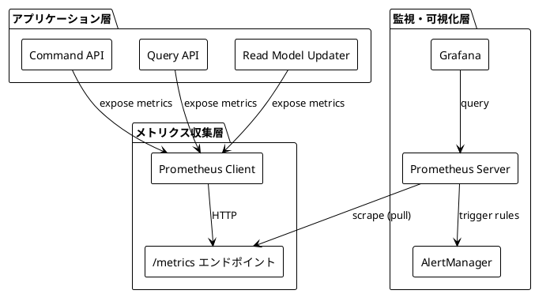
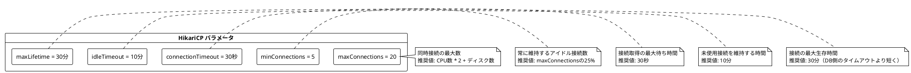
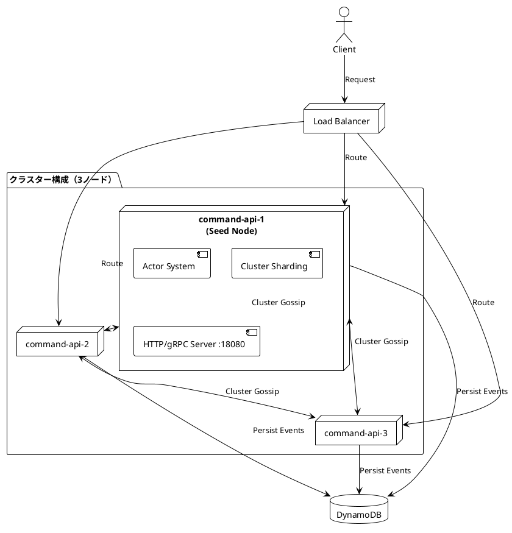
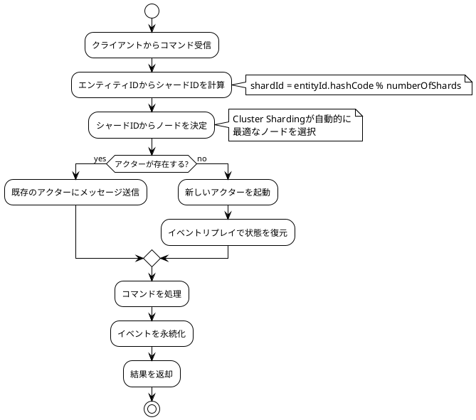
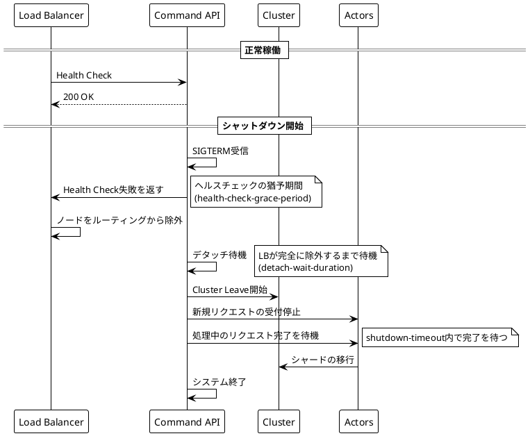

# 第8章：パフォーマンスとスケーラビリティ

## 概要

本章では、Apache Pekkoベースのシステムにおけるパフォーマンス最適化とスケーラビリティ戦略について説明します。CQRS/イベントソーシングシステムにおける監視、ログ管理、チューニング、水平スケーリングの実践的な手法を解説します。

## 8.1 メトリクスとモニタリング

### 技術的背景

分散システムにおいて、メトリクス収集とモニタリングは以下の理由で重要です：

- **可観測性（Observability）**: システムの内部状態を外部から理解可能にする
- **SLA/SLO管理**: サービスレベルを定量的に測定し、目標を達成する
- **問題の早期発見**: パフォーマンス劣化や障害を検知し、迅速に対応する
- **キャパシティプランニング**: リソース使用状況を分析し、適切にスケールする

Pekkoアクターシステムでは、以下のメトリクスを監視することが推奨されます：

- **アクターメトリクス**: メールボックスサイズ、処理時間、メッセージスループット
- **永続化メトリクス**: ジャーナル書き込み時間、スナップショット作成時間、リカバリ時間
- **クラスターメトリクス**: ノード数、シャードの分散状況、リバランスの頻度
- **JVMメトリクス**: ヒープ使用量、GC時間、スレッド数

### 実装の詳細

#### Pekkoメトリクスの設定

Pekkoは[Cinnamon](https://developer.lightbend.com/docs/telemetry/current/)（商用）やKamonなどのライブラリと統合できますが、ここでは基本的な設定について説明します。

application.confでのメトリクス関連設定：

```hocon
pekko {
  # JVMメトリクスの有効化
  metrics {
    enabled = on
    native-memory-information-enabled = on
  }

  # アクターシステムのログメトリクス
  log-config-on-start = off
  log-dead-letters = 10
  log-dead-letters-during-shutdown = on
}
```

現在のシステム設定（apps/read-model-updater/src/main/resources/application.conf:15-16より）：

```hocon
log-dead-letters = 10
log-dead-letters-during-shutdown = on
```

#### Prometheusとの統合

PrometheusとGrafanaを用いた監視システムの構築例：



依存関係の追加（build.sbtに追加する場合）：

```scala
// Prometheusクライアント
libraryDependencies += "io.prometheus" % "simpleclient" % "0.16.0"
libraryDependencies += "io.prometheus" % "simpleclient_hotspot" % "0.16.0"
libraryDependencies += "io.prometheus" % "simpleclient_httpserver" % "0.16.0"
```

メトリクスエンドポイントの実装例：

```scala
import io.prometheus.client.exporter.HTTPServer
import io.prometheus.client.hotspot.DefaultExports

// JVMメトリクスを登録
DefaultExports.initialize()

// /metricsエンドポイントを8090ポートで公開
val server = new HTTPServer(8090)
```

#### Grafanaダッシュボード

主要な監視項目：

1. **アクター処理メトリクス**
   - メッセージ処理レート (messages/sec)
   - 平均処理時間 (ms)
   - メールボックスサイズ

2. **イベント永続化メトリクス**
   - イベント書き込みレート (events/sec)
   - DynamoDB書き込みレイテンシ (ms)
   - スナップショット作成頻度

3. **クエリAPIメトリクス**
   - GraphQLクエリレート (queries/sec)
   - データベース接続プール使用率 (%)
   - クエリレスポンス時間 (ms)

4. **インフラメトリクス**
   - CPU使用率 (%)
   - メモリ使用率 (%)
   - ネットワークI/O (MB/sec)

### ベストプラクティス

- **メトリクスの粒度を調整する**: すべてを監視するとオーバーヘッドが大きくなる。重要なメトリクスに絞る
- **アラート閾値を適切に設定する**: ノイズの多いアラートは無視されるようになる。実際の問題を示す閾値を設定
- **ダッシュボードを役割別に分ける**: 開発者向け、運用者向け、ビジネス向けなど、目的に応じて分割
- **メトリクスの保持期間を計画する**: ディスク容量とクエリパフォーマンスのトレードオフを考慮

## 8.2 ロギング戦略

### 技術的背景

ロギングは以下の目的で使用されます：

- **トラブルシューティング**: エラーや異常動作の原因を特定する
- **監査ログ**: セキュリティやコンプライアンスのための操作記録
- **デバッグ**: 開発時の動作確認
- **パフォーマンス分析**: 処理時間やボトルネックの特定

適切なロギング戦略には以下の要素が必要です：

- **ログレベル**: DEBUG, INFO, WARN, ERROR, FATALの適切な使い分け
- **構造化ログ**: 機械可読な形式（JSON）での出力
- **コンテキスト情報**: 相関ID、ユーザーID、トランザクションIDの付与
- **ログローテーション**: ディスク容量の管理

### 実装の詳細

#### Logbackの設定

現在のlogback設定（apps/command-api/src/main/resources/logback.xml:1-11）：

```xml
<configuration>
  <appender name="STDOUT" class="ch.qos.logback.core.ConsoleAppender">
    <encoder>
      <pattern>%d{yyyy-MM-dd HH:mm:ss} %-5level %logger{36} - %msg%n</pattern>
    </encoder>
  </appender>

  <root level="INFO">
    <appender-ref ref="STDOUT" />
  </root>
</configuration>
```

この設定は開発環境向けのシンプルな構成です。本番環境向けには以下のような拡張が推奨されます。

#### 構造化ログの実装

JSON形式でのログ出力設定例：

```xml
<configuration>
  <!-- JSON形式でのログ出力 -->
  <appender name="JSON" class="ch.qos.logback.core.ConsoleAppender">
    <encoder class="net.logstash.logback.encoder.LogstashEncoder">
      <includeMdcKeyName>correlation-id</includeMdcKeyName>
      <includeMdcKeyName>user-id</includeMdcKeyName>
      <includeMdcKeyName>aggregate-id</includeMdcKeyName>
      <customFields>{"application":"command-api","environment":"production"}</customFields>
    </encoder>
  </appender>

  <!-- ファイルローテーション -->
  <appender name="FILE" class="ch.qos.logback.core.rolling.RollingFileAppender">
    <file>/var/log/pekko-cqrs-es/application.log</file>
    <rollingPolicy class="ch.qos.logback.core.rolling.TimeBasedRollingPolicy">
      <fileNamePattern>/var/log/pekko-cqrs-es/application.%d{yyyy-MM-dd}.log.gz</fileNamePattern>
      <maxHistory>30</maxHistory>
      <totalSizeCap>10GB</totalSizeCap>
    </rollingPolicy>
    <encoder class="net.logstash.logback.encoder.LogstashEncoder" />
  </appender>

  <!-- Pekko関連のログレベル -->
  <logger name="org.apache.pekko.actor" level="INFO" />
  <logger name="org.apache.pekko.persistence" level="INFO" />
  <logger name="org.apache.pekko.cluster" level="INFO" />

  <!-- アプリケーションのログレベル -->
  <logger name="io.github.j5ik2o.pcqrses" level="DEBUG" />

  <!-- サードパーティライブラリのログレベル -->
  <logger name="slick" level="INFO" />
  <logger name="com.zaxxer.hikari" level="WARN" />

  <root level="INFO">
    <appender-ref ref="JSON" />
    <appender-ref ref="FILE" />
  </root>
</configuration>
```

#### ログレベルの環境変数による制御

application.confでのログレベル設定（apps/read-model-updater/src/main/resources/application.conf:11-12より）：

```hocon
loglevel = "INFO"
loglevel = ${?PEKKO_LOG_LEVEL}
```

この設定により、環境変数`PEKKO_LOG_LEVEL`でログレベルを動的に変更できます：

```bash
# 本番環境
export PEKKO_LOG_LEVEL=INFO

# デバッグ環境
export PEKKO_LOG_LEVEL=DEBUG
```

#### MDC（Mapped Diagnostic Context）の活用

相関IDを用いたログのトレーシング：

```scala
import org.slf4j.MDC

// コマンド処理の開始時にMDCを設定
MDC.put("correlation-id", correlationId)
MDC.put("aggregate-id", aggregateId)
MDC.put("user-id", userId)

try {
  // ビジネスロジック
  log.info("Processing command")
} finally {
  // 処理終了時にMDCをクリア
  MDC.clear()
}
```

Pekkoアクターでは、各メッセージ処理でMDCをリセットする必要があります：

```scala
Behaviors.receive[Command] { (context, command) =>
  MDC.put("actor-path", context.self.path.toString)
  MDC.put("command-type", command.getClass.getSimpleName)

  try {
    // メッセージ処理
    context.log.info("Handling command: {}", command)
    // ...
  } finally {
    MDC.clear()
  }
  Behaviors.same
}
```

### ベストプラクティス

- **本番環境ではINFOレベルを基本とする**: DEBUGレベルはパフォーマンスに影響を与える可能性がある
- **センシティブ情報をログに出力しない**: パスワード、トークン、個人情報は必ずマスクする
- **構造化ログを使用する**: JSON形式で出力すれば、ElasticsearchやSplunkで検索しやすくなる
- **相関IDを必ず付与する**: 分散システムでは、複数のサービスをまたいだトレーシングが必要
- **ログローテーションを設定する**: ディスク容量を圧迫しないように定期的にローテーション
- **非同期ログを使用する**: パフォーマンスへの影響を最小化するため、AsyncAppenderを検討

## 8.3 パフォーマンスチューニング

### 技術的背景

Pekkoベースのシステムにおけるパフォーマンスチューニングのポイント：

- **アクターディスパッチャー**: スレッドプールの設定を最適化
- **データベース接続プール**: HikariCPのパラメータ調整
- **JVMチューニング**: ヒープサイズ、GCアルゴリズムの選択
- **バックプレッシャー**: 負荷に応じた適応的な制御

### 実装の詳細

#### アクターディスパッチャーの設定

デフォルトディスパッチャーの設定例：

```hocon
pekko.actor {
  default-dispatcher {
    type = "Dispatcher"
    executor = "fork-join-executor"

    fork-join-executor {
      # 最小スレッド数
      parallelism-min = 8
      # 最大スレッド数（CPU数 * parallelism-factor）
      parallelism-factor = 3.0
      parallelism-max = 64
    }

    # メールボックスのスループット（1スレッドあたりの連続処理数）
    throughput = 5
  }
}
```

ブロッキングI/O用の専用ディスパッチャー：

```hocon
blocking-io-dispatcher {
  type = "Dispatcher"
  executor = "thread-pool-executor"
  thread-pool-executor {
    fixed-pool-size = 32
  }
  throughput = 1
}
```

使用例：

```scala
val props = Props[BlockingActor]().withDispatcher("blocking-io-dispatcher")
val actor = system.actorOf(props, "blocking-actor")
```

#### データベース接続プールの最適化

HikariCPの設定（apps/query-api/src/main/resources/pcqrses.conf:18-24より）：

```hocon
database {
  driver = "org.postgresql.Driver"
  url = "jdbc:postgresql://localhost:5432/p-cqrs-es_development"
  connectionPool = "HikariCP"
  numThreads = 20
  maxConnections = 20
  minConnections = 5
  connectionTimeout = 30000
  idleTimeout = 600000
  maxLifetime = 1800000
}
```

Read Model Updater側の設定（apps/read-model-updater/src/main/resources/application.conf:59-66より）：

```hocon
slick {
  profile = "slick.jdbc.PostgresProfile$"
  db {
    driver = "org.postgresql.Driver"
    url = "jdbc:postgresql://localhost:5432/p-cqrs-es_development"
    connectionPool = "HikariCP"
    numThreads = 20
    maxConnections = 20
    minConnections = 5
    connectionTimeout = 30000
    idleTimeout = 600000
    maxLifetime = 1800000
  }
}
```

HikariCPのパラメータ説明：



#### JVMチューニング

クラスター環境でのJavaオプション設定（docker-compose-cluster.yml:44より）：

```yaml
JAVA_OPTS: >-
  -Dpekko.cluster.enabled=true
  -Dpekko.actor.provider=cluster
  -Dpekko.remote.artery.canonical.hostname=command-api-1
  -Dpekko.remote.artery.canonical.port=2551
  -Dpekko.cluster.seed-nodes.0=pekko://command-api-system@command-api-1:2551
  -Dpekko.management.http.hostname=0.0.0.0
  -Dpekko.management.http.port=8558
```

本番環境向けの推奨JVMオプション：

```bash
JAVA_OPTS="
  # ヒープサイズの設定
  -Xms2g
  -Xmx2g

  # GCアルゴリズムの選択（G1GC）
  -XX:+UseG1GC
  -XX:MaxGCPauseMillis=200
  -XX:G1HeapRegionSize=16m

  # GCログの出力
  -Xlog:gc*:file=/var/log/gc.log:time,uptime,level,tags:filecount=5,filesize=100m

  # ヒープダンプの設定
  -XX:+HeapDumpOnOutOfMemoryError
  -XX:HeapDumpPath=/var/log/heapdump.hprof

  # JMXの有効化（監視用）
  -Dcom.sun.management.jmxremote
  -Dcom.sun.management.jmxremote.port=9010
  -Dcom.sun.management.jmxremote.rmi.port=9010
  -Dcom.sun.management.jmxremote.local.only=false
  -Dcom.sun.management.jmxremote.authenticate=false
  -Dcom.sun.management.jmxremote.ssl=false
"
```

SBTでのテスト時のJavaオプション（build.sbt:22より）：

```scala
ThisBuild / Test / fork := true
ThisBuild / Test / javaOptions += s"-Djacoco-agent.destfile=target/scala-${scalaVersion.value}/jacoco/data/jacoco.exec"
```

#### タイムアウト設定の最適化

pcqrses.confでのタイムアウト設定（apps/command-api/src/main/resources/pcqrses.conf:4-5より）：

```hocon
pcqrses {
  command-api {
    # アクター間通信のタイムアウト設定
    actor-timeout = 5s
    actor-timeout = ${?COMMAND_API_ACTOR_TIMEOUT}

    server {
      # シャットダウン時のタイムアウト
      shutdown-timeout = 10s
      shutdown-timeout = ${?COMMAND_API_SHUTDOWN_TIMEOUT}
    }
  }
}
```

Read Model Updater側のタイムアウト設定（apps/read-model-updater/src/main/resources/application.conf:42-46より）：

```hocon
read-model-updater {
  timeouts {
    database-operation = 30 seconds
    database-operation = ${?READ_MODEL_UPDATER_DB_TIMEOUT}
    system-termination = 10 seconds
    system-termination = ${?READ_MODEL_UPDATER_TERMINATION_TIMEOUT}
  }
}
```

### ベストプラクティス

- **アクターディスパッチャーをワークロードに応じて分離する**: CPU集約的な処理とI/O処理で異なるディスパッチャーを使用
- **データベース接続プールサイズの公式を適用する**: `connections = (CPU cores * 2) + effective_spindle_count`
- **JVMヒープサイズは物理メモリの50-75%以内に**: コンテナ環境では特に注意（cgroupの制限を考慮）
- **G1GCを使用する**: 低レイテンシが求められるアプリケーションに適している
- **タイムアウトは段階的に設定する**: 内側のタイムアウト < 外側のタイムアウト（例: DB < Actor < HTTP）
- **負荷テストを実施する**: 本番環境と同等の負荷で事前にテストし、ボトルネックを特定

## 8.4 スケーリング戦略

### 技術的背景

CQRSアーキテクチャの利点の一つは、コマンド側とクエリ側を独立してスケールできることです：

- **コマンド側のスケーリング**: Pekko Cluster ShardingによるStatefulな水平スケーリング
- **クエリ側のスケーリング**: ステートレスなAPIサーバーの水平スケーリング
- **Read Model Updaterのスケーリング**: イベントストリーム処理の並列化

### 実装の詳細

#### 水平スケーリング

クラスター構成の概要：



docker-compose-cluster.ymlでの3ノードクラスター定義（docker-compose-cluster.yml:11-16より）：

```yaml
x-cluster-env: &cluster-env
  PEKKO_CLUSTER_ENABLED: "true"
  PEKKO_MANAGEMENT_HTTP_HOSTNAME: 0.0.0.0
  PEKKO_MANAGEMENT_HTTP_PORT: 8558
  PEKKO_CLUSTER_SEED_NODES: "pekko://command-api-system@command-api-1:2551"
  PEKKO_CLUSTER_BOOTSTRAP_REQUIRED_CONTACTS: 2
```

各ノードの設定（docker-compose-cluster.yml:34-44より抜粋）：

```yaml
services:
  # Command API Cluster - Node 1 (Seed Node)
  command-api-1:
    image: p-cqrs-es-command-api:0.1.0
    ports:
      - "50501:18080"  # HTTP/gRPC
      - "8558:8558"    # Pekko Management
      - "2551:2551"    # Pekko Remote
    environment:
      PEKKO_REMOTE_HOSTNAME: command-api-1
      PEKKO_REMOTE_PORT: 2551
      JAVA_OPTS: "-Dpekko.cluster.enabled=true ..."
```

#### Cluster Shardingの最適化

Cluster Shardingの設定：

```hocon
pekko.cluster.sharding {
  # シャード数（ノード数の10倍程度を推奨）
  number-of-shards = 30

  # リバランスの閾値（この値を超えると、シャードの再配置を試みる）
  least-shard-allocation-strategy.rebalance-threshold = 3

  # パッシベーション（アイドルアクターの停止）
  passivate-idle-entity-after = 2 minutes

  # スナップショット保存の頻度
  snapshot-after = 100

  # リメンバーエンティティ（障害時に自動的にアクターを再起動）
  remember-entities = on
  remember-entities-store = "ddata"
}
```

シャード配置の流れ：



#### ロードバランシング

LoadBalancer環境でのGraceful Shutdown設定（apps/command-api/src/main/resources/pcqrses.conf:20-27より）：

```hocon
load-balancer {
  # デタッチ待機時間（開発環境: 短時間、本番環境: 30秒程度）
  detach-wait-duration = 3s
  detach-wait-duration = ${?COMMAND_API_LOADBALANCER_DETACH_WAIT_DURATION}

  # ヘルスチェックの猶予期間
  health-check-grace-period = 5s
  health-check-grace-period = ${?COMMAND_API_LOADBALANCER_HEALTH_GRACE_PERIOD}
}
```

Graceful Shutdownの流れ：



#### クエリ側のスケーリング

クエリAPIはステートレスなため、シンプルな水平スケーリングが可能です：

docker-compose設定（docker-compose-common.yml:159-177より）：

```yaml
query-api:
  image: p-cqrs-es-query-api:0.1.0
  ports:
    - "50502:18082"
  environment:
    QUERY_API_SERVER_HOST: 0.0.0.0
    QUERY_API_SERVER_PORT: 18082
    DATABASE_URL: jdbc:postgresql://postgres:5432/p-cqrs-es_development
    DATABASE_USER: postgres
    DATABASE_PASSWORD: postgres
    GRAPHIQL_ENABLED: "true"
```

複数インスタンスの起動例：

```bash
# docker composeでのスケーリング
docker compose up -d --scale query-api=3

# Kubernetes Deploymentでのスケーリング
kubectl scale deployment query-api --replicas=3
```

#### Read Model Updaterのスケーリング

Lambda関数はDynamoDB Streams経由で自動的に並列実行されます：

LocalStackでのLambdaとEvent Source Mappingの設定（scripts/deploy-lambda-localstack.sh内）：

```bash
# Lambda関数の作成
awslocal lambda create-function \
  --function-name read-model-updater \
  --runtime java17 \
  --handler io.github.j5ik2o.pcqrses.readModelUpdater.LambdaHandler::handleRequest \
  --zip-file fileb://apps/read-model-updater/target/scala-3.6.2/read-model-updater-lambda.jar

# Event Source Mappingの作成
awslocal lambda create-event-source-mapping \
  --function-name read-model-updater \
  --event-source-arn arn:aws:dynamodb:ap-northeast-1:000000000000:table/Journal/stream/* \
  --starting-position LATEST \
  --batch-size 100 \
  --maximum-batching-window-in-seconds 10
```

バッチサイズとウィンドウ時間の調整：

- **batch-size**: 一度に処理するレコード数（1-10000）。大きいほどスループットが向上するが、エラー時の再試行コストが増加
- **maximum-batching-window-in-seconds**: バッチが満たない場合の最大待機時間（0-300秒）。レイテンシとスループットのトレードオフ

推奨設定：

```bash
# 低レイテンシ重視
--batch-size 10 --maximum-batching-window-in-seconds 1

# スループット重視
--batch-size 100 --maximum-batching-window-in-seconds 10

# バランス型
--batch-size 50 --maximum-batching-window-in-seconds 5
```

### ベストプラクティス

- **シャード数は固定する**: 運用開始後の変更は困難。最初から十分な数を設定（ノード数の10倍）
- **パッシベーションを適切に設定する**: メモリ使用量とアクター起動コストのトレードオフを考慮
- **Graceful Shutdownを実装する**: ロードバランサーとの協調によるダウンタイムゼロのデプロイを実現
- **ステートレスとStatefulを分離する**: クエリ側（ステートレス）とコマンド側（Stateful）で異なるスケーリング戦略を適用
- **メトリクスに基づいてスケールする**: CPUやメモリだけでなく、メールボックスサイズやレスポンスタイムも考慮
- **カナリアデプロイやBlue-Greenデプロイを活用する**: 新バージョンのリスクを最小化

## まとめ

本章では、Apache Pekkoを使用したCQRS/イベントソーシングシステムにおけるパフォーマンスとスケーラビリティについて解説しました：

1. **メトリクスとモニタリング**: Prometheus/Grafanaによる可観測性の確保
2. **ロギング戦略**: Logbackを用いた構造化ログとMDCによるトレーシング
3. **パフォーマンスチューニング**: ディスパッチャー、接続プール、JVMの最適化
4. **スケーリング戦略**: Cluster Sharding、ロードバランシング、Graceful Shutdownの実装

これらの手法を組み合わせることで、高可用性かつスケーラブルなシステムを構築できます。次章では、実践的なトピック（エラーハンドリング、リトライ、サーキットブレーカー）について説明します。
