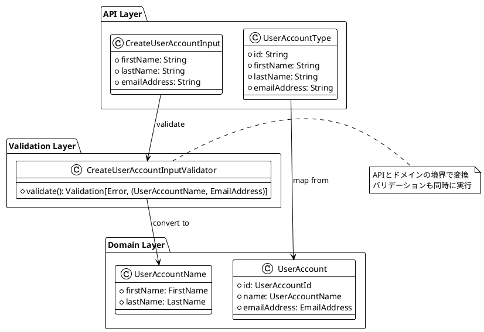
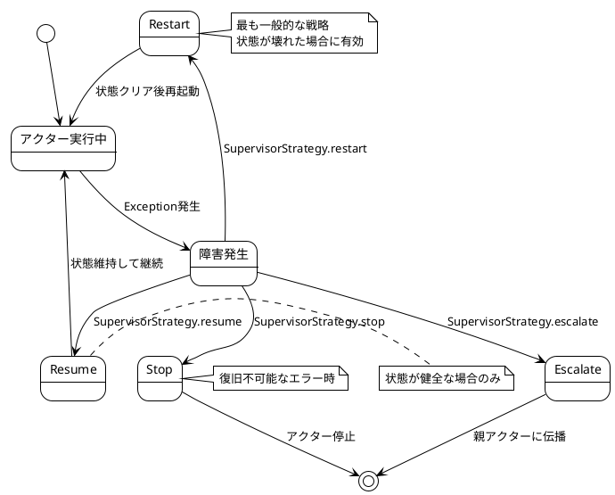
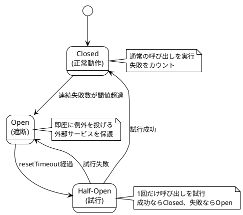

# 第9章：実践的なトピック

## 概要

本章では、Apache Pekkoベースのイベントソーシングシステムを本番環境で運用する上で重要となる実践的なトピックについて説明します。イベントスキーマの進化、GraphQL APIの改善、エラーハンドリングとレジリエンスの実装方法を解説します。

## 9.1 イベントスキーマの進化

### 技術的背景

イベントソーシングシステムでは、一度永続化されたイベントは不変であるため、スキーマの進化は慎重に行う必要があります。以下の課題に対処する必要があります：

- **後方互換性**: 古いイベントを新しいコードで読み込めること
- **前方互換性**: 新しいイベントを古いコードで読み込めること（段階的デプロイ時）
- **段階的移行**: すべてのイベントを一度に書き換えることは現実的ではない
- **バージョン管理**: 複数のイベントバージョンを同時にサポートする必要がある

### 実装の詳細

#### バージョニング戦略

このプロジェクトでは、**Envelope Pattern**と**明示的バージョンサフィックス**を採用しています。

イベント定義の例（modules/command/domain/src/main/scala/io/github/j5ik2o/pcqrses/command/domain/users/UserAccountEvent.scala）:

```scala
sealed trait UserAccountEvent extends DomainEvent {
  def entityId: UserAccountId
  def occurredAt: EventOccurredAt
}

object UserAccountEvent {
  /**
   * UserAccountが作成された
   * @param id イベントID
   * @param entityId エンティティID
   * @param name ユーザー名
   * @param emailAddress メールアドレス
   * @param occurredAt イベント発生時刻
   */
  final case class Created_V1(
    id: EventId,
    entityId: UserAccountId,
    name: UserAccountName,
    emailAddress: EmailAddress,
    occurredAt: EventOccurredAt
  ) extends UserAccountEvent

  /**
   * UserAccountの名前が変更された
   * @param id イベントID
   * @param entityId エンティティID
   * @param oldName 変更前の名前
   * @param newName 変更後の名前
   * @param occurredAt イベント発生時刻
   */
  final case class Renamed_V1(
    id: EventId,
    entityId: UserAccountId,
    oldName: UserAccountName,
    newName: UserAccountName,
    occurredAt: EventOccurredAt
  ) extends UserAccountEvent

  /**
   * UserAccountが削除された
   * @param id イベントID
   * @param entityId エンティティID
   * @param occurredAt イベント発生時刻
   */
  final case class Deleted_V1(
    id: EventId,
    entityId: UserAccountId,
    occurredAt: EventOccurredAt
  ) extends UserAccountEvent
}
```

重要なポイント：

- すべてのイベントに`_V1`サフィックスを付与
- 新しいバージョンは`_V2`、`_V3`と順次追加
- sealed traitにより、すべてのイベントバージョンを型安全に管理

#### イベントのバージョンアップ例

例えば、`Created_V1`から`Created_V2`へ移行する場合：

```scala
// 新バージョン: emailAddressをオプショナルに変更
final case class Created_V2(
  id: EventId,
  entityId: UserAccountId,
  name: UserAccountName,
  emailAddress: Option[EmailAddress],  // V1では必須、V2ではオプション
  phoneNumber: Option[PhoneNumber],    // V2で新規追加
  occurredAt: EventOccurredAt
) extends UserAccountEvent

// V1からV2への変換（アップキャスト）
def upcastV1ToV2(v1: Created_V1): Created_V2 = Created_V2(
  id = v1.id,
  entityId = v1.entityId,
  name = v1.name,
  emailAddress = Some(v1.emailAddress),  // V1の必須フィールドをSomeでラップ
  phoneNumber = None,                    // 新規フィールドはNone
  occurredAt = v1.occurredAt
)
```

#### Protocol Buffersによるシリアライゼーション

Protocol Buffersは後方互換性を維持しやすい仕様です：

```protobuf
// modules/command/interface-adapter-contract/src/main/protobuf/user_account_event.proto
syntax = "proto3";

message UserAccountCreatedV1 {
  string id = 1;
  string entity_id = 2;
  string first_name = 3;
  string last_name = 4;
  string email_address = 5;
  int64 occurred_at = 6;
}

// V2への拡張（V1と互換性を保つ）
message UserAccountCreatedV2 {
  string id = 1;
  string entity_id = 2;
  string first_name = 3;
  string last_name = 4;
  string email_address = 5;  // V1と同じ
  int64 occurred_at = 6;     // V1と同じ
  string phone_number = 7;   // 新規フィールド（オプション）
}
```

Protocol Buffersのバージョニングルール：

- フィールド番号は絶対に変更しない
- 新しいフィールドは必ずオプショナル
- フィールドの削除は非推奨(deprecated)マークを付けるのみ
- データ型の変更は互換性のある範囲のみ（int32 → int64など）

#### イベントアップキャストの実装

EventAdapterパターンを使用してイベントの変換を行います：

```scala
import org.apache.pekko.persistence.journal.{EventAdapter, EventSeq}

class UserAccountEventAdapter extends EventAdapter {
  override def manifest(event: Any): String = event.getClass.getName

  override def toJournal(event: Any): Any = event // 書き込み時は変換不要

  override def fromJournal(event: Any, manifest: String): EventSeq = event match {
    // V1イベントをV2に変換
    case v1: Created_V1 =>
      EventSeq.single(upcastV1ToV2(v1))

    // V2はそのまま
    case v2: Created_V2 =>
      EventSeq.single(v2)

    case other =>
      EventSeq.single(other)
  }

  private def upcastV1ToV2(v1: Created_V1): Created_V2 = {
    // 変換ロジック
    Created_V2(
      id = v1.id,
      entityId = v1.entityId,
      name = v1.name,
      emailAddress = Some(v1.emailAddress),
      phoneNumber = None,
      occurredAt = v1.occurredAt
    )
  }
}
```

application.confでの登録：

```hocon
pekko.persistence.journal {
  plugin = "j5ik2o.dynamo-db-journal"

  # EventAdapterの登録
  event-adapters {
    user-account-adapter = "io.github.j5ik2o.pcqrses.command.interfaceAdapter.aggregate.users.UserAccountEventAdapter"
  }

  event-adapter-bindings {
    "io.github.j5ik2o.pcqrses.command.domain.users.UserAccountEvent" = user-account-adapter
  }
}
```

#### 段階的な移行戦略

イベントスキーマの移行は以下のステップで行います：

```plantuml
@startuml
!theme plain

start

:V1とV2の両方をサポートするコードをデプロイ;
note right
  EventAdapterでV1→V2変換を実装
  新規イベントはV2で書き込み
  既存V1イベントは読み込み時に変換
end note

:新規イベントがすべてV2になるまで待機;
note right
  数週間〜数ヶ月かかる可能性
  ログでV1の読み込み頻度を監視
end note

if (V1イベントの読み込みがほぼゼロ?) then (yes)
  :V1サポートを削除する準備;

  :V1→V2変換コードのみ残してデプロイ;
  note right
    念のため変換コードは残す
    新規書き込みはV2のみ
  end note

  :さらに数ヶ月待機;

  :V1関連コードを完全削除;
else (no)
  :継続して待機;
  backward :V1とV2の両方をサポートするコードをデプロイ;
endif

stop
@enduml
```

### ベストプラクティス

- **最初からバージョンサフィックスを付ける**: 後から追加すると混乱の元
- **アップキャストは読み込み時に実行**: ストレージ上のイベントは変更しない
- **複数バージョンのサポート期間を十分に取る**: 最低でも6ヶ月〜1年
- **ログでバージョン使用状況を監視**: V1イベントの読み込み頻度を追跡
- **後方互換性を最優先**: 前方互換性は段階的デプロイ時のみ必要
- **破壊的変更は避ける**: どうしても必要な場合は新しいイベント型を追加

## 9.2 GraphQL APIの改善

### 技術的背景

GraphQL APIの設計において、以下の点を考慮する必要があります：

- **型安全性**: Scalaの型システムとGraphQLスキーマの整合性
- **バリデーション**: 入力値の検証をドメイン層とAPI層で適切に分離
- **エラーハンドリング**: ユーザーフレンドリーなエラーメッセージ
- **フィールド設計**: ドメインモデルとAPIの表現の違い

### 実装の詳細

#### Validation型の活用

ZIO Preludeの`Validation`型を使用した入力バリデーション（modules/command/interface-adapter/src/main/scala/io/github/j5ik2o/pcqrses/command/interfaceAdapter/graphql/validators/CreateUserAccountInputValidator.scala:1-37より）：

```scala
import zio.prelude.Validation

object CreateUserAccountInputValidator {
  type ErrorInfo = String

  def validate(
    input: CreateUserAccountInput): Validation[ErrorInfo, (UserAccountName, EmailAddress)] =
    Validation.validateWith(
      Validation.fromEither(
        FirstName
          .parseFromString(input.firstName)
          .left
          .map(e => s"Invalid first name: ${e.message}")
      ),
      Validation.fromEither(
        LastName
          .parseFromString(input.lastName)
          .left
          .map(e => s"Invalid last name: ${e.message}")
      ),
      Validation.fromEither(
        EmailAddress
          .parseFromString(input.emailAddress)
          .left
          .map(e => s"Invalid email: ${e.message}")
      )
    )((firstName, lastName, emailAddress) => (UserAccountName(firstName, lastName), emailAddress))
}
```

`Validation`型の利点：

- **複数のエラーを同時に収集**: `Validation.validateWith`により全てのバリデーションエラーを一度に返せる
- **型安全なエラーハンドリング**: `Validation[Error, Success]`により成功と失敗を型レベルで区別
- **合成可能**: 複数のバリデーションを組み合わせやすい

#### firstName/lastNameへのフィールド分割

ドメインモデルとAPIの表現を適切に分離する例：

**ドメインモデル**（modules/command/domain/src/main/scala/io/github/j5ik2o/pcqrses/command/domain/users/UserAccountName.scala）：

```scala
// ドメイン層では構造化された表現
final case class UserAccountName(
  firstName: FirstName,
  lastName: LastName
) {
  def asString: String = s"${firstName.asString} ${lastName.asString}"
}

final case class FirstName(value: String) extends AnyVal {
  def asString: String = value
}

final case class LastName(value: String) extends AnyVal {
  def asString: String = value
}

object FirstName {
  def parseFromString(s: String): Either[ValidationError, FirstName] = {
    if (s.isEmpty) Left(ValidationError("First name cannot be empty"))
    else if (s.length > 50) Left(ValidationError("First name too long"))
    else Right(FirstName(s))
  }
}
```

**GraphQL API**（CreateUserAccountInput）：

```scala
case class CreateUserAccountInput(
  firstName: String,      // ドメインのFirstNameに対応
  lastName: String,       // ドメインのLastNameに対応
  emailAddress: String    // ドメインのEmailAddressに対応
)
```

**GraphQL Schema定義**：

```graphql
input CreateUserAccountInput {
  firstName: String!
  lastName: String!
  emailAddress: String!
}

type Mutation {
  createUserAccount(input: CreateUserAccountInput!): CreateUserAccountPayload!
}
```

この分割により、以下のメリットがあります：

- APIユーザーにとって直感的（名前を構造化して入力できる）
- ドメインモデルとの整合性（FirstName、LastNameとして扱える）
- バリデーションの明確化（各フィールドを個別に検証）

#### エラーハンドリングの改善

GraphQL APIでのエラーハンドリングパターン：

```scala
// Mutationリゾルバーでのエラーハンドリング
def createUserAccount(input: CreateUserAccountInput): IO[UserError, CreateUserAccountPayload] = {
  for {
    // 入力バリデーション
    validated <- ZIO.fromEither(
      CreateUserAccountInputValidator.validate(input).toEither
        .left.map(errors => UserError.ValidationError(errors.mkString(", ")))
    )
    (name, emailAddress) = validated

    // ドメインロジック実行
    userAccountId <- useCase.createUserAccount(name, emailAddress)
      .mapError {
        case UserAccountUseCaseError.UnexpectedError(msg, ex) =>
          UserError.InternalError(msg, ex)
      }
  } yield CreateUserAccountPayload(userAccountId)
}

// エラー型の定義
sealed trait UserError
object UserError {
  case class ValidationError(message: String) extends UserError
  case class NotFoundError(id: String) extends UserError
  case class InternalError(message: String, cause: Option[Throwable]) extends UserError
}
```

GraphQLレスポンスでのエラー表現：

```json
{
  "data": null,
  "errors": [
    {
      "message": "Invalid first name: First name cannot be empty, Invalid email: Invalid email format",
      "path": ["createUserAccount"],
      "extensions": {
        "code": "VALIDATION_ERROR"
      }
    }
  ]
}
```

#### ドメインモデルとの整合性維持

ドメインモデルの変更がAPIに影響を与えないようにする：



### ベストプラクティス

- **API層とドメイン層を明確に分離**: DTOとドメインモデルは別の型として扱う
- **Validation型で複数エラーを収集**: ユーザーエクスペリエンス向上のため、全てのエラーを一度に返す
- **GraphQLエラーコードを活用**: `extensions.code`フィールドでエラー種別を明示
- **ドメインモデルを直接公開しない**: APIの変更がドメインに影響しないようにする
- **バリデーションは境界で実行**: 不正な値がドメイン層に入らないようにする

## 9.3 エラーハンドリングとレジリエンス

### 技術的背景

分散システムにおいて、障害は避けられません。レジリエント（回復力のある）システムを構築するには、以下の要素が必要です：

- **Supervision Strategy**: アクターの障害時の対応（再起動、停止、エスカレーション）
- **Timeout**: 長時間応答のない処理を打ち切る
- **Retry**: 一時的な障害からの自動回復
- **Circuit Breaker**: 連続的な障害を検知してシステムを保護
- **Dead Letter**: 配信失敗メッセージの処理

### 実装の詳細

#### アクターのSupervision Strategy

UserAccountAggregateでのスーパービジョン戦略（modules/command/interface-adapter/src/main/scala/io/github/j5ik2o/pcqrses/command/interfaceAdapter/aggregate/users/UserAccountAggregate.scala:83-100より）：

```scala
def apply(id: UserAccountId): Behavior[Command] = {
  val config = PersistenceEffectorConfig
    .create[UserAccountAggregateState, UserAccountEvent, Command](
      persistenceId = s"${id.entityTypeName}-${id.asString}",
      initialState = UserAccountAggregateState.NotCreated(id),
      applyEvent = (state, event) => state.applyEvent(event)
    )
    .withPersistenceMode(PersistenceMode.Persisted)
    .withSnapshotCriteria(SnapshotCriteria.every(1000))
    .withRetentionCriteria(RetentionCriteria.snapshotEvery(2))

  Behaviors.setup[Command] { implicit ctx =>
    Behaviors
      .supervise(
        PersistenceEffector
          .fromConfig[UserAccountAggregateState, UserAccountEvent, Command](
            config
          ) { /* ... */ }
      )
      .onFailure[IllegalArgumentException](
        SupervisorStrategy.restart  // IllegalArgumentExceptionの場合は再起動
      )
  }
}
```

Supervision Strategyの種類：



カスタムスーパービジョン戦略の例：

```scala
Behaviors.supervise(
  myBehavior
).onFailure(
  SupervisorStrategy
    .restart
    .withLimit(maxNrOfRetries = 3, withinTimeRange = 10.seconds)
    .withLoggingEnabled(true)
)
```

#### タイムアウトの実装

UseCaseレイヤーでのタイムアウト処理（modules/command/use-case/src/main/scala/io/github/j5ik2o/pcqrses/command/useCase/users/UserAccountUseCaseImpl.scala:19-63より）：

```scala
private[users] final class UserAccountUseCaseImpl(
  userAccountAggregateRef: ActorRef[UserAccountProtocol.Command]
)(implicit
  timeout: Timeout,  // アクター通信のタイムアウト
  scheduler: Scheduler,
  ec: ExecutionContext
) extends UserAccountUseCase {

  override def createUserAccount(
    userAccountName: UserAccountName,
    emailAddress: EmailAddress
  ): IO[UserAccountUseCaseError, UserAccountId] =
    for {
      userAccountId <- ZIO.succeed(UserAccountId.generate())
      reply <- askActor[UserAccountProtocol.CreateReply] { replyTo =>
        UserAccountProtocol.Create(
          id = userAccountId,
          name = userAccountName,
          emailAddress = emailAddress,
          replyTo = replyTo
        )
      }.mapError(e =>
        UserAccountUseCaseError.UnexpectedError(
          s"Failed to communicate with actor: ${e.getMessage}",
          Some(e)
        ))
      // ...
    } yield result

  private def askActor[R](
    createMessage: ActorRef[R] => UserAccountProtocol.Command
  ): Task[R] =
    PekkoInterop.fromFuture {
      userAccountAggregateRef.ask(createMessage)  // Timeout適用
    }
}
```

タイムアウトの設定（applications.conf）：

```hocon
pcqrses {
  command-api {
    actor-timeout = 5s
    actor-timeout = ${?COMMAND_API_ACTOR_TIMEOUT}
  }
}
```

#### リトライパターンの実装

ZIOによるリトライ戦略：

```scala
import zio.{Schedule, ZIO}
import zio.Duration._

// 指数バックオフによるリトライ
val exponentialBackoff = Schedule.exponential(100.millis) && Schedule.recurs(5)

// リトライ付きの処理実行
def createUserAccountWithRetry(
  name: UserAccountName,
  emailAddress: EmailAddress
): IO[UserAccountUseCaseError, UserAccountId] =
  useCase
    .createUserAccount(name, emailAddress)
    .retry(exponentialBackoff)
    .tapError(error =>
      ZIO.succeed(logger.error(s"Failed after retries: ${error}"))
    )
```

リトライスケジュールのバリエーション：

```scala
// 固定間隔でのリトライ（最大3回）
val fixedRetry = Schedule.spaced(1.second) && Schedule.recurs(3)

// 指数バックオフ + 最大時間制限
val cappedExponential =
  (Schedule.exponential(100.millis) || Schedule.spaced(10.seconds)) &&
  Schedule.upTo(60.seconds)

// 条件付きリトライ（一時的なエラーのみ）
val conditionalRetry = Schedule.recurWhile[UserAccountUseCaseError] {
  case UserAccountUseCaseError.UnexpectedError(_, _) => true  // リトライする
  case _ => false  // それ以外はリトライしない
}
```

#### Lambda関数のエラーハンドリング

Read Model UpdaterにおけるエラーハンドリングLambdaHandler.scala:44-86より）：

```scala
override def handleRequest(input: DynamodbEvent, context: Context): LambdaResponse = {
  try {
    logger.info(s"Received DynamoDB event with ${input.getRecords.size} records")

    val results = input.getRecords.asScala.map(processRecord).toList

    val failures = results.collect { case Left(error) => error }
    val successes = results.collect { case Right(_) => () }

    if (failures.nonEmpty) {
      logger.error(s"Failed to process ${failures.size} out of ${results.size} records")
      failures.foreach { error =>
        logger.error(s"Processing error: ${error.message}", error.exception.orNull)
      }
      LambdaResponse(
        statusCode = 207, // Multi-Status（部分的成功）
        body = objectMapper.writeValueAsString(
          ResponseBody(
            message = s"Processed ${successes.size} records successfully, ${failures.size} failed",
            error = Some(failures.map(_.message).mkString("; "))
          )
        )
      )
    } else {
      logger.info(s"Successfully processed ${successes.size} records")
      LambdaResponse(
        statusCode = 200,
        body = objectMapper.writeValueAsString(
          ResponseBody(message = s"Successfully processed ${successes.size} records")
        )
      )
    }
  } catch {
    case ex: Exception =>
      logger.error("Unexpected error processing DynamoDB event", ex)
      LambdaResponse(
        statusCode = 500,
        body = objectMapper.writeValueAsString(
          ResponseBody(message = "Internal server error", error = Some(ex.getMessage))
        )
      )
  }
}
```

Lambda関数のリトライ設定（Event Source Mapping）：

```bash
awslocal lambda create-event-source-mapping \
  --function-name read-model-updater \
  --event-source-arn arn:aws:dynamodb:...:table/Journal/stream/* \
  --starting-position LATEST \
  --batch-size 100 \
  --maximum-retry-attempts 3 \          # 最大3回リトライ
  --maximum-record-age-in-seconds 3600 \ # 1時間以内のレコードのみ処理
  --bisect-batch-on-function-error true  # エラー時にバッチを分割
```

#### デッドレター処理

デッドレターキューの設定：

```hocon
pekko {
  actor {
    # デッドレターのログ出力
    log-dead-letters = 10
    log-dead-letters-during-shutdown = on
  }
}
```

デッドレターリスナーの実装：

```scala
import org.apache.pekko.actor.typed.{ActorSystem, Behavior}
import org.apache.pekko.actor.typed.scaladsl.Behaviors
import org.apache.pekko.actor.typed.eventstream.EventStream

object DeadLetterListener {
  def apply(): Behavior[DeadLetter] = Behaviors.setup { context =>
    // システムイベントストリームにサブスクライブ
    context.system.eventStream ! EventStream.Subscribe(context.self)

    Behaviors.receiveMessage { deadLetter =>
      context.log.warn(
        "DeadLetter detected: message={}, sender={}, recipient={}",
        deadLetter.message,
        deadLetter.sender,
        deadLetter.recipient
      )

      // デッドレターをメトリクスとして記録
      recordDeadLetterMetric(deadLetter)

      // 必要に応じて再送信や永続化を実行
      // ...

      Behaviors.same
    }
  }

  private def recordDeadLetterMetric(deadLetter: DeadLetter): Unit = {
    // Prometheusカウンターをインクリメント
    // deadLetterCounter.inc()
  }
}
```

#### Circuit Breakerパターン

Pekko HTTPのCircuit Breakerを使用した例：

```scala
import org.apache.pekko.pattern.CircuitBreaker
import scala.concurrent.duration._

val breaker = new CircuitBreaker(
  scheduler = system.scheduler,
  maxFailures = 5,              // 5回失敗したら開く
  callTimeout = 10.seconds,     // 10秒でタイムアウト
  resetTimeout = 1.minute       // 1分後に再試行
)

// Circuit Breakerを使用した呼び出し
def callExternalServiceWithBreaker(request: Request): Future[Response] =
  breaker.withCircuitBreaker {
    externalService.call(request)
  }
```

Circuit Breakerの状態遷移：



### ベストプラクティス

- **Supervision Strategyを適切に設定**: 障害の種類に応じて再起動/停止/エスカレーションを選択
- **タイムアウトは段階的に設定**: 内側（DB）< 中間（Actor）< 外側（HTTP）
- **リトライは指数バックオフで**: 固定間隔リトライは外部サービスに負荷をかける
- **Circuit Breakerで外部サービスを保護**: 障害の伝播を防ぐ
- **デッドレターを監視**: 配信失敗メッセージはシステムの問題を示すシグナル
- **部分的失敗を許容**: バッチ処理では207 Multi-Statusで成功/失敗を分けて返す
- **エラーログを構造化**: トレーサビリティのため、相関IDやコンテキスト情報を付与

## まとめ

本章では、Apache Pekkoベースのイベントソーシングシステムにおける実践的なトピックについて解説しました：

1. **イベントスキーマの進化**: バージョニング戦略、EventAdapter、段階的移行
2. **GraphQL APIの改善**: Validation型の活用、フィールド設計、ドメインモデルとの整合性
3. **エラーハンドリングとレジリエンス**: Supervision Strategy、タイムアウト、リトライ、Circuit Breaker、デッドレター処理

これらの手法を適切に組み合わせることで、長期的に運用可能で回復力のあるシステムを構築できます。次章では、本番環境への準備（セキュリティ、運用、デプロイ）について説明します。
