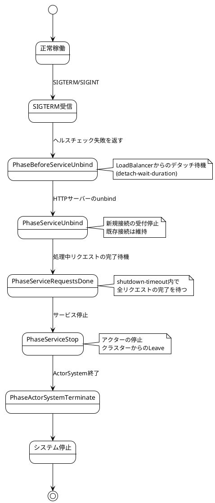
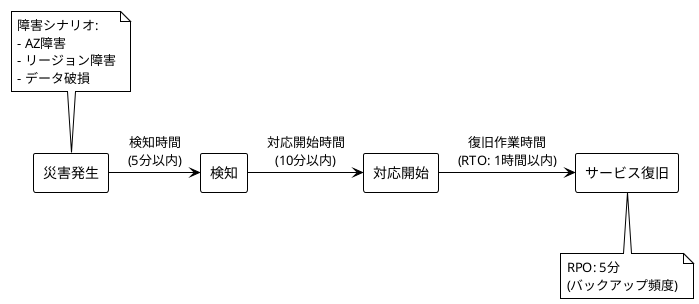

# 第10章：本番環境への準備

## 概要

本章では、Apache Pekkoベースのイベントソーシングシステムを本番環境にデプロイする際に考慮すべき重要な事項について説明します。セキュリティ、運用、AWSへのデプロイ戦略を解説します。

## 10.1 セキュリティ考慮事項

### 技術的背景

本番環境では、以下のセキュリティ要件を満たす必要があります：

- **認証・認可**: ユーザーの識別と権限管理
- **APIレート制限**: DDoS攻撃や過負荷の防止
- **入力バリデーション**: インジェクション攻撃の防御
- **暗号化**: 転送時（TLS）および保管時（暗号化ストレージ）のデータ保護
- **監査ログ**: セキュリティイベントの記録

### 実装の詳細

#### 認証・認可の実装

JWT（JSON Web Token）を使用した認証の実装例：

```scala
import pdi.jwt.{Jwt, JwtAlgorithm, JwtClaim}
import org.apache.pekko.http.scaladsl.server.Directives._
import org.apache.pekko.http.scaladsl.server.directives.Credentials
import scala.util.Success

case class User(id: String, email: String, roles: Set[String])

object JwtAuthenticator {
  private val secretKey = sys.env.getOrElse("JWT_SECRET_KEY", "default-secret-key")
  private val algorithm = JwtAlgorithm.HS256

  def authenticateToken(token: String): Option[User] = {
    Jwt.decode(token, secretKey, Seq(algorithm)) match {
      case Success(claim) =>
        // クレームからユーザー情報を抽出
        val content = claim.content
        // JSON パース処理（実際にはライブラリを使用）
        Some(User(
          id = extractFromJson(content, "userId"),
          email = extractFromJson(content, "email"),
          roles = extractRolesFromJson(content)
        ))
      case _ => None
    }
  }

  def generateToken(user: User): String = {
    val claim = JwtClaim(
      content = s"""{"userId":"${user.id}","email":"${user.email}","roles":${user.roles.mkString("[\"", "\",\"", "\"]")}}""",
      expiration = Some(System.currentTimeMillis() / 1000 + 3600) // 1時間有効
    )
    Jwt.encode(claim, secretKey, algorithm)
  }

  private def extractFromJson(json: String, key: String): String = {
    // 簡略化された実装（実際にはJSONライブラリを使用）
    // circe や play-json などを使用
    ""
  }

  private def extractRolesFromJson(json: String): Set[String] = {
    Set.empty // 実際の実装
  }
}
```

Pekko HTTPでの認証ディレクティブ：

```scala
import org.apache.pekko.http.scaladsl.server.Directive1
import org.apache.pekko.http.scaladsl.server.directives.Credentials

def authenticateUser: Directive1[User] = {
  optionalHeaderValueByName("Authorization").flatMap {
    case Some(token) if token.startsWith("Bearer ") =>
      val jwt = token.substring(7)
      JwtAuthenticator.authenticateToken(jwt) match {
        case Some(user) => provide(user)
        case None => reject(AuthorizationFailedRejection)
      }
    case _ => reject(AuthorizationFailedRejection)
  }
}

// 使用例
val routes = pathPrefix("api") {
  authenticateUser { user =>
    path("graphql") {
      post {
        // user情報を使用してGraphQLリクエストを処理
        graphQLRoutes.handleGraphQL(user)
      }
    }
  }
}
```

ロールベースアクセス制御（RBAC）：

```scala
def requireRole(requiredRole: String): Directive1[User] =
  authenticateUser.flatMap { user =>
    if (user.roles.contains(requiredRole)) {
      provide(user)
    } else {
      reject(AuthorizationFailedRejection)
    }
  }

// 使用例
val adminRoutes = pathPrefix("admin") {
  requireRole("admin") { user =>
    // 管理者のみアクセス可能なエンドポイント
    path("users") {
      get {
        complete(getAllUsers())
      }
    }
  }
}
```

#### APIレート制限の実装

Pekko HTTPでのレート制限：

```scala
import org.apache.pekko.http.scaladsl.server.Directive0
import org.apache.pekko.http.scaladsl.model.StatusCodes
import scala.collection.concurrent.TrieMap
import scala.concurrent.duration._
import java.time.Instant

class RateLimiter(maxRequests: Int, window: FiniteDuration) {
  private val requestCounts = TrieMap[String, (Instant, Int)]()

  def checkLimit(clientId: String): Boolean = {
    val now = Instant.now()
    val windowStart = now.minusMillis(window.toMillis)

    requestCounts.get(clientId) match {
      case Some((timestamp, count)) if timestamp.isAfter(windowStart) =>
        if (count >= maxRequests) {
          false // レート制限超過
        } else {
          requestCounts.update(clientId, (timestamp, count + 1))
          true
        }
      case _ =>
        // 新しいウィンドウを開始
        requestCounts.update(clientId, (now, 1))
        true
    }
  }

  // 定期的にクリーンアップ（古いエントリーを削除）
  def cleanup(): Unit = {
    val threshold = Instant.now().minusMillis(window.toMillis * 2)
    requestCounts.filterInPlace { case (_, (timestamp, _)) =>
      timestamp.isAfter(threshold)
    }
  }
}

// ディレクティブとして使用
def rateLimited(limiter: RateLimiter): Directive0 =
  extractClientIP.flatMap { remoteAddress =>
    val clientId = remoteAddress.toOption.map(_.getHostAddress).getOrElse("unknown")
    if (limiter.checkLimit(clientId)) {
      pass
    } else {
      complete(StatusCodes.TooManyRequests, "Rate limit exceeded")
    }
  }

// 使用例
val limiter = new RateLimiter(maxRequests = 100, window = 1.minute)

val routes = pathPrefix("api") {
  rateLimited(limiter) {
    path("graphql") {
      post {
        // GraphQLリクエスト処理
        ???
      }
    }
  }
}
```

#### 入力バリデーション強化

既存のバリデーションに加え、セキュリティ観点での追加チェック：

```scala
import io.github.j5ik2o.pcqrses.command.domain.users._
import zio.prelude.Validation

object SecurityValidator {
  // SQLインジェクション対策：特殊文字のチェック
  def validateNoSqlInjection(input: String): Validation[String, String] = {
    val dangerousPatterns = List("--", ";", "/*", "*/", "xp_", "sp_", "DROP", "INSERT", "DELETE", "UPDATE")
    val hasDangerousPattern = dangerousPatterns.exists(pattern =>
      input.toUpperCase.contains(pattern.toUpperCase)
    )

    if (hasDangerousPattern) {
      Validation.fail("Input contains potentially dangerous patterns")
    } else {
      Validation.succeed(input)
    }
  }

  // XSS対策：HTMLタグのエスケープ
  def sanitizeHtml(input: String): String = {
    input
      .replace("&", "&amp;")
      .replace("<", "&lt;")
      .replace(">", "&gt;")
      .replace("\"", "&quot;")
      .replace("'", "&#x27;")
      .replace("/", "&#x2F;")
  }

  // 長さ制限の強制
  def validateLength(input: String, maxLength: Int): Validation[String, String] = {
    if (input.length > maxLength) {
      Validation.fail(s"Input exceeds maximum length of $maxLength")
    } else {
      Validation.succeed(input)
    }
  }
}

// CreateUserAccountInputValidatorへの統合
object SecureCreateUserAccountInputValidator {
  def validate(input: CreateUserAccountInput): Validation[String, (UserAccountName, EmailAddress)] = {
    Validation.validateWith(
      // セキュリティバリデーションを追加
      SecurityValidator.validateLength(input.firstName, 50)
        .flatMap(SecurityValidator.validateNoSqlInjection)
        .flatMap(firstName => Validation.fromEither(
          FirstName.parseFromString(firstName).left.map(_.message)
        )),
      SecurityValidator.validateLength(input.lastName, 50)
        .flatMap(SecurityValidator.validateNoSqlInjection)
        .flatMap(lastName => Validation.fromEither(
          LastName.parseFromString(lastName).left.map(_.message)
        )),
      Validation.fromEither(
        EmailAddress.parseFromString(input.emailAddress).left.map(_.message)
      )
    )((firstName, lastName, emailAddress) =>
      (UserAccountName(firstName, lastName), emailAddress)
    )
  }
}
```

#### 暗号化の実装

TLS/SSL設定（application.conf）：

```hocon
pekko.http {
  server {
    # HTTPSの有効化
    ssl {
      enabled = true
      enabled = ${?HTTPS_ENABLED}

      # キーストアの設定
      keystore {
        path = "/etc/ssl/keystore.jks"
        path = ${?SSL_KEYSTORE_PATH}
        password = ${?SSL_KEYSTORE_PASSWORD}
      }

      # トラストストアの設定
      truststore {
        path = "/etc/ssl/truststore.jks"
        path = ${?SSL_TRUSTSTORE_PATH}
        password = ${?SSL_TRUSTSTORE_PASSWORD}
      }

      # TLSプロトコルの指定
      protocol = "TLSv1.3"
    }
  }
}
```

データベース接続のSSL化（pcqrses.conf）：

```hocon
pcqrses {
  database {
    url = "jdbc:postgresql://postgres:5432/p-cqrs-es_development?ssl=true&sslmode=require"
    properties {
      ssl = true
      sslmode = "require"
      # 証明書検証の設定
      sslrootcert = "/etc/ssl/certs/ca-certificates.crt"
    }
  }
}
```

DynamoDB通信の暗号化：

```hocon
j5ik2o.dynamo-db-journal {
  dynamo-db-client {
    # HTTPSエンドポイントを使用
    endpoint = "https://dynamodb.ap-northeast-1.amazonaws.com"
    endpoint = ${?J5IK2O_DYNAMO_DB_JOURNAL_DYNAMO_DB_CLIENT_ENDPOINT}

    # IAMロールベース認証（本番環境）
    use-default-credentials-provider = true
  }
}
```

### ベストプラクティス

- **シークレット管理**: AWS Secrets ManagerやHashiCorp Vaultを使用し、環境変数やコードにシークレットを含めない
- **最小権限の原則**: IAMロールやユーザーには必要最小限の権限のみを付与
- **定期的なセキュリティ監査**: 依存ライブラリの脆弱性スキャン（`sbt dependencyCheck`）
- **WAF（Web Application Firewall）**: AWS WAFやCloudflareでDDoS対策とボット保護
- **セキュリティヘッダー**: HSTS、CSP、X-Frame-Optionsなどのヘッダーを設定

## 10.2 運用上の考慮事項

### 技術的背景

本番環境の運用では、以下の要素が重要です：

- **デプロイ戦略**: ダウンタイムを最小化する段階的リリース
- **バックアップとリストア**: データ損失に備えた定期的なバックアップ
- **ディザスタリカバリ**: 障害時の復旧計画
- **スケーリング計画**: 負荷増加に対応するためのキャパシティプランニング

### 実装の詳細

#### デプロイ戦略

**Graceful Shutdownの実装**（apps/command-api/src/main/scala/io/github/j5ik2o/pcqrses/commandApi/MainActor.scala:121-163より）：

```scala
private def startManagementWithGracefulShutdown(
  context: scaladsl.ActorContext[Command],
  management: PekkoManagement,
  coordinatedShutdown: CoordinatedShutdown,
  lbConfig: LoadBalancerConfig
)(implicit
  executionContext: ExecutionContextExecutor,
  system: ActorSystem[?]
): Unit = {
  val managementFuture = management.start().map { uri =>
    context.log.info(s"Pekko Management started on $uri")

    coordinatedShutdown.addTask(
      CoordinatedShutdown.PhaseBeforeServiceUnbind,
      "management-loadbalancer-detach") { () =>
      for {
        _ <- Future {
          context.log.info(
            s"Starting graceful shutdown - waiting ${lbConfig.detachWaitDuration} for LoadBalancer detach")
        }
        _ <- pattern.after(lbConfig.detachWaitDuration) {
          Future {
            context.log.info("LoadBalancer detach wait completed")
          }
        }
        _ <- management.stop()
        _ <- Future {
          context.log.info("Pekko Management terminated")
        }
      } yield Done
    }
    Done
  }
  // ...
}
```

CoordinatedShutdownのフェーズ：



**Blue-Greenデプロイの実装**：

```bash
#!/bin/bash
# Blue-Green デプロイスクリプト

# 現在のアクティブ環境を取得
CURRENT=$(aws elbv2 describe-target-groups \
  --names production-tg \
  --query 'TargetGroups[0].TargetGroupArn' \
  --output text)

if [ "$CURRENT" = "blue-tg" ]; then
  ACTIVE="blue"
  INACTIVE="green"
else
  ACTIVE="green"
  INACTIVE="blue"
fi

echo "Current active: $ACTIVE"
echo "Deploying to: $INACTIVE"

# 新バージョンをINACTIVE環境にデプロイ
aws ecs update-service \
  --cluster production-cluster \
  --service ${INACTIVE}-service \
  --force-new-deployment

# ヘルスチェック待機
echo "Waiting for health check..."
aws elbv2 wait target-in-service \
  --target-group-arn ${INACTIVE}-tg

# スモークテスト実行
./smoke-test.sh ${INACTIVE}

if [ $? -eq 0 ]; then
  echo "Smoke test passed. Switching traffic..."

  # トラフィックを切り替え
  aws elbv2 modify-listener \
    --listener-arn production-listener \
    --default-actions Type=forward,TargetGroupArn=${INACTIVE}-tg

  echo "Deployment completed. New active: $INACTIVE"
else
  echo "Smoke test failed. Rollback..."
  exit 1
fi
```

**カナリアリリース**：

```yaml
# AWS App Mesh または Istio を使用したカナリアリリース設定
apiVersion: split.smi-spec.io/v1alpha1
kind: TrafficSplit
metadata:
  name: command-api-split
spec:
  service: command-api
  backends:
  - service: command-api-stable
    weight: 90  # 90%のトラフィックは安定版へ
  - service: command-api-canary
    weight: 10  # 10%のトラフィックはカナリア版へ
```

#### バックアップとリストア

**DynamoDBのバックアップ**：

```bash
#!/bin/bash
# DynamoDB自動バックアップスクリプト

TIMESTAMP=$(date +%Y%m%d-%H%M%S)
TABLE_NAME="Journal"
BACKUP_NAME="journal-backup-${TIMESTAMP}"

# Point-in-timeバックアップの作成
aws dynamodb create-backup \
  --table-name ${TABLE_NAME} \
  --backup-name ${BACKUP_NAME}

echo "Backup created: ${BACKUP_NAME}"

# 古いバックアップの削除（30日以上前）
RETENTION_DAYS=30
CUTOFF_DATE=$(date -d "-${RETENTION_DAYS} days" +%s)

aws dynamodb list-backups \
  --table-name ${TABLE_NAME} \
  --query "BackupSummaries[?BackupCreationDateTime<\`${CUTOFF_DATE}\`].BackupArn" \
  --output text | while read arn; do
    echo "Deleting old backup: $arn"
    aws dynamodb delete-backup --backup-arn $arn
  done
```

**PostgreSQLのバックアップ**：

```bash
#!/bin/bash
# PostgreSQL自動バックアップスクリプト

TIMESTAMP=$(date +%Y%m%d-%H%M%S)
DB_NAME="p-cqrs-es_production"
BACKUP_DIR="/backups/postgresql"
BACKUP_FILE="${BACKUP_DIR}/${DB_NAME}-${TIMESTAMP}.sql.gz"

# pg_dumpでバックアップ
pg_dump -h ${DB_HOST} -U ${DB_USER} -d ${DB_NAME} \
  --format=custom \
  --compress=9 \
  --file=${BACKUP_FILE}

# S3にアップロード
aws s3 cp ${BACKUP_FILE} s3://my-backups/postgresql/

# ローカルの古いバックアップを削除（7日以上前）
find ${BACKUP_DIR} -name "*.sql.gz" -mtime +7 -delete

echo "Backup completed: ${BACKUP_FILE}"
```

**リストア手順**：

```bash
#!/bin/bash
# PostgreSQLリストアスクリプト

BACKUP_FILE=$1
DB_NAME="p-cqrs-es_production"

if [ -z "$BACKUP_FILE" ]; then
  echo "Usage: $0 <backup-file>"
  exit 1
fi

# S3からダウンロード
aws s3 cp s3://my-backups/postgresql/${BACKUP_FILE} /tmp/${BACKUP_FILE}

# データベースを削除して再作成
psql -h ${DB_HOST} -U ${DB_USER} -c "DROP DATABASE IF EXISTS ${DB_NAME};"
psql -h ${DB_HOST} -U ${DB_USER} -c "CREATE DATABASE ${DB_NAME};"

# リストア
pg_restore -h ${DB_HOST} -U ${DB_USER} -d ${DB_NAME} /tmp/${BACKUP_FILE}

echo "Restore completed from: ${BACKUP_FILE}"
```

#### ディザスタリカバリ

**RPO（Recovery Point Objective）とRTO（Recovery Time Objective）の設定**：



**マルチリージョン構成**：

```hocon
# プライマリリージョン: ap-northeast-1 (東京)
# セカンダリリージョン: us-west-2 (オレゴン)

pcqrses {
  disaster-recovery {
    enabled = true
    enabled = ${?DR_ENABLED}

    primary-region = "ap-northeast-1"
    secondary-region = "us-west-2"

    # DynamoDB Global Tables
    dynamodb {
      use-global-tables = true
      replication-regions = ["ap-northeast-1", "us-west-2"]
    }

    # PostgreSQL レプリケーション
    postgresql {
      read-replica-endpoint = ${?DB_READ_REPLICA_ENDPOINT}
      failover-enabled = true
    }
  }
}
```

#### スケーリング計画

**オートスケーリング設定**（AWS ECS）：

```json
{
  "ServiceName": "command-api-service",
  "ScalableTargetAction": {
    "MinCapacity": 3,
    "MaxCapacity": 20
  },
  "TargetTrackingScalingPolicyConfiguration": {
    "TargetValue": 70.0,
    "PredefinedMetricSpecification": {
      "PredefinedMetricType": "ECSServiceAverageCPUUtilization"
    },
    "ScaleInCooldown": 300,
    "ScaleOutCooldown": 60
  }
}
```

**DynamoDBオートスケーリング**：

```bash
# テーブルのオートスケーリング設定
aws application-autoscaling register-scalable-target \
  --service-namespace dynamodb \
  --resource-id "table/Journal" \
  --scalable-dimension "dynamodb:table:ReadCapacityUnits" \
  --min-capacity 5 \
  --max-capacity 100

aws application-autoscaling put-scaling-policy \
  --service-namespace dynamodb \
  --resource-id "table/Journal" \
  --scalable-dimension "dynamodb:table:ReadCapacityUnits" \
  --policy-name "Journal-read-scaling-policy" \
  --policy-type "TargetTrackingScaling" \
  --target-tracking-scaling-policy-configuration file://scaling-config.json
```

### ベストプラクティス

- **Infrastructure as Code**: TerraformやCDKでインフラを管理
- **定期的なDRテスト**: 年に2回以上、実際にフェイルオーバーをテスト
- **監視とアラート**: CloudWatchやDatadogで異常を自動検知
- **ランブック**: 障害対応手順を文書化し、定期的に更新
- **段階的ロールアウト**: カナリアリリースやBlue-Greenデプロイで安全にリリース

## 10.3 AWSへのデプロイ

### 技術的背景

LocalStack環境から実際のAWSサービスへの移行では、以下の変更が必要です：

- **DynamoDB**: LocalStackからAWS DynamoDBへ
- **Lambda**: LocalStack LambdaからAWS Lambdaへ
- **PostgreSQL**: Docker PostgreSQLからAmazon RDSへ
- **ネットワーク**: VPC、サブネット、セキュリティグループの設定
- **IAM**: 最小権限の原則に基づくロール設定

### 実装の詳細

#### 環境変数による切り替え

LocalStackとAWSの切り替え（application.conf）：

```hocon
j5ik2o.dynamo-db-journal {
  table-name = "Journal"
  table-name = ${?J5IK2O_DYNAMO_DB_JOURNAL_TABLE_NAME}

  dynamo-db-client {
    # LocalStack（開発環境）
    endpoint = "http://localhost:4566"
    endpoint = ${?J5IK2O_DYNAMO_DB_JOURNAL_DYNAMO_DB_CLIENT_ENDPOINT}

    # AWS（本番環境）では環境変数を未設定にすることで、デフォルトのAWSエンドポイントを使用
    # access-key-idとsecret-access-keyは設定せず、IAMロールを使用
  }
}

pcqrses {
  database {
    # LocalStack（開発環境）
    url = "jdbc:postgresql://localhost:5432/p-cqrs-es_development"
    url = ${?DATABASE_URL}

    # AWS RDS（本番環境）の例
    # DATABASE_URL=jdbc:postgresql://mydb.123456789012.ap-northeast-1.rds.amazonaws.com:5432/p-cqrs-es_production

    user = "postgres"
    user = ${?DATABASE_USER}

    password = "postgres"
    password = ${?DATABASE_PASSWORD}
  }
}
```

本番環境用の環境変数設定：

```bash
# AWS本番環境
export J5IK2O_DYNAMO_DB_JOURNAL_TABLE_NAME="Journal-Production"
# エンドポイントを未設定にすることで、AWS DynamoDBを使用
unset J5IK2O_DYNAMO_DB_JOURNAL_DYNAMO_DB_CLIENT_ENDPOINT

export DATABASE_URL="jdbc:postgresql://prod-db.us-west-2.rds.amazonaws.com:5432/p-cqrs-es_production"
export DATABASE_USER="app_user"
export DATABASE_PASSWORD="${AWS_SECRETS_MANAGER_PASSWORD}"

export AWS_REGION="ap-northeast-1"
```

#### Lambda関数のデプロイ

LocalStackスクリプトの構造（scripts/deploy-lambda-localstack.sh:1-314より）を参考に、AWS用デプロイスクリプトを作成：

```bash
#!/bin/bash
# AWS Lambda デプロイスクリプト（本番環境用）

set -e

# 環境変数の設定
export AWS_REGION=ap-northeast-1
export SCALA_VERSION=3.6.2
export PROJECT_NAME=read-model-updater
FUNCTION_NAME="pcqrses-read-model-updater-production"
TABLE_NAME="Journal-Production"

echo "🚀 AWS Lambda デプロイを開始します..."

# プロジェクトルートに移動
cd "$(dirname "$0")/.."

echo "📦 read-model-updater をビルド中..."
sbt --batch "project readModelUpdater" assembly

ASSEMBLY_JAR_PATH="apps/${PROJECT_NAME}/target/scala-${SCALA_VERSION}/${PROJECT_NAME}-lambda.jar"

if [ ! -f "$ASSEMBLY_JAR_PATH" ]; then
    echo "❌ エラー: Assembly JAR が見つかりません"
    exit 1
fi

echo "✅ Assembly JAR が作成されました"

# DynamoDB ストリーム ARN を取得
echo "🔍 DynamoDB ストリーム ARN を取得中..."
STREAM_ARN=$(aws dynamodb describe-table \
    --table-name $TABLE_NAME \
    --query 'Table.LatestStreamArn' \
    --output text)

if [ "$STREAM_ARN" = "None" ] || [ -z "$STREAM_ARN" ]; then
    echo "❌ エラー: DynamoDB テーブルのストリームが見つかりません"
    exit 1
fi

echo "✅ ストリーム ARN: $STREAM_ARN"

# IAMロールの作成（既存の場合はスキップ）
ROLE_NAME="pcqrses-lambda-execution-role"
ROLE_ARN=$(aws iam get-role --role-name $ROLE_NAME --query 'Role.Arn' --output text 2>/dev/null || echo "")

if [ -z "$ROLE_ARN" ]; then
    echo "🔐 IAMロールを作成中..."
    ROLE_ARN=$(aws iam create-role \
        --role-name $ROLE_NAME \
        --assume-role-policy-document file://iam/lambda-trust-policy.json \
        --query 'Role.Arn' \
        --output text)

    # ポリシーのアタッチ
    aws iam attach-role-policy \
        --role-name $ROLE_NAME \
        --policy-arn arn:aws:iam::aws:policy/service-role/AWSLambdaBasicExecutionRole

    aws iam attach-role-policy \
        --role-name $ROLE_NAME \
        --policy-arn arn:aws:iam::aws:policy/AmazonDynamoDBReadOnlyAccess

    aws iam attach-role-policy \
        --role-name $ROLE_NAME \
        --policy-arn arn:aws:iam::aws:policy/AmazonRDSDataFullAccess

    echo "✅ IAMロールを作成しました: $ROLE_ARN"
    echo "⏳ ロールの伝播を待機中..."
    sleep 10
fi

# Lambda関数の存在確認
if aws lambda get-function --function-name $FUNCTION_NAME &>/dev/null; then
    echo "🔄 既存のLambda関数を更新中..."
    aws lambda update-function-code \
        --function-name $FUNCTION_NAME \
        --zip-file fileb://$ASSEMBLY_JAR_PATH
else
    echo "🆕 新しいLambda関数を作成中..."
    aws lambda create-function \
        --function-name $FUNCTION_NAME \
        --runtime java17 \
        --handler io.github.j5ik2o.pcqrses.readModelUpdater.LambdaHandler \
        --role $ROLE_ARN \
        --zip-file fileb://$ASSEMBLY_JAR_PATH \
        --timeout 300 \
        --memory-size 1024 \
        --environment Variables="{DATABASE_URL=${DATABASE_URL},DATABASE_USER=${DATABASE_USER},DATABASE_PASSWORD=${DATABASE_PASSWORD}}" \
        --vpc-config SubnetIds=${SUBNET_IDS},SecurityGroupIds=${SECURITY_GROUP_IDS}
fi

echo "✅ Lambda関数のデプロイが完了しました"

# イベントソースマッピングの作成
echo "🔗 イベントソースマッピングを作成中..."
aws lambda create-event-source-mapping \
    --function-name $FUNCTION_NAME \
    --event-source-arn $STREAM_ARN \
    --starting-position LATEST \
    --batch-size 100 \
    --maximum-batching-window-in-seconds 10 \
    --maximum-retry-attempts 3

echo "✅ デプロイが完了しました!"
```

#### Terraformによるインフラ構築

Terraform設定例：

```hcl
# main.tf
provider "aws" {
  region = "ap-northeast-1"
}

# VPC
resource "aws_vpc" "main" {
  cidr_block           = "10.0.0.0/16"
  enable_dns_hostnames = true
  enable_dns_support   = true

  tags = {
    Name = "pcqrses-vpc"
  }
}

# DynamoDB
resource "aws_dynamodb_table" "journal" {
  name           = "Journal-Production"
  billing_mode   = "PAY_PER_REQUEST"
  hash_key       = "persistence-id"
  range_key      = "sequence-nr"

  attribute {
    name = "persistence-id"
    type = "S"
  }

  attribute {
    name = "sequence-nr"
    type = "N"
  }

  stream_enabled   = true
  stream_view_type = "NEW_IMAGE"

  point_in_time_recovery {
    enabled = true
  }

  tags = {
    Name = "pcqrses-journal"
  }
}

# RDS PostgreSQL
resource "aws_db_instance" "postgres" {
  identifier        = "pcqrses-db"
  engine            = "postgres"
  engine_version    = "16.4"
  instance_class    = "db.t3.medium"
  allocated_storage = 100

  db_name  = "p_cqrs_es_production"
  username = "app_user"
  password = var.db_password

  vpc_security_group_ids = [aws_security_group.rds.id]
  db_subnet_group_name   = aws_db_subnet_group.main.name

  backup_retention_period = 7
  backup_window           = "03:00-04:00"
  maintenance_window      = "Mon:04:00-Mon:05:00"

  enabled_cloudwatch_logs_exports = ["postgresql", "upgrade"]

  tags = {
    Name = "pcqrses-postgres"
  }
}

# ECS Cluster
resource "aws_ecs_cluster" "main" {
  name = "pcqrses-cluster"

  setting {
    name  = "containerInsights"
    value = "enabled"
  }
}

# ECS Task Definition (Command API)
resource "aws_ecs_task_definition" "command_api" {
  family                   = "command-api"
  network_mode             = "awsvpc"
  requires_compatibilities = ["FARGATE"]
  cpu                      = "1024"
  memory                   = "2048"

  container_definitions = jsonencode([
    {
      name  = "command-api"
      image = "${var.ecr_repository_url}:latest"
      portMappings = [
        {
          containerPort = 18080
          protocol      = "tcp"
        }
      ]
      environment = [
        {
          name  = "COMMAND_API_SERVER_HOST"
          value = "0.0.0.0"
        },
        {
          name  = "COMMAND_API_SERVER_PORT"
          value = "18080"
        },
        {
          name  = "J5IK2O_DYNAMO_DB_JOURNAL_TABLE_NAME"
          value = aws_dynamodb_table.journal.name
        }
      ]
      logConfiguration = {
        logDriver = "awslogs"
        options = {
          "awslogs-group"         = "/ecs/command-api"
          "awslogs-region"        = "ap-northeast-1"
          "awslogs-stream-prefix" = "ecs"
        }
      }
    }
  ])
}
```

### ベストプラクティス

- **環境ごとの設定分離**: dev/staging/productionで設定を明確に分ける
- **IAMロールの最小権限**: 必要な権限のみを付与
- **VPC内でのデプロイ**: パブリックインターネットへの露出を最小化
- **シークレット管理**: AWS Secrets Managerでパスワードやキーを管理
- **モニタリング**: CloudWatch Logs, Metrics, Alarmsを設定
- **コスト最適化**: Reserved InstancesやSavings Plansを活用

## まとめ

本章では、Apache Pekkoベースのイベントソーシングシステムを本番環境にデプロイするための準備について解説しました：

1. **セキュリティ考慮事項**: 認証・認可、APIレート制限、入力バリデーション、暗号化の実装
2. **運用上の考慮事項**: Graceful Shutdown、Blue-Greenデプロイ、バックアップ/リストア、ディザスタリカバリ、オートスケーリング
3. **AWSへのデプロイ**: LocalStackからAWSへの移行、Lambda/DynamoDB/RDSの設定、Terraformによるインフラ管理

これらの実践により、高可用性かつセキュアで、長期的に運用可能なシステムを構築できます。次章では、本シリーズのまとめと発展的なトピックについて説明します。
