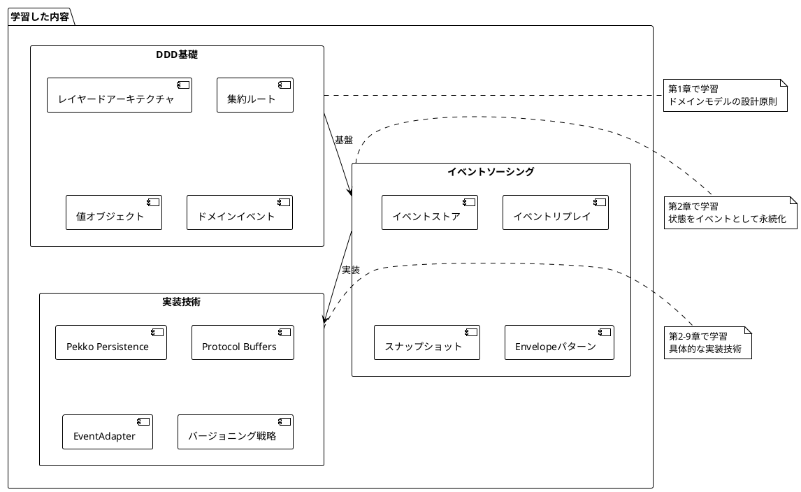
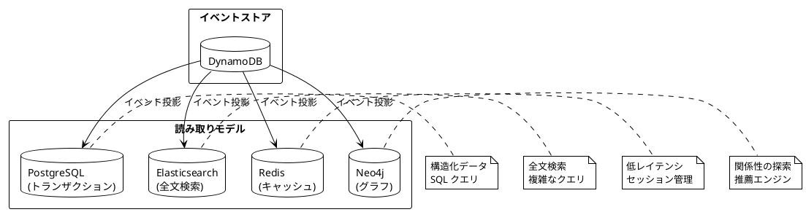

# 第11章：まとめと発展的なトピック

## 概要

本章では、これまでの学習内容を振り返り、Apache Pekkoを使用したCQRS/イベントソーシングシステム構築の要点を総括します。また、さらなる学習リソースと発展的なトピックについて紹介します。

## 11.1 この記事シリーズで学んだこと

### 第1部：環境構築編の振り返り

第1部では、LocalStackを使用した開発環境の構築方法を学びました：

- **アーキテクチャ概要**: CQRS/イベントソーシングの基本概念とシステム構成
- **技術スタック**: Scala 3、Apache Pekko、DynamoDB、PostgreSQL、GraphQL
- **LocalStack活用**: AWS サービスのローカルエミュレーション
- **E2Eテスト**: システム全体の動作確認手法

### 第2部：サービス構築編の振り返り

第2部では、実際のシステム実装について詳細に学びました：

#### ドメイン駆動設計とイベントソーシング（第1-2章）



**重要な学び**:
- イベントは不変であり、過去の履歴を完全に保持できる
- ドメインロジックとインフラストラクチャを適切に分離する
- `_V1`サフィックスによるバージョン管理で将来の変更に備える

#### コマンド側とクエリ側の実装（第3-4章）

**コマンド側（書き込みモデル）**:
- UserAccountAggregateによる状態管理
- PersistenceEffectorによるイベント永続化
- Registry Patternによるアクター管理（Local/Cluster）
- GraphQL Mutationによるコマンド受付

**クエリ側（読み取りモデル）**:
- Flywayによるスキーマ管理
- Slick DAOによるデータアクセス
- GraphQL Queryによる柔軟なデータ取得
- Read Model Updaterによる非同期更新

**重要な学び**:
- CQRSにより、書き込みと読み取りを独立してスケール可能
- 結果整合性（Eventual Consistency）の理解と実装
- 冪等性の重要性（同じイベントを複数回処理しても安全）

#### イベント処理と設定管理（第5-6章）

**イベント処理**:
- DynamoDB Streamsによるイベント配信
- Lambda関数による非同期処理
- エラーハンドリングとリトライ戦略

**設定管理**:
- Typesafe Configによる階層的設定
- 環境変数による柔軟な設定上書き
- シリアライゼーション戦略（Protocol Buffers + CBOR）

**重要な学び**:
- イベント駆動アーキテクチャによる疎結合
- 設定の外部化により、環境ごとの差異を吸収
- シリアライゼーションの選択が性能に直結

#### テストからデプロイまで（第7-10章）

**テスト戦略（第7章）**:
- テストピラミッド（単体60%、統合30%、E2E10%）
- ActorTestKitによるアクターテスト
- E2Eテストによる結果整合性の検証

**パフォーマンスとスケーラビリティ（第8章）**:
- Prometheus/Grafanaによるメトリクス収集
- Logbackによる構造化ログ
- Cluster Shardingによる水平スケーリング
- Graceful Shutdownによるゼロダウンタイムデプロイ

**実践的なトピック（第9章）**:
- イベントスキーマの進化とバージョニング
- GraphQL APIの改善（Validation型の活用）
- エラーハンドリングとレジリエンス（Supervision、Retry、Circuit Breaker）

**本番環境への準備（第10章）**:
- セキュリティ（認証・認可、レート制限、暗号化）
- 運用（バックアップ、ディザスタリカバリ、オートスケーリング）
- AWSデプロイ（LocalStackから本番環境への移行）

## 11.2 CQRS/イベントソーシングのベストプラクティス

### アーキテクチャ設計

1. **境界付けられたコンテキスト（Bounded Context）を明確にする**
   - コマンド側とクエリ側を独立したコンテキストとして扱う
   - それぞれ異なるデータモデルを持つことを恐れない

2. **イベントは業務用語で表現する**
   - `DataUpdated`ではなく`UserAccountRenamed`のように具体的に
   - ドメインエキスパートと共通言語（ユビキタス言語）を使用

3. **集約の粒度を適切に設定する**
   - 集約は小さく保つ（トランザクション境界を最小化）
   - 集約間の整合性は結果整合性で対応

### イベント設計

1. **イベントは過去形で命名する**
   - `CreateUserAccount`（コマンド）→ `UserAccountCreated`（イベント）
   - イベントは「起きたこと」を表現する

2. **最初からバージョニングを考慮する**
   - すべてのイベントに`_V1`サフィックスを付与
   - Protocol Buffersのフィールド番号は絶対に変更しない

3. **イベントには十分なコンテキスト情報を含める**
   - デバッグやトラブルシューティングのため、`occurredAt`や`entityId`は必須
   - ただし、個人情報など機密データの永続化には注意

### パフォーマンス最適化

1. **スナップショットを活用する**
   - イベント数が多い場合、リプレイ時間を短縮
   - 推奨: 1000イベントごとにスナップショット

2. **パッシベーションでメモリを節約**
   - アイドル状態のアクターは自動的に停止
   - 推奨: 2分間アイドル後にパッシベーション

3. **Cluster Shardingで負荷分散**
   - シャード数はノード数の10倍程度
   - リバランスは自動的に行われる

### 運用とモニタリング

1. **構造化ログとメトリクスを実装する**
   - JSON形式のログで検索しやすくする
   - Prometheus/Grafanaでメトリクスを可視化

2. **デッドレターを監視する**
   - 配信失敗メッセージはシステムの問題を示すシグナル
   - アラートを設定し、定期的にレビュー

3. **Graceful Shutdownを必ず実装する**
   - ロードバランサーとの協調によるゼロダウンタイムデプロイ
   - CoordinatedShutdownで段階的にシャットダウン

### セキュリティ

1. **認証・認可を適切に実装する**
   - JWTやOAuth 2.0を使用
   - ロールベースアクセス制御（RBAC）で権限管理

2. **入力バリデーションを徹底する**
   - API層とドメイン層の両方でバリデーション
   - SQLインジェクション、XSS攻撃への対策

3. **シークレットは環境変数で管理**
   - コードにパスワードやAPIキーを含めない
   - AWS Secrets ManagerやHashiCorp Vaultを活用

## 11.3 さらなる学習リソース

### 公式ドキュメント

**Apache Pekko**:
- 公式サイト: https://pekko.apache.org/
- ドキュメント: https://pekko.apache.org/docs/pekko/current/
- GitHub: https://github.com/apache/pekko

特に以下のセクションは必読：
- Typed Actors: https://pekko.apache.org/docs/pekko/current/typed/index.html
- Event Sourcing: https://pekko.apache.org/docs/pekko/current/typed/persistence.html
- Cluster Sharding: https://pekko.apache.org/docs/pekko/current/typed/cluster-sharding.html

**Scala**:
- 公式サイト: https://www.scala-lang.org/
- Scala 3 Book: https://docs.scala-lang.org/scala3/book/introduction.html

**ZIO**:
- 公式サイト: https://zio.dev/
- ZIO Prelude: https://zio.dev/zio-prelude/

### 書籍

1. **Domain-Driven Design: Tackling Complexity in the Heart of Software** (Eric Evans)
   - DDDの原典
   - 集約、境界付けられたコンテキスト、ユビキタス言語の理解に必須

2. **Implementing Domain-Driven Design** (Vaughn Vernon)
   - DDDの実践的な実装ガイド
   - イベントソーシング、CQRSの詳細な解説

3. **Reactive Design Patterns** (Roland Kuhn, Jamie Allen, Brian Hanafee)
   - リアクティブシステムの設計パターン
   - Akka/Pekkoのベストプラクティス

4. **Event Storming** (Alberto Brandolini)
   - イベントベースシステムの設計手法
   - ドメインエキスパートとの協働

5. **Building Event-Driven Microservices** (Adam Bellemare)
   - イベント駆動マイクロサービスの設計と実装
   - Kafka、イベントスキーマ、ストリーミング処理

### オンラインコース

1. **Lightbend Academy** (https://academy.lightbend.com/)
   - Akka/Pekko関連の無料コース
   - Reactive Architecture、Event Sourcing with Akkaなど

2. **Coursera - Functional Programming in Scala Specialization**
   - Martin Odersky（Scala作者）による講座
   - 関数型プログラミングの基礎から応用まで

3. **Pluralsight - Domain-Driven Design Path**
   - DDD関連の複数のコース
   - イベントソーシング、CQRSの実践的な実装

### コミュニティとカンファレンス

**コミュニティ**:
- Scala Users Group Japan: https://scala.connpass.com/
- Pekko Discord: Apache Pekko公式コミュニティ
- Reddit r/scala: https://www.reddit.com/r/scala/

**カンファレンス**:
- ScalaMatsuri（日本最大のScalaカンファレンス）
- Domain-Driven Design Europe
- Reactive Summit

### ブログとポッドキャスト

**推奨ブログ**:
- Martin Fowler's Blog (https://martinfowler.com/)
  - Event Sourcing、CQRSの権威的な解説
- Vaughn Vernon's Blog
  - DDD、イベントソーシングの実践的なアドバイス
- Lightbend Blog (https://www.lightbend.com/blog)
  - Akka/Pekko関連の最新情報

**ポッドキャスト**:
- The Scalawags Podcast
- Software Engineering Daily（イベントソーシング回など）

## 11.4 発展的なトピック

### さらに探求すべき領域

#### 1. Process Manager / Saga Pattern

複数の集約をまたがる長期実行トランザクションの管理：

```scala
// Sagaの例: ユーザー登録プロセス
sealed trait RegistrationSaga
object RegistrationSaga {
  case class Start(email: String, password: String) extends RegistrationSaga
  case class UserCreated(userId: String) extends RegistrationSaga
  case class EmailVerificationSent(userId: String) extends RegistrationSaga
  case class EmailVerified(userId: String) extends RegistrationSaga
  case class Completed(userId: String) extends RegistrationSaga

  // 補償トランザクション（ロールバック）
  case class Failed(reason: String, compensate: Boolean = true) extends RegistrationSaga
}
```

Pekko Persistenceを使用したSagaの実装：
```scala
object RegistrationSagaActor {
  def apply(sagaId: String): Behavior[Command] = {
    Behaviors.setup { context =>
      EventSourcedBehavior[Command, Event, State](
        persistenceId = PersistenceId.ofUniqueId(s"saga-$sagaId"),
        emptyState = State.Initial,
        commandHandler = (state, cmd) => state.handleCommand(cmd),
        eventHandler = (state, event) => state.applyEvent(event)
      )
    }
  }
}
```

#### 2. Event-Carried State Transfer

イベントに十分な情報を含めることで、購読者がイベントストアにアクセスせずに処理できるようにする：

```scala
// 従来のイベント（最小限の情報）
case class OrderPlaced_V1(orderId: String, occurredAt: Instant)

// Event-Carried State Transfer（状態を含む）
case class OrderPlaced_V2(
  orderId: String,
  customerId: String,
  items: List[OrderItem],
  totalAmount: BigDecimal,
  shippingAddress: Address,
  occurredAt: Instant
)
```

利点:
- 購読者が追加のクエリを発行する必要がない
- システム間の結合度を下げる

欠点:
- イベントサイズが大きくなる
- 機密情報の管理に注意が必要

#### 3. Polyglot Persistence

目的に応じて異なるデータベースを使用する：



#### 4. Micro Frontends

バックエンドだけでなく、フロントエンドもマイクロサービス化：

- 各Bounded ContextごとにUIチームを持つ
- Web Componentsによる統合
- Module Federationによる動的ローディング

#### 5. Serverless Event Sourcing

完全サーバーレスなイベントソーシングシステム：

```yaml
# AWS SAM テンプレート例
AWSTemplateFormatVersion: '2010-09-09'
Transform: AWS::Serverless-2016-10-31

Resources:
  # Lambda関数（コマンドハンドラー）
  CommandHandler:
    Type: AWS::Serverless::Function
    Properties:
      Runtime: java17
      Handler: io.github.j5ik2o.Handler
      Events:
        Api:
          Type: Api
          Properties:
            Path: /commands
            Method: POST

  # EventBridge（イベントバス）
  EventBus:
    Type: AWS::Events::EventBus
    Properties:
      Name: pcqrses-event-bus

  # Lambda関数（イベントプロセッサー）
  EventProcessor:
    Type: AWS::Serverless::Function
    Properties:
      Runtime: java17
      Handler: io.github.j5ik2o.Processor
      Events:
        EventRule:
          Type: EventBridgeRule
          Properties:
            EventBusName: !Ref EventBus
            Pattern:
              source:
                - pcqrses.commands
```

#### 6. GraphQL Subscriptions

リアルタイム通知のための GraphQL Subscriptions：

```graphql
type Subscription {
  userAccountCreated: UserAccount!
  userAccountUpdated(id: ID!): UserAccount!
}
```

実装にはWebSocketやServer-Sent Eventsを使用。

## 11.5 まとめ

このシリーズでは、Apache Pekkoを使用したCQRS/イベントソーシングシステムの構築について、環境構築から本番デプロイまで包括的に学びました。

**重要なポイント**:

1. **イベントソーシングは強力だが複雑**: 適用すべき場面を見極める
2. **CQRSは読み書きの独立スケールを可能にする**: トラフィック特性に応じて活用
3. **結果整合性の理解が不可欠**: ユーザー体験を損なわない設計
4. **運用を考慮した設計**: モニタリング、ログ、バックアップは最初から組み込む
5. **段階的な移行**: 一度にすべてを作り替えるのではなく、小さく始める

### 次のステップ

1. **このプロジェクトを拡張してみる**
   - 新しい集約を追加（例: Order、Product）
   - Sagaパターンを実装
   - 別の読み取りモデル（Elasticsearch）を追加

2. **本番環境にデプロイする**
   - AWSやGCPにデプロイ
   - 監視とアラートを設定
   - 実際のトラフィックで負荷テスト

3. **コミュニティに参加する**
   - GitHubでIssueを報告したりPRを送る
   - Scala/Pekkoのカンファレンスに参加
   - ブログやQiitaで学んだことを共有

4. **関連技術を深く学ぶ**
   - 関数型プログラミング（ZIO、Cats Effect）
   - 分散システム理論（CAP定理、分散トランザクション）
   - リアクティブシステム（Reactive Manifesto）

**最後に**:

CQRS/イベントソーシングは、適切に適用すれば非常に強力なアーキテクチャパターンです。しかし、すべてのシステムに適用すべきではありません。監査ログが重要、履歴の完全な追跡が必要、読み書きのスケールが大きく異なる、といった要件がある場合に検討してください。

このシリーズが、あなたのイベントソーシングの旅の良い出発点となれば幸いです。

Happy Event Sourcing! 🚀
