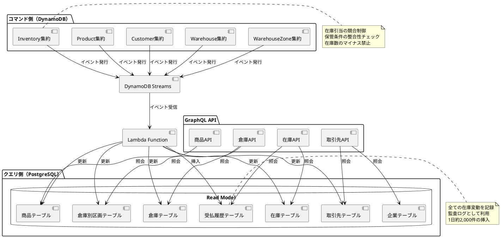
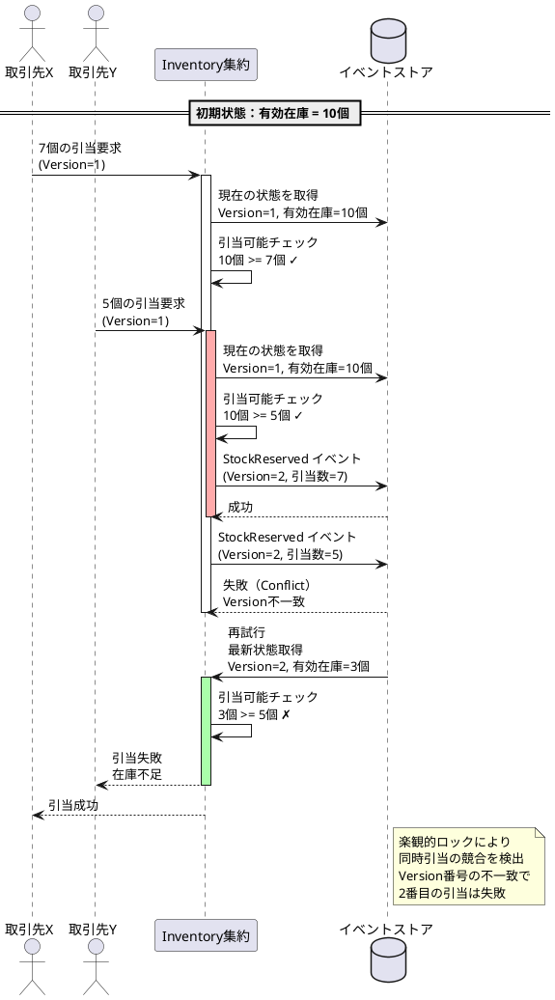
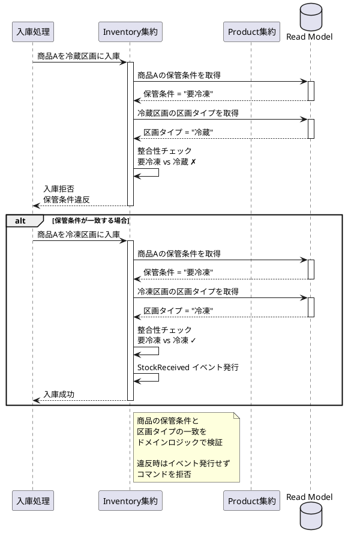

# 第3部 第1章：イントロダクション - 在庫管理サービスの要件定義

## 概要

第1部・第2部では、Apache PekkoとCQRS/イベントソーシングの基礎を学び、UserAccount集約を使った単一集約のシステムを構築しました。第3部では、これらの知識を実践的なビジネスユースケースに適用し、**卸売事業者D社の在庫管理サービス**を構築します。

本章では、在庫管理サービスの要件を明確にし、第3部で扱う技術的課題を整理します。

## 第1部・第2部の振り返り

### 学んだこと

**第1部：環境構築編**
- LocalStackを使用したローカル開発環境の構築
- DynamoDB（イベントストア）とPostgreSQL（Read Model）の連携
- Lambda関数によるRead Modelの自動更新
- GraphQL APIによる型安全なクエリ・ミューテーション

**第2部：サービス構築編**
- UserAccount集約による単一集約の実装
- Pekko Persistenceを使用したイベントソーシング
- Protocol Buffersによるイベントのシリアライゼーション
- Cluster Shardingによる水平スケーリング
- GraphQL APIの実装とバリデーション

### 第3部へのステップアップ

第2部のUserAccountは比較的シンプルな集約でした：
- **単一の集約**（UserAccount）
- **シンプルなコマンド**（作成、更新、削除）
- **集約間の連携なし**

第3部では、より複雑なビジネス要件に対応します：
- **複数の集約**（Product、Customer、Warehouse、WarehouseZone、Inventory）
- **集約間の連携**（在庫引当、区画選択、保管条件検証）
- **複雑なビジネスルール**（在庫のマイナス禁止、保管条件の整合性）
- **競合制御**（同時アクセスによる在庫引当の競合）

## 卸売事業者D社の概要

### 事業者プロフィール

**株式会社D商事**（仮称）は、食品・日用品を扱う卸売事業者です。

- **創業**：1985年
- **従業員数**：約250名
- **事業形態**：食品・日用品の卸売事業
- **年商**：約150億円（参考情報）

### 取り扱い商品

- **食品類**（60%）：加工食品、飲料、調味料、菓子類、生鮮食品
  - 常温保存：60%
  - 要冷蔵：30%
  - 要冷凍：10%
- **日用品**（40%）：洗剤、トイレタリー、雑貨
  - 常温保存：100%

### 物流拠点

**3つの主要倉庫**を保有し、各倉庫に温度管理区画を設けています：

1. **東京倉庫**（主力拠点）
   - 延べ床面積：5,000㎡
   - 在庫配分：全体の50%

2. **大阪倉庫**（西日本拠点）
   - 延べ床面積：3,500㎡
   - 在庫配分：全体の30%

3. **福岡倉庫**（九州拠点）
   - 延べ床面積：2,000㎡
   - 在庫配分：全体の20%

**各倉庫の区画構成**（全9区画）：
- 常温区画
- 冷蔵区画（5℃前後）
- 冷凍区画（-18℃以下）

### 主な取引先

約430社の取引先に商品を供給しています：

- **スーパーマーケットチェーン**：約50社
- **コンビニエンスストア**：約30社
- **飲食店・レストラン**：約200店舗
- **その他小売店**：約150店舗

### 業務規模

- **取り扱いSKU数**：約8,000品目
- **1日あたりの在庫受払件数**：約2,000件
  - 入庫、出庫、移動、調整などの在庫操作

## 1.1 ビジネス要件

在庫管理サービスに求められる機能を整理します。

### 基本機能

#### 商品管理
- 商品の登録・更新・廃止
- SKU（Stock Keeping Unit）の管理
- 商品カテゴリの分類（食品類、日用品）
- **保管条件の管理**（常温、冷蔵、冷凍）

#### 倉庫・区画管理
- 倉庫の登録・有効化・無効化
- 倉庫別区画の管理（常温区画、冷蔵区画、冷凍区画）
- 区画容量の管理
- 区画ごとの保管条件設定

#### 在庫管理
- **入庫**：新規商品の倉庫への受け入れ
- **出庫**：取引先への商品の払い出し
- **移動**：倉庫間・区画間の在庫移動
- **調整**：棚卸による在庫数の修正
- **在庫照会**：リアルタイムな在庫数の確認

#### 在庫引当と予約管理
- 在庫の引当（確保）
- 引当済み在庫の管理
- 引当解除（キャンセル時）
- 有効在庫数の計算（現在庫 - 引当済）

#### 監査ログ
- **受払履歴**：全ての在庫変動の完全な記録
  - いつ（日時）
  - 誰が（操作者）
  - どの商品を（商品ID）
  - どこで（倉庫ID、区画ID）
  - どのように（受払区分：入庫/出庫/移動/調整）
  - どれだけ（受払数量）

#### アラート機能
- 低在庫アラート（区画ごとの閾値設定）
- 在庫引当失敗の通知
- 保管条件違反の検出

### 業務フロー例

```
1. 商品入庫
   → 商品の保管条件を確認
   → 適切な区画を選択（常温/冷蔵/冷凍）
   → 在庫数を増加
   → 受払履歴に記録

2. 在庫引当
   → 有効在庫数を確認
   → 引当可能かチェック
   → 引当済数を増加
   → 有効在庫数を減少
   → 受払履歴に記録

3. 在庫移動
   → 移動元の在庫数を減少
   → 移動先の保管条件を検証
   → 移動先の在庫数を増加
   → 受払履歴に記録

4. 在庫照会
   → 区画別の在庫一覧を表示
   → 商品カテゴリ別の集計
   → 保管条件別の集計
```

## 1.2 システム要件

在庫管理システムに求められる非機能要件を整理します。

### 高い整合性要件

#### 在庫のマイナス禁止
在庫管理において最も重要な制約です：

- **現在庫数 ≥ 0** を常に保証
- **有効在庫数（現在庫 - 引当済）≥ 0** を保証
- 在庫引当時に有効在庫数をチェック
- 楽観的ロックによる競合制御

#### 保管条件の整合性
商品の保管条件と区画タイプの一致を保証：

```
商品の保管条件    区画タイプ      結果
─────────────────────────────────
常温              常温区画        ✓ OK
要冷蔵            冷蔵区画        ✓ OK
要冷凍            冷凍区画        ✓ OK
要冷蔵            常温区画        ✗ NG（保管条件違反）
要冷凍            冷蔵区画        ✗ NG（保管条件違反）
```

### リアルタイム在庫照会

- **即時性**：在庫変動を即座に反映
- **正確性**：受払履歴との整合性を保証
- **高速性**：大量データ（8,000品目）の高速な検索

### 高スループット対応

- **ピーク時の処理**：1日2,000件の受払処理
- **同時アクセス**：複数の取引先からの同時照会
- **スケーラビリティ**：3拠点の分散処理

### 複数チャネルからのアクセス

- **GraphQL API**：取引先システムからのAPI連携
- **管理画面**：D社の社員による在庫管理
- **モバイルアプリ**：倉庫作業員によるモバイル端末での入出庫

## 1.3 技術的課題

CQRS/イベントソーシングで在庫管理を実装する際の技術的課題を整理します。

### 在庫引当の競合制御

**課題**：
複数の取引先が同時に同じ商品の在庫を引き当てようとした場合、在庫がマイナスにならないようにする必要があります。

**シナリオ例**：
```
初期状態：商品Aの有効在庫 = 10個

時刻T1：取引先X が 7個の引当を要求
時刻T1：取引先Y が 5個の引当を要求
  ↓
両方を許可すると 12個の引当になり、在庫（10個）を超える
```

**解決策**：
- **楽観的ロック**：バージョン番号による競合検出
- **CASオペレーション**：Compare-And-Swap
- **リトライ戦略**：競合時の再試行

### 複数集約間の連携

**課題**：
在庫管理では複数の集約が連携して動作します。

**集約間の依存関係**：
```
Product集約
  ↓（保管条件）
Inventory集約 ← → WarehouseZone集約
  ↓（在庫数）     ↑（区画タイプ）
在庫引当           Warehouse集約
```

**解決策**：
- **イベント駆動**：集約間の疎結合
- **Read Modelの参照**：他集約の情報を取得
- **整合性チェック**：ドメインロジックでの検証

### イベントの順序保証

**課題**：
在庫の受払イベントは正しい順序で処理される必要があります。

**問題となるシナリオ**：
```
時刻T1：入庫イベント（+10個）
時刻T2：出庫イベント（-5個）

もしT2がT1より先に処理されると：
  初期在庫0個 → -5個（マイナス！）
  その後 +10個 → 5個（正しくは5個だが、一時的にマイナスになった）
```

**解決策**：
- **DynamoDB Streams**：同一集約IDでの順序保証
- **Sequence Number**：イベントの順序番号管理
- **冪等性**：重複イベントの検出

### 結果整合性とビジネス整合性のバランス

**課題**：
CQRS/イベントソーシングでは、コマンド側とクエリ側で一時的に整合性が取れない期間があります。

```
コマンド側（DynamoDB）
  ↓ イベント発行
  ↓ DynamoDB Streams
  ↓ Lambda処理（数秒の遅延）
  ↓
クエリ側（PostgreSQL）
```

**ビジネスへの影響**：
- 在庫照会時に最新の在庫数が反映されていない可能性
- 在庫引当の判定に影響する可能性

**解決策**：
- **イベント処理の高速化**：Lambda関数の最適化
- **ユーザーへの明示**：「処理中」ステータスの表示
- **重要な操作はコマンド側で検証**：在庫引当はイベントソース側で判定

### 大量データの効率的な処理

**課題**：
- **商品数**：約8,000品目
- **取引先数**：約430社
- **受払履歴**：1日約2,000件（年間約73万件）

**解決策**：
- **インデックス戦略**：適切なデータベースインデックス
- **キャッシング**：頻繁にアクセスされるデータのキャッシュ
- **バッチ処理**：集計レポートのバッチ実行
- **パーティショニング**：受払履歴のテーブルパーティション

## 第3部で学ぶこと

本ケーススタディを通じて、以下の実践的なスキルを習得します：

### 1. 複数集約の設計と実装

5つの集約を設計・実装します：
- **Product集約**：商品マスタ
- **Customer集約**：取引先管理
- **Warehouse集約**：倉庫管理
- **WarehouseZone集約**：倉庫別区画管理
- **Inventory集約**：在庫管理（中核）

### 2. イベントソーシングとCRUD管理のハイブリッド

- **企業マスタ**：CRUD管理（静的データ）
- **在庫・取引先**：イベントソーシング（動的データ）
- 両者を組み合わせた効率的な設計

### 3. 在庫引当の競合制御

- 楽観的ロックの実装
- CASオペレーションによる競合検出
- リトライ戦略

### 4. 保管条件の整合性管理

- 商品の保管条件と区画タイプの検証
- ドメインロジックでの整合性チェック
- イベントによる違反検出

### 5. 受払履歴による完全な監査ログ

- 全ての在庫変動の記録
- 区画情報を含む詳細履歴
- 監査レポートの生成

### 6. 複雑なRead Modelの設計

- 区画別在庫サマリー
- カテゴリ別・保管条件別の集計
- マテリアライズドビューの活用

### 7. 実業務規模のデータ処理

- 商品8,000品目
- 取引先430社
- 1日2,000件の受払処理
- 3拠点・9区画の分散環境

## PlantUML図：システム全体像



## PlantUML図：在庫引当の競合制御



## PlantUML図：保管条件の整合性チェック



## PlantUML図：受払履歴による監査ログ

```plantuml
@startuml
database "受払履歴テーブル" as TransactionTable {
  受払ID
  商品ID
  倉庫ID
  区画ID
  受払区分
  受払数量
  受払日時
  操作者
}

actor "監査担当者" as Auditor

Auditor -> TransactionTable : 商品Aの受払履歴を照会
activate TransactionTable

TransactionTable --> Auditor : 受払履歴一覧

note right
  2025-01-15 09:00 入庫 +100個 東京/冷蔵 操作者:田中
  2025-01-15 10:30 出庫 -20個  東京/冷蔵 操作者:佐藤
  2025-01-15 14:00 移動 -30個  東京/冷蔵 操作者:鈴木
  2025-01-15 14:00 移動 +30個  大阪/冷蔵 操作者:鈴木
  2025-01-16 11:00 調整 -2個   東京/冷蔵 操作者:高橋（棚卸）
  現在庫: 48個（100 - 20 - 30 - 2）
end note

deactivate TransactionTable

Auditor -> TransactionTable : 区画別受払集計レポート
activate TransactionTable

TransactionTable -> TransactionTable : 集計処理\nGROUP BY 倉庫ID, 区画ID, 受払区分

TransactionTable --> Auditor : 集計結果

note right
  東京/常温: 入庫 500個, 出庫 350個
  東京/冷蔵: 入庫 200個, 出庫 150個
  東京/冷凍: 入庫 100個, 出庫  80個
  大阪/常温: 入庫 300個, 出庫 250個
  ...
end note

deactivate TransactionTable

note left of TransactionTable
  全ての在庫変動を記録
  いつ、誰が、どの商品を
  どこで、どのように、どれだけ

  監査証跡として不可欠
  在庫差異の原因分析に活用
end note
@enduml
```

## まとめ

第3部では、卸売事業者D社の在庫管理サービスを題材に、実践的なCQRS/イベントソーシングシステムを構築します。

**重要なポイント**：
- **複数集約**の設計と実装
- **在庫引当の競合制御**（楽観的ロック）
- **保管条件の整合性管理**
- **受払履歴**による完全な監査ログ
- **実業務規模**のデータ処理（商品8,000、取引先430社、1日2,000件）

次章では、在庫管理に必要なデータモデル（PostgreSQLスキーマ）の設計を行います。

## 参考：注文管理について

本ケーススタディでは**在庫管理に焦点を当てる**ため、注文管理（Order集約）と金額情報は今回のスコープ外としています。

ただし、実際の業務では注文管理も重要な要素です。発展的なトピックとして、以下を学習できます：

- **Order集約**：注文の作成、確認、キャンセル
- **Sagaパターン**：注文処理の分散トランザクション
- **与信管理**：取引先の与信限度額チェック
- **金額計算**：商品価格、合計金額、消費税

これらは第3部の後半（第6章、第13章）で参考情報として扱います。
