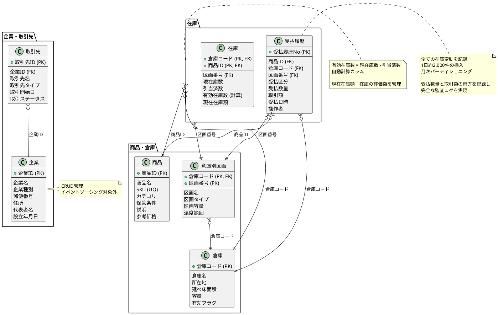
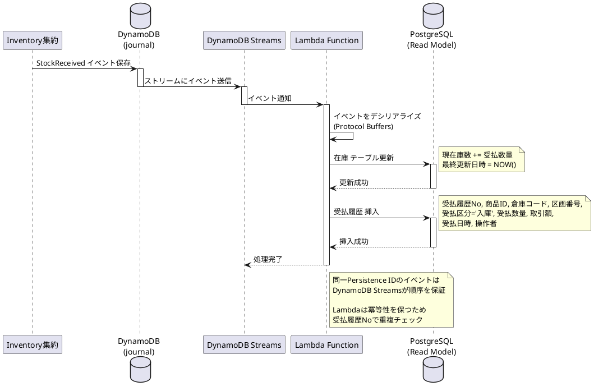
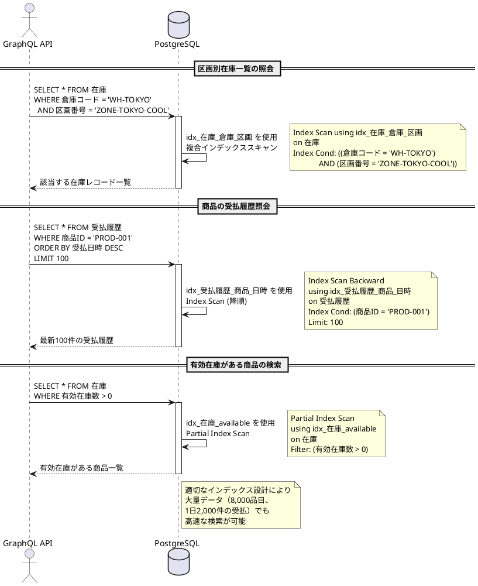

# 第3部 第2章：データモデルの設計

## 概要

本章では、在庫管理サービスのデータモデルを設計します。CQRS/イベントソーシングアーキテクチャでは、**コマンド側（DynamoDB）** と **クエリ側（PostgreSQL）** で異なるデータモデルを使用します。

**設計のポイント**：
- **日本語カラム名**：業務ドメインに即した理解しやすいスキーマ
- **正規化と非正規化**：Read Modelでは検索性能を優先
- **インデックス戦略**：大量データの高速検索
- **パーティショニング**：受払履歴の効率的な管理

## 2.1 Read Model（PostgreSQL）のスキーマ設計

クエリ側のRead Modelは、検索・集計を高速に行うために最適化します。

### 企業テーブル（企業）

企業情報を管理します。**イベントソーシングの対象外**で、直接CRUD操作で管理します。

```sql
CREATE TABLE 企業 (
    企業ID VARCHAR(50) PRIMARY KEY,
    企業名 VARCHAR(200) NOT NULL,
    企業種別 VARCHAR(20) NOT NULL,  -- '自社' または '取引先企業'
    郵便番号 VARCHAR(10),
    住所 VARCHAR(500),
    電話番号 VARCHAR(20),
    FAX番号 VARCHAR(20),
    代表者名 VARCHAR(100),
    設立年月日 DATE,
    資本金 BIGINT,
    従業員数 INTEGER,
    作成日時 TIMESTAMP NOT NULL DEFAULT CURRENT_TIMESTAMP,
    更新日時 TIMESTAMP NOT NULL DEFAULT CURRENT_TIMESTAMP,

    CONSTRAINT chk_企業種別 CHECK (企業種別 IN ('自社', '取引先企業'))
);

COMMENT ON TABLE 企業 IS '企業マスタ（自社およ取引先企業）';
COMMENT ON COLUMN 企業.企業ID IS '企業の一意識別子';
COMMENT ON COLUMN 企業.企業種別 IS '自社 or 取引先企業';

-- インデックス
CREATE INDEX idx_企業_企業種別 ON 企業(企業種別);
CREATE INDEX idx_企業_企業名 ON 企業(企業名);
```

**データ例**：
```sql
INSERT INTO 企業 VALUES
('COMPANY-001', '株式会社D商事', '自社', '100-0001',
 '東京都千代田区千代田1-1', '03-1234-5678', '03-1234-5679',
 '山田太郎', '1985-04-01', 100000000, 250, CURRENT_TIMESTAMP, CURRENT_TIMESTAMP);
```

### 商品テーブル（商品）

約8,000品目の商品マスタを管理します。

```sql
CREATE TABLE 商品 (
    商品ID VARCHAR(50) PRIMARY KEY,
    商品名 VARCHAR(200) NOT NULL,
    商品名カナ VARCHAR(200),
    SKU VARCHAR(50) UNIQUE NOT NULL,
    カテゴリ VARCHAR(50) NOT NULL,  -- '食品類' または '日用品'
    保管条件 VARCHAR(20) NOT NULL,  -- '常温', '冷蔵', '冷凍'
    説明 TEXT,
    単位 VARCHAR(10),               -- '個', 'kg', 'L' など
    参考価格 DECIMAL(10, 2),        -- ※参考情報（今回のスコープでは使用しない）
    ステータス VARCHAR(20) NOT NULL DEFAULT '有効',  -- '有効', '廃止'
    作成日時 TIMESTAMP NOT NULL DEFAULT CURRENT_TIMESTAMP,
    更新日時 TIMESTAMP NOT NULL DEFAULT CURRENT_TIMESTAMP,

    CONSTRAINT chk_カテゴリ CHECK (カテゴリ IN ('食品類', '日用品')),
    CONSTRAINT chk_保管条件 CHECK (保管条件 IN ('常温', '冷蔵', '冷凍')),
    CONSTRAINT chk_ステータス CHECK (ステータス IN ('有効', '廃止'))
);

COMMENT ON TABLE 商品 IS '商品マスタ（約8,000品目）';
COMMENT ON COLUMN 商品.商品ID IS '商品の一意識別子';
COMMENT ON COLUMN 商品.SKU IS 'Stock Keeping Unit（在庫管理単位）';
COMMENT ON COLUMN 商品.保管条件 IS '常温、冷蔵、冷凍のいずれか';
COMMENT ON COLUMN 商品.参考価格 IS '参考情報として保持（今回のスコープでは使用しない）';

-- インデックス
CREATE INDEX idx_商品_カテゴリ ON 商品(カテゴリ);
CREATE INDEX idx_商品_保管条件 ON 商品(保管条件);
CREATE INDEX idx_商品_ステータス ON 商品(ステータス);
CREATE INDEX idx_商品_商品名 ON 商品(商品名);
CREATE INDEX idx_商品_商品名カナ ON 商品(商品名カナ);

-- 複合インデックス
CREATE INDEX idx_商品_カテゴリ_保管条件 ON 商品(カテゴリ, 保管条件);
```

**データ例**：
```sql
INSERT INTO 商品 VALUES
('PROD-001', 'りんごジュース', 'リンゴジュース', 'SKU-JUICE-001',
 '食品類', '冷蔵', 'ストレート果汁100%', 'L', 150.00, '有効',
 CURRENT_TIMESTAMP, CURRENT_TIMESTAMP),
('PROD-002', '冷凍餃子', 'レイトウギョウザ', 'SKU-FROZEN-001',
 '食品類', '冷凍', '手作り餃子12個入', '個', 300.00, '有効',
 CURRENT_TIMESTAMP, CURRENT_TIMESTAMP);
```

### 取引先テーブル（取引先）

約430社の取引先を管理します。

```sql
CREATE TABLE 取引先 (
    取引先ID VARCHAR(50) PRIMARY KEY,
    企業ID VARCHAR(50) NOT NULL,
    取引先名 VARCHAR(200) NOT NULL,
    取引先タイプ VARCHAR(50) NOT NULL,  -- 'スーパー', 'コンビニ', '飲食店', '小売店'
    郵便番号 VARCHAR(10),
    住所 VARCHAR(500),
    電話番号 VARCHAR(20),
    FAX番号 VARCHAR(20),
    担当者名 VARCHAR(100),
    メールアドレス VARCHAR(200),
    取引開始日 DATE NOT NULL,
    取引ステータス VARCHAR(20) NOT NULL DEFAULT '有効',  -- '有効', '停止', '解約'
    参考与信限度額 DECIMAL(15, 2),      -- ※参考情報（今回のスコープでは使用しない）
    参考支払条件 VARCHAR(100),          -- ※参考情報（今回のスコープでは使用しない）
    作成日時 TIMESTAMP NOT NULL DEFAULT CURRENT_TIMESTAMP,
    更新日時 TIMESTAMP NOT NULL DEFAULT CURRENT_TIMESTAMP,

    CONSTRAINT fk_取引先_企業ID FOREIGN KEY (企業ID) REFERENCES 企業(企業ID),
    CONSTRAINT chk_取引先タイプ CHECK (取引先タイプ IN ('スーパー', 'コンビニ', '飲食店', '小売店')),
    CONSTRAINT chk_取引ステータス CHECK (取引ステータス IN ('有効', '停止', '解約'))
);

COMMENT ON TABLE 取引先 IS '取引先マスタ（約430社）';
COMMENT ON COLUMN 取引先.企業ID IS '企業テーブルの外部キー';
COMMENT ON COLUMN 取引先.参考与信限度額 IS '参考情報として保持（今回のスコープでは使用しない）';
COMMENT ON COLUMN 取引先.参考支払条件 IS '参考情報として保持（今回のスコープでは使用しない）';

-- インデックス
CREATE INDEX idx_取引先_企業ID ON 取引先(企業ID);
CREATE INDEX idx_取引先_取引先タイプ ON 取引先(取引先タイプ);
CREATE INDEX idx_取引先_取引ステータス ON 取引先(取引ステータス);
CREATE INDEX idx_取引先_取引先名 ON 取引先(取引先名);

-- 複合インデックス
CREATE INDEX idx_取引先_タイプ_ステータス ON 取引先(取引先タイプ, 取引ステータス);
```

**データ例**：
```sql
INSERT INTO 取引先 VALUES
('CUST-001', 'COMPANY-101', '○○スーパー本店', 'スーパー',
 '150-0001', '東京都渋谷区神宮前1-1-1', '03-2345-6789', NULL,
 '田中一郎', 'tanaka@example.com', '2020-01-01', '有効',
 50000000.00, '月末締め翌月末払い', CURRENT_TIMESTAMP, CURRENT_TIMESTAMP);
```

### 倉庫テーブル（倉庫）

3拠点の倉庫を管理します。

```sql
CREATE TABLE 倉庫 (
    倉庫コード VARCHAR(50) PRIMARY KEY,
    倉庫名 VARCHAR(200) NOT NULL,
    郵便番号 VARCHAR(10),
    所在地 VARCHAR(500) NOT NULL,
    電話番号 VARCHAR(20),
    延べ床面積 DECIMAL(10, 2),        -- 単位：㎡
    容量 DECIMAL(15, 2),              -- 単位：㎥
    責任者名 VARCHAR(100),
    有効フラグ BOOLEAN NOT NULL DEFAULT TRUE,
    作成日時 TIMESTAMP NOT NULL DEFAULT CURRENT_TIMESTAMP,
    更新日時 TIMESTAMP NOT NULL DEFAULT CURRENT_TIMESTAMP
);

COMMENT ON TABLE 倉庫 IS '倉庫マスタ（3拠点：東京、大阪、福岡）';
COMMENT ON COLUMN 倉庫.倉庫コード IS '倉庫の一意識別子';
COMMENT ON COLUMN 倉庫.延べ床面積 IS '単位：㎡';
COMMENT ON COLUMN 倉庫.容量 IS '単位：㎥';

-- インデックス
CREATE INDEX idx_倉庫_有効フラグ ON 倉庫(有効フラグ);
CREATE INDEX idx_倉庫_倉庫名 ON 倉庫(倉庫名);
```

**データ例**：
```sql
INSERT INTO 倉庫 VALUES
('WH-TOKYO', '東京倉庫', '135-0001', '東京都江東区豊洲1-1-1',
 '03-3456-7890', 5000.00, 25000.00, '鈴木次郎', TRUE,
 CURRENT_TIMESTAMP, CURRENT_TIMESTAMP),
('WH-OSAKA', '大阪倉庫', '550-0001', '大阪府大阪市西区土佐堀1-1-1',
 '06-1234-5678', 3500.00, 17500.00, '佐藤三郎', TRUE,
 CURRENT_TIMESTAMP, CURRENT_TIMESTAMP),
('WH-FUKUOKA', '福岡倉庫', '812-0001', '福岡県福岡市博多区博多駅前1-1-1',
 '092-123-4567', 2000.00, 10000.00, '高橋四郎', TRUE,
 CURRENT_TIMESTAMP, CURRENT_TIMESTAMP);
```

### 倉庫別区画テーブル（倉庫別区画）

各倉庫に3区画（常温、冷蔵、冷凍）、全9区画を管理します。

```sql
CREATE TABLE 倉庫別区画 (
    倉庫コード VARCHAR(50) NOT NULL,
    区画番号 VARCHAR(50) NOT NULL,
    区画名 VARCHAR(200) NOT NULL,
    区画タイプ VARCHAR(20) NOT NULL,    -- '常温', '冷蔵', '冷凍'
    区画容量 DECIMAL(15, 2),            -- 単位：㎥
    温度範囲下限 DECIMAL(5, 2),         -- 単位：℃
    温度範囲上限 DECIMAL(5, 2),         -- 単位：℃
    有効フラグ BOOLEAN NOT NULL DEFAULT TRUE,
    作成日時 TIMESTAMP NOT NULL DEFAULT CURRENT_TIMESTAMP,
    更新日時 TIMESTAMP NOT NULL DEFAULT CURRENT_TIMESTAMP,

    CONSTRAINT pk_倉庫別区画 PRIMARY KEY (倉庫コード, 区画番号),
    CONSTRAINT fk_倉庫別区画_倉庫コード FOREIGN KEY (倉庫コード) REFERENCES 倉庫(倉庫コード),
    CONSTRAINT chk_区画タイプ CHECK (区画タイプ IN ('常温', '冷蔵', '冷凍')),
    CONSTRAINT uq_倉庫_区画タイプ UNIQUE (倉庫コード, 区画タイプ)
);

COMMENT ON TABLE 倉庫別区画 IS '倉庫別区画マスタ（全9区画）';
COMMENT ON COLUMN 倉庫別区画.区画番号 IS '区画の一意識別子';
COMMENT ON COLUMN 倉庫別区画.区画タイプ IS '常温、冷蔵、冷凍のいずれか';
COMMENT ON COLUMN 倉庫別区画.区画容量 IS '単位：㎥';
COMMENT ON COLUMN 倉庫別区画.温度範囲下限 IS '単位：℃';

-- インデックス
CREATE INDEX idx_倉庫別区画_倉庫コード ON 倉庫別区画(倉庫コード);
CREATE INDEX idx_倉庫別区画_区画タイプ ON 倉庫別区画(区画タイプ);
CREATE INDEX idx_倉庫別区画_有効フラグ ON 倉庫別区画(有効フラグ);

-- 複合インデックス
CREATE INDEX idx_倉庫別区画_倉庫_タイプ ON 倉庫別区画(倉庫コード, 区画タイプ);
```

**データ例**：
```sql
INSERT INTO 倉庫別区画 VALUES
('ZONE-TOKYO-NORMAL', 'WH-TOKYO', '東京倉庫 常温区画', '常温',
 12000.00, 15.00, 25.00, TRUE, CURRENT_TIMESTAMP, CURRENT_TIMESTAMP),
('ZONE-TOKYO-COOL', 'WH-TOKYO', '東京倉庫 冷蔵区画', '冷蔵',
 8000.00, 0.00, 10.00, TRUE, CURRENT_TIMESTAMP, CURRENT_TIMESTAMP),
('ZONE-TOKYO-FROZEN', 'WH-TOKYO', '東京倉庫 冷凍区画', '冷凍',
 5000.00, -25.00, -15.00, TRUE, CURRENT_TIMESTAMP, CURRENT_TIMESTAMP);
```

### 在庫テーブル（在庫）

商品・倉庫・区画ごとの在庫数を管理します。

```sql
CREATE TABLE 在庫 (
    倉庫コード VARCHAR(50) NOT NULL,
    商品ID VARCHAR(50) NOT NULL,
    区画番号 VARCHAR(50) NOT NULL,
    現在庫数 INTEGER NOT NULL DEFAULT 0,
    引当済数 INTEGER NOT NULL DEFAULT 0,
    有効在庫数 INTEGER GENERATED ALWAYS AS (現在庫数 - 引当済数) STORED,
    現在在庫額 DECIMAL(15, 2) NOT NULL DEFAULT 0,
    最終更新日時 TIMESTAMP NOT NULL DEFAULT CURRENT_TIMESTAMP,

    CONSTRAINT pk_在庫 PRIMARY KEY (倉庫コード, 商品ID),
    CONSTRAINT fk_在庫_商品ID FOREIGN KEY (商品ID) REFERENCES 商品(商品ID),
    CONSTRAINT fk_在庫_倉庫コード FOREIGN KEY (倉庫コード) REFERENCES 倉庫(倉庫コード),
    CONSTRAINT fk_在庫_倉庫別区画 FOREIGN KEY (倉庫コード, 区画番号) REFERENCES 倉庫別区画(倉庫コード, 区画番号),
    CONSTRAINT chk_現在庫数 CHECK (現在庫数 >= 0),
    CONSTRAINT chk_引当済数 CHECK (引当済数 >= 0),
    CONSTRAINT chk_引当済数_上限 CHECK (引当済数 <= 現在庫数),
    CONSTRAINT chk_現在在庫額 CHECK (現在在庫額 >= 0)
);

COMMENT ON TABLE 在庫 IS '在庫テーブル（商品・倉庫・区画ごとの在庫数）';
COMMENT ON COLUMN 在庫.現在庫数 IS '物理的な在庫数';
COMMENT ON COLUMN 在庫.引当済数 IS '引当済みの数量';
COMMENT ON COLUMN 在庫.有効在庫数 IS '引当可能な数量（自動計算）';
COMMENT ON COLUMN 在庫.現在在庫額 IS '現在在庫の評価額（単位：円）';

-- インデックス
CREATE INDEX idx_在庫_商品ID ON 在庫(商品ID);
CREATE INDEX idx_在庫_倉庫コード ON 在庫(倉庫コード);
CREATE INDEX idx_在庫_区画番号 ON 在庫(区画番号);
CREATE INDEX idx_在庫_有効在庫数 ON 在庫(有効在庫数);

-- 複合インデックス
CREATE INDEX idx_在庫_商品_倉庫 ON 在庫(商品ID, 倉庫コード);
CREATE INDEX idx_在庫_倉庫_区画 ON 在庫(倉庫コード, 区画番号);
```

**データ例**：
```sql
INSERT INTO 在庫 (倉庫コード, 商品ID, 区画番号, 現在庫数, 引当済数, 現在在庫額) VALUES
('WH-TOKYO', 'PROD-001', 'ZONE-TOKYO-COOL', 500, 50, 75000.00),
('WH-TOKYO', 'PROD-002', 'ZONE-TOKYO-FROZEN', 300, 30, 90000.00);
-- 有効在庫数は自動計算される（500-50=450, 300-30=270）
```

### 受払履歴テーブル（受払履歴）

全ての在庫変動を記録します。**1日約2,000件**のデータが挿入されます。

```sql
CREATE TABLE 受払履歴 (
    受払履歴No VARCHAR(50) PRIMARY KEY,
    商品ID VARCHAR(50) NOT NULL,
    倉庫コード VARCHAR(50) NOT NULL,
    区画番号 VARCHAR(50) NOT NULL,
    受払区分 VARCHAR(20) NOT NULL,      -- '入庫', '出庫', '移動', '調整'
    受払数量 INTEGER NOT NULL,
    取引額 DECIMAL(15, 2) NOT NULL,
    受払後在庫数 INTEGER NOT NULL,
    受払日時 TIMESTAMP NOT NULL DEFAULT CURRENT_TIMESTAMP,
    操作者 VARCHAR(100),
    備考 TEXT,

    -- 移動の場合の移動先情報
    移動先倉庫コード VARCHAR(50),
    移動先区画番号 VARCHAR(50),

    CONSTRAINT fk_受払履歴_商品ID FOREIGN KEY (商品ID) REFERENCES 商品(商品ID),
    CONSTRAINT fk_受払履歴_倉庫コード FOREIGN KEY (倉庫コード) REFERENCES 倉庫(倉庫コード),
    CONSTRAINT fk_受払履歴_倉庫別区画 FOREIGN KEY (倉庫コード, 区画番号) REFERENCES 倉庫別区画(倉庫コード, 区画番号),
    CONSTRAINT chk_受払区分 CHECK (受払区分 IN ('入庫', '出庫', '移動', '調整'))
);

COMMENT ON TABLE 受払履歴 IS '受払履歴テーブル（監査ログ、1日約2,000件）';
COMMENT ON COLUMN 受払履歴.受払履歴No IS '受払履歴の一意識別子';
COMMENT ON COLUMN 受払履歴.受払区分 IS '入庫、出庫、移動、調整のいずれか';
COMMENT ON COLUMN 受払履歴.受払数量 IS '正数：増加、負数：減少';
COMMENT ON COLUMN 受払履歴.取引額 IS '受払に伴う取引金額（単位：円）';
COMMENT ON COLUMN 受払履歴.受払後在庫数 IS '受払後の在庫数（監査用）';

-- インデックス
CREATE INDEX idx_受払履歴_商品ID ON 受払履歴(商品ID);
CREATE INDEX idx_受払履歴_倉庫コード ON 受払履歴(倉庫コード);
CREATE INDEX idx_受払履歴_区画番号 ON 受払履歴(区画番号);
CREATE INDEX idx_受払履歴_受払日時 ON 受払履歴(受払日時);
CREATE INDEX idx_受払履歴_受払区分 ON 受払履歴(受払区分);

-- 複合インデックス
CREATE INDEX idx_受払履歴_商品_日時 ON 受払履歴(商品ID, 受払日時 DESC);
CREATE INDEX idx_受払履歴_倉庫_日時 ON 受払履歴(倉庫コード, 受払日時 DESC);
CREATE INDEX idx_受払履歴_区画_日時 ON 受払履歴(区画番号, 受払日時 DESC);

-- パーティショニング（月次）
-- PostgreSQL 10以降で対応可能
CREATE TABLE 受払履歴_y2025m01 PARTITION OF 受払履歴
    FOR VALUES FROM ('2025-01-01') TO ('2025-02-01');
```

**データ例**：
```sql
INSERT INTO 受払履歴 VALUES
('TXN-001', 'PROD-001', 'WH-TOKYO', 'ZONE-TOKYO-COOL', '入庫',
 100, 15000.00, 100, '2025-01-15 09:00:00', '田中太郎', '初期入庫', NULL, NULL),
('TXN-002', 'PROD-001', 'WH-TOKYO', 'ZONE-TOKYO-COOL', '出庫',
 -20, -3000.00, 80, '2025-01-15 14:30:00', '佐藤次郎', '○○スーパー向け出荷', NULL, NULL);
-- 注：カラム順序は 受払履歴No, 商品ID, 倉庫コード, 区画番号, 受払区分, 受払数量, 取引額, 受払後在庫数, 受払日時, 操作者, 備考, 移動先倉庫コード, 移動先区画番号
```

### 参考：注文関連テーブル（今回のスコープ外）

注文管理は今回のスコープ外ですが、参考として設計を示します。

```sql
-- 注文テーブル
CREATE TABLE 注文 (
    注文ID VARCHAR(50) PRIMARY KEY,
    取引先ID VARCHAR(50) NOT NULL,
    注文日 DATE NOT NULL,
    配送予定日 DATE,
    ステータス VARCHAR(20) NOT NULL,    -- '作成済', '引当済', '確定済', '出荷済', 'キャンセル'
    作成日時 TIMESTAMP NOT NULL DEFAULT CURRENT_TIMESTAMP,
    更新日時 TIMESTAMP NOT NULL DEFAULT CURRENT_TIMESTAMP,

    CONSTRAINT fk_注文_取引先ID FOREIGN KEY (取引先ID) REFERENCES 取引先(取引先ID),
    CONSTRAINT chk_ステータス CHECK (ステータス IN ('作成済', '引当済', '確定済', '出荷済', 'キャンセル'))
);

COMMENT ON TABLE 注文 IS '注文テーブル（今回のスコープ外）';
COMMENT ON COLUMN 注文.ステータス IS '注文の状態';

-- 注文明細テーブル
CREATE TABLE 注文明細 (
    注文明細ID VARCHAR(50) PRIMARY KEY,
    注文ID VARCHAR(50) NOT NULL,
    商品ID VARCHAR(50) NOT NULL,
    数量 INTEGER NOT NULL,
    -- ※単価などの金額情報は今回のスコープ外

    CONSTRAINT fk_注文明細_注文ID FOREIGN KEY (注文ID) REFERENCES 注文(注文ID),
    CONSTRAINT fk_注文明細_商品ID FOREIGN KEY (商品ID) REFERENCES 商品(商品ID),
    CONSTRAINT chk_数量 CHECK (数量 > 0)
);

COMMENT ON TABLE 注文明細 IS '注文明細テーブル（今回のスコープ外）';
COMMENT ON COLUMN 注文明細.数量 IS '注文数量';
```

## 2.2 DynamoDBのテーブル設計

コマンド側のイベントストアはDynamoDBを使用します。Pekko Persistenceの`dynamodb-journal`プラグインが使用するスキーマです。

### イベントストアテーブル

```json
{
  "TableName": "journal",
  "KeySchema": [
    {
      "AttributeName": "pkey",
      "KeyType": "HASH"
    },
    {
      "AttributeName": "skey",
      "KeyType": "RANGE"
    }
  ],
  "AttributeDefinitions": [
    {
      "AttributeName": "pkey",
      "AttributeType": "S"
    },
    {
      "AttributeName": "skey",
      "AttributeType": "N"
    }
  ],
  "BillingMode": "PAY_PER_REQUEST",
  "StreamSpecification": {
    "StreamEnabled": true,
    "StreamViewType": "NEW_AND_OLD_IMAGES"
  }
}
```

**キー設計**：
- **パーティションキー（pkey）**：`<persistence-id>`
  - 例：`product-PROD-001`、`inventory-INV-001`
  - 集約IDごとにパーティション分割
- **ソートキー（skey）**：シーケンス番号
  - イベントの順序を保証

### スナップショットテーブル

```json
{
  "TableName": "snapshot",
  "KeySchema": [
    {
      "AttributeName": "pkey",
      "KeyType": "HASH"
    },
    {
      "AttributeName": "skey",
      "KeyType": "RANGE"
    }
  ],
  "AttributeDefinitions": [
    {
      "AttributeName": "pkey",
      "AttributeType": "S"
    },
    {
      "AttributeName": "skey",
      "AttributeType": "N"
    }
  ],
  "BillingMode": "PAY_PER_REQUEST"
}
```

### DynamoDB Streamsの設定

**重要**：Read Modelの自動更新に使用します。

```hocon
# application.conf
j5ik2o.dynamo-db-journal {
  dynamo-db-client {
    endpoint = "http://localhost:4566"  # LocalStack
  }

  stream-enabled = true
  stream-view-type = "NEW_AND_OLD_IMAGES"
}
```

**StreamViewType**：
- `NEW_AND_OLD_IMAGES`：変更前後のデータを含む
- Lambda関数でイベントの差分を検出可能

## 2.3 インデックス戦略

大量データを高速に検索するためのインデックス戦略を整理します。

### 単一カラムインデックス

**検索頻度が高いカラム**にインデックスを作成：

```sql
-- 商品検索
CREATE INDEX idx_商品_商品名 ON 商品(商品名);
CREATE INDEX idx_商品_SKU ON 商品(SKU);

-- 取引先検索
CREATE INDEX idx_取引先_取引先名 ON 取引先(取引先名);

-- 在庫照会
CREATE INDEX idx_在庫_商品ID ON 在庫(商品ID);
```

### 複合インデックス

**複数条件での検索**を高速化：

```sql
-- カテゴリと保管条件での商品検索
CREATE INDEX idx_商品_カテゴリ_保管条件 ON 商品(カテゴリ, 保管条件);

-- 取引先タイプとステータスでのフィルタリング
CREATE INDEX idx_取引先_タイプ_ステータス ON 取引先(取引先タイプ, 取引ステータス);

-- 倉庫と区画での在庫照会
CREATE INDEX idx_在庫_倉庫_区画 ON 在庫(倉庫コード, 区画番号);

-- 商品と日時での受払履歴検索
CREATE INDEX idx_受払履歴_商品_日時 ON 受払履歴(商品ID, 受払日時 DESC);
```

### カバリングインデックス

**よく使用されるクエリ**に対して、テーブルアクセスを削減：

```sql
-- 在庫一覧表示用（商品名も含む）
CREATE INDEX idx_在庫_covering
ON 在庫(倉庫コード, 区画番号)
INCLUDE (商品ID, 現在庫数, 引当済数, 有効在庫数, 現在在庫額);
```

### パーシャルインデックス

**特定条件のデータ**のみインデックス化：

```sql
-- 有効な商品のみ
CREATE INDEX idx_商品_active ON 商品(商品名)
WHERE ステータス = '有効';

-- 有効在庫がある商品のみ
CREATE INDEX idx_在庫_available ON 在庫(商品ID, 有効在庫数)
WHERE 有効在庫数 > 0;
```

### インデックスサイズの考慮

**約8,000品目**の商品に対して：

```sql
-- インデックスサイズの確認
SELECT
    schemaname,
    tablename,
    indexname,
    pg_size_pretty(pg_relation_size(indexname::regclass)) AS index_size
FROM pg_indexes
WHERE schemaname = 'public'
ORDER BY pg_relation_size(indexname::regclass) DESC;
```

## PlantUML図：Read Modelのスキーマ構成



## PlantUML図：DynamoDB Streamsからの更新フロー



## PlantUML図：インデックス活用例



## ベストプラクティス

### 1. 日本語カラム名の使用

**メリット**：
- 業務ドメインに即した理解しやすいスキーマ
- 非技術者でもSQLを読みやすい
- ドメイン知識の共有が容易

**注意点**：
- バッククォートで囲む必要がある
- プログラミング言語での扱いに注意

```sql
-- ✓ 良い例
SELECT 商品名, 現在庫数 FROM 商品
JOIN 在庫 USING (商品ID);

-- ✗ 悪い例（バッククォートなし）
SELECT product_name, stock_quantity FROM products;
```

### 2. 制約による整合性保証

**CHECK制約**で業務ルールを強制：

```sql
-- 在庫数は必ず0以上
CONSTRAINT chk_現在庫数 CHECK (現在庫数 >= 0)

-- 引当済数は現在庫数を超えない
CONSTRAINT chk_引当済数_上限 CHECK (引当済数 <= 現在庫数)

-- 保管条件は3種類のみ
CONSTRAINT chk_保管条件 CHECK (保管条件 IN ('常温', '冷蔵', '冷凍'))
```

### 3. 計算カラムの活用

PostgreSQL 12以降の**GENERATED ALWAYS AS**を使用：

```sql
有効在庫数 INTEGER GENERATED ALWAYS AS (現在庫数 - 引当済数) STORED
```

**メリット**：
- 計算ミスを防ぐ
- 常に正しい値を保証
- インデックスも作成可能

### 4. パーティショニング戦略

**受払履歴テーブル**は月次でパーティション：

```sql
CREATE TABLE 受払履歴 (
    ...
) PARTITION BY RANGE (受払日時);

CREATE TABLE 受払履歴_y2025m01
PARTITION OF 受払履歴
FOR VALUES FROM ('2025-01-01') TO ('2025-02-01');
```

**メリット**：
- 古いデータへのアクセスを高速化
- パーティション単位でのバックアップ・削除が可能

## まとめ

本章では、在庫管理サービスのデータモデルを設計しました。

**重要なポイント**：
- **日本語カラム名**：業務ドメインに即したスキーマ
- **企業テーブル**：CRUD管理（イベントソーシング対象外）
- **在庫テーブル**：計算カラムで有効在庫数を自動計算
- **受払履歴テーブル**：完全な監査ログ（月次パーティショニング）
- **DynamoDB Streams**：Read Modelの自動更新
- **インデックス戦略**：複合インデックス、カバリングインデックス、パーシャルインデックス

次章では、これらのテーブルに投入するマスタデータとテストデータの作成方法を学びます。
