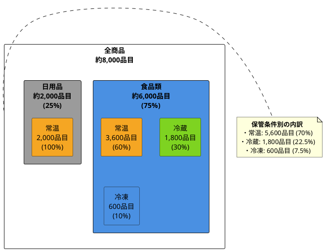
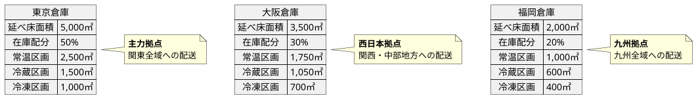
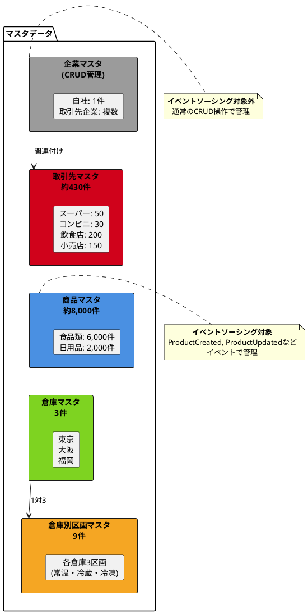
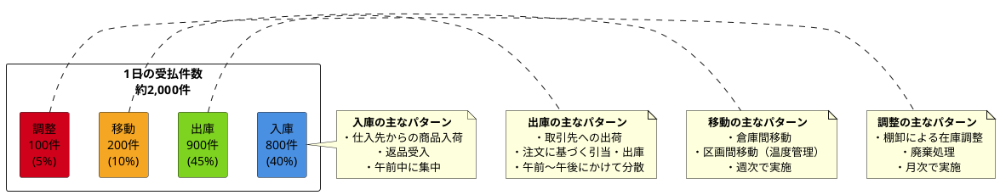
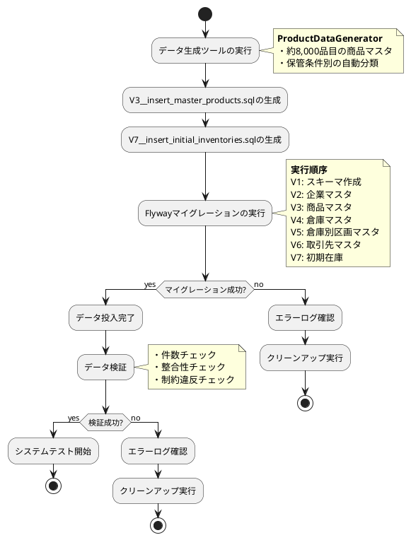

# 第3部 第3章：ドメインに適したデータの作成

## 3.1 事業概要：卸売事業者D社

本章では、在庫管理サービスのケーススタディとして、食品・日用品の卸売事業を営む「株式会社D商事」（仮称）を想定します。実際のビジネスに即したマスタデータとテストデータを作成することで、CQRS/イベントソーシングの実践的な理解を深めます。

### 事業者プロフィール

**株式会社D商事（仮称）**

- **社名**: 株式会社D商事
- **事業形態**: 食品・日用品の卸売事業
- **創業**: 1985年
- **従業員数**: 約250名
- **本社所在地**: 東京都江東区
- **事業内容**: スーパーマーケット、コンビニエンスストア、飲食店等への食品・日用品の卸売販売

D社は、首都圏を中心に全国展開する卸売事業者として、安定した流通ネットワークを構築しています。1985年の創業以来、品質管理と効率的な物流体制を強みに、幅広い取引先との信頼関係を築いてきました。

### 事業規模

| 項目 | 値 | 備考 |
|------|-----|------|
| **年商** | 約150億円 | ※参考情報（今回のスコープでは金額情報は使用しない） |
| **取り扱いSKU数** | 約8,000品目 | 食品類：約6,000品目、日用品：約2,000品目 |
| **取引先数** | 約430社 | スーパー50社、コンビニ30社、飲食店200店舗、小売店150店舗 |
| **1日あたりの在庫受払件数** | 約2,000件 | 入庫、出庫、移動、調整の合計 |
| **物流拠点数** | 3拠点 | 東京、大阪、福岡 |
| **倉庫区画数** | 9区画 | 各倉庫に常温・冷蔵・冷凍の3区画 |

**注意**: 月間取引量（受注件数）や金額情報は今回のスコープ外とし、参考情報としてのみ保持します。

### 取り扱い商品

D社は、食品類と日用品の2つの主要カテゴリで約8,000品目を取り扱っています。

#### 食品類（約6,000品目）

- **常温保存（60%）**: 約3,600品目
  - 加工食品（缶詰、レトルト食品、乾物）
  - 飲料（ペットボトル飲料、茶、コーヒー）
  - 調味料（醤油、味噌、ソース類）
  - 菓子類（スナック、チョコレート、クッキー）

- **要冷蔵（30%）**: 約1,800品目
  - 生鮮食品（野菜、果物）
  - 鮮魚・精肉
  - 乳製品（牛乳、ヨーグルト、チーズ）
  - デリカ商品

- **要冷凍（10%）**: 約600品目
  - 冷凍食品（冷凍野菜、調理済み冷凍食品）
  - アイスクリーム類
  - 冷凍魚介類

#### 日用品（約2,000品目）

- **常温保存（100%）**: 約2,000品目
  - 洗剤・柔軟剤
  - トイレタリー（石鹸、シャンプー、歯磨き粉）
  - 雑貨（台所用品、文房具、清掃用具）



### 主な取引先

D社は、約430社の取引先と継続的な取引関係を構築しています。

| 取引先タイプ | 取引先数 | 主な特徴 |
|------------|---------|---------|
| **スーパーマーケットチェーン** | 約50社 | 大量発注、定期配送、幅広い品揃え要求 |
| **コンビニエンスストア** | 約30社 | 少量多頻度配送、鮮度管理の厳格化 |
| **飲食店・レストラン** | 約200店舗 | 業務用食材中心、緊急配送要求あり |
| **その他小売店** | 約150店舗 | 地域密着型、季節商品の需要変動大 |

### 物流拠点

D社は、全国3拠点の倉庫を運営し、効率的な配送体制を確保しています。各倉庫には、食品の保管条件に応じた3つの区画（常温・冷蔵・冷凍）を設けています。

#### 東京倉庫（主力拠点）

- **所在地**: 東京都江東区
- **延べ床面積**: 5,000㎡
- **在庫配分**: 全体の50%
- **主な配送エリア**: 関東全域
- **区画構成**:
  - 常温区画: 2,500㎡
  - 冷蔵区画: 1,500㎡（5℃前後）
  - 冷凍区画: 1,000㎡（-18℃以下）

#### 大阪倉庫（西日本拠点）

- **所在地**: 大阪府堺市
- **延べ床面積**: 3,500㎡
- **在庫配分**: 全体の30%
- **主な配送エリア**: 関西・中部地方
- **区画構成**:
  - 常温区画: 1,750㎡
  - 冷蔵区画: 1,050㎡（5℃前後）
  - 冷凍区画: 700㎡（-18℃以下）

#### 福岡倉庫（九州拠点）

- **所在地**: 福岡県福岡市
- **延べ床面積**: 2,000㎡
- **在庫配分**: 全体の20%
- **主な配送エリア**: 九州全域
- **区画構成**:
  - 常温区画: 1,000㎡
  - 冷蔵区画: 600㎡（5℃前後）
  - 冷凍区画: 400㎡（-18℃以下）



### データ生成の根拠

本ケーススタディでは、上記の事業規模に基づき、以下のようなデータ生成方針を採用します。

1. **マスタデータ件数**
   - 商品マスタ: 約8,000件（食品類6,000件、日用品2,000件）
   - 取引先マスタ: 約430件（タイプ別に分類）
   - 倉庫マスタ: 3件（東京、大阪、福岡）
   - 倉庫別区画マスタ: 9件（各倉庫に常温・冷蔵・冷凍の3区画）

2. **商品構成比率に応じた区画別在庫配分**
   - 常温保存商品: 70%（常温区画）
   - 要冷蔵商品: 22.5%（冷蔵区画）
   - 要冷凍商品: 7.5%（冷凍区画）

3. **実業務に即した受払トランザクションデータ生成**
   - 1日約2,000件の受払パターン設計
   - 入庫（40%）、出庫（45%）、移動（10%）、調整（5%）の比率
   - 区画別の受払傾向を反映

4. **注文パターンは今回のスコープ外**
   - 月間受注件数や注文データは参考情報として保持
   - 金額情報（単価、合計額）も参考情報としてのみ保持

---

## 3.2 マスタデータの準備

マスタデータは、在庫管理システムの基盤となる静的データです。本節では、D社の事業規模に基づき、5つのマスタデータ（企業、商品、倉庫、倉庫別区画、取引先）の構造と準備方法を説明します。

### 企業マスタデータ

**企業マスタ**は、自社（D社）および取引先企業の基本情報を管理します。企業マスタは比較的静的なデータであり、頻繁に更新されないため、イベントソーシングの対象外とし、**CRUD管理**とします。Read Model（PostgreSQL）で直接管理します。

#### データ構造

```sql
-- 企業テーブル（企業）- CRUD管理、イベントソーシング対象外
CREATE TABLE 企業 (
    企業ID VARCHAR(50) PRIMARY KEY,
    企業名 VARCHAR(200) NOT NULL,
    企業種別 VARCHAR(20) NOT NULL,  -- '自社' または '取引先企業'
    郵便番号 VARCHAR(10),
    住所 VARCHAR(500),
    代表者名 VARCHAR(100),
    設立年月日 DATE,
    資本金 BIGINT,                  -- ※参考情報
    従業員数 INTEGER,
    作成日時 TIMESTAMP NOT NULL DEFAULT CURRENT_TIMESTAMP,
    更新日時 TIMESTAMP NOT NULL DEFAULT CURRENT_TIMESTAMP,

    CONSTRAINT chk_企業種別 CHECK (企業種別 IN ('自社', '取引先企業'))
);

CREATE INDEX idx_企業_企業種別 ON 企業(企業種別);
```

#### マスタデータの例

```sql
-- 自社情報（株式会社D商事）
INSERT INTO 企業 (企業ID, 企業名, 企業種別, 郵便番号, 住所, 代表者名, 設立年月日, 資本金, 従業員数)
VALUES
  ('COMP-D001', '株式会社D商事', '自社', '135-0016', '東京都江東区東陽6-3-2', '山田太郎', '1985-04-01', 500000000, 250);

-- 取引先企業情報（例）
INSERT INTO 企業 (企業ID, 企業名, 企業種別, 郵便番号, 住所, 代表者名, 設立年月日, 資本金, 従業員数)
VALUES
  ('COMP-C001', '株式会社Aスーパー', '取引先企業', '100-0001', '東京都千代田区千代田1-1', '佐藤一郎', '1990-05-15', 1000000000, 500),
  ('COMP-C002', '株式会社Bコンビニ', '取引先企業', '150-0002', '東京都渋谷区渋谷2-1-1', '鈴木次郎', '2000-03-20', 300000000, 150);
```

**重要ポイント**:
- 企業マスタはイベントソーシングを使用せず、通常のCRUD操作で管理
- 資本金などの金額情報は参考情報として保持（今回のスコープでは使用しない）

### 商品マスタデータ

**商品マスタ**は、D社が取り扱う約8,000品目の商品情報を管理します。商品情報はビジネスロジックに影響を与えるため、イベントソーシングの対象とします。

#### データ構造

```sql
-- 商品テーブル（商品）
CREATE TABLE 商品 (
    商品ID VARCHAR(50) PRIMARY KEY,
    商品名 VARCHAR(200) NOT NULL,
    SKU VARCHAR(50) UNIQUE NOT NULL,
    カテゴリ VARCHAR(50) NOT NULL,  -- '食品類' または '日用品'
    保管条件 VARCHAR(20) NOT NULL,  -- '常温', '冷蔵', '冷凍'
    説明 TEXT,
    参考価格 DECIMAL(10, 2),        -- ※参考情報（今回のスコープでは使用しない）
    作成日時 TIMESTAMP NOT NULL DEFAULT CURRENT_TIMESTAMP,
    更新日時 TIMESTAMP NOT NULL DEFAULT CURRENT_TIMESTAMP,

    CONSTRAINT chk_カテゴリ CHECK (カテゴリ IN ('食品類', '日用品')),
    CONSTRAINT chk_保管条件 CHECK (保管条件 IN ('常温', '冷蔵', '冷凍'))
);

CREATE INDEX idx_商品_カテゴリ_保管条件 ON 商品(カテゴリ, 保管条件);
```

#### マスタデータの例

```sql
-- 食品類（常温保存）
INSERT INTO 商品 (商品ID, 商品名, SKU, カテゴリ, 保管条件, 説明, 参考価格)
VALUES
  ('PROD-F001', '醤油 1L', 'SKU-F001', '食品類', '常温', '濃口醤油 1リットル', 500.00),
  ('PROD-F002', 'カップ麺 醤油味', 'SKU-F002', '食品類', '常温', 'インスタントラーメン', 200.00);

-- 食品類（要冷蔵）
INSERT INTO 商品 (商品ID, 商品名, SKU, カテゴリ, 保管条件, 説明, 参考価格)
VALUES
  ('PROD-F101', '牛乳 1L', 'SKU-F101', '食品類', '冷蔵', '成分無調整牛乳', 250.00),
  ('PROD-F102', 'ヨーグルト 400g', 'SKU-F102', '食品類', '冷蔵', 'プレーンヨーグルト', 180.00);

-- 食品類（要冷凍）
INSERT INTO 商品 (商品ID, 商品名, SKU, カテゴリ, 保管条件, 説明, 参考価格)
VALUES
  ('PROD-F201', '冷凍野菜ミックス 500g', 'SKU-F201', '食品類', '冷凍', '冷凍野菜ミックス', 300.00),
  ('PROD-F202', 'アイスクリーム バニラ', 'SKU-F202', '食品類', '冷凍', 'バニラアイスクリーム', 400.00);

-- 日用品（常温保存）
INSERT INTO 商品 (商品ID, 商品名, SKU, カテゴリ, 保管条件, 説明, 参考価格)
VALUES
  ('PROD-D001', '洗濯用洗剤 1kg', 'SKU-D001', '日用品', '常温', '粉末洗剤', 600.00),
  ('PROD-D002', 'トイレットペーパー 12ロール', 'SKU-D002', '日用品', '常温', 'ダブル 12ロール', 500.00);
```

**商品データ生成のポイント**:
- 約8,000品目のデータを生成（食品類6,000、日用品2,000）
- 保管条件別の比率: 常温70%、冷蔵22.5%、冷凍7.5%
- 参考価格は参考情報として保持（今回のスコープでは使用しない）

### 倉庫マスタデータ

**倉庫マスタ**は、D社が運営する3つの物流拠点（東京、大阪、福岡）の情報を管理します。

#### データ構造

```sql
-- 倉庫テーブル（倉庫）
CREATE TABLE 倉庫 (
    倉庫コード VARCHAR(50) PRIMARY KEY,
    倉庫名 VARCHAR(200) NOT NULL,
    所在地 VARCHAR(500) NOT NULL,
    延べ床面積 DECIMAL(10, 2),      -- 単位: ㎡
    容量 DECIMAL(15, 2),             -- 単位: 立方メートル
    有効フラグ BOOLEAN NOT NULL DEFAULT TRUE,
    作成日時 TIMESTAMP NOT NULL DEFAULT CURRENT_TIMESTAMP,
    更新日時 TIMESTAMP NOT NULL DEFAULT CURRENT_TIMESTAMP
);
```

#### マスタデータの例

```sql
INSERT INTO 倉庫 (倉庫コード, 倉庫名, 所在地, 延べ床面積, 容量, 有効フラグ)
VALUES
  ('WH-TOKYO', '東京倉庫', '東京都江東区東陽6-3-2', 5000.00, 25000.00, TRUE),
  ('WH-OSAKA', '大阪倉庫', '大阪府堺市堺区築港八幡町1-1', 3500.00, 17500.00, TRUE),
  ('WH-FUKUOKA', '福岡倉庫', '福岡県福岡市博多区東比恵2-1-1', 2000.00, 10000.00, TRUE);
```

### 倉庫別区画マスタデータ

**倉庫別区画マスタ**は、各倉庫内の保管区画（常温、冷蔵、冷凍）の情報を管理します。各倉庫に3区画、合計9区画が存在します。

#### データ構造

```sql
-- 倉庫別区画テーブル（倉庫別区画）
CREATE TABLE 倉庫別区画 (
    倉庫コード VARCHAR(50) NOT NULL,
    区画番号 VARCHAR(50) NOT NULL,
    区画名 VARCHAR(200) NOT NULL,
    区画タイプ VARCHAR(20) NOT NULL,    -- '常温', '冷蔵', '冷凍'
    区画容量 DECIMAL(15, 2),             -- 単位: 立方メートル
    温度範囲下限 DECIMAL(5, 2),
    温度範囲上限 DECIMAL(5, 2),
    作成日時 TIMESTAMP NOT NULL DEFAULT CURRENT_TIMESTAMP,
    更新日時 TIMESTAMP NOT NULL DEFAULT CURRENT_TIMESTAMP,

    CONSTRAINT pk_倉庫別区画 PRIMARY KEY (倉庫コード, 区画番号),
    CONSTRAINT fk_倉庫別区画_倉庫コード FOREIGN KEY (倉庫コード) REFERENCES 倉庫(倉庫コード),
    CONSTRAINT chk_区画タイプ CHECK (区画タイプ IN ('常温', '冷蔵', '冷凍'))
);

CREATE INDEX idx_倉庫別区画_倉庫コード ON 倉庫別区画(倉庫コード);
CREATE INDEX idx_倉庫別区画_区画タイプ ON 倉庫別区画(区画タイプ);
```

#### マスタデータの例

```sql
-- 東京倉庫の区画（3区画）
INSERT INTO 倉庫別区画 (倉庫コード, 区画番号, 区画名, 区画タイプ, 区画容量, 温度範囲下限, 温度範囲上限)
VALUES
  ('WH-TOKYO', 'ZONE-TOKYO-NORMAL', '東京倉庫 常温区画', '常温', 12500.00, 15.00, 25.00),
  ('WH-TOKYO', 'ZONE-TOKYO-REFRIG', '東京倉庫 冷蔵区画', '冷蔵', 7500.00, 2.00, 8.00),
  ('WH-TOKYO', 'ZONE-TOKYO-FROZEN', '東京倉庫 冷凍区画', '冷凍', 5000.00, -25.00, -15.00);

-- 大阪倉庫の区画（3区画）
INSERT INTO 倉庫別区画 (倉庫コード, 区画番号, 区画名, 区画タイプ, 区画容量, 温度範囲下限, 温度範囲上限)
VALUES
  ('WH-OSAKA', 'ZONE-OSAKA-NORMAL', '大阪倉庫 常温区画', '常温', 8750.00, 15.00, 25.00),
  ('WH-OSAKA', 'ZONE-OSAKA-REFRIG', '大阪倉庫 冷蔵区画', '冷蔵', 5250.00, 2.00, 8.00),
  ('WH-OSAKA', 'ZONE-OSAKA-FROZEN', '大阪倉庫 冷凍区画', '冷凍', 3500.00, -25.00, -15.00);

-- 福岡倉庫の区画（3区画）
INSERT INTO 倉庫別区画 (倉庫コード, 区画番号, 区画名, 区画タイプ, 区画容量, 温度範囲下限, 温度範囲上限)
VALUES
  ('WH-FUKUOKA', 'ZONE-FUKUOKA-NORMAL', '福岡倉庫 常温区画', '常温', 5000.00, 15.00, 25.00),
  ('WH-FUKUOKA', 'ZONE-FUKUOKA-REFRIG', '福岡倉庫 冷蔵区画', '冷蔵', 3000.00, 2.00, 8.00),
  ('WH-FUKUOKA', 'ZONE-FUKUOKA-FROZEN', '福岡倉庫 冷凍区画', '冷凍', 2000.00, -25.00, -15.00);
```

### 取引先マスタデータ

**取引先マスタ**は、D社と取引のある約430社の取引先情報を管理します。取引先は企業と関連付けられます。

#### データ構造

```sql
-- 取引先テーブル（取引先）
CREATE TABLE 取引先 (
    取引先ID VARCHAR(50) PRIMARY KEY,
    企業ID VARCHAR(50) NOT NULL,
    取引先名 VARCHAR(200) NOT NULL,
    取引先タイプ VARCHAR(50) NOT NULL,  -- 'スーパー', 'コンビニ', '飲食店', '小売店'
    住所 VARCHAR(500),
    電話番号 VARCHAR(20),
    担当者名 VARCHAR(100),
    取引開始日 DATE NOT NULL,
    取引ステータス VARCHAR(20) NOT NULL DEFAULT '有効',  -- '有効', '停止', '休止'
    与信限度額 BIGINT,                   -- ※参考情報（今回のスコープでは使用しない）
    支払条件 VARCHAR(100),                -- ※参考情報（今回のスコープでは使用しない）
    作成日時 TIMESTAMP NOT NULL DEFAULT CURRENT_TIMESTAMP,
    更新日時 TIMESTAMP NOT NULL DEFAULT CURRENT_TIMESTAMP,

    CONSTRAINT fk_取引先_企業ID FOREIGN KEY (企業ID) REFERENCES 企業(企業ID),
    CONSTRAINT chk_取引先タイプ CHECK (取引先タイプ IN ('スーパー', 'コンビニ', '飲食店', '小売店')),
    CONSTRAINT chk_取引ステータス CHECK (取引ステータス IN ('有効', '停止', '休止'))
);

CREATE INDEX idx_取引先_企業ID ON 取引先(企業ID);
CREATE INDEX idx_取引先_取引先タイプ ON 取引先(取引先タイプ);
CREATE INDEX idx_取引先_取引ステータス ON 取引先(取引ステータス);
```

#### マスタデータの例

```sql
-- スーパーマーケットチェーン（約50社）
INSERT INTO 取引先 (取引先ID, 企業ID, 取引先名, 取引先タイプ, 住所, 電話番号, 担当者名, 取引開始日, 取引ステータス, 与信限度額, 支払条件)
VALUES
  ('CUST-S001', 'COMP-C001', 'Aスーパー 東京店', 'スーパー', '東京都千代田区千代田1-1', '03-1234-5678', '田中太郎', '2010-04-01', '有効', 50000000, '月末締め翌月末払い'),
  ('CUST-S002', 'COMP-C001', 'Aスーパー 横浜店', 'スーパー', '神奈川県横浜市西区1-1', '045-1234-5678', '佐藤花子', '2012-06-15', '有効', 30000000, '月末締め翌月末払い');

-- コンビニエンスストア（約30社）
INSERT INTO 取引先 (取引先ID, 企業ID, 取引先名, 取引先タイプ, 住所, 電話番号, 担当者名, 取引開始日, 取引ステータス, 与信限度額, 支払条件)
VALUES
  ('CUST-C001', 'COMP-C002', 'Bコンビニ 渋谷店', 'コンビニ', '東京都渋谷区渋谷2-1-1', '03-2345-6789', '鈴木一郎', '2015-01-10', '有効', 10000000, '月2回締め 翌月15日・末日払い');

-- 飲食店（約200店舗）
INSERT INTO 取引先 (取引先ID, 企業ID, 取引先名, 取引先タイプ, 住所, 電話番号, 担当者名, 取引開始日, 取引ステータス, 与信限度額, 支払条件)
VALUES
  ('CUST-R001', 'COMP-C003', 'レストランC 新宿店', '飲食店', '東京都新宿区新宿3-1-1', '03-3456-7890', '高橋次郎', '2018-03-20', '有効', 5000000, '月末締め翌月末払い');

-- 小売店（約150店舗）
INSERT INTO 取引先 (取引先ID, 企業ID, 取引先名, 取引先タイプ, 住所, 電話番号, 担当者名, 取引開始日, 取引ステータス, 与信限度額, 支払条件)
VALUES
  ('CUST-O001', 'COMP-C004', 'D商店 中野店', '小売店', '東京都中野区中野4-1-1', '03-4567-8901', '伊藤三郎', '2020-05-10', '有効', 2000000, '月末締め翌月末払い');
```

**取引先データ生成のポイント**:
- 約430社のデータを生成（スーパー50、コンビニ30、飲食店200、小売店150）
- 企業マスタと関連付け
- 与信限度額、支払条件は参考情報として保持（今回のスコープでは使用しない）



---

## 3.3 テストデータの設計

マスタデータの準備が完了したら、次に実際の業務を模倣したテストデータを作成します。在庫データと受払データのシナリオを設計し、システムの動作を検証します。

### 在庫データの作成

在庫データは、商品、倉庫、区画の組み合わせで管理されます。D社の事業規模に基づき、以下の方針で初期在庫を設定します。

#### 在庫配分の基本方針

1. **商品数**: 約8,000品目
2. **倉庫別在庫配分**:
   - 東京倉庫: 50%
   - 大阪倉庫: 30%
   - 福岡倉庫: 20%

3. **区画別配置**:
   - 常温保存商品（5,600品目）→ 常温区画
   - 要冷蔵商品（1,800品目）→ 冷蔵区画
   - 要冷凍商品（600品目）→ 冷凍区画

#### 初期在庫データの例

```sql
-- 在庫テーブル（在庫）への初期データ投入
-- 注意: 在庫テーブルは倉庫コードと商品IDの複合主キー

-- 商品「醤油 1L」の在庫（常温保存）
INSERT INTO 在庫 (倉庫コード, 商品ID, 区画番号, 現在庫数, 引当済数, 現在在庫額)
VALUES
  ('WH-TOKYO', 'PROD-F001', 'ZONE-TOKYO-NORMAL', 1000, 0, 500000.00),      -- 東京倉庫 常温区画
  ('WH-OSAKA', 'PROD-F001', 'ZONE-OSAKA-NORMAL', 600, 0, 300000.00),       -- 大阪倉庫 常温区画
  ('WH-FUKUOKA', 'PROD-F001', 'ZONE-FUKUOKA-NORMAL', 400, 0, 200000.00);   -- 福岡倉庫 常温区画

-- 商品「牛乳 1L」の在庫（要冷蔵）
INSERT INTO 在庫 (倉庫コード, 商品ID, 区画番号, 現在庫数, 引当済数, 現在在庫額)
VALUES
  ('WH-TOKYO', 'PROD-F101', 'ZONE-TOKYO-REFRIG', 500, 50, 125000.00),      -- 東京倉庫 冷蔵区画（引当済み50）
  ('WH-OSAKA', 'PROD-F101', 'ZONE-OSAKA-REFRIG', 300, 0, 75000.00),        -- 大阪倉庫 冷蔵区画
  ('WH-FUKUOKA', 'PROD-F101', 'ZONE-FUKUOKA-REFRIG', 200, 0, 50000.00);    -- 福岡倉庫 冷蔵区画

-- 商品「冷凍野菜ミックス 500g」の在庫（要冷凍）
INSERT INTO 在庫 (倉庫コード, 商品ID, 区画番号, 現在庫数, 引当済数, 現在在庫額)
VALUES
  ('WH-TOKYO', 'PROD-F201', 'ZONE-TOKYO-FROZEN', 800, 100, 240000.00),     -- 東京倉庫 冷凍区画（引当済み100）
  ('WH-OSAKA', 'PROD-F201', 'ZONE-OSAKA-FROZEN', 480, 0, 144000.00),       -- 大阪倉庫 冷凍区画
  ('WH-FUKUOKA', 'PROD-F201', 'ZONE-FUKUOKA-FROZEN', 320, 0, 96000.00);    -- 福岡倉庫 冷凍区画
```

**在庫データのポイント**:
- 各商品は保管条件に応じた区画にのみ配置
- 倉庫別の在庫配分比率（東京50%、大阪30%、福岡20%）を反映
- 一部の在庫には引当済数を設定し、リアルなシナリオを再現
- 現在在庫額は数量と単価から計算された評価額

### 受払データのシナリオ

受払データは、在庫の移動を記録するトランザクションデータです。D社では1日約2,000件の受払が発生します。

#### 受払区分の比率

| 受払区分 | 比率 | 1日あたりの件数 | 説明 |
|---------|------|----------------|------|
| **入庫** | 40% | 約800件 | 仕入先からの商品入荷 |
| **出庫** | 45% | 約900件 | 取引先への商品出荷 |
| **移動** | 10% | 約200件 | 倉庫間・区画間の在庫移動 |
| **調整** | 5% | 約100件 | 棚卸による在庫調整、廃棄処理 |

#### 正常系のテストケース

```sql
-- 受払履歴テーブル（受払履歴）へのテストデータ投入

-- 入庫（仕入先からの入荷）
INSERT INTO 受払履歴 (受払履歴No, 商品ID, 倉庫コード, 区画番号, 受払区分, 受払数量, 取引額, 受払後在庫数, 受払日時, 操作者)
VALUES
  ('TXN-001', 'PROD-F001', 'WH-TOKYO', 'ZONE-TOKYO-NORMAL', '入庫', 500, 250000.00, 1500, '2025-11-28 08:30:00', '山田太郎'),
  ('TXN-002', 'PROD-F101', 'WH-TOKYO', 'ZONE-TOKYO-REFRIG', '入庫', 200, 50000.00, 700, '2025-11-28 09:00:00', '佐藤花子');

-- 出庫（取引先への出荷）
INSERT INTO 受払履歴 (受払履歴No, 商品ID, 倉庫コード, 区画番号, 受払区分, 受払数量, 取引額, 受払後在庫数, 受払日時, 操作者)
VALUES
  ('TXN-003', 'PROD-F001', 'WH-TOKYO', 'ZONE-TOKYO-NORMAL', '出庫', -100, -50000.00, 1400, '2025-11-28 10:00:00', '鈴木一郎'),
  ('TXN-004', 'PROD-F101', 'WH-TOKYO', 'ZONE-TOKYO-REFRIG', '出庫', -50, -12500.00, 650, '2025-11-28 10:30:00', '田中次郎');

-- 移動（倉庫間移動：東京 → 大阪）
INSERT INTO 受払履歴 (受払履歴No, 商品ID, 倉庫コード, 区画番号, 受払区分, 受払数量, 取引額, 受払後在庫数, 受払日時, 操作者, 移動先倉庫コード, 移動先区画番号)
VALUES
  ('TXN-005', 'PROD-F001', 'WH-TOKYO', 'ZONE-TOKYO-NORMAL', '移動', -200, -100000.00, 1200, '2025-11-28 11:00:00', '高橋三郎', 'WH-OSAKA', 'ZONE-OSAKA-NORMAL'),
  ('TXN-006', 'PROD-F001', 'WH-OSAKA', 'ZONE-OSAKA-NORMAL', '移動', 200, 100000.00, 800, '2025-11-28 13:00:00', '高橋三郎', NULL, NULL);

-- 調整（棚卸による在庫調整）
INSERT INTO 受払履歴 (受払履歴No, 商品ID, 倉庫コード, 区画番号, 受払区分, 受払数量, 取引額, 受払後在庫数, 受払日時, 操作者)
VALUES
  ('TXN-007', 'PROD-F001', 'WH-TOKYO', 'ZONE-TOKYO-NORMAL', '調整', -10, -5000.00, 1190, '2025-11-28 17:00:00', '伊藤四郎');
```

**受払データのポイント**:
- 受払数量は、入庫・移動入は正の値、出庫・移動出は負の値
- 取引額も同様に、入庫は正、出庫は負の値
- 受払日時は実際の業務時間帯を反映
- 操作者は実際の担当者名を記録
- 移動の場合は移動先倉庫コードと移動先区画番号を記録

#### 異常系のテストケース

システムの堅牢性を検証するため、以下のような異常系シナリオも準備します。

1. **在庫不足エラー**
   - 現在庫数を超える出庫要求
   - 有効在庫数を超える引当要求

2. **在庫引当競合**
   - 複数の取引先が同時に同じ商品を引当
   - 楽観的ロックによる競合検出

3. **保管条件違反**
   - 要冷蔵商品を常温区画に配置しようとする
   - 常温商品を冷凍区画に配置しようとする

```sql
-- 異常系テストデータ例

-- 在庫不足エラー（現在庫数100、出庫要求200）
-- → システムはこの操作を拒否すべき
-- INSERT INTO 受払履歴 (受払履歴No, 商品ID, 倉庫コード, 区画番号, 受払区分, 受払数量, 取引額, 受払後在庫数, 受払日時, 操作者)
-- VALUES ('TXN-ERR-001', 'PROD-D001', 'WH-FUKUOKA', 'ZONE-FUKUOKA-NORMAL', '出庫', -200, -120000.00, -100, '2025-11-28 14:00:00', 'テスト');

-- 保管条件違反（要冷蔵商品を常温区画に配置）
-- → システムはこの操作を拒否すべき
-- INSERT INTO 在庫 (倉庫コード, 商品ID, 区画番号, 現在庫数, 引当済数, 現在在庫額)
-- VALUES ('WH-TOKYO', 'PROD-F101', 'ZONE-TOKYO-NORMAL', 100, 0, 25000.00);
```

#### ピーク時の負荷テストデータ

通常時の2倍の負荷（1日4,000件）を想定したテストデータを生成し、システムのスケーラビリティを検証します。



---

## 3.4 データ投入スクリプト

マスタデータとテストデータをデータベースに投入するため、Flywayマイグレーションとシードデータスクリプトを準備します。

### Flywayによるマスタデータ投入

Flywayは、データベースのスキーマ管理とマイグレーションを行うツールです。マスタデータの投入もFlywayマイグレーションとして管理します。

#### ディレクトリ構成

```
modules/query/flyway-migration/src/main/resources/
└── db/
    └── migration/
        ├── V1__create_schema.sql              # スキーマ作成
        ├── V2__insert_master_companies.sql    # 企業マスタ
        ├── V3__insert_master_products.sql     # 商品マスタ
        ├── V4__insert_master_warehouses.sql   # 倉庫マスタ
        ├── V5__insert_master_zones.sql        # 倉庫別区画マスタ
        ├── V6__insert_master_customers.sql    # 取引先マスタ
        └── V7__insert_initial_inventories.sql # 初期在庫データ
```

#### V2__insert_master_companies.sql（企業マスタ投入）

```sql
-- 企業マスタデータの投入
-- 自社情報
INSERT INTO 企業 (企業ID, 企業名, 企業種別, 郵便番号, 住所, 代表者名, 設立年月日, 資本金, 従業員数)
VALUES
  ('COMP-D001', '株式会社D商事', '自社', '135-0016', '東京都江東区東陽6-3-2', '山田太郎', '1985-04-01', 500000000, 250);

-- 取引先企業情報（主要企業のみ例示、実際には全企業を投入）
INSERT INTO 企業 (企業ID, 企業名, 企業種別, 郵便番号, 住所, 代表者名, 設立年月日, 資本金, 従業員数)
VALUES
  ('COMP-C001', '株式会社Aスーパー', '取引先企業', '100-0001', '東京都千代田区千代田1-1', '佐藤一郎', '1990-05-15', 1000000000, 500),
  ('COMP-C002', '株式会社Bコンビニ', '取引先企業', '150-0002', '東京都渋谷区渋谷2-1-1', '鈴木次郎', '2000-03-20', 300000000, 150),
  ('COMP-C003', '株式会社Cレストラン', '取引先企業', '160-0023', '東京都新宿区西新宿1-1-1', '高橋三郎', '2005-07-10', 100000000, 80);
```

#### V3__insert_master_products.sql（商品マスタ投入）

```sql
-- 商品マスタデータの投入
-- 食品類（常温保存）約3,600件
INSERT INTO 商品 (商品ID, 商品名, SKU, カテゴリ, 保管条件, 説明, 参考価格)
VALUES
  ('PROD-F001', '醤油 1L', 'SKU-F001', '食品類', '常温', '濃口醤油 1リットル', 500.00),
  ('PROD-F002', 'カップ麺 醤油味', 'SKU-F002', '食品類', '常温', 'インスタントラーメン', 200.00),
  ('PROD-F003', '缶詰 ツナ', 'SKU-F003', '食品類', '常温', 'ツナ缶詰 70g', 150.00);
  -- ... 約3,600件のデータを投入

-- 食品類（要冷蔵）約1,800件
INSERT INTO 商品 (商品ID, 商品名, SKU, カテゴリ, 保管条件, 説明, 参考価格)
VALUES
  ('PROD-F101', '牛乳 1L', 'SKU-F101', '食品類', '冷蔵', '成分無調整牛乳', 250.00),
  ('PROD-F102', 'ヨーグルト 400g', 'SKU-F102', '食品類', '冷蔵', 'プレーンヨーグルト', 180.00),
  ('PROD-F103', 'チーズ 200g', 'SKU-F103', '食品類', '冷蔵', 'ナチュラルチーズ', 600.00);
  -- ... 約1,800件のデータを投入

-- 食品類（要冷凍）約600件
INSERT INTO 商品 (商品ID, 商品名, SKU, カテゴリ, 保管条件, 説明, 参考価格)
VALUES
  ('PROD-F201', '冷凍野菜ミックス 500g', 'SKU-F201', '食品類', '冷凍', '冷凍野菜ミックス', 300.00),
  ('PROD-F202', 'アイスクリーム バニラ', 'SKU-F202', '食品類', '冷凍', 'バニラアイスクリーム', 400.00),
  ('PROD-F203', '冷凍魚 サバ', 'SKU-F203', '食品類', '冷凍', '冷凍サバ切り身', 500.00);
  -- ... 約600件のデータを投入

-- 日用品（常温保存）約2,000件
INSERT INTO 商品 (商品ID, 商品名, SKU, カテゴリ, 保管条件, 説明, 参考価格)
VALUES
  ('PROD-D001', '洗濯用洗剤 1kg', 'SKU-D001', '日用品', '常温', '粉末洗剤', 600.00),
  ('PROD-D002', 'トイレットペーパー 12ロール', 'SKU-D002', '日用品', '常温', 'ダブル 12ロール', 500.00),
  ('PROD-D003', 'シャンプー 400ml', 'SKU-D003', '日用品', '常温', 'ノンシリコンシャンプー', 800.00);
  -- ... 約2,000件のデータを投入
```

**注意**: 実際には約8,000件のデータを生成するため、データ生成ツール（後述）を使用します。

#### V4__insert_master_warehouses.sql（倉庫マスタ投入）

```sql
-- 倉庫マスタデータの投入
INSERT INTO 倉庫 (倉庫コード, 倉庫名, 所在地, 延べ床面積, 容量, 有効フラグ)
VALUES
  ('WH-TOKYO', '東京倉庫', '東京都江東区東陽6-3-2', 5000.00, 25000.00, TRUE),
  ('WH-OSAKA', '大阪倉庫', '大阪府堺市堺区築港八幡町1-1', 3500.00, 17500.00, TRUE),
  ('WH-FUKUOKA', '福岡倉庫', '福岡県福岡市博多区東比恵2-1-1', 2000.00, 10000.00, TRUE);
```

#### V5__insert_master_zones.sql（倉庫別区画マスタ投入）

```sql
-- 倉庫別区画マスタデータの投入
-- 東京倉庫の区画（3区画）
INSERT INTO 倉庫別区画 (倉庫コード, 区画番号, 区画名, 区画タイプ, 区画容量, 温度範囲下限, 温度範囲上限)
VALUES
  ('WH-TOKYO', 'ZONE-TOKYO-NORMAL', '東京倉庫 常温区画', '常温', 12500.00, 15.00, 25.00),
  ('WH-TOKYO', 'ZONE-TOKYO-REFRIG', '東京倉庫 冷蔵区画', '冷蔵', 7500.00, 2.00, 8.00),
  ('WH-TOKYO', 'ZONE-TOKYO-FROZEN', '東京倉庫 冷凍区画', '冷凍', 5000.00, -25.00, -15.00);

-- 大阪倉庫の区画（3区画）
INSERT INTO 倉庫別区画 (倉庫コード, 区画番号, 区画名, 区画タイプ, 区画容量, 温度範囲下限, 温度範囲上限)
VALUES
  ('WH-OSAKA', 'ZONE-OSAKA-NORMAL', '大阪倉庫 常温区画', '常温', 8750.00, 15.00, 25.00),
  ('WH-OSAKA', 'ZONE-OSAKA-REFRIG', '大阪倉庫 冷蔵区画', '冷蔵', 5250.00, 2.00, 8.00),
  ('WH-OSAKA', 'ZONE-OSAKA-FROZEN', '大阪倉庫 冷凍区画', '冷凍', 3500.00, -25.00, -15.00);

-- 福岡倉庫の区画（3区画）
INSERT INTO 倉庫別区画 (倉庫コード, 区画番号, 区画名, 区画タイプ, 区画容量, 温度範囲下限, 温度範囲上限)
VALUES
  ('WH-FUKUOKA', 'ZONE-FUKUOKA-NORMAL', '福岡倉庫 常温区画', '常温', 5000.00, 15.00, 25.00),
  ('WH-FUKUOKA', 'ZONE-FUKUOKA-REFRIG', '福岡倉庫 冷蔵区画', '冷蔵', 3000.00, 2.00, 8.00),
  ('WH-FUKUOKA', 'ZONE-FUKUOKA-FROZEN', '福岡倉庫 冷凍区画', '冷凍', 2000.00, -25.00, -15.00);
```

#### V6__insert_master_customers.sql（取引先マスタ投入）

```sql
-- 取引先マスタデータの投入
-- スーパーマーケットチェーン（約50社）
INSERT INTO 取引先 (取引先ID, 企業ID, 取引先名, 取引先タイプ, 住所, 電話番号, 担当者名, 取引開始日, 取引ステータス, 与信限度額, 支払条件)
VALUES
  ('CUST-S001', 'COMP-C001', 'Aスーパー 東京店', 'スーパー', '東京都千代田区千代田1-1', '03-1234-5678', '田中太郎', '2010-04-01', '有効', 50000000, '月末締め翌月末払い'),
  ('CUST-S002', 'COMP-C001', 'Aスーパー 横浜店', 'スーパー', '神奈川県横浜市西区1-1', '045-1234-5678', '佐藤花子', '2012-06-15', '有効', 30000000, '月末締め翌月末払い');
  -- ... 約50社のデータを投入

-- コンビニエンスストア（約30社）
INSERT INTO 取引先 (取引先ID, 企業ID, 取引先名, 取引先タイプ, 住所, 電話番号, 担当者名, 取引開始日, 取引ステータス, 与信限度額, 支払条件)
VALUES
  ('CUST-C001', 'COMP-C002', 'Bコンビニ 渋谷店', 'コンビニ', '東京都渋谷区渋谷2-1-1', '03-2345-6789', '鈴木一郎', '2015-01-10', '有効', 10000000, '月2回締め 翌月15日・末日払い');
  -- ... 約30社のデータを投入

-- 飲食店（約200店舗）
INSERT INTO 取引先 (取引先ID, 企業ID, 取引先名, 取引先タイプ, 住所, 電話番号, 担当者名, 取引開始日, 取引ステータス, 与信限度額, 支払条件)
VALUES
  ('CUST-R001', 'COMP-C003', 'レストランC 新宿店', '飲食店', '東京都新宿区新宿3-1-1', '03-3456-7890', '高橋次郎', '2018-03-20', '有効', 5000000, '月末締め翌月末払い');
  -- ... 約200店舗のデータを投入

-- 小売店（約150店舗）
INSERT INTO 取引先 (取引先ID, 企業ID, 取引先名, 取引先タイプ, 住所, 電話番号, 担当者名, 取引開始日, 取引ステータス, 与信限度額, 支払条件)
VALUES
  ('CUST-O001', 'COMP-C004', 'D商店 中野店', '小売店', '東京都中野区中野4-1-1', '03-4567-8901', '伊藤三郎', '2020-05-10', '有効', 2000000, '月末締め翌月末払い');
  -- ... 約150店舗のデータを投入
```

#### V7__insert_initial_inventories.sql（初期在庫データ投入）

```sql
-- 初期在庫データの投入
-- 倉庫別配分比率: 東京50%、大阪30%、福岡20%
-- 注意: 在庫テーブルは倉庫コードと商品IDの複合主キー

-- 常温保存商品の在庫（例: 醤油 1L）
INSERT INTO 在庫 (倉庫コード, 商品ID, 区画番号, 現在庫数, 引当済数, 現在在庫額)
VALUES
  ('WH-TOKYO', 'PROD-F001', 'ZONE-TOKYO-NORMAL', 1000, 0, 500000.00),
  ('WH-OSAKA', 'PROD-F001', 'ZONE-OSAKA-NORMAL', 600, 0, 300000.00),
  ('WH-FUKUOKA', 'PROD-F001', 'ZONE-FUKUOKA-NORMAL', 400, 0, 200000.00);

-- 要冷蔵商品の在庫（例: 牛乳 1L）
INSERT INTO 在庫 (倉庫コード, 商品ID, 区画番号, 現在庫数, 引当済数, 現在在庫額)
VALUES
  ('WH-TOKYO', 'PROD-F101', 'ZONE-TOKYO-REFRIG', 500, 50, 125000.00),
  ('WH-OSAKA', 'PROD-F101', 'ZONE-OSAKA-REFRIG', 300, 0, 75000.00),
  ('WH-FUKUOKA', 'PROD-F101', 'ZONE-FUKUOKA-REFRIG', 200, 0, 50000.00);

-- 要冷凍商品の在庫（例: 冷凍野菜ミックス 500g）
INSERT INTO 在庫 (倉庫コード, 商品ID, 区画番号, 現在庫数, 引当済数, 現在在庫額)
VALUES
  ('WH-TOKYO', 'PROD-F201', 'ZONE-TOKYO-FROZEN', 800, 100, 240000.00),
  ('WH-OSAKA', 'PROD-F201', 'ZONE-OSAKA-FROZEN', 480, 0, 144000.00),
  ('WH-FUKUOKA', 'PROD-F201', 'ZONE-FUKUOKA-FROZEN', 320, 0, 96000.00);

-- ... 約8,000品目のデータを投入
```

### テストデータ生成ツール

約8,000品目の商品マスタや初期在庫データを手動で作成するのは現実的ではありません。そのため、Scalaで実装したデータ生成ツールを使用します。

#### データ生成ツールの構成

```
tools/
└── data-generator/
    ├── build.sbt
    └── src/main/scala/
        ├── DataGenerator.scala          # メインエントリーポイント
        ├── CompanyDataGenerator.scala   # 企業マスタ生成
        ├── ProductDataGenerator.scala   # 商品マスタ生成
        ├── CustomerDataGenerator.scala  # 取引先マスタ生成
        ├── InventoryDataGenerator.scala # 初期在庫生成
        └── TransactionDataGenerator.scala # 受払データ生成
```

#### ProductDataGenerator.scala（商品マスタ生成ツール）

```scala
package tools.datagen

import java.io.{BufferedWriter, FileWriter}
import scala.util.Random

object ProductDataGenerator {

  case class Product(
    productId: String,
    productName: String,
    sku: String,
    category: String,
    storageCondition: String,
    description: String,
    price: BigDecimal
  )

  val foodCategories = Seq("加工食品", "飲料", "調味料", "菓子類", "生鮮食品")
  val dailyCategories = Seq("洗剤", "トイレタリー", "雑貨")

  def generateProducts(totalCount: Int): Seq[Product] = {
    val foodCount = (totalCount * 0.75).toInt  // 75%が食品類
    val dailyCount = totalCount - foodCount     // 25%が日用品

    val normalFoodCount = (foodCount * 0.60).toInt   // 60%が常温
    val refrigeratedFoodCount = (foodCount * 0.30).toInt  // 30%が冷蔵
    val frozenFoodCount = foodCount - normalFoodCount - refrigeratedFoodCount  // 10%が冷凍

    val normalFoods = (1 to normalFoodCount).map { i =>
      Product(
        productId = f"PROD-F$i%04d",
        productName = s"${foodCategories(Random.nextInt(foodCategories.length))} $i",
        sku = f"SKU-F$i%04d",
        category = "食品類",
        storageCondition = "常温",
        description = s"常温保存食品 $i",
        price = BigDecimal(Random.nextInt(1000) + 100)
      )
    }

    val refrigeratedFoods = (1 to refrigeratedFoodCount).map { i =>
      Product(
        productId = f"PROD-FR${i}%04d",
        productName = s"${foodCategories(Random.nextInt(foodCategories.length))} (冷蔵) $i",
        sku = f"SKU-FR${i}%04d",
        category = "食品類",
        storageCondition = "冷蔵",
        description = s"要冷蔵食品 $i",
        price = BigDecimal(Random.nextInt(1000) + 100)
      )
    }

    val frozenFoods = (1 to frozenFoodCount).map { i =>
      Product(
        productId = f"PROD-FZ${i}%04d",
        productName = s"${foodCategories(Random.nextInt(foodCategories.length))} (冷凍) $i",
        sku = f"SKU-FZ${i}%04d",
        category = "食品類",
        storageCondition = "冷凍",
        description = s"要冷凍食品 $i",
        price = BigDecimal(Random.nextInt(1000) + 100)
      )
    }

    val dailyGoods = (1 to dailyCount).map { i =>
      Product(
        productId = f"PROD-D${i}%04d",
        productName = s"${dailyCategories(Random.nextInt(dailyCategories.length))} $i",
        sku = f"SKU-D${i}%04d",
        category = "日用品",
        storageCondition = "常温",
        description = s"日用品 $i",
        price = BigDecimal(Random.nextInt(2000) + 100)
      )
    }

    normalFoods ++ refrigeratedFoods ++ frozenFoods ++ dailyGoods
  }

  def writeToSqlFile(products: Seq[Product], filePath: String): Unit = {
    val writer = new BufferedWriter(new FileWriter(filePath))
    try {
      writer.write("-- 商品マスタデータの投入（自動生成）\n")
      products.grouped(100).foreach { batch =>
        writer.write("INSERT INTO 商品 (商品ID, 商品名, SKU, カテゴリ, 保管条件, 説明, 参考価格) VALUES\n")
        val values = batch.map { p =>
          s"  ('${p.productId}', '${p.productName}', '${p.sku}', '${p.category}', '${p.storageCondition}', '${p.description}', ${p.price})"
        }.mkString(",\n")
        writer.write(values + ";\n\n")
      }
    } finally {
      writer.close()
    }
  }

  def main(args: Array[String]): Unit = {
    val products = generateProducts(8000)
    writeToSqlFile(products, "V3__insert_master_products.sql")
    println(s"Generated ${products.length} products")
  }
}
```

#### InventoryDataGenerator.scala（初期在庫生成ツール）

```scala
package tools.datagen

import java.io.{BufferedWriter, FileWriter}
import scala.util.Random

object InventoryDataGenerator {

  case class Inventory(
    warehouseCode: String,
    productId: String,
    zoneNumber: String,
    onHand: Int,
    reserved: Int,
    inventoryValue: BigDecimal
  )

  val warehouses = Seq(
    ("WH-TOKYO", 0.50),
    ("WH-OSAKA", 0.30),
    ("WH-FUKUOKA", 0.20)
  )

  def getZoneForStorageCondition(warehouseCode: String, storageCondition: String): String = {
    val warehousePrefix = warehouseCode.split("-")(1)
    storageCondition match {
      case "常温" => s"ZONE-$warehousePrefix-NORMAL"
      case "冷蔵" => s"ZONE-$warehousePrefix-REFRIG"
      case "冷凍" => s"ZONE-$warehousePrefix-FROZEN"
    }
  }

  def generateInventories(products: Seq[ProductDataGenerator.Product]): Seq[Inventory] = {
    products.flatMap { product =>
      warehouses.map { case (warehouseCode, ratio) =>
        val baseStock = Random.nextInt(1000) + 100
        val stock = (baseStock * ratio).toInt
        val reserved = if (Random.nextDouble() < 0.1) Random.nextInt(stock / 10) else 0
        val inventoryValue = product.price * stock

        val zoneNumber = getZoneForStorageCondition(warehouseCode, product.storageCondition)

        Inventory(
          warehouseCode = warehouseCode,
          productId = product.productId,
          zoneNumber = zoneNumber,
          onHand = stock,
          reserved = reserved,
          inventoryValue = inventoryValue
        )
      }
    }
  }

  def writeToSqlFile(inventories: Seq[Inventory], filePath: String): Unit = {
    val writer = new BufferedWriter(new FileWriter(filePath))
    try {
      writer.write("-- 初期在庫データの投入（自動生成）\n")
      inventories.grouped(100).foreach { batch =>
        writer.write("INSERT INTO 在庫 (倉庫コード, 商品ID, 区画番号, 現在庫数, 引当済数, 現在在庫額) VALUES\n")
        val values = batch.map { inv =>
          s"  ('${inv.warehouseCode}', '${inv.productId}', '${inv.zoneNumber}', ${inv.onHand}, ${inv.reserved}, ${inv.inventoryValue})"
        }.mkString(",\n")
        writer.write(values + ";\n\n")
      }
    } finally {
      writer.close()
    }
  }

  def main(args: Array[String]): Unit = {
    val products = ProductDataGenerator.generateProducts(8000)
    val inventories = generateInventories(products)
    writeToSqlFile(inventories, "V7__insert_initial_inventories.sql")
    println(s"Generated ${inventories.length} inventory records")
  }
}
```

### データのクリーンアップ手順

テスト終了後やデータの再投入時には、データベースをクリーンアップする必要があります。

#### クリーンアップスクリプト（cleanup.sql）

```sql
-- データのクリーンアップ（テーブル内容の削除）
-- 外部キー制約を考慮して、依存関係の逆順で削除

-- 受払履歴テーブル
TRUNCATE TABLE 受払履歴 CASCADE;

-- 在庫テーブル
TRUNCATE TABLE 在庫 CASCADE;

-- 取引先テーブル
TRUNCATE TABLE 取引先 CASCADE;

-- 倉庫別区画テーブル
TRUNCATE TABLE 倉庫別区画 CASCADE;

-- 倉庫テーブル
TRUNCATE TABLE 倉庫 CASCADE;

-- 商品テーブル
TRUNCATE TABLE 商品 CASCADE;

-- 企業テーブル
TRUNCATE TABLE 企業 CASCADE;

-- シーケンスのリセット（該当する場合）
-- ALTER SEQUENCE companies_seq RESTART WITH 1;
```

#### SBTタスクでのクリーンアップ実行

```bash
# データベースのクリーンアップ
sbt "queryInterfaceAdapter/runMain tools.datagen.CleanupDatabase"

# データの再投入
sbt cleanMigrateQuery
```



---

## まとめ

本章では、在庫管理システムのケーススタディとして、卸売事業者D社の事業概要に基づき、以下のデータを設計・準備しました。

### 主要なポイント

1. **事業規模に即したデータ設計**
   - 約8,000品目の商品マスタ
   - 約430社の取引先マスタ
   - 3拠点9区画の倉庫構成
   - 1日約2,000件の受払トランザクション

2. **保管条件別のデータ配置**
   - 常温保存商品: 70%（常温区画）
   - 要冷蔵商品: 22.5%（冷蔵区画）
   - 要冷凍商品: 7.5%（冷凍区画）

3. **ハイブリッドアーキテクチャ**
   - 企業マスタ: CRUD管理（イベントソーシング対象外）
   - 商品、取引先、在庫: イベントソーシング管理

4. **実業務に即したテストデータ**
   - 正常系シナリオ（入庫、出庫、移動、調整）
   - 異常系シナリオ（在庫不足、競合、保管条件違反）
   - ピーク時の負荷テストデータ

5. **自動化されたデータ投入**
   - Flywayマイグレーション
   - Scalaデータ生成ツール
   - クリーンアップスクリプト

6. **複合主キーの採用**
   - 倉庫別区画: (倉庫コード, 区画番号)
   - 在庫: (倉庫コード, 商品ID)
   - 自然なドメインモデルの表現

7. **金額情報の追加**
   - 在庫テーブル: 現在在庫額
   - 受払履歴テーブル: 取引額
   - 在庫評価と金額追跡の実現

次章では、これらのデータに基づいたドメインモデルの設計を行います。Bounded Contextの識別、集約の設計、ドメインイベントの定義を通じて、CQRS/イベントソーシングアーキテクチャを実装していきます。
