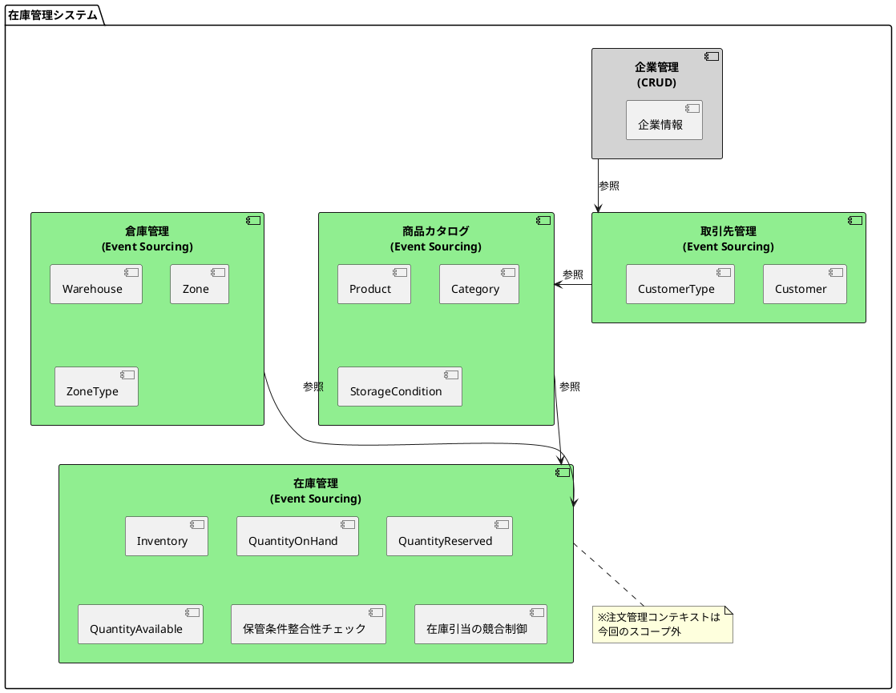
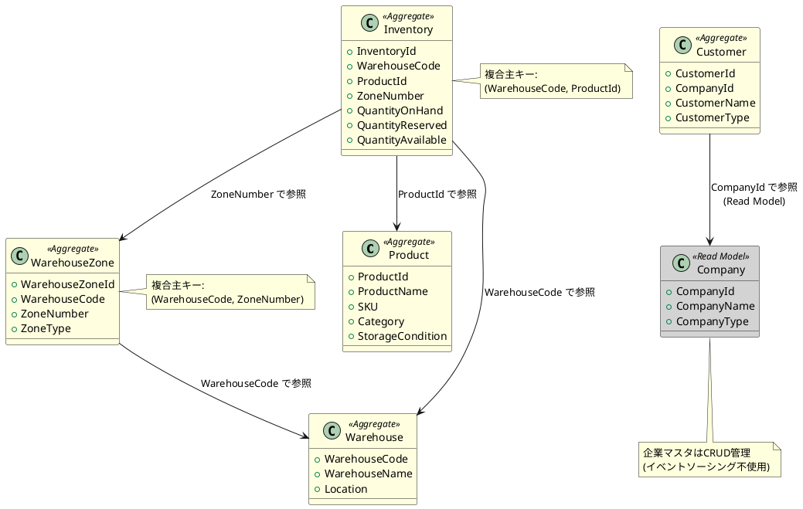

# 第3部 第4章：ドメインモデルの設計

## 概要

本章では、在庫管理システムのドメインモデルを設計します。ドメイン駆動設計（DDD）の原則に従い、ビジネスの概念を正確に表現するモデルを構築します。

第1章で定義した要件、第2章で設計したデータモデル、第3章で準備したドメインデータを基に、CQRS/イベントソーシングに適したドメインモデルを設計します。

## なぜドメインモデルの設計が重要か

ドメインモデルは、ビジネスロジックの中核であり、システムの価値を生み出す部分です。適切に設計されたドメインモデルは以下の利点をもたらします：

1. **ビジネスの理解**：ドメインエキスパートとの共通言語（ユビキタス言語）を確立
2. **変更への対応**：ビジネスルールの変更を局所化し、影響範囲を限定
3. **テスタビリティ**：技術的詳細から独立したビジネスロジックのテスト
4. **保守性**：明確な責任境界による理解しやすいコード

イベントソーシングでは、ドメインモデルが状態変更をイベントとして表現し、それらのイベントから現在の状態を復元します。この特性により、完全な監査ログと時間的なトレーサビリティが得られます。

## ドメイン駆動設計（DDD）の基本概念

### エンティティ（Entity）

エンティティは、一意の識別子（ID）を持つドメインオブジェクトです。同じIDを持つエンティティは、属性が変わっても同一のものとして扱われます。

```scala
// Entity トレイト
trait Entity {
  type IdType <: EntityId
  def id: IdType
}
```

在庫管理システムでは、以下がエンティティに該当します：

- **Product**（商品）：商品IDで識別
- **Customer**（取引先）：取引先IDで識別
- **Warehouse**（倉庫）：倉庫コードで識別
- **WarehouseZone**（倉庫別区画）：倉庫コード + 区画番号で識別
- **Inventory**（在庫）：倉庫コード + 商品IDで識別

### 値オブジェクト（Value Object）

値オブジェクトは、識別子を持たず、その属性によって同一性が決まるオブジェクトです。イミュータブル（不変）であり、ビジネス上の概念を表現します。

```scala
// 値オブジェクトの例：EmailAddress
final case class EmailAddress private (value: String) {
  require(value.matches("""^[a-zA-Z0-9._%+-]+@[a-zA-Z0-9.-]+\.[a-zA-Z]{2,}$"""),
    "Invalid email format")
}

object EmailAddress {
  def apply(value: String): Either[EmailAddressError, EmailAddress] =
    if (value.matches("""^[a-zA-Z0-9._%+-]+@[a-zA-Z0-9.-]+\.[a-zA-Z]{2,}$"""))
      Right(new EmailAddress(value))
    else
      Left(EmailAddressError.InvalidFormat(value))
}
```

在庫管理システムでは、以下が値オブジェクトに該当します：

- **ProductName**、**SKU**、**Category**、**StorageCondition**
- **CustomerName**、**CustomerType**、**Address**、**ContactInfo**
- **WarehouseName**、**Location**
- **ZoneName**、**ZoneType**、**ZoneCapacity**
- **Quantity**、**QuantityOnHand**、**QuantityReserved**

### 集約（Aggregate）

集約は、関連するエンティティと値オブジェクトをまとめたもので、トランザクション境界を定義します。集約ルート（Aggregate Root）が集約全体への唯一のアクセスポイントとなり、一貫性を保証します。

イベントソーシングでは、集約がコマンドを受け取り、ドメインイベントを発行します。

```scala
trait UserAccount extends Entity {
  override type IdType = UserAccountId
  def id: UserAccountId
  def name: UserAccountName
  def emailAddress: EmailAddress
  def createdAt: DateTime
  def updatedAt: DateTime

  // ビジネスロジック：名前変更
  def rename(newName: UserAccountName): Either[RenameError, (UserAccount, UserAccountEvent)]

  // ビジネスロジック：削除
  def delete: Either[DeleteError, (UserAccount, UserAccountEvent)]
}
```

在庫管理システムでは、以下の集約を設計します：

- **Product集約**：商品情報の管理
- **Customer集約**：取引先情報の管理
- **Warehouse集約**：倉庫情報の管理
- **WarehouseZone集約**：倉庫別区画情報の管理
- **Inventory集約**：在庫数量の管理

### ドメインイベント（Domain Event）

ドメインイベントは、過去に発生したビジネス上の重要な出来事を表現します。イベント名は過去形で表され、イミュータブルです。

```scala
enum UserAccountEvent extends DomainEvent {
  override type EntityIdType = UserAccountId

  case Created_V1(
    id: DomainEventId,
    entityId: UserAccountId,
    name: UserAccountName,
    emailAddress: EmailAddress,
    occurredAt: DateTime
  )

  case Renamed_V1(
    id: DomainEventId,
    entityId: UserAccountId,
    oldName: UserAccountName,
    newName: UserAccountName,
    occurredAt: DateTime
  )

  case Deleted_V1(
    id: DomainEventId,
    entityId: UserAccountId,
    occurredAt: DateTime
  )
}
```

イベント名に `_V1` サフィックスを付けるのは、将来のイベントスキーマの進化に対応するためのバージョニング戦略です。

### 境界づけられたコンテキスト（Bounded Context）

境界づけられたコンテキストは、特定のドメインモデルが適用される境界を定義します。異なるコンテキストでは、同じ用語が異なる意味を持つことがあります。

在庫管理システムでは、以下のコンテキストを識別します：

- **企業管理コンテキスト**（Company Management）
- **商品カタログコンテキスト**（Product Catalog）
- **取引先管理コンテキスト**（Customer Management）
- **倉庫管理コンテキスト**（Warehouse Management）
- **在庫管理コンテキスト**（Inventory Management）

※注文管理コンテキストは今回のスコープ外です。

## 境界づけられたコンテキストの識別

### 1. 企業管理コンテキスト（Company Management）

**責務**：企業情報（自社および取引先企業）の管理

**ユビキタス言語**：
- 企業（Company）：法人組織
- 企業種別（CompanyType）：自社 / 取引先企業
- 設立年月日（FoundedDate）：企業の設立日
- 資本金（Capital）：企業の資本金
- 従業員数（EmployeeCount）：企業の従業員数

**特徴**：
- 企業情報は比較的静的なデータであり、変更頻度が低い
- イベントソーシングの対象外とし、CRUD方式で管理
- Read Model（PostgreSQL）で直接管理

**理由**：
企業マスタは基本的に変更が少なく、イベント履歴を保持する必要性が低いため、シンプルなCRUD管理で十分です。イベントソーシングのオーバーヘッドを避け、シンプルな実装を選択します。

### 2. 商品カタログコンテキスト（Product Catalog）

**責務**：商品情報の管理

**ユビキタス言語**：
- 商品（Product）：取り扱う商品
- SKU（Stock Keeping Unit）：在庫管理単位
- 商品カテゴリ（Category）：食品類 / 日用品
- 保管条件（StorageCondition）：常温 / 冷蔵 / 冷凍
- 商品説明（Description）：商品の詳細情報

**主要な操作**：
- 商品の登録
- 商品情報の更新（名称、カテゴリ、保管条件）
- 商品の廃止

**イベント**：
- ProductCreated_V1：商品が登録された
- ProductUpdated_V1：商品情報が更新された
- StorageConditionChanged_V1：保管条件が変更された
- ProductDiscontinued_V1：商品が廃止された

### 3. 取引先管理コンテキスト（Customer Management）

**責務**：取引先情報の管理

**ユビキタス言語**：
- 取引先（Customer）：商品を購入する企業・店舗
- 取引先タイプ（CustomerType）：スーパー / コンビニ / 飲食店 / 小売店
- 企業ID（CompanyId）：取引先が所属する企業
- 取引開始日（TradingStartDate）：取引を開始した日
- 取引ステータス（TradingStatus）：アクティブ / 非アクティブ

**主要な操作**：
- 取引先の登録
- 取引先情報の更新（名称、タイプ、連絡先）
- 取引先の無効化

**イベント**：
- CustomerCreated_V1：取引先が登録された
- CustomerUpdated_V1：取引先情報が更新された
- CustomerTypeChanged_V1：取引先タイプが変更された
- CustomerDeactivated_V1：取引先が無効化された

**企業管理コンテキストとの関係**：
- 取引先は企業に所属する（CompanyId で関連）
- 企業情報はRead Modelから参照
- 取引先情報はイベントソーシングで管理（変更頻度が高いため）

### 4. 倉庫管理コンテキスト（Warehouse Management）

**責務**：倉庫と倉庫別区画の管理

**ユビキタス言語**：

**倉庫（Warehouse）**：
- 倉庫コード（WarehouseCode）：倉庫の一意識別子
- 倉庫名（WarehouseName）：倉庫の名称
- 所在地（Location）：倉庫の住所
- 延べ床面積（FloorArea）：倉庫の面積
- 容量（Capacity）：倉庫の総容量
- 有効フラグ（IsActive）：倉庫が稼働中かどうか

**倉庫別区画（WarehouseZone）**：
- 区画番号（ZoneNumber）：区画の識別子（倉庫内で一意）
- 区画名（ZoneName）：区画の名称
- 区画タイプ（ZoneType）：常温 / 冷蔵 / 冷凍
- 区画容量（ZoneCapacity）：区画の容量
- 温度範囲（TemperatureRange）：区画の温度範囲（参考情報）

**主要な操作**：

**Warehouse集約**：
- 倉庫の登録
- 倉庫情報の更新（名称、容量）
- 倉庫の有効化 / 無効化

**WarehouseZone集約**：
- 区画の作成
- 区画情報の更新（名称、容量）
- 区画の無効化

**イベント**：

**Warehouse Events**：
- WarehouseCreated_V1：倉庫が登録された
- WarehouseUpdated_V1：倉庫情報が更新された
- CapacityChanged_V1：容量が変更された
- WarehouseActivated_V1：倉庫が有効化された
- WarehouseDeactivated_V1：倉庫が無効化された

**WarehouseZone Events**：
- ZoneCreated_V1：区画が作成された
- ZoneUpdated_V1：区画情報が更新された
- ZoneCapacityChanged_V1：区画容量が変更された
- ZoneDeactivated_V1：区画が無効化された

### 5. 在庫管理コンテキスト（Inventory Management）

**責務**：在庫数量の管理、倉庫間・区画間移動、在庫引当

**ユビキタス言語**：
- 在庫（Inventory）：倉庫・区画ごとの商品在庫
- 現在庫数（QuantityOnHand）：物理的な在庫数
- 引当済数（QuantityReserved）：引当済みの数量
- 有効在庫数（QuantityAvailable）：利用可能な在庫数（現在庫数 - 引当済数）
- 現在在庫額（InventoryValue）：在庫の金額評価
- 受払区分（TransactionType）：入庫 / 出庫 / 移動 / 調整
- 受払履歴（InventoryTransaction）：在庫変動の記録

**主要な操作**：
- 入庫（Receive）：商品を倉庫に受け入れる
- 出庫（Issue）：商品を倉庫から出荷する
- 在庫引当（Reserve）：注文に対して在庫を確保する
- 引当解除（Release）：引当を解除する
- 倉庫間移動（Transfer）：異なる倉庫へ在庫を移動
- 区画間移動（ZoneTransfer）：同一倉庫内の異なる区画へ移動
- 在庫調整（Adjust）：実地棚卸による調整

**ビジネスルール**：
1. **在庫のマイナス禁止**：出庫・引当時に有効在庫数をチェック
2. **保管条件の整合性**：商品の保管条件と区画タイプの一致を検証
3. **引当済在庫の保護**：引当済数を考慮した出庫制御
4. **区画容量チェック**：入庫時に区画容量を超えないか検証
5. **楽観的ロック**：在庫引当の競合制御

**イベント**：
- InventoryCreated_V1：在庫が作成された
- StockReceived_V1：商品が入庫された
- StockIssued_V1：商品が出庫された
- StockReserved_V1：在庫が引当された
- StockReleased_V1：引当が解除された
- StockTransferred_V1：倉庫間で在庫が移動された
- ZoneTransferred_V1：区画間で在庫が移動された
- StockAdjusted_V1：在庫が調整された
- StorageConditionViolated_V1：保管条件違反が検出された

## 集約の設計

### 設計原則

集約を設計する際の原則：

1. **トランザクション境界**：一つの集約は一つのトランザクション境界
2. **小さく保つ**：必要最小限のエンティティと値オブジェクトで構成
3. **ID参照**：他の集約への参照はIDで行う（オブジェクト参照ではない）
4. **不変条件の保護**：集約ルートがビジネスルールを強制

イベントソーシングでは、集約は以下の責務を持ちます：

- **コマンド処理**：ビジネスルールに基づきコマンドを検証
- **イベント発行**：状態変更をドメインイベントとして発行
- **状態復元**：過去のイベントから現在の状態を復元

### 1. Product集約（商品）

#### 集約ルート：Product

**識別子**：
- `ProductId`（商品ID）：UUID形式

**属性**：
- `productName: ProductName`（商品名）
- `sku: SKU`（在庫管理単位）
- `category: Category`（カテゴリ：食品類 / 日用品）
- `description: Description`（商品説明）
- `storageCondition: StorageCondition`（保管条件：常温 / 冷蔵 / 冷凍）
- `price: Price`（価格）※参考情報として保持
- `isDiscontinued: Boolean`（廃止フラグ）
- `createdAt: DateTime`（作成日時）
- `updatedAt: DateTime`（更新日時）

**値オブジェクト**：

```scala
// 商品名
final case class ProductName private (value: String)

object ProductName {
  def apply(value: String): Either[ProductNameError, ProductName] =
    if (value.nonEmpty && value.length <= 200)
      Right(new ProductName(value))
    else
      Left(ProductNameError.InvalidLength(value))
}

// SKU
final case class SKU private (value: String)

object SKU {
  def apply(value: String): Either[SKUError, SKU] =
    if (value.matches("^[A-Z0-9-]{4,50}$"))
      Right(new SKU(value))
    else
      Left(SKUError.InvalidFormat(value))
}

// カテゴリ
enum Category {
  case 食品類
  case 日用品
}

// 保管条件
enum StorageCondition {
  case 常温  // Normal temperature
  case 冷蔵  // Refrigerated
  case 冷凍  // Frozen
}
```

**ビジネスロジック**：

```scala
trait Product extends Entity {
  override type IdType = ProductId
  def id: ProductId
  def productName: ProductName
  def sku: SKU
  def category: Category
  def description: Description
  def storageCondition: StorageCondition
  def price: Price
  def isDiscontinued: Boolean
  def createdAt: DateTime
  def updatedAt: DateTime

  // 商品情報の更新
  def updateInfo(
    newName: ProductName,
    newDescription: Description
  ): Either[UpdateError, (Product, ProductEvent)]

  // 保管条件の変更
  def changeStorageCondition(
    newCondition: StorageCondition
  ): Either[ChangeStorageConditionError, (Product, ProductEvent)]

  // 商品の廃止
  def discontinue(): Either[DiscontinueError, (Product, ProductEvent)]
}

object Product {
  def apply(
    id: ProductId,
    productName: ProductName,
    sku: SKU,
    category: Category,
    description: Description,
    storageCondition: StorageCondition,
    price: Price
  ): (Product, ProductEvent) = {
    val product = ProductImpl(
      id = id,
      productName = productName,
      sku = sku,
      category = category,
      description = description,
      storageCondition = storageCondition,
      price = price,
      isDiscontinued = false,
      createdAt = DateTime.now(),
      updatedAt = DateTime.now()
    )
    val event = ProductEvent.Created_V1(
      id = DomainEventId.generate(),
      entityId = id,
      productName = productName,
      sku = sku,
      category = category,
      description = description,
      storageCondition = storageCondition,
      price = price,
      occurredAt = DateTime.now()
    )
    (product, event)
  }
}
```

**ドメインイベント**：

```scala
enum ProductEvent extends DomainEvent {
  override type EntityIdType = ProductId

  case Created_V1(
    id: DomainEventId,
    entityId: ProductId,
    productName: ProductName,
    sku: SKU,
    category: Category,
    description: Description,
    storageCondition: StorageCondition,
    price: Price,
    occurredAt: DateTime
  )

  case Updated_V1(
    id: DomainEventId,
    entityId: ProductId,
    productName: ProductName,
    description: Description,
    occurredAt: DateTime
  )

  case StorageConditionChanged_V1(
    id: DomainEventId,
    entityId: ProductId,
    oldCondition: StorageCondition,
    newCondition: StorageCondition,
    occurredAt: DateTime
  )

  case PriceChanged_V1(  // 参考情報として定義
    id: DomainEventId,
    entityId: ProductId,
    oldPrice: Price,
    newPrice: Price,
    occurredAt: DateTime
  )

  case Discontinued_V1(
    id: DomainEventId,
    entityId: ProductId,
    occurredAt: DateTime
  )
}
```

**設計上の考慮点**：

1. **保管条件の重要性**：保管条件は在庫管理において重要なビジネスルールであり、区画タイプとの整合性チェックに使用されます
2. **価格情報**：今回のスコープでは使用しませんが、将来の拡張に備えて参考情報として保持
3. **廃止フラグ**：削除ではなく廃止フラグで管理し、履歴を保持
4. **SKUの一意性**：SKUは倉庫業務で使用される重要な識別子

### 2. Customer集約（取引先）

#### 集約ルート：Customer

**識別子**：
- `CustomerId`（取引先ID）：UUID形式

**属性**：
- `companyId: CompanyId`（企業ID）：企業マスタへの参照
- `customerName: CustomerName`（取引先名）
- `customerType: CustomerType`（取引先タイプ：スーパー / コンビニ / 飲食店 / 小売店）
- `address: Address`（住所）
- `contactInfo: ContactInfo`（連絡先）
- `tradingStartDate: TradingStartDate`（取引開始日）
- `tradingStatus: TradingStatus`（取引ステータス：アクティブ / 非アクティブ）
- `creditLimit: CreditLimit`（与信限度額）※参考情報として保持
- `paymentTerms: PaymentTerms`（支払条件）※参考情報として保持
- `isActive: Boolean`（有効フラグ）
- `createdAt: DateTime`（作成日時）
- `updatedAt: DateTime`（更新日時）

**値オブジェクト**：

```scala
// 企業ID（企業管理コンテキストへの参照）
final case class CompanyId private (value: String) extends EntityId {
  override def asString: String = value
  override def entityTypeName: String = "Company"
}

object CompanyId {
  def apply(value: String): Either[CompanyIdError, CompanyId] =
    if (value.nonEmpty && value.length <= 50)
      Right(new CompanyId(value))
    else
      Left(CompanyIdError.InvalidFormat(value))
}

// 取引先名
final case class CustomerName private (value: String)

object CustomerName {
  def apply(value: String): Either[CustomerNameError, CustomerName] =
    if (value.nonEmpty && value.length <= 200)
      Right(new CustomerName(value))
    else
      Left(CustomerNameError.InvalidLength(value))
}

// 取引先タイプ
enum CustomerType {
  case スーパー    // Supermarket
  case コンビニ    // Convenience store
  case 飲食店      // Restaurant
  case 小売店      // Retail store
}

// 取引ステータス
enum TradingStatus {
  case アクティブ      // Active
  case 非アクティブ    // Inactive
}
```

**ビジネスロジック**：

```scala
trait Customer extends Entity {
  override type IdType = CustomerId
  def id: CustomerId
  def companyId: CompanyId
  def customerName: CustomerName
  def customerType: CustomerType
  def address: Address
  def contactInfo: ContactInfo
  def tradingStartDate: TradingStartDate
  def tradingStatus: TradingStatus
  def creditLimit: CreditLimit
  def paymentTerms: PaymentTerms
  def isActive: Boolean
  def createdAt: DateTime
  def updatedAt: DateTime

  // 取引先情報の更新
  def updateInfo(
    newName: CustomerName,
    newAddress: Address,
    newContactInfo: ContactInfo
  ): Either[UpdateError, (Customer, CustomerEvent)]

  // 取引先タイプの変更
  def changeCustomerType(
    newType: CustomerType
  ): Either[ChangeCustomerTypeError, (Customer, CustomerEvent)]

  // 取引先の無効化
  def deactivate(): Either[DeactivateError, (Customer, CustomerEvent)]

  // 取引先の再有効化
  def activate(): Either[ActivateError, (Customer, CustomerEvent)]
}

object Customer {
  def apply(
    id: CustomerId,
    companyId: CompanyId,
    customerName: CustomerName,
    customerType: CustomerType,
    address: Address,
    contactInfo: ContactInfo,
    tradingStartDate: TradingStartDate,
    creditLimit: CreditLimit,
    paymentTerms: PaymentTerms
  ): (Customer, CustomerEvent) = {
    val customer = CustomerImpl(
      id = id,
      companyId = companyId,
      customerName = customerName,
      customerType = customerType,
      address = address,
      contactInfo = contactInfo,
      tradingStartDate = tradingStartDate,
      tradingStatus = TradingStatus.アクティブ,
      creditLimit = creditLimit,
      paymentTerms = paymentTerms,
      isActive = true,
      createdAt = DateTime.now(),
      updatedAt = DateTime.now()
    )
    val event = CustomerEvent.Created_V1(
      id = DomainEventId.generate(),
      entityId = id,
      companyId = companyId,
      customerName = customerName,
      customerType = customerType,
      address = address,
      contactInfo = contactInfo,
      tradingStartDate = tradingStartDate,
      creditLimit = creditLimit,
      paymentTerms = paymentTerms,
      occurredAt = DateTime.now()
    )
    (customer, event)
  }
}
```

**ドメインイベント**：

```scala
enum CustomerEvent extends DomainEvent {
  override type EntityIdType = CustomerId

  case Created_V1(
    id: DomainEventId,
    entityId: CustomerId,
    companyId: CompanyId,
    customerName: CustomerName,
    customerType: CustomerType,
    address: Address,
    contactInfo: ContactInfo,
    tradingStartDate: TradingStartDate,
    creditLimit: CreditLimit,
    paymentTerms: PaymentTerms,
    occurredAt: DateTime
  )

  case Updated_V1(
    id: DomainEventId,
    entityId: CustomerId,
    customerName: CustomerName,
    address: Address,
    contactInfo: ContactInfo,
    occurredAt: DateTime
  )

  case CustomerTypeChanged_V1(
    id: DomainEventId,
    entityId: CustomerId,
    oldType: CustomerType,
    newType: CustomerType,
    occurredAt: DateTime
  )

  case CreditLimitChanged_V1(  // 参考情報として定義
    id: DomainEventId,
    entityId: CustomerId,
    oldLimit: CreditLimit,
    newLimit: CreditLimit,
    occurredAt: DateTime
  )

  case Deactivated_V1(
    id: DomainEventId,
    entityId: CustomerId,
    occurredAt: DateTime
  )

  case Activated_V1(
    id: DomainEventId,
    entityId: CustomerId,
    occurredAt: DateTime
  )
}
```

**設計上の考慮点**：

1. **企業との関連**：CompanyIdで企業管理コンテキストと関連（企業情報はRead Modelから参照）
2. **取引先タイプ**：スーパー、コンビニ、飲食店、小売店の区別は注文パターンに影響（今回のスコープ外）
3. **与信情報**：CreditLimit、PaymentTermsは参考情報として保持（金額情報を扱う機能は今回のスコープ外）
4. **無効化と削除の違い**：削除ではなく無効化により、履歴を保持

### 3. Warehouse集約（倉庫）

#### 集約ルート：Warehouse

**識別子**：
- `WarehouseCode`（倉庫コード）：文字列形式（例：`WH-TOKYO`）

**属性**：
- `warehouseName: WarehouseName`（倉庫名）
- `location: Location`（所在地）
- `floorArea: FloorArea`（延べ床面積）
- `capacity: Capacity`（容量）
- `isActive: Boolean`（有効フラグ）
- `createdAt: DateTime`（作成日時）
- `updatedAt: DateTime`（更新日時）

**値オブジェクト**：

```scala
// 倉庫コード
final case class WarehouseCode private (value: String) extends EntityId {
  override def asString: String = value
  override def entityTypeName: String = "Warehouse"
}

object WarehouseCode {
  def apply(value: String): Either[WarehouseCodeError, WarehouseCode] =
    if (value.matches("^WH-[A-Z]+$"))
      Right(new WarehouseCode(value))
    else
      Left(WarehouseCodeError.InvalidFormat(value))
}

// 倉庫名
final case class WarehouseName private (value: String)

object WarehouseName {
  def apply(value: String): Either[WarehouseNameError, WarehouseName] =
    if (value.nonEmpty && value.length <= 200)
      Right(new WarehouseName(value))
    else
      Left(WarehouseNameError.InvalidLength(value))
}

// 所在地
final case class Location private (
  postalCode: String,
  prefecture: String,
  city: String,
  addressLine: String
)

object Location {
  def apply(
    postalCode: String,
    prefecture: String,
    city: String,
    addressLine: String
  ): Either[LocationError, Location] =
    if (postalCode.matches("^[0-9]{3}-[0-9]{4}$"))
      Right(new Location(postalCode, prefecture, city, addressLine))
    else
      Left(LocationError.InvalidPostalCode(postalCode))
}

// 延べ床面積（平方メートル）
final case class FloorArea private (value: BigDecimal) {
  require(value > 0, "Floor area must be positive")
}

// 容量（立方メートル）
final case class Capacity private (value: BigDecimal) {
  require(value > 0, "Capacity must be positive")
}
```

**ビジネスロジック**：

```scala
trait Warehouse extends Entity {
  override type IdType = WarehouseCode
  def id: WarehouseCode
  def warehouseName: WarehouseName
  def location: Location
  def floorArea: FloorArea
  def capacity: Capacity
  def isActive: Boolean
  def createdAt: DateTime
  def updatedAt: DateTime

  // 倉庫情報の更新
  def updateInfo(
    newName: WarehouseName,
    newLocation: Location
  ): Either[UpdateError, (Warehouse, WarehouseEvent)]

  // 容量の変更
  def changeCapacity(
    newCapacity: Capacity
  ): Either[ChangeCapacityError, (Warehouse, WarehouseEvent)]

  // 倉庫の無効化
  def deactivate(): Either[DeactivateError, (Warehouse, WarehouseEvent)]

  // 倉庫の再有効化
  def activate(): Either[ActivateError, (Warehouse, WarehouseEvent)]
}

object Warehouse {
  def apply(
    code: WarehouseCode,
    warehouseName: WarehouseName,
    location: Location,
    floorArea: FloorArea,
    capacity: Capacity
  ): (Warehouse, WarehouseEvent) = {
    val warehouse = WarehouseImpl(
      id = code,
      warehouseName = warehouseName,
      location = location,
      floorArea = floorArea,
      capacity = capacity,
      isActive = true,
      createdAt = DateTime.now(),
      updatedAt = DateTime.now()
    )
    val event = WarehouseEvent.Created_V1(
      id = DomainEventId.generate(),
      entityId = code,
      warehouseName = warehouseName,
      location = location,
      floorArea = floorArea,
      capacity = capacity,
      occurredAt = DateTime.now()
    )
    (warehouse, event)
  }
}
```

**ドメインイベント**：

```scala
enum WarehouseEvent extends DomainEvent {
  override type EntityIdType = WarehouseCode

  case Created_V1(
    id: DomainEventId,
    entityId: WarehouseCode,
    warehouseName: WarehouseName,
    location: Location,
    floorArea: FloorArea,
    capacity: Capacity,
    occurredAt: DateTime
  )

  case Updated_V1(
    id: DomainEventId,
    entityId: WarehouseCode,
    warehouseName: WarehouseName,
    location: Location,
    occurredAt: DateTime
  )

  case CapacityChanged_V1(
    id: DomainEventId,
    entityId: WarehouseCode,
    oldCapacity: Capacity,
    newCapacity: Capacity,
    occurredAt: DateTime
  )

  case Deactivated_V1(
    id: DomainEventId,
    entityId: WarehouseCode,
    occurredAt: DateTime
  )

  case Activated_V1(
    id: DomainEventId,
    entityId: WarehouseCode,
    occurredAt: DateTime
  )
}
```

**設計上の考慮点**：

1. **倉庫コード**：UUIDではなく業務上意味のあるコード（`WH-TOKYO`など）を使用
2. **容量管理**：倉庫全体の容量を管理し、区画の合計容量と整合性をチェック
3. **無効化**：倉庫を無効化する際は、在庫が空であることを確認する必要がある（ビジネスルール）

### 4. WarehouseZone集約（倉庫別区画）

#### 集約ルート：WarehouseZone

**識別子**：
- 複合キー：`(WarehouseCode, ZoneNumber)`

**属性**：
- `warehouseCode: WarehouseCode`（倉庫コード）
- `zoneNumber: ZoneNumber`（区画番号）
- `zoneName: ZoneName`（区画名）
- `zoneType: ZoneType`（区画タイプ：常温 / 冷蔵 / 冷凍）
- `zoneCapacity: ZoneCapacity`（区画容量）
- `temperatureRange: TemperatureRange`（温度範囲）※参考情報
- `isActive: Boolean`（有効フラグ）
- `createdAt: DateTime`（作成日時）
- `updatedAt: DateTime`（更新日時）

**値オブジェクト**：

```scala
// 倉庫別区画ID（複合キー）
final case class WarehouseZoneId private (
  warehouseCode: WarehouseCode,
  zoneNumber: ZoneNumber
) extends EntityId {
  override def asString: String = s"${warehouseCode.asString}-${zoneNumber.value}"
  override def entityTypeName: String = "WarehouseZone"
}

// 区画番号
final case class ZoneNumber private (value: String)

object ZoneNumber {
  def apply(value: String): Either[ZoneNumberError, ZoneNumber] =
    if (value.matches("^ZONE-[A-Z]+-[A-Z]+$"))
      Right(new ZoneNumber(value))
    else
      Left(ZoneNumberError.InvalidFormat(value))
}

// 区画名
final case class ZoneName private (value: String)

object ZoneName {
  def apply(value: String): Either[ZoneNameError, ZoneName] =
    if (value.nonEmpty && value.length <= 200)
      Right(new ZoneName(value))
    else
      Left(ZoneNameError.InvalidLength(value))
}

// 区画タイプ
enum ZoneType {
  case 常温  // Normal temperature
  case 冷蔵  // Refrigerated
  case 冷凍  // Frozen

  // 保管条件との互換性チェック
  def isCompatibleWith(storageCondition: StorageCondition): Boolean = {
    (this, storageCondition) match {
      case (ZoneType.常温, StorageCondition.常温) => true
      case (ZoneType.冷蔵, StorageCondition.冷蔵) => true
      case (ZoneType.冷凍, StorageCondition.冷凍) => true
      case _ => false
    }
  }
}

// 区画容量
final case class ZoneCapacity private (value: BigDecimal) {
  require(value > 0, "Zone capacity must be positive")
}

// 温度範囲（参考情報）
final case class TemperatureRange private (
  minTemperature: BigDecimal,
  maxTemperature: BigDecimal
) {
  require(minTemperature <= maxTemperature, "Min temperature must be <= max temperature")
}
```

**ビジネスロジック**：

```scala
trait WarehouseZone extends Entity {
  override type IdType = WarehouseZoneId
  def id: WarehouseZoneId
  def warehouseCode: WarehouseCode
  def zoneNumber: ZoneNumber
  def zoneName: ZoneName
  def zoneType: ZoneType
  def zoneCapacity: ZoneCapacity
  def temperatureRange: TemperatureRange
  def isActive: Boolean
  def createdAt: DateTime
  def updatedAt: DateTime

  // 区画情報の更新
  def updateInfo(
    newName: ZoneName
  ): Either[UpdateError, (WarehouseZone, WarehouseZoneEvent)]

  // 区画容量の変更
  def changeCapacity(
    newCapacity: ZoneCapacity
  ): Either[ChangeCapacityError, (WarehouseZone, WarehouseZoneEvent)]

  // 保管条件との互換性チェック
  def validateStorageCondition(
    storageCondition: StorageCondition
  ): Either[StorageConditionError, Unit] =
    if (zoneType.isCompatibleWith(storageCondition))
      Right(())
    else
      Left(StorageConditionError.IncompatibleZoneType(zoneType, storageCondition))

  // 区画の無効化
  def deactivate(): Either[DeactivateError, (WarehouseZone, WarehouseZoneEvent)]

  // 区画の再有効化
  def activate(): Either[ActivateError, (WarehouseZone, WarehouseZoneEvent)]
}

object WarehouseZone {
  def apply(
    warehouseCode: WarehouseCode,
    zoneNumber: ZoneNumber,
    zoneName: ZoneName,
    zoneType: ZoneType,
    zoneCapacity: ZoneCapacity,
    temperatureRange: TemperatureRange
  ): (WarehouseZone, WarehouseZoneEvent) = {
    val id = WarehouseZoneId(warehouseCode, zoneNumber)
    val zone = WarehouseZoneImpl(
      id = id,
      warehouseCode = warehouseCode,
      zoneNumber = zoneNumber,
      zoneName = zoneName,
      zoneType = zoneType,
      zoneCapacity = zoneCapacity,
      temperatureRange = temperatureRange,
      isActive = true,
      createdAt = DateTime.now(),
      updatedAt = DateTime.now()
    )
    val event = WarehouseZoneEvent.Created_V1(
      id = DomainEventId.generate(),
      entityId = id,
      warehouseCode = warehouseCode,
      zoneNumber = zoneNumber,
      zoneName = zoneName,
      zoneType = zoneType,
      zoneCapacity = zoneCapacity,
      temperatureRange = temperatureRange,
      occurredAt = DateTime.now()
    )
    (zone, event)
  }
}
```

**ドメインイベント**：

```scala
enum WarehouseZoneEvent extends DomainEvent {
  override type EntityIdType = WarehouseZoneId

  case Created_V1(
    id: DomainEventId,
    entityId: WarehouseZoneId,
    warehouseCode: WarehouseCode,
    zoneNumber: ZoneNumber,
    zoneName: ZoneName,
    zoneType: ZoneType,
    zoneCapacity: ZoneCapacity,
    temperatureRange: TemperatureRange,
    occurredAt: DateTime
  )

  case Updated_V1(
    id: DomainEventId,
    entityId: WarehouseZoneId,
    zoneName: ZoneName,
    occurredAt: DateTime
  )

  case CapacityChanged_V1(
    id: DomainEventId,
    entityId: WarehouseZoneId,
    oldCapacity: ZoneCapacity,
    newCapacity: ZoneCapacity,
    occurredAt: DateTime
  )

  case Deactivated_V1(
    id: DomainEventId,
    entityId: WarehouseZoneId,
    occurredAt: DateTime
  )

  case Activated_V1(
    id: DomainEventId,
    entityId: WarehouseZoneId,
    occurredAt: DateTime
  )
}
```

**設計上の考慮点**：

1. **複合主キー**：倉庫コードと区画番号の組み合わせで一意に識別
2. **保管条件の検証**：区画タイプと商品の保管条件の互換性チェックが重要なビジネスルール
3. **温度範囲**：参考情報として保持（今回のスコープでは使用しないが、将来の温度監視機能に備える）
4. **倉庫との関連**：WarehouseCodeで倉庫と関連（ID参照）

### 5. Inventory集約（在庫）

#### 集約ルート：Inventory

**識別子**：
- 複合キー：`(WarehouseCode, ProductId)`

**属性**：
- `warehouseCode: WarehouseCode`（倉庫コード）
- `productId: ProductId`（商品ID）
- `zoneNumber: ZoneNumber`（区画番号）
- `quantityOnHand: Quantity`（現在庫数）
- `quantityReserved: Quantity`（引当済数）
- `quantityAvailable: Quantity`（有効在庫数：計算値 = 現在庫数 - 引当済数）
- `inventoryValue: InventoryValue`（現在在庫額）
- `lastUpdatedAt: DateTime`（最終更新日時）
- `createdAt: DateTime`（作成日時）

**値オブジェクト**：

```scala
// 在庫ID（複合キー）
final case class InventoryId private (
  warehouseCode: WarehouseCode,
  productId: ProductId
) extends EntityId {
  override def asString: String = s"${warehouseCode.asString}-${productId.asString}"
  override def entityTypeName: String = "Inventory"
}

// 数量
final case class Quantity private (value: Int) {
  require(value >= 0, "Quantity cannot be negative")

  def +(other: Quantity): Quantity = Quantity(value + other.value)
  def -(other: Quantity): Either[QuantityError, Quantity] =
    if (value >= other.value)
      Right(Quantity(value - other.value))
    else
      Left(QuantityError.NegativeResult)
}

object Quantity {
  def apply(value: Int): Either[QuantityError, Quantity] =
    if (value >= 0)
      Right(new Quantity(value))
    else
      Left(QuantityError.Negative(value))

  val zero: Quantity = new Quantity(0)
}

// 在庫金額
final case class InventoryValue private (value: BigDecimal) {
  require(value >= 0, "Inventory value cannot be negative")
}

// 受払区分
enum TransactionType {
  case 入庫    // Receive
  case 出庫    // Issue
  case 移動    // Transfer
  case 調整    // Adjust
}
```

**ビジネスロジック**：

```scala
trait Inventory extends Entity {
  override type IdType = InventoryId
  def id: InventoryId
  def warehouseCode: WarehouseCode
  def productId: ProductId
  def zoneNumber: ZoneNumber
  def quantityOnHand: Quantity
  def quantityReserved: Quantity
  def inventoryValue: InventoryValue
  def lastUpdatedAt: DateTime
  def createdAt: DateTime

  // 有効在庫数の計算
  def quantityAvailable: Quantity =
    Quantity(quantityOnHand.value - quantityReserved.value)

  // 入庫
  def receive(
    quantity: Quantity,
    unitPrice: Price,
    operator: String
  ): Either[ReceiveError, (Inventory, InventoryEvent)]

  // 出庫
  def issue(
    quantity: Quantity,
    unitPrice: Price,
    operator: String
  ): Either[IssueError, (Inventory, InventoryEvent)]

  // 在庫引当
  def reserve(
    quantity: Quantity,
    operator: String
  ): Either[ReserveError, (Inventory, InventoryEvent)]

  // 引当解除
  def release(
    quantity: Quantity,
    operator: String
  ): Either[ReleaseError, (Inventory, InventoryEvent)]

  // 区画間移動
  def transferZone(
    newZoneNumber: ZoneNumber,
    newZoneType: ZoneType,
    storageCondition: StorageCondition,
    operator: String
  ): Either[TransferZoneError, (Inventory, InventoryEvent)]

  // 在庫調整
  def adjust(
    newQuantity: Quantity,
    reason: String,
    operator: String
  ): Either[AdjustError, (Inventory, InventoryEvent)]
}

object Inventory {
  def apply(
    warehouseCode: WarehouseCode,
    productId: ProductId,
    zoneNumber: ZoneNumber,
    initialQuantity: Quantity,
    initialValue: InventoryValue
  ): (Inventory, InventoryEvent) = {
    val id = InventoryId(warehouseCode, productId)
    val inventory = InventoryImpl(
      id = id,
      warehouseCode = warehouseCode,
      productId = productId,
      zoneNumber = zoneNumber,
      quantityOnHand = initialQuantity,
      quantityReserved = Quantity.zero,
      inventoryValue = initialValue,
      lastUpdatedAt = DateTime.now(),
      createdAt = DateTime.now()
    )
    val event = InventoryEvent.Created_V1(
      id = DomainEventId.generate(),
      entityId = id,
      warehouseCode = warehouseCode,
      productId = productId,
      zoneNumber = zoneNumber,
      initialQuantity = initialQuantity,
      initialValue = initialValue,
      occurredAt = DateTime.now()
    )
    (inventory, event)
  }

  // ビジネスロジックの実装例：入庫
  private def receiveImpl(
    self: InventoryImpl,
    quantity: Quantity,
    unitPrice: Price,
    operator: String
  ): Either[ReceiveError, (Inventory, InventoryEvent)] = {
    val newQuantityOnHand = self.quantityOnHand + quantity
    val transactionAmount = unitPrice.value * quantity.value
    val newInventoryValue = InventoryValue(self.inventoryValue.value + transactionAmount)

    val updated = self.copy(
      quantityOnHand = newQuantityOnHand,
      inventoryValue = newInventoryValue,
      lastUpdatedAt = DateTime.now()
    )

    val event = InventoryEvent.StockReceived_V1(
      id = DomainEventId.generate(),
      entityId = self.id,
      quantity = quantity,
      newQuantityOnHand = newQuantityOnHand,
      transactionAmount = transactionAmount,
      operator = operator,
      occurredAt = DateTime.now()
    )

    Right((updated, event))
  }

  // ビジネスロジックの実装例：出庫
  private def issueImpl(
    self: InventoryImpl,
    quantity: Quantity,
    unitPrice: Price,
    operator: String
  ): Either[IssueError, (Inventory, InventoryEvent)] = {
    // ビジネスルール：有効在庫数をチェック
    if (self.quantityAvailable.value < quantity.value) {
      return Left(IssueError.InsufficientStock(self.quantityAvailable, quantity))
    }

    val newQuantityOnHand = self.quantityOnHand - quantity match {
      case Right(q) => q
      case Left(_) => return Left(IssueError.NegativeStock)
    }

    val transactionAmount = unitPrice.value * quantity.value
    val newInventoryValue = InventoryValue(self.inventoryValue.value - transactionAmount)

    val updated = self.copy(
      quantityOnHand = newQuantityOnHand,
      inventoryValue = newInventoryValue,
      lastUpdatedAt = DateTime.now()
    )

    val event = InventoryEvent.StockIssued_V1(
      id = DomainEventId.generate(),
      entityId = self.id,
      quantity = quantity,
      newQuantityOnHand = newQuantityOnHand,
      transactionAmount = transactionAmount,
      operator = operator,
      occurredAt = DateTime.now()
    )

    Right((updated, event))
  }

  // ビジネスロジックの実装例：在庫引当
  private def reserveImpl(
    self: InventoryImpl,
    quantity: Quantity,
    operator: String
  ): Either[ReserveError, (Inventory, InventoryEvent)] = {
    // ビジネスルール：有効在庫数をチェック
    if (self.quantityAvailable.value < quantity.value) {
      return Left(ReserveError.InsufficientStock(self.quantityAvailable, quantity))
    }

    val newQuantityReserved = self.quantityReserved + quantity

    val updated = self.copy(
      quantityReserved = newQuantityReserved,
      lastUpdatedAt = DateTime.now()
    )

    val event = InventoryEvent.StockReserved_V1(
      id = DomainEventId.generate(),
      entityId = self.id,
      quantity = quantity,
      newQuantityReserved = newQuantityReserved,
      newQuantityAvailable = updated.quantityAvailable,
      operator = operator,
      occurredAt = DateTime.now()
    )

    Right((updated, event))
  }

  // ビジネスロジックの実装例：区画間移動
  private def transferZoneImpl(
    self: InventoryImpl,
    newZoneNumber: ZoneNumber,
    newZoneType: ZoneType,
    storageCondition: StorageCondition,
    operator: String
  ): Either[TransferZoneError, (Inventory, InventoryEvent)] = {
    // ビジネスルール：保管条件の整合性チェック
    if (!newZoneType.isCompatibleWith(storageCondition)) {
      return Left(TransferZoneError.IncompatibleStorageCondition(
        newZoneType, storageCondition
      ))
    }

    val oldZoneNumber = self.zoneNumber
    val updated = self.copy(
      zoneNumber = newZoneNumber,
      lastUpdatedAt = DateTime.now()
    )

    val event = InventoryEvent.ZoneTransferred_V1(
      id = DomainEventId.generate(),
      entityId = self.id,
      oldZoneNumber = oldZoneNumber,
      newZoneNumber = newZoneNumber,
      quantity = self.quantityOnHand,
      operator = operator,
      occurredAt = DateTime.now()
    )

    Right((updated, event))
  }
}
```

**ドメインイベント**：

```scala
enum InventoryEvent extends DomainEvent {
  override type EntityIdType = InventoryId

  case Created_V1(
    id: DomainEventId,
    entityId: InventoryId,
    warehouseCode: WarehouseCode,
    productId: ProductId,
    zoneNumber: ZoneNumber,
    initialQuantity: Quantity,
    initialValue: InventoryValue,
    occurredAt: DateTime
  )

  case StockReceived_V1(
    id: DomainEventId,
    entityId: InventoryId,
    quantity: Quantity,
    newQuantityOnHand: Quantity,
    transactionAmount: BigDecimal,
    operator: String,
    occurredAt: DateTime
  )

  case StockIssued_V1(
    id: DomainEventId,
    entityId: InventoryId,
    quantity: Quantity,
    newQuantityOnHand: Quantity,
    transactionAmount: BigDecimal,
    operator: String,
    occurredAt: DateTime
  )

  case StockReserved_V1(
    id: DomainEventId,
    entityId: InventoryId,
    quantity: Quantity,
    newQuantityReserved: Quantity,
    newQuantityAvailable: Quantity,
    operator: String,
    occurredAt: DateTime
  )

  case StockReleased_V1(
    id: DomainEventId,
    entityId: InventoryId,
    quantity: Quantity,
    newQuantityReserved: Quantity,
    newQuantityAvailable: Quantity,
    operator: String,
    occurredAt: DateTime
  )

  case StockTransferred_V1(  // 倉庫間移動
    id: DomainEventId,
    entityId: InventoryId,
    fromWarehouseCode: WarehouseCode,
    toWarehouseCode: WarehouseCode,
    quantity: Quantity,
    operator: String,
    occurredAt: DateTime
  )

  case ZoneTransferred_V1(  // 区画間移動
    id: DomainEventId,
    entityId: InventoryId,
    oldZoneNumber: ZoneNumber,
    newZoneNumber: ZoneNumber,
    quantity: Quantity,
    operator: String,
    occurredAt: DateTime
  )

  case StockAdjusted_V1(
    id: DomainEventId,
    entityId: InventoryId,
    oldQuantity: Quantity,
    newQuantity: Quantity,
    adjustmentQuantity: Int,
    reason: String,
    operator: String,
    occurredAt: DateTime
  )

  case StorageConditionViolated_V1(
    id: DomainEventId,
    entityId: InventoryId,
    zoneType: ZoneType,
    storageCondition: StorageCondition,
    occurredAt: DateTime
  )
}
```

**設計上の考慮点**：

1. **複合主キー**：倉庫コードと商品IDの組み合わせで一意に識別
2. **有効在庫数の計算**：現在庫数 - 引当済数（計算プロパティ）
3. **在庫のマイナス禁止**：出庫・引当時に有効在庫数をチェック（重要なビジネスルール）
4. **保管条件の整合性**：区画間移動時に商品の保管条件と区画タイプの一致を検証
5. **楽観的ロック**：第7章で詳しく扱う在庫引当の競合制御
6. **金額管理**：現在在庫額を計算・保持
7. **操作者の記録**：監査のため全イベントに操作者を記録

## ドメインモデルの全体像

### コンテキストマップ

在庫管理システムの各境界づけられたコンテキストの関係を以下に示します：



### 集約間の関係



### イベントソーシング vs CRUD管理

| コンテキスト         | 管理方式           | 理由                                       |
|----------------------|--------------------|--------------------------------------------|
| 企業管理             | CRUD               | 静的マスタ、変更頻度が低い                 |
| 商品カタログ         | Event Sourcing     | 変更履歴が重要、保管条件の変更を追跡       |
| 取引先管理           | Event Sourcing     | 変更頻度が高い、取引履歴が重要             |
| 倉庫管理             | Event Sourcing     | 容量変更の履歴が重要                       |
| 倉庫別区画管理       | Event Sourcing     | 区画設定の変更履歴が重要                   |
| 在庫管理             | Event Sourcing     | 全ての受払履歴が必須、完全な監査ログが必要 |

## まとめ

本章では、在庫管理システムのドメインモデルを設計しました。

### 設計の要点

1. **境界づけられたコンテキストの識別**
   - 企業管理、商品カタログ、取引先管理、倉庫管理、在庫管理の5つのコンテキスト
   - 静的マスタ（企業）はCRUD、動的データはイベントソーシング

2. **集約の設計**
   - Product、Customer、Warehouse、WarehouseZone、Inventoryの5つの集約
   - 各集約は小さく保ち、明確なトランザクション境界を定義
   - ID参照により集約間の結合を疎にする

3. **ドメインイベントの設計**
   - 過去形で表現（Created、Updated、Deactivatedなど）
   - バージョニング戦略（_V1サフィックス）
   - 全イベントにDomainEventId、EntityId、occurredAtを含む

4. **重要なビジネスルール**
   - 在庫のマイナス禁止（出庫・引当時の有効在庫チェック）
   - 保管条件の整合性（商品の保管条件と区画タイプの一致）
   - 引当済在庫の保護（有効在庫数 = 現在庫数 - 引当済数）
   - 操作者の記録（完全な監査ログのため）

5. **複合主キーの採用**
   - WarehouseZone：(WarehouseCode, ZoneNumber)
   - Inventory：(WarehouseCode, ProductId)
   - データモデル（第2章）との整合性

### 次章への展開

第5章では、本章で設計したドメインモデルの実装を詳しく扱います：

- 各集約の具体的な実装
- Pekko Persistenceとの統合
- Protocol Buffersによるイベントシリアライゼーション
- Actorによる集約の実装
- GraphQL APIの構築

本章で設計したドメインモデルは、在庫管理システムのコアとなるビジネスロジックを表現しており、イベントソーシングアーキテクチャと組み合わせることで、完全な監査ログと時間的なトレーサビリティを実現します。
