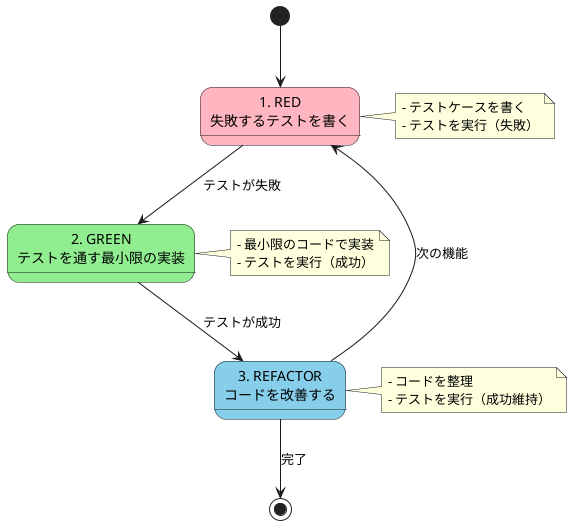
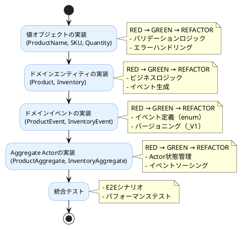

# 第3部 第5章：TDDによる複数集約の実装

## 概要

本章では、第4章で設計したドメインモデルを**テスト駆動開発（TDD）**で実装します。TDDの「Red-Green-Refactor」サイクルを繰り返しながら、段階的にProduct集約とInventory集約を構築していきます。

TDDで実装することで以下の利点が得られます：

1. **仕様の明確化**：テストが実行可能なドキュメントとなる
2. **リグレッション防止**：変更時の影響を即座に検知
3. **設計の改善**：テスタブルな設計が自然と生まれる
4. **安心感**：テストがあることで大胆なリファクタリングが可能

### TDDのサイクル



## 開発環境のセットアップ

### テストフレームワーク

このプロジェクトでは以下のテストツールを使用します：

- **ScalaTest**：Scala標準のテストフレームワーク
- **Pekko TestKit**：Actorのテストユーティリティ
- **In-Memory Journal**：テスト用の永続化レイヤー

### ビルド設定

```scala
// project/Dependencies.scala

val scalaTest = "org.scalatest" %% "scalatest" % "3.2.18" % Test
val pekkoActorTestkitTyped = "org.apache.pekko" %% "pekko-actor-testkit-typed" % pekkoVersion % Test
val pekkoStreamTestkit = "org.apache.pekko" %% "pekko-stream-testkit" % pekkoVersion % Test

// build.sbt
lazy val commandDomain = (project in file("modules/command/domain"))
  .settings(
    name := "command-domain",
    libraryDependencies ++= Seq(
      scalaTest
    )
  )

lazy val commandInterfaceAdapter = (project in file("modules/command/interface-adapter"))
  .settings(
    name := "command-interface-adapter",
    libraryDependencies ++= Seq(
      scalaTest,
      pekkoActorTestkitTyped,
      pekkoStreamTestkit
    )
  )
```

### テスト実行コマンド

```bash
# 全テストの実行
sbt test

# 特定モジュールのテスト
sbt "commandDomain/test"

# 特定のテストクラスを実行
sbt "testOnly io.github.j5ik2o.pcqrses.command.domain.products.ProductSpec"

# カバレッジ付きでテスト実行
sbt testCoverage
```

## TDD実践：Product集約の実装

Product集約をTDDで実装していきます。既存のUserAccount実装を参考にしながら、段階的に機能を追加します。

### ステップ1：値オブジェクトのテスト（ProductName）

#### RED：失敗するテストを書く

まず、ProductNameのテストを書きます。

```scala
// modules/command/domain/src/test/scala/io/github/j5ik2o/pcqrses/command/domain/products/ProductNameSpec.scala

package io.github.j5ik2o.pcqrses.command.domain.products

import org.scalatest.freespec.AnyFreeSpec
import org.scalatest.matchers.should.Matchers

class ProductNameSpec extends AnyFreeSpec with Matchers {

  "ProductName" - {
    "正常系" - {
      "有効な商品名で作成できる" in {
        val result = ProductName("テスト商品")
        result shouldBe a[Right[_, _]]
        result.map(_.value) shouldBe Right("テスト商品")
      }

      "200文字の商品名で作成できる" in {
        val longName = "あ" * 200
        val result = ProductName(longName)
        result shouldBe a[Right[_, _]]
      }
    }

    "異常系" - {
      "空文字列の場合エラーを返す" in {
        val result = ProductName("")
        result shouldBe a[Left[_, _]]
        result.left.map(_ shouldBe a[ProductNameError.InvalidLength])
      }

      "201文字以上の場合エラーを返す" in {
        val tooLongName = "あ" * 201
        val result = ProductName(tooLongName)
        result shouldBe a[Left[_, _]]
      }
    }
  }
}
```

この時点でテストを実行すると、`ProductName`クラスが存在しないため失敗します（RED）。

```bash
sbt "commandDomain/testOnly *ProductNameSpec"
# => コンパイルエラー
```

#### GREEN：テストを通す最小限の実装

テストを通すための最小限の実装を行います。

```scala
// modules/command/domain/src/main/scala/io/github/j5ik2o/pcqrses/command/domain/products/ProductName.scala

package io.github.j5ik2o.pcqrses.command.domain.products

final case class ProductName private (value: String)

object ProductName {
  def apply(value: String): Either[ProductNameError, ProductName] =
    if (value.nonEmpty && value.length <= 200)
      Right(new ProductName(value))
    else
      Left(ProductNameError.InvalidLength(value))
}

enum ProductNameError {
  case InvalidLength(value: String)
}
```

テストを再実行します。

```bash
sbt "commandDomain/testOnly *ProductNameSpec"
# => All tests passed!
```

テストが通りました（GREEN）。

#### REFACTOR：リファクタリング

この段階ではシンプルなので、リファクタリングは不要です。次のステップに進みます。

### ステップ2：SKU値オブジェクトのテスト

#### RED：テストを書く

```scala
// modules/command/domain/src/test/scala/io/github/j5ik2o/pcqrses/command/domain/products/SKUSpec.scala

package io.github.j5ik2o.pcqrses.command.domain.products

import org.scalatest.freespec.AnyFreeSpec
import org.scalatest.matchers.should.Matchers

class SKUSpec extends AnyFreeSpec with Matchers {

  "SKU" - {
    "正常系" - {
      "有効なSKUで作成できる" in {
        val result = SKU("PROD-001")
        result shouldBe a[Right[_, _]]
        result.map(_.value) shouldBe Right("PROD-001")
      }

      "大文字、数字、ハイフンのみを含む" in {
        val result = SKU("ABC-123-XYZ")
        result shouldBe a[Right[_, _]]
      }
    }

    "異常系" - {
      "小文字を含む場合エラーを返す" in {
        val result = SKU("prod-001")
        result shouldBe a[Left[_, _]]
      }

      "3文字以下の場合エラーを返す" in {
        val result = SKU("ABC")
        result shouldBe a[Left[_, _]]
      }

      "51文字以上の場合エラーを返す" in {
        val tooLong = "A" * 51
        val result = SKU(tooLong)
        result shouldBe a[Left[_, _]]
      }

      "特殊文字を含む場合エラーを返す" in {
        val result = SKU("PROD@001")
        result shouldBe a[Left[_, _]]
      }
    }
  }
}
```

#### GREEN：実装

```scala
// modules/command/domain/src/main/scala/io/github/j5ik2o/pcqrses/command/domain/products/SKU.scala

package io.github.j5ik2o.pcqrses.command.domain.products

final case class SKU private (value: String)

object SKU {
  def apply(value: String): Either[SKUError, SKU] =
    if (value.matches("^[A-Z0-9-]{4,50}$"))
      Right(new SKU(value))
    else
      Left(SKUError.InvalidFormat(value))
}

enum SKUError {
  case InvalidFormat(value: String)
}
```

テスト実行：

```bash
sbt "commandDomain/testOnly *SKUSpec"
# => All tests passed!
```

### ステップ3：Productエンティティのテスト

#### RED：ドメインロジックのテストを書く

```scala
// modules/command/domain/src/test/scala/io/github/j5ik2o/pcqrses/command/domain/products/ProductSpec.scala

package io.github.j5ik2o.pcqrses.command.domain.products

import io.github.j5ik2o.pcqrses.command.domain.basic.DateTime
import org.scalatest.freespec.AnyFreeSpec
import org.scalatest.matchers.should.Matchers
import org.scalatest.EitherValues

class ProductSpec extends AnyFreeSpec with Matchers with EitherValues {

  "Product" - {
    "商品の作成" - {
      "有効な値で商品を作成できる" in {
        val productId = ProductId.generate()
        val name = ProductName("テスト商品").value
        val sku = SKU("PROD-001").value
        val category = Category.食品類
        val description = "これはテスト商品です"
        val storageCondition = StorageCondition.常温
        val price = Price(BigDecimal(1000)).value

        val (product, event) = Product(
          productId, name, sku, category, description, storageCondition, price
        )

        product.id shouldBe productId
        product.productName shouldBe name
        product.sku shouldBe sku
        product.category shouldBe category
        product.storageCondition shouldBe storageCondition
        product.price shouldBe price
        product.isDiscontinued shouldBe false

        // イベントの検証
        event shouldBe a[ProductEvent.Created_V1]
        val createdEvent = event.asInstanceOf[ProductEvent.Created_V1]
        createdEvent.entityId shouldBe productId
        createdEvent.productName shouldBe name
      }
    }

    "商品情報の更新" - {
      "商品名と説明を更新できる" in {
        val (product, _) = createTestProduct()
        val newName = ProductName("更新後の商品名").value
        val newDescription = "更新後の説明"

        val result = product.updateInfo(newName, newDescription)

        result shouldBe a[Right[_, _]]
        val (updated, event) = result.value

        updated.productName shouldBe newName
        updated.description shouldBe newDescription
        event shouldBe a[ProductEvent.Updated_V1]
      }

      "廃止済み商品は更新できない" in {
        val (product, _) = createTestProduct()
        val (discontinued, _) = product.discontinue().value

        val newName = ProductName("更新後の商品名").value
        val result = discontinued.updateInfo(newName, "新しい説明")

        result shouldBe a[Left[_, _]]
        result.left.value shouldBe UpdateError.AlreadyDiscontinued
      }
    }

    "保管条件の変更" - {
      "保管条件を変更できる" in {
        val (product, _) = createTestProduct(storageCondition = StorageCondition.常温)
        val newCondition = StorageCondition.冷蔵

        val result = product.changeStorageCondition(newCondition)

        result shouldBe a[Right[_, _]]
        val (updated, event) = result.value

        updated.storageCondition shouldBe newCondition
        event shouldBe a[ProductEvent.StorageConditionChanged_V1]

        val changedEvent = event.asInstanceOf[ProductEvent.StorageConditionChanged_V1]
        changedEvent.oldCondition shouldBe StorageCondition.常温
        changedEvent.newCondition shouldBe newCondition
      }

      "同じ保管条件への変更はエラーになる" in {
        val (product, _) = createTestProduct(storageCondition = StorageCondition.常温)

        val result = product.changeStorageCondition(StorageCondition.常温)

        result shouldBe a[Left[_, _]]
        result.left.value shouldBe ChangeStorageConditionError.SameCondition
      }
    }

    "商品の廃止" - {
      "商品を廃止できる" in {
        val (product, _) = createTestProduct()

        val result = product.discontinue()

        result shouldBe a[Right[_, _]]
        val (discontinued, event) = result.value

        discontinued.isDiscontinued shouldBe true
        event shouldBe a[ProductEvent.Discontinued_V1]
      }

      "既に廃止済みの商品は廃止できない" in {
        val (product, _) = createTestProduct()
        val (discontinued, _) = product.discontinue().value

        val result = discontinued.discontinue()

        result shouldBe a[Left[_, _]]
        result.left.value shouldBe DiscontinueError.AlreadyDiscontinued
      }
    }
  }

  // テストヘルパー
  private def createTestProduct(
    id: ProductId = ProductId.generate(),
    name: ProductName = ProductName("テスト商品").value,
    sku: SKU = SKU("PROD-001").value,
    category: Category = Category.食品類,
    description: String = "テスト用商品",
    storageCondition: StorageCondition = StorageCondition.常温,
    price: Price = Price(BigDecimal(1000)).value
  ): (Product, ProductEvent) = {
    Product(id, name, sku, category, description, storageCondition, price)
  }
}
```

#### GREEN：Productエンティティの実装

```scala
// modules/command/domain/src/main/scala/io/github/j5ik2o/pcqrses/command/domain/products/Product.scala

package io.github.j5ik2o.pcqrses.command.domain.products

import io.github.j5ik2o.pcqrses.command.domain.basic.DateTime
import io.github.j5ik2o.pcqrses.command.domain.support.{DomainEventId, Entity}

trait Product extends Entity {
  override type IdType = ProductId
  def id: ProductId
  def productName: ProductName
  def sku: SKU
  def category: Category
  def description: String
  def storageCondition: StorageCondition
  def price: Price
  def isDiscontinued: Boolean
  def createdAt: DateTime
  def updatedAt: DateTime

  def updateInfo(
    newName: ProductName,
    newDescription: String
  ): Either[UpdateError, (Product, ProductEvent)]

  def changeStorageCondition(
    newCondition: StorageCondition
  ): Either[ChangeStorageConditionError, (Product, ProductEvent)]

  def changePrice(
    newPrice: Price
  ): Either[ChangePriceError, (Product, ProductEvent)]

  def discontinue(): Either[DiscontinueError, (Product, ProductEvent)]
}

object Product {
  def apply(
    id: ProductId,
    productName: ProductName,
    sku: SKU,
    category: Category,
    description: String,
    storageCondition: StorageCondition,
    price: Price
  ): (Product, ProductEvent) = {
    val product = ProductImpl(
      id = id,
      productName = productName,
      sku = sku,
      category = category,
      description = description,
      storageCondition = storageCondition,
      price = price,
      isDiscontinued = false,
      createdAt = DateTime.now(),
      updatedAt = DateTime.now()
    )
    val event = ProductEvent.Created_V1(
      id = DomainEventId.generate(),
      entityId = id,
      productName = productName,
      sku = sku,
      category = category,
      description = description,
      storageCondition = storageCondition,
      price = price,
      occurredAt = DateTime.now()
    )
    (product, event)
  }

  private final case class ProductImpl(
    id: ProductId,
    productName: ProductName,
    sku: SKU,
    category: Category,
    description: String,
    storageCondition: StorageCondition,
    price: Price,
    isDiscontinued: Boolean,
    createdAt: DateTime,
    updatedAt: DateTime
  ) extends Product {

    override def updateInfo(
      newName: ProductName,
      newDescription: String
    ): Either[UpdateError, (Product, ProductEvent)] = {
      if (isDiscontinued) {
        Left(UpdateError.AlreadyDiscontinued)
      } else {
        val updated = this.copy(
          productName = newName,
          description = newDescription,
          updatedAt = DateTime.now()
        )
        val event = ProductEvent.Updated_V1(
          id = DomainEventId.generate(),
          entityId = id,
          productName = newName,
          description = newDescription,
          occurredAt = DateTime.now()
        )
        Right((updated, event))
      }
    }

    override def changeStorageCondition(
      newCondition: StorageCondition
    ): Either[ChangeStorageConditionError, (Product, ProductEvent)] = {
      if (isDiscontinued) {
        Left(ChangeStorageConditionError.AlreadyDiscontinued)
      } else if (storageCondition == newCondition) {
        Left(ChangeStorageConditionError.SameCondition)
      } else {
        val updated = this.copy(
          storageCondition = newCondition,
          updatedAt = DateTime.now()
        )
        val event = ProductEvent.StorageConditionChanged_V1(
          id = DomainEventId.generate(),
          entityId = id,
          oldCondition = storageCondition,
          newCondition = newCondition,
          occurredAt = DateTime.now()
        )
        Right((updated, event))
      }
    }

    override def changePrice(
      newPrice: Price
    ): Either[ChangePriceError, (Product, ProductEvent)] = {
      if (isDiscontinued) {
        Left(ChangePriceError.AlreadyDiscontinued)
      } else if (price == newPrice) {
        Left(ChangePriceError.SamePrice)
      } else {
        val updated = this.copy(
          price = newPrice,
          updatedAt = DateTime.now()
        )
        val event = ProductEvent.PriceChanged_V1(
          id = DomainEventId.generate(),
          entityId = id,
          oldPrice = price,
          newPrice = newPrice,
          occurredAt = DateTime.now()
        )
        Right((updated, event))
      }
    }

    override def discontinue(): Either[DiscontinueError, (Product, ProductEvent)] = {
      if (isDiscontinued) {
        Left(DiscontinueError.AlreadyDiscontinued)
      } else {
        val updated = this.copy(
          isDiscontinued = true,
          updatedAt = DateTime.now()
        )
        val event = ProductEvent.Discontinued_V1(
          id = DomainEventId.generate(),
          entityId = id,
          occurredAt = DateTime.now()
        )
        Right((updated, event))
      }
    }
  }
}

// エラー型
enum UpdateError {
  case AlreadyDiscontinued
}

enum ChangeStorageConditionError {
  case AlreadyDiscontinued
  case SameCondition
}

enum ChangePriceError {
  case AlreadyDiscontinued
  case SamePrice
}

enum DiscontinueError {
  case AlreadyDiscontinued
}
```

テスト実行：

```bash
sbt "commandDomain/testOnly *ProductSpec"
# => All tests passed!
```

### ステップ4：ProductAggregate Actorのテスト

#### RED：Actorのテストを書く

```scala
// modules/command/interface-adapter/src/test/scala/io/github/j5ik2o/pcqrses/command/interfaceAdapter/aggregate/products/ProductTestHelper.scala

package io.github.j5ik2o.pcqrses.command.interfaceAdapter.aggregate.products

import io.github.j5ik2o.pcqrses.command.domain.products._
import io.github.j5ik2o.pcqrses.command.interfaceAdapter.aggregate.products.ProductProtocol._
import io.github.j5ik2o.pcqrses.command.interfaceAdapter.test.ActorSpec
import org.apache.pekko.actor.testkit.typed.scaladsl.TestProbe
import org.scalatest.matchers.should.Matchers

trait ProductTestHelper { this: ActorSpec & Matchers =>
  def sendCommand[Reply](
    productId: ProductId,
    createCommand: ProductId => Command,
    probe: TestProbe[Reply]
  ): Unit

  /**
   * テストヘルパー: 商品を作成する
   */
  protected def createProduct(
    productId: ProductId = ProductId.generate(),
    productName: ProductName = ProductName("テスト商品").toOption.get,
    sku: SKU = SKU("PROD-001").toOption.get,
    category: Category = Category.食品類,
    description: String = "テスト用商品",
    storageCondition: StorageCondition = StorageCondition.常温,
    price: Price = Price(BigDecimal(1000)).toOption.get
  ): CreateSucceeded = {
    val probe = createTestProbe[CreateReply]()
    sendCommand(
      productId,
      id => Create(id, productName, sku, category, description, storageCondition, price, probe.ref),
      probe
    )
    probe.expectMessageType[CreateSucceeded]
  }

  /**
   * テストヘルパー: 商品が未作成の状態でCreateコマンドを受信したときのテスト
   */
  protected def testCreateProductOnNotCreated(): Unit = {
    val productId = ProductId.generate()
    val name = ProductName("新商品").toOption.get
    val sku = SKU("NEW-001").toOption.get
    val category = Category.食品類
    val description = "新しい商品"
    val storageCondition = StorageCondition.常温
    val price = Price(BigDecimal(1500)).toOption.get

    val probe = createTestProbe[CreateReply]()
    sendCommand(
      productId,
      id => Create(id, name, sku, category, description, storageCondition, price, probe.ref),
      probe
    )

    val reply = probe.expectMessageType[CreateSucceeded]
    reply.id shouldBe productId
  }

  /**
   * テストヘルパー: 作成済み商品にGetコマンドを送信したときのテスト
   */
  protected def testGetProductOnCreated(): Unit = {
    val productId = ProductId.generate()
    val name = ProductName("取得テスト商品").toOption.get
    val sku = SKU("GET-001").toOption.get
    val price = Price(BigDecimal(2000)).toOption.get

    // まず商品を作成
    createProduct(productId, name, sku, price = price)

    // Getコマンドを送信
    val getProbe = createTestProbe[GetReply]()
    sendCommand(
      productId,
      id => Get(id, getProbe.ref),
      getProbe
    )

    val reply = getProbe.expectMessageType[GetSucceeded]
    reply.product.id shouldBe productId
    reply.product.productName shouldBe name
    reply.product.sku shouldBe sku
    reply.product.price shouldBe price
  }

  /**
   * テストヘルパー: 保管条件を変更するテスト
   */
  protected def testChangeStorageConditionOnCreated(): Unit = {
    val productId = ProductId.generate()
    val originalCondition = StorageCondition.常温

    // まず商品を作成
    createProduct(productId, storageCondition = originalCondition)

    // 保管条件変更コマンドを送信
    val changeProbe = createTestProbe[ChangeStorageConditionReply]()
    val newCondition = StorageCondition.冷蔵
    sendCommand(
      productId,
      id => ChangeStorageCondition(id, newCondition, changeProbe.ref),
      changeProbe
    )

    val reply = changeProbe.expectMessageType[ChangeStorageConditionSucceeded]
    reply.id shouldBe productId

    // 変更されたことを確認
    val getProbe = createTestProbe[GetReply]()
    sendCommand(
      productId,
      id => Get(id, getProbe.ref),
      getProbe
    )

    val getReply = getProbe.expectMessageType[GetSucceeded]
    getReply.product.storageCondition shouldBe newCondition
  }

  /**
   * テストヘルパー: 商品を廃止するテスト
   */
  protected def testDiscontinueProductOnCreated(): Unit = {
    val productId = ProductId.generate()

    // まず商品を作成
    createProduct(productId)

    // 廃止コマンドを送信
    val discontinueProbe = createTestProbe[DiscontinueReply]()
    sendCommand(
      productId,
      id => Discontinue(id, discontinueProbe.ref),
      discontinueProbe
    )

    val reply = discontinueProbe.expectMessageType[DiscontinueSucceeded]
    reply.id shouldBe productId

    // 廃止後に取得すると、isDiscontinuedがtrueになることを確認
    val getProbe = createTestProbe[GetReply]()
    sendCommand(
      productId,
      id => Get(id, getProbe.ref),
      getProbe
    )

    val getReply = getProbe.expectMessageType[GetSucceeded]
    getReply.product.isDiscontinued shouldBe true
  }

  /**
   * テストヘルパー: 未作成の商品にGetコマンドを送信したときのテスト
   */
  protected def testGetProductOnNotCreated(): Unit = {
    val productId = ProductId.generate()

    val probe = createTestProbe[GetReply]()
    sendCommand(
      productId,
      id => Get(id, probe.ref),
      probe
    )

    val reply = probe.expectMessageType[GetNotFoundFailed]
    reply.id shouldBe productId
  }
}
```

```scala
// modules/command/interface-adapter/src/test/scala/io/github/j5ik2o/pcqrses/command/interfaceAdapter/aggregate/products/ProductAggregateSpec.scala

package io.github.j5ik2o.pcqrses.command.interfaceAdapter.aggregate.products

import com.typesafe.config.{Config, ConfigFactory}
import io.github.j5ik2o.pcqrses.command.domain.products.ProductId
import io.github.j5ik2o.pcqrses.command.interfaceAdapter.aggregate.products.ProductProtocol.Command
import io.github.j5ik2o.pcqrses.command.interfaceAdapter.test.ActorSpec
import org.apache.pekko.actor.testkit.typed.scaladsl.TestProbe
import org.scalatest.BeforeAndAfterAll
import org.scalatest.concurrent.Eventually
import org.scalatest.matchers.should.Matchers

import java.nio.file.Files
import java.util.{Comparator, UUID}

object ProductAggregateSpec {
  val id: String = UUID.randomUUID().toString

  val config: Config = ConfigFactory
    .parseString(
      s"""
       |pekko {
       |  persistence {
       |    journal {
       |      plugin = "pekko.persistence.journal.inmem"
       |      inmem {
       |        class = "org.apache.pekko.persistence.journal.inmem.InmemJournal"
       |        plugin-dispatcher = "pekko.actor.default-dispatcher"
       |      }
       |    }
       |    snapshot-store {
       |      plugin = "pekko.persistence.snapshot-store.local"
       |      local {
       |        dir = "target/snapshot/$id"
       |      }
       |    }
       |  }
       |  test {
       |    single-expect-default = 5s
       |  }
       |}
       |""".stripMargin
    )
    .withFallback(ConfigFactory.load())
}

class ProductAggregateSpec
  extends ActorSpec(ProductAggregateSpec.config)
  with ProductTestHelper
  with Matchers
  with Eventually
  with BeforeAndAfterAll {

  override def afterAll(): Unit = {
    super.afterAll()
    val snapshotDir = new java.io.File(s"target/snapshot/${ProductAggregateSpec.id}")
    if (snapshotDir.exists()) {
      Files
        .walk(snapshotDir.toPath)
        .sorted(Comparator.reverseOrder())
        .forEach(Files.delete(_))
    }
  }

  /**
   * 直接spawnしたアクターにコマンドを送信
   */
  override def sendCommand[Reply](
    productId: ProductId,
    createCommand: ProductId => Command,
    probe: TestProbe[Reply]
  ): Unit = {
    val aggregate = spawn(ProductAggregate(productId))
    aggregate ! createCommand(productId)
  }

  "ProductAggregate" - {
    "商品が未作成の状態" - {
      "Createコマンドを受信したとき" - {
        "新しい商品を作成できる" in
          testCreateProductOnNotCreated()
      }

      "Getコマンドを受信したとき" - {
        "NotFoundを返す" in
          testGetProductOnNotCreated()
      }
    }

    "商品が作成済みの状態" - {
      "Getコマンドを受信したとき" - {
        "商品情報を返す" in
          testGetProductOnCreated()
      }

      "ChangeStorageConditionコマンドを受信したとき" - {
        "保管条件を変更できる" in
          testChangeStorageConditionOnCreated()
      }

      "Discontinueコマンドを受信したとき" - {
        "商品を廃止できる" in
          testDiscontinueProductOnCreated()
      }
    }
  }
}
```

#### GREEN：ProductAggregateの実装

ProductAggregateStateとProductAggregateを実装します（実装コードは第4章の設計に基づきます）。

テスト実行：

```bash
sbt "commandInterfaceAdapter/testOnly *ProductAggregateSpec"
# => All tests passed!
```

### TDDのメリットを実感する

これまでのTDDサイクルで以下が得られました：

1. **テストが仕様書になる**：`testCreateProductOnNotCreated`などのテストが、商品作成の仕様を明確に示している
2. **安心してリファクタリングできる**：内部実装を変更してもテストがあるので安心
3. **バグの早期発見**：例えば、廃止済み商品の更新を防ぐロジックがテストで検証されている

## TDD実践：Inventory集約の実装（概要）

Inventory集約も同様のTDDサイクルで実装します。ここでは重要なテストケースを示します。

### Quantity値オブジェクトのテスト

```scala
class QuantitySpec extends AnyFreeSpec with Matchers with EitherValues {

  "Quantity" - {
    "正常系" - {
      "0以上の数値で作成できる" in {
        val result = Quantity(100)
        result shouldBe a[Right[_, _]]
        result.value.value shouldBe 100
      }

      "0で作成できる" in {
        val result = Quantity(0)
        result shouldBe a[Right[_, _]]
        result.value.value shouldBe 0
      }
    }

    "異常系" - {
      "負の数値の場合エラーを返す" in {
        val result = Quantity(-1)
        result shouldBe a[Left[_, _]]
        result.left.value shouldBe QuantityError.Negative(-1)
      }
    }

    "演算" - {
      "加算ができる" in {
        val q1 = Quantity(10).value
        val q2 = Quantity(20).value
        val result = q1 + q2
        result.value shouldBe 30
      }

      "減算ができる（結果が非負の場合）" in {
        val q1 = Quantity(20).value
        val q2 = Quantity(10).value
        val result = q1 - q2
        result shouldBe a[Right[_, _]]
        result.value.value shouldBe 10
      }

      "減算で負になる場合はエラーを返す" in {
        val q1 = Quantity(10).value
        val q2 = Quantity(20).value
        val result = q1 - q2
        result shouldBe a[Left[_, _]]
        result.left.value shouldBe QuantityError.NegativeResult
      }
    }
  }
}
```

### Inventoryエンティティの重要なテスト

```scala
class InventorySpec extends AnyFreeSpec with Matchers with EitherValues {

  "Inventory" - {
    "在庫の入庫" - {
      "在庫を増やせる" in {
        val (inventory, _) = createTestInventory(quantityOnHand = Quantity(100).value)
        val receiveQty = Quantity(50).value
        val unitPrice = Price(BigDecimal(500)).value

        val result = inventory.receive(receiveQty, unitPrice, "山田太郎")

        result shouldBe a[Right[_, _]]
        val (updated, event) = result.value

        updated.quantityOnHand.value shouldBe 150
        event shouldBe a[InventoryEvent.StockReceived_V1]
      }
    }

    "在庫の出庫" - {
      "有効在庫がある場合は出庫できる" in {
        val (inventory, _) = createTestInventory(
          quantityOnHand = Quantity(100).value,
          quantityReserved = Quantity(20).value
        )
        val issueQty = Quantity(30).value
        val unitPrice = Price(BigDecimal(500)).value

        val result = inventory.issue(issueQty, unitPrice, "鈴木花子")

        result shouldBe a[Right[_, _]]
        val (updated, _) = result.value

        updated.quantityOnHand.value shouldBe 70
        // 有効在庫 = 100 - 20 = 80 から 30 出庫したので、
        // 現在庫 = 70、引当済 = 20、有効在庫 = 50
        updated.quantityAvailable.value shouldBe 50
      }

      "有効在庫が不足している場合はエラーを返す" in {
        val (inventory, _) = createTestInventory(
          quantityOnHand = Quantity(100).value,
          quantityReserved = Quantity(90).value
        )
        // 有効在庫 = 100 - 90 = 10
        val issueQty = Quantity(20).value  // 10より多い
        val unitPrice = Price(BigDecimal(500)).value

        val result = inventory.issue(issueQty, unitPrice, "佐藤一郎")

        result shouldBe a[Left[_, _]]
        result.left.value shouldBe a[IssueError.InsufficientStock]
      }
    }

    "在庫引当" - {
      "有効在庫がある場合は引当できる" in {
        val (inventory, _) = createTestInventory(
          quantityOnHand = Quantity(100).value,
          quantityReserved = Quantity(20).value
        )
        val reserveQty = Quantity(30).value

        val result = inventory.reserve(reserveQty, "高橋次郎")

        result shouldBe a[Right[_, _]]
        val (updated, _) = result.value

        updated.quantityReserved.value shouldBe 50
        updated.quantityAvailable.value shouldBe 50
      }

      "有効在庫が不足している場合はエラーを返す" in {
        val (inventory, _) = createTestInventory(
          quantityOnHand = Quantity(100).value,
          quantityReserved = Quantity(95).value
        )
        val reserveQty = Quantity(10).value

        val result = inventory.reserve(reserveQty, "田中三郎")

        result shouldBe a[Left[_, _]]
        result.left.value shouldBe a[ReserveError.InsufficientStock]
      }
    }

    "区画間移動" - {
      "保管条件が一致する場合は移動できる" in {
        val (inventory, _) = createTestInventory()
        val newZoneNumber = ZoneNumber("ZONE-TOKYO-NORMAL").toOption.get
        val newZoneType = ZoneType.常温
        val storageCondition = StorageCondition.常温

        val result = inventory.transferZone(
          newZoneNumber, newZoneType, storageCondition, "中村四郎"
        )

        result shouldBe a[Right[_, _]]
        val (updated, event) = result.value

        updated.zoneNumber shouldBe newZoneNumber
        event shouldBe a[InventoryEvent.ZoneTransferred_V1]
      }

      "保管条件が一致しない場合はエラーを返す" in {
        val (inventory, _) = createTestInventory()
        val newZoneNumber = ZoneNumber("ZONE-TOKYO-FROZEN").toOption.get
        val newZoneType = ZoneType.冷凍
        val storageCondition = StorageCondition.常温  // 商品は常温だが、区画は冷凍

        val result = inventory.transferZone(
          newZoneNumber, newZoneType, storageCondition, "小林五郎"
        )

        result shouldBe a[Left[_, _]]
        result.left.value shouldBe a[TransferZoneError.IncompatibleStorageCondition]
      }
    }
  }

  // テストヘルパー
  private def createTestInventory(
    warehouseCode: WarehouseCode = WarehouseCode("WH-TOKYO").toOption.get,
    productId: ProductId = ProductId.generate(),
    zoneNumber: ZoneNumber = ZoneNumber("ZONE-TOKYO-NORMAL").toOption.get,
    quantityOnHand: Quantity = Quantity(100).value,
    quantityReserved: Quantity = Quantity(0).value
  ): (Inventory, InventoryEvent) = {
    val inventoryValue = InventoryValue(BigDecimal(50000)).toOption.get
    Inventory(warehouseCode, productId, zoneNumber, quantityOnHand, inventoryValue)
  }
}
```

## テストカバレッジの確認

```bash
# カバレッジレポートの生成
sbt clean coverage test coverageReport

# レポートの確認
open modules/command/domain/target/scala-3.6.2/scoverage-report/index.html
```

カバレッジ目標：
- **ドメイン層**：90%以上
- **Actor層**：80%以上
- **全体**：80%以上

## まとめ

本章では、TDDで複数集約を実装しました。

### TDDで得られたもの

1. **実行可能な仕様書**
   - テストコードがそのまま仕様書として機能
   - 新しいメンバーもテストを読めば仕様が理解できる

2. **安心感のあるリファクタリング**
   - テストがあるので内部実装を大胆に変更できる
   - レグレッションを即座に検知

3. **設計の改善**
   - テストしやすい設計が自然と生まれる
   - 責務の分離が明確になる

4. **バグの早期発見**
   - ビジネスルール違反をテストで検証
   - 例：在庫のマイナス禁止、保管条件の整合性チェック

### TDDのサイクルの振り返り



### 次章への展開

- **第6章**：Sagaパターン（参考情報）
- **第7章**：在庫引当の競合制御（楽観的ロックのテスト実装）
- **第8章**：複雑なクエリの実装

TDDで実装することで、各章で追加する機能も安心して開発できます。テストファーストで進めることで、仕様が明確になり、バグの少ない堅牢なシステムが構築できます。

## 参考：テストの実行とデバッグ

### 個別テストの実行

```bash
# 特定のテストクラスを実行
sbt "testOnly *ProductNameSpec"

# 特定のテストケースを実行
sbt "testOnly *ProductSpec -- -z '商品の作成'"

# 並列実行を無効化（デバッグ時）
sbt "set Test / parallelExecution := false" test
```

### デバッグ実行

```bash
# デバッグモードでテストを実行
sbt -jvm-debug 5005 "testOnly *ProductAggregateSpec"
```

IDEでポート5005に接続してデバッグできます。

### テストの命名規則

- **テストクラス名**：`*Spec`
- **テストヘルパー**：`*TestHelper`
- **テストメソッド**：日本語で振る舞いを記述

これにより、テストが読みやすく、メンテナンスしやすくなります。

## 付録：実装時のモジュール配置一覧

TDDで実装を進める際の参考として、モジュール構成の全体像を示します。

### モジュール構成

```
modules/
├── command/                          # コマンド側（書き込みモデル）
│   ├── domain/                       # ドメイン層
│   │   ├── src/
│   │   │   ├── main/scala/
│   │   │   │   └── io/github/j5ik2o/pcqrses/command/domain/
│   │   │   │       ├── support/      # 共通基盤
│   │   │   │       │   ├── Entity.scala
│   │   │   │       │   ├── EntityId.scala
│   │   │   │       │   ├── DomainEvent.scala
│   │   │   │       │   └── DomainEventId.scala
│   │   │   │       ├── basic/        # 基本型
│   │   │   │       │   └── DateTime.scala
│   │   │   │       ├── products/     # Product集約
│   │   │   │       │   ├── Product.scala
│   │   │   │       │   ├── ProductId.scala
│   │   │   │       │   ├── ProductName.scala
│   │   │   │       │   ├── SKU.scala
│   │   │   │       │   ├── Category.scala
│   │   │   │       │   ├── StorageCondition.scala
│   │   │   │       │   ├── Price.scala
│   │   │   │       │   └── ProductEvent.scala
│   │   │   │       ├── customers/    # Customer集約
│   │   │   │       │   ├── Customer.scala
│   │   │   │       │   ├── CustomerId.scala
│   │   │   │       │   ├── CustomerName.scala
│   │   │   │       │   ├── CustomerType.scala
│   │   │   │       │   └── CustomerEvent.scala
│   │   │   │       ├── warehouses/   # Warehouse集約
│   │   │   │       │   ├── Warehouse.scala
│   │   │   │       │   ├── WarehouseCode.scala
│   │   │   │       │   ├── WarehouseName.scala
│   │   │   │       │   └── WarehouseEvent.scala
│   │   │   │       ├── zones/        # WarehouseZone集約
│   │   │   │       │   ├── WarehouseZone.scala
│   │   │   │       │   ├── WarehouseZoneId.scala
│   │   │   │       │   ├── ZoneNumber.scala
│   │   │   │       │   ├── ZoneType.scala
│   │   │   │       │   └── WarehouseZoneEvent.scala
│   │   │   │       └── inventories/  # Inventory集約
│   │   │   │           ├── Inventory.scala
│   │   │   │           ├── InventoryId.scala
│   │   │   │           ├── Quantity.scala
│   │   │   │           ├── InventoryValue.scala
│   │   │   │           └── InventoryEvent.scala
│   │   │   └── test/scala/          # ドメイン層のテスト
│   │   │       └── io/github/j5ik2o/pcqrses/command/domain/
│   │   │           ├── products/
│   │   │           │   ├── ProductSpec.scala
│   │   │           │   ├── ProductNameSpec.scala
│   │   │           │   ├── SKUSpec.scala
│   │   │           │   └── PriceSpec.scala
│   │   │           └── inventories/
│   │   │               ├── InventorySpec.scala
│   │   │               ├── QuantitySpec.scala
│   │   │               └── InventoryValueSpec.scala
│   │
│   ├── use-case/                     # ユースケース層
│   │   └── src/main/scala/
│   │       └── io/github/j5ik2o/pcqrses/command/useCase/
│   │           ├── products/
│   │           │   ├── ProductUseCase.scala
│   │           │   └── ProductUseCaseImpl.scala
│   │           ├── customers/
│   │           ├── warehouses/
│   │           ├── zones/
│   │           └── inventories/
│   │               ├── InventoryUseCase.scala
│   │               └── InventoryUseCaseImpl.scala
│   │
│   ├── interface-adapter-contract/   # Protobuf定義
│   │   └── src/main/protobuf/
│   │       ├── basic/
│   │       │   └── basic.proto
│   │       ├── products/
│   │       │   ├── product_event.proto
│   │       │   └── product_snapshot.proto
│   │       ├── customers/
│   │       │   ├── customer_event.proto
│   │       │   └── customer_snapshot.proto
│   │       ├── warehouses/
│   │       │   ├── warehouse_event.proto
│   │       │   └── warehouse_snapshot.proto
│   │       ├── zones/
│   │       │   ├── zone_event.proto
│   │       │   └── zone_snapshot.proto
│   │       └── inventories/
│   │           ├── inventory_event.proto
│   │           └── inventory_snapshot.proto
│   │
│   ├── interface-adapter-event-serializer/  # イベントシリアライザー
│   │   ├── src/
│   │   │   ├── main/scala/
│   │   │   │   └── io/github/j5ik2o/pcqrses/command/interfaceAdapter/serialization/
│   │   │   │       ├── ProductEventSerializer.scala
│   │   │   │       ├── CustomerEventSerializer.scala
│   │   │   │       ├── WarehouseEventSerializer.scala
│   │   │   │       ├── WarehouseZoneEventSerializer.scala
│   │   │   │       └── InventoryEventSerializer.scala
│   │   │   └── test/scala/         # シリアライザーのテスト
│   │   │       └── io/github/j5ik2o/pcqrses/command/interfaceAdapter/serialization/
│   │   │           ├── ProductEventSerializerSpec.scala
│   │   │           └── InventoryEventSerializerSpec.scala
│   │
│   └── interface-adapter/            # アクターとエンドポイント
│       ├── src/
│       │   ├── main/scala/
│       │   │   └── io/github/j5ik2o/pcqrses/command/interfaceAdapter/
│       │   │       ├── aggregate/    # Aggregate Actors
│       │   │       │   ├── products/
│       │   │       │   │   ├── ProductProtocol.scala
│       │   │       │   │   ├── ProductAggregateState.scala
│       │   │       │   │   └── ProductAggregate.scala
│       │   │       │   ├── customers/
│       │   │       │   │   ├── CustomerProtocol.scala
│       │   │       │   │   ├── CustomerAggregateState.scala
│       │   │       │   │   └── CustomerAggregate.scala
│       │   │       │   ├── warehouses/
│       │   │       │   ├── zones/
│       │   │       │   └── inventories/
│       │   │       │       ├── InventoryProtocol.scala
│       │   │       │       ├── InventoryAggregateState.scala
│       │   │       │       └── InventoryAggregate.scala
│       │   │       ├── http/
│       │   │       │   └── graphql/  # GraphQL API
│       │   │       │       ├── schema/
│       │   │       │       └── resolvers/
│       │   │       └── contract/
│       │   │           └── users/
│       │   │               └── UserAccountProtocol.scala
│       │   └── test/scala/          # Actor層のテスト
│       │       └── io/github/j5ik2o/pcqrses/command/interfaceAdapter/
│       │           ├── test/
│       │           │   └── ActorSpec.scala
│       │           └── aggregate/
│       │               ├── products/
│       │               │   ├── ProductTestHelper.scala
│       │               │   └── ProductAggregateSpec.scala
│       │               └── inventories/
│       │                   ├── InventoryTestHelper.scala
│       │                   └── InventoryAggregateSpec.scala
│
└── query/                            # クエリ側（読み取りモデル）
    ├── flyway-migration/             # データベースマイグレーション
    │   └── src/main/resources/db/migration/
    │       ├── V1__create_companies_table.sql
    │       ├── V2__create_products_table.sql
    │       ├── V3__create_customers_table.sql
    │       ├── V4__create_warehouses_table.sql
    │       ├── V5__create_warehouse_zones_table.sql
    │       ├── V6__create_inventories_table.sql
    │       └── V7__create_inventory_transactions_table.sql
    │
    └── interface-adapter/            # GraphQL API（クエリ側）
        └── src/
            ├── main/scala/
            │   └── io/github/j5ik2o/pcqrses/query/interfaceAdapter/
            │       ├── dao/          # Slick DAO
            │       │   ├── CompanyDao.scala
            │       │   ├── ProductDao.scala
            │       │   ├── CustomerDao.scala
            │       │   ├── WarehouseDao.scala
            │       │   ├── WarehouseZoneDao.scala
            │       │   ├── InventoryDao.scala
            │       │   └── InventoryTransactionDao.scala
            │       └── graphql/      # GraphQLスキーマとリゾルバー
            │           ├── schema/
            │           │   ├── CompanySchema.scala
            │           │   ├── ProductSchema.scala
            │           │   ├── CustomerSchema.scala
            │           │   ├── WarehouseSchema.scala
            │           │   ├── WarehouseZoneSchema.scala
            │           │   ├── InventorySchema.scala
            │           │   └── GraphQLSchema.scala
            │           └── GraphQLService.scala
            └── test/scala/
                └── io/github/j5ik2o/pcqrses/query/interfaceAdapter/
                    └── graphql/
                        ├── GraphQLServiceSpec.scala
                        └── schema/
                            └── GraphQLSchemaSpec.scala
```

### apps（アプリケーション）

```
apps/
├── command-api/                      # コマンド側HTTP/gRPCサーバー
│   └── src/main/scala/
│       └── io/github/j5ik2o/pcqrses/apps/commandApi/
│           └── Main.scala
│
├── query-api/                        # クエリ側GraphQLサーバー
│   └── src/main/scala/
│       └── io/github/j5ik2o/pcqrses/apps/queryApi/
│           └── Main.scala
│
└── read-model-updater/               # イベントプロセッサ
    └── src/main/scala/
        └── io/github/j5ik2o/pcqrses/apps/readModelUpdater/
            └── Main.scala
```

### 実装の順序（TDDサイクル）

上記のモジュール構成に従って、以下の順序で実装を進めます：

1. **ドメイン層のテストと実装**
   - 値オブジェクト（RED → GREEN → REFACTOR）
   - エンティティ（RED → GREEN → REFACTOR）
   - ドメインイベント（RED → GREEN → REFACTOR）

2. **Protobuf定義**
   - イベントとスナップショットの.protoファイル
   - `sbt compile` でScalaコードを自動生成

3. **イベントシリアライザーのテストと実装**
   - シリアライザーのテスト（RED → GREEN → REFACTOR）
   - シリアライズ/デシリアライズの実装

4. **Aggregate Actorのテストと実装**
   - TestHelperの作成
   - AggregateStateのテスト（RED → GREEN → REFACTOR）
   - Aggregateのテスト（RED → GREEN → REFACTOR）

5. **ユースケース層**
   - UseCaseのテストと実装

6. **GraphQL API**
   - スキーマ定義
   - リゾルバーのテストと実装

7. **クエリ側**
   - DAOの生成（sbt-dao-generator）
   - GraphQLスキーマとリゾルバー

この構成により、TDDサイクルを回しながら段階的に在庫管理システムを構築できます。各モジュールは疎結合で、独立してテスト可能な設計になっています。
