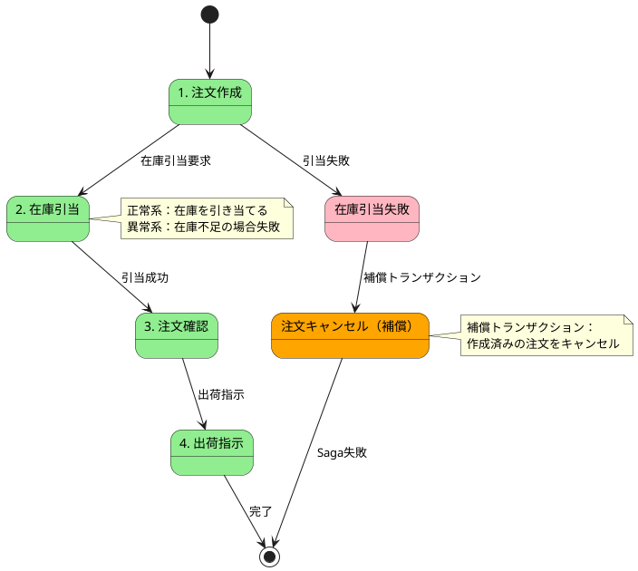
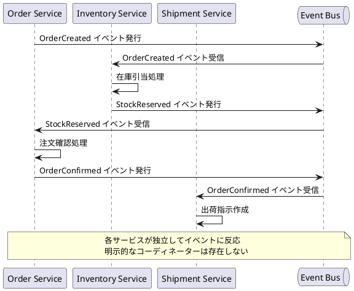
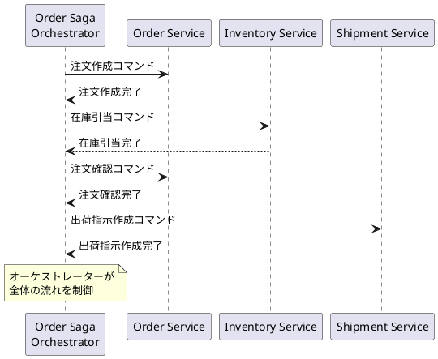
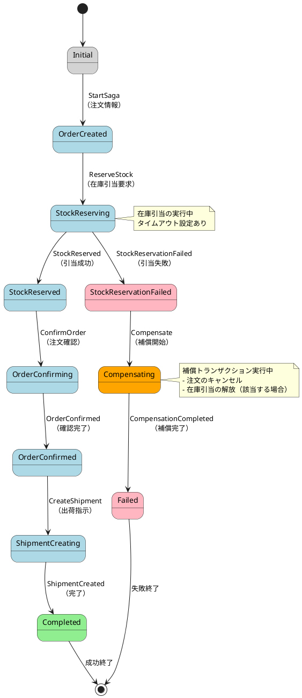

# 第3部 第6章：Sagaパターン（参考）

> **注意**: この章は参考情報です。今回の在庫管理サービスでは在庫引当の競合制御に重点を置き、Sagaパターンの詳細実装はスコープ外としています。Sagaパターンの基本概念と実装パターンを理解するための資料として活用してください。

## この章で学ぶこと

- Sagaパターンの基本概念とユースケース
- ChoreographyとOrchestrationの違い
- Apache PekkoにおけるSaga実装パターン
- 補償トランザクション（Compensating Transaction）の設計
- 在庫管理における注文プロセスのSaga設計例

---

## 6.1 Sagaパターンの基礎

### 6.1.1 Long Running Transactionの課題

分散システムにおいて、複数のサービスやアグリゲートにまたがるビジネストランザクションを実現することは困難です。従来のACIDトランザクションは、単一データベース内でのみ機能し、分散環境には適用できません。

#### 従来のACIDトランザクションの限界

在庫管理システムで「注文」を処理する場合を考えます：

1. **注文の作成**（Order集約）
2. **在庫の引当**（Inventory集約）
3. **出荷指示の作成**（Shipment集約）

これらが異なるアグリゲートや、場合によっては異なるサービスに分散している場合、従来のトランザクション制御では以下の問題が発生します：

```
問題1：分散トランザクションの複雑性
- 2フェーズコミット（2PC）は実装が複雑でパフォーマンスに影響
- ネットワーク障害やタイムアウトへの対処が困難

問題2：長時間実行トランザクション
- 注文処理に数秒〜数分かかる場合、ロックを保持し続けることになる
- システムのスループットが低下

問題3：集約の独立性の喪失
- 複数集約をまたぐトランザクションは、集約の独立性を損なう
- イベントソーシングの原則に反する
```

#### 結果整合性（Eventual Consistency）の採用

これらの課題を解決するため、分散システムでは**結果整合性**を採用します：

- 各操作を独立したトランザクションとして実行
- 最終的に全体として整合性が取れる状態を目指す
- 一時的な不整合を許容する

しかし、結果整合性だけでは**ビジネス整合性**を保証できません。そこで**Sagaパターン**が必要になります。

### 6.1.2 Sagaパターンとは

**Saga**は、分散トランザクションをローカルトランザクションのシーケンスとして実現するパターンです。各ローカルトランザクションは、データベースを更新し、次のステップのトリガーとなるイベントを発行します。

#### Sagaの基本原則

```
原則1：ローカルトランザクションのシーケンス
  - 各ステップは独立したトランザクション
  - 前のステップの完了が次のステップのトリガー

原則2：補償トランザクション（Compensating Transaction）
  - 各ステップには「取り消し」操作が対応
  - 失敗時に既に完了したステップを巻き戻す

原則3：イベント駆動
  - ステップ間の連携はイベントで実現
  - 疎結合を維持
```

#### Sagaのステップ例

注文処理のSagaを例にします：



**正常系フロー**：
1. 注文を作成（OrderCreated）
2. 在庫を引き当てる（StockReserved）
3. 注文を確認（OrderConfirmed）
4. 出荷指示を作成（ShipmentCreated）

**異常系フロー**：
1. 注文を作成（OrderCreated）
2. 在庫引当に失敗（StockReservationFailed）
3. **補償トランザクション**：注文をキャンセル（OrderCancelled）

### 6.1.3 ChoreographyとOrchestration

Sagaを実装する方法には、**Choreography**（振り付け）と**Orchestration**（オーケストレーション）の2つのアプローチがあります。

#### Choreography（振り付け型）

各サービスがイベントを監視し、自律的に次のステップを実行します。



**利点**：
- シンプルで疎結合
- サービスの独立性が高い
- イベントソーシングとの親和性が高い

**欠点**：
- Sagaの全体像が見えにくい
- デバッグが困難
- 循環依存のリスク

#### Orchestration（オーケストレーション型）

中央のコーディネーター（Saga Orchestrator）が各ステップを指示します。



**利点**：
- Sagaの全体像が明確
- デバッグとモニタリングが容易
- 複雑なビジネスロジックに対応しやすい

**欠点**：
- オーケストレーターが単一障害点（SPOF）になりうる
- サービス間の結合度が高まる

#### どちらを選ぶべきか

| 基準 | Choreography | Orchestration |
|------|--------------|---------------|
| **複雑性** | シンプルなSaga | 複雑なSaga |
| **サービス数** | 少数（2-3） | 多数（4以上） |
| **ビジネスロジック** | 単純 | 複雑 |
| **可視性** | 低い | 高い |
| **デバッグ** | 困難 | 容易 |

**在庫管理システムの場合**：
- 注文処理は複数ステップを含むため、**Orchestration**が適している
- Pekko Persistenceを使ったSagaアクターで実装

---

## 6.2 OrderSagaの設計

在庫管理システムにおける注文処理のSagaを設計します。

### 6.2.1 ビジネス要件

注文処理のビジネス要件：

1. **注文の作成**
   - 取引先からの注文を受け付ける
   - 注文明細（商品、数量）を記録

2. **在庫の引当**
   - 注文された商品の在庫を確保
   - 保管条件を考慮した区画選択
   - 在庫不足の場合はエラー

3. **注文の確認**
   - 在庫引当が成功した注文を確認
   - ステータスを「確定済」に変更

4. **出荷指示**
   - 確定済み注文に対して出荷指示を作成
   - 倉庫・区画情報を含む

5. **失敗時の補償**
   - 在庫引当失敗時は注文をキャンセル
   - 引き当て済みの在庫を解放

### 6.2.2 Sagaの状態遷移

OrderSagaの状態遷移を定義します：



### 6.2.3 タイムアウト処理

各ステップにはタイムアウトを設定し、長時間応答がない場合は補償処理を実行します。

```scala
// タイムアウト設定の例
final case class SagaTimeout(
  reserveStockTimeout: FiniteDuration = 10.seconds,
  confirmOrderTimeout: FiniteDuration = 5.seconds,
  createShipmentTimeout: FiniteDuration = 5.seconds
)
```

**タイムアウト時の動作**：
- 在庫引当のタイムアウト → 注文キャンセル（補償）
- 注文確認のタイムアウト → 在庫引当解放 + 注文キャンセル（補償）
- 出荷指示のタイムアウト → リトライ（冪等性を保証）

### 6.2.4 補償トランザクションの設計

Sagaの各ステップに対応する補償トランザクションを設計します。

| Sagaステップ | 補償トランザクション | 説明 |
|--------------|----------------------|------|
| **OrderCreated** | OrderCancelled | 注文をキャンセル状態に変更 |
| **StockReserved** | StockReleased | 引当済み在庫を解放 |
| **OrderConfirmed** | OrderCancelled + StockReleased | 注文キャンセル + 在庫解放 |
| **ShipmentCreated** | （補償不要） | 出荷指示は最終ステップのため |

**補償トランザクションの原則**：

1. **冪等性**：同じ補償を複数回実行しても結果が同じ
2. **リトライ可能**：失敗時にリトライ可能
3. **順序性**：ステップの逆順で実行

```scala
// 補償トランザクションの例
trait CompensatingTransaction {
  def compensate(): Future[CompensationResult]
  def isIdempotent: Boolean = true
  def maxRetries: Int = 3
}

final case class CancelOrderCompensation(orderId: OrderId)
  extends CompensatingTransaction {

  override def compensate(): Future[CompensationResult] = {
    // 注文をキャンセル状態に変更
    orderService.cancel(orderId)
  }
}

final case class ReleaseStockCompensation(
  inventoryId: InventoryId,
  quantity: Int
) extends CompensatingTransaction {

  override def compensate(): Future[CompensationResult] = {
    // 引当済み在庫を解放
    inventoryService.releaseReservedStock(inventoryId, quantity)
  }
}
```

---

## 6.3 OrderSagaActorの実装（簡略版）

Apache PekkoのPekko Persistenceを使用してSagaアクターを実装します。

> **注意**: ここでは実装パターンを紹介します。完全な実装は今回のスコープ外です。

### 6.3.1 Sagaアクターの基本構造

```scala
import org.apache.pekko.actor.typed.{ActorRef, Behavior}
import org.apache.pekko.persistence.typed.PersistenceId
import org.apache.pekko.persistence.typed.scaladsl.{Effect, EventSourcedBehavior}

// Sagaの状態
sealed trait OrderSagaState
case object Initial extends OrderSagaState
case class OrderCreated(orderId: OrderId) extends OrderSagaState
case class StockReserving(orderId: OrderId, inventoryId: InventoryId)
  extends OrderSagaState
case class StockReserved(
  orderId: OrderId,
  inventoryId: InventoryId,
  quantity: Int
) extends OrderSagaState
case class Compensating(
  orderId: OrderId,
  compensations: List[CompensatingTransaction]
) extends OrderSagaState
case class Completed(orderId: OrderId) extends OrderSagaState
case class Failed(orderId: OrderId, reason: String) extends OrderSagaState

// Sagaのコマンド
sealed trait OrderSagaCommand
case class StartSaga(
  orderId: OrderId,
  customerId: CustomerId,
  items: List[OrderItem],
  replyTo: ActorRef[SagaReply]
) extends OrderSagaCommand

case class StockReservedEvent(inventoryId: InventoryId, quantity: Int)
  extends OrderSagaCommand
case class StockReservationFailedEvent(reason: String)
  extends OrderSagaCommand
case class OrderConfirmedEvent() extends OrderSagaCommand
case class ShipmentCreatedEvent() extends OrderSagaCommand
case class CompensationCompletedEvent() extends OrderSagaCommand

// Sagaのイベント
sealed trait OrderSagaEvent
case class SagaStarted(orderId: OrderId, items: List[OrderItem])
  extends OrderSagaEvent
case class StockReservationRequested(
  inventoryId: InventoryId,
  quantity: Int
) extends OrderSagaEvent
case class StockReservationSucceeded(
  inventoryId: InventoryId,
  quantity: Int
) extends OrderSagaEvent
case class StockReservationFailedSaga(reason: String) extends OrderSagaEvent
case class CompensationStarted(
  compensations: List[CompensatingTransaction]
) extends OrderSagaEvent
case class SagaCompleted() extends OrderSagaEvent
case class SagaFailedEvent(reason: String) extends OrderSagaEvent

// Sagaアクター
object OrderSagaActor {
  def apply(
    sagaId: String,
    orderService: ActorRef[OrderCommand],
    inventoryService: ActorRef[InventoryCommand],
    shipmentService: ActorRef[ShipmentCommand]
  ): Behavior[OrderSagaCommand] = {
    EventSourcedBehavior[OrderSagaCommand, OrderSagaEvent, OrderSagaState](
      persistenceId = PersistenceId.ofUniqueId(sagaId),
      emptyState = Initial,
      commandHandler = commandHandler(
        orderService,
        inventoryService,
        shipmentService
      ),
      eventHandler = eventHandler
    )
  }

  private def commandHandler(
    orderService: ActorRef[OrderCommand],
    inventoryService: ActorRef[InventoryCommand],
    shipmentService: ActorRef[ShipmentCommand]
  )(state: OrderSagaState, command: OrderSagaCommand): Effect[OrderSagaEvent, OrderSagaState] = {
    (state, command) match {
      case (Initial, StartSaga(orderId, customerId, items, replyTo)) =>
        // Sagaを開始
        Effect
          .persist(SagaStarted(orderId, items))
          .thenRun { _ =>
            // 在庫引当を要求
            val inventoryId = InventoryId(/* ... */)
            val quantity = items.head.quantity
            inventoryService ! ReserveStock(
              inventoryId,
              quantity,
              replyTo
            )
          }

      case (StockReserving(orderId, inventoryId), StockReservedEvent(_, quantity)) =>
        // 在庫引当成功
        Effect
          .persist(StockReservationSucceeded(inventoryId, quantity))
          .thenRun { _ =>
            // 注文確認を要求
            orderService ! ConfirmOrder(orderId, _)
          }

      case (StockReserving(orderId, _), StockReservationFailedEvent(reason)) =>
        // 在庫引当失敗 → 補償開始
        val compensations = List(
          CancelOrderCompensation(orderId)
        )
        Effect
          .persist(CompensationStarted(compensations))
          .thenRun { _ =>
            // 補償トランザクション実行
            compensations.foreach(_.compensate())
          }

      // ... 他のステップも同様

      case _ =>
        Effect.none
    }
  }

  private def eventHandler(
    state: OrderSagaState,
    event: OrderSagaEvent
  ): OrderSagaState = {
    (state, event) match {
      case (Initial, SagaStarted(orderId, items)) =>
        val inventoryId = InventoryId(/* ... */)
        StockReserving(orderId, inventoryId)

      case (StockReserving(orderId, inventoryId), StockReservationSucceeded(_, quantity)) =>
        StockReserved(orderId, inventoryId, quantity)

      case (StockReserving(orderId, _), StockReservationFailedSaga(reason)) =>
        val compensations = List(CancelOrderCompensation(orderId))
        Compensating(orderId, compensations)

      case (Compensating(orderId, _), SagaFailedEvent(reason)) =>
        Failed(orderId, reason)

      // ... 他のイベントも同様

      case _ =>
        state
    }
  }
}
```

### 6.3.2 エラーハンドリングとリトライ戦略

Sagaアクターでは、以下のエラーハンドリングを実装します：

1. **タイムアウト処理**
   ```scala
   import org.apache.pekko.actor.typed.scaladsl.Timers

   // タイムアウトメッセージ
   case class Timeout(step: String) extends OrderSagaCommand

   // タイマー設定
   timers.startSingleTimer(
     "stock-reservation-timeout",
     Timeout("StockReservation"),
     10.seconds
   )
   ```

2. **リトライ戦略**
   ```scala
   final case class RetryPolicy(
     maxRetries: Int = 3,
     backoff: FiniteDuration = 1.second
   )

   private def retryWithBackoff[T](
     attempt: Int,
     policy: RetryPolicy
   )(operation: => Future[T]): Future[T] = {
     operation.recoverWith {
       case ex if attempt < policy.maxRetries =>
         akka.pattern.after(
           policy.backoff * attempt,
           system.scheduler
         ) {
           retryWithBackoff(attempt + 1, policy)(operation)
         }
     }
   }
   ```

3. **補償トランザクションの実行**
   ```scala
   private def executeCompensations(
     compensations: List[CompensatingTransaction]
   ): Future[List[CompensationResult]] = {
     // 逆順で実行
     compensations.reverse.foldLeft(Future.successful(List.empty[CompensationResult])) {
       case (acc, compensation) =>
         acc.flatMap { results =>
           compensation.compensate().map(result => result :: results)
         }
     }
   }
   ```

---

## 6.4 Sagaのテスト

Sagaのテストでは、正常系・異常系・補償トランザクションの動作を検証します。

### 6.4.1 正常系のテスト

```scala
class OrderSagaSpec extends ScalaTestWithActorTestKit with AnyWordSpecLike {
  "OrderSaga" should {
    "完了までの正常フローを実行できる" in {
      val orderService = testKit.createTestProbe[OrderCommand]()
      val inventoryService = testKit.createTestProbe[InventoryCommand]()
      val shipmentService = testKit.createTestProbe[ShipmentCommand]()
      val replyProbe = testKit.createTestProbe[SagaReply]()

      val saga = testKit.spawn(
        OrderSagaActor(
          "saga-1",
          orderService.ref,
          inventoryService.ref,
          shipmentService.ref
        )
      )

      // Sagaを開始
      val orderId = OrderId.generate()
      val items = List(OrderItem(ProductId("P001"), 10))
      saga ! StartSaga(orderId, CustomerId("C001"), items, replyProbe.ref)

      // 在庫引当コマンドを受信
      val reserveStock = inventoryService.expectMessageType[ReserveStock]
      reserveStock.inventoryId shouldBe InventoryId(/* ... */)
      reserveStock.quantity shouldBe 10

      // 在庫引当成功を通知
      saga ! StockReservedEvent(reserveStock.inventoryId, 10)

      // 注文確認コマンドを受信
      val confirmOrder = orderService.expectMessageType[ConfirmOrder]
      confirmOrder.orderId shouldBe orderId

      // 注文確認完了を通知
      saga ! OrderConfirmedEvent()

      // 出荷指示作成コマンドを受信
      val createShipment = shipmentService.expectMessageType[CreateShipment]
      createShipment.orderId shouldBe orderId

      // 出荷指示作成完了を通知
      saga ! ShipmentCreatedEvent()

      // Saga完了の応答を受信
      val reply = replyProbe.expectMessageType[SagaSucceeded]
      reply.orderId shouldBe orderId
    }
  }
}
```

### 6.4.2 異常系のテスト（在庫不足）

```scala
"在庫不足の場合は補償トランザクションを実行する" in {
  val orderService = testKit.createTestProbe[OrderCommand]()
  val inventoryService = testKit.createTestProbe[InventoryCommand]()
  val shipmentService = testKit.createTestProbe[ShipmentCommand]()
  val replyProbe = testKit.createTestProbe[SagaReply]()

  val saga = testKit.spawn(
    OrderSagaActor(
      "saga-2",
      orderService.ref,
      inventoryService.ref,
      shipmentService.ref
    )
  )

  // Sagaを開始
  val orderId = OrderId.generate()
  val items = List(OrderItem(ProductId("P001"), 100))
  saga ! StartSaga(orderId, CustomerId("C001"), items, replyProbe.ref)

  // 在庫引当コマンドを受信
  val reserveStock = inventoryService.expectMessageType[ReserveStock]

  // 在庫引当失敗を通知
  saga ! StockReservationFailedEvent("在庫不足")

  // 注文キャンセルコマンド（補償）を受信
  val cancelOrder = orderService.expectMessageType[CancelOrder]
  cancelOrder.orderId shouldBe orderId

  // Saga失敗の応答を受信
  val reply = replyProbe.expectMessageType[SagaFailed]
  reply.orderId shouldBe orderId
  reply.reason shouldBe "在庫不足"
}
```

### 6.4.3 タイムアウトのテスト

```scala
"在庫引当がタイムアウトした場合は補償トランザクションを実行する" in {
  val orderService = testKit.createTestProbe[OrderCommand]()
  val inventoryService = testKit.createTestProbe[InventoryCommand]()
  val shipmentService = testKit.createTestProbe[ShipmentCommand]()
  val replyProbe = testKit.createTestProbe[SagaReply]()

  val saga = testKit.spawn(
    OrderSagaActor(
      "saga-3",
      orderService.ref,
      inventoryService.ref,
      shipmentService.ref
    )
  )

  // Sagaを開始
  val orderId = OrderId.generate()
  val items = List(OrderItem(ProductId("P001"), 10))
  saga ! StartSaga(orderId, CustomerId("C001"), items, replyProbe.ref)

  // 在庫引当コマンドを受信
  inventoryService.expectMessageType[ReserveStock]

  // 在庫引当の応答を返さない（タイムアウトを待つ）
  // ... 10秒経過 ...

  // 注文キャンセルコマンド（補償）を受信
  val cancelOrder = orderService.expectMessageType[CancelOrder](15.seconds)
  cancelOrder.orderId shouldBe orderId

  // Saga失敗の応答を受信
  val reply = replyProbe.expectMessageType[SagaFailed]
  reply.reason should include("タイムアウト")
}
```

---

## 6.5 Sagaパターンのベストプラクティス

Sagaパターンを実装する際のベストプラクティスをまとめます。

### 6.5.1 設計原則

1. **補償可能性を考慮した設計**
   - 各ステップに補償トランザクションを用意
   - 補償不可能な操作は最後に配置
   - 例：クレジットカード決済は最終ステップに

2. **冪等性の保証**
   - 同じコマンドを複数回実行しても結果が同じ
   - リトライ時の安全性を確保
   - イベントIDやコマンドIDで重複検出

3. **タイムアウトの設定**
   - 各ステップに適切なタイムアウトを設定
   - タイムアウト時は補償トランザクションを実行
   - 無限待機を避ける

4. **状態の永続化**
   - Sagaの状態をイベントソーシングで永続化
   - 障害時の復旧を可能にする
   - Pekko Persistenceを活用

### 6.5.2 モニタリングとデバッグ

1. **Sagaの可視化**
   - Sagaの進行状況をダッシュボードで表示
   - 失敗したSagaの分析
   - 補償トランザクションの実行履歴

2. **ログとトレーシング**
   - 各ステップのログを記録
   - 分散トレーシング（例：Zipkin）で可視化
   - Saga IDで関連ログを紐付け

3. **メトリクス収集**
   - Saga完了率
   - 平均実行時間
   - 補償トランザクション実行回数
   - タイムアウト発生率

### 6.5.3 実装時の注意点

1. **Sagaの粒度**
   - Sagaは必要最小限のステップで構成
   - 長すぎるSagaは分割を検討
   - 目安：5-7ステップ程度

2. **デッドロックの回避**
   - ロックの順序を統一
   - タイムアウトで自動解放
   - 楽観的ロックを活用

3. **パフォーマンス考慮**
   - 並列実行可能なステップは並列化
   - 不要な待機を避ける
   - キャッシュの活用

---

## 6.6 在庫管理システムへの適用

在庫管理システムでは、Sagaパターンを以下のように適用できます。

### 6.6.1 注文処理Sagaの実装範囲

今回の在庫管理サービスでは、**Sagaパターンの詳細実装はスコープ外**としています。代わりに、以下に重点を置きます：

1. **在庫引当の競合制御**（第7章）
   - 楽観的ロックによるCAS操作
   - リトライ戦略
   - 同時アクセス制御

2. **複雑なクエリの実装**（第8章）
   - Read Modelの最適化
   - 集計クエリ
   - ページネーション

3. **イベントの順序保証**（第9章）
   - DynamoDB Streamsの順序保証
   - Sequence Numberによる制御

### 6.6.2 Sagaパターンの参考実装

参考として、OrderSagaの簡略版を実装する場合の構成を示します：

```
modules/command/domain/src/main/scala/
└── io/github/j5ik2o/pcqrses/command/domain/orders/
    ├── OrderSaga.scala                    # Sagaドメインモデル
    ├── OrderSagaState.scala               # Saga状態
    ├── CompensatingTransaction.scala       # 補償トランザクション

modules/command/interface-adapter/src/main/scala/
└── io/github/j5ik2o/pcqrses/command/interfaceAdapter/aggregate/orders/
    └── OrderSagaActor.scala               # Sagaアクター

modules/command/interface-adapter/src/test/scala/
└── io/github/j5ik2o/pcqrses/command/interfaceAdapter/aggregate/orders/
    ├── OrderSagaSpec.scala                # Sagaテスト
    └── OrderSagaTestHelper.scala          # テストヘルパー
```

### 6.6.3 実装の優先順位

実際のプロジェクトでSagaパターンを導入する場合の優先順位：

**Phase 1：基本的な在庫管理機能**（今回の実装対象）
- 商品、取引先、倉庫、在庫の集約実装
- 在庫引当の競合制御
- Read Modelの構築

**Phase 2：注文管理機能**（参考実装）
- Order集約の実装
- 単純な在庫引当連携
- GraphQL APIの実装

**Phase 3：Sagaパターンの導入**（発展的なトピック）
- OrderSagaアクターの実装
- 補償トランザクションの実装
- モニタリングとアラート

---

## まとめ

この章では、Sagaパターンの基本概念と実装パターンを学びました。

### 学んだこと

1. **Sagaパターンの基礎**
   - 分散トランザクションの課題
   - ローカルトランザクションのシーケンス
   - 補償トランザクションによる巻き戻し

2. **ChoreographyとOrchestration**
   - それぞれの利点と欠点
   - 用途に応じた選択基準

3. **OrderSagaの設計**
   - 注文処理のビジネス要件
   - Sagaの状態遷移
   - タイムアウトと補償処理

4. **Apache PekkoでのSaga実装**
   - Pekko Persistenceを使った状態管理
   - エラーハンドリングとリトライ
   - テスト戦略

5. **ベストプラクティス**
   - 設計原則（補償可能性、冪等性、タイムアウト）
   - モニタリングとデバッグ
   - 実装時の注意点

### 次のステップ

次章では、在庫引当の競合制御に焦点を当てます。Sagaパターンを使わずに、楽観的ロックとリトライ戦略で在庫引当の整合性を保証する方法を学びます。

**第7章：在庫引当の競合制御**
- 楽観的ロックの実装
- CAS（Compare-And-Swap）オペレーション
- リトライ戦略
- デッドロック回避
- 複数倉庫・区画からの引当戦略

Sagaパターンは複雑なビジネスプロセスを実現する強力なツールですが、必ずしもすべてのケースで必要とは限りません。在庫管理システムでは、まず基本的な競合制御を確実に実装し、将来的に注文処理を拡張する際にSagaパターンを導入することも可能です。

---

## 参考資料

### 書籍
- **"Microservices Patterns"** by Chris Richardson（Sagaパターンの詳細）
- **"Building Microservices"** by Sam Newman（分散システム設計）
- **"Enterprise Integration Patterns"** by Gregor Hohpe（統合パターン）

### オンラインリソース
- [Saga Pattern - Microsoft Azure Architecture](https://learn.microsoft.com/en-us/azure/architecture/reference-architectures/saga/saga)
- [Apache Pekko Documentation - Process Managers](https://pekko.apache.org/docs/pekko/current/typed/persistence.html)
- [Event Sourcing - Martin Fowler](https://martinfowler.com/eaaDev/EventSourcing.html)

### コード例
- [Pekko Samples - Shopping Cart with Saga](https://github.com/apache/pekko-samples)
- [Lagom Framework - Saga Examples](https://www.lagomframework.com/) （Playフレームワーク派生、Pekkoベース）
