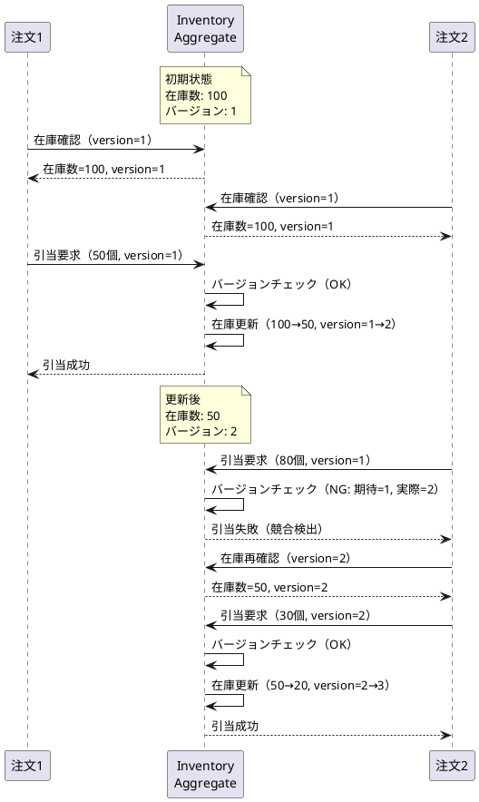
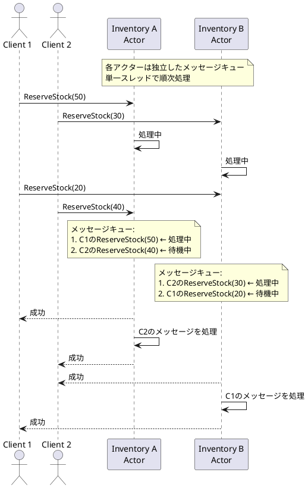

# 第3部 第7章：在庫引当の競合制御

## この章で学ぶこと

- 在庫引当における同時アクセス制御の課題
- 楽観的ロック（Optimistic Locking）の実装
- CAS（Compare-And-Swap）オペレーション
- リトライ戦略とエラーハンドリング
- 複数倉庫・区画からの引当アルゴリズム
- デッドロック回避のベストプラクティス

---

## 7.1 在庫引当の競合制御とは

### 7.1.1 在庫引当の課題

在庫管理システムでは、複数の注文が同時に同じ商品を引き当てようとする場合があります。この同時アクセスを適切に制御しないと、以下の問題が発生します。

#### 過剰引当（Over-Allocation）の問題

```
初期状態：商品Aの在庫 = 100個

時刻T1: 注文1が商品Aを50個引き当て要求（在庫確認: 100個）
時刻T2: 注文2が商品Aを80個引き当て要求（在庫確認: 100個）
時刻T3: 注文1の引当確定（在庫: 100 - 50 = 50個）
時刻T4: 注文2の引当確定（在庫: 100 - 80 = 20個）← 本来は失敗すべき

結果：在庫が20個しかないのに、130個を引き当ててしまう（過剰引当）
```

このような過剰引当を防ぐため、**競合制御**が必要です。

### 7.1.2 悲観的ロック vs 楽観的ロック

競合制御には大きく分けて2つのアプローチがあります：

| アプローチ | 説明 | 利点 | 欠点 |
|-----------|------|------|------|
| **悲観的ロック** | データを読み取る時点でロックを取得し、更新が終わるまでロックを保持 | 確実に競合を防げる | スループットが低下、デッドロックのリスク |
| **楽観的ロック** | ロックを取得せず、更新時にデータが変更されていないかチェック | 高スループット、デッドロックなし | 競合時にリトライが必要 |

在庫管理システムでは、以下の理由から**楽観的ロック**を採用します：

1. **高スループット**：1日2,000件の受払処理に対応
2. **デッドロック回避**：複数倉庫・区画の同時更新
3. **イベントソーシングとの親和性**：バージョン管理が容易

### 7.1.3 楽観的ロックの仕組み

楽観的ロックは**バージョン番号**を使用して競合を検出します。



**ポイント**：
- バージョン番号は更新のたびにインクリメント
- 更新時に期待バージョンと実際のバージョンを比較
- 不一致の場合は競合とみなし、リトライ

---

## 7.2 楽観的ロックの実装（TDD）

### 7.2.1 Inventory集約のバージョン管理

まず、Inventory集約にバージョン番号を追加します。

#### ステップ1：テストを書く（RED）

```scala
// modules/command/domain/src/test/scala/.../inventories/InventorySpec.scala
class InventorySpec extends AnyFreeSpec with Matchers {
  "Inventory" - {
    "バージョン管理" - {
      "初期バージョンは1である" in {
        val inventory = Inventory.create(
          id = InventoryId.generate(),
          warehouseCode = WarehouseCode("WH001"),
          productId = ProductId.generate(),
          zoneNumber = ZoneNumber(1)
        )

        inventory.version shouldBe Version(1)
      }

      "在庫受入でバージョンがインクリメントされる" in {
        val inventory = Inventory.create(
          id = InventoryId.generate(),
          warehouseCode = WarehouseCode("WH001"),
          productId = ProductId.generate(),
          zoneNumber = ZoneNumber(1)
        )

        val updated = inventory.receiveStock(Quantity(100))
        updated.version shouldBe Version(2)
      }

      "引当でバージョンがインクリメントされる" in {
        val inventory = Inventory.create(
          id = InventoryId.generate(),
          warehouseCode = WarehouseCode("WH001"),
          productId = ProductId.generate(),
          zoneNumber = ZoneNumber(1)
        ).receiveStock(Quantity(100))

        val reserved = inventory.reserveStock(Quantity(50))
        reserved.map(_.version) shouldBe Right(Version(3))
      }
    }
  }
}
```

#### ステップ2：最小限の実装（GREEN）

```scala
// modules/command/domain/src/main/scala/.../inventories/Inventory.scala
final case class Inventory private (
  id: InventoryId,
  warehouseCode: WarehouseCode,
  productId: ProductId,
  zoneNumber: ZoneNumber,
  quantityOnHand: Quantity,
  quantityReserved: Quantity,
  version: Version  // バージョン番号を追加
) extends Entity {

  type IdType = InventoryId

  def quantityAvailable: Quantity =
    Quantity(quantityOnHand.value - quantityReserved.value)

  def receiveStock(quantity: Quantity): Inventory = {
    this.copy(
      quantityOnHand = Quantity(quantityOnHand.value + quantity.value),
      version = version.increment  // バージョンをインクリメント
    )
  }

  def reserveStock(quantity: Quantity): Either[InventoryError, Inventory] = {
    if (quantityAvailable.value < quantity.value) {
      Left(InventoryError.InsufficientStock(quantityAvailable, quantity))
    } else {
      Right(this.copy(
        quantityReserved = Quantity(quantityReserved.value + quantity.value),
        version = version.increment  // バージョンをインクリメント
      ))
    }
  }

  def releaseStock(quantity: Quantity): Either[InventoryError, Inventory] = {
    if (quantityReserved.value < quantity.value) {
      Left(InventoryError.InvalidReleaseQuantity(quantityReserved, quantity))
    } else {
      Right(this.copy(
        quantityReserved = Quantity(quantityReserved.value - quantity.value),
        version = version.increment
      ))
    }
  }
}

object Inventory {
  def create(
    id: InventoryId,
    warehouseCode: WarehouseCode,
    productId: ProductId,
    zoneNumber: ZoneNumber
  ): Inventory = {
    Inventory(
      id = id,
      warehouseCode = warehouseCode,
      productId = productId,
      zoneNumber = zoneNumber,
      quantityOnHand = Quantity(0),
      quantityReserved = Quantity(0),
      version = Version(1)  // 初期バージョンは1
    )
  }
}

// Version値オブジェクト
final case class Version(value: Long) extends AnyVal {
  def increment: Version = Version(value + 1)
}

object Version {
  def initial: Version = Version(1)
}
```

#### ステップ3：リファクタリング（REFACTOR）

テストが通ったら、コードを整理します。

```scala
// InventoryErrorを整理
sealed trait InventoryError
object InventoryError {
  final case class InsufficientStock(
    available: Quantity,
    requested: Quantity
  ) extends InventoryError

  final case class InvalidReleaseQuantity(
    reserved: Quantity,
    requested: Quantity
  ) extends InventoryError

  final case class VersionConflict(
    expected: Version,
    actual: Version
  ) extends InventoryError  // バージョン競合エラーを追加
}
```

### 7.2.2 CAS（Compare-And-Swap）オペレーションの実装

次に、InventoryAggregateアクターでバージョンチェックを実装します。

#### ステップ1：テストを書く（RED）

```scala
// modules/command/interface-adapter/src/test/scala/.../aggregate/inventories/InventoryAggregateSpec.scala
class InventoryAggregateSpec extends ScalaTestWithActorTestKit
  with AnyWordSpecLike
  with InventoryTestHelper {

  "InventoryAggregate" should {
    "バージョン競合を検出する" in {
      val inventoryId = InventoryId.generate()
      val warehouseCode = WarehouseCode("WH001")
      val productId = ProductId.generate()
      val zoneNumber = ZoneNumber(1)

      // 在庫を作成
      val created = createInventory(inventoryId, warehouseCode, productId, zoneNumber)
      created.version shouldBe Version(1)

      // 在庫受入（version 1 → 2）
      val received = receiveStock(inventoryId, Quantity(100))
      received.version shouldBe Version(2)

      // 古いバージョンでの引当を試みる（version 1で引当）
      val probe = createTestProbe[ReserveStockReply]()
      sendCommand(
        inventoryId,
        id => ReserveStock(
          id,
          Quantity(50),
          expectedVersion = Version(1),  // 期待バージョン
          probe.ref
        ),
        probe
      )

      val reply = probe.expectMessageType[ReserveStockFailed]
      reply.error shouldBe a[InventoryError.VersionConflict]
    }

    "正しいバージョンでの引当は成功する" in {
      val inventoryId = InventoryId.generate()
      val warehouseCode = WarehouseCode("WH001")
      val productId = ProductId.generate()
      val zoneNumber = ZoneNumber(1)

      // 在庫を作成して受入
      createInventory(inventoryId, warehouseCode, productId, zoneNumber)
      val received = receiveStock(inventoryId, Quantity(100))

      // 正しいバージョンでの引当
      val probe = createTestProbe[ReserveStockReply]()
      sendCommand(
        inventoryId,
        id => ReserveStock(
          id,
          Quantity(50),
          expectedVersion = received.version,  // 現在のバージョン
          probe.ref
        ),
        probe
      )

      val reply = probe.expectMessageType[ReserveStockSucceeded]
      reply.version shouldBe Version(3)  // バージョンがインクリメント
    }
  }
}
```

#### ステップ2：最小限の実装（GREEN）

```scala
// modules/command/interface-adapter-contract/src/main/protobuf/inventory_protocol.proto
// Protobuf定義にバージョンフィールドを追加

message ReserveStockCommand {
  string inventory_id = 1;
  int32 quantity = 2;
  int64 expected_version = 3;  // 期待バージョンを追加
  string reply_to = 4;
}

message ReserveStockSucceededReply {
  string inventory_id = 1;
  int64 version = 2;  // 更新後のバージョンを返す
}

message ReserveStockFailedReply {
  string inventory_id = 1;
  string error_type = 2;  // "InsufficientStock" | "VersionConflict"
  string error_message = 3;
  int64 current_version = 4;  // 現在のバージョンを返す
}
```

```scala
// modules/command/interface-adapter/src/main/scala/.../aggregate/inventories/InventoryAggregate.scala
import org.apache.pekko.persistence.typed.scaladsl.{Effect, EventSourcedBehavior}

object InventoryAggregate {

  sealed trait Command
  final case class ReserveStock(
    inventoryId: InventoryId,
    quantity: Quantity,
    expectedVersion: Version,  // 期待バージョン
    replyTo: ActorRef[ReserveStockReply]
  ) extends Command

  sealed trait ReserveStockReply
  final case class ReserveStockSucceeded(
    inventoryId: InventoryId,
    version: Version  // 更新後のバージョン
  ) extends ReserveStockReply

  final case class ReserveStockFailed(
    inventoryId: InventoryId,
    error: InventoryError,
    currentVersion: Version  // 現在のバージョン
  ) extends ReserveStockReply

  // コマンドハンドラー
  private def commandHandler(
    state: InventoryState,
    command: Command
  ): Effect[Event, InventoryState] = {
    (state, command) match {
      case (Created(inventory), ReserveStock(_, quantity, expectedVersion, replyTo)) =>
        // バージョンチェック（CAS操作）
        if (inventory.version != expectedVersion) {
          // バージョン不一致 → 競合検出
          Effect.reply(replyTo)(
            ReserveStockFailed(
              inventory.id,
              InventoryError.VersionConflict(expectedVersion, inventory.version),
              inventory.version
            )
          )
        } else {
          // バージョン一致 → 引当処理
          inventory.reserveStock(quantity) match {
            case Right(updated) =>
              Effect
                .persist(StockReserved(inventory.id, quantity, updated.version))
                .thenReply(replyTo)(_ => ReserveStockSucceeded(inventory.id, updated.version))

            case Left(error) =>
              Effect.reply(replyTo)(
                ReserveStockFailed(inventory.id, error, inventory.version)
              )
          }
        }

      case _ =>
        Effect.unhandled
    }
  }

  // イベントハンドラー
  private def eventHandler(state: InventoryState, event: Event): InventoryState = {
    (state, event) match {
      case (Created(inventory), StockReserved(_, quantity, newVersion)) =>
        Created(inventory.reserveStock(quantity).getOrElse(inventory))

      case _ =>
        state
    }
  }
}
```

### 7.2.3 リトライ戦略の実装

バージョン競合が発生した場合、クライアント側でリトライします。

```scala
// リトライ戦略
import scala.concurrent.duration._

final case class RetryPolicy(
  maxRetries: Int = 3,
  initialDelay: FiniteDuration = 100.millis,
  backoffFactor: Double = 2.0,
  maxDelay: FiniteDuration = 1.second
) {

  def delayFor(attempt: Int): FiniteDuration = {
    val delay = initialDelay * math.pow(backoffFactor, attempt - 1)
    FiniteDuration(
      math.min(delay.toMillis, maxDelay.toMillis),
      MILLISECONDS
    )
  }
}

// リトライ処理のヘルパー
object RetryHelper {

  def retryWithBackoff[T](
    operation: => Future[T],
    policy: RetryPolicy,
    attempt: Int = 1
  )(implicit ec: ExecutionContext): Future[T] = {
    operation.recoverWith {
      case VersionConflictException(expected, actual) if attempt < policy.maxRetries =>
        // バージョン競合の場合はリトライ
        val delay = policy.delayFor(attempt)
        akka.pattern.after(delay, system.scheduler) {
          retryWithBackoff(operation, policy, attempt + 1)
        }

      case ex =>
        // その他のエラーはリトライしない
        Future.failed(ex)
    }
  }
}
```

**使用例**：

```scala
// GraphQL Mutationでのリトライ
def reserveStock(
  inventoryId: InventoryId,
  quantity: Quantity
)(implicit ctx: Context[Unit, Unit]): Future[ReserveStockPayload] = {

  val retryPolicy = RetryPolicy(
    maxRetries = 3,
    initialDelay = 100.millis,
    backoffFactor = 2.0
  )

  def attemptReservation(): Future[ReserveStockPayload] = {
    for {
      // 現在の在庫とバージョンを取得
      current <- inventoryService.get(inventoryId)

      // 引当コマンドを送信
      result <- inventoryAggregate.ask[ReserveStockReply](
        replyTo => ReserveStock(
          inventoryId,
          quantity,
          expectedVersion = current.version,  // 取得したバージョンを使用
          replyTo
        )
      )

      payload <- result match {
        case ReserveStockSucceeded(id, version) =>
          Future.successful(ReserveStockPayload(id, version))

        case ReserveStockFailed(_, error, currentVersion) =>
          error match {
            case InventoryError.VersionConflict(expected, actual) =>
              Future.failed(VersionConflictException(expected, actual))

            case InventoryError.InsufficientStock(available, requested) =>
              Future.failed(InsufficientStockException(available, requested))

            case other =>
              Future.failed(new RuntimeException(s"Unexpected error: $other"))
          }
      }
    } yield payload
  }

  RetryHelper.retryWithBackoff(attemptReservation(), retryPolicy)
}
```

---

## 7.3 在庫引当アルゴリズム

### 7.3.1 FIFO（First In First Out）戦略

在庫は基本的にFIFO（先入先出）で引き当てます。

```scala
// 在庫引当サービス
class InventoryAllocationService(
  inventoryRepository: InventoryRepository
) {

  /**
   * 商品の在庫を引き当てる（FIFO）
   */
  def allocateStock(
    productId: ProductId,
    quantity: Quantity
  ): Future[Either[AllocationError, AllocationResult]] = {
    for {
      // 該当商品の全在庫を取得（区画ごと）
      inventories <- inventoryRepository.findByProductId(productId)

      // FIFO順にソート（受入日時の古い順）
      sorted = inventories.sortBy(_.receivedAt)

      // 引当処理
      result <- allocateFromInventories(sorted, quantity)
    } yield result
  }

  private def allocateFromInventories(
    inventories: List[Inventory],
    remainingQuantity: Quantity,
    allocated: List[AllocationDetail] = Nil
  ): Future[Either[AllocationError, AllocationResult]] = {

    if (remainingQuantity.value <= 0) {
      // 引当完了
      Future.successful(Right(AllocationResult(allocated)))
    } else if (inventories.isEmpty) {
      // 在庫不足
      Future.successful(Left(AllocationError.InsufficientStock(remainingQuantity)))
    } else {
      val inventory = inventories.head
      val available = inventory.quantityAvailable

      if (available.value > 0) {
        val toAllocate = Quantity(math.min(available.value, remainingQuantity.value))

        // 引当実行
        inventory.reserveStock(toAllocate) match {
          case Right(updated) =>
            val detail = AllocationDetail(
              inventoryId = inventory.id,
              warehouseCode = inventory.warehouseCode,
              zoneNumber = inventory.zoneNumber,
              quantity = toAllocate
            )

            allocateFromInventories(
              inventories.tail,
              Quantity(remainingQuantity.value - toAllocate.value),
              allocated :+ detail
            )

          case Left(error) =>
            Future.successful(Left(AllocationError.ReservationFailed(error)))
        }
      } else {
        // この在庫は使えないので次へ
        allocateFromInventories(inventories.tail, remainingQuantity, allocated)
      }
    }
  }
}

final case class AllocationResult(details: List[AllocationDetail])

final case class AllocationDetail(
  inventoryId: InventoryId,
  warehouseCode: WarehouseCode,
  zoneNumber: ZoneNumber,
  quantity: Quantity
)

sealed trait AllocationError
object AllocationError {
  final case class InsufficientStock(remaining: Quantity) extends AllocationError
  final case class ReservationFailed(error: InventoryError) extends AllocationError
}
```

### 7.3.2 区画タイプを考慮した引当戦略

商品の保管条件（常温、冷蔵、冷凍）に応じて、適切な区画から引き当てます。

```scala
// 保管条件を考慮した引当
class ZoneAwareAllocationService(
  inventoryRepository: InventoryRepository,
  productRepository: ProductRepository,
  zoneRepository: WarehouseZoneRepository
) {

  /**
   * 保管条件を考慮した在庫引当
   */
  def allocateStockWithZone(
    productId: ProductId,
    quantity: Quantity
  ): Future[Either[AllocationError, AllocationResult]] = {
    for {
      // 商品情報を取得（保管条件）
      product <- productRepository.findById(productId)

      // 該当商品の全在庫を取得
      inventories <- inventoryRepository.findByProductId(productId)

      // 各在庫の区画情報を取得
      inventoriesWithZones <- Future.traverse(inventories) { inv =>
        zoneRepository.findByWarehouseAndZone(inv.warehouseCode, inv.zoneNumber).map { zone =>
          (inv, zone)
        }
      }

      // 保管条件に適合する区画のみフィルタリング
      compatible = inventoriesWithZones.filter { case (inv, zone) =>
        isCompatible(product.storageCondition, zone.zoneType)
      }.map(_._1)  // Inventoryのみ取り出す

      // FIFO順にソート
      sorted = compatible.sortBy(_.receivedAt)

      // 引当処理
      result <- allocateFromInventories(sorted, quantity)
    } yield result
  }

  /**
   * 保管条件と区画タイプの互換性チェック
   */
  private def isCompatible(
    storageCondition: StorageCondition,
    zoneType: ZoneType
  ): Boolean = {
    (storageCondition, zoneType) match {
      case (StorageCondition.RoomTemperature, ZoneType.RoomTemperature) => true
      case (StorageCondition.Refrigerated, ZoneType.Refrigerated) => true
      case (StorageCondition.Frozen, ZoneType.Frozen) => true
      case _ => false
    }
  }
}
```

### 7.3.3 引当優先順位の設定

倉庫や区画ごとに優先順位を設定できます。

```scala
// 引当優先順位
final case class AllocationPriority(
  warehouseCode: WarehouseCode,
  zoneNumber: ZoneNumber,
  priority: Int  // 数値が小さいほど優先度が高い
)

class PriorityBasedAllocationService(
  inventoryRepository: InventoryRepository,
  priorityRepository: AllocationPriorityRepository
) {

  /**
   * 優先順位を考慮した在庫引当
   */
  def allocateWithPriority(
    productId: ProductId,
    quantity: Quantity
  ): Future[Either[AllocationError, AllocationResult]] = {
    for {
      // 該当商品の全在庫を取得
      inventories <- inventoryRepository.findByProductId(productId)

      // 各在庫の優先順位を取得
      inventoriesWithPriority <- Future.traverse(inventories) { inv =>
        priorityRepository.findBy(inv.warehouseCode, inv.zoneNumber).map { priority =>
          (inv, priority.getOrElse(AllocationPriority(inv.warehouseCode, inv.zoneNumber, Int.MaxValue)))
        }
      }

      // 優先順位でソート（優先度 → 受入日時）
      sorted = inventoriesWithPriority
        .sortBy { case (inv, priority) => (priority.priority, inv.receivedAt) }
        .map(_._1)

      // 引当処理
      result <- allocateFromInventories(sorted, quantity)
    } yield result
  }
}
```

**例**：東京倉庫を優先的に使用

```scala
// 優先順位設定
val priorities = List(
  AllocationPriority(WarehouseCode("WH001"), ZoneNumber(1), priority = 1),  // 東京・常温（最優先）
  AllocationPriority(WarehouseCode("WH001"), ZoneNumber(2), priority = 2),  // 東京・冷蔵
  AllocationPriority(WarehouseCode("WH001"), ZoneNumber(3), priority = 3),  // 東京・冷凍
  AllocationPriority(WarehouseCode("WH002"), ZoneNumber(1), priority = 10), // 大阪・常温
  AllocationPriority(WarehouseCode("WH002"), ZoneNumber(2), priority = 11), // 大阪・冷蔵
  AllocationPriority(WarehouseCode("WH002"), ZoneNumber(3), priority = 12), // 大阪・冷凍
  AllocationPriority(WarehouseCode("WH003"), ZoneNumber(1), priority = 20), // 福岡・常温
  AllocationPriority(WarehouseCode("WH003"), ZoneNumber(2), priority = 21), // 福岡・冷蔵
  AllocationPriority(WarehouseCode("WH003"), ZoneNumber(3), priority = 22)  // 福岡・冷凍
)
```

---

## 7.4 デッドロック回避

### 7.4.1 アクター間の依存関係の最小化

複数の在庫を同時に引き当てる場合、デッドロックのリスクがあります。

```
デッドロックの例：

取引1：在庫A → 在庫B の順でロック
取引2：在庫B → 在庫A の順でロック

時刻T1: 取引1が在庫Aをロック
時刻T2: 取引2が在庫Bをロック
時刻T3: 取引1が在庫Bのロックを待機（デッドロック）
時刻T4: 取引2が在庫Aのロックを待機（デッドロック）
```

**解決策1：一貫性のあるロック順序**

常に同じ順序でロックを取得します。

```scala
// InventoryIdでソートしてロック順序を統一
def allocateMultipleInventories(
  inventoryIds: List[InventoryId],
  quantities: Map[InventoryId, Quantity]
): Future[Either[AllocationError, AllocationResult]] = {

  // InventoryIdでソート（一貫性のある順序）
  val sortedIds = inventoryIds.sorted(Ordering.by[InventoryId, String](_.value))

  sortedIds.foldLeft(Future.successful(List.empty[AllocationDetail])) { (acc, inventoryId) =>
    acc.flatMap { allocated =>
      val quantity = quantities(inventoryId)
      reserveStock(inventoryId, quantity).map { detail =>
        allocated :+ detail
      }
    }
  }.map(details => Right(AllocationResult(details)))
}
```

**解決策2：タイムアウト設定**

アクターのask操作にタイムアウトを設定し、デッドロックを防ぎます。

```scala
import org.apache.pekko.util.Timeout
import scala.concurrent.duration._

implicit val timeout: Timeout = Timeout(5.seconds)

// タイムアウト付きのask
def reserveStockWithTimeout(
  inventoryId: InventoryId,
  quantity: Quantity,
  expectedVersion: Version
)(implicit system: ActorSystem[_]): Future[ReserveStockReply] = {

  inventoryAggregate.ask[ReserveStockReply] { replyTo =>
    ReserveStock(inventoryId, quantity, expectedVersion, replyTo)
  }.recover {
    case _: TimeoutException =>
      ReserveStockFailed(
        inventoryId,
        InventoryError.Timeout("在庫引当がタイムアウトしました"),
        Version(0)
      )
  }
}
```

### 7.4.2 Pekkoアクターによる並行制御

Pekkoアクターは、各アクターが独立したメッセージキューを持つため、デッドロックが発生しにくい設計です。



**ポイント**：
- 各Inventoryアクターは独立して動作
- メッセージは順次処理されるため、内部状態の整合性が保証される
- デッドロックは発生しない

---

## 7.5 統合テスト：競合シナリオ

複数のクライアントが同時に在庫を引き当てるシナリオをテストします。

```scala
// modules/command/interface-adapter/src/test/scala/.../aggregate/inventories/InventoryConcurrencySpec.scala
class InventoryConcurrencySpec extends ScalaTestWithActorTestKit
  with AnyWordSpecLike
  with InventoryTestHelper {

  "InventoryAggregate" should {
    "複数クライアントの同時引当を正しく処理する" in {
      val inventoryId = InventoryId.generate()
      val warehouseCode = WarehouseCode("WH001")
      val productId = ProductId.generate()
      val zoneNumber = ZoneNumber(1)

      // 在庫100個を作成
      createInventory(inventoryId, warehouseCode, productId, zoneNumber)
      receiveStock(inventoryId, Quantity(100))

      // 10個のクライアントが同時に10個ずつ引き当て
      val clients = (1 to 10).map { i =>
        createTestProbe[ReserveStockReply](s"client-$i")
      }

      // 同時に引当要求を送信
      clients.foreach { client =>
        sendCommand(
          inventoryId,
          id => ReserveStock(id, Quantity(10), Version(2), client.ref),
          client
        )
      }

      // 結果を集計
      val results = clients.map { client =>
        client.receiveMessage(5.seconds)
      }

      val successes = results.count(_.isInstanceOf[ReserveStockSucceeded])
      val failures = results.count(_.isInstanceOf[ReserveStockFailed])

      // 10個のクライアント全員が成功するはず
      successes shouldBe 10
      failures shouldBe 0

      // 最終的な在庫を確認
      val final = getInventory(inventoryId)
      final.quantityOnHand shouldBe Quantity(100)
      final.quantityReserved shouldBe Quantity(100)
      final.quantityAvailable shouldBe Quantity(0)
    }

    "在庫不足の場合は一部のクライアントが失敗する" in {
      val inventoryId = InventoryId.generate()
      val warehouseCode = WarehouseCode("WH001")
      val productId = ProductId.generate()
      val zoneNumber = ZoneNumber(1)

      // 在庫50個を作成
      createInventory(inventoryId, warehouseCode, productId, zoneNumber)
      receiveStock(inventoryId, Quantity(50))

      // 10個のクライアントが同時に10個ずつ引き当て（合計100個）
      val clients = (1 to 10).map { i =>
        createTestProbe[ReserveStockReply](s"client-$i")
      }

      clients.foreach { client =>
        sendCommand(
          inventoryId,
          id => ReserveStock(id, Quantity(10), Version(2), client.ref),
          client
        )
      }

      val results = clients.map(_.receiveMessage(5.seconds))

      val successes = results.count(_.isInstanceOf[ReserveStockSucceeded])
      val failures = results.count(_.isInstanceOf[ReserveStockFailed])

      // 5個が成功、5個が失敗するはず
      successes shouldBe 5
      failures shouldBe 5

      // 最終的な在庫を確認
      val final = getInventory(inventoryId)
      final.quantityAvailable shouldBe Quantity(0)
    }
  }
}
```

---

## 7.6 パフォーマンスチューニング

### 7.6.1 バッチ引当の最適化

複数商品を一度に引き当てる場合、並列処理で高速化します。

```scala
import org.apache.pekko.stream.scaladsl.{Flow, Sink, Source}
import org.apache.pekko.stream.Materializer

class BatchAllocationService(
  allocationService: InventoryAllocationService
)(implicit mat: Materializer, ec: ExecutionContext) {

  /**
   * 複数商品の並列引当
   */
  def allocateBatch(
    items: List[(ProductId, Quantity)]
  ): Future[List[Either[AllocationError, AllocationResult]]] = {

    Source(items)
      .via(Flow[(ProductId, Quantity)].mapAsync(parallelism = 10) { case (productId, quantity) =>
        allocationService.allocateStock(productId, quantity)
      })
      .runWith(Sink.seq)
      .map(_.toList)
  }
}
```

### 7.6.2 キャッシュによる最適化

頻繁にアクセスされる在庫情報をキャッシュします。

```scala
import com.github.blemale.scaffeine.{Cache, Scaffeine}
import scala.concurrent.duration._

class CachedInventoryService(
  inventoryRepository: InventoryRepository
) {

  private val cache: Cache[InventoryId, Inventory] = Scaffeine()
    .recordStats()
    .expireAfterWrite(1.minute)
    .maximumSize(10000)
    .build[InventoryId, Inventory]()

  def get(inventoryId: InventoryId): Future[Option[Inventory]] = {
    cache.getIfPresent(inventoryId) match {
      case Some(inventory) =>
        // キャッシュヒット
        Future.successful(Some(inventory))

      case None =>
        // キャッシュミス → DBから取得
        inventoryRepository.findById(inventoryId).map { inventory =>
          inventory.foreach(inv => cache.put(inventoryId, inv))
          inventory
        }
    }
  }

  def invalidate(inventoryId: InventoryId): Unit = {
    cache.invalidate(inventoryId)
  }
}
```

---

## まとめ

この章では、在庫引当の競合制御について学びました。

### 学んだこと

1. **楽観的ロックの仕組み**
   - バージョン番号による競合検出
   - CAS（Compare-And-Swap）オペレーション
   - リトライ戦略

2. **在庫引当アルゴリズム**
   - FIFO（先入先出）戦略
   - 保管条件を考慮した区画選択
   - 引当優先順位の設定

3. **デッドロック回避**
   - 一貫性のあるロック順序
   - タイムアウト設定
   - Pekkoアクターによる並行制御

4. **パフォーマンス最適化**
   - バッチ引当の並列処理
   - キャッシュによる高速化

### TDDによる実装

第5章と同様、TDDサイクル（RED → GREEN → REFACTOR）に従って実装しました：

1. **RED**：テストを先に書く（バージョン管理、CAS操作、競合シナリオ）
2. **GREEN**：最小限の実装でテストを通す
3. **REFACTOR**：コードを整理し、可読性を向上

### 次のステップ

次章では、在庫照会や集計など、複雑なRead Modelクエリの実装について学びます。

**第8章：複雑なクエリの実装**
- 在庫照会のRead Model設計
- マテリアライズドビューの活用
- GraphQLクエリの最適化
- DataLoaderによるN+1問題の解決

在庫引当の競合制御は、在庫管理システムの核心部分です。楽観的ロックとリトライ戦略により、高スループットと整合性を両立できます。

---

## 参考資料

### 書籍
- **"Database Internals"** by Alex Petrov（並行制御の詳細）
- **"Designing Data-Intensive Applications"** by Martin Kleppmann（トランザクション、整合性）

### オンラインリソース
- [Optimistic Locking - Martin Fowler](https://martinfowler.com/eaaCatalog/optimisticOfflineLock.html)
- [Apache Pekko Documentation - Actors](https://pekko.apache.org/docs/pekko/current/typed/actors.html)

### 関連章
- 第6章：Sagaパターン（参考） - 分散トランザクションの別アプローチ
- 第9章：イベントの順序保証 - Read Model更新の整合性
