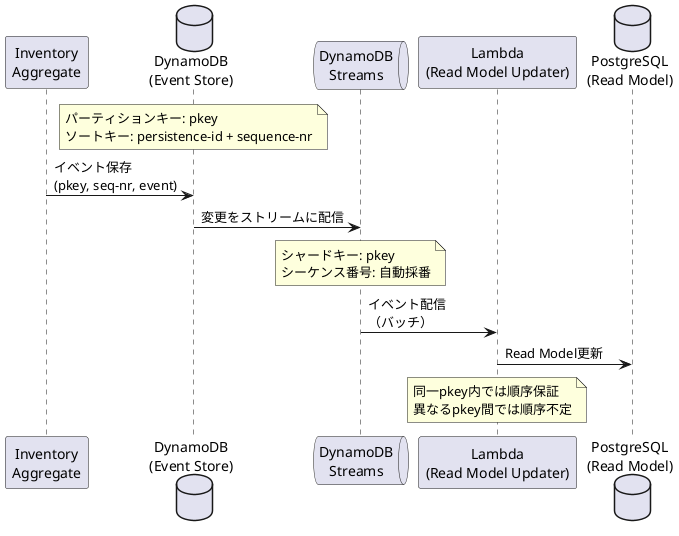
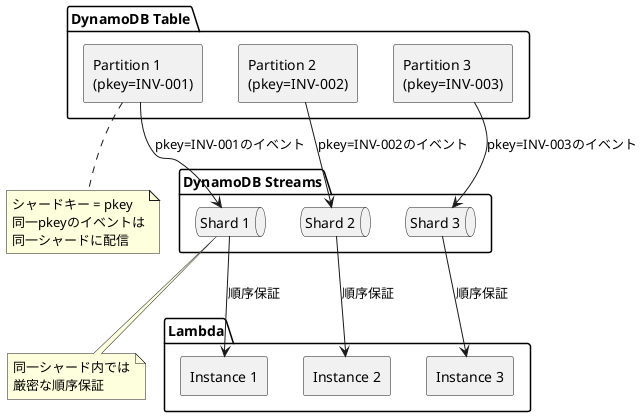
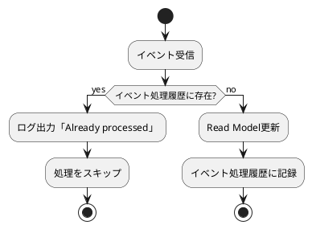

# 第3部 第9章：イベントの順序保証

## この章で学ぶこと

- イベント順序保証が必要な理由（在庫計算、状態遷移、監査ログ）
- DynamoDB Streamsの順序保証の仕組み
- シャードキーによるパーティショニング
- Sequence Numberによる順序制御
- 重複イベントの検出と対処
- 欠落イベントの検知とリカバリ戦略

---

## 9.1 順序保証が必要な理由

イベントソーシングシステムでは、イベントの順序が正しく保証されないと、データの整合性が失われます。

### 9.1.1 在庫数量の計算

在庫イベントが順序通りに処理されないと、在庫数が不正確になります。

```
正しい順序：
時刻T1: 在庫受入 +100個（在庫: 0 → 100）
時刻T2: 在庫引当 -50個（在庫: 100 → 50）
時刻T3: 在庫引当 -30個（在庫: 50 → 20）
最終在庫: 20個 ✓

誤った順序（T3とT2が逆転）：
時刻T1: 在庫受入 +100個（在庫: 0 → 100）
時刻T3: 在庫引当 -30個（在庫: 100 → 70）
時刻T2: 在庫引当 -50個（在庫: 70 → 20）
最終在庫: 20個 ✓（結果は同じ）

さらに誤った順序（T2とT1が逆転）：
時刻T2: 在庫引当 -50個（在庫: 0 → -50）← エラー！
時刻T1: 在庫受入 +100個（在庫: -50 → 50）
時刻T3: 在庫引当 -30個（在庫: 50 → 20）
最終在庫: 20個だが、途中でマイナス在庫が発生！✗
```

**問題点**：
- 在庫がマイナスになる（過剰引当）
- ビジネスルール違反
- 監査ログの不整合

### 9.1.2 状態遷移の整合性

集約の状態遷移が順序通りに行われないと、不正な状態に遷移する可能性があります。

```
正しい状態遷移：
Initial → Created → StockReceived → StockReserved → Deleted

誤った状態遷移（DeletedとStockReceivedが逆転）：
Initial → Created → Deleted → StockReceived ← エラー！
```

**問題点**：
- 削除済み在庫に対して受入処理が実行される
- 状態機械（State Machine）の整合性が失われる
- データの復旧が困難

### 9.1.3 監査ログの正確性

在庫管理システムでは、すべての受払履歴を正確に記録する必要があります。

```
正しい監査ログ：
2025-01-01 09:00 - 在庫受入: +100個（在庫: 0 → 100）
2025-01-01 10:00 - 在庫引当: -50個（在庫: 100 → 50）
2025-01-01 11:00 - 在庫引当: -30個（在庫: 50 → 20）

誤った監査ログ（順序が逆転）：
2025-01-01 09:00 - 在庫受入: +100個（在庫: 0 → 100）
2025-01-01 11:00 - 在庫引当: -30個（在庫: 100 → 70）← 時刻が逆転
2025-01-01 10:00 - 在庫引当: -50個（在庫: 70 → 20）← 時刻が逆転
```

**問題点**：
- 監査ログの時系列が不正確
- コンプライアンス違反のリスク
- トラブルシューティングが困難

---

## 9.2 DynamoDB Streamsの順序保証

DynamoDB Streamsは、テーブルの変更をストリームとして配信します。順序保証の仕組みを理解することが重要です。

### 9.2.1 DynamoDB Streamsの基本



**重要なポイント**：
1. **パーティションキー（pkey）単位で順序保証**
2. シャードキーとパーティションキーが一致する場合、順序が保証される
3. 異なるパーティションキー間では順序は保証されない

### 9.2.2 シャードキーによるパーティショニング

DynamoDB Streamsは、パーティションキーをシャードキーとして使用します。



**ポイント**：
- 同一集約ID（pkey）のイベントは同一シャードに配信される
- シャード内では厳密な順序保証（FIFO）
- 異なる集約IDのイベント間では順序は保証されない

### 9.2.3 同一集約IDでの順序保証

```scala
// Pekko Persistenceのpersistence-idをパーティションキーに使用
val persistenceId = s"inventory-${inventoryId.value}"

// DynamoDBに保存される形式
case class JournalRow(
  pkey: String,                    // パーティションキー: persistence-id
  sequenceNr: Long,                // ソートキー: シーケンス番号
  event: Array[Byte],              // イベントデータ
  timestamp: Long                  // タイムスタンプ
)

// 例：
// pkey="inventory-INV-001", sequenceNr=1, event=StockReceived(+100)
// pkey="inventory-INV-001", sequenceNr=2, event=StockReserved(-50)
// pkey="inventory-INV-001", sequenceNr=3, event=StockReserved(-30)
```

**DynamoDB Streamsの動作**：
1. 同一`pkey`のイベントは同一シャードに配信
2. シャード内では`sequenceNr`順に配信
3. Lambdaは順序通りにイベントを処理

### 9.2.4 異なる集約間の順序

異なる集約IDのイベント間では順序は保証されません。

```
Inventory A (pkey=inventory-INV-001):
  T1: StockReceived(+100) → Shard 1
  T3: StockReserved(-50)  → Shard 1

Inventory B (pkey=inventory-INV-002):
  T2: StockReceived(+200) → Shard 2
  T4: StockReserved(-100) → Shard 2

処理順序:
- Inventory A: T1 → T3 （順序保証 ✓）
- Inventory B: T2 → T4 （順序保証 ✓）
- 全体: T1 → T3 → T2 → T4 または T2 → T4 → T1 → T3 （順序不定）
```

**影響**：
- 単一集約内の整合性は保証される
- 集約間の因果関係は保証されない
- 集約間の依存がある場合は別の仕組みが必要（Sagaパターンなど）

---

## 9.3 Read Model更新の順序制御

DynamoDB Streamsから受信したイベントを、Read Modelに正しく反映します。

### 9.3.1 Sequence Numberによる制御

各イベントにシーケンス番号を付与し、順序制御を行います。

#### Read Modelテーブル設計

```sql
-- 在庫テーブルにシーケンス番号を追加
CREATE TABLE 在庫 (
    在庫ID VARCHAR(50) PRIMARY KEY,
    商品ID VARCHAR(50) NOT NULL,
    倉庫コード VARCHAR(20) NOT NULL,
    区画番号 INTEGER NOT NULL,
    現在庫数 INTEGER NOT NULL DEFAULT 0,
    引当済数 INTEGER NOT NULL DEFAULT 0,
    有効在庫数 INTEGER NOT NULL DEFAULT 0,
    最終シーケンス番号 BIGINT NOT NULL DEFAULT 0,  -- 追加
    作成日時 TIMESTAMP NOT NULL DEFAULT CURRENT_TIMESTAMP,
    更新日時 TIMESTAMP NOT NULL DEFAULT CURRENT_TIMESTAMP,
    削除フラグ BOOLEAN NOT NULL DEFAULT false
);

-- イベント処理履歴テーブル（重複検出用）
CREATE TABLE イベント処理履歴 (
    集約ID VARCHAR(100) NOT NULL,
    シーケンス番号 BIGINT NOT NULL,
    イベントタイプ VARCHAR(50) NOT NULL,
    処理日時 TIMESTAMP NOT NULL DEFAULT CURRENT_TIMESTAMP,
    PRIMARY KEY (集約ID, シーケンス番号)
);

COMMENT ON TABLE イベント処理履歴 IS 'イベントの重複処理を防ぐための履歴';
COMMENT ON COLUMN イベント処理履歴.集約ID IS 'persistence-id';
COMMENT ON COLUMN イベント処理履歴.シーケンス番号 IS 'イベントのシーケンス番号';
```

#### Read Model Updater実装

```scala
// modules/apps/read-model-updater/src/main/scala/.../ReadModelUpdater.scala
import com.amazonaws.services.lambda.runtime.{Context, RequestHandler}
import com.amazonaws.services.lambda.runtime.events.DynamodbEvent
import scala.jdk.CollectionConverters._

class ReadModelUpdater(
  inventoryDao: InventoryDao,
  eventHistoryDao: EventHistoryDao
) extends RequestHandler[DynamodbEvent, String] {

  override def handleRequest(
    event: DynamodbEvent,
    context: Context
  ): String = {
    val logger = context.getLogger

    // DynamoDB Streamsから受信したレコードを処理
    val records = event.getRecords.asScala.toList

    logger.log(s"Received ${records.size} records from DynamoDB Streams")

    records.foreach { record =>
      try {
        processRecord(record)
      } catch {
        case ex: Exception =>
          logger.log(s"Error processing record: ${ex.getMessage}")
          throw ex  // リトライするためにエラーをスロー
      }
    }

    "OK"
  }

  private def processRecord(record: DynamodbEvent.DynamodbStreamRecord): Unit = {
    // パーティションキーとシーケンス番号を取得
    val pkey = record.getDynamodb.getKeys.get("pkey").getS
    val sequenceNr = record.getDynamodb.getKeys.get("sequence-nr").getN.toLong

    // イベントタイプを取得
    val eventType = record.getDynamodb.getNewImage.get("event-type").getS

    // 重複チェック
    if (eventHistoryDao.exists(pkey, sequenceNr)) {
      logger.log(s"Event already processed: pkey=$pkey, sequenceNr=$sequenceNr")
      return  // 既に処理済み
    }

    // シーケンス番号の順序チェック
    val lastSequenceNr = inventoryDao.getLastSequenceNumber(pkey)
    if (sequenceNr <= lastSequenceNr) {
      logger.log(s"Out-of-order event detected: pkey=$pkey, sequenceNr=$sequenceNr, lastSequenceNr=$lastSequenceNr")
      // 順序が逆転している場合はスキップ（既に新しいイベントが処理済み）
      return
    }

    // 欠落チェック
    if (sequenceNr > lastSequenceNr + 1) {
      logger.log(s"Missing event detected: pkey=$pkey, expected=${lastSequenceNr + 1}, actual=$sequenceNr")
      // 欠落がある場合はエラーをスロー（リトライして順序を待つ）
      throw new MissingEventException(s"Missing event: expected=${lastSequenceNr + 1}, actual=$sequenceNr")
    }

    // イベントをデシリアライズ
    val event = deserializeEvent(record.getDynamodb.getNewImage)

    // Read Modelを更新
    event match {
      case e: StockReceived =>
        inventoryDao.applyStockReceived(pkey, sequenceNr, e)

      case e: StockReserved =>
        inventoryDao.applyStockReserved(pkey, sequenceNr, e)

      case e: StockReleased =>
        inventoryDao.applyStockReleased(pkey, sequenceNr, e)

      case _ =>
        logger.log(s"Unknown event type: $eventType")
    }

    // イベント処理履歴を記録
    eventHistoryDao.insert(pkey, sequenceNr, eventType)
  }
}

// カスタム例外
class MissingEventException(message: String) extends Exception(message)
```

#### DAO実装（順序制御）

```scala
// modules/query/interface-adapter/src/main/scala/.../dao/InventoryDao.scala
class InventoryDao(db: Database)(implicit ec: ExecutionContext) {

  /**
   * 最終処理済みシーケンス番号を取得
   */
  def getLastSequenceNumber(persistenceId: String): Future[Long] = {
    val query = sql"""
      SELECT 最終シーケンス番号
      FROM 在庫
      WHERE 在庫ID = (
        SELECT 在庫ID
        FROM イベント処理履歴
        WHERE 集約ID = $persistenceId
        ORDER BY シーケンス番号 DESC
        LIMIT 1
      )
    """.as[Long].headOption

    db.run(query).map(_.getOrElse(0L))
  }

  /**
   * 在庫受入イベントを適用
   */
  def applyStockReceived(
    persistenceId: String,
    sequenceNr: Long,
    event: StockReceived
  ): Future[Unit] = {
    val query = sqlu"""
      UPDATE 在庫
      SET
        現在庫数 = 現在庫数 + ${event.quantity},
        有効在庫数 = 有効在庫数 + ${event.quantity},
        最終シーケンス番号 = $sequenceNr,
        更新日時 = CURRENT_TIMESTAMP
      WHERE 在庫ID = ${event.inventoryId}
        AND 最終シーケンス番号 < $sequenceNr  -- 古いシーケンス番号での更新を防ぐ
    """

    db.run(query).map { rowsAffected =>
      if (rowsAffected == 0) {
        throw new IllegalStateException(s"Failed to apply event: inventoryId=${event.inventoryId}, sequenceNr=$sequenceNr")
      }
      ()
    }
  }

  /**
   * 在庫引当イベントを適用
   */
  def applyStockReserved(
    persistenceId: String,
    sequenceNr: Long,
    event: StockReserved
  ): Future[Unit] = {
    val query = sqlu"""
      UPDATE 在庫
      SET
        引当済数 = 引当済数 + ${event.quantity},
        有効在庫数 = 有効在庫数 - ${event.quantity},
        最終シーケンス番号 = $sequenceNr,
        更新日時 = CURRENT_TIMESTAMP
      WHERE 在庫ID = ${event.inventoryId}
        AND 最終シーケンス番号 < $sequenceNr
    """

    db.run(query).map { rowsAffected =>
      if (rowsAffected == 0) {
        throw new IllegalStateException(s"Failed to apply event: inventoryId=${event.inventoryId}, sequenceNr=$sequenceNr")
      }
      ()
    }
  }
}
```

### 9.3.2 重複イベントの検出

DynamoDB Streamsは**At-Least-Once配信**を保証するため、同じイベントが複数回配信される可能性があります。

#### 重複検出の仕組み

```scala
// modules/query/interface-adapter/src/main/scala/.../dao/EventHistoryDao.scala
class EventHistoryDao(db: Database)(implicit ec: ExecutionContext) {

  /**
   * イベントが既に処理済みかチェック
   */
  def exists(persistenceId: String, sequenceNr: Long): Future[Boolean] = {
    val query = sql"""
      SELECT COUNT(*)
      FROM イベント処理履歴
      WHERE 集約ID = $persistenceId
        AND シーケンス番号 = $sequenceNr
    """.as[Int].head

    db.run(query).map(_ > 0)
  }

  /**
   * イベント処理履歴を記録
   */
  def insert(
    persistenceId: String,
    sequenceNr: Long,
    eventType: String
  ): Future[Unit] = {
    val query = sqlu"""
      INSERT INTO イベント処理履歴 (集約ID, シーケンス番号, イベントタイプ, 処理日時)
      VALUES ($persistenceId, $sequenceNr, $eventType, CURRENT_TIMESTAMP)
      ON CONFLICT (集約ID, シーケンス番号) DO NOTHING
    """

    db.run(query).map(_ => ())
  }

  /**
   * 古いイベント処理履歴を削除（保持期間：30日）
   */
  def deleteOldRecords(): Future[Int] = {
    val query = sqlu"""
      DELETE FROM イベント処理履歴
      WHERE 処理日時 < CURRENT_TIMESTAMP - INTERVAL '30 days'
    """

    db.run(query)
  }
}
```

**重複検出のフロー**：



### 9.3.3 欠落イベントの検知と対処

ネットワーク障害などでイベントが欠落する可能性があります。

#### 欠落検知の仕組み

```scala
/**
 * シーケンス番号の連続性をチェック
 */
private def checkSequenceContinuity(
  persistenceId: String,
  sequenceNr: Long,
  lastSequenceNr: Long
): Either[MissingEventError, Unit] = {

  if (sequenceNr == lastSequenceNr + 1) {
    // 正常：次のシーケンス番号
    Right(())
  } else if (sequenceNr <= lastSequenceNr) {
    // 古いイベント：既に処理済み
    Left(MissingEventError.AlreadyProcessed(persistenceId, sequenceNr, lastSequenceNr))
  } else {
    // 欠落検出：期待されるシーケンス番号が来ていない
    Left(MissingEventError.Missing(
      persistenceId,
      expected = lastSequenceNr + 1,
      actual = sequenceNr
    ))
  }
}

sealed trait MissingEventError
object MissingEventError {
  final case class AlreadyProcessed(
    persistenceId: String,
    sequenceNr: Long,
    lastSequenceNr: Long
  ) extends MissingEventError

  final case class Missing(
    persistenceId: String,
    expected: Long,
    actual: Long
  ) extends MissingEventError
}
```

#### 欠落イベントの対処戦略

**戦略1：リトライで待機**

```scala
// Lambda関数でエラーをスローし、DynamoDB Streamsがリトライ
if (sequenceNr > lastSequenceNr + 1) {
  throw new MissingEventException(
    s"Missing event: persistenceId=$persistenceId, expected=${lastSequenceNr + 1}, actual=$sequenceNr"
  )
}

// DynamoDB Streamsの設定
// - Maximum Record Age: 24時間
// - Retry Attempts: 10回
// - Bisect Batch on Function Error: true
```

**戦略2：Dead Letter Queue (DLQ)へ送信**

```scala
// Lambda設定でDLQを有効化
// リトライ上限に達したイベントをSQSまたはSNSに送信

// DLQからのリカバリ処理
class DeadLetterQueueProcessor(
  inventoryDao: InventoryDao,
  eventHistoryDao: EventHistoryDao
) {

  def processDeadLetter(message: SqsMessage): Future[Unit] = {
    val persistenceId = message.getAttribute("persistenceId")
    val sequenceNr = message.getAttribute("sequenceNr").toLong

    // イベントストア（DynamoDB）から直接読み取り
    for {
      event <- dynamoDbClient.getItem(persistenceId, sequenceNr)
      _ <- applyEvent(event)
      _ <- eventHistoryDao.insert(persistenceId, sequenceNr, event.eventType)
    } yield ()
  }
}
```

**戦略3：定期的な整合性チェック**

```scala
// 定期的にシーケンス番号の連続性をチェック
class SequenceIntegrityChecker(
  dynamoDbClient: DynamoDbClient,
  inventoryDao: InventoryDao
) {

  /**
   * 全集約のシーケンス番号をチェック
   */
  def checkAllAggregates(): Future[List[IntegrityIssue]] = {
    for {
      // DynamoDBから全集約の最大シーケンス番号を取得
      dynamoDbSequences <- dynamoDbClient.getMaxSequenceNumbers()

      // Read Modelから全集約の最終シーケンス番号を取得
      readModelSequences <- inventoryDao.getAllLastSequenceNumbers()

      // 差分をチェック
      issues = (dynamoDbSequences.keySet ++ readModelSequences.keySet).flatMap { persistenceId =>
        val dynamoSeq = dynamoDbSequences.getOrElse(persistenceId, 0L)
        val readSeq = readModelSequences.getOrElse(persistenceId, 0L)

        if (dynamoSeq > readSeq) {
          Some(IntegrityIssue.MissingEvents(
            persistenceId,
            readSeq + 1,
            dynamoSeq
          ))
        } else {
          None
        }
      }.toList
    } yield issues
  }

  /**
   * 欠落したイベントを再適用
   */
  def repairMissingEvents(issue: IntegrityIssue.MissingEvents): Future[Unit] = {
    val IntegrityIssue.MissingEvents(persistenceId, fromSeq, toSeq) = issue

    // 欠落範囲のイベントを取得
    for {
      events <- dynamoDbClient.getEventRange(persistenceId, fromSeq, toSeq)
      _ <- Future.traverse(events)(applyEvent)
    } yield ()
  }
}

sealed trait IntegrityIssue
object IntegrityIssue {
  final case class MissingEvents(
    persistenceId: String,
    fromSequenceNr: Long,
    toSequenceNr: Long
  ) extends IntegrityIssue
}
```

---

## 9.4 結果整合性の可視化

Read Modelの更新遅延を可視化し、ユーザーに伝えます。

### 9.4.1 最終更新日時の表示

```graphql
type Inventory {
  id: ID!
  productId: ID!
  warehouseCode: String!
  zoneNumber: Int!
  quantityOnHand: Int!
  quantityReserved: Int!
  quantityAvailable: Int!

  """Read Modelの最終更新日時"""
  lastUpdatedAt: DateTime!

  """コマンド側の最終イベント日時"""
  lastEventAt: DateTime

  """更新遅延（秒）"""
  lagSeconds: Int
}
```

```scala
// GraphQLリゾルバ
Field(
  "lagSeconds",
  OptionType(IntType),
  resolve = ctx => {
    (ctx.value.lastEventAt, ctx.value.lastUpdatedAt) match {
      case (Some(eventTime), updateTime) =>
        val lag = java.time.Duration.between(eventTime, updateTime).getSeconds
        Some(lag.toInt)
      case _ =>
        None
    }
  }
)
```

### 9.4.2 結果整合性の警告

```graphql
type Query {
  """在庫情報を取得（結果整合性の警告付き）"""
  inventory(id: ID!): InventoryWithConsistencyInfo
}

type InventoryWithConsistencyInfo {
  inventory: Inventory!

  """結果整合性の状態"""
  consistencyStatus: ConsistencyStatus!
}

enum ConsistencyStatus {
  """最新（遅延1秒以内）"""
  UP_TO_DATE

  """やや古い（遅延1-5秒）"""
  SLIGHTLY_STALE

  """古い（遅延5秒以上）"""
  STALE
}
```

```scala
def getInventoryWithConsistencyInfo(inventoryId: InventoryId): Future[InventoryWithConsistencyInfo] = {
  for {
    inventory <- inventoryDao.findById(inventoryId)
  } yield {
    val lagSeconds = calculateLag(inventory)

    val consistencyStatus = lagSeconds match {
      case lag if lag <= 1 => ConsistencyStatus.UpToDate
      case lag if lag <= 5 => ConsistencyStatus.SlightlyStale
      case _ => ConsistencyStatus.Stale
    }

    InventoryWithConsistencyInfo(inventory, consistencyStatus)
  }
}
```

---

## まとめ

この章では、イベントの順序保証とRead Model更新の整合性について学びました。

### 学んだこと

1. **順序保証が必要な理由**
   - 在庫数量の正確な計算
   - 状態遷移の整合性
   - 監査ログの正確性

2. **DynamoDB Streamsの順序保証**
   - パーティションキー単位での順序保証（FIFO）
   - シャードキーによるパーティショニング
   - 同一集約ID内では厳密な順序保証

3. **Read Model更新の順序制御**
   - Sequence Numberによる順序チェック
   - 重複イベントの検出（At-Least-Once配信）
   - 欠落イベントの検知と対処（リトライ、DLQ、定期チェック）

4. **結果整合性の可視化**
   - 更新遅延の表示
   - ConsistencyStatusによる状態表示

### ベストプラクティス

1. **冪等性の確保**
   - イベント処理履歴テーブルで重複検出
   - ON CONFLICT句で重複挿入を防ぐ

2. **リトライ戦略**
   - Lambda関数でエラーをスローしてリトライ
   - Maximum Record Ageで古いイベントを破棄
   - Bisect Batch on Function Errorで部分的なリトライ

3. **定期的な整合性チェック**
   - バッチジョブでシーケンス番号の連続性をチェック
   - 欠落イベントの自動修復

### 次のステップ

次章では、在庫管理システムのパフォーマンス最適化について学びます。

**第10章：パフォーマンス最適化**
- Redisを使用したキャッシング戦略
- バッチ処理の最適化（Pekko Streams）
- 負荷テストとボトルネックの特定
- スケーラビリティの検証

イベントの順序保証は、CQRS/イベントソーシングシステムの信頼性の基盤です。DynamoDB Streamsの特性を理解し、適切な順序制御を実装することで、整合性の高いシステムを構築できます。

---

## 参考資料

### 書籍
- **"Designing Data-Intensive Applications"** by Martin Kleppmann（イベント順序、結果整合性）
- **"Building Event-Driven Microservices"** by Adam Bellemare（イベントストリーミング）

### オンラインリソース
- [DynamoDB Streams Documentation](https://docs.aws.amazon.com/amazondynamodb/latest/developerguide/Streams.html)
- [Lambda DynamoDB Streams Trigger](https://docs.aws.amazon.com/lambda/latest/dg/with-ddb.html)
- [At-Least-Once Delivery](https://aws.amazon.com/blogs/database/dynamodb-streams-use-cases-and-design-patterns/)

### 関連章
- 第2章：データモデルの設計 - DynamoDBテーブル設計
- 第5章：イベント処理の実装（第2部） - Read Model Updater
- 第8章：複雑なクエリの実装 - Read Model設計
