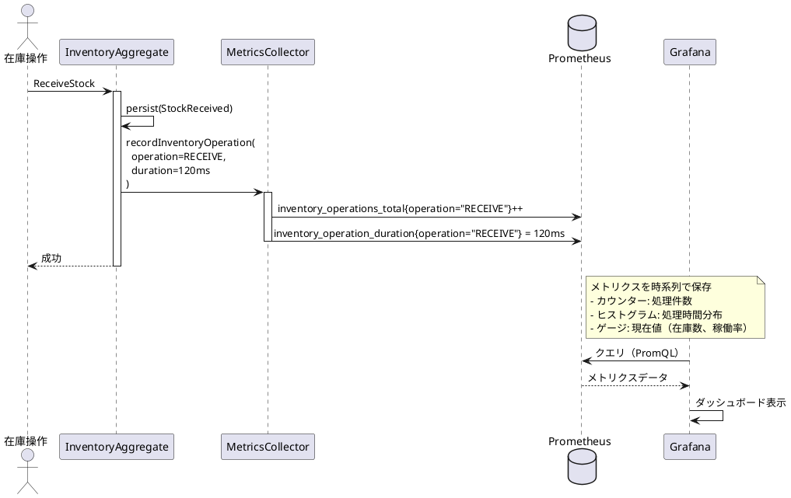

# 第3部 第11章：運用とモニタリング

## 本章の目的

在庫管理システムの安定運用に必要なモニタリング基盤を構築します：

- **ビジネスメトリクス**: 在庫受払処理レート（1日2,000件）、引当成功率、区画稼働率（9区画）の可視化
- **在庫監査ログ**: 全ての在庫変動を追跡可能にする受払履歴と監査レポート
- **アラートと通知**: 低在庫、引当失敗、システム異常の早期検知

## 11.1 ビジネスメトリクス

### 11.1.1 メトリクス設計

在庫管理システムで監視すべきビジネスメトリクス：

| メトリクス | 目的 | 閾値 | 測定単位 |
|----------|------|------|---------|
| 在庫受払処理レート | 1日2,000件の処理状況を監視 | < 1,800件/日で警告 | 件/日 |
| 在庫引当成功率 | 在庫不足や保管条件違反を検知 | < 95%で警告 | % |
| 平均処理時間 | レスポンス劣化を検知 | > 1秒で警告 | ms |
| 区画稼働率 | 9区画の使用状況を監視 | > 90%で警告（満杯） | % |
| カテゴリ別受払比率 | 食品類・日用品の需給バランス | - | % |

**メトリクス収集アーキテクチャ**



### 11.1.2 メトリクス収集の実装（TDD）

#### Step 1: テストから始める（RED）

```scala
// modules/infrastructure/src/test/scala/monitoring/MetricsCollectorSpec.scala
package monitoring

import org.scalatest.flatspec.AnyFlatSpec
import org.scalatest.matchers.should.Matchers
import io.prometheus.client.CollectorRegistry

class MetricsCollectorSpec extends AnyFlatSpec with Matchers {

  "MetricsCollector" should "在庫操作をカウントする" in {
    val registry = new CollectorRegistry()
    val collector = new MetricsCollector(registry)

    // 入庫操作を3回記録
    collector.recordInventoryOperation("RECEIVE", 100)
    collector.recordInventoryOperation("RECEIVE", 120)
    collector.recordInventoryOperation("RECEIVE", 90)

    // カウンターを確認
    val counter = registry.getSampleValue(
      "inventory_operations_total",
      Array("operation"),
      Array("RECEIVE")
    )
    counter shouldBe 3.0
  }

  it should "処理時間をヒストグラムで記録する" in {
    val registry = new CollectorRegistry()
    val collector = new MetricsCollector(registry)

    // 様々な処理時間を記録
    collector.recordInventoryOperation("SHIP", 50)
    collector.recordInventoryOperation("SHIP", 150)
    collector.recordInventoryOperation("SHIP", 500)

    // ヒストグラムのバケットを確認
    val histogramSum = registry.getSampleValue(
      "inventory_operation_duration_milliseconds_sum",
      Array("operation"),
      Array("SHIP")
    )
    histogramSum shouldBe 700.0 // 50 + 150 + 500
  }

  it should "引当成功率を記録する" in {
    val registry = new CollectorRegistry()
    val collector = new MetricsCollector(registry)

    // 成功5回、失敗1回
    collector.recordReservationResult(success = true, reason = None)
    collector.recordReservationResult(success = true, reason = None)
    collector.recordReservationResult(success = true, reason = None)
    collector.recordReservationResult(success = true, reason = None)
    collector.recordReservationResult(success = true, reason = None)
    collector.recordReservationResult(success = false, reason = Some("INSUFFICIENT_STOCK"))

    val successCount = registry.getSampleValue(
      "inventory_reservation_total",
      Array("result"),
      Array("success")
    )
    val failureCount = registry.getSampleValue(
      "inventory_reservation_total",
      Array("result"),
      Array("failure")
    )

    successCount shouldBe 5.0
    failureCount shouldBe 1.0

    // 成功率 = 5 / (5 + 1) = 83.3%
    val successRate = successCount / (successCount + failureCount) * 100
    successRate shouldBe 83.3 +- 0.1
  }

  it should "区画稼働率を記録する" in {
    val registry = new CollectorRegistry()
    val collector = new MetricsCollector(registry)

    // 区画1: 容量1000、使用900（90%）
    collector.recordZoneUtilization("WH01", 1, capacity = 1000, used = 900)

    val utilization = registry.getSampleValue(
      "zone_utilization_ratio",
      Array("warehouse_code", "zone_number"),
      Array("WH01", "1")
    )
    utilization shouldBe 0.9 // 90%
  }
}
```

#### Step 2: 最小限の実装（GREEN）

```scala
// modules/infrastructure/src/main/scala/monitoring/MetricsCollector.scala
package monitoring

import io.prometheus.client._
import scala.concurrent.duration._

class MetricsCollector(registry: CollectorRegistry = CollectorRegistry.defaultRegistry) {

  // 在庫操作カウンター
  private val operationsCounter = Counter.build()
    .name("inventory_operations_total")
    .help("Total number of inventory operations")
    .labelNames("operation") // RECEIVE, SHIP, RESERVE, RELEASE, ADJUST, MOVE
    .register(registry)

  // 在庫操作処理時間ヒストグラム
  private val operationDuration = Histogram.build()
    .name("inventory_operation_duration_milliseconds")
    .help("Inventory operation duration in milliseconds")
    .labelNames("operation")
    .buckets(10, 50, 100, 200, 500, 1000, 2000, 5000) // バケット: 10ms, 50ms, 100ms, ...
    .register(registry)

  // 在庫引当結果カウンター
  private val reservationCounter = Counter.build()
    .name("inventory_reservation_total")
    .help("Total number of inventory reservations")
    .labelNames("result") // success, failure
    .register(registry)

  // 在庫引当失敗理由カウンター
  private val reservationFailureReasonCounter = Counter.build()
    .name("inventory_reservation_failure_total")
    .help("Total number of inventory reservation failures by reason")
    .labelNames("reason") // INSUFFICIENT_STOCK, STORAGE_CONDITION_MISMATCH, VERSION_CONFLICT
    .register(registry)

  // 区画稼働率ゲージ
  private val zoneUtilizationGauge = Gauge.build()
    .name("zone_utilization_ratio")
    .help("Zone utilization ratio (0.0 - 1.0)")
    .labelNames("warehouse_code", "zone_number")
    .register(registry)

  // 区画在庫数ゲージ
  private val zoneInventoryGauge = Gauge.build()
    .name("zone_inventory_quantity")
    .help("Total inventory quantity in a zone")
    .labelNames("warehouse_code", "zone_number", "category")
    .register(registry)

  /**
   * 在庫操作を記録
   */
  def recordInventoryOperation(operation: String, durationMs: Long): Unit = {
    operationsCounter.labels(operation).inc()
    operationDuration.labels(operation).observe(durationMs.toDouble)
  }

  /**
   * 在庫引当結果を記録
   */
  def recordReservationResult(success: Boolean, reason: Option[String]): Unit = {
    if (success) {
      reservationCounter.labels("success").inc()
    } else {
      reservationCounter.labels("failure").inc()
      reason.foreach { r =>
        reservationFailureReasonCounter.labels(r).inc()
      }
    }
  }

  /**
   * 区画稼働率を記録
   */
  def recordZoneUtilization(warehouseCode: String, zoneNumber: Int, capacity: Int, used: Int): Unit = {
    val ratio = if (capacity > 0) used.toDouble / capacity.toDouble else 0.0
    zoneUtilizationGauge.labels(warehouseCode, zoneNumber.toString).set(ratio)
  }

  /**
   * 区画在庫数を記録
   */
  def recordZoneInventory(warehouseCode: String, zoneNumber: Int, category: String, quantity: Int): Unit = {
    zoneInventoryGauge.labels(warehouseCode, zoneNumber.toString, category).set(quantity.toDouble)
  }
}
```

#### Step 3: InventoryAggregateとの統合（REFACTOR）

```scala
// modules/command/interface-adapter/src/main/scala/adapters/aggregate/InventoryAggregateActor.scala
package adapters.aggregate

import monitoring.MetricsCollector
import org.apache.pekko.actor.typed.{ActorRef, Behavior}
import org.apache.pekko.actor.typed.scaladsl.Behaviors
import org.apache.pekko.persistence.typed.PersistenceId
import org.apache.pekko.persistence.typed.scaladsl.{Effect, EventSourcedBehavior}

object InventoryAggregateActor {

  def apply(
    persistenceId: PersistenceId,
    metricsCollector: MetricsCollector
  ): Behavior[Command] = {
    Behaviors.setup { context =>
      EventSourcedBehavior[Command, Event, State](
        persistenceId = persistenceId,
        emptyState = State.Empty,
        commandHandler = (state, command) => handleCommand(state, command, metricsCollector, context),
        eventHandler = handleEvent
      )
    }
  }

  private def handleCommand(
    state: State,
    command: Command,
    metricsCollector: MetricsCollector,
    context: ActorContext[Command]
  ): Effect[Event, State] = {
    val startTime = System.currentTimeMillis()

    val effect = (state, command) match {
      case (Empty, ReceiveStock(inventoryId, productId, warehouseCode, zoneNumber, quantity, replyTo)) =>
        // ... 在庫入庫処理
        Effect
          .persist(StockReceived(inventoryId, productId, warehouseCode, zoneNumber, quantity, Version(1)))
          .thenReply(replyTo)(_ => ReceiveStockSucceeded(inventoryId))

      case (Created(inventory), ReserveStock(inventoryId, quantity, expectedVersion, replyTo)) =>
        // バージョンチェック
        if (inventory.version != expectedVersion) {
          // 競合エラー
          metricsCollector.recordReservationResult(success = false, reason = Some("VERSION_CONFLICT"))
          Effect.reply(replyTo)(ReserveStockFailed(inventoryId, InventoryError.VersionConflict(expectedVersion, inventory.version), inventory.version))
        } else {
          // 引当処理
          inventory.reserveStock(quantity) match {
            case Right(updated) =>
              metricsCollector.recordReservationResult(success = true, reason = None)
              Effect
                .persist(StockReserved(inventoryId, quantity, updated.version))
                .thenReply(replyTo)(_ => ReserveStockSucceeded(inventoryId, updated.version))

            case Left(error: InventoryError.InsufficientStock) =>
              metricsCollector.recordReservationResult(success = false, reason = Some("INSUFFICIENT_STOCK"))
              Effect.reply(replyTo)(ReserveStockFailed(inventoryId, error, inventory.version))

            case Left(error) =>
              metricsCollector.recordReservationResult(success = false, reason = Some("OTHER"))
              Effect.reply(replyTo)(ReserveStockFailed(inventoryId, error, inventory.version))
          }
        }

      // ... 他のコマンドハンドラー
    }

    // 処理時間を記録
    val duration = System.currentTimeMillis() - startTime
    val operationType = command match {
      case _: ReceiveStock => "RECEIVE"
      case _: ShipStock => "SHIP"
      case _: ReserveStock => "RESERVE"
      case _: ReleaseStock => "RELEASE"
      case _: AdjustStock => "ADJUST"
      case _: MoveStock => "MOVE"
    }
    metricsCollector.recordInventoryOperation(operationType, duration)

    effect
  }
}
```

### 11.1.3 Prometheusエンドポイントの公開

```scala
// apps/command-api/src/main/scala/api/MetricsRoute.scala
package api

import org.apache.pekko.http.scaladsl.server.Directives._
import org.apache.pekko.http.scaladsl.server.Route
import org.apache.pekko.http.scaladsl.model.{ContentTypes, HttpEntity}
import io.prometheus.client.CollectorRegistry
import io.prometheus.client.exporter.common.TextFormat
import java.io.StringWriter

class MetricsRoute(registry: CollectorRegistry) {

  /**
   * Prometheusメトリクスエンドポイント
   *
   * GET /metrics → Prometheus形式のメトリクス
   */
  val route: Route = {
    path("metrics") {
      get {
        val writer = new StringWriter()
        TextFormat.write004(writer, registry.metricFamilySamples())

        complete(HttpEntity(
          ContentTypes.`text/plain(UTF-8)`,
          writer.toString
        ))
      }
    }
  }
}
```

**Prometheusスクレイプ設定**

```yaml
# prometheus.yml
scrape_configs:
  - job_name: 'inventory-command-api'
    scrape_interval: 15s
    static_configs:
      - targets: ['localhost:8080']
    metrics_path: '/metrics'

  - job_name: 'inventory-query-api'
    scrape_interval: 15s
    static_configs:
      - targets: ['localhost:8081']
    metrics_path: '/metrics'
```

### 11.1.4 Grafanaダッシュボード

**PromQLクエリ例**

```promql
# 在庫受払処理レート（1日あたり）
rate(inventory_operations_total[1d])

# 在庫引当成功率（直近1時間）
sum(rate(inventory_reservation_total{result="success"}[1h])) /
sum(rate(inventory_reservation_total[1h])) * 100

# 処理時間のP95（直近5分）
histogram_quantile(0.95,
  sum(rate(inventory_operation_duration_milliseconds_bucket[5m])) by (le, operation)
)

# 区画稼働率（現在値）
zone_utilization_ratio

# カテゴリ別在庫数（現在値）
sum(zone_inventory_quantity) by (category)
```

**Grafanaダッシュボード設定（JSON）**

```json
{
  "dashboard": {
    "title": "在庫管理システム - ビジネスメトリクス",
    "panels": [
      {
        "id": 1,
        "title": "在庫受払処理レート（1日）",
        "type": "graph",
        "targets": [
          {
            "expr": "rate(inventory_operations_total[1d])",
            "legendFormat": "{{operation}}"
          }
        ],
        "yaxes": [
          {
            "label": "件/秒",
            "format": "short"
          }
        ]
      },
      {
        "id": 2,
        "title": "在庫引当成功率",
        "type": "stat",
        "targets": [
          {
            "expr": "sum(rate(inventory_reservation_total{result=\"success\"}[1h])) / sum(rate(inventory_reservation_total[1h])) * 100"
          }
        ],
        "thresholds": {
          "mode": "absolute",
          "steps": [
            { "value": 0, "color": "red" },
            { "value": 95, "color": "yellow" },
            { "value": 99, "color": "green" }
          ]
        }
      },
      {
        "id": 3,
        "title": "区画稼働率（ヒートマップ）",
        "type": "heatmap",
        "targets": [
          {
            "expr": "zone_utilization_ratio",
            "legendFormat": "{{warehouse_code}}-Zone{{zone_number}}"
          }
        ]
      },
      {
        "id": 4,
        "title": "処理時間分布（P50/P95/P99）",
        "type": "graph",
        "targets": [
          {
            "expr": "histogram_quantile(0.50, sum(rate(inventory_operation_duration_milliseconds_bucket[5m])) by (le, operation))",
            "legendFormat": "{{operation}} P50"
          },
          {
            "expr": "histogram_quantile(0.95, sum(rate(inventory_operation_duration_milliseconds_bucket[5m])) by (le, operation))",
            "legendFormat": "{{operation}} P95"
          },
          {
            "expr": "histogram_quantile(0.99, sum(rate(inventory_operation_duration_milliseconds_bucket[5m])) by (le, operation))",
            "legendFormat": "{{operation}} P99"
          }
        ]
      }
    ]
  }
}
```

## 11.2 在庫監査ログ

### 11.2.1 受払履歴の設計

在庫管理システムでは、全ての在庫変動を追跡可能にするため、受払履歴テーブルを設計します。

**受払履歴テーブル**

```sql
CREATE TABLE 受払履歴 (
    受払ID BIGSERIAL PRIMARY KEY,
    在庫ID VARCHAR(50) NOT NULL,
    商品ID VARCHAR(50) NOT NULL,
    倉庫コード VARCHAR(20) NOT NULL,
    区画番号 INTEGER NOT NULL,
    受払区分 VARCHAR(20) NOT NULL,  -- 入庫, 出庫, 引当, 引当解除, 調整, 移動
    受払数量 INTEGER NOT NULL,
    受払前在庫数 INTEGER NOT NULL,
    受払後在庫数 INTEGER NOT NULL,
    受払前引当済数 INTEGER NOT NULL,
    受払後引当済数 INTEGER NOT NULL,
    受払日時 TIMESTAMP NOT NULL,
    イベントシーケンス番号 BIGINT NOT NULL,
    実行者 VARCHAR(100),
    備考 TEXT,
    作成日時 TIMESTAMP NOT NULL DEFAULT CURRENT_TIMESTAMP,

    -- インデックス
    CONSTRAINT fk_受払履歴_在庫 FOREIGN KEY (在庫ID) REFERENCES 在庫(在庫ID),
    CONSTRAINT fk_受払履歴_商品 FOREIGN KEY (商品ID) REFERENCES 商品(商品ID)
);

CREATE INDEX idx_受払履歴_在庫ID ON 受払履歴(在庫ID);
CREATE INDEX idx_受払履歴_商品ID ON 受払履歴(商品ID);
CREATE INDEX idx_受払履歴_倉庫区画 ON 受払履歴(倉庫コード, 区画番号);
CREATE INDEX idx_受払履歴_受払日時 ON 受払履歴(受払日時);
CREATE INDEX idx_受払履歴_受払区分 ON 受払履歴(受払区分);
```

**受払履歴の記録（イベント駆動）**

```scala
// apps/read-model-updater/src/main/scala/updater/InventoryHistoryRecorder.scala
package updater

import domain.model._
import adapters.dao.InventoryHistoryDao
import com.amazonaws.services.lambda.runtime.events.DynamodbEvent
import scala.concurrent.{Future, ExecutionContext}
import java.time.Instant

class InventoryHistoryRecorder(
  historyDao: InventoryHistoryDao
)(implicit ec: ExecutionContext) {

  def recordFromEvent(record: DynamodbEvent.DynamodbStreamRecord): Future[Unit] = {
    val eventType = extractEventType(record)
    val inventoryId = extractInventoryId(record)

    eventType match {
      case "StockReceived" =>
        val event = deserializeEvent[StockReceived](record)
        historyDao.insert(InventoryHistory(
          inventoryId = event.inventoryId,
          productId = event.productId,
          warehouseCode = event.warehouseCode,
          zoneNumber = event.zoneNumber,
          transactionType = TransactionType.Receive,
          quantity = event.quantity,
          quantityOnHandBefore = 0,  // 入庫前は0
          quantityOnHandAfter = event.quantity.value,
          quantityReservedBefore = 0,
          quantityReservedAfter = 0,
          transactionDate = Instant.now(),
          eventSequenceNumber = extractSequenceNumber(record),
          executor = extractExecutor(record),
          note = Some("入庫処理")
        ))

      case "StockShipped" =>
        val event = deserializeEvent[StockShipped](record)
        val beforeState = getInventoryState(event.inventoryId)
        historyDao.insert(InventoryHistory(
          inventoryId = event.inventoryId,
          productId = beforeState.productId,
          warehouseCode = beforeState.warehouseCode,
          zoneNumber = beforeState.zoneNumber,
          transactionType = TransactionType.Ship,
          quantity = event.quantity,
          quantityOnHandBefore = beforeState.quantityOnHand.value,
          quantityOnHandAfter = beforeState.quantityOnHand.value - event.quantity.value,
          quantityReservedBefore = beforeState.quantityReserved.value,
          quantityReservedAfter = beforeState.quantityReserved.value,
          transactionDate = Instant.now(),
          eventSequenceNumber = extractSequenceNumber(record),
          executor = extractExecutor(record),
          note = Some("出庫処理")
        ))

      case "StockReserved" =>
        val event = deserializeEvent[StockReserved](record)
        val beforeState = getInventoryState(event.inventoryId)
        historyDao.insert(InventoryHistory(
          inventoryId = event.inventoryId,
          productId = beforeState.productId,
          warehouseCode = beforeState.warehouseCode,
          zoneNumber = beforeState.zoneNumber,
          transactionType = TransactionType.Reserve,
          quantity = event.quantity,
          quantityOnHandBefore = beforeState.quantityOnHand.value,
          quantityOnHandAfter = beforeState.quantityOnHand.value,
          quantityReservedBefore = beforeState.quantityReserved.value,
          quantityReservedAfter = beforeState.quantityReserved.value + event.quantity.value,
          transactionDate = Instant.now(),
          eventSequenceNumber = extractSequenceNumber(record),
          executor = extractExecutor(record),
          note = Some("在庫引当")
        ))

      // ... 他のイベントタイプ

      case _ =>
        Future.successful(())
    }
  }
}

sealed trait TransactionType
object TransactionType {
  case object Receive extends TransactionType  // 入庫
  case object Ship extends TransactionType     // 出庫
  case object Reserve extends TransactionType  // 引当
  case object Release extends TransactionType  // 引当解除
  case object Adjust extends TransactionType   // 調整
  case object Move extends TransactionType     // 移動
}
```

### 11.2.2 監査レポートの生成

#### 区画別受払集計レポート

```scala
// modules/query/interface-adapter/src/main/scala/adapters/report/InventoryAuditReportGenerator.scala
package adapters.report

import domain.model._
import adapters.dao.InventoryHistoryDao
import scala.concurrent.{Future, ExecutionContext}
import java.time.{LocalDate, LocalDateTime}

class InventoryAuditReportGenerator(
  historyDao: InventoryHistoryDao
)(implicit ec: ExecutionContext) {

  /**
   * 区画別受払集計レポート
   *
   * @param warehouseCode 倉庫コード
   * @param startDate 集計開始日
   * @param endDate 集計終了日
   * @return 区画ごとの受払集計
   */
  def generateZoneTransactionReport(
    warehouseCode: WarehouseCode,
    startDate: LocalDate,
    endDate: LocalDate
  ): Future[List[ZoneTransactionSummary]] = {
    historyDao.aggregateByZone(warehouseCode, startDate, endDate).map { results =>
      results.map { case (zoneNumber, transactionType, totalQuantity, transactionCount) =>
        ZoneTransactionSummary(
          warehouseCode = warehouseCode,
          zoneNumber = zoneNumber,
          transactionType = transactionType,
          totalQuantity = Quantity(totalQuantity),
          transactionCount = transactionCount
        )
      }
    }
  }

  /**
   * 在庫差異レポート
   *
   * イベントソーシングの在庫数とRead Modelの在庫数を比較して差異を検出
   */
  def generateInventoryDiscrepancyReport(): Future[List[InventoryDiscrepancy]] = {
    for {
      // イベントソーシング側の在庫数を再計算
      eventSourcingInventories <- recalculateInventoryFromEvents()
      // Read Model側の在庫数を取得
      readModelInventories <- inventoryDao.findAll()
    } yield {
      eventSourcingInventories.flatMap { esInventory =>
        readModelInventories.find(_.id == esInventory.id).flatMap { rmInventory =>
          if (esInventory.quantityOnHand != rmInventory.quantityOnHand ||
              esInventory.quantityReserved != rmInventory.quantityReserved) {
            Some(InventoryDiscrepancy(
              inventoryId = esInventory.id,
              productId = esInventory.productId,
              warehouseCode = esInventory.warehouseCode,
              zoneNumber = esInventory.zoneNumber,
              eventSourcingQuantityOnHand = esInventory.quantityOnHand,
              readModelQuantityOnHand = rmInventory.quantityOnHand,
              eventSourcingQuantityReserved = esInventory.quantityReserved,
              readModelQuantityReserved = rmInventory.quantityReserved,
              discrepancy = Quantity(
                Math.abs(esInventory.quantityOnHand.value - rmInventory.quantityOnHand.value)
              )
            ))
          } else {
            None
          }
        }
      }
    }
  }

  /**
   * カテゴリ別・保管条件別集計レポート
   */
  def generateCategoryStorageReport(
    startDate: LocalDate,
    endDate: LocalDate
  ): Future[List[CategoryStorageSummary]] = {
    historyDao.aggregateByCategoryAndStorage(startDate, endDate).map { results =>
      results.map { case (category, storageCondition, receiveQty, shipQty, netChange) =>
        CategoryStorageSummary(
          category = category,
          storageCondition = storageCondition,
          totalReceived = Quantity(receiveQty),
          totalShipped = Quantity(shipQty),
          netChange = Quantity(netChange)
        )
      }
    }
  }

  /**
   * イベントソーシングから在庫を再計算
   */
  private def recalculateInventoryFromEvents(): Future[List[Inventory]] = {
    historyDao.findAll().map { histories =>
      histories.groupBy(_.inventoryId).map { case (inventoryId, historyList) =>
        val sorted = historyList.sortBy(_.eventSequenceNumber)
        val latest = sorted.last

        Inventory(
          id = inventoryId,
          productId = latest.productId,
          warehouseCode = latest.warehouseCode,
          zoneNumber = latest.zoneNumber,
          quantityOnHand = Quantity(latest.quantityOnHandAfter),
          quantityReserved = Quantity(latest.quantityReservedAfter),
          version = Version(sorted.size)
        )
      }.toList
    }
  }
}

final case class ZoneTransactionSummary(
  warehouseCode: WarehouseCode,
  zoneNumber: ZoneNumber,
  transactionType: TransactionType,
  totalQuantity: Quantity,
  transactionCount: Int
)

final case class InventoryDiscrepancy(
  inventoryId: InventoryId,
  productId: ProductId,
  warehouseCode: WarehouseCode,
  zoneNumber: ZoneNumber,
  eventSourcingQuantityOnHand: Quantity,
  readModelQuantityOnHand: Quantity,
  eventSourcingQuantityReserved: Quantity,
  readModelQuantityReserved: Quantity,
  discrepancy: Quantity
)

final case class CategoryStorageSummary(
  category: Category,
  storageCondition: StorageCondition,
  totalReceived: Quantity,
  totalShipped: Quantity,
  netChange: Quantity
)
```

**SQL実装（DAO）**

```scala
// modules/query/interface-adapter/src/main/scala/adapters/dao/InventoryHistoryDao.scala
package adapters.dao

import slick.jdbc.PostgresProfile.api._
import scala.concurrent.{Future, ExecutionContext}
import java.time.LocalDate

class InventoryHistoryDao(db: Database)(implicit ec: ExecutionContext) {

  /**
   * 区画別受払集計
   */
  def aggregateByZone(
    warehouseCode: WarehouseCode,
    startDate: LocalDate,
    endDate: LocalDate
  ): Future[List[(ZoneNumber, TransactionType, Int, Int)]] = {
    val query = sql"""
      SELECT
        区画番号,
        受払区分,
        SUM(受払数量) AS 総数量,
        COUNT(*) AS 件数
      FROM 受払履歴
      WHERE 倉庫コード = ${warehouseCode.value}
        AND 受払日時 >= ${startDate.atStartOfDay()}
        AND 受払日時 < ${endDate.plusDays(1).atStartOfDay()}
      GROUP BY 区画番号, 受払区分
      ORDER BY 区画番号, 受払区分
    """.as[(Int, String, Int, Int)]

    db.run(query).map(_.toList.map { case (zone, txType, qty, count) =>
      (ZoneNumber(zone), TransactionType.fromString(txType), qty, count)
    })
  }

  /**
   * カテゴリ別・保管条件別集計
   */
  def aggregateByCategoryAndStorage(
    startDate: LocalDate,
    endDate: LocalDate
  ): Future[List[(Category, StorageCondition, Int, Int, Int)]] = {
    val query = sql"""
      SELECT
        p.カテゴリ,
        p.保管条件,
        COALESCE(SUM(CASE WHEN h.受払区分 = '入庫' THEN h.受払数量 ELSE 0 END), 0) AS 入庫数,
        COALESCE(SUM(CASE WHEN h.受払区分 = '出庫' THEN h.受払数量 ELSE 0 END), 0) AS 出庫数,
        COALESCE(SUM(CASE WHEN h.受払区分 = '入庫' THEN h.受払数量 ELSE -h.受払数量 END), 0) AS 純増減
      FROM 商品 p
      LEFT JOIN 受払履歴 h ON p.商品ID = h.商品ID
        AND h.受払日時 >= ${startDate.atStartOfDay()}
        AND h.受払日時 < ${endDate.plusDays(1).atStartOfDay()}
      GROUP BY p.カテゴリ, p.保管条件
      ORDER BY p.カテゴリ, p.保管条件
    """.as[(String, String, Int, Int, Int)]

    db.run(query).map(_.toList.map { case (cat, storage, receive, ship, net) =>
      (Category.fromString(cat), StorageCondition.fromString(storage), receive, ship, net)
    })
  }
}
```

### 11.2.3 不整合の検出と修正

```scala
// apps/read-model-updater/src/main/scala/integrity/IntegrityChecker.scala
package integrity

import domain.model._
import adapters.dao.{InventoryDao, InventoryHistoryDao}
import adapters.report.InventoryAuditReportGenerator
import org.apache.pekko.actor.typed.{ActorSystem, Behavior}
import org.apache.pekko.actor.typed.scaladsl.Behaviors
import scala.concurrent.duration._
import scala.concurrent.ExecutionContext

object IntegrityChecker {

  sealed trait Command
  private case object RunCheck extends Command
  final case class RepairDiscrepancy(inventoryId: InventoryId) extends Command

  def apply(
    reportGenerator: InventoryAuditReportGenerator,
    inventoryDao: InventoryDao
  )(implicit ec: ExecutionContext): Behavior[Command] = {
    Behaviors.setup { context =>
      // 定期的に整合性チェックを実行（1日1回）
      context.system.scheduler.scheduleAtFixedRate(
        initialDelay = 1.hour,
        interval = 24.hours
      )(() => context.self ! RunCheck)

      Behaviors.receiveMessage {
        case RunCheck =>
          context.log.info("Starting inventory integrity check")

          reportGenerator.generateInventoryDiscrepancyReport().foreach { discrepancies =>
            if (discrepancies.isEmpty) {
              context.log.info("No discrepancies found")
            } else {
              context.log.warn(s"Found ${discrepancies.size} discrepancies")

              discrepancies.foreach { disc =>
                context.log.warn(
                  s"Discrepancy detected: inventoryId=${disc.inventoryId.value}, " +
                  s"ES onHand=${disc.eventSourcingQuantityOnHand.value}, " +
                  s"RM onHand=${disc.readModelQuantityOnHand.value}, " +
                  s"difference=${disc.discrepancy.value}"
                )

                // 自動修正（オプション）
                // context.self ! RepairDiscrepancy(disc.inventoryId)
              }
            }
          }

          Behaviors.same

        case RepairDiscrepancy(inventoryId) =>
          context.log.info(s"Repairing discrepancy for inventory: ${inventoryId.value}")

          // Read Modelを再構築
          reportGenerator.recalculateInventoryFromEvents().foreach { inventories =>
            inventories.find(_.id == inventoryId).foreach { correctedInventory =>
              inventoryDao.update(correctedInventory).foreach { _ =>
                context.log.info(s"Inventory repaired: ${inventoryId.value}")
              }
            }
          }

          Behaviors.same
      }
    }
  }
}
```

## 11.3 アラートと通知

### 11.3.1 アラート設計

在庫管理システムで必要なアラート：

| アラート種別 | 条件 | 重要度 | 通知先 |
|------------|------|--------|--------|
| 低在庫アラート | 区画別在庫 < 閾値 | Medium/High/Critical | 倉庫管理者 |
| 在庫引当失敗 | 引当失敗が連続5回 | High | システム管理者 |
| 保管条件不一致 | 冷蔵商品が常温区画に配置 | Critical | 倉庫管理者 |
| 区画満杯警告 | 区画稼働率 > 90% | Medium | 倉庫管理者 |
| システム異常 | API応答時間 > 5秒 | High | システム管理者 |
| 受払処理遅延 | 1日の受払 < 1,800件 | Medium | 業務管理者 |

### 11.3.2 Prometheusアラートルール

```yaml
# prometheus-alerts.yml
groups:
  - name: inventory_alerts
    interval: 30s
    rules:
      # 低在庫アラート（区画別）
      - alert: LowStockWarning
        expr: zone_inventory_quantity < 100
        for: 5m
        labels:
          severity: medium
        annotations:
          summary: "低在庫警告: {{ $labels.warehouse_code }}-Zone{{ $labels.zone_number }}"
          description: "区画の在庫が100個未満です（現在: {{ $value }}個）"

      # 在庫引当失敗率が高い
      - alert: HighReservationFailureRate
        expr: |
          (sum(rate(inventory_reservation_total{result="failure"}[5m])) /
           sum(rate(inventory_reservation_total[5m]))) * 100 > 5
        for: 10m
        labels:
          severity: high
        annotations:
          summary: "在庫引当失敗率が高い"
          description: "引当失敗率が5%を超えています（現在: {{ $value }}%）"

      # 区画満杯警告
      - alert: ZoneAlmostFull
        expr: zone_utilization_ratio > 0.9
        for: 5m
        labels:
          severity: medium
        annotations:
          summary: "区画満杯警告: {{ $labels.warehouse_code }}-Zone{{ $labels.zone_number }}"
          description: "区画の稼働率が90%を超えています（現在: {{ $value | humanizePercentage }}）"

      # API応答時間が遅い
      - alert: SlowAPIResponse
        expr: |
          histogram_quantile(0.95,
            sum(rate(inventory_operation_duration_milliseconds_bucket[5m])) by (le, operation)
          ) > 5000
        for: 10m
        labels:
          severity: high
        annotations:
          summary: "API応答時間が遅い: {{ $labels.operation }}"
          description: "P95レイテンシが5秒を超えています（現在: {{ $value }}ms）"

      # 受払処理レートが低い
      - alert: LowTransactionRate
        expr: |
          sum(increase(inventory_operations_total[1d])) < 1800
        for: 1h
        labels:
          severity: medium
        annotations:
          summary: "受払処理レートが低い"
          description: "1日の受払処理が1,800件未満です（現在: {{ $value }}件）"
```

### 11.3.3 Alertmanager設定

```yaml
# alertmanager.yml
global:
  slack_api_url: 'https://hooks.slack.com/services/YOUR/SLACK/WEBHOOK'

route:
  group_by: ['alertname', 'severity']
  group_wait: 10s
  group_interval: 10s
  repeat_interval: 12h
  receiver: 'default-receiver'
  routes:
    # Critical アラートはSlackとメール両方に通知
    - match:
        severity: critical
      receiver: 'critical-receiver'
      continue: true

    # High アラートはSlackに通知
    - match:
        severity: high
      receiver: 'high-receiver'

    # Medium アラートはSlackに通知（通知頻度を下げる）
    - match:
        severity: medium
      receiver: 'medium-receiver'
      repeat_interval: 24h

receivers:
  - name: 'default-receiver'
    slack_configs:
      - channel: '#inventory-alerts'
        title: '在庫管理システムアラート'
        text: '{{ range .Alerts }}{{ .Annotations.summary }}\n{{ .Annotations.description }}\n{{ end }}'

  - name: 'critical-receiver'
    slack_configs:
      - channel: '#inventory-critical'
        title: '🚨 CRITICAL: 在庫管理システム'
        text: '{{ range .Alerts }}{{ .Annotations.summary }}\n{{ .Annotations.description }}\n{{ end }}'
    email_configs:
      - to: 'warehouse-admin@example.com'
        from: 'alertmanager@example.com'
        smarthost: 'smtp.example.com:587'
        auth_username: 'alertmanager@example.com'
        auth_password: 'password'

  - name: 'high-receiver'
    slack_configs:
      - channel: '#inventory-alerts'
        title: '⚠️  HIGH: 在庫管理システム'
        text: '{{ range .Alerts }}{{ .Annotations.summary }}\n{{ .Annotations.description }}\n{{ end }}'

  - name: 'medium-receiver'
    slack_configs:
      - channel: '#inventory-info'
        title: 'ℹ️  MEDIUM: 在庫管理システム'
        text: '{{ range .Alerts }}{{ .Annotations.summary }}\n{{ .Annotations.description }}\n{{ end }}'
```

### 11.3.4 カスタムアラート（アプリケーション内）

```scala
// modules/infrastructure/src/main/scala/monitoring/AlertManager.scala
package monitoring

import domain.model._
import org.apache.pekko.actor.typed.{ActorRef, Behavior}
import org.apache.pekko.actor.typed.scaladsl.Behaviors
import scala.concurrent.duration._

object AlertManager {

  sealed trait Command
  final case class CheckLowStock(inventoryId: InventoryId, quantity: Quantity, threshold: Quantity) extends Command
  final case class CheckStorageConditionMismatch(
    inventoryId: InventoryId,
    productStorageCondition: StorageCondition,
    zoneStorageCondition: StorageCondition
  ) extends Command
  final case class CheckReservationFailure(inventoryId: InventoryId, reason: String) extends Command

  sealed trait Alert
  final case class LowStockAlert(
    inventoryId: InventoryId,
    currentQuantity: Quantity,
    threshold: Quantity,
    severity: AlertSeverity
  ) extends Alert

  final case class StorageConditionMismatchAlert(
    inventoryId: InventoryId,
    productCondition: StorageCondition,
    zoneCondition: StorageCondition
  ) extends Alert

  final case class ReservationFailureAlert(
    inventoryId: InventoryId,
    failureCount: Int,
    lastReason: String
  ) extends Alert

  def apply(notifier: ActorRef[Alert]): Behavior[Command] = {
    monitoring(Map.empty)
  }

  private def monitoring(
    reservationFailures: Map[InventoryId, (Int, String)] // (失敗回数, 最後の理由)
  ): Behavior[Command] = {
    Behaviors.receive { (context, message) =>
      message match {
        case CheckLowStock(inventoryId, quantity, threshold) =>
          val ratio = quantity.value.toDouble / threshold.value.toDouble

          val severity = if (ratio < 0.5) AlertSeverity.Critical
                        else if (ratio < 0.75) AlertSeverity.High
                        else AlertSeverity.Medium

          if (quantity.value < threshold.value) {
            context.log.warn(
              s"Low stock alert: inventoryId=${inventoryId.value}, " +
              s"quantity=${quantity.value}, threshold=${threshold.value}, severity=$severity"
            )

            notifier ! LowStockAlert(inventoryId, quantity, threshold, severity)
          }

          Behaviors.same

        case CheckStorageConditionMismatch(inventoryId, productCondition, zoneCondition) =>
          if (productCondition != zoneCondition) {
            context.log.error(
              s"Storage condition mismatch: inventoryId=${inventoryId.value}, " +
              s"productCondition=$productCondition, zoneCondition=$zoneCondition"
            )

            notifier ! StorageConditionMismatchAlert(inventoryId, productCondition, zoneCondition)
          }

          Behaviors.same

        case CheckReservationFailure(inventoryId, reason) =>
          val (count, _) = reservationFailures.getOrElse(inventoryId, (0, ""))
          val newCount = count + 1

          val updated = reservationFailures.updated(inventoryId, (newCount, reason))

          // 5回連続失敗でアラート
          if (newCount >= 5) {
            context.log.error(
              s"Reservation failure alert: inventoryId=${inventoryId.value}, " +
              s"failureCount=$newCount, reason=$reason"
            )

            notifier ! ReservationFailureAlert(inventoryId, newCount, reason)

            // カウンターをリセット
            monitoring(reservationFailures - inventoryId)
          } else {
            monitoring(updated)
          }
      }
    }
  }
}

sealed trait AlertSeverity
object AlertSeverity {
  case object Critical extends AlertSeverity
  case object High extends AlertSeverity
  case object Medium extends AlertSeverity
  case object Low extends AlertSeverity
}
```

**Slack通知の実装**

```scala
// modules/infrastructure/src/main/scala/notification/SlackNotifier.scala
package notification

import monitoring.AlertManager._
import org.apache.pekko.actor.typed.Behavior
import org.apache.pekko.actor.typed.scaladsl.Behaviors
import org.apache.pekko.http.scaladsl.Http
import org.apache.pekko.http.scaladsl.model._
import org.apache.pekko.http.scaladsl.unmarshalling.Unmarshal
import spray.json._
import DefaultJsonProtocol._

object SlackNotifier {

  private val SLACK_WEBHOOK_URL = sys.env.getOrElse("SLACK_WEBHOOK_URL", "")

  def apply(): Behavior[Alert] = {
    Behaviors.setup { context =>
      implicit val system = context.system

      Behaviors.receiveMessage {
        case alert: LowStockAlert =>
          val color = alert.severity match {
            case AlertSeverity.Critical => "danger"
            case AlertSeverity.High => "warning"
            case _ => "good"
          }

          val message = SlackMessage(
            text = s"🚨 低在庫アラート",
            attachments = List(SlackAttachment(
              color = color,
              title = s"在庫ID: ${alert.inventoryId.value}",
              text = s"現在在庫: ${alert.currentQuantity.value}個\n閾値: ${alert.threshold.value}個",
              fields = List(
                SlackField("重要度", alert.severity.toString, short = true),
                SlackField("在庫ID", alert.inventoryId.value, short = true)
              )
            ))
          )

          sendToSlack(message)
          Behaviors.same

        case alert: StorageConditionMismatchAlert =>
          val message = SlackMessage(
            text = s"🚨 保管条件不一致",
            attachments = List(SlackAttachment(
              color = "danger",
              title = s"在庫ID: ${alert.inventoryId.value}",
              text = s"商品の保管条件: ${alert.productCondition}\n区画の保管条件: ${alert.zoneCondition}",
              fields = List(
                SlackField("重要度", "CRITICAL", short = true),
                SlackField("在庫ID", alert.inventoryId.value, short = true)
              )
            ))
          )

          sendToSlack(message)
          Behaviors.same

        case alert: ReservationFailureAlert =>
          val message = SlackMessage(
            text = s"⚠️  在庫引当失敗（連続${alert.failureCount}回）",
            attachments = List(SlackAttachment(
              color = "warning",
              title = s"在庫ID: ${alert.inventoryId.value}",
              text = s"失敗理由: ${alert.lastReason}",
              fields = List(
                SlackField("失敗回数", alert.failureCount.toString, short = true),
                SlackField("在庫ID", alert.inventoryId.value, short = true)
              )
            ))
          )

          sendToSlack(message)
          Behaviors.same
      }
    }
  }

  private def sendToSlack(message: SlackMessage)(implicit system: ActorSystem[_]): Unit = {
    import system.executionContext

    if (SLACK_WEBHOOK_URL.nonEmpty) {
      val request = HttpRequest(
        method = HttpMethods.POST,
        uri = SLACK_WEBHOOK_URL,
        entity = HttpEntity(
          ContentTypes.`application/json`,
          message.toJson.compactPrint
        )
      )

      Http().singleRequest(request).foreach { response =>
        if (response.status.isSuccess()) {
          system.log.info("Slack notification sent successfully")
        } else {
          system.log.error(s"Failed to send Slack notification: ${response.status}")
        }
      }
    }
  }
}

final case class SlackMessage(
  text: String,
  attachments: List[SlackAttachment]
)

final case class SlackAttachment(
  color: String,
  title: String,
  text: String,
  fields: List[SlackField]
)

final case class SlackField(
  title: String,
  value: String,
  short: Boolean
)

object SlackJsonProtocol extends DefaultJsonProtocol {
  implicit val slackFieldFormat = jsonFormat3(SlackField)
  implicit val slackAttachmentFormat = jsonFormat4(SlackAttachment)
  implicit val slackMessageFormat = jsonFormat2(SlackMessage)
}
```

## まとめ

### 実装した運用・モニタリング機能

1. **ビジネスメトリクス**
   - Prometheusによるメトリクス収集（在庫受払処理レート、引当成功率、処理時間、区画稼働率）
   - Grafanaダッシュボード（リアルタイム可視化）
   - PromQLクエリによる柔軟な分析

2. **在庫監査ログ**
   - 受払履歴テーブルによる全在庫変動の記録（1日2,000件）
   - 監査レポート生成（区画別集計、在庫差異レポート、カテゴリ別集計）
   - 整合性チェッカー（イベントソーシングとRead Modelの差異検出）
   - 自動修正機能（Read Model再構築）

3. **アラートと通知**
   - Prometheusアラートルール（低在庫、引当失敗率、区画満杯、API遅延、受払処理遅延）
   - Alertmanager設定（重要度別ルーティング）
   - Slack通知（カスタムアラート、リアルタイム通知）
   - メール通知（Critical アラート）

### 運用のベストプラクティス

1. **メトリクス収集の設計**
   - ビジネスメトリクス（KPI）とシステムメトリクス（SLI）を両方収集
   - ヒストグラムでP50/P95/P99を追跡
   - ゲージで現在値（在庫数、稼働率）を監視

2. **監査ログの活用**
   - 全ての在庫変動を受払履歴として記録
   - 定期的な整合性チェック（1日1回）
   - 差異検出時の自動修正

3. **アラート設計**
   - 重要度別にルーティング（Critical → Slack + メール、High/Medium → Slack）
   - アラート疲れを防ぐため閾値を適切に設定
   - 連続失敗時のみアラート（ノイズ削減）

4. **可視化**
   - Grafanaダッシュボードで現状を一目で把握
   - 異常時のドリルダウン分析
   - 履歴データによるトレンド分析

次章では、高度なトピック（在庫予測、マルチテナント対応、グローバル展開）について解説します。
