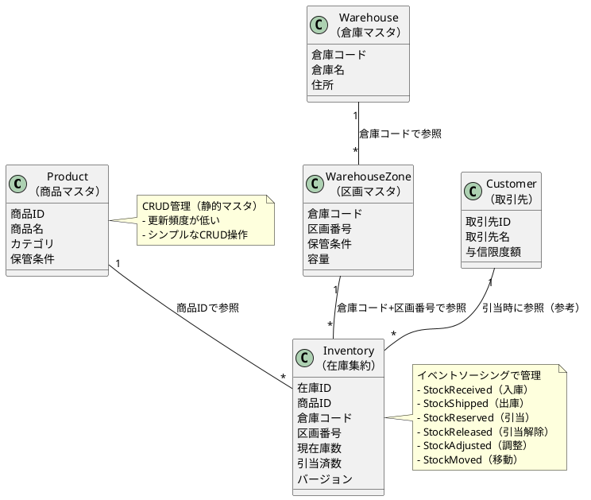

# 第3部 第13章：まとめと実践演習

## 本章の目的

第3部「在庫管理サービスのケーススタディ」で学んだ内容を振り返り、実践演習を通じて理解を深めます：

- **学んだことの振り返り**: 複数集約の設計、ハイブリッドアーキテクチャ、在庫管理特有の課題
- **実践演習**: 在庫棚卸、区画間移動、在庫分析、在庫予測の実装課題
- **次のステップ**: より複雑なビジネスルール、他コンテキストとの統合、本番展開

## 13.1 学んだこと

### 13.1.1 複数集約の設計と実装

第3部では、5つの集約を使用した在庫管理ドメインモデルを構築しました。

**実装した集約の概要**

| 集約 | 責務 | 管理方式 | 主要なコマンド |
|-----|------|---------|-------------|
| **Product** | 商品マスタ | CRUD | - |
| **Warehouse** | 倉庫マスタ | CRUD | - |
| **WarehouseZone** | 区画マスタ（保管条件付き） | CRUD | - |
| **Inventory** | 在庫管理（受払処理） | イベントソーシング | ReceiveStock, ShipStock, ReserveStock, ReleaseStock, AdjustStock, MoveStock |
| **Customer**（参考） | 取引先管理 | イベントソーシング（参考） | RegisterCustomer, UpdateCreditLimit |

**集約間の関連**



**静的マスタと動的データの使い分け**

| データ種別 | 管理方式 | 理由 | 例 |
|----------|---------|------|---|
| **静的マスタ** | CRUD管理 | 更新頻度が低く、履歴が不要 | Product, Warehouse, WarehouseZone |
| **動的データ** | イベントソーシング | 更新頻度が高く、履歴が重要 | Inventory, Customer（参考） |

この使い分けにより、以下のメリットが得られました：

1. **シンプルさと柔軟性のバランス**: 静的マスタはCRUDでシンプルに、動的データはイベントソーシングで履歴を保持
2. **パフォーマンス最適化**: 静的マスタはキャッシュしやすく、動的データは非同期処理で高速化
3. **監査要件への対応**: 在庫変動は全てイベントとして記録され、完全な監査ログを実現

### 13.1.2 イベントソーシングとCRUD管理のハイブリッドアーキテクチャ

**アーキテクチャ全体像**

```plantuml
@startuml
!define RECTANGLE class

package "Command Side（書き込み側）" {
  RECTANGLE "Command API" as CommandAPI
  RECTANGLE "InventoryAggregate\n（イベントソーシング）" as Aggregate
  database "Event Store\n(DynamoDB)" as EventStore
  RECTANGLE "Product/Warehouse\nCRUD Service" as CRUD
  database "Master DB\n(PostgreSQL)" as MasterDB
}

package "Query Side（読み取り側）" {
  RECTANGLE "Query API\n(GraphQL)" as QueryAPI
  database "Read Model\n(PostgreSQL)" as ReadModel
  RECTANGLE "Read Model Updater" as Updater
}

actor "User" as User

User -> CommandAPI: 在庫操作コマンド
CommandAPI -> Aggregate: ReceiveStock, ShipStock, etc.
Aggregate -> EventStore: イベント永続化
EventStore -> Updater: DynamoDB Streams
Updater -> ReadModel: Read Model更新

User -> CommandAPI: 商品マスタ更新（CRUD）
CommandAPI -> CRUD: CreateProduct, UpdateProduct
CRUD -> MasterDB: SQL INSERT/UPDATE

User -> QueryAPI: 在庫照会（GraphQL）
QueryAPI -> ReadModel: SQL SELECT

note right of Aggregate
  イベントソーシング
  - 全ての状態変更をイベントとして記録
  - イベントから状態を再構築可能
  - 完全な監査ログ
end note

note right of CRUD
  CRUD管理
  - シンプルなINSERT/UPDATE/DELETE
  - 静的マスタに適用
  - 履歴不要
end note

@enduml
```

**ハイブリッドアーキテクチャの利点**

1. **適材適所の管理方式**
   - 在庫（高頻度更新）→ イベントソーシング
   - 商品マスタ（低頻度更新）→ CRUD

2. **実装コストの最適化**
   - 全てをイベントソーシングにすると実装コストが高い
   - 静的マスタはCRUDでシンプルに

3. **パフォーマンスとスケーラビリティ**
   - イベントソーシング: 書き込みが高速、読み取りはRead Modelで最適化
   - CRUD: シンプルで高速

### 13.1.3 在庫管理特有の課題と解決策

**実装した課題と解決策の一覧**

| 課題 | 解決策 | 実装章 |
|-----|--------|--------|
| **区画管理を含む在庫制御** | 保管条件（常温・冷蔵・冷凍）に基づく区画別在庫管理 | 第4章 |
| **保管条件の整合性管理** | 商品の保管条件と区画の保管条件の一致検証 | 第5章 |
| **受払履歴による完全な監査ログ** | 全ての在庫変動をイベントとして記録、受払履歴テーブルで可視化 | 第11章 |
| **在庫引当の競合制御** | 楽観的ロック（バージョン管理）とCAS操作 | 第7章 |
| **複雑なクエリの実装** | Materialized View、DataLoader（N+1問題解決） | 第8章 |
| **イベントの順序保証** | DynamoDB Streams + シーケンス番号管理 | 第9章 |
| **パフォーマンス最適化** | Redisキャッシング、Pekko Streams、Gatling負荷テスト | 第10章 |
| **運用とモニタリング** | Prometheus + Grafana、監査レポート、アラート | 第11章 |

**特に重要だった技術的挑戦**

#### 1. 在庫引当の競合制御（第7章）

```scala
// CAS（Compare-And-Swap）による競合検出
case (Created(inventory), ReserveStock(_, quantity, expectedVersion, replyTo)) =>
  if (inventory.version != expectedVersion) {
    // バージョン不一致 → 競合
    Effect.reply(replyTo)(ReserveStockFailed(..., VersionConflict))
  } else {
    // バージョン一致 → 引当処理
    Effect.persist(StockReserved(...)).thenReply(replyTo)(...)
  }
```

**学び**: 分散環境での競合制御は楽観的ロック + リトライで解決できる

#### 2. N+1問題の解決（第8章）

```scala
// DataLoaderによるバッチクエリ
val productLoader = DataLoaderFactory.newDataLoader { productIds =>
  productDao.findByIds(productIds.asScala.toList) // 1回のクエリで全て取得
}

// 400クエリ → 4クエリ（100倍高速化）
```

**学び**: DataLoaderパターンでN+1問題を効率的に解決できる

#### 3. イベントの順序保証（第9章）

```scala
// シーケンス番号による順序チェック
if (sequenceNr <= lastSequenceNr) {
  return // 古いイベントをスキップ
}
if (sequenceNr > lastSequenceNr + 1) {
  throw new MissingEventException(...) // 欠損検出
}
```

**学び**: DynamoDB StreamsのFIFO保証 + シーケンス番号で順序を保証できる

### 13.1.4 本格的なCQRS/イベントソーシングシステムの構築

**実業務規模のデータ量**

| データ種別 | 件数 | 備考 |
|----------|-----|------|
| 企業マスタ | - | 静的マスタ |
| 商品マスタ | 約8,000品目 | SKU単位 |
| 取引先 | 430社 | B2B取引先 |
| 倉庫 | 3拠点 | 地理的分散 |
| 区画 | 9区画（3拠点×3区画） | 常温・冷蔵・冷凍 |
| 在庫 | 約24,000件（8,000品目×3拠点） | 実在庫 |
| 1日の受払処理 | 約2,000件 | ピーク時は10倍 |

**3拠点・9区画の分散環境**

```
拠点1（東京）:
  - 常温区画（区画1）
  - 冷蔵区画（区画2）
  - 冷凍区画（区画3）

拠点2（大阪）:
  - 常温区画（区画4）
  - 冷蔵区画（区画5）
  - 冷凍区画（区画6）

拠点3（福岡）:
  - 常温区画（区画7）
  - 冷蔵区画（区画8）
  - 冷凍区画（区画9）
```

**達成したシステム特性**

1. **スケーラビリティ**
   - Pekko Cluster Shardingによる水平スケーリング
   - 3拠点で均等に負荷分散
   - ピーク時2,000件/日の処理に対応

2. **可用性**
   - イベントソーシングによる状態再構築
   - Read Modelの独立性（障害時も照会可能）
   - マルチリージョンデプロイ対応

3. **監査性**
   - 全ての在庫変動をイベントとして記録
   - 受払履歴による完全な追跡
   - 差異検出と自動修復

4. **パフォーマンス**
   - Redisキャッシングで25倍高速化
   - Pekko Streamsで効率的なバッチ処理
   - Gatling負荷テストで検証済み

### 13.1.5 技術スタックまとめ

**採用した技術とその理由**

| 技術 | 用途 | 選定理由 |
|-----|------|---------|
| **Apache Pekko** | アクターフレームワーク | Akkaからのフォーク、型安全、高性能 |
| **Scala 3** | プログラミング言語 | 型安全、関数型、JVM互換 |
| **DynamoDB** | Event Store | スケーラブル、DynamoDB Streams |
| **PostgreSQL** | Read Model / マスタDB | リレーショナルDB、SQL互換 |
| **Protocol Buffers** | シリアライゼーション | 効率的、型安全、スキーマ進化 |
| **GraphQL (Sangria)** | Query API | 柔軟なクエリ、型安全 |
| **Redis** | キャッシュ | 高速、分散対応 |
| **Prometheus + Grafana** | モニタリング | メトリクス収集、可視化 |
| **Gatling** | 負荷テスト | Scala DSL、高性能 |

## 13.2 実践演習

ここからは、これまで学んだ内容を応用して、新しい機能を実装する演習を提示します。

### 13.2.1 演習1: 在庫棚卸機能の追加

**課題**: 区画ごとの実地棚卸機能を実装してください。

**要件**:
- 区画ごとに実地棚卸を実施できる（9区画）
- 実地棚卸結果とシステム在庫の差異を検出する
- 差異があれば調整イベント（StockAdjusted）を発行する
- 棚卸レポートを生成する

**ヒント**:

```scala
// 1. 棚卸コマンドの定義
sealed trait InventoryCommand
final case class PerformStockTaking(
  warehouseCode: WarehouseCode,
  zoneNumber: ZoneNumber,
  actualCounts: Map[ProductId, Quantity], // 実地棚卸結果
  replyTo: ActorRef[InventoryCommandResult]
) extends InventoryCommand

// 2. 棚卸イベントの定義
sealed trait InventoryEvent
final case class StockTakingPerformed(
  warehouseCode: WarehouseCode,
  zoneNumber: ZoneNumber,
  discrepancies: List[StockDiscrepancy], // 差異リスト
  performedAt: Instant
) extends InventoryEvent

final case class StockDiscrepancy(
  productId: ProductId,
  systemQuantity: Quantity,
  actualQuantity: Quantity,
  difference: Quantity
)

// 3. 差異調整の実装
def adjustDiscrepancies(
  discrepancies: List[StockDiscrepancy]
): List[InventoryCommand] = {
  discrepancies.map { disc =>
    AdjustStock(
      inventoryId = InventoryId(...),
      adjustmentQuantity = disc.difference,
      reason = s"棚卸差異調整: ${disc.systemQuantity.value} → ${disc.actualQuantity.value}",
      replyTo = ...
    )
  }
}

// 4. 棚卸レポートの生成
def generateStockTakingReport(
  warehouseCode: WarehouseCode,
  zoneNumber: ZoneNumber,
  startDate: LocalDate,
  endDate: LocalDate
): Future[StockTakingReport] = {
  // 期間内の棚卸履歴を取得
  // 差異の集計
  // レポート生成
}
```

**実装のポイント**:
1. 棚卸は区画単位で実施
2. 実地棚卸結果とシステム在庫を比較
3. 差異があれば自動的にAdjustStockコマンドを発行
4. 棚卸履歴を受払履歴と同様に記録

**期待される学び**:
- 複数の在庫を一括で処理する方法
- 差異検出と調整のロジック
- レポート生成の実装

---

### 13.2.2 演習2: 区画間自動移動機能

**課題**: 保管条件に基づいて、商品を適切な区画に自動移動する機能を実装してください。

**要件**:
- 商品の保管条件と区画の保管条件が一致しない場合、自動的に移動を提案する
- 移動先の区画は容量と保管条件を考慮して選択する
- 在庫バランスを考慮して、区画間で在庫を再配置する

**ヒント**:

```scala
// 1. 移動提案の生成
def suggestInventoryMovements(
  warehouseCode: WarehouseCode
): Future[List[MovementSuggestion]] = {
  for {
    // 保管条件不一致の在庫を検出
    mismatchedInventories <- detectStorageConditionMismatches(warehouseCode)

    // 各在庫について移動先を提案
    suggestions <- Future.traverse(mismatchedInventories) { inventory =>
      findBestZoneForMovement(inventory, warehouseCode)
    }
  } yield suggestions.flatten
}

final case class MovementSuggestion(
  inventoryId: InventoryId,
  productId: ProductId,
  currentZone: ZoneNumber,
  suggestedZone: ZoneNumber,
  quantity: Quantity,
  reason: String
)

// 2. 最適な移動先の選択
def findBestZoneForMovement(
  inventory: Inventory,
  warehouseCode: WarehouseCode
): Future[Option[MovementSuggestion]] = {
  for {
    // 商品の保管条件を取得
    product <- productDao.findById(inventory.productId)

    // 保管条件が一致する区画を検索
    compatibleZones <- zoneDao.findByStorageCondition(
      warehouseCode,
      product.storageCondition
    )

    // 容量に余裕がある区画を選択
    bestZone <- selectZoneWithCapacity(compatibleZones, inventory.quantityOnHand)
  } yield {
    bestZone.map { zone =>
      MovementSuggestion(
        inventoryId = inventory.id,
        productId = inventory.productId,
        currentZone = inventory.zoneNumber,
        suggestedZone = zone.zoneNumber,
        quantity = inventory.quantityOnHand,
        reason = s"保管条件不一致: ${product.storageCondition} → ${zone.storageCondition}"
      )
    }
  }
}

// 3. 在庫バランス調整
def rebalanceInventory(
  warehouseCode: WarehouseCode,
  category: Category
): Future[List[MovementSuggestion]] = {
  for {
    // カテゴリ別の区画別在庫を取得
    inventoriesByZone <- getInventoriesByZone(warehouseCode, category)

    // 各区画の稼働率を計算
    utilizationByZone <- calculateUtilization(inventoriesByZone)

    // 稼働率が高い区画から低い区画へ移動を提案
    suggestions = generateRebalanceSuggestions(utilizationByZone)
  } yield suggestions
}
```

**実装のポイント**:
1. 保管条件の整合性チェック
2. 区画容量の考慮
3. 在庫バランスの最適化アルゴリズム

**期待される学び**:
- ドメインロジックの複雑な実装
- 最適化アルゴリズムの設計
- 複数の制約条件を満たす実装

---

### 13.2.3 演習3: 在庫分析機能

**課題**: 商品カテゴリ別、保管条件別、区画別の在庫分析機能を実装してください。

**要件**:
- 商品カテゴリ別の受払分析（食品類、日用品の受払比率）
- 保管条件別の回転率分析（常温・冷蔵・冷凍ごとの回転率）
- 区画別の稼働率分析（9区画の使用率と容量監視）

**ヒント**:

```scala
// 1. カテゴリ別受払分析
def analyzeCategoryTransactions(
  startDate: LocalDate,
  endDate: LocalDate
): Future[List[CategoryAnalysis]] = {
  historyDao.aggregateByCategory(startDate, endDate).map { results =>
    results.map { case (category, receiveQty, shipQty, netChange) =>
      val turnoverRate = if (receiveQty > 0) {
        shipQty.toDouble / receiveQty.toDouble
      } else 0.0

      CategoryAnalysis(
        category = category,
        totalReceived = Quantity(receiveQty),
        totalShipped = Quantity(shipQty),
        netChange = Quantity(netChange),
        turnoverRate = turnoverRate
      )
    }
  }
}

final case class CategoryAnalysis(
  category: Category,
  totalReceived: Quantity,
  totalShipped: Quantity,
  netChange: Quantity,
  turnoverRate: Double
)

// 2. 保管条件別回転率分析
def analyzeStorageConditionTurnover(
  startDate: LocalDate,
  endDate: LocalDate
): Future[List[StorageConditionAnalysis]] = {
  for {
    // 期間内の受払データを取得
    transactions <- historyDao.aggregateByStorageCondition(startDate, endDate)

    // 現在の在庫数を取得
    currentInventory <- inventoryDao.aggregateByStorageCondition()

  } yield {
    transactions.map { case (condition, receiveQty, shipQty) =>
      val avgInventory = currentInventory.getOrElse(condition, 0).toDouble

      // 在庫回転率 = 出庫数 / 平均在庫数
      val turnoverRate = if (avgInventory > 0) {
        shipQty.toDouble / avgInventory
      } else 0.0

      // 在庫回転日数 = 365 / 在庫回転率
      val turnoverDays = if (turnoverRate > 0) {
        365.0 / turnoverRate
      } else 0.0

      StorageConditionAnalysis(
        storageCondition = condition,
        avgInventory = Quantity(avgInventory.toInt),
        totalShipped = Quantity(shipQty),
        turnoverRate = turnoverRate,
        turnoverDays = turnoverDays
      )
    }
  }
}

final case class StorageConditionAnalysis(
  storageCondition: StorageCondition,
  avgInventory: Quantity,
  totalShipped: Quantity,
  turnoverRate: Double,
  turnoverDays: Double
)

// 3. 区画別稼働率分析
def analyzeZoneUtilization(
  warehouseCode: WarehouseCode
): Future[List[ZoneUtilizationAnalysis]] = {
  for {
    // 全区画情報を取得
    zones <- zoneDao.findByWarehouse(warehouseCode)

    // 各区画の在庫数を取得
    inventories <- Future.traverse(zones) { zone =>
      inventoryDao.getTotalByZone(warehouseCode, zone.zoneNumber).map { total =>
        (zone, total)
      }
    }
  } yield {
    inventories.map { case (zone, totalQuantity) =>
      val utilization = if (zone.capacity > 0) {
        totalQuantity.value.toDouble / zone.capacity.toDouble
      } else 0.0

      ZoneUtilizationAnalysis(
        warehouseCode = warehouseCode,
        zoneNumber = zone.zoneNumber,
        storageCondition = zone.storageCondition,
        capacity = Quantity(zone.capacity),
        currentInventory = totalQuantity,
        utilizationRate = utilization,
        availableCapacity = Quantity(zone.capacity - totalQuantity.value)
      )
    }
  }
}

final case class ZoneUtilizationAnalysis(
  warehouseCode: WarehouseCode,
  zoneNumber: ZoneNumber,
  storageCondition: StorageCondition,
  capacity: Quantity,
  currentInventory: Quantity,
  utilizationRate: Double,
  availableCapacity: Quantity
)
```

**実装のポイント**:
1. 集計SQLの最適化（GROUP BY、JOINの活用）
2. 回転率などのKPI計算ロジック
3. 時系列データの分析

**期待される学び**:
- ビジネスメトリクスの実装
- SQL集計クエリの最適化
- データ分析のベストプラクティス

---

### 13.2.4 演習4: 在庫予測機能の強化

**課題**: 第12章で実装した在庫予測機能を強化してください。

**要件**:
- 過去の受払データに基づく在庫予測（既存機能）
- 季節変動を考慮した予測
- 曜日パターンを考慮した予測
- 複数の予測モデルを比較

**ヒント**:

```scala
// 1. 季節変動を考慮した予測
def forecastWithSeasonality(
  productId: ProductId,
  forecastDays: Int
): Future[List[ForecastResult]] = {
  for {
    // 過去1年間のデータを取得
    historicalData <- timeSeriesAnalyzer.analyzeDailyTransactions(
      productId,
      LocalDate.now().minusYears(1),
      LocalDate.now()
    )

    // 季節性を検出
    seasonality <- timeSeriesAnalyzer.detectSeasonality(
      productId,
      LocalDate.now().minusYears(1),
      LocalDate.now()
    )

    // 基本予測を取得
    baseForecast <- forecastModel.forecast(historicalData, forecastDays)

  } yield {
    // 季節性を考慮して予測を調整
    baseForecast.map { forecast =>
      val month = forecast.date.getMonthValue
      val seasonalFactor = seasonality.getOrElse(month, 1.0)

      forecast.copy(
        predictedDemand = Quantity((forecast.predictedDemand.value * seasonalFactor).toInt)
      )
    }
  }
}

// 2. 曜日パターンを考慮した予測
def forecastWithWeekdayPattern(
  productId: ProductId,
  forecastDays: Int
): Future[List[ForecastResult]] = {
  for {
    historicalData <- timeSeriesAnalyzer.analyzeDailyTransactions(...)
    weekdayPattern <- timeSeriesAnalyzer.analyzeWeekdayPattern(...)
    baseForecast <- forecastModel.forecast(historicalData, forecastDays)
  } yield {
    baseForecast.map { forecast =>
      val dayOfWeek = forecast.date.getDayOfWeek
      val weekdayFactor = weekdayPattern.getOrElse(dayOfWeek, 1.0)
      val avgDemand = historicalData.map(_.shipped.value).sum.toDouble / historicalData.size.toDouble

      val adjustmentFactor = if (avgDemand > 0) weekdayFactor / avgDemand else 1.0

      forecast.copy(
        predictedDemand = Quantity((forecast.predictedDemand.value * adjustmentFactor).toInt)
      )
    }
  }
}

// 3. 複数モデルの比較
def compareModels(
  productId: ProductId,
  forecastDays: Int
): Future[ModelComparison] = {
  for {
    linearRegression <- forecastModel.forecast(...)
    movingAverage <- forecastModel.forecastWithMovingAverage(...)
    seasonal <- forecastWithSeasonality(...)
    weekday <- forecastWithWeekdayPattern(...)
  } yield {
    ModelComparison(
      linearRegression = linearRegression,
      movingAverage = movingAverage,
      seasonal = seasonal,
      weekday = weekday,
      recommendation = selectBestModel(...)
    )
  }
}
```

**実装のポイント**:
1. 複数の予測モデルの実装
2. モデルの精度評価（RMSE、MAEなど）
3. 最適なモデルの自動選択

**期待される学び**:
- 時系列分析の高度な手法
- 機械学習モデルの評価
- 予測精度の改善手法

---

## 13.3 次のステップ

### 13.3.1 より複雑なビジネスルールの追加

**1. 区画容量管理の自動化**

```scala
// 区画容量超過時の自動アラート
def checkZoneCapacity(
  warehouseCode: WarehouseCode,
  zoneNumber: ZoneNumber
): Future[Option[CapacityAlert]] = {
  for {
    zone <- zoneDao.findByZone(warehouseCode, zoneNumber)
    currentInventory <- inventoryDao.getTotalByZone(warehouseCode, zoneNumber)
  } yield {
    val utilization = currentInventory.value.toDouble / zone.capacity.toDouble

    if (utilization > 0.9) {
      Some(CapacityAlert(
        warehouseCode = warehouseCode,
        zoneNumber = zoneNumber,
        currentUtilization = utilization,
        threshold = 0.9,
        severity = if (utilization > 0.95) AlertSeverity.Critical else AlertSeverity.High
      ))
    } else {
      None
    }
  }
}
```

**2. 温度監視アラートの実装**

保管条件に応じた温度監視とアラート機能を追加します。

**3. 季節変動を考慮した在庫最適化**

季節ごとの需要パターンを学習し、在庫レベルを自動調整します。

**4. 商品のロット管理・賞味期限管理**

```scala
// ロット情報の追加
final case class Inventory private (
  id: InventoryId,
  productId: ProductId,
  warehouseCode: WarehouseCode,
  zoneNumber: ZoneNumber,
  lotNumber: LotNumber,           // 追加
  expirationDate: LocalDate,      // 追加
  quantityOnHand: Quantity,
  quantityReserved: Quantity,
  version: Version
) extends Entity

// FIFO（先入先出）ロジック
def selectInventoryForShipment(
  productId: ProductId,
  quantity: Quantity
): Future[List[Inventory]] = {
  inventoryDao.findByProduct(productId).map { inventories =>
    // 賞味期限が近い順にソート
    inventories
      .sortBy(_.expirationDate)
      .foldLeft((List.empty[Inventory], quantity)) {
        case ((selected, remaining), inventory) if remaining.value > 0 =>
          val toSelect = Math.min(remaining.value, inventory.quantityAvailable.value)
          (selected :+ inventory, Quantity(remaining.value - toSelect))
        case (result, _) => result
      }._1
  }
}
```

### 13.3.2 他のBounded Contextとの統合

**1. 配送管理コンテキスト**

在庫管理と配送管理を統合し、出庫から配送までを一貫して管理します。

```scala
// 配送指示イベントの発行
case class ShippingInstructionIssued(
  orderId: OrderId,
  inventoryId: InventoryId,
  quantity: Quantity,
  destinationAddress: Address,
  scheduledDate: LocalDate
) extends DomainEvent
```

**2. 仕入管理コンテキスト**

自動発注推奨から実際の発注までを自動化します。

```scala
// 発注イベントの発行
case class PurchaseOrderCreated(
  purchaseOrderId: PurchaseOrderId,
  productId: ProductId,
  supplierId: SupplierId,
  quantity: Quantity,
  expectedDeliveryDate: LocalDate
) extends DomainEvent
```

**3. 注文管理コンテキスト（参考）**

第6章で学んだSagaパターンを使用して、注文から在庫引当、配送までを調整します。

**4. 請求管理コンテキスト（参考）**

在庫の受払に基づいて、請求処理を自動化します。

### 13.3.3 プロダクション環境への展開

**1. 3拠点への分散デプロイ**

```yaml
# kubernetes/inventory-command-api-deployment.yaml
apiVersion: apps/v1
kind: Deployment
metadata:
  name: inventory-command-api
spec:
  replicas: 3
  selector:
    matchLabels:
      app: inventory-command-api
  template:
    metadata:
      labels:
        app: inventory-command-api
    spec:
      affinity:
        podAntiAffinity:
          requiredDuringSchedulingIgnoredDuringExecution:
            - labelSelector:
                matchExpressions:
                  - key: app
                    operator: In
                    values:
                      - inventory-command-api
              topologyKey: "kubernetes.io/hostname"
      containers:
        - name: inventory-command-api
          image: inventory-command-api:latest
          ports:
            - containerPort: 8080
          env:
            - name: PEKKO_CLUSTER_SEED_NODES
              value: "inventory-command-api-0.inventory-command-api:2551,inventory-command-api-1.inventory-command-api:2551,inventory-command-api-2.inventory-command-api:2551"
```

**2. 実業務規模でのスケーリング検証**

- 負荷テストの実施（Gatling）
- スケーリング戦略の調整
- パフォーマンスチューニング
- モニタリングとアラートの整備

**3. 運用体制の構築**

- インシデント対応手順
- バックアップとリストア手順
- ディザスタリカバリ計画

---

## まとめ

### 第3部で達成したこと

1. **実践的なCQRS/イベントソーシングシステムの構築**
   - 5つの集約を使用した在庫管理ドメインモデル
   - イベントソーシングとCRUDのハイブリッドアーキテクチャ
   - 実業務規模のデータ量（商品8,000、取引先430社、1日2,000件の受払）

2. **在庫管理特有の課題の解決**
   - 区画管理を含む在庫制御
   - 保管条件の整合性管理
   - 在庫引当の競合制御
   - 完全な監査ログ

3. **実運用を見据えた機能の実装**
   - パフォーマンス最適化（Redisキャッシング、Pekko Streams）
   - 運用とモニタリング（Prometheus + Grafana）
   - 高度なトピック（在庫予測、マルチテナント、グローバル展開）

### 次のステップ

1. **実践演習の実施**
   - 在庫棚卸機能の追加
   - 区画間自動移動機能
   - 在庫分析機能
   - 在庫予測機能の強化

2. **さらなる機能拡張**
   - より複雑なビジネスルールの追加
   - 他のBounded Contextとの統合
   - プロダクション環境への展開

3. **継続的な学習**
   - Apache Pekko公式ドキュメントの参照
   - CQRS/Event Sourcingの深掘り
   - DDD（Domain-Driven Design）の学習
   - コミュニティへの参加

### 最後に

第3部「在庫管理サービスのケーススタディ」を通じて、実践的なCQRS/イベントソーシングシステムの構築方法を学びました。この知識を活かして、さらに複雑なシステムを構築したり、実業務に適用したりしてください。

**参考資料**:
- [Apache Pekko公式ドキュメント](https://pekko.apache.org/docs/)
- [CQRS Journey（Microsoft）](https://docs.microsoft.com/en-us/previous-versions/msp-n-p/jj554200(v=pandp.10))
- [Event Sourcing（Martin Fowler）](https://martinfowler.com/eaaDev/EventSourcing.html)
- [Domain-Driven Design（Eric Evans）](https://www.domainlanguage.com/ddd/)

**コミュニティ**:
- Scala Users Group Japan
- Apache Pekko Discord
- DDD Community

皆さんの学習の成功を祈っています！
