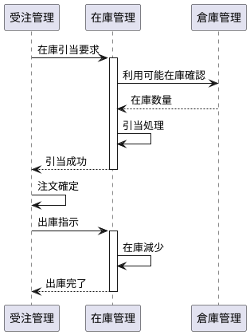

# 【第4部 第1章】イントロダクション：受注管理サービスの要件定義

第4部では、第3部で構築した在庫管理システムに受注管理機能を追加し、受注管理システムとして完成させます。

## 本章の目的

本章では、受注管理サービスの全体像を把握し、実装する機能とその背景にあるビジネス要件を理解します。具体的には：

- 第3部で実装した在庫管理システムの振り返り
- 卸売事業者D社の受注業務フローの理解
- 受注管理システムが解決すべき技術的課題の明確化

## 1.1 第3部の振り返り

第3部では、卸売事業者D社の在庫管理システムを構築しました。ここでは、その実装内容を振り返り、受注管理システムとの連携ポイントを確認します。

### 実装した集約

第3部で実装した5つの集約：

| 集約 | 責務 | 主要なコマンド |
|------|------|--------------|
| **Product集約** | 商品情報の管理（SKU、カテゴリ、価格、保管条件） | CreateProduct, UpdatePrice |
| **Warehouse集約** | 倉庫情報の管理（3拠点：東京、大阪、福岡） | RegisterWarehouse, UpdateCapacity |
| **WarehouseZone集約** | 倉庫内区画の管理（常温、冷蔵、冷凍） | CreateZone, AdjustCapacity |
| **Inventory集約** | 在庫数量の管理と受払処理 | Receive, Ship, Transfer, Adjust |
| **Customer集約** | 取引先情報の管理 | RegisterCustomer, UpdateInfo |

### 在庫受払処理の実績

**処理規模**:
- 1日約2,000件の受払トランザクション
- 月間約60,000件の在庫移動

**処理タイプ別の内訳**:

```
入庫処理（Purchase Order Receipt）: 15%（300件/日）
  - 仕入先からの商品入荷
  - 入荷検収後に在庫へ反映

出庫処理（Sales Order Shipment）: 70%（1,400件/日）
  - 顧客への商品出荷
  - 注文に基づく在庫引当と出庫

倉庫間移動（Transfer）: 10%（200件/日）
  - 需要に応じた拠点間の在庫移動
  - 東京倉庫 ⇄ 大阪倉庫 ⇄ 福岡倉庫

在庫調整（Adjustment）: 5%（100件/日）
  - 棚卸による在庫差異の調整
  - 破損・劣化による在庫減少
```

### 技術的実装の特徴

**1. 競合制御**

```scala
// 楽観的ロックによる在庫更新
final case class Inventory(
  id: InventoryId,
  productId: ProductId,
  warehouseId: WarehouseId,
  zoneId: ZoneId,
  quantity: Quantity,
  version: Version  // 楽観的ロックのバージョン番号
) {
  def reserve(quantity: Quantity): Either[InventoryError, Inventory] = {
    if (this.quantity >= quantity) {
      Right(copy(quantity = this.quantity - quantity, version = version.increment))
    } else {
      Left(InsufficientStock(this.quantity, quantity))
    }
  }
}
```

**2. イベント順序保証**

Apache Pekko Persistenceを使用し、イベントの順序付き処理を保証：

```scala
// イベントの順序が保証される
def eventHandler: EventHandler[State, Event] = {
  case (state, InventoryReceived(productId, quantity, timestamp)) =>
    state.addStock(quantity)

  case (state, InventoryShipped(productId, quantity, timestamp)) =>
    state.reduceStock(quantity)
}
```

**3. 区画別在庫管理**

保管条件に基づく在庫配置：

| 区画タイプ | 商品カテゴリ | 比率 | 倉庫別配置 |
|----------|------------|------|----------|
| 常温区画 | 日用品、調味料、乾物 | 60% | 東京50%、大阪30%、福岡20% |
| 冷蔵区画 | 要冷蔵食品、乳製品 | 30% | 東京50%、大阪30%、福岡20% |
| 冷凍区画 | 冷凍食品、アイス | 10% | 東京50%、大阪30%、福岡20% |

### 受注管理システムとの連携ポイント

第4部で追加する受注管理機能は、第3部の在庫管理システムと以下のように連携します：



**連携のポイント**:
1. **在庫引当**: 注文確定前に在庫を確保（Reserve）
2. **引当解放**: 注文キャンセル時に引当を解放（Release）
3. **出庫処理**: 注文確定後に実際の在庫を減少（Ship）

## 1.2 卸売事業者D社の受注業務

### 事業規模

D社は年商150億円の中堅卸売事業者として、食品・日用品を取り扱っています。

**事業指標**:
- **年商**: 150億円
- **取引先数**: 430社
- **商品アイテム数**: 約8,000 SKU
- **倉庫拠点**: 3拠点（東京、大阪、福岡）
- **従業員数**: 約250名

**月次取引実績**:

| 指標 | 数値 | 備考 |
|------|------|------|
| 月間受注件数 | 約50,000件 | 1日平均1,667件、ピーク時5,000件/日 |
| 月間売上高 | 約12.5億円 | 年商150億円 ÷ 12ヶ月 |
| 1件あたり平均金額 | 300,000円 | 12.5億円 ÷ 50,000件 |
| 1件あたり平均品目数 | 15品目 | 大口50品目、中口20品目、小口5品目の加重平均 |

### 取引先タイプ別の分析

D社の取引先は、取引規模により3つのタイプに分類されます：

#### 大口取引先（30社）

**特徴**:
- 大手スーパーマーケットチェーン、量販店
- 全体の30社で売上の60%を占める
- 定期発注パターン（週次〜隔週）

**取引条件**:
- 月間取引額: 1,000万円以上
- 与信限度額: 3,000万円
- 支払条件: 月末締め翌月末払い

**注文パターン**:
- 平均注文金額: 500万円/件
- 平均品目数: 50品目/件
- 注文頻度: 週1回程度
- 月間注文件数: 約4件/社 × 30社 = 120件

**ビジネス上の重要性**:
- 安定した大量発注により売上の柱となる
- 与信管理が特に重要（1件の未回収で大きな損失）
- 価格交渉力が強く、特別価格の設定が必要

#### 中口取引先（150社）

**特徴**:
- 地域スーパー、飲食チェーン、食品加工業者
- 全体の150社で売上の30%を占める
- 準定期発注（週1〜2回）

**取引条件**:
- 月間取引額: 100万円〜1,000万円
- 与信限度額: 500万円
- 支払条件: 月末締め翌月末払い

**注文パターン**:
- 平均注文金額: 50万円/件
- 平均品目数: 20品目/件
- 注文頻度: 週1〜2回
- 月間注文件数: 約6件/社 × 150社 = 900件

**ビジネス上の重要性**:
- バランスの取れた取引規模
- 特定カテゴリに集中した注文傾向
- 長期的な取引関係の構築が重要

#### 小口取引先（250社）

**特徴**:
- 個人商店、小規模飲食店、自営業者
- 全体の250社で売上の10%を占める
- 不定期発注（需要に応じて随時）

**取引条件**:
- 月間取引額: 100万円未満
- 与信限度額: 100万円
- 支払条件: 月末締め翌月末払い

**注文パターン**:
- 平均注文金額: 5万円/件
- 平均品目数: 5品目/件
- 注文頻度: 不定期（週0〜3回）
- 月間注文件数: 約200件/社 × 250社 = 50,000件（※実際は一部の活発な取引先に偏る）

**ビジネス上の重要性**:
- 件数は多いが売上への寄与は限定的
- 与信リスクは相対的に低い
- 新規取引先の開拓余地が大きい

**取引先タイプ別の売上構成**:

```
大口取引先（30社）: 90億円（60%）
中口取引先（150社）: 45億円（30%）
小口取引先（250社）: 15億円（10%）
```

### 受注フロー

D社の受注業務は、以下の9つのステップで構成されます：

```
┌─────────────────────────────────────────────┐
│ 1. 見積もり作成                              │
│    - 取引先からの見積もり依頼                │
│    - 商品、数量、単価、納期、有効期限を提示  │
└─────────────────────────────────────────────┘
                      ↓
┌─────────────────────────────────────────────┐
│ 2. 見積もり承認（取引先による承認）          │
│    - 取引先が見積もり内容を確認              │
│    - 承認 or 再見積もり依頼                  │
└─────────────────────────────────────────────┘
                      ↓
┌─────────────────────────────────────────────┐
│ 3. 注文受付                                  │
│    - 見積もりからの注文変換                  │
│    - または直接注文（見積もり不要の場合）    │
└─────────────────────────────────────────────┘
                      ↓
┌─────────────────────────────────────────────┐
│ 4. 与信チェック                              │
│    - 与信限度額の確認                        │
│    - 現在の与信使用額と注文金額の合算チェック│
└─────────────────────────────────────────────┘
                      ↓
┌─────────────────────────────────────────────┐
│ 5. 在庫引当                                  │
│    - 複数倉庫から最適な倉庫を選定            │
│    - 在庫の引当（Reserve）                   │
└─────────────────────────────────────────────┘
                      ↓
┌─────────────────────────────────────────────┐
│ 6. 注文確定                                  │
│    - 注文ステータスを「確定」に変更          │
│    - 取引先へ確定通知                        │
└─────────────────────────────────────────────┘
                      ↓
┌─────────────────────────────────────────────┐
│ 7. 出荷指示                                  │
│    - 倉庫への出荷指示                        │
│    - ピッキングリストの発行                  │
└─────────────────────────────────────────────┘
                      ↓
┌─────────────────────────────────────────────┐
│ 8. 請求書発行（月末締め）                    │
│    - 月次で請求書を集計                      │
│    - 取引先へ請求書送付                      │
└─────────────────────────────────────────────┘
                      ↓
┌─────────────────────────────────────────────┐
│ 9. 入金確認                                  │
│    - 銀行口座への入金確認                    │
│    - 請求書と入金の突合                      │
└─────────────────────────────────────────────┘
```

#### フローの特徴とビジネスルール

**1. 見積もりベースの商談（ステップ1〜2）**

BtoB取引では、事前に見積もりを提示し、承認を得てから正式注文を受け付けるケースが多くあります。

- **見積もり有効期限**: 通常30日間
- **見積もりからの注文変換**: 承認後、そのまま注文に変換可能
- **価格保証**: 見積もり時点の価格を有効期限内は保証

**2. 与信チェックの必須化（ステップ4）**

注文確定前に必ず与信枠をチェックし、与信超過を防止します。

```scala
// 与信チェックのビジネスルール
def checkCredit(
  customerId: CustomerId,
  orderAmount: Money
): Either[CreditError, CreditApproval] = {
  val currentUsage = calculateCurrentUsage(customerId)
  val creditLimit = getCreditLimit(customerId)
  val availableCredit = creditLimit - currentUsage

  if (orderAmount <= availableCredit) {
    Right(CreditApproval(customerId, orderAmount))
  } else {
    Left(CreditExceeded(availableCredit, orderAmount))
  }
}
```

**与信チェックのポイント**:
- 現在の与信使用額 = 確定済み注文の未入金分の合計
- 利用可能額 = 与信限度額 - 与信使用額
- 注文金額 ≦ 利用可能額 の場合のみ注文を受け付け

**3. 在庫引当の自動化（ステップ5）**

複数倉庫から最適な倉庫を選定し、自動的に在庫を引き当てます。

**引当ロジック**:
1. **取引先の所在地に最も近い倉庫を優先**
   - 東京の取引先 → 東京倉庫
   - 大阪・名古屋の取引先 → 大阪倉庫
   - 九州の取引先 → 福岡倉庫

2. **在庫が不足している場合は次候補の倉庫から引当**
   - 例: 東京倉庫で在庫不足 → 大阪倉庫から引当

3. **複数倉庫にまたがる引当も可能**
   - 大量注文の場合、複数倉庫から分割引当

**4. 月次締め請求（ステップ8）**

個別注文ごとではなく、月末締めで請求書を発行します。

- **締日**: 毎月末日
- **請求書発行**: 翌月5営業日以内
- **支払期限**: 翌月末日
- **請求単位**: 取引先ごとに1枚の請求書

## 1.3 技術的課題

受注管理システムの実装にあたり、以下の技術的課題に対応する必要があります。

### 課題1: 分散トランザクション

受注処理は、複数の集約（Order、Inventory、CreditLimit、Shipping）にまたがるため、分散トランザクションの一貫性保証が必要です。

#### なぜACIDトランザクションが使えないのか

従来のRDBMSのACIDトランザクションでは、以下の理由により対応できません：

**1. 長時間トランザクション**
- 注文作成から出荷指示まで数分〜数時間かかる
- データベースのロックを長時間保持することは現実的でない

**2. 異なるデータストアへのアクセス**
- Write Model（DynamoDB）: イベント保存
- Read Model（PostgreSQL）: クエリ用のビュー
- 異なるデータベース間での2フェーズコミットは複雑かつ遅い

**3. スケーラビリティの制約**
- 分散ロックはシステムのスケーラビリティを阻害
- 月間50,000件の処理に耐えられない

#### 具体的な課題シナリオ

**シナリオ: 注文確定プロセス**

```
1. 注文作成（Order集約）
2. 在庫引当（Inventory集約）← 在庫不足で失敗する可能性
3. 与信チェック（CreditLimit集約）← 与信超過で失敗する可能性
4. 注文確定（Order集約）
5. 出荷指示（Shipping集約）← 出荷準備ができず失敗する可能性
```

**課題**:
- ステップ2で在庫引当が成功したが、ステップ3で与信チェックが失敗した場合、ステップ2で引き当てた在庫を解放する必要がある
- ステップ4まで成功したが、ステップ5で出荷準備が失敗した場合、注文をキャンセルし、在庫と与信枠を解放する必要がある

#### 解決策: Sagaパターン

**Orchestration型のSagaパターンを採用**:

```scala
// Saga Orchestrator
class OrderSagaOrchestrator {
  def startSaga(orderId: OrderId): Future[SagaResult] = {
    for {
      // ステップ1: 注文作成
      order <- createOrder(orderId)

      // ステップ2: 在庫引当
      reservation <- reserveStock(order)
        .recoverWith { case e: StockReservationError =>
          // 補償: 注文をキャンセル
          cancelOrder(orderId)
          Future.failed(e)
        }

      // ステップ3: 与信チェック
      credit <- checkCredit(order)
        .recoverWith { case e: CreditCheckError =>
          // 補償: 在庫解放 + 注文キャンセル
          releaseStock(reservation) *>
          cancelOrder(orderId)
          Future.failed(e)
        }

      // ステップ4: 注文確定
      confirmed <- confirmOrder(orderId)

      // ステップ5: 出荷指示
      shipping <- issueShippingInstruction(confirmed)
        .recoverWith { case e: ShippingError =>
          // 補償: 与信解放 + 在庫解放 + 注文キャンセル
          releaseCredit(credit) *>
          releaseStock(reservation) *>
          cancelOrder(orderId)
          Future.failed(e)
        }
    } yield SagaCompleted(orderId)
  }
}
```

**Sagaパターンの利点**:
- **補償トランザクション**: 失敗時に逆操作を実行して整合性を保つ
- **べき等性**: 同じコマンドを複数回実行しても結果が変わらない
- **タイムアウト処理**: 各ステップにタイムアウトを設定し、無限待機を防止

### 課題2: 金額計算の整合性

金額計算では、浮動小数点演算の丸め誤差により、1円単位のズレが発生するリスクがあります。

#### 浮動小数点の問題

```scala
// ❌ 浮動小数点演算の問題
val price = 0.1
val quantity = 0.2
val total = price + quantity  // 0.30000000000000004（期待値: 0.3）

// ❌ 税金計算での問題
val baseAmount = 1234.0
val taxRate = 0.10
val taxAmount = baseAmount * taxRate  // 123.39999999999999（期待値: 123.4）
```

#### 解決策: BigDecimal + Money値オブジェクト

```scala
// ✅ BigDecimalを使用した正確な10進数演算
final case class Money(
  amount: BigDecimal,
  currency: Currency = Currency.JPY
) {
  require(amount.scale <= 2, "金額は小数点以下2桁まで")

  def +(other: Money): Money = {
    require(currency == other.currency, "通貨が一致しません")
    Money(amount + other.amount, currency)
  }

  def *(multiplier: BigDecimal): Money = {
    Money(amount * multiplier, currency)
  }

  // 丸め処理（四捨五入）
  def round(scale: Int = 0): Money = {
    Money(
      amount.setScale(scale, BigDecimal.RoundingMode.HALF_UP),
      currency
    )
  }
}
```

**税金計算の例**:

```scala
val baseAmount = Money(BigDecimal("1234"))
val taxRate = BigDecimal("0.10")
val taxAmount = (baseAmount * taxRate).round(0)  // 123円（正確）
val totalAmount = baseAmount + taxAmount  // 1,357円
```

#### 計算順序の明確化

割引と税金の適用順序により金額が変わるため、計算順序を明確に定義：

```
1. 小計 = 単価 × 数量
2. 割引後金額 = 小計 - 割引額
3. 税額 = 割引後金額 × 税率（円未満四捨五入）
4. 合計金額 = 割引後金額 + 税額
```

### 課題3: パフォーマンス要件

大量の注文処理を高速に処理する必要があります。

#### 処理能力の要件

| 指標 | 通常時 | ピーク時 | 目標レスポンス |
|------|--------|---------|--------------|
| 注文作成 | 1,667件/日 | 5,000件/日 | 1秒以内 |
| 与信チェック | 1,667件/日 | 5,000件/日 | 100ms以内 |
| 注文照会 | 10,000件/日 | 30,000件/日 | 500ms以内 |
| 在庫引当 | 1,667件/日 | 5,000件/日 | 2秒以内 |

#### 解決策1: キャッシング

**Redis を使用したキャッシング戦略**:

```scala
// 与信情報のキャッシュ
class CreditCheckService(
  creditRepository: CreditLimitRepository,
  cache: RedisCache
) {
  def checkCredit(
    customerId: CustomerId,
    orderAmount: Money
  ): Future[Either[CreditError, CreditApproval]] = {
    // キャッシュから与信情報を取得
    cache.get[CreditLimit](s"credit:$customerId").flatMap {
      case Some(credit) =>
        // キャッシュヒット: 高速にチェック
        Future.successful(credit.check(orderAmount))

      case None =>
        // キャッシュミス: リポジトリから取得してキャッシュに保存
        creditRepository.find(customerId).flatMap { credit =>
          cache.set(s"credit:$customerId", credit, ttl = 60.seconds)
          Future.successful(credit.check(orderAmount))
        }
    }
  }
}
```

**キャッシュ戦略**:
- 与信情報: TTL 60秒（更新頻度が低い）
- 注文ステータス: TTL 60秒（リアルタイム性が必要）
- 注文明細（確定後）: 永続的（変更されないため）

#### 解決策2: CQRS の活用

Read Model（PostgreSQL）を最適化し、注文照会クエリを高速化：

```sql
-- 注文一覧照会用のインデックス
CREATE INDEX idx_orders_customer_date
  ON orders(customer_id, order_date DESC);

-- 注文ステータス別の照会用インデックス
CREATE INDEX idx_orders_status_date
  ON orders(status, order_date DESC);

-- 全文検索用のインデックス
CREATE INDEX idx_orders_fulltext
  ON orders USING gin(to_tsvector('japanese', order_number || ' ' || customer_name));
```

#### 解決策3: 非同期処理

Saga による非同期処理で、ユーザー応答性を向上：

```scala
// 注文作成APIは即座にレスポンスを返す
def createOrder(request: CreateOrderRequest): Future[CreateOrderResponse] = {
  for {
    // 注文を作成（同期処理）
    order <- orderService.create(request)

    // Sagaを非同期で開始（レスポンスを待たない）
    _ = sagaOrchestrator.startSaga(order.id)

  } yield CreateOrderResponse(
    orderId = order.id,
    status = OrderStatus.Processing,
    message = "注文を受け付けました。処理状況は注文詳細画面でご確認ください。"
  )
}
```

## 本章のまとめ

本章では、受注管理サービスの要件定義を行いました：

**第3部の振り返り**:
- 在庫管理システムで実装した5つの集約（Product、Warehouse、WarehouseZone、Inventory、Customer）
- 1日2,000件の在庫受払処理
- 楽観的ロックとイベント順序保証による整合性の保証

**D社の受注業務**:
- 年商150億円、月間50,000件の受注処理
- 3タイプの取引先（大口30社、中口150社、小口250社）
- 9ステップの受注フロー（見積もり→注文→与信チェック→在庫引当→出荷→請求→入金）

**技術的課題**:
1. **分散トランザクション**: Sagaパターンによる補償トランザクション
2. **金額計算の整合性**: BigDecimal + Money値オブジェクトによる正確な計算
3. **パフォーマンス**: キャッシング、CQRS、非同期処理による高速化

次章では、これらの要件を満たすデータモデルの設計を行います。
