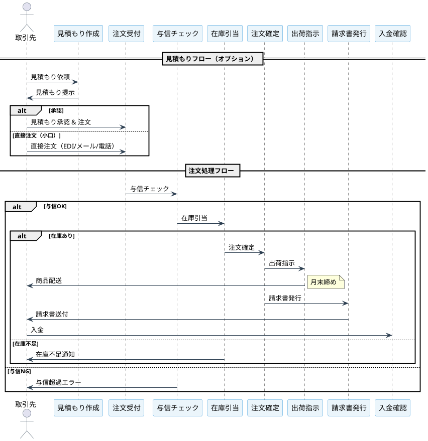
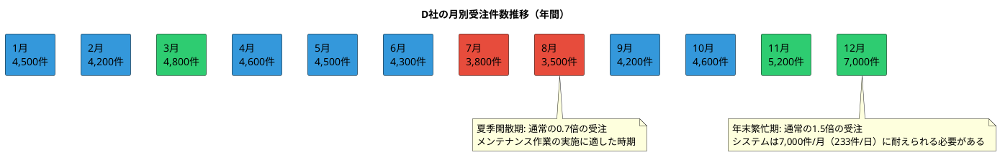
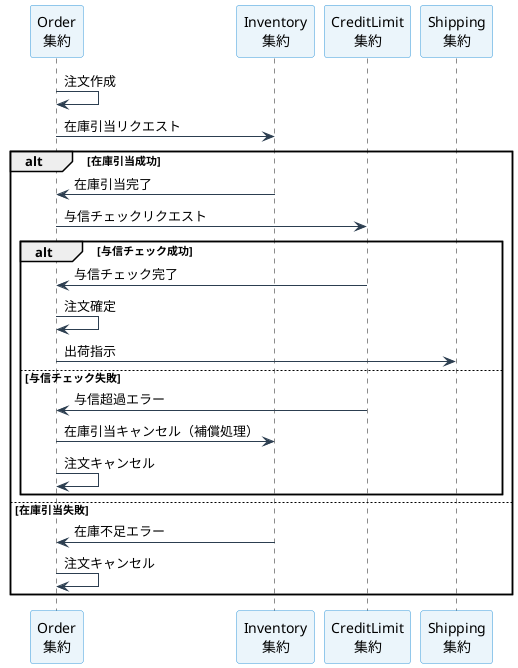

# 第4部 第1章：受注管理サービスの全体像

## 本章の目的

第3部では、在庫管理サービスを題材に、CQRS/イベントソーシングアーキテクチャによる実践的な実装方法を学びました。第4部では、その在庫管理システムに受注管理機能を追加し、受注管理システムとして完成させます。

本章では、受注管理サービスの全体像を把握し、ビジネス要件と技術的課題を明確にします。

## 1.1 第3部の振り返り

### 1.1.1 在庫管理システムで実装した内容

第3部では、卸売事業者D社の在庫管理システムを構築しました。以下の内容を実装しました：

**実装した集約**
- **Product集約**: 商品マスタの管理（8,000品目のSKU）
- **Warehouse集約**: 倉庫マスタの管理（3拠点）
- **WarehouseZone集約**: 倉庫区画の管理（9区画、保管条件別）
- **Inventory集約**: 在庫受払処理（1日2,000件）
- **Customer集約**: 取引先マスタの管理（430社）

**実装した機能**
- 在庫受払処理（入荷、出荷、移動、調整）
- 在庫引当機能（楽観的ロック + CAS）
- 在庫照会API（GraphQL、Materialized View）
- パフォーマンス最適化（Redis、Pekko Streams、Gatling）
- 運用とモニタリング（Prometheus、Grafana、監査ログ）

**アーキテクチャ上の特徴**
- イベントソーシング: DynamoDBにイベントを永続化
- CQRS: コマンド側（Pekko）とクエリ側（PostgreSQL + GraphQL）の分離
- ハイブリッドアーキテクチャ: マスタデータはCRUD、トランザクションはイベントソーシング

### 1.1.2 第3部でスコープ外とした機能

第3部では、在庫管理に焦点を当てたため、以下の機能をスコープ外としました：

- **受注管理**: 見積もり、注文の作成、確定、キャンセル
- **金額計算**: 商品単価、税金、割引の計算
- **与信管理**: 取引先ごとの与信限度額チェック
- **請求管理**: 請求書発行、入金管理
- **返品処理**: 返品受付、在庫への戻し入れ
- **分散トランザクション**: 注文、在庫、与信の一貫性保証

第4部では、これらの機能を追加し、受注管理システムとして完成させます。

## 1.2 卸売事業者D社の受注業務

### 1.2.1 事業規模

D社は、食品・日用品の卸売事業者として、以下の規模で事業を展開しています：

| 指標 | 規模 |
|-----|-----|
| 年商 | 150億円 |
| 取引先数 | 430社 |
| 月間受注件数 | 約50,000件 |
| 1件あたり平均金額 | 300,000円 |
| 取扱商品数 | 8,000品目（SKU単位） |
| 拠点数 | 3拠点（東京、大阪、福岡） |

### 1.2.2 取引先タイプ

D社の取引先は、取引規模に応じて3つのタイプに分類されます：

| タイプ | 社数 | 月間取引額 | 与信限度額 | 特徴 |
|-------|-----|----------|----------|-----|
| 大口取引先 | 30社 | 1,000万円以上 | 3,000万円 | スーパーマーケットチェーン、コンビニチェーン |
| 中口取引先 | 150社 | 100万円〜1,000万円 | 500万円 | 地域スーパー、飲食チェーン |
| 小口取引先 | 250社 | 100万円未満 | 100万円 | 個人商店、小規模飲食店 |

**取引先タイプ別の注文パターン**
- **大口取引先**: 大量注文（平均50品目、500万円/件）、週次発注
- **中口取引先**: 中量注文（平均20品目、50万円/件）、週次〜隔週発注
- **小口取引先**: 少量注文（平均5品目、5万円/件）、不定期発注

### 1.2.3 受注フロー

D社の受注フローは、以下のステップで構成されます：



**各ステップの詳細**

1. **見積もり作成**: 取引先の要望に基づき見積もりを作成
   - 作成チャネル: EDI（大口）、メール（中口）、電話（小口）
   - 見積もり内容: 商品、数量、単価、納期、有効期限（通常30日）
   - 合計金額の計算（税込み）

2. **見積もり承認**: 取引先が見積もり内容を確認し承認
   - 承認期限: 有効期限内
   - 承認後は見積もり金額が確定

3. **注文受付**: 見積もりから注文を作成、または直接注文を受け付ける
   - 見積もりからの注文: 見積もり内容をそのまま注文に変換
   - 直接注文: 見積もりなしで注文を受け付け（小口取引先に多い）
   - 注文内容: 商品、数量、配送先、配送希望日

4. **与信チェック**: 取引先の与信限度額を確認
   - 与信限度額 - 現在使用額 >= 注文金額
   - 100ms以内のレスポンス時間

5. **在庫引当**: 複数倉庫から最適な在庫を引き当てる
   - 配送先に最も近い倉庫から引き当て
   - 在庫不足の場合は代替倉庫を検索
   - 引当後は在庫を確保（他の注文では使用不可）

6. **注文確定**: 注文を確定し、出荷可能な状態にする
   - 注文ステータス: Created → StockReserved → CreditApproved → Confirmed

7. **出荷指示**: 倉庫に出荷指示を送る
   - ピッキングリスト作成
   - 配送業者への連絡

8. **請求書発行**: 月末締めで請求書を発行
   - 当月の確定済注文を集計
   - 請求金額 = Σ(注文金額 + 税金)

9. **入金確認**: 入金を確認し、与信枠を開放
   - 入金方法: 振込、手形、現金
   - 入金期限: 翌月末

### 1.2.4 季節変動

D社の受注業務には、以下の季節変動があります：



**ピーク時の要件**
- 最大受注件数: 7,000件/月（12月）
- 1日あたり最大: 約233件（平日稼働日ベース）
- 時間あたり最大: 約30件（8時間稼働ベース）
- ピーク時の同時処理: 5〜10件

## 1.3 技術的課題

受注管理システムを実装する上で、以下の技術的課題があります。

### 1.3.1 分散トランザクション

受注処理は、複数の集約をまたがるトランザクションです：



**課題**
- 複数の集約の状態を一貫性を保って更新する必要がある
- 一部の処理が失敗した場合、補償処理（Compensation）が必要
- ネットワーク障害やタイムアウトへの対応が必要

**解決策: Sagaパターン（Orchestration）**
- OrderSagaオーケストレーターが全体の調整を行う
- 各ステップの成功/失敗を記録し、補償処理を実行
- イベントソーシングにより、Sagaの状態を永続化

### 1.3.2 金額計算の整合性

金額計算では、以下の要件があります：

**要件**
- 浮動小数点演算の回避（精度の問題）
- 税金計算の正確性（標準税率10%、軽減税率8%）
- 割引適用ルールの実装
- 端数処理のルール（四捨五入、切り捨て、切り上げ）

**課題**
- JavaのdoubleやScalaのDoubleは浮動小数点演算のため精度が保証されない
- 金額計算では1円単位の精度が必要

**解決策: BigDecimalとMoney値オブジェクト**

```scala
final case class Money(
  amount: BigDecimal,
  currency: Currency = Currency.JPY
) {
  // 加算
  def +(other: Money): Money = {
    require(currency == other.currency, "通貨が一致しません")
    Money(amount + other.amount, currency)
  }

  // 乗算
  def *(multiplier: BigDecimal): Money = {
    Money(amount * multiplier, currency)
  }

  // 四捨五入
  def round(scale: Int = 0): Money = {
    Money(amount.setScale(scale, BigDecimal.RoundingMode.HALF_UP), currency)
  }
}

final case class TaxRate(rate: BigDecimal) {
  def calculate(amount: Money): Money = {
    (amount * rate).round(0)
  }
}

// 使用例
val unitPrice = Money(BigDecimal("1000"), Currency.JPY)
val quantity = Quantity(3)
val subtotal = unitPrice * BigDecimal(quantity.value) // 3,000円

val taxRate = TaxRate(BigDecimal("0.10")) // 10%
val tax = taxRate.calculate(subtotal) // 300円

val total = subtotal + tax // 3,300円
```

**注意点**
- BigDecimalは不変（immutable）なので、演算ごとに新しいインスタンスが生成される
- 通貨の不一致チェックを行う（JPYとUSDを加算しないようにする）
- 端数処理のタイミングを明確にする（行ごとに丸めるか、最後に丸めるか）

### 1.3.3 パフォーマンス要件

受注管理システムには、以下のパフォーマンス要件があります：

| 処理 | 要件 | 根拠 |
|-----|-----|-----|
| 注文作成 | 500ms以内 | ユーザー体験の観点から |
| 与信チェック | 100ms以内 | 注文作成の一部として実行されるため |
| 在庫引当 | 200ms以内 | 注文作成の一部として実行されるため |
| 注文照会 | 200ms以内 | リアルタイム性が求められるため |
| 請求書発行 | 10分以内 | バッチ処理で実行（月末1回） |

**課題**
- 月間50,000件の注文処理（1日平均1,667件、ピーク時5,000件）
- 与信チェックの高速化（メモリキャッシュの利用）
- 注文照会の高速化（Materialized Viewの利用）

**解決策**
- Pekko Clusterによる水平スケーリング
- Redisによる与信情報のキャッシング
- PostgreSQLのMaterialized Viewによる注文集計の事前計算

### 1.3.4 データの整合性

受注管理システムでは、以下のデータ整合性を保つ必要があります：

**イベントソーシング側（DynamoDB）**
- Quotation集約のイベント（QuotationCreated、QuotationApproved、QuotationExpired、QuotationConvertedToOrder、etc.）
- Order集約のイベント（OrderCreated、OrderCreatedFromQuotation、StockReserved、CreditChecked、OrderConfirmed、etc.）
- CreditLimit集約のイベント（CreditReserved、CreditReleased、etc.）
- Sagaの状態（SagaStarted、StepCompleted、SagaCompleted、SagaFailed、etc.）

**CRUD側（PostgreSQL）**
- 商品マスタ（Product）
- 取引先マスタ（Customer）
- 倉庫マスタ（Warehouse、WarehouseZone）

**Read Model側（PostgreSQL）**
- 見積もり（Quotation）
- 見積もり明細（QuotationItem）
- 注文（Order）
- 注文明細（OrderItem）
- 与信（CreditLimit）
- 請求書（Invoice）
- 入金（Payment）

**課題**
- イベントソーシング側とRead Model側の結果整合性
- イベント処理の失敗時のリトライ
- イベントの順序保証

**解決策**
- Read Model Updaterによるイベントの非同期処理
- Pekko Persistence Queryによるイベントストリームの購読
- イベントのsequence番号による順序保証
- 冪等性のある更新処理

## 1.4 アーキテクチャ上の決定事項

### 1.4.1 Sagaパターンの選択

分散トランザクション（受注処理）の実装には、以下の2つのアプローチがあります：

| アプローチ | メリット | デメリット |
|----------|---------|----------|
| **Orchestration**（オーケストレーション） | - 中央集権的な制御で処理フローが明確<br>- デバッグやモニタリングが容易<br>- 補償処理の実装が容易 | - Orchestratorが単一障害点になる可能性<br>- Orchestratorの複雑度が高くなる |
| **Choreography**（コレオグラフィ） | - 各サービスが自律的に動作<br>- スケーラビリティが高い | - 処理フローが分散しているため把握が困難<br>- デバッグが難しい |

**決定**: 本システムでは**Orchestrationパターン**を採用します。

**理由**
- 受注処理のフローは比較的単純（見積もり → 注文 → 在庫 → 与信 → 確定 → 出荷）
- 処理フローの可視化とデバッグの容易さを優先
- 将来的な処理フローの変更に対応しやすい

### 1.4.2 金額計算の実装方針

**決定**: BigDecimalを使用したMoney値オブジェクトを実装

**理由**
- 浮動小数点演算の精度問題を回避
- ドメイン駆動設計のValue Objectパターンに従う
- 通貨の不一致を型安全にチェック

**実装例**

```scala
// ドメイン層
final case class Money(amount: BigDecimal, currency: Currency)
final case class TaxRate(rate: BigDecimal)
final case class DiscountRate(rate: BigDecimal)

// ユースケース層
class OrderCalculationService {
  def calculateOrderTotal(
    orderItems: List[OrderItem],
    discountRate: Option[DiscountRate]
  ): Money = {
    val subtotal = orderItems.foldLeft(Money.zero(Currency.JPY)) { (acc, item) =>
      acc + item.subtotal
    }

    val discounted = discountRate match {
      case Some(rate) => subtotal * (BigDecimal(1) - rate.rate)
      case None => subtotal
    }

    val tax = orderItems.foldLeft(Money.zero(Currency.JPY)) { (acc, item) =>
      acc + item.taxAmount
    }

    discounted + tax
  }
}
```

### 1.4.3 集約の設計方針

**決定**: 以下の4つの集約を新規に実装

1. **Quotation集約**: 見積もりの管理（イベントソーシング）
2. **Order集約**: 注文の管理（イベントソーシング）
3. **CreditLimit集約**: 与信の管理（イベントソーシング）
4. **Invoice集約**: 請求書の管理（イベントソーシング）

**理由**
- 各集約は独立したトランザクション境界を持つ
- イベントソーシングにより、状態変更の履歴を保持
- Sagaパターンにより、複数集約間の一貫性を保証
- 見積もりは注文とは別のライフサイクルを持つため、独立した集約として管理

## 1.5 本章のまとめ

本章では、受注管理サービスの全体像を把握しました：

**ビジネス要件**
- 月間50,000件の受注処理（430社の取引先から）
- 3つの取引先タイプ（大口、中口、小口）
- 9ステップの受注フロー（見積もり作成 → 見積もり承認 → 注文受付 → 与信 → 在庫 → 確定 → 出荷 → 請求 → 入金）
- 見積もりから注文への変換、または直接注文の受付

**技術的課題**
- 分散トランザクション（Sagaパターン）
- 金額計算の整合性（BigDecimal + Money値オブジェクト）
- パフォーマンス要件（与信100ms、注文作成500ms）
- データの整合性（イベントソーシング + Read Model）

**アーキテクチャ上の決定**
- Orchestration型のSagaパターン
- BigDecimalを使用したMoney値オブジェクト
- 4つの新規集約（Quotation、Order、CreditLimit、Invoice）

次章では、受注管理サービスのデータモデルを設計します。Read Model（PostgreSQL）とイベントストア（DynamoDB）のスキーマを定義し、ドメインに適したテストデータを作成します。
