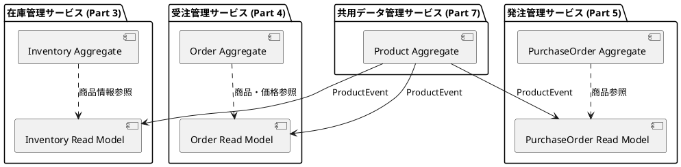
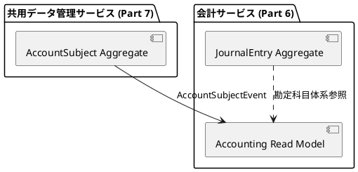

# 第7部 第1章 イントロダクション：共用データ管理サービスの要件定義

## 1.1 第3部〜第6部の振り返り

第7部では、複数のBounded Contextで共有されるマスターデータ（商品、勘定科目、共通コードなど）を一元管理する**共用データ管理サービス（Shared Data Management Service）**をイベントソーシングとCQRSパターンで実装します。

これまでの各部で構築したサービスでは、マスターデータが各Bounded Contextに分散して管理されていました。第7部では、これらのマスターデータを統合的に管理し、イベント駆動アーキテクチャで各サービスに変更を伝播させます。

### 1.1.1 在庫管理システム（第3部）

第3部では、D社の在庫管理システムをCQRS/イベントソーシングで実装しました。

**実装した機能**:
- 在庫受払処理（1日約2,000件）
- 在庫引当の競合制御（楽観的ロック）
- 複数拠点・区画管理（3拠点・9区画）
- 保管条件管理（常温・冷蔵・冷凍）

**マスターデータへの依存**:

在庫管理では、以下のマスターデータに依存していました。

```scala
// 在庫管理で必要なマスターデータ

// 商品マスター
case class Product(
  productId: ProductId,
  productCode: ProductCode,
  productName: ProductName,
  categoryCode: CategoryCode,
  unitOfMeasure: UnitOfMeasure,    // 在庫管理の単位として必要
  standardCost: Money,              // 在庫評価額の計算に必要
  storageCondition: StorageCondition // 保管条件（常温・冷蔵・冷凍）
)

// 倉庫マスター（第3部で実装）
case class Warehouse(
  warehouseId: WarehouseId,
  warehouseName: WarehouseName,
  location: Address
)
```

**マスターデータ変更の影響**:

| マスター変更 | 在庫管理への影響 |
|--------------|------------------|
| 商品名変更 | 在庫照会画面の表示更新 |
| 単位変更 | 在庫数量の単位変換が必要 |
| 保管条件変更 | 倉庫区画の再配置が必要 |
| 商品廃止 | 在庫処分または返品処理が必要 |

### 1.1.2 受注管理システム（第4部）

第4部では、在庫管理システムに受注管理機能を追加し、Sagaパターンによる分散トランザクションを実装しました。

**実装した機能**:
- 見積もり作成から注文への変換
- 受注処理（月間約50,000件）
- 与信管理（取引先別与信限度額）
- 請求書発行と入金管理
- OrderSaga（注文→与信チェック→在庫引当→確定→出荷）

**マスターデータへの依存**:

```scala
// 受注管理で必要なマスターデータ

// 商品マスター（価格情報）
case class ProductPrice(
  productId: ProductId,
  priceType: PriceType,          // 標準価格、特別価格、割引価格
  customerId: Option[CustomerId], // 特別価格の場合の取引先
  unitPrice: Money,
  validFrom: LocalDate,
  validTo: Option[LocalDate]
)

// 税率マスター
case class TaxRate(
  taxRateCode: String,
  taxRate: BigDecimal,           // 標準10%、軽減8%
  validFrom: LocalDate,
  validTo: Option[LocalDate]
)

// 顧客マスター（第4部で実装）
case class Customer(
  customerId: CustomerId,
  customerName: CustomerName,
  creditLimit: Money,            // 与信限度額
  paymentTerms: PaymentTerms     // 支払条件
)
```

**マスターデータ変更の影響**:

| マスター変更 | 受注管理への影響 |
|--------------|------------------|
| 商品価格変更 | 見積もり・注文単価の更新 |
| 税率変更 | 消費税計算ロジックの更新 |
| 顧客与信限度額変更 | 与信チェック結果への影響 |
| 商品廃止 | 新規受注の受付停止 |

### 1.1.3 発注管理システム（第5部）

第5部では、仕入先管理から発注、入荷検品、支払管理までの調達プロセス全体をイベントソーシングで実装しました。

**実装した機能**:
- 発注処理（月間約3,000件）
- 承認ワークフロー（金額に応じた多段階承認）
- 入荷検品と差異管理
- 3-way matching（発注・入荷・請求の突合）
- 支払処理

**マスターデータへの依存**:

```scala
// 発注管理で必要なマスターデータ

// 商品マスター（発注情報）
case class ProductProcurement(
  productId: ProductId,
  primarySupplierId: SupplierId,    // 主要仕入先
  standardCost: Money,               // 標準原価
  leadTimeDays: Int,                 // リードタイム
  minimumOrderQuantity: Quantity     // 最小発注数量
)

// 仕入先マスター（第5部で実装）
case class Supplier(
  supplierId: SupplierId,
  supplierName: SupplierName,
  paymentTerms: PaymentTerms,
  evaluationScore: BigDecimal        // 仕入先評価スコア
)
```

**マスターデータ変更の影響**:

| マスター変更 | 発注管理への影響 |
|--------------|------------------|
| 標準原価変更 | 発注価格の見直し |
| 主要仕入先変更 | 自動発注の発注先変更 |
| リードタイム変更 | 発注タイミングの調整 |
| 仕入先評価変更 | 仕入先選定基準への影響 |

### 1.1.4 会計システム（第6部）

第6部では、これまでのビジネスイベントから会計仕訳を自動生成し、財務諸表を作成する機能を実装しました。

**実装した機能**:
- ビジネスイベントから仕訳への自動変換
- 総勘定元帳の管理
- 試算表・財務諸表の作成
- 月次・年次決算処理

**マスターデータへの依存**:

```scala
// 会計で必要なマスターデータ

// 勘定科目マスター
case class AccountSubject(
  accountSubjectId: AccountSubjectId,
  accountCode: AccountCode,
  accountName: AccountName,
  accountType: AccountType,          // 資産、負債、純資産、収益、費用
  subType: AccountSubType,           // 流動/固定、営業/営業外
  parentAccountId: Option[AccountSubjectId],
  level: Int,
  requiresAuxiliary: Boolean,        // 補助科目が必要か
  status: AccountSubjectStatus
)

// 部門マスター
case class Department(
  departmentCode: DepartmentCode,
  departmentName: DepartmentName,
  startYearMonth: YearMonth,
  endYearMonth: Option[YearMonth]
)

// 社員マスター
case class Employee(
  employeeCode: EmployeeCode,
  employeeName: EmployeeName,
  hireDate: LocalDate,
  terminationDate: Option[LocalDate],
  departmentCode: DepartmentCode,
  jobTitle: JobTitle
)
```

**マスターデータ変更の影響**:

| マスター変更 | 会計への影響 |
|--------------|------------------|
| 勘定科目追加・変更 | 仕訳ルールの更新 |
| 勘定科目体系変更 | 財務諸表の表示変更 |
| 部門統廃合 | 部門別損益の組替 |
| 社員の配置転換 | 経費配賦基準の変更 |

### 1.1.5 マスターデータ管理の課題

これまでの実装では、各Bounded Contextがそれぞれマスターデータを保持していました。この分散管理には以下の課題がありました。

**1. データの重複と不整合**

```
在庫管理の商品マスター:
  商品コード: "P-001"
  商品名: "有機玄米 5kg"
  標準原価: 2,000円

受注管理の商品マスター:
  商品コード: "P-001"
  商品名: "有機玄米 5kg袋"  ← 表記が微妙に異なる
  定価: 3,500円

発注管理の商品マスター:
  商品コード: "P-001"
  商品名: "有機玄米（5kg）"  ← さらに異なる表記
  標準原価: 2,100円        ← 原価も不一致
```

**2. 変更の伝播漏れ**

商品マスターを更新した場合、すべてのBounded Contextに変更を反映する必要がありますが、手動での同期は漏れが発生しやすい状況でした。

```
商品価格改定の例:

1. 営業部門が商品P-001の定価を3,500円→3,800円に変更
2. 受注管理システムには反映
3. しかし在庫管理システムには未反映
   → 在庫評価額の計算に古い価格を使用
4. 発注管理システムにも未反映
   → 発注推奨価格の計算が不正確
```

**3. 監査証跡の不足**

誰が、いつ、なぜマスターデータを変更したのか、完全な履歴を追跡することが困難でした。

**4. データ品質の低下**

- 重複データの登録（同じ商品が異なるコードで登録される）
- 必須項目の未入力
- 無効なデータへの参照（廃止された商品への注文）

### 1.1.6 今回追加する機能

第7部では、これらの課題を解決するため、**共用データ管理サービス**を実装します。

**新規に実装する集約**:

1. **Product集約**: 商品マスターの一元管理
2. **AccountSubject集約**: 勘定科目マスターの一元管理
3. **CodeMaster集約**: 共通コード（税率、支払条件、配送方法など）の管理

**注記**: 顧客（Customer）は第4部（受注管理）で、仕入先（Supplier）は第5部（発注管理）でそれぞれのBounded Contextの集約として実装済みです。共用データ管理サービスでは、複数のコンテキストで共有される商品と勘定科目、共通コードのみを管理します。

**イベント駆動マスターデータ同期の全体像**:

```
┌────────────────────────────────────┐
│ 共用データ管理サービス (第7部)     │
│                                    │
│ ┌──────────┐  ┌─────────────┐    │
│ │商品マスター│  │勘定科目マスター│    │
│ └─────┬────┘  └──────┬──────┘    │
│       │                  │          │
└───────┼──────────────────┼──────────┘
        │ ProductEvent     │ AccountSubjectEvent
        │                  │
        ├──────────────────┼──────────────────┐
        │                  │                  │
        ▼                  ▼                  ▼
┌────────────┐    ┌────────────┐    ┌────────────┐
│在庫管理    │    │受注管理    │    │会計        │
│(第3部)     │    │(第4部)     │    │(第6部)     │
│            │    │            │    │            │
│商品情報参照│    │商品・価格  │    │勘定科目    │
│            │    │参照        │    │体系参照    │
└────────────┘    └────────────┘    └────────────┘
                         ▲
                         │
                  ┌──────┴───────┐
                  │発注管理       │
                  │(第5部)        │
                  │               │
                  │商品参照       │
                  └───────────────┘
```

**マスターデータ変更イベントの伝播例**:

```scala
// 1. 共用データ管理サービスで商品価格を変更
ProductAggregate ! ChangeProductPrice(
  productId = ProductId("P-001"),
  newPrice = Money(3800),
  effectiveFrom = LocalDate.of(2024, 4, 1)
)

// 2. ProductPriceChangedイベントが発行される
ProductPriceChanged_V1(
  productId = "P-001",
  oldPrice = 3500,
  newPrice = 3800,
  effectiveFrom = "2024-04-01",
  changedBy = "user-12345",
  reason = "原材料費高騰による価格改定"
)

// 3. 各Bounded Contextがイベントを購読して、Read Modelを更新
// - 在庫管理: 在庫評価額の再計算
// - 受注管理: 見積もり・注文の単価更新
// - 発注管理: 発注推奨価格の更新
```

## 1.2 卸売事業者D社のマスターデータ管理要件

### 1.2.1 事業規模

D社では、以下の規模のマスターデータを管理しています。

**マスターデータの規模**:

```scala
// D社のマスターデータ規模（2024年度）
final case class MasterDataScale(
  // 商品マスター
  productCount: Int = 5000,               // 5,000種類のSKU
  activeProductCount: Int = 4500,         // うち有効な商品
  obsoleteProductCount: Int = 500,        // 廃止済み商品

  // 顧客マスター（第4部で管理）
  customerCount: Int = 430,               // 430社の取引先
  largeCustomerCount: Int = 30,           // 大口顧客
  mediumCustomerCount: Int = 150,         // 中口顧客
  smallCustomerCount: Int = 250,          // 小口顧客

  // 仕入先マスター（第5部で管理）
  supplierCount: Int = 200,               // 200社の仕入先

  // 勘定科目マスター
  accountSubjectCount: Int = 500,         // 500科目
  activeAccountCount: Int = 150,          // うち使用中の科目

  // 倉庫・拠点マスター
  warehouseCount: Int = 5,                // 5拠点の倉庫
  warehouseZoneCount: Int = 15,           // 各倉庫に3区画ずつ

  // 組織・従業員マスター
  departmentCount: Int = 20,              // 20部門
  employeeCount: Int = 1000,              // 1,000名の従業員

  // 月間マスター変更件数
  monthlyMasterChanges: Int = 1500        // 約1,500件/月
)
```

**年間マスター変更の内訳**:

| マスター種類 | 月間変更件数 | 年間変更件数 | 主な変更理由 |
|--------------|--------------|--------------|--------------|
| 商品マスター | 500件 | 6,000件 | 商品情報更新、価格改定 |
| 商品価格 | 300件 | 3,600件 | 定期的な価格改定 |
| 顧客マスター | 50件 | 600件 | 顧客情報更新、与信変更 |
| 仕入先マスター | 30件 | 360件 | 仕入先情報更新、評価変更 |
| 勘定科目マスター | 50件 | 600件 | 会計年度変更、科目追加 |
| コードマスター | 20件 | 240件 | 税率変更、支払条件変更 |
| 組織・従業員 | 550件 | 6,600件 | 人事異動、入退社 |
| **合計** | **1,500件** | **18,000件** | |

### 1.2.2 マスターデータ管理のビジネスフロー

D社のマスターデータ管理は、以下のフローで実施されます。

**商品マスター管理フロー**:

```
1. 新商品登録申請
   ↓
2. 商品コード採番（自動）
   ↓
3. 商品情報入力
   - 商品名、カテゴリ
   - 単位、標準原価、定価
   - 主要仕入先、リードタイム
   - 保管条件
   ↓
4. 承認（商品管理部門長）
   ↓
5. マスター登録（有効化）
   ↓
6. 変更イベント発行
   ↓
7. 各システムへ同期
   - 在庫管理: 在庫受入可能に
   - 受注管理: 受注可能に
   - 発注管理: 発注可能に
```

**価格改定フロー**:

```
1. 価格改定申請
   - 対象商品リスト
   - 新価格
   - 適用開始日
   - 改定理由
   ↓
2. 影響分析
   - 既存見積もりへの影響
   - 既存受注への影響
   - 粗利率への影響
   ↓
3. 承認（営業部門長 → 役員）
   ↓
4. 価格改定実施
   ↓
5. 変更イベント発行
   ↓
6. 各システムへ同期
   - 受注管理: 新規見積もりから新価格適用
   - 在庫管理: 在庫評価額の再計算
```

**勘定科目マスター管理フロー**:

```
1. 勘定科目追加申請
   - 科目コード
   - 科目名
   - 科目区分（資産、負債、純資産、収益、費用）
   - 親勘定科目
   ↓
2. 会計基準適合性チェック
   ↓
3. 承認（経理部門長）
   ↓
4. マスター登録
   ↓
5. 変更イベント発行
   ↓
6. 会計システムへ同期
   - 仕訳入力時に新科目が選択可能に
   - 財務諸表の表示に反映
```

### 1.2.3 マスターデータの品質要件

D社では、以下のデータ品質基準を満たす必要があります。

**1. 完全性（Completeness）**

```scala
// 必須項目のチェック
case class Product(
  productCode: ProductCode,        // 必須
  productName: ProductName,        // 必須
  categoryCode: CategoryCode,      // 必須
  unitOfMeasure: UnitOfMeasure,    // 必須
  standardCost: Money,             // 必須
  listPrice: Money,                // 必須
  description: Option[String]      // 任意
)

// バリデーションルール
def validateProduct(product: Product): Either[ValidationError, Product] = {
  for {
    _ <- validateNotEmpty(product.productCode, "商品コードは必須です")
    _ <- validateNotEmpty(product.productName, "商品名は必須です")
    _ <- validatePositive(product.standardCost, "標準原価は正の値である必要があります")
    _ <- validatePositive(product.listPrice, "定価は正の値である必要があります")
  } yield product
}
```

**2. 正確性（Accuracy）**

```scala
// 金額の精度
// BigDecimalを使用して正確な10進数演算
case class Money(amount: BigDecimal, currency: Currency = Currency.JPY) {
  require(amount.scale <= 0, "金額は整数である必要があります")
  require(amount >= 0, "金額は0以上である必要があります")
}

// 税率の精度
case class TaxRate(rate: BigDecimal) {
  require(rate.scale <= 2, "税率は小数点以下2桁までです")
  require(rate >= 0 && rate <= 1, "税率は0〜1の範囲である必要があります")
}
```

**3. 一意性（Uniqueness）**

```scala
// 商品コードの一意性
// データベースレベルでユニーク制約
CREATE UNIQUE INDEX idx_products_code ON products(product_code);

// 重複チェック
def checkDuplicateProductCode(
  productCode: ProductCode
): Future[Either[DuplicateError, Unit]] = {
  productRepository.findByCode(productCode).map {
    case Some(_) => Left(DuplicateError(s"商品コード ${productCode.value} は既に存在します"))
    case None => Right(())
  }
}
```

**4. 整合性（Consistency）**

```scala
// 参照整合性のチェック
def validateProductReferences(product: Product): Either[ValidationError, Unit] = {
  for {
    // カテゴリコードの存在確認
    _ <- categoryRepository.findByCode(product.categoryCode)
      .toRight(ValidationError("存在しないカテゴリコードです"))

    // 主要仕入先の存在確認（設定されている場合）
    _ <- product.primarySupplierId.traverse { supplierId =>
      supplierRepository.findById(supplierId)
        .toRight(ValidationError("存在しない仕入先IDです"))
    }
  } yield ()
}
```

**5. 適時性（Timeliness）**

```scala
// 有効期間の管理
case class ValidPeriod(
  validFrom: LocalDate,
  validTo: Option[LocalDate]
) {
  def isValidAt(date: LocalDate): Boolean = {
    date.compareTo(validFrom) >= 0 &&
    validTo.forall(to => date.compareTo(to) <= 0)
  }
}

// 将来日付での価格改定
case class ProductPrice(
  productId: ProductId,
  unitPrice: Money,
  validPeriod: ValidPeriod
)

// 2024年4月1日から有効な新価格を事前登録
val newPrice = ProductPrice(
  productId = ProductId("P-001"),
  unitPrice = Money(3800),
  validPeriod = ValidPeriod(
    validFrom = LocalDate.of(2024, 4, 1),
    validTo = None
  )
)
```

### 1.2.4 技術的課題

共用データ管理サービスの実装には、以下の技術的課題があります。

**1. マスターデータのイベントソーシング**

```scala
// 商品マスターの全変更履歴を追跡
sealed trait ProductEvent
object ProductEvent {
  case class ProductCreated_V1(
    productId: String,
    productCode: String,
    productName: String,
    categoryCode: String,
    standardCost: BigDecimal,
    listPrice: BigDecimal,
    createdBy: String,
    createdAt: String
  ) extends ProductEvent

  case class ProductInfoUpdated_V1(
    productId: String,
    productName: Option[String],
    categoryCode: Option[String],
    updatedBy: String,
    updatedAt: String,
    reason: String
  ) extends ProductEvent

  case class ProductPriceChanged_V1(
    productId: String,
    oldPrice: BigDecimal,
    newPrice: BigDecimal,
    effectiveFrom: String,
    changedBy: String,
    reason: String
  ) extends ProductEvent

  case class ProductObsoleted_V1(
    productId: String,
    obsoletedBy: String,
    obsoletedAt: String,
    reason: String
  ) extends ProductEvent
}
```

**2. イベント駆動マスターデータ同期**

```scala
// 商品マスター変更イベントの購読
class InventoryReadModelUpdater extends Actor {
  def receive: Receive = {
    case ProductPriceChanged_V1(productId, oldPrice, newPrice, effectiveFrom, _, _) =>
      // 在庫評価額の再計算
      updateInventoryValuation(productId, newPrice)

    case ProductObsoleted_V1(productId, _, _, _) =>
      // 廃止商品の在庫チェック
      checkObsoleteProductInventory(productId)
  }
}

class OrderReadModelUpdater extends Actor {
  def receive: Receive = {
    case ProductPriceChanged_V1(productId, oldPrice, newPrice, effectiveFrom, _, _) =>
      // 新規見積もり・注文の単価更新
      updateProductPriceInReadModel(productId, newPrice, effectiveFrom)

    case ProductObsoleted_V1(productId, _, _, _) =>
      // 廃止商品の受注停止
      markProductAsUnavailable(productId)
  }
}
```

**3. マスターデータのバージョニング**

```scala
// 有効期間によるバージョン管理
case class ProductPriceHistory(
  productId: ProductId,
  prices: List[ProductPrice]
) {
  // 指定日時点での価格を取得
  def priceAt(date: LocalDate): Option[ProductPrice] = {
    prices
      .filter(_.validPeriod.isValidAt(date))
      .sortBy(_.validPeriod.validFrom)(Ordering[LocalDate].reverse)
      .headOption
  }

  // 新しい価格を追加（有効期間の重複チェック）
  def addPrice(newPrice: ProductPrice): Either[ValidationError, ProductPriceHistory] = {
    val overlapping = prices.exists(_.validPeriod.overlaps(newPrice.validPeriod))
    if (overlapping) {
      Left(ValidationError("有効期間が既存の価格と重複しています"))
    } else {
      Right(copy(prices = newPrice :: prices))
    }
  }
}
```

**4. 変更承認ワークフロー**

```scala
// 重要な変更には承認が必要
sealed trait ApprovalStatus
object ApprovalStatus {
  case object Draft extends ApprovalStatus           // 下書き
  case object PendingApproval extends ApprovalStatus // 承認待ち
  case object Approved extends ApprovalStatus        // 承認済み
  case object Rejected extends ApprovalStatus        // 却下
}

case class PriceChangeRequest(
  requestId: RequestId,
  productId: ProductId,
  currentPrice: Money,
  requestedPrice: Money,
  effectiveFrom: LocalDate,
  reason: String,
  requestedBy: UserId,
  requestedAt: Instant,
  status: ApprovalStatus,
  approvedBy: Option[UserId],
  approvedAt: Option[Instant],
  rejectionReason: Option[String]
)

// 承認Saga
class PriceChangeApprovalSaga extends EventSourcedBehavior[Command, Event, State] {
  // 1. 価格変更申請
  // 2. 承認者に通知
  // 3. 承認待ち
  // 4a. 承認 → 価格変更適用
  // 4b. 却下 → 申請者に通知
}
```

**5. データ品質管理**

```scala
// 重複チェック（類似商品名の検出）
def findSimilarProductNames(
  productName: String
): Future[List[Product]] = {
  // レーベンシュタイン距離で類似度を計算
  productRepository.findAll().map { products =>
    products.filter { product =>
      val distance = levenshteinDistance(
        productName.toLowerCase,
        product.productName.value.toLowerCase
      )
      distance <= 3 // 編集距離3以内を類似とみなす
    }
  }
}

// データクレンジング
def normalizeProductName(name: String): String = {
  name
    .trim                              // 前後の空白を削除
    .replaceAll("\\s+", " ")           // 連続する空白を1つに
    .replaceAll("[０-９]", c => (c - '０' + '0').toChar.toString) // 全角数字を半角に
}
```

## 1.3 共用データ管理サービスのアーキテクチャ

### 1.3.1 システム構成

```
┌─────────────────────────────────────────────────────────┐
│ 共用データ管理サービス                                   │
│                                                         │
│ ┌────────────────┐  ┌────────────────┐                │
│ │ Command API    │  │ Query API      │                │
│ │ (GraphQL)      │  │ (GraphQL)      │                │
│ └───────┬────────┘  └────────┬───────┘                │
│         │                     │                         │
│         ▼                     ▼                         │
│ ┌────────────────┐  ┌────────────────┐                │
│ │ Product        │  │ Read Model     │                │
│ │ Aggregate      │  │ (PostgreSQL)   │                │
│ │                │  │                │                │
│ │ AccountSubject │  │ - products     │                │
│ │ Aggregate      │  │ - product_     │                │
│ │                │  │   prices       │                │
│ │ CodeMaster     │  │ - account_     │                │
│ │ Aggregate      │  │   subjects     │                │
│ └───────┬────────┘  │ - code_masters │                │
│         │           └────────────────┘                │
│         │ Events                                       │
│         ▼                                              │
│ ┌────────────────┐                                    │
│ │ Event Store    │                                    │
│ │ (DynamoDB)     │                                    │
│ └───────┬────────┘                                    │
└─────────┼──────────────────────────────────────────────┘
          │ DynamoDB Streams
          ▼
┌─────────────────────┐
│ Event Processor     │
│ (Lambda)            │
└──────────┬──────────┘
           │ イベント配信
           │
           ├──────────────────┬──────────────────┬──────────────────┐
           ▼                  ▼                  ▼                  ▼
    ┌──────────┐      ┌──────────┐      ┌──────────┐      ┌──────────┐
    │在庫管理  │      │受注管理  │      │発注管理  │      │会計      │
    │Read Model│      │Read Model│      │Read Model│      │Read Model│
    └──────────┘      └──────────┘      └──────────┘      └──────────┘
```

### 1.3.2 Bounded Context間の連携

共用データ管理サービスは、他のBounded Contextと以下のように連携します。

**商品マスターの参照関係**:



**勘定科目マスターの参照関係**:



### 1.3.3 パフォーマンス要件

**マスター照会のパフォーマンス目標**:

| 操作 | 目標レスポンスタイム | 備考 |
|------|---------------------|------|
| 商品検索（商品コード） | 50ms以内 | インデックス使用 |
| 商品検索（商品名部分一致） | 200ms以内 | 全文検索インデックス |
| 商品価格照会（指定日時点） | 100ms以内 | Materialized View使用 |
| 勘定科目照会 | 50ms以内 | 階層構造の取得を含む |
| マスター一覧取得（ページング） | 500ms以内 | 1ページ20件 |

**マスター更新のパフォーマンス目標**:

| 操作 | 目標レスポンスタイム | 備考 |
|------|---------------------|------|
| 商品作成 | 500ms以内 | バリデーション含む |
| 商品情報更新 | 300ms以内 | 即座に反映 |
| 価格変更（承認不要） | 300ms以内 | イベント発行まで |
| 価格変更（承認必要） | 1秒以内 | 承認申請登録まで |
| イベント伝播 | 5秒以内 | 各Read Modelへの反映 |

## 1.4 まとめ

第7部では、以下の内容を実装します。

**実装する機能**:

1. **商品マスター管理**: 商品情報、価格、仕入先情報の一元管理
2. **勘定科目マスター管理**: 勘定科目体系、補助科目の管理
3. **コードマスター管理**: 税率、支払条件、配送方法などの共通コード管理
4. **イベント駆動同期**: マスター変更イベントの各Bounded Contextへの配信
5. **変更承認ワークフロー**: 重要な変更への承認フロー
6. **データ品質管理**: バリデーション、重複チェック、データクレンジング
7. **監査証跡**: イベントソーシングによる完全な変更履歴の保持

**学習する技術**:

- マスターデータのイベントソーシング
- イベント駆動マスターデータ同期パターン
- マスターデータのバージョニング（有効期間管理）
- 承認Sagaの実装
- データ品質チェックの実装
- Materialized Viewによる参照最適化

次章以降で、これらの機能を順次実装していきます。
